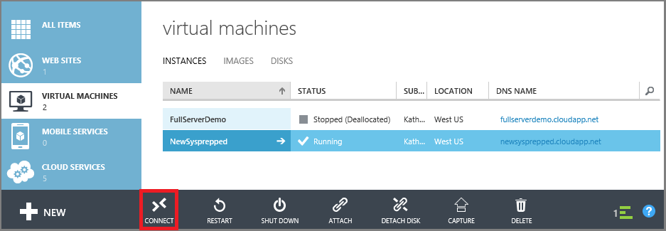

<properties
    pageTitle="Melden Sie sich an einen klassischen Azure-virtuellen | Microsoft Azure"
    description="Mithilfe des Azure klassischen Portals Anmelden bei einem Windows-Computer mit dem Bereitstellungsmodell klassischen erstellt."
    services="virtual-machines-windows"
    documentationCenter=""
    authors="cynthn"
    manager="timlt"
    editor="tysonn"
    tags="azure-service-management"/>

<tags
    ms.service="virtual-machines-windows"
    ms.workload="infrastructure-services"
    ms.tgt_pltfrm="vm-windows"
    ms.devlang="na"
    ms.topic="article"
    ms.date="07/28/2016"
    ms.author="cynthn"/>

# Melden Sie sich bei einem Windows-Computer mit dem klassischen Azure-portal

Im Portal Azure klassischen verwenden Sie die Schaltfläche **Verbinden** zum Starten einer Sitzung Remotedesktop für, und melden Sie sich an einen Windows-virtuellen aus.

Möchten Sie die Verbindung zu einem Linux VM? Informationen Sie [zum Anmelden bei einer virtuellen Computern mit Linux](virtual-machines-linux-mac-create-ssh-keys.md).

Erfahren Sie, wie [Führen Sie diese Schritte mithilfe der neues Azure-Portal](virtual-machines-windows-connect-logon.md).

[AZURE.INCLUDE [learn-about-deployment-models](../../includes/learn-about-deployment-models-classic-include.md)] 

## Video Exemplarische Vorgehensweise

Hier ist eine video exemplarische die Schritte in diesem Lernprogramm. Es behandelt auch das Endpunkte und öffentlichen und privaten Ports für das Herstellen einer Verbindung mit einen virtuellen Windows Azure Computer verwendet.

[AZURE.VIDEO logging-on-to-vm-running-windows-server-on-azure]

## Herstellen einer Verbindung des virtuellen Computers mit

1. Melden Sie sich zum klassischen Azure-Portal aus.

2. Klicken Sie auf **virtuellen Computern**, und wählen Sie dann den virtuellen Computer.

3. Klicken Sie auf der Befehlsleiste am unteren Rand der Seite auf **Verbinden**.

    
    
> [AZURE.TIP] Wenn die Schaltfläche **Verbinden** nicht verfügbar ist, finden Sie unter Tipps zur Problembehandlung am Ende dieses Artikels.

## Melden Sie sich bei der virtuellen Computern

[AZURE.INCLUDE [virtual-machines-log-on-win-server](../../includes/virtual-machines-log-on-win-server.md)]

## Nächste Schritte

-   Wenn die Schaltfläche **Verbinden** inaktiv oder andere mit der Verbindung Remotedesktop Probleme, versuchen Sie die Konfiguration. Klicken Sie aus dem Dashboard virtuellen Computern unter **Schnellen Blick**, auf **remote-Konfiguration zurücksetzen**.
-   Versuchen Sie bei Problemen mit Ihr Kennwort ein es. Klicken Sie aus dem Dashboard virtuellen Computern unter **Schnellen Blick**, auf **Kennwort zurücksetzen**.

Wenn Sie diese Tipps nicht funktionieren oder nicht, was Sie benötigen, finden Sie unter [Behandeln von Problemen mit Remote Desktop-Verbindungen zu einem Windows-basierten Azure virtuellen Computern](virtual-machines-windows-troubleshoot-rdp-connection.md). In diesem Artikel führt Sie durch die Diagnose und Behebung von häufig auftretenden Problemen.

