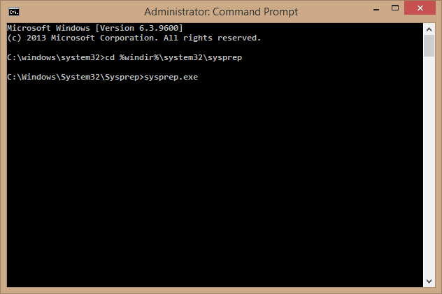
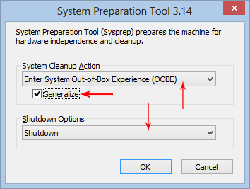

<properties
    pageTitle="Erstellen und Hochladen einer virtuellen Computer Bilds mithilfe der Powershell | Microsoft Azure"
    description="Informationen Sie zum Erstellen und Hochladen einer mit dem Modell zur klassischen Bereitstellung und Azure Powershell GRG Windows Server Bilds (virtuelle Festplatte)."
    services="virtual-machines-windows"
    documentationCenter=""
    authors="cynthn"
    manager="timlt"
    editor="tysonn"
    tags="azure-service-management"/>

<tags
    ms.service="virtual-machines-windows"
    ms.workload="infrastructure-services"
    ms.tgt_pltfrm="vm-windows"
    ms.devlang="na"
    ms.topic="article"
    ms.date="07/21/2016"
    ms.author="cynthn"/>

# Erstellen und eine Windows Server virtuelle Festplatte auf Azure hochladen

In diesem Artikel wird gezeigt, wie Sie ein eigenes Bild GRG virtueller Computer als eine virtuelle Festplatte (virtuelle Festplatte) hochladen, damit Sie es zum Erstellen von virtuellen Computern verwenden können. Weitere Details Datenträger und virtuelle Festplatten in Microsoft Azure finden Sie unter [Informationen zu Festplatten und virtueller Festplatten für virtuelle Computer](virtual-machines-linux-about-disks-vhds.md).

[AZURE.INCLUDE [learn-about-deployment-models](../../includes/learn-about-deployment-models-classic-include.md)]. Sie können auch [Hochladen](virtual-machines-windows-upload-image.md) einer virtuellen Computern mithilfe des Modells Ressourcenmanager. 

## Erforderliche Komponenten

In diesem Artikel wird vorausgesetzt, dass Sie haben:

- **Ein Azure-Abonnement** – Wenn Sie eine besitzen, können Sie [ein Azure-Konto kostenlos öffnen](/pricing/free-trial/?WT.mc_id=A261C142F).

- **[Microsoft Azure PowerShell](../powershell-install-configure.md)** - aktiviertem Microsoft Azure PowerShell-Modul installiert und konfiguriert werden, um Ihr Abonnement zu verwenden. 

- **A . Virtuelle Festplatte Datei** – unterstützten Windows-Betriebssystem in einer VHD-Datei gespeichert und mit einem virtuellen Computer angefügt. Überprüfen Sie, wenn die Serverrollen für die virtuelle Festplatte ausgeführt von Sysprep unterstützt werden. Weitere Informationen finden Sie unter [Sysprep-Unterstützung für Serverrollen](https://msdn.microsoft.com/windows/hardware/commercialize/manufacture/desktop/sysprep-support-for-server-roles).

> [AZURE.IMPORTANT] Das VHDX-Format wird in Microsoft Azure nicht unterstützt. Sie können den Datenträger mithilfe von Hyper-V-Manager oder das [Cmdlet konvertieren-virtuelle Festplatte](http://technet.microsoft.com/library/hh848454.aspx)virtuelle Festplatte-Format konvertieren. Weitere Informationen finden Sie unter diese ["BlogPost"](http://blogs.msdn.com/b/virtual_pc_guy/archive/2012/10/03/using-powershell-to-convert-a-vhd-to-a-vhdx.aspx).

## Schritt 1: Vorbereiten der virtuellen Festplatte 

Bevor Sie die virtuelle Festplatte in Azure hochladen, muss es mit dem Tool Sysprep GRG werden. Danach kann die virtuelle Festplatte als ein Bild verwendet werden soll. Ausführliche Informationen zu Sysprep finden Sie unter [wie Sysprep verwenden: ein Einführung](http://technet.microsoft.com/library/bb457073.aspx). Sichern Sie den virtuellen Computer aus, bevor Sie Sysprep starten.

Führen Sie aus den virtuellen Computern, dem das Betriebssystem installiert wurde die folgenden Schritte aus:

1. Melden Sie sich an das Betriebssystem aus.

2. Öffnen Sie ein Eingabeaufforderungsfenster als Administrator an. Wechseln Sie zu **%windir%\system32\sysprep**, und führen Sie `sysprep.exe`.

    

3.  Das **Tool zum Vorbereiten** -Dialogfeld wird angezeigt.

    

4.  Klicken Sie im **Tool zum Vorbereiten** **Out-of-Box-Experience (OOBE) für System** wählen Sie aus, und stellen Sie sicher, dass **verallgemeinern** aktiviert ist.

5.  Wählen Sie **war(en)** **War(en) Optionen**aus.

6.  Klicken Sie auf **OK**.

## Schritt 2: Erstellen eines Speicherkonto und eines Containers

Benötigen Sie ein Speicherkonto in Azure, so dass Sie einen Speicherort zum Hochladen der VHD-Datei. Dieser Schritt wird gezeigt, wie ein Konto erstellen, oder rufen Sie benötigte Informationen in ein vorhandenes Konto. Ersetzen Sie die Variablen in &lsaquo; Klammern &rsaquo; durch Ihre eigenen Daten.

1. Anmeldung

        Add-AzureAccount

1. Legen Sie Ihr Abonnement Azure.

        Select-AzureSubscription -SubscriptionName <SubscriptionName> 

2. Erstellen Sie ein neues Speicherkonto an. Der Name des Speicherkontos sollten eindeutig sein, 3-24 Zeichen. Der Name kann eine beliebige Kombination aus Buchstaben und Zahlen sein. Sie müssen außerdem einen Speicherort wie "Osten uns" angeben
        
        New-AzureStorageAccount –StorageAccountName <StorageAccountName> -Location <Location>

3. Festlegen Sie das neue Speicherkonto als Standard.
        
        Set-AzureSubscription -CurrentStorageAccountName <StorageAccountName> -SubscriptionName <SubscriptionName>

4. Erstellen Sie einen neuen Container.

        New-AzureStorageContainer -Name <ContainerName> -Permission Off

 

## Schritt 3: Hochladen der VHD-Datei

Verwenden der [Hinzufügen-AzureVhd](http://msdn.microsoft.com/library/dn495173.aspx) die virtuelle Festplatte hochladen.

Geben Sie den folgenden Befehl aus dem Azure PowerShell-Fenster, das Sie im vorherigen Schritt verwendet haben, und Ersetzen Sie die Variablen in &lsaquo; Klammern &rsaquo; durch Ihre eigenen Daten.

        Add-AzureVhd -Destination "https://<StorageAccountName>.blob.core.windows.net/<ContainerName>/<vhdName>.vhd" -LocalFilePath <LocalPathtoVHDFile>

## Schritt 4: Hinzufügen des Bilds zu Ihrer Liste von benutzerdefinierten Bildern

Verwenden Sie das Cmdlet [AzureVMImage hinzufügen](https://msdn.microsoft.com/library/mt589167.aspx) , das Bild in der Liste Ihrer benutzerdefinierten Bilder hinzufügen.

        Add-AzureVMImage -ImageName <ImageName> -MediaLocation "https://<StorageAccountName>.blob.core.windows.net/<ContainerName>/<vhdName>.vhd" -OS "Windows"

## Nächste Schritte

Sie können jetzt mit dem Bild, das Sie hochgeladen [erstellen ein benutzerdefiniertes virtuellen Computers](virtual-machines-windows-classic-createportal.md) .

