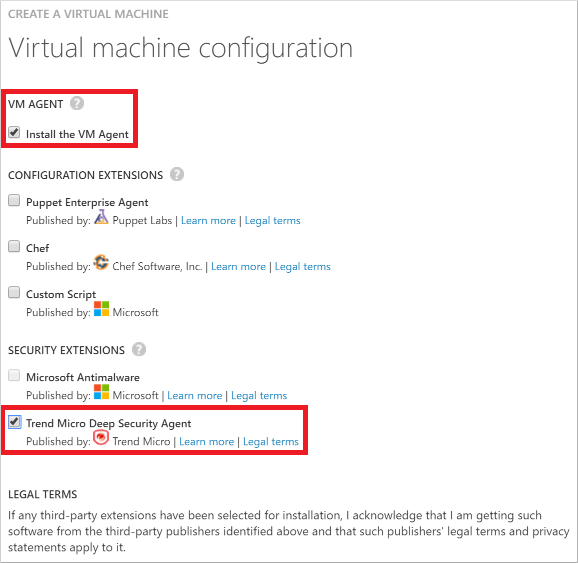

<properties
    pageTitle="Installieren von Trend Micro Tiefe Sicherheit auf einen virtuellen | Microsoft Azure"
    description="Dieser Artikel beschreibt, wie installieren und Konfigurieren von Trend Micro Sicherheit auf einen virtuellen Computer mit dem Bereitstellungsmodell klassischen in Azure erstellt wird."
    services="virtual-machines-windows"
    documentationCenter=""
    authors="iainfoulds"
    manager="timlt"
    editor=""
    tags="azure-service-management"/>

<tags
    ms.service="virtual-machines-windows"
    ms.workload="infrastructure-services"
    ms.tgt_pltfrm="vm-multiple"
    ms.devlang="na"
    ms.topic="article"
    ms.date="08/24/2016"
    ms.author="iainfou"/>

# So installieren und Konfigurieren von Trend Micro Tiefe Security als auf einen virtuellen Windows-Dienst

[AZURE.INCLUDE [learn-about-deployment-models](../../includes/learn-about-deployment-models-classic-include.md)]

In diesem Artikel wird das Installieren und Konfigurieren von Trend Micro Tiefe Security als Dienst auf einem neuen oder vorhandenen virtuellen Computer (virtueller Computer) unter Windows Server veranschaulicht. Tiefe Sicherheit als Service beinhaltet Schutz vor Schadsoftware, eine Firewall, ein System für Intrusionsprävention, und Integrität zu überwachen.

Der Client wird als Erweiterung Sicherheit über den Agent virtuellen Computer installiert. Klicken Sie auf einen neuen virtuellen Computer installieren Sie zusammen mit der Tiefe-Agent des virtuellen Computer-Agents aus. Klicken Sie auf eine vorhandene virtuellen Computern, die der virtuellen Computer-Agent aufweist, müssen Sie zum Herunterladen und installieren Sie es zuerst. In diesem Artikel werden die beiden Situationen behandelt.

Wenn Sie die vorhandenes Abonnement von Trend Micro für eine lokale Lösung verfügen, können Sie es zum Schutz Ihrer Azure-virtuellen Computern verwenden. Wenn Sie einen Kunden nicht noch befinden, können Sie bei einem Testabonnement anmelden. Weitere Informationen zu dieser Lösung finden Sie unter der Trend Micro [Microsoft Azure virtueller Computer-Agent-Erweiterung für Tiefe Sicherheit](http://go.microsoft.com/fwlink/p/?LinkId=403945)als Blogbeitrag.

## Installieren der Tiefe-Agent einen neuen virtuellen Computers

Das [Azure klassischen Portal](http://manage.windowsazure.com) können Sie bei der Installation des virtuellen Computer-Agents und die Erweiterung Trend Micro Sicherheit, wenn Sie die Option **Aus der Katalog** zum Erstellen des virtuellen Computers verwenden. Wenn Sie einen einzelnen virtuellen Computern erstellen, ist mit dem Portal eine einfache Möglichkeit zum Schutz von Trend Micro hinzuzufügen.

Diese Option **Aus der Katalog** öffnet einen Assistenten, der Sie beim Einrichten des virtuellen Computers können. Sie verwenden die letzte Seite des Assistenten, um die virtuellen Computer-Agents und Trend Micro Sicherheit Erweiterung installiert haben. Allgemeine Anweisungen finden Sie unter [Erstellen eines virtuellen Computers ausführen Windows im klassischen Azure-Portal](virtual-machines-windows-classic-tutorial.md). Wenn Sie zur letzten Seite des Assistenten erhalten, führen Sie folgende Schritte aus:

1.  Klicken Sie unter **Virtueller Computer Agent**aktivieren Sie **Virtueller Computer-Agent installieren**.

2.  Aktivieren Sie unter **Sicherheit Extensions** **Trend Micro Tiefe Security Agent**aus.

    

3.  Klicken Sie auf das Häkchen zum Erstellen des virtuellen Computers.

## Installieren der Tiefe-Agent eines vorhandenen virtuellen Computers

Um den Agent eines vorhandenen virtuellen Computers zu installieren, benötigen Sie Folgendes:

- Die Azure PowerShell-Modul, Version 0.8.2 oder höher, auf dem lokalen Computer installierten. Sie können die Version von Azure PowerShell, die Sie mithilfe von installiert haben Überprüfen der **Get-Modul Azure | Tabelle formatieren Version** Befehl. Anweisungen und einen Link auf die neueste Version finden Sie unter [Informationen zum Installieren und konfigurieren Azure PowerShell](../powershell-install-configure.md). Melden Sie sich bei der Verwendung von Ihrem Abonnement Azure `Add-AzureAccount`.

- Der virtueller Computer-Agent auf dem Ziel virtuellen Computer installiert ist.

Überprüfen Sie zunächst, dass die virtuellen Computer-Agent bereits installiert ist. Füllen Sie in der Cloud-Dienstnamen und der Name des virtuellen Computers, und führen Sie die folgenden Befehle an einen Administrator Ebene Azure PowerShell Befehlszeile. Ersetzen Sie alles innerhalb der Anführungszeichen, einschließlich der < und > Zeichen.

    $CSName = "<cloud service name>"
    $VMName = "<virtual machine name>"
    $vm = Get-AzureVM -ServiceName $CSName -Name $VMName
    write-host $vm.VM.ProvisionGuestAgent

Wenn Sie die Cloud-Dienst und der Name des virtuellen Computers nicht kennen, führen Sie **Get-AzureVM** , um die Informationen für den virtuellen Computern Ihres aktuellen Abonnements anzuzeigen.

Der Befehl **Schreiben-Host** **True**zurück, ist der Agent virtuellen Computer installiert. Wenn **False**zurückgegeben wird, lesen Sie den Anweisungen und einen Link zur Downloadwebsite im Blog Azure bereitstellen [virtueller Computer-Agents und Erweiterungen - Teil 2](http://go.microsoft.com/fwlink/p/?LinkId=403947)aus.

Wenn der Agent virtuellen Computer installiert ist, führen Sie folgende Befehle aus.

    $Agent = Get-AzureVMAvailableExtension TrendMicro.DeepSecurity -ExtensionName TrendMicroDSA

    Set-AzureVMExtension -Publisher TrendMicro.DeepSecurity –Version $Agent.Version -ExtensionName TrendMicroDSA -VM $vm | Update-AzureVM

## Nächste Schritte

Es dauert einige Minuten, damit der Agent Starten ausgeführt, wenn es installiert ist. Anschließend müssen Sie Tiefe Sicherheit des virtuellen Computers zu aktivieren, damit sie eine Tiefe Sicherheits-Manager verwaltet werden kann. Finden Sie hier weitere Informationen zu erhalten:

- Trend des Artikel über diese Lösung, [Instant-On Cloud Security für Microsoft Azure](http://go.microsoft.com/fwlink/?LinkId=404101)
- Ein [Beispiel für Windows PowerShell-Skript](http://go.microsoft.com/fwlink/?LinkId=404100) zum Konfigurieren des virtuellen Computers
- [Anweisungen](http://go.microsoft.com/fwlink/?LinkId=404099) für die Stichprobe

## Zusätzliche Ressourcen

[So melden Sie sich mit einem virtuellen Computer unter Windows Server]

[Azure-virtuellen Computer-Erweiterungen und Funktionen]

<!--Link references-->
[So melden Sie sich mit einem virtuellen Computer unter Windows Server]: virtual-machines-windows-classic-connect-logon.md
[Azure-virtuellen Computer-Erweiterungen und Funktionen]: http://go.microsoft.com/fwlink/p/?linkid=390493&clcid=0x409
