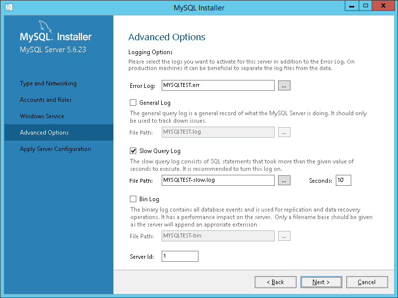
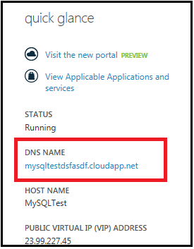

<properties
    pageTitle="Erstellen ein virtuellen Computers ausgeführt MySQL | Microsoft Azure"
    description="Erstellen einer Azure-virtuellen Computern unter Windows Server 2012 R2 und der MySQL-Datenbank mithilfe des Modells klassischen Bereitstellung."
    services="virtual-machines-windows"
    documentationCenter=""
    authors="cynthn"
    manager="timlt"
    editor="tysonn"
    tags="azure-service-management"/>

<tags
    ms.service="virtual-machines-windows"
    ms.workload="infrastructure-services"
    ms.tgt_pltfrm="vm-windows"
    ms.devlang="na"
    ms.topic="article"
    ms.date="07/25/2016"
    ms.author="cynthn"/>

# Installieren von MySQL auf mit dem klassischen Bereitstellungsmodell unter Windows Server 2012 R2 erstellten virtuellen Computers

[MySQL](http://www.mysql.com) ist ein gängiger open Source, SQL-Datenbank. In diesem Lernprogramm erfahren Sie, wie Sie installieren und Ausführen der Communityversion von MySQL 5.6.23 als MySQL-Server auf einem Computer unter Windows Server 2012 R2. Anweisungen zum Installieren von MySQL unter Linux, finden Sie unter: [So MySQL auf Azure installieren](virtual-machines-linux-mysql-install.md).

[AZURE.INCLUDE [learn-about-deployment-models](../../includes/learn-about-deployment-models-classic-include.md)]

## Erstellen einer virtuellen Computern unter Windows Server 2012 R2

Wenn Sie einen virtuellen Computer unter Windows Server 2012 R2 bereits besitzen, können Sie dieses [Lernprogramm](virtual-machines-windows-classic-tutorial.md) zum Erstellen des virtuellen Computers verwenden. 

## Fügen Sie einen Datenträger

Nach der Erstellung des virtuellen Computers können Sie optional einen zusätzliche Datenträger anfügen. Dies wird empfohlen für Produktionsarbeitslasten und um zu vermeiden, dass Speicherplatz auf dem Laufwerk OS (c), wozu auch das Betriebssystem.

Informationen Sie [zum Anfügen eines Datenträgers auf einem Windows-Computer](virtual-machines-windows-classic-attach-disk.md) , und folgen Sie den Anweisungen für einen leeren Datenträger anfügen. Stellen Sie die Host-Cache-Einstellung **keine** oder **schreibgeschützt**.

## Melden Sie sich bei der virtuellen Computern

Als Nächstes gestalten Sie [Melden Sie sich bei der virtuellen Computern](virtual-machines-windows-classic-connect-logon.md) , sodass Sie MySQL installieren können.

##Installieren und Ausführen von MySQL Community Server auf virtuellen Computers

Wie folgt vor, um zu installieren, konfigurieren und Ausführen der Community-Version von MySQL-Server:

> [AZURE.NOTE] Diese Schritte gelten für die 5.6.23.0 Community-Version von MySQL und Windows Server 2012 R2. Ihre Erfahrungen möglicherweise für unterschiedliche Versionen von MySQL oder Windows Server aus.

1.  Nachdem Sie mit der Verwendung von Remotedesktop virtuellen Computern verbunden haben, klicken Sie auf **Internet Explorer** vom Startbildschirm.
2.  Wählen Sie die Schaltfläche **Tools** in der oberen rechten Ecke (cogged Zahnradsymbol) aus, und klicken Sie dann auf **Internetoptionen**. Klicken Sie auf der Registerkarte **Sicherheit** , klicken Sie auf das Symbol **Vertrauenswürdige Sites** , und klicken Sie dann auf die Schaltfläche **Sites** . Hinzufügen von http://*. mysql.com zur Liste der vertrauenswürdigen Websites. Klicken Sie auf * *Schließen**, und klicken Sie dann auf * *OK**.
3.  Geben Sie in der Adressleiste von Internet Explorer, http://dev.mysql.com/downloads/mysql/ aus.
4.  Verwenden der MySQL-Website zu suchen, und Laden Sie die neueste Version des Installationsprogramms MySQL für Windows. Wenn Sie das Installationsprogramm MySQL auswählen, herunterladen Sie Version, die die vollständige Datei festlegen (beispielsweise der Mysql-Installer-Community-5.6.23.0.msi mit einer Größe von 282.4 MB), und speichern Sie das Installationsprogramm weist.
5.  Wenn das Installationsprogramm Download abgeschlossen ist, klicken Sie auf **Ausführen** , um Setup zu starten.
6.  Klicken Sie auf der Seite **Lizenzvertrag** akzeptieren Sie den Lizenzvertrag, und klicken Sie auf **Weiter**.
7.  Klicken Sie auf der Seite **einen Setup-Typ auswählen** klicken Sie auf den gewünschten Datentyp einrichten, und klicken Sie dann auf **Weiter**. Die folgenden Schritte gehen die Auswahl des Typs **nur Server** einrichten.
8.  Klicken Sie auf der Seite **Installation** auf **Ausführen**. Wenn die Installation abgeschlossen ist, klicken Sie auf **Weiter**.
9.  Klicken Sie auf der Seite **Produkt-Konfiguration** auf **Weiter**.
10. Geben Sie klicken Sie auf der Seite **Typ und Netzwerke** Ihre gewünschte Konfiguration Typ und Verbindungsproblemen Optionen an, einschließlich der TCP-, falls erforderlich. Wählen Sie **Erweiterte Optionen anzeigen**aus, und klicken Sie dann auf **Weiter**.

    

11. Geben Sie auf der Seite **Konten und Rollen** ein sicheres MySQL Root-Kennwort ein. Fügen Sie zusätzliche MySQL-Benutzerkonten hinzu, je nach Bedarf, und klicken Sie dann auf **Weiter**.

    

12. Klicken Sie auf der Seite **Windows-Dienst** Geben Sie Änderungen auf die Standardeinstellungen für die Ausführung der MySQL-Server als Windows-Dienst je nach Bedarf an, und klicken Sie dann auf **Weiter**.

    

13. Klicken Sie auf der Seite **Erweiterte Optionen** Geben Sie Änderungen Protokollierungsoptionen an, je nach Bedarf, und klicken Sie dann auf **Weiter**.

    

14. Klicken Sie auf der Seite **Server-Konfiguration anwenden** auf **Ausführen**. Wenn die Konfigurationsschritte abgeschlossen haben, klicken Sie auf **Fertig stellen**.
15. Klicken Sie auf der Seite **Produkt-Konfiguration** auf **Weiter**.
16. Klicken Sie auf **Kopieren Log in Zwischenablage** , klicken Sie auf der Seite **Installation beendet** Wenn Sie es später untersuchen, und klicken Sie dann auf **Fertig stellen**möchten.
17. Vom Startbildschirm Geben Sie **Mysql**, und klicken Sie dann auf **MySQL 5.6 Befehlszeilenclient**.
18. Geben Sie das Quadratwurzel Kennwort ein, das Sie in Schritt 11 angegeben haben und Sie erhalten vorzulegen mit einer Aufforderung angezeigt, in dem Sie Befehle zum Konfigurieren der MySQL ausgeben. Die Details der Befehle und Syntax finden Sie unter [MySQL-Referenzmaterial](http://dev.mysql.com/doc/refman/5.6/en/server-configuration-defaults.html).

    

19. Sie können auch mit Einträgen in der Datei c:\Programme\Microsoft Dateien (x86) \MySQL\MySQL Server 5.6\my-default.ini Server-Konfiguration-Standardeinstellungen, wie etwa die Basis und Daten Verzeichnisse und Laufwerke, konfigurieren. Weitere Informationen finden Sie unter [5.1.2 Server Standardeinstellungen für die Konfiguration](http://dev.mysql.com/doc/refman/5.6/en/server-configuration-defaults.html).

## Konfigurieren von Endpunkten

Wenn der MySQL-Server-Dienst für MySQL-Client-Computern im Internet verfügbar sein soll, müssen Sie konfigurieren Sie einen Endpunkt-Standardanschluss, der MySQL-Server-Dienst überwacht, und erstellen eine weitere Regel für die Windows-Firewall. Dies ist die TCP-3306, es sei denn, Sie einen anderen Anschluss auf der Seite **eingeben und Netzwerke** (Schritt 10 des vorherigen Verfahrens) angegeben haben.

> [AZURE.NOTE] Sie sollten die Sicherheit Auswirkungen hierfür, sorgfältig, da dadurch den MySQL-Server-Dienst für alle Computer im Internet verfügbar wird. Sie können den Satz von Quelle IP-Adressen definieren, die berechtigt sind, den Endpunkt mit einer Liste (ACL) verwenden. Weitere Informationen finden Sie unter [So Festlegen von Endpunkte eines virtuellen Computers](virtual-machines-windows-classic-setup-endpoints.md).

So konfigurieren Sie einen Endpunkt für den Dienst MySQL-Server

1.  Im Portal Azure klassischen klicken Sie auf **virtuellen Computern**, klicken Sie auf den Namen des virtuellen Computers MySQL und klicken Sie dann auf **Endpunkte**.
2.  Klicken Sie in der Befehlsleiste auf **Hinzufügen**.
3.  Klicken Sie auf der Seite **hinzufügen einen Endpunkt eines virtuellen Computers** auf den Pfeil nach rechts.
4.  Wenn Sie die Standardeinstellung MySQL TCP Port des 3306 verwenden, klicken Sie auf **MySQL** **Namen**, und klicken Sie dann auf das Häkchen.
5.  Wenn Sie einen anderen TCP-Anschluss verwenden, geben Sie im Feld **Name**einen eindeutigen Namen. Wählen Sie im Feld Protokoll **TCP** aus, geben Sie die Nummer des Ports in **Öffentlichen Port** und **Port privat**, und klicken Sie dann auf das Häkchen.

## Fügen Sie eine Regel Windows-Firewall, um MySQL-Datenverkehr zulassen

Führen Sie den folgenden Befehl zum Hinzufügen einer Windows-Firewall-Regel, die MySQL-Verkehr aus dem Internet zulässt, am ein erweitertes Eingabeaufforderungsfenster von Windows PowerShell auf dem MySQL-Server virtuellen Computer.

    New-NetFirewallRule -DisplayName "MySQL56" -Direction Inbound –Protocol TCP –LocalPort 3306 -Action Allow -Profile Public

    
## Testen Sie Ihre remote-Verbindung

Klicken Sie zum Testen der remote-Verbindungs zum Dienst MySQL-Server ausgeführt wird, klicken Sie auf der Azure-virtuellen Computern müssen Sie zuerst den DNS-Namen entspricht, der den virtuellen Computern unter MySQL-Server enthält Cloud-Dienst ermitteln.

1.  Im Portal Azure klassischen klicken Sie auf **virtuellen Computern**, klicken Sie auf den Namen des Computers virtuellen MySQL-Server, und klicken Sie dann auf **Dashboard**.
2.  Beachten Sie den **DNS-** Wert unter dem Abschnitt **Schnellen Blick** aus dem Dashboard virtuellen Computern. Hier ist ein Beispiel:

    

3.  Führen Sie von einem lokalen Computer MySQL oder der MySQL-Client ausgeführt wird zum Melden Sie sich als MySQL-Benutzer den folgenden Befehl ein.

        mysql -u <yourMysqlUsername> -p -h <yourDNSname>

    Verwenden Sie beispielsweise für die MySQL-Benutzer-Namen dbadmin3 und den testmysql.cloudapp.net DNS-Namen für den virtuellen Computer, mit dem folgenden Befehl ein.

        mysql -u dbadmin3 -p -h testmysql.cloudapp.net

## Nächste Schritte

Weitere Informationen zum Ausführen von MySQL finden Sie in der [MySQL-Dokumentation](http://dev.mysql.com/doc/).
