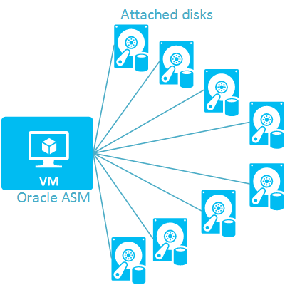

<properties
pageTitle="Aspekte der Verwendung von Bildern Oracle virtueller Computer | Microsoft Azure"
description="Erfahren Sie unterstützten Konfigurationen und Einschränkungen für eine Oracle virtuellen Computer unter Windows Server in Azure vor der Bereitstellung."
services="virtual-machines-windows"
documentationCenter=""
manager="timlt"
authors="rickstercdn"
tags="azure-service-management"/>

<tags
ms.service="virtual-machines-windows"
ms.devlang="na"
ms.topic="article"
ms.tgt_pltfrm="vm-windows"
ms.workload="infrastructure-services"
ms.date="09/06/2016"
ms.author="rclaus" />

#Verschiedene Aspekte für Oracle virtuellen Computern Bilder

Dieser Artikel behandelt Aspekte für Oracle-virtuellen Computern in Azure, die auf die Oracle-Software-Images von Oracle bereitgestellten basieren.  

-  Oracle-virtuellen Computern Datenbankbilder
-  Oracle WebLogic Server virtuellen Computern Bilder
-  Oracle JDK virtuellen Computers Bilder

##Oracle-virtuellen Computern Datenbankbilder
### Cluster (RAC) wird nicht unterstützt.

Azure unterstützt keine aktuell Oracle Real Application Cluster (RAC) der Oracle-Datenbank. Nur eigenständigen Instanzen der Oracle-Datenbank sind möglich. Dies liegt daran Azure aktuell virtuelle Datenträger-Freigabe in einer Weise schreibgeschützt für mehrere Instanzen von virtuellen Computern nicht unterstützt. Multicast UDP wird auch nicht unterstützt.

### Keine statische internen IP-Adresse

Azure weist jede virtuelle Computer eine interne IP-Adresse. Es sei denn, die virtuellen Computern ein virtuelles Netzwerk gehört, ist die IP-Adresse des virtuellen Computers ist dynamisch und ändert sich möglicherweise nach dem Neustart des virtuellen Computers. Dies kann Probleme verursachen, da der Oracle-Datenbank die IP-Adresse statisch erwartet. Um das Problem zu vermeiden, sollten Sie in der ein Azure-virtuellen Netzwerk des virtuellen Computers hinzufügen. Weitere Informationen finden Sie unter [Virtuelles Netzwerk](https://azure.microsoft.com/documentation/services/virtual-network/) und [Erstellen Sie ein virtuelles Netzwerk in Azure](../virtual-network/virtual-networks-create-vnet-arm-pportal.md) .

### Optionen des angeschlossenen Datenträger Konfiguration

Sie können die Datendateien auf dem Datenträger Betriebssystem des virtuellen Computers oder angefügten über Laufwerke, auch bekannt als Daten platzieren. Angefügten Datenträger möglicherweise eine bessere Leistung und Größe Flexibilität als Betriebssystem-Laufwerk bieten. Der Datenträger Betriebssystem möglicherweise besser nur für Datenbanken unter 10 Gigabyte (GB).

Verbundenen Laufwerke basieren auf den Dienst Azure Blob-Speicher. Jeder Datenträger kann maximal theoretischen ungefähr 500/a-Vorgänge pro Sekunde (IOPS). Die Leistung von verbundenen Laufwerke möglicherweise nicht optimale Anfangs und Performance von möglicherweise nach einem Zeitraum "Brennen in" etwa 60-90 Minuten Betrieb erheblich verbessern. Wenn Sie ein Datenträger später im Leerlauf bleibt, möglicherweise Performance von bis zu einem anderen brennen in Periode Betrieb im abnehmen. Kurz gesagt, ist das weitere aktive einen Datenträger, der eher Performance von optimale Ansatz.

Obwohl die einfachste Möglichkeit ist, können Sie eine einzelne Festplatte des virtuellen Computers zuordnen, und setzen Datenbankdateien auf dem Datenträger, dieser Ansatz auch der am häufigsten einschränkenden hinsichtlich der Leistung ist. Stattdessen können Sie die Performance von effektive häufig verbessern, wenn Sie mehrere angefügten Datenträger verwenden, Datenbankdaten hinweg und verwenden Sie dann die Oracle Automatic Storage Management (ASM). Weitere Informationen finden Sie unter [Übersicht über die automatische Oracle-Speicher](http://www.oracle.com/technetwork/database/index-100339.html) . Obwohl Striping von mehreren Laufwerken Ebene der Betriebssystem verwendet werden kann, wird dieser Ansatz nicht empfohlen, da es nicht zur Verbesserung der Performance von bekannt ist.

Erwägen Sie zwei verschiedene Ansätze für das Hinzufügen mehrerer Festplatten basierend auf, ob Sie die Leistung von Vorgängen finden Sie hier priorisieren oder Operationen für Ihre Datenbank schreiben möchten:

- **Oracle ASM eigenständig** ist wahrscheinlich eine bessere Leistung von schreiben Vorgang, aber schlechter IOPS für gelesen Vorgänge im Vergleich zu der Ansatz mit Festplatten-Arrays auftreten. Die folgende Abbildung stellt logisch dieser Festlegung.  
    

>[AZURE.IMPORTANT] Das Verhältnis zwischen schreiben Leistung und Lese-Performance auf Basis von Fall auswerten. Bei Verwendung dieses, können die tatsächliche Ergebnisse abweichen.

### Hohe Verfügbarkeit und Disaster Aspekte der Wiederherstellung

Wenn der Oracle-Datenbank in Azure-virtuellen Computern verwenden, können Sie für die Durchführung einer hohen Verfügbarkeit und Disaster Wiederherstellung-Lösung, um alle Downtime zu vermeiden. Sie können auch sichern Ihre eigenen Daten und der Anwendung verantwortlich.

Hohe Verfügbarkeit und Disaster Wiederherstellung für Oracle-Datenbank Enterprise Edition (ohne RAC) auf Azure kann mit [Daten schützen, aktiven Data Guard](http://www.oracle.com/technetwork/articles/oem/dataguardoverview-083155.html)oder [Oracle Gold Eingang](http://www.oracle.com/technetwork/middleware/goldengate), mit zwei Datenbanken in zwei separaten virtuellen Computern erzielt werden. Beide virtuellen Computern sollte in der gleichen [Cloud-Dienst](virtual-machines-linux-classic-connect-vms.md) und im gleichen [virtuellen Netzwerk](https://azure.microsoft.com/documentation/services/virtual-network/) sein, um sicherzustellen, dass diese miteinander über die private beständigen IP-Adresse zugegriffen werden können.  Darüber hinaus wird empfohlen, wobei die virtuellen Computer in der gleichen [Verfügbarkeit festlegen](virtual-machines-windows-manage-availability.md) dürfen Azure in separaten Fehlerstrukturanalyse Domänen zu platzieren, und Aktualisieren von Domänen. Nur virtuelle Computer in der gleichen Cloud-Dienst können in demselben Satz Verfügbarkeit teilnehmen. Jeder virtuelle Computer müssen mindestens 2 GB Arbeitsspeicher und 5 GB Festplattenspeicher.

Mit Oracle-Daten Check, hoher Verfügbarkeit erreicht werden kann, mit einer primären Datenbank auf einem virtuellen Computern, eine sekundäre (standby) Datenbank auf einem anderen virtuellen Computern und unidirektionalen Replikation dazwischen einrichten. Das Ergebnis ist Lesezugriff auf die Kopie der Datenbank. Mit Oracle GoldenGate können Sie bidirektionale Replikation zwischen den beiden Datenbanken konfigurieren. Weitere Informationen zum Einrichten einer Lösung mit hoher Verfügbarkeit für Ihre Verwendung dieser Tools Datenbanken finden Sie in der [Aktiven Data Guard](http://www.oracle.com/technetwork/database/features/availability/data-guard-documentation-152848.html) und [GoldenGate](http://docs.oracle.com/goldengate/1212/gg-winux/index.html) Dokumentation bei der Oracle-Website. Wenn Sie Zugriff auf die Kopie der Datenbank Schreibschutz benötigen, können Sie die [Oracle aktiven Data Guard](http://www.oracle.com/uk/products/database/options/active-data-guard/overview/index.html).

##Oracle WebLogic Server virtuellen Computern Bilder

-  **Cluster wird nur in Enterprise Edition unterstützt.** Sie sind lizenziert WebLogic Cluster nur bei Verwendung der Enterprise Edition von WebLogic Server verwenden. Verwenden Sie Cluster mit WebLogic Server Standard Edition nicht.

-  **Verbindung Zeitlimit:** Wenn eine Anwendung Verbindungen mit öffentlichen Endpunkte eine anderer Azure-Cloud-Dienst (beispielsweise eine Datenbank Ebene Service) erforderlich ist, möglicherweise Azure diese geöffneten Verbindungen nach vier Minuten nach der letzten Schließen. Dies möglicherweise Features und Anwendungen, die sich auf Verbindungspools, verlassen auswirken, da Verbindungen, die für mehr als diese Einschränkung inaktiv sind möglicherweise nicht mehr gültig bleiben. Wenn dies Ihrer Anwendung beeinträchtigt, erwägen Sie die Aktivierung "beibehalten aktiv" Logik auf Ihre Verbindungspools.

    Ist außen liegenden Tabellenblättern *internen* zur Bereitstellung Azure-Cloud-Dienst (beispielsweise einer eigenständigen Datenbank virtuellen Computern innerhalb *derselben* Cloud-Dienst als Ihre WebLogic virtuelle Computer), klicken Sie dann die Verbindung wird direkt basiert nicht auf dem Azure Lastenausgleich und daher eine Verbindungstimeout unterliegt keinem.

-  **UDP-Multicast wird nicht unterstützt.** Azure unterstützt UDP Übertragung mittels, aber nicht Multicasting oder senden. WebLogic Server kann auf Azure UDP bestimmte Funktionen verlassen. Für Sie am besten Ergebnisse auf bestimmte UDP verlassen, es empfiehlt sich, dass die Größe der Zuordnungseinheiten WebLogic statischen, aufbewahrt werden oder mit nicht mehr als 10 verwalteten Servern im Cluster enthalten gehalten werden.

-  **WebLogic Server erwartet öffentlichen und privaten Ports für T3 Zugriff (z. B. bei Verwendung von Enterprise JavaBeans) identisch sein.** Angenommen, es mit mehreren Ebenen, wo eine Service-Anwendung Layer (EJB) auf einem WebLogic Server Cluster aus zwei oder mehr verwalteten Servern in einen Cloud-Dienst mit dem Namen **SLWLS**ausgeführt wird. Die Client-Ebene ist in einer anderen Cloud-Dienst, Ausführen eines einfachen Java-Programms Versuch EJB in den Layer Dienst aufzurufen. Da es für den Lastenausgleich den Dienst Layer erforderlich ist, muss ein öffentlicher Lastenausgleich Endpunkt für den virtuellen Computern im Cluster WebLogic Server erstellt werden. Ist der private Anschluss, den Sie für diesen Endpunkt angeben der öffentlichen Port (z. B. 7006:7008) abweicht, tritt eine Fehlermeldung wie die folgende:

        [java] javax.naming.CommunicationException [Root exception is java.net.ConnectException: t3://example.cloudapp.net:7006:

        Bootstrap to: example.cloudapp.net/138.91.142.178:7006' over: 't3' got an error or timed out]

    Dies ist, da für alle T3 Remotezugriff WebLogic Server erwartet den Lastenausgleich-Anschluss laden und der verwalteten WebLogic Serverport identisch sein. Im obigen Beispiel Client greift Port 7006 (Laden Lastenausgleich Anschluss) aus, und der verwaltete Server hört 7008 (Anschluss als "Privat"). Diese Einschränkung gilt nur für T3 Access nicht HTTP zur Verfügung.

    Verwenden Sie eine der folgenden Methoden an, um dieses Problem zu vermeiden:

    -  Verwenden Sie die gleichen öffentlichen und privaten Portnummern für Lastenausgleich Endpunkte dedizierte T3 Zugriff aus.

    -  Schließen Sie den folgenden JVM Parameter aus, wenn WebLogic Server zu starten:

            -Dweblogic.rjvm.enableprotocolswitch=true

Weitere Informationen finden Sie unter KB-Artikel **860340.1** am <http://support.oracle.com>.

-  **Dynamische Cluster und Lastenausgleich Einschränkungen.** Angenommen, Sie möchten einen dynamischen Cluster in WebLogic Server verwenden, und sie über einen einzigen, öffentlichen Lastenausgleich Endpunkt in Azure verfügbar zu machen. Dies ist möglich, solange Sie eine feste Port-Nummer für jeden verwalteten Server (nicht dynamisch aus einem Bereich zugewiesen) verwenden, und Sie nicht mehr verwaltete Servern starten als Administrator ist nachverfolgen Computer vorhanden sind (d. h., nicht mehr als eine verwaltete Server pro virtuellen Computern). Wenn Ihre Konfiguration angegeben, ergibt sich mehr WebLogic Server als virtuelle Computer gestartet wird (d. h., in dem mehrere WebLogic Server Instanzen desselben virtuellen Computers freigeben möchten), und es ist nicht möglich für mehr als eins der für die Instanzen des WebLogic Server-Servern in eine Zahl angegebenes Port binden – andere des betreffenden virtuellen Computers schlägt fehl.

    Andererseits, wenn Sie den Administrator Server automatisch eindeutige Portnummern verwalteten Server zuweisen konfigurieren, ist dann Lastenausgleich nicht möglich da Azure Zuordnung auf einem einzelnen öffentlichen Port zu mehreren private Ports, nicht unterstützt wird, als wäre für diese Konfiguration erforderlich.

-  **Mehrere Instanzen von Weblogic Server auf virtuellen Computers.** Je nach der Bereitstellung Anforderungen sollten Sie die Möglichkeit, mehrere Instanzen des WebLogic Server auf den gleichen virtuellen Computern Ausführen des virtuellen Computers groß genug ist. Beispielsweise könnten auf ein mittlerer Größe virtuellen Computern, die zwei Kerne enthält, Sie entscheiden zwei Instanzen von WebLogic Server ausgeführt. Beachten Sie jedoch, dass es immer noch empfiehlt sich, dass Sie keinen Einführung in einzelne Punkte des Fehlers in Ihrer Architektur, die der Fall wäre, wenn Sie nur eine virtuellen Computern verwendet, die mehrere Instanzen von WebLogic Server ausgeführt wird. Mit mindestens zwei virtuellen Computern könnte ein besserer Ansatz, und jeder dieser virtuellen Computer konnte mehrerer Instanzen von WebLogic Server führen. Jede dieser Instanzen von WebLogic Server kann weiterhin dieselbe Zuordnungseinheit gehören. Notiz ist jedoch es derzeit nicht möglich, verwenden Azure Endpunkten Lastenausgleich, die von solchen WebLogic Server-Bereitstellungen innerhalb der gleichen virtuellen Computern verfügbar gemacht werden, da Azure Lastenausgleich die Lastenausgleich Servern zwischen eindeutigen virtuellen Computern verteilt werden erfordert.

##Oracle JDK virtuellen Computers Bilder

-  **JDK 6 und 7 neuesten Updates.** Es empfiehlt sich, die neueste öffentliche, unterstützte Version von Java (aktuell Java 8) verwenden, während der bereitgestellt, Azure auch JDK 6 und 7 Bilder. Dies ist für Applikationen legacy vorgesehen, die noch nicht für ein Upgrade auf JDK 8 bereit sind. Während Updates zum vorherigen JDK Bilder möglicherweise nicht mehr zur Verfügung, in der Öffentlichkeit, ausgehend von der Microsoft-Zusammenarbeit mit Oracle, die JDK 6 und 7 Bilder von Azure bereitgestellten sollen ein neueres nicht öffentliche Update enthalten, das für nur einer ausgewählte Gruppe unterstützte Oracle-Kunden normalerweise von Oracle bereitgestellt wird. Neue Versionen der Bilder JDK werden über einen Zeitraum mit aktualisierten JDK 6 und 7-Versionen zur Verfügung gestellt.

    Verfügbar in dieser JDK 6 und 7 Bilder, und die virtuellen Computer und Bilder aus, die sie abgeleitet JDK kann nur in Azure verwendet werden.

-  **64-Bit-JDK.** Oracle WebLogic Server virtuellen Computern Bilder und die Oracle-JDK virtuellen Computers Bilder von Azure bereitgestellten enthalten die 64-Bit-Versionen von Windows Server und JDK.

##Zusätzliche Ressourcen
[Oracle-virtuellen Computern Bilder für Azure](virtual-machines-linux-classic-oracle-images.md)
