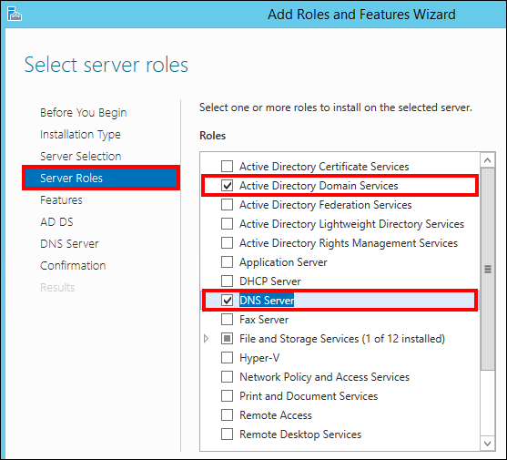

<properties
    pageTitle="Konfigurieren Sie immer auf Verfügbarkeit Gruppe Azure-virtuellen Computer - klassisch"
    description="Erstellen einer immer auf Verfügbarkeit Gruppe mit Azure-virtuellen Computern an. In diesem Lernprogramm verwendet die Benutzeroberfläche und Tools hauptsächlich anstatt scripting."
    services="virtual-machines-windows"
    documentationCenter="na"
    authors="MikeRayMSFT"
    manager="jhubbard"
    editor=""
    tags="azure-service-management" />
<tags
    ms.service="virtual-machines-windows"
    ms.devlang="na"
    ms.topic="article"
    ms.tgt_pltfrm="vm-windows-sql-server"
    ms.workload="infrastructure-services"
    ms.date="09/22/2016"
    ms.author="mikeray" />

# Konfigurieren Sie immer auf Verfügbarkeit Gruppe Azure-virtuellen Computer - klassisch

> [AZURE.SELECTOR]
- [Ressourcenmanager: Vorlage](virtual-machines-windows-portal-sql-alwayson-availability-groups.md)
- [Ressourcenmanager: Manueller](virtual-machines-windows-portal-sql-alwayson-availability-groups-manual.md)
- [Klassische: Benutzeroberfläche](virtual-machines-windows-classic-portal-sql-alwayson-availability-groups.md)
- [Klassische: PowerShell](virtual-machines-windows-classic-ps-sql-alwayson-availability-groups.md)

 

> [AZURE.INCLUDE [learn-about-deployment-models](../../includes/learn-about-deployment-models-classic-include.md)]

In diesem Lernprogramm End-to-End wird gezeigt, wie Implementieren der Verfügbarkeit von Gruppen mit SQL Server immer auf Azure-virtuellen Computern ausgeführt werden kann.

Am Ende des Lernprogramms wird Ihre Lösung SQL Server immer auf in Azure die folgenden Elemente umfassen:

- Ein virtuelles Netzwerk, mehrere Subnetze, einschließlich einer Front-End- und Back-End-Subnetz enthält

- Eine Domäne-Controller mit einer Domäne Active Directory (AD)

- Zwei SQL Server virtueller Computer mit dem Back-End-Subnetz bereitgestellt, und der AD-Domäne

- Eine 3-Knoten WSFC Cluster mit den Knoten Mehrzahl Quorummodell

- Eine Gruppe Verfügbarkeit mit zwei synchroner Commit Replikaten einer Datenbank Verfügbarkeit

In der Abbildung unten ist die Lösung grafisch dargestellt.

Beachten Sie, dass dies eine mögliche Konfiguration ist. Beispielsweise können Sie die Anzahl der virtuellen Computern für eine Gruppe von zwei-Replikat Verfügbarkeit minimieren, um mithilfe des Domänencontrollers als Quorum Dateifreigabenzeuge in einer 2-Knoten WSFC Cluster auf berechnen Stunden in Azure zu speichern. Diese Methode verringert die Anzahl der virtuellen Computer mit einem aus der oben genannten Konfiguration.

In diesem Lernprogramm wird Folgendes vorausgesetzt:

- Sie verfügen bereits über ein Azure-Konto.

- Sie wissen bereits so einen klassischen SQL Server virtuellen Computer aus dem virtuellen Computern Katalog über die Benutzeroberfläche bereitstellen.

- Sie verfügen bereits über ein grundlegendes Verständnis der immer auf Verfügbarkeit Gruppen. Weitere Informationen finden Sie unter [Immer auf Verfügbarkeit Gruppen (SQL Server)](https://msdn.microsoft.com/library/hh510230.aspx).

>[AZURE.NOTE] Wenn Sie immer auf Verfügbarkeit Gruppen mit SharePoint verwenden möchten, finden Sie auch unter [Konfigurieren von SQL Server 2012 immer auf Verfügbarkeit Gruppen für SharePoint 2013](https://technet.microsoft.com/library/jj715261.aspx).

## Erstellen Sie die virtuelle Netzwerk und Domain Controller-Servers

Sie beginnen mit einer neuen Azure Testkonto. Nachdem Sie Ihr Konto Setup abgeschlossen haben, sollten Sie mit der Startseite des Portals klassischen Azure.

1. Klicken Sie auf die Schaltfläche **neu** in der unteren linken Ecke der Seite, wie unten dargestellt.

    

1. Klicken Sie auf **Netzwerkdienste**, und klicken Sie dann klicken Sie auf **Virtuelle Netzwerk,** und klicken Sie dann auf **Benutzerdefinierte erstellen**, wie unten dargestellt.

    

1. Klicken Sie im Dialogfeld **Virtuelles Netzwerk erstellen** erstellen Sie ein neues virtuelles Netzwerk schrittweise durch die Seiten mit den folgenden Einstellungen aus. 

  	|Seite|Einstellungen|
|---|---|
|Virtuelle Netzwerkdetails|**NAME = ContosoNET** **REGION Westen US =**|
|DNS-Server und VPN-Konnektivität|Keine|
|Virtuelle Netzwerk-Adressbereiche|Einstellungen sind in den Screenshot unten dargestellt: |

1. Als Nächstes erstellen Sie den virtuellen Computer als Domain Controller (DC) soll verwendet werden. Klicken Sie auf erneut **neu** **zu berechnen**, und klicken Sie dann **virtuellen Computern**und dann **Vom Katalog**wie unten dargestellt.

    

1. Klicken Sie im Dialogfeld **Erstellen A virtuellen Computern** Konfigurieren eines neuen virtuellen Computers schrittweise Seiten mit den folgenden Einstellungen. 

  	|Seite|Einstellungen|
|---|---|
|Wählen Sie das Betriebssystem von virtuellen Computern|Windows Server 2012 R2 Datacenter|
|Konfiguration des virtuellen Computers|**Datum der Freigabe VERSION** = (neueste) **NAME des virtuellen Computers** = ContosoDC **Ebene** = STANDARD **Größe** = A2 (2 Kerne) **Neuer Benutzername** = AzureAdmin **Neues Kennwort** = Contoso! 000 **Bestätigen** = Contoso! 000|
|Konfiguration des virtuellen Computers|**CLOUD-Dienst** = Erstellen eines neuen Cloud-Dienst **CLOUD SERVICE DNS-NAME** einen eindeutigen Cloud-Dienstnamen = **DNS-NAME** einen eindeutigen Namen = (ex: ContosoDC123) **REGION/Gruppe Zugehörigkeit/virtuellen Netzwerk** = ContosoNET **Virtuellen NETZWERKSUBNETS** = Back(10.10.2.0/24) **Speicher-Konto** verwenden ein Speicherkonto automatisch generierte = **Festlegen der Verfügbarkeit** = (keine)|
|Optionen von virtuellen Computern|Verwenden Sie die Standardeinstellungen|

Nachdem Sie den neuen virtuellen Computer konfiguriert haben, warten Sie auf den virtuellen Computer Provsioned sein. Dieser Vorgang dauert einige Zeit in Anspruch, und wenn Sie zur Registerkarte **virtuellen Computern** im klassischen Azure-Portal klicken, können Sie sehen, ContosoDC Durchlaufens Staaten aus **Starten (Provisioning)** zum **weiterspielen**, **Start-**, **Ausführung (Provisioning)**, und klicken Sie abschließend **Einstieg**.

Der DC-Server ist jetzt erfolgreich bereitgestellt. Konfigurieren Sie als Nächstes Active Directory-Domäne auf diesem Server DC.

## Konfigurieren des Domänencontrollers

In den folgenden Schritten konfigurieren Sie den Computer ContosoDC als Domänencontroller für corp.contoso.com aus.

1. Wählen Sie im Portal den **ContosoDC** Computer ein. Klicken Sie auf der Registerkarte **Dashboard** auf **Verbinden** , um eine RDP-Datei für den desktop Remotezugriff zu öffnen.

    

1. Melden Sie sich mit Ihrem konfigurierten Administratorkonto (**\AzureAdmin**) und das Kennwort (**Contoso! 000**).

1. Standardmäßig sollte das **Server-Manager** -Dashboard angezeigt werden.

1. Klicken Sie auf den Link **Hinzufügen Rollen und Funktionen** auf dem Dashboard.

    

1. Wählen Sie **Weiter** , bis Sie zum Abschnitt **Serverrollen** gelangen.

1. Wählen Sie die Rollen aus **Active Directory-Domänendienste** und **DNS-Server** . Wenn Sie dazu aufgefordert werden, fügen Sie zusätzliche Features von Ausführenden erforderlich.

    >[AZURE.NOTE] Sie erhalten eine Überprüfung darauf hinzuweisen, dass es keine statischen IP-Adresse gibt. Wenn Sie die Konfiguration testen, klicken Sie auf Weiter. Für die Herstellung Szenarien [verwenden PowerShell, um die statische IP-Adresse des Computers Domänencontroller einrichten](./virtual-network/virtual-networks-reserved-private-ip.md).

    

1. Klicken Sie auf **Weiter** , bis Sie den Abschnitt **Bestätigung** erreicht haben. Aktivieren Sie das Kontrollkästchen **den Zielserver automatisch bei Bedarf neu zu starten** .

1. Klicken Sie auf **Installieren**.

1. Nach der Installation des Features abgeschlossen haben, kehren Sie zu dem **Server-Manager** -Dashboard zurück.

1. Wählen Sie die neue **AD DS** -Option auf der linken Seite.

1. Klicken Sie auf den Link auf der gelben Leiste der Warnung **mehr** .

    

1. Klicken Sie in der Spalte **Aktion** des Dialogfelds **Alle Server Aufgabendetails** auf **Heraufstufen dieser Server zu einem Domäne herauf**.

1. Verwenden Sie in der **Active Directory Konfiguration Assistent zum Domänendiensten**die folgenden Werte ein:

  	|Seite|Einstellung|
|---|---|
|Bereitstellungskonfiguration|**Hinzufügen einer neuen Gesamtstruktur** = ausgewählte **Quadratwurzel Domänennamen** = corp.contoso.com|
|Domänencontroller-Optionen|**Kennwort** = Contoso! 000 **Kennwort bestätigen** = Contoso! 000|

1. Klicken Sie auf **Weiter** , bis die anderen Seiten des Assistenten zu gelangen. Stellen Sie sicher, dass Sie die folgende Meldung angezeigt wird, klicken Sie auf der Seite **Erforderliche Komponenten prüfen** : **Alle vorbereitende Prüfungen erfolgreich übergeben**. Beachten Sie, dass sollten Sie alle entsprechenden Warnhinweise überprüfen, aber es möglich ist, die Installation fortsetzen.

1. Klicken Sie auf **Installieren**. **ContosoDC** virtuellen Computers wird automatisch neu gestartet.

## Konfigurieren der Domänenkonten

In den nächsten Schritten konfigurieren Sie die Active Directory (AD) Konten zur späteren Verwendung.

1. Melden Sie sich wieder in den Computer **ContosoDC** .

1. **Server** -Manager wählen Sie **Tools** aus, und klicken Sie dann auf **Active Directory Administrative Center**.

    

1. In den **Active Directory Administrative Center** select **Unternehmen (lokal)** aus dem linken Bereich.

1. Klicken Sie im rechten Bereich der **Aufgaben** wählen Sie **neu** , und klicken Sie dann auf **Benutzer**. Verwenden Sie die folgenden Einstellungen:

  	|Einstellung|Wert|
|---|---|
|**Vorname**|Installieren|
|**Benutzer SamAccountName**|Installieren|
|**Kennwort**|Contoso! 000|
|**Kennwort bestätigen**|Contoso! 000|
|**Andere Kennwortoptionen**|Ausgewählt|
|**Kennwort läuft nie ab.**|Aktiviert|

1. Klicken Sie auf **OK** , um den Benutzer **Installieren** zu erstellen. Dieses Konto wird so konfigurieren Sie Failovercluster und der Gruppe Verfügbarkeit verwendet werden.

1. Erstellen Sie zwei zusätzliche Benutzer mit denselben Schritten: **CORP\SQLSvc1** und **CORP\SQLSvc2**. Diese Konten werden für SQL Server-Instanzen verwendet werden. Als Nächstes müssen Sie **CORP\Install** Geben Sie die erforderlichen Berechtigungen zum Konfigurieren von Windows Service Failover Cluster (WSFC).

1. Wählen Sie in der **Active Directory Administrative Center** **Unternehmen (lokal)** im linken Bereich ein. Klicken Sie im rechten Bereich **Aufgaben** auf **Eigenschaften**.

    

1. Wählen Sie **Erweiterungen**aus, und klicken Sie dann auf die Schaltfläche **Erweitert** auf der Registerkarte **Sicherheit** .

1. Klicken Sie im Dialogfeld **Erweiterte Sicherheitseinstellungen für Unternehmen** . Klicken Sie auf **Hinzufügen**.

1. Klicken Sie auf, **Wählen Sie eine der Tilgungsanteile aus**. Suchen Sie nach **CORP\Install**. Klicken Sie auf **OK**.

1. Wählen Sie die Berechtigungen **alle Eigenschaften lesen** und **Objekte Computer erstellen** .

    

1. Klicken Sie auf **OK**, und klicken Sie dann erneut auf **OK** . Schließen Sie das Eigenschaftenfenster Unternehmen ein.

Jetzt, da Sie die Konfiguration von Active Directory und der Benutzerobjekte abgeschlossen haben, erstellen Sie drei SQL Server-virtuellen Computern und nehmen sie in dieser Domäne.

## Erstellen der SQL Server-virtuellen Computern

Als Nächstes erstellen Sie drei virtuellen Computern, einschließlich ein WSFC Knoten und zwei SQL Server-virtuellen Computern an. Um jeden der virtuellen Computern erstellen, kehren Sie zum klassischen Azure-Portal, klicken Sie auf **neu** **zu berechnen**, **virtuellen Computern**und dann **Vom Katalog**. Verwenden Sie dann die Vorlagen in der folgenden Tabelle beim Erstellen der virtuellen Computern.

|Seite|VM1|VM2|VM3|
|---|---|---|---|
|Wählen Sie das Betriebssystem von virtuellen Computern|**Windows Server 2012 R2 Datacenter**|**SQL Server 2014 RTM Enterprise**|**SQL Server 2014 RTM Enterprise**|
|Konfiguration des virtuellen Computers|**Datum der Freigabe VERSION** = (neueste) **NAME des virtuellen Computers** = ContosoWSFCNode **Ebene** = STANDARD **Größe** = A2 (2 Kerne) **Neuer Benutzername** = AzureAdmin **Neues Kennwort** = Contoso! 000 **Bestätigen** = Contoso! 000|**Datum der Freigabe VERSION** = (neueste) **NAME des virtuellen Computers** = ContosoSQL1 **Ebene** = STANDARD **Größe** = A3 (4 Kerne) **Neuer Benutzername** = AzureAdmin **Neues Kennwort** = Contoso! 000 **Bestätigen** = Contoso! 000|**Datum der Freigabe VERSION** = (neueste) **NAME des virtuellen Computers** = ContosoSQL2 **Ebene** = STANDARD **Größe** = A3 (4 Kerne) **Neuer Benutzername** = AzureAdmin **Neues Kennwort** = Contoso! 000 **Bestätigen** = Contoso! 000|
|Konfiguration des virtuellen Computers|**CLOUD-Dienst** = zuvor erstellte eindeutige Cloud-Dienst DNS-Name (ex: ContosoDC123) **REGION/Gruppe Zugehörigkeit/virtuellen Netzwerk** = ContosoNET **Virtuellen NETZWERKSUBNETS** = Back(10.10.2.0/24) **Speicher-Konto** verwenden ein Speicherkonto automatisch generierte = **Festlegen der Verfügbarkeit** = Erstellen einer Verfügbarkeit festlegen **Legen Sie Namen Verfügbarkeit** = SQLHADR|**CLOUD-Dienst** = zuvor erstellte eindeutige Cloud-Dienst DNS-Name (ex: ContosoDC123) **REGION/Zugehörigkeit Gruppe/virtuellen Netzwerk** = ContosoNET **Virtuellen NETZWERKSUBNETS** = Back(10.10.2.0/24) **Speicher-Konto** verwenden ein Speicherkonto automatisch generierte = **Festlegen der Verfügbarkeit** = SQLHADR (Sie können auch konfigurieren die Verfügbarkeit festgelegt, nachdem der Computer erstellt wurde. Alle drei Computer sollte zum SQLHADR Verfügbarkeit Satz zugewiesen.)|**CLOUD-Dienst** = zuvor erstellte eindeutige Cloud-Dienst DNS-Name (ex: ContosoDC123) **REGION/Gruppe Zugehörigkeit/virtuellen Netzwerk** = ContosoNET **Virtuellen NETZWERKSUBNETS** = Back(10.10.2.0/24) **Speicher-Konto** verwenden ein Speicherkonto automatisch generierte = **Festlegen der Verfügbarkeit** = SQLHADR (Sie können auch konfigurieren die Verfügbarkeit festgelegt, nachdem der Computer erstellt wurde. Alle drei Computer sollte zum SQLHADR Verfügbarkeit Satz zugewiesen.)|
|Optionen von virtuellen Computern|Verwenden Sie die Standardeinstellungen|Verwenden Sie die Standardeinstellungen|Verwenden Sie die Standardeinstellungen|

 

>[AZURE.NOTE] Die vorherige Konfiguration schlägt in STANDARD-virtuellen Computern, da grundlegende Ebene Autos mit Lastenausgleich Endpunkte erforderlich, um eine Gruppe von Verfügbarkeit Listener später erstellen nicht unterstützt werden. Darüber hinaus werden die Computer Größen hier vorgeschlagene zum Testen der Verfügbarkeit von Gruppen in Azure-virtuellen Computern auffällt. Optimale Leistung auf Produktionsarbeitslasten finden Sie unter der Empfehlungen für SQL Server-Computer Größen und Konfiguration [Leistung best](virtual-machines-windows-sql-performance.md)Practices für SQL Server in Azure virtuellen Computern.

Nachdem die drei virtuellen Computern vollständig bereitgestellt werden, müssen Sie fügen sie der Domäne **corp.contoso.com** und die Computer Administratorrechte CORP\Install gewähren. Gehen Sie dazu folgendermaßen vor, für jede der drei virtuellen Computern.

1. Ändern Sie zunächst die bevorzugte DNS-Server-Adresse ein. Herunterladen von jedes virtuellen Computers remote desktop (RDP)-Datei in einem lokalen Verzeichnis, indem Sie den virtuellen Computer in der Liste, und klicken auf die Schaltfläche **Verbinden** Sie zunächst. Zum Auswählen eines virtuellen Computers klicken Sie auf eine beliebige Stelle jedoch die erste Zelle in der Zeile wie unten dargestellt.

    

1. Starten Sie die RDP-Datei, die Sie heruntergeladen haben, und melden Sie sich bei dem virtuellen Computer mithilfe der konfigurierten Administratorkonto (**BUILTIN\AzureAdmin**) und das Kennwort (**Contoso! 000**).

1. Sobald Sie angemeldet sind, sollte das **Server-Manager** -Dashboard angezeigt werden. Klicken Sie im linken Bereich auf **Lokale Server** .

1. Wählen Sie den Link **IPv4-Adresse zugewiesen von DHCP, IPv6 aktiviert** .

1. Wählen Sie das Netzwerksymbol, klicken Sie im Fenster **Netzwerk Verbindungen** .

    

1. Klicken Sie auf der Befehlsleiste auf **Ändern der für diese Verbindung** (abhängig von der Größe des Fensters, möglicherweise müssen Sie den richtigen Doppelpfeil, um diesen Befehl anzuzeigen klicken Sie auf).

1. Wählen Sie **Internet Protocol Version 4 (TCP/IPv4)** aus, und klicken Sie auf Eigenschaften.

1. Aktivieren Sie verwenden der folgende DNS-Server Adressen und **10.10.2.4** in **bevorzugte DNS-Server**angeben.

1. Die Adresse **10.10.2.4** ist die Adresse, einen virtuellen Computer im Subnetz 10.10.2.0/24 in einem Azure-virtuellen Netzwerk zugewiesen und diesen virtuellen Computer **ContosoDC**. Um **ContosoDC**IP-Adresse überprüfen möchten, verwenden Sie den **Nslookup Contosodc** in der Befehlszeile, wie unten dargestellt.

    

1. Klicken Sie auf O**K** und dann auf **Schließen** um die Änderungen zu übernehmen. Sie können nun den virtuellen Computer mit **corp.contoso.com**verknüpfen können.

1. Klicken Sie auf den Link **Arbeitsgruppe** , wieder im **Lokalen Server** -Fenster.

1. Klicken Sie im Abschnitt **Computernamen** auf **Ändern**.

1. Wählen Sie das Kontrollkästchen **Domäne** aus, und geben Sie **corp.contoso.com** in das Textfeld ein. Klicken Sie auf **OK**.

1. Geben Sie im Dialogfeld **Windows-Sicherheit** Popup die Anmeldeinformationen für das standardmäßige Domänenadministratorkonto (**CORP\AzureAdmin**) und das Kennwort (**Contoso! 000**).

1. Wenn die Meldung "Willkommen bei der Domäne corp.contoso.com" angezeigt wird, klicken Sie auf **OK**.

1. Klicken Sie auf **Schließen**, und klicken Sie dann im Popup-Dialogfeld auf **Jetzt neu starten** .

### Fügen Sie den Benutzer Corp\Install als Administrator jedes virtuellen Computers hinzu:

1. Warten Sie, bis Sie der virtuellen Computer neu gestartet wurde, und starten Sie die Datei RDP erneut an den virtuellen Computer mit dem **BUILTIN\AzureAdmin** -Konto anmelden.

1. **Server** -Manager wählen Sie **Tools**aus, und klicken Sie dann auf **Computer Verwaltung**.

    

1. Im Fenster **Computer Verwaltung** erweitern Sie **Lokale Benutzer und Gruppen**, und wählen Sie dann **Gruppen**.

1. Doppelklicken Sie auf die Gruppe der **Administratoren** .

1. Klicken Sie im Dialogfeld **Eigenschaften von Administratoren** auf die Schaltfläche **Hinzufügen** .

1. Geben Sie den Benutzer **CORP\Install**, und klicken Sie dann auf **OK**. Wenn Sie Anmeldeinformationen aufgefordert werden, verwenden Sie das Konto **AzureAdmin** mit der **Contoso! 000** Kennwort.

1. Klicken Sie auf **OK** , um das Dialogfeld **Eigenschaften von Administrator** zu schließen.

### Fügen Sie **das Failoverclusterfeature** hinzu jedes virtuellen Computer an.

1. Klicken Sie auf dem **Server-Manager** -Dashboard **Hinzufügen Rollen und Features**auf.

1. **Hinzufügen von Rollen und Features-Assistenten**klicken Sie auf **Weitersuchen** , bis Sie **Features** zu gelangen.

1. Wählen Sie **Failoverclustering**aus. Wenn Sie dazu aufgefordert werden, fügen Sie eine beliebige andere abhängige Features hinzu.

    

1. Klicken Sie auf **Weiter**, und klicken Sie dann auf der Seite **Bestätigung** auf **Installieren** .

1. Wenn der Featureinstallation **Failoverclustering** abgeschlossen ist, klicken Sie auf **Schließen**.

1. Melden Sie sich bei dem virtuellen Computer ab.

1. Wiederholen Sie die Schritte in diesem Abschnitt für alle drei Server – **ContosoWSFCNode**, **ContosoSQL1**und **ContosoSQL2**ein.

Die SQL Server-virtuellen Computern sind jetzt nach der Bereitstellung und Ausführung, aber sie werden mit Standardoptionen mit SQL Server installiert.

## Erstellen des WSFC Clusters

In diesem Abschnitt erstellen Sie den WSFC Cluster, der die Gruppe Verfügbarkeit gehostet wird, die Sie später erstellen. Jetzt, indem Sie sollte Sie jeder der drei virtueller Computer mit die folgenden getan haben, die im WSFC Cluster soll verwendet werden:

- Nach der Bereitstellung vollständig in Azure

- Verknüpfte virtueller Computer zu der Domäne

- Hinzugefügten **CORP\Install** in der Gruppe Administratoren

- Das Failoverclusterfeature hinzugefügt

Alle Dies sind die Voraussetzungen für jedes virtuellen Computers, bevor Sie es mit dem WSFC Cluster an Besprechung teilnehmen können.

Beachten Sie, dass das Azure virtuelle Netzwerk nicht auf die gleiche Weise wie eine lokale Netzwerk so verhält. Sie müssen den Cluster in der folgenden Reihenfolge zu erstellen:

1. Erstellen Sie einen einzigen Knoten Cluster auf einem Knoten (**ContosoSQL1**).

1. Ändern Sie die IP-Adresse an eine nicht verwendete IP-Adresse (**10.10.2.101**).

1. Zeigen Sie den Clusternamen online.

1. Fügen Sie die anderen Knoten (**ContosoSQL2** und **ContosoWSFCNode**) hinzu.

Gehen Sie folgendermaßen vor, um diese Aufgaben, die vollständig Cluster konfiguriert.

1. Starten Sie die RDP-Datei für **ContosoSQL1** , und melden Sie sich mit dem Domänenkonto **CORP\Install**.

1. Klicken Sie auf dem **Server-Manager** -Dashboard auf **Extras**, und klicken Sie dann auf **Failovercluster-Manager**.

1. Klicken Sie im linken Bereich mit der rechten Maustaste **Failovercluster-Manager**, und klicken Sie dann auf **Cluster erstellen**, wie unten dargestellt.

    

1. Klicken Sie im Assistenten zum Erstellen von Cluster Cluster zu erstellen einen einem Knoten schrittweise Seiten mit den folgenden Einstellungen:

  	|Seite|Einstellungen|
|---|---|
|Bevor Sie beginnen|Verwenden Sie die Standardeinstellungen|
|Wählen Sie Server aus.|Geben Sie im Feld **Servername EINGABETASTE** **ContosoSQL1** ein, und klicken Sie auf **Hinzufügen**|
|Warnung Validierung|Wählen Sie **Nr. ich keine Unterstützung von Microsoft für diesen Cluster erforderlich, und können daher nicht zum Ausführen der Validierungstests möchten. Wenn ich klicken Sie auf Weiter, weiterhin Cluster erstellen**.|
|Access-Point für die Verwaltung des Clusters|Typ **Cluster1** **Cluster** Namen|
|Bestätigung|Verwenden Sie Standardwerte, es sei denn, Sie Speicher Leerzeichen verwenden. Siehe den Hinweis am Ende dieser Tabelle.|

    >[AZURE.WARNING] Bei Verwendung [Von Leerzeichen](https://technet.microsoft.com/library/hh831739), die mehrere Datenträger in Speicherpools gruppiert, müssen Sie das Kontrollkästchen **alle in Frage kommenden Speicher zum Cluster hinzufügen** , auf der Seite **Bestätigung** deaktivieren. Wenn Sie nicht diese Option deaktivieren, werden die virtuellen Laufwerke während des Clusterprozesses getrennt. Daher wird auch erst angezeigt, in dem Datenträger-Manager oder Explorer im Speicher Leerzeichen aus Cluster entfernt werden und mithilfe der PowerShell angefügt.

1. Klicken Sie im linken Bereich erweitern Sie **Failovercluster-Manager**, und klicken Sie dann auf **Cluster1.corp.contoso.com**.

1. Im mittleren Bereich, führen Sie einen Bildlauf nach unten bis zum Abschnitt **Cluster Core Ressourcen** und erweitern Sie die **Namen: Clutser1** Details. Sowohl den **Namen** und die **IP-Adresse** Ressourcen in den Status **Fehler** auftreten. Die IP-Adressen-Ressource kann nicht online geschaltet werden, da der Cluster die IP-Adresse wie des Computers selbst zugeordnet ist, welche ist eine doppelte Adresse.

1. Mit der rechten Maustaste in der fehlerhaften Ressource für die **IP-Adresse** ein, und klicken Sie dann auf **Eigenschaften**.

    

1. Wählen Sie **Statische IP-Adresse** aus, und geben Sie **10.10.2.101** in das Textfeld Adresse. Klicken Sie dann auf **OK**.

1. Klicken Sie im Abschnitt **Cluster Core Ressourcen** mit der Maustaste **Namen: Cluster1** , und klicken Sie auf **Online schalten**. Klicken Sie dann warten Sie, bis beide Ressourcen online sind. Wenn die Cluster Namenressource online ist, wird den DC-Server mit einem neuen AD-Computerkonto aktualisiert. Dieses Active Directory-Konto wird zur späteren Ausführung den Verfügbarkeit Gruppe gruppierte Dienst verwendet werden.

1. Schließlich fügen Sie die übrigen Knoten zum Cluster hinzu. Klicken Sie in der Strukturansicht Browser mit der rechten Maustaste **Cluster1.corp.contoso.com** , und klicken Sie auf **Knoten hinzufügen**, wie unten dargestellt.

    

1. Klicken Sie im **Assistenten zum Hinzufügen von Knoten**auf **Weiter**. Auf der Seite **Select Servers** fügen Sie **ContosoSQL2** und **ContosoWSFCNode** zur Liste hinzu, indem Sie den Servernamen im Feld **Servername EINGABETASTE** eingeben und dann auf **Hinzufügen**. Wenn Sie fertig sind, klicken Sie auf **Weiter**.

1. Klicken Sie auf der Seite **Überprüfung Warnung** auf **Nein** (in einem Szenario Herstellung sollten Sie die Überprüfung Tests durchführen). Klicken Sie dann auf **Weiter**.

1. Klicken Sie auf **Weiter** , um den Knoten hinzuzufügen, **der Bestätigungsseite** .

    >[AZURE.WARNING] Bei Verwendung [Von Leerzeichen](https://technet.microsoft.com/library/hh831739), die mehrere Datenträger in Speicherpools gruppiert, müssen Sie das Kontrollkästchen **alle in Frage kommenden Speicher zum Cluster hinzufügen** deaktivieren. Wenn Sie nicht diese Option deaktivieren, werden die virtuellen Laufwerke während des Clusterprozesses getrennt. Daher wird auch erst angezeigt, in dem Datenträger-Manager oder Explorer im Speicher Leerzeichen aus Cluster entfernt werden und mithilfe der PowerShell angefügt.

1. Sobald die Knoten zum Cluster hinzugefügt werden, klicken Sie auf **Fertig stellen**. Failovercluster-Manager sollte jetzt angezeigt werden, dass Ihre Cluster weist die folgenden drei Knoten und in den Container **Knoten** auflisten.

1. Melden Sie sich bei der remote desktop-Sitzung ab.

## Vorbereiten der SQL Server-Instanzen für Verfügbarkeit Gruppe

In diesem Abschnitt werden Sie auf sowohl **ContosoSQL1** und **contosoSQL2**die folgenden Aktionen ausführen:

- Fügt einen Benutzernamen für **Systemkonto:** mit einer erforderlichen Berechtigungen festlegen, mit der SQL Server-Standardinstanz hinzu

- Hinzufügen von **CORP\Install** als Rolle Sysadmin mit der SQL Server-Standardinstanz

- Öffnen des Firewalls für den Remotezugriff von SQL Server

- Aktivieren Sie das Feature immer auf Verfügbarkeit Gruppen

- Ändern des SQL Server-Dienstkontos **CORP\SQLSvc1** und **CORP\SQLSvc2**, Hilfethemas

Diese Aktionen können in einer beliebigen Reihenfolge ausgeführt werden. Dennoch werden die folgenden Schritte aus, in der Reihenfolge durchzuführen. Führen Sie die Schritte für **ContosoSQL1** und **ContosoSQL2**aus:

1. Wenn Sie nicht aus der remote desktop-Sitzung für den virtuellen Computer angemeldet haben, tun Sie dies jetzt.

1. Starten Sie die RDP-Dateien für **ContosoSQL1** und **ContosoSQL2** , und melden Sie sich als **BUILTIN\AzureAdmin**.

1. Fügen Sie zunächst **Systemkonto:** der SQL Server-Benutzernamen und mit den erforderlichen Berechtigungen hinzu. Starten Sie **SQL Server Management Studio**.

1. Klicken Sie auf **Verbindung herstellen** mit der standardmäßigen SQL Server-Instanz verbinden.

1. Klicken Sie in **Objekt-Explorer**erweitern Sie **Sicherheit**und dann **Benutzernamen**.

1. Mit der rechten Maustaste in des **Systemkonto:** Login, und klicken Sie auf **Eigenschaften**.

1. Wählen Sie auf der Seite **sicherungsfähige Elemente** , für den lokalen Server für die folgenden Berechtigungen **erteilen** aus, und klicken Sie auf **OK**.

    - Alle Verfügbarkeit Gruppe ändern

    - Verbinden von SQL

    - Status des Servers anzeigen

1. Fügen Sie anschließend **CORP\Install** als Rolle **Sysadmin** mit der SQL Server-Standardinstanz. Klicken Sie auf **Anmeldung** **Objekt-Explorer**und klicken Sie auf **Neuer Benutzername**.

1. Geben Sie im Feld **Login Name** **CORP\Install** ein.

1. Wählen Sie auf der Seite **Serverrollen** **Sysadmin**ein. Klicken Sie dann auf **OK**. Nachdem das Login erstellt wurde, können Sie ihn durch Erweitern **Benutzernamen** im **Objekt-Explorer**anzeigen.

1. Als Nächstes erstellen Sie eine Firewall-Regel für SQL Server. Starten Sie **Windows Firewall mit erweiterter Sicherheit**auf dem Bildschirm **zu starten** .

1. Wählen Sie im linken Bereich **Eingehende Regeln**. Klicken Sie im rechten Bereich auf **Neue Regel**.

1. Klicken Sie auf der Seite **Regeltyp** wählen Sie **Programm aus**und dann auf **Weiter**.

1. Klicken Sie auf der Seite **Programm** wählen Sie **dieser Pfad des Programms** , und geben Sie **%ProgramFiles%\Microsoft SQL Server\MSSQL12. MSSQLSERVER\MSSQL\Binn\sqlservr.exe** in das Textfeld (Wenn Sie diese Anweisungen folgen, jedoch mithilfe von SQL Server 2012, SQL Server-Verzeichnis **MSSQL11 ist. MSSQLSERVER**). Klicken Sie dann auf **Weiter**.

1. Klicken Sie auf der Seite **Aktion** behalten Sie **Verbindung zulassen** ausgewählt bei, und klicken Sie auf **Weiter**.

1. Akzeptieren Sie in **der Profilseite** die Standardeinstellungen, und klicken Sie auf **Weiter**.

1. Klicken Sie auf der Seite **Namen** Geben Sie eine Regel an, wie etwa **SQL Server (Programmregel)** in das Textfeld **Name** und dann klicken Sie auf **Fertig stellen**.

1. Als Nächstes aktivieren Sie das Feature **Immer auf Verfügbarkeit Gruppen** . Starten Sie **SQL Server-Konfigurations-Manager**auf dem Bildschirm **zu starten** .

1. Klicken Sie in der Strukturansicht Browser auf **SQL Server-Dienste**, und klicken Sie dann mit der rechten Maustaste in des Diensts **SQL Server (MSSQLSERVER)** , und klicken Sie auf **Eigenschaften**.

1. Klicken Sie auf der Registerkarte **Immer auf hohen Verfügbarkeit** und wählen Sie **Aktivieren immer auf Verfügbarkeit Gruppen**, wie unten dargestellt, und klicken Sie dann auf **Übernehmen**. Klicken Sie im Popupfenster auf **OK** , und schließen Sie noch nicht im Eigenschaftenfenster. Sie können den SQL Server-Dienst neu starten, nach der Änderung des Dienstkontos.

    

1. Als Nächstes ändern Sie die SQL Server-Dienstkontos. Geben Sie **CORP\SQLSvc1** (für **ContosoSQL1**) oder **CORP\SQLSvc2** (für **ContosoSQL2**) in das Feld **Kontoname**dann klicken Sie auf der Registerkarte **Anmelden** , und klicken Sie dann füllen Sie aus und bestätigen Sie das Kennwort, und klicken Sie dann auf **OK**.

1. Klicken Sie im Popupfenster auf **Ja,** um den SQL Server-Dienst neu zu starten. Nach dem Neustart des SQL Server-Diensts werden im Eigenschaftenfenster vorgenommenen Änderungen wirksam.

1. Melden Sie sich bei der virtuellen Computern ab.

## Erstellen Sie die Gruppe der Verfügbarkeit

Sie können nun zum Konfigurieren einer Gruppe Verfügbarkeit. Im folgenden finden Sie eine Gliederung, was Sie tun können:

- Erstellen Sie eine neue Datenbank (**MyDB1**) auf **ContosoSQL1**

- Nehmen Sie sowohl eine vollständige Sicherung und eine Sicherungskopie der Datenbank Transaktion

- Wiederherstellen der vollständigen, und melden Sie sich Sicherungskopien **ContosoSQL2** mit der Option **NORECOVERY**

- Erstellen der Gruppe Verfügbarkeit (**AG1**) mit synchroner Commit ausführen, automatisches Failover und lesbaren sekundäre Replikate

### Erstellen Sie die Datenbank MyDB1 auf ContosoSQL1:

1. Wenn Sie noch nicht aus der remote desktop Sitzungen für **ContosoSQL1** und **ContosoSQL2**angemeldet haben, tun Sie dies jetzt.

1. Starten Sie die RDP-Datei für **ContosoSQL1** , und melden Sie sich als **CORP\Install**.

1. Im **Datei-Explorer**klicken Sie unter * *C:\**, erstellen Sie ein Verzeichnis namens * *Sicherung**. Verwenden Sie dieses Verzeichnis verwenden zum Sichern und Wiederherstellen der Datenbank.

1. Mit der rechten Maustaste in des neuen Verzeichnis, zeigen Sie auf **Freigeben**, und klicken Sie dann auf **bestimmte Personen**, wie unten dargestellt.

    

1. Fügen Sie **CORP\SQLSvc1 hinzu** und probieren Sie es mit **** Lese-/Schreibberechtigung, und klicken Sie dann fügen Sie **CORP\SQLSvc2 hinzu** und probieren Sie es **die Leseberechtigung** , wie unten dargestellt, und klicken Sie dann auf **Freigeben**. Sobald das Dateifreigabe-Prozess abgeschlossen ist, klicken Sie auf **Fertig**.

    

1. Als Nächstes erstellen Sie die Datenbank aus. Klicken Sie im Menü **Start** Starten von **SQL Server Management Studio**und dann auf **Verbinden** Verbindung mit der SQL Server-Standardinstanz.

1. Klicken Sie im **Objekt-Explorer**mit der rechten Maustaste **Datenbanken** und dann auf **Neue Datenbank**.

1. Klicken Sie in das Feld **Datenbankname**Geben Sie **MyDB1**, und klicken Sie auf **OK**.

### Nehmen Sie eine vollständige Sicherungskopie der MyDB1 und Wiederherstellen Sie, klicken Sie auf ContosoSQL2:

1. Als Nächstes führen Sie eine vollständige Sicherungskopie der Datenbank. **Objekt-Explorer**erweitern Sie **Datenbanken**, und klicken Sie dann mit der rechten Maustaste **MyDB1**, zeigen Sie auf **Aufgaben**, und klicken Sie auf **Sichern**.

1. Lassen Sie im Abschnitt **Quelle** **Sicherungstyp** auf **vollständige**festgelegt. Klicken Sie im Abschnitt **Ziel** auf **Entfernen** , um diesen Pfad für die Sicherungsdatei entfernen.

1. Klicken Sie im Abschnitt **Ziel** auf **Hinzufügen**.

1. Geben Sie in das Textfeld **Dateiname** ** \\ContosoSQL1\backup\MyDB1.bak**. Klicken Sie dann, klicken Sie auf **OK**, und klicken Sie dann auf **OK** , um die Sicherungskopie der Datenbank. Wenn der Sicherungsdatei Vorgang abgeschlossen ist, klicken Sie auf **OK** , um das Dialogfeld zu schließen.

1. Als Nächstes erhalten Sie ein Transaktionsprotokoll Sicherungskopie der Datenbank. **Objekt-Explorer**erweitern Sie **Datenbanken**, und klicken Sie dann mit der rechten Maustaste **MyDB1**, zeigen Sie auf **Aufgaben**, und klicken Sie auf **Sichern**.

1. Wählen Sie **Sichern** **Log Transaktion**. Lassen Sie den **Ziel** -Dateipfad festlegen, die Sie zuvor angegeben haben, und klicken Sie auf **OK**. Sobald der Sicherung Vorgang abgeschlossen ist, klicken Sie erneut auf **OK** .

1. Stellen Sie als Nächstes den vollständigen und Transaktion Log Sicherungskopien auf **ContosoSQL2**her. Starten Sie die RDP-Datei für **ContosoSQL2** , und melden Sie sich als **CORP\Install**. Lassen Sie die remote desktop-Sitzung für **ContosoSQL1** geöffnet.

1. Klicken Sie im Menü **Start** Starten von **SQL Server Management Studio**und dann auf **Verbinden** Verbindung mit der SQL Server-Standardinstanz.

1. Klicken Sie im **Objekt-Explorer**mit der rechten Maustaste **Datenbanken** und dann auf **Datenbank wiederherstellen**.

1. Klicken Sie im Abschnitt **Quelle** wählen Sie **Gerät**, und klicken Sie auf die **...** Schaltfläche.

1. **Wählen Sie zusätzliche Geräte aus**klicken Sie auf **Hinzufügen**.

1. Geben Sie die Sicherungsdatei, \\ContosoSQL1\backup, klicken Sie dann auf aktualisieren, und klicken Sie dann MyDB1.bak, wählen Sie aus und klicken Sie dann klicken Sie auf OK, und klicken Sie dann erneut auf OK. Nun sollten Sie die vollständige Sicherung angezeigt und der Sicherungskopie in die Sicherung auf Bereich wiederherstellen.

1. Wechseln Sie zu der Seite Optionen und dann wählen Sie wiederherstellen mit NORECOVERY Wiederherstellung Zustand aus, und klicken Sie dann auf OK, um die Datenbank wiederherzustellen. Klicken Sie nach Abschluss des Wiederherstellungsvorgangs auf OK.

### Erstellen der Verfügbarkeit Gruppe an:

1. Kehren Sie zu der remote desktop-Sitzung für **ContosoSQL1**. **Objekt-Explorer** in SSMS mit der rechten Maustaste **Immer auf hohen Verfügbarkeit** , und klicken Sie auf **Verfügbarkeit Gruppen-Assistent**, wie unten dargestellt.

    

1. Klicken Sie in **der Begrüßungsseite** auf **Weiter**. Klicken Sie auf der Seite **Verfügbarkeit Gruppennamen angeben** Geben Sie **AG1** in **Verfügbarkeit Gruppennamen**, und klicken Sie erneut auf **Weiter** .

    

1. Auf der Seite **Datenbanken auswählen** wählen Sie **MyDB1** aus, und klicken Sie auf **Weiter**. Die Datenbank entsprechen die erforderlichen Komponenten für eine Gruppe Verfügbarkeit, da Sie mindestens eine vollständige Sicherung, klicken Sie auf der beabsichtigte primäres Replikat durchgeführt haben.

    

1. Klicken Sie auf der Seite **Replikate angeben** auf **Replikat hinzufügen**.

    

1. Das Dialogfeld **mit Server verbinden** informiert. Geben Sie im Feld **Servername** **ContosoSQL2** ein, und klicken Sie auf **Verbinden**.

    

1. Wieder in der Seite **Angeben Replikate** sollte jetzt **ContosoSQL2** **Verfügbaren Replikate**aufgeführt angezeigt werden. Konfigurieren Sie die Replikate wie unten dargestellt. Wenn Sie fertig sind, klicken Sie auf **Weiter**.

    

1. Auf der Seite **Wählen Sie ursprüngliche Daten Synchronisierung** wählen Sie **nur Verknüpfung** aus, und klicken Sie auf **Weiter**. Sie haben Daten Synchronisierung bereits manuell ausgeführt, wenn Sie die vollständigen und Transaktion Sicherungskopien auf **ContosoSQL1** erstellen und diese auf **ContosoSQL2**wiederhergestellt werden. Sie können stattdessen auch nicht die Sicherung ausführen und Vorgänge in Ihrer Datenbank wiederherstellen, und wählen Sie **vollständigen** zum zulassen, dass die Verfügbarkeit von Gruppen-Assistent für Sie Daten Synchronisierung durchzuführen. Dies jedoch ist nicht für sehr große Datenbanken empfohlen, die in einigen Unternehmen gefunden werden.

    

1. Klicken Sie auf der Seite **Überprüfung** auf **Weiter**. Diese Seite sollte ähnlich wie unten aussehen. Es wird eine Warnung für die Zuhörer Konfiguration, da Sie eine Verfügbarkeit Gruppe Zuhörer nicht konfiguriert haben. Sie können diese Warnung, da dieses Lernprogramms nicht mit einem Zuhörer konfigurieren ignorieren. Zum Konfigurieren der Zuhörer am Ende dieses Lernprogramms finden Sie unter [Konfigurieren einer ILB Zuhörer für immer auf Verfügbarkeit von Gruppen in Azure](virtual-machines-windows-classic-ps-sql-int-listener.md).

    

1. Klicken Sie auf der Seite **Zusammenfassung** klicken Sie auf **Fertig stellen**und dann warten Sie, während der Assistent die neue Gruppe für die Verfügbarkeit konfiguriert. In **der Statusseite** können Sie **Weitere Details** zum Anzeigen des Fortschritts detaillierte klicken. Nachdem der Assistent abgeschlossen ist, prüfen Sie **die Ergebnisseite zum überprüfen die Verfügbarkeit Gruppe erfolgreich erstellt wurde, wie unten dargestellt, und klicken Sie auf **Schließen** , um den Assistenten zu beenden** .

    

1. **Objekt-Explorer**erweitern Sie **Immer auf hohen Verfügbarkeit**und dann **Verfügbarkeit Gruppen**. Es sollte jetzt die neue Gruppe Verfügbarkeit in diesem Container angezeigt. Mit der rechten Maustaste **AG1 (primär)** , und klicken Sie auf **Dashboard anzeigen**.

    

1. Ihr **Immer auf Dashboard** sollte das unten abgebildete ähneln. Sie können die Replikate, der Failovermodus jedes Replikats und der Synchronisierungsstatus anzeigen.

    

1. Zurück zum **Server-Manager**, klicken Sie auf **Extras**und dann **Failovercluster-Manager**starten.

1. Erweitern Sie **Cluster1.corp.contoso.com**, und klicken Sie dann **Diensten und Anwendungen**. Wählen Sie die **Rollen** aus, und beachten Sie, dass die Rolle **AG1** Verfügbarkeit Gruppe erstellt wurde. Beachten Sie, dass AG1 beliebige IP-Adresse, die von der, die Datenbank Clients mit der Verfügbarkeit Gruppe herstellen können nicht haben, da Sie eine Zuhörer nicht konfiguriert haben. Sie können direkt mit dem primären Knoten für Lese-und Schreibzugriff Vorgänge und der sekundäre Knoten für schreibgeschützte Abfragen herstellen.

    

>[AZURE.WARNING] Versuchen Sie nicht über die Verfügbarkeit Gruppe aus der Failovercluster-Manager fehlschlägt. Alle Failovervorgängen sollte innerhalb **Immer auf Dashboard** in SSMS aus ausgeführt werden. Weitere Informationen finden Sie unter [Einschränkungen auf mithilfe der WSFC Failovercluster-Manager mit der Verfügbarkeit von Gruppen](https://msdn.microsoft.com/library/ff929171.aspx).

## Nächste Schritte
Sie haben nun erfolgreich SQL Server immer auf implementiert durch Erstellen einer Gruppe Verfügbarkeit in Azure. Zum Konfigurieren einer Zuhörer für diese Gruppe Verfügbarkeit finden Sie unter [Konfigurieren einer ILB Zuhörer für immer auf Verfügbarkeit von Gruppen in Azure](virtual-machines-windows-classic-ps-sql-int-listener.md).

Weitere Informationen zur Verwendung von SQL Server in Azure finden Sie unter [SQL Server auf Azure virtuellen Computern](virtual-machines-windows-sql-server-iaas-overview.md).
