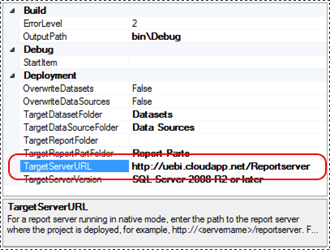

<properties
    pageTitle="SQL Server Business Intelligence | Microsoft Azure"
    description="In diesem Thema erstellte, mit dem Bereitstellungsmodell klassischen Ressourcen verwendet und verfügbaren Funktionen für die Business Intelligence (BI) für SQL Server auf Azure virtuellen Computern (virtuelle Computer) ausgeführt werden."
    services="virtual-machines-windows"
    documentationCenter="na"
    authors="guyinacube"
    manager="erikre"
    editor="monicar"
    tags="azure-service-management"/>
<tags
    ms.service="virtual-machines-windows"
    ms.devlang="na"
    ms.topic="article"
    ms.tgt_pltfrm="vm-windows-sql-server"
    ms.workload="infrastructure-services"
    ms.date="10/04/2016"
    ms.author="asaxton" />

# SQL Server Business Intelligence in Azure-virtuellen Computern

[AZURE.INCLUDE [learn-about-deployment-models](../../includes/learn-about-deployment-models-classic-include.md)]

Klicken Sie im Katalog Microsoft Azure-virtuellen Computern enthält Bilder, die SQL Server-Installationen enthalten. SQL Server-Editionen unterstützte Katalog Bilder sind die gleichen Installationsdateien, die lokalen Computer und virtuellen Computern installiert werden kann. In diesem Thema enthält eine Übersicht über die SQL Server Business Intelligence (BI)-Features, die auf die Bilder installiert und Konfigurationsschritte nach einer virtuellen Computern bereitgestellt wird. In diesem Thema werden auch unterstützte Bereitstellungstopologien BI-Funktionen und empfohlene Vorgehensweisen.

## Lizenz Aspekte

Es gibt zwei Methoden zum Lizenz SQL Server in Microsoft Azure virtuellen Computern aus:

1. Lizenz Mobilität Vorteile, die Software Assurance gehören. Weitere Informationen finden Sie unter [Lizenz Mobilität über Software Assurance-Azure](https://azure.microsoft.com/pricing/license-mobility/).

1. Bezahlen Sie pro pro Stunde von Azure virtuellen Computern mit SQL Server installiert ist. Finden Sie im Abschnitt "SQL Server" [Virtuellen Computern Preise](https://azure.microsoft.com/pricing/details/virtual-machines/#Sql)aus.

Weitere Informationen zur Lizenzierung und aktuellen Sätzen finden Sie unter [Virtuellen Computern Lizenzierung häufig gestellte Fragen](https://azure.microsoft.com/pricing/licensing-faq/%20/).

## SQL Server Bilder Azure virtuellen Computers Katalog verfügbar

Klicken Sie im Katalog Microsoft Azure-virtuellen Computern umfasst mehrere Bilder, die Microsoft SQL Server enthalten. Die Software auf virtuellen Computern Bilder richtet sich nach der Version des Betriebssystems und die Version von SQL Server. Die Liste der verfügbaren Bilder im Katalog Azure-virtuellen Computern häufig ändert.

 Das folgende PowerShell-Skript gibt die Liste der Azure Bilder, die "SQL Server" in der ImageName enthalten:

    # assumes you have already uploaded a management certificate to your Microsoft Azure Subscription. View the thumbprint value from the "settings" menu in Azure classic portal.

    $subscriptionID = ""    # REQUIRED: Provide your subscription ID.
    $subscriptionName = "" # REQUIRED: Provide your subscription name.
    $thumbPrint = "" # REQUIRED: Provide your certificate thumbprint.
    $certificate = Get-Item cert:\currentuser\my\$thumbPrint # REQUIRED: If your certificate is in a different store, provide it here.-Ser  store is the one specified with the -ss parameter on MakeCert

    Set-AzureSubscription -SubscriptionName $subscriptionName -Certificate $certificate -SubscriptionID $subscriptionID

    Write-Host -foregroundcolor green "List of available gallery images where imagename contains 2016"
    Write-Host -foregroundcolor green ">>>>>>>>>>>>>>>>>>>>>>>>>>>>>>>>>>>>>>>>>>>>>>>>>>>>>>>>>>>>>>>>>>"
    get-azurevmimage | where {$_.ImageName -Like "*SQL-Server-2016*"} | select imagename,category, location, label, description

    Write-Host -foregroundcolor green "List of available gallery images where imagename contains 2014"
    Write-Host -foregroundcolor green ">>>>>>>>>>>>>>>>>>>>>>>>>>>>>>>>>>>>>>>>>>>>>>>>>>>>>>>>>>>>>>>>>>"
    get-azurevmimage | where {$_.ImageName -Like "*SQL-Server-2014*"} | select imagename,category, location, label, description

Weitere Informationen zu Editionen und von SQL Server unterstützt werden finden Sie unter den folgenden:

- [SQL Server-Editionen](https://www.microsoft.com/server-cloud/products/sql-server-editions/#fbid=Zae0-E6r5oh)

- [Von den Editionen von SQLServer 2016 unterstützte Features](https://msdn.microsoft.com/library/cc645993.aspx)

### BI-Funktionen auf SQL Server virtuellen Computers Katalog Bilder

Die folgende Tabelle enthält eine Übersicht über die Business Intelligence-Features, die auf die allgemeine Microsoft Azure-virtuellen Computern Katalog Bilder für SQL Server installiert"

- SQL Server 2016 RC3

- SQL Server 2014 SP1 Enterprise

- SQL Server 2014 SP1 Standard

- SQL Server 2012 SP2 Enterprise

- SQL Server 2012-SP2 Standard

|SQL Server BI-Funktion|Klicken Sie auf das Bild im Katalog installiert|Notizen|
|---|---|---|
|**Reporting Services einheitlichen Modus**|Ja|Installiert, aber erfordert die Konfiguration, einschließlich der URL des Berichts-Manager. Finden Sie im Abschnitt [Reporting Services konfigurieren](#configure-reporting-services).|
|**SQL Server Reporting Services SharePoint-Modus**|Nein|Das Bild des Microsoft Azure-virtuellen Computern Katalog SharePoint- oder SharePoint nicht enthält Installationsdateien. 1|
|**Mehrdimensionalen Analysis Services- und Daten Mining (OLAP)**|Ja|Installiert und konfiguriert als Standard Analysis Services-Instanz|
|**Analysis Services tabellarischen**|Nein|Unterstützt in SQL Server 2012, ist 2014 und 2016 Bilder, aber es standardmäßig nicht installiert. Installieren von einer anderen Instanz von Analysis Services. Im Abschnitt finden Sie unter Installieren anderer SQL Server-Dienste und Features in diesem Thema.|
|**Analysis Services-PowerPivot für SharePoint**|Nein|Das Bild des Microsoft Azure-virtuellen Computern Katalog SharePoint- oder SharePoint nicht enthält Installationsdateien. 1|

1 für Weitere Informationen zu SharePoint und Azure-virtuellen Computern, finden Sie unter [Microsoft Azure Architekturen für SharePoint 2013](https://technet.microsoft.com/library/dn635309.aspx) und [SharePoint-Implementierung auf Microsoft Azure virtuellen Computern](https://www.microsoft.com/download/details.aspx?id=34598).

 Führen Sie den folgenden PowerShell-Befehl können Sie eine Liste der installierten Dienste zu gelangen, die in den Dienstnamen "SQL" enthalten.

    get-service | Where-Object{ $_.DisplayName -like '*SQL*' } | Select DisplayName, status, servicetype, dependentservices | format-Table -AutoSize

## Allgemeine Empfehlungen und Best Practices

- Die empfohlene Mindestgröße für einen virtuellen Computer ist **A3** aus, wenn SQL Server Enterprise Edition verwenden. Für SQL Server BI-Bereitstellungen mit Analysis Services und Reporting Services wird die Größe des virtuellen Computers **A4** empfohlen.

    Informationen zu den aktuellen virtuellen Computer Größen finden Sie unter [Virtuellen Computern Größen für Azure](virtual-machines-linux-sizes.md).

- Bewährte Methode für die Verwaltung der Datenträger ist zum Speichern von Daten, Protokolldateien und Sicherungsdateien auf anderen Laufwerken als **C**: und **D**:. Beispielsweise erstellen Daten Datenträger **E**: und **F**:.

    - Die Richtlinie für das Standard-Laufwerk **C**Zwischenspeichern Laufwerk: ist nicht optimal für die Arbeit mit Daten.

    - Die **D**: Laufwerk ist ein temporäres Laufwerk, die hauptsächlich für die Seite Datei verwendet wird. Die **D**: Laufwerk wird nicht beibehalten und nicht im BLOB-Speicher gespeichert ist. Verwaltungsaufgaben wie zum Beispiel eine Änderung der Größe des virtuellen Computers die **D**zurücksetzen: Laufwerk. Es wird empfohlen, **nicht** die **D**verwenden: Laufwerk für Datenbankdateien, einschließlich Tempdb.

    Weitere Informationen zum Erstellen und hinzufügen Festplatten finden Sie unter [So fügen Sie einen Datenträger mit einem virtuellen Computer](virtual-machines-windows-classic-attach-disk.md).

- Beenden oder Deinstallieren von Dienstleistungen, die Sie nicht verwenden möchten. Für Beispiel wenn des virtuellen Computers nur für Reporting Services verwendet wird, beenden oder Deinstallieren von Analysis Services und SQL Server Integration Services. Die folgende Abbildung ist ein Beispiel für die Dienste, die standardmäßig gestartet werden.

    

    >[AZURE.NOTE] Die SQL Server-Datenbank-Engine ist in den unterstützten BI Szenarien erforderlich. In einem einzelnen Server virtueller Computer Suchtopologie muss die Datenbank-Engine auf dem gleichen virtuellen Computer ausgeführt werden.

    Weitere Informationen finden Sie hier: [Reporting Services deinstallieren](https://msdn.microsoft.com/library/hh479745.aspx) und [Deinstallieren einer Instanz von Analysis Services](https://msdn.microsoft.com/library/ms143687.aspx).

- Neue 'wichtige Updates' prüfen Sie **Windows Update** . Microsoft Azure-virtuellen Computern Bilder werden häufig aktualisiert; wichtige Updates konnte jedoch von **Windows Update** verfügbar machen, nachdem das Bild virtueller Computer zuletzt aktualisiert wurde.

## Beispiel-Bereitstellungstopologien

Nachfolgend werden Beispiel-Bereitstellungen, die Microsoft Azure-virtuellen Computern verwenden. Die Topologien in diese Diagramme sind nur einige der möglichen Topologien, die mit SQL Server BI-Funktionen und Microsoft Azure-virtuellen Computern verwendet werden können.

### Einzelne virtuellen Computern

Analysis Services, Reporting Services, SQL Server-Datenbank-Engine und Datenquellen auf einem einzelnen virtuellen Computer.

### Zwei virtuellen Computern

- Analysis Services, Reporting Services und SQL Server-Datenbank-Engine auf einem einzelnen virtuellen Computer. Diese Bereitstellung enthält die Bericht Server-Datenbanken.

- Datenquellen einer zweiten virtuellen Computers. Der zweite virtueller Computer umfasst SQL Server-Datenbank-Engine als Datenquelle.

### Gemischte Azure – Daten auf SQL Azure-Datenbank

- Analysis Services, Reporting Services und SQL Server-Datenbank-Engine auf einem einzelnen virtuellen Computer. Diese Bereitstellung enthält die Bericht Server-Datenbanken.

- Datenquelle ist SQL Azure-Datenbank.

### Hybrid – Daten lokal

- Führen Sie in diesem Beispiel Bereitstellung Analysis Services Reporting Services und SQL Server-Datenbank-Engine auf einem einzelnen virtuellen Computer ein. Die Bericht-Server-Datenbanken des virtuellen Computers gehostet werden. Eine lokale Domäne durch Azure Virtual Networking oder einige andere VPN Tunnel Lösung des virtuellen Computers hinzugefügt.

- Lokale ist Datenquelle

## Reporting Services-Konfiguration einheitlichen Modus

Das Bild des virtuellen Computers-Katalog für SQL Server enthält Reporting Services einheitlichen Modus installiert, jedoch der Berichtsserver konfiguriert ist. Die Schritte in diesem Abschnitt konfigurieren den Reporting Services-Berichtsserver. Ausführlichere Informationen zum Konfigurieren von Reporting Services einheitlichen Modus finden Sie unter [Installieren von Reporting Services einheitlichen Modus Bericht Server (SSRS)](https://msdn.microsoft.com/library/ms143711.aspx).

>[AZURE.NOTE] Ähnliche Inhalte, die Windows PowerShell-Skripts wird verwendet, um den Berichtsserver zu konfigurieren, finden Sie unter [Verwenden von PowerShell einer Azure virtueller Computer mit einem einheitlichen Modus Berichtsserver erstellen](virtual-machines-windows-classic-ps-sql-report.md).

### Herstellen einer Verbindung des virtuellen Computers mit, und starten Sie den Reporting Services-Konfigurations-Manager

Es gibt zwei allgemeine Workflows zum Herstellen einer Verbindung zu einer Azure-virtuellen Computern aus:

- Klicken Sie im auf den Namen des virtuellen Computers verbinden, und klicken Sie auf **Verbinden**. Öffnet eine Remotedesktop-Verbindung und der Namen des Computers wird automatisch ausgefüllt.

    

- Verbinden Sie mit dem virtuellen Computer mit Windows Remote Desktop-Verbindung. In der Benutzeroberfläche von der Remotedesktop:

    1. Geben Sie den **Namen der Cloud-Dienst** unter dem Namen des Computers ein.

    1. Geben Sie ein Doppelpunkt (:) und die öffentlichen Port-Nummer, die für den remote desktop TCP-Endpunkt konfiguriert ist.

        MyService.cloudapp.NET:63133

        Weitere Informationen finden Sie unter [Neuigkeiten auf einen Clouddienst?](https://azure.microsoft.com/manage/services/cloud-services/what-is-a-cloud-service/).

**Reporting Services-Konfigurations-Manager zu starten.**

1. In **WindowsServer 2012**:

1. Geben Sie **den Startbildschirm,** **Reporting Services** , um eine Liste der Apps finden Sie unter.

1. Mit der rechten Maustaste **Reporting Services-Konfigurations-Manager** , und klicken Sie auf **als Administrator ausführen**.

1. In **Windows Server 2008 R2**:

1. Klicken Sie auf **Start**, und klicken Sie dann auf **Alle Programme**.

1. Klicken Sie auf **Microsoft SQL Server 2016**.

1. Klicken Sie auf **Konfigurationstools**.

1. Mit der rechten Maustaste **Reporting Services-Konfigurations-Manager** , und klicken Sie auf **als Administrator ausführen**.

Oder

1. Klicken Sie auf **Start**.

1. Geben Sie im Dialogfeld **Programme / Dateien durchsuchen** **reporting Services**ein. Wenn Sie der virtuellen Computer mit Windows Server 2012 ausgeführt wird, geben Sie **reporting Services** auf Windows Server 2012-Startbildschirm ein.

1. Mit der rechten Maustaste **Reporting Services-Konfigurations-Manager** , und klicken Sie auf **als Administrator ausführen**.

    

### Konfigurieren von Reporting Services

**Dienst Dienstkontos und Web-URL:**

1. Stellen Sie sicher, dass der **Servername** den lokalen Servernamen ist, und klicken Sie auf **Verbinden**.

1. Notieren Sie sich die leere **Berichtsname Server-Datenbank**. Die Datenbank wird erstellt, wenn die Konfiguration abgeschlossen ist.

1. Stellen Sie sicher, dass der **Status der Bericht-Server** **gestartet**ist. Wenn Sie den Dienst in Windows Server-Manager überprüfen möchten, ist der Dienst den **SQL Server Reporting Services** -Windows-Dienst aus.

1. Klicken Sie auf **Dienstkontos** , und ändern Sie das Konto aus, je nach Bedarf. Wenn die virtuellen Computern in einer verknüpften Umgebung ohne Domäne verwendet wird, ist das integrierte **Berichtsserver** Konto ausreichend. Weitere Informationen über das Dienstkonto finden Sie unter [Dienstkontos](https://msdn.microsoft.com/library/ms189964.aspx).

1. Klicken Sie im linken Bereich auf **Webdienst-URL** .

1. Klicken Sie auf **Übernehmen** , um die Standardwerte zu konfigurieren.

1. Beachten Sie die **Bericht Server Webdienst-URLs**. Beachten Sie die standardmäßige 80 als auch Teil der URL ist. In einem späteren Schritt erstellen Sie eine Microsoft Azure-virtuellen Computern-Endpunkt für den Port aus.

1. Überprüfen Sie im **Ergebnisbereich** die Aktionen wurde erfolgreich abgeschlossen.

**Datenbank:**

1. Klicken Sie im linken Bereich auf **Datenbank** .

1. Klicken Sie auf **Datenbank ändern**.

1. Stellen Sie sicher, dass **eine neue Berichtsserver-Datenbank erstellen** ausgewählt ist, und klicken Sie dann auf Weiter.

1. Überprüfen Sie **Servernamen** , und klicken Sie auf **Verbindung testen**.

1. Ist das Ergebnis **Test-Verbindung erfolgreich verlaufen ist**, klicken Sie auf **OK** , und klicken Sie dann auf **Weiter**.

1. Beachten Sie der Datenbanknamen ist **Berichtsserver** und den **Berichts-Server-Modus** ist **Native** und dann auf **Weiter**.

1. Klicken Sie auf der Seite **Anmeldeinformationen** auf **Weiter** .

1. Klicken Sie auf der Seite **Zusammenfassung** auf **Weiter** .

1. Klicken Sie auf **Weiter** klicken Sie auf der Seite **fortsetzen und Fertig stellen** .

**Web Portal URL oder Berichts-Manager-URL für 2012 und 2014 an:**

1. Klicken Sie auf **Web-Portal-URL**oder **Berichts-Manager-URL** für 2014 und 2012 im linken Bereich.

1. Klicken Sie auf **Übernehmen**.

1. Überprüfen Sie im **Ergebnisbereich** die Aktionen wurde erfolgreich abgeschlossen.

1. Klicken Sie auf **Beenden**.

Finden Sie unter Informationen zum Bericht Serverberechtigungen [Erteilen von Berechtigungen für einen Berichtsserver im systemeigenen Modus](https://msdn.microsoft.com/library/ms156014.aspx).

### Navigieren Sie zu der lokalen Berichts-Manager

Navigieren Sie zu Berichts-Manager des virtuellen Computers, um die Konfiguration zu überprüfen.

1. Starten Sie Internet Explorer des virtuellen Computers mit Administratorrechten.

1. Navigieren Sie zu http://localhost/reports des virtuellen Computers.

### Zum Verbinden mit Remote Web-Portal oder Berichts-Manager für 2014 und 2012

Erstellen Sie einen neuen virtuellen Computer TCP-Endpunkt Wenn Sie die Web-Portal oder Berichts-Manager für 2014 und 2012 des virtuellen Computers von einem Remotecomputer herstellen möchten. Standardmäßig überwacht der Berichtsserver HTTP-Anfragen auf **Port 80**. Wenn Sie die Verwendung eines anderen Ports Berichtsserver-URLs konfiguriert haben, müssen Sie die Port-Nummer in den folgenden Anweisungen angeben.

1. Erstellen Sie einen Endpunkt des virtuellen Computers von TCP-80 ein. Weitere Informationen finden Sie unter Abschnitt [virtuellen Computern Endpunkte und Firewallports](#virtual-machine-endpoints-and-firewall-ports) in diesem Dokument.

1. Öffnen Sie in den virtuellen Computern Firewall Port 80.

1. Navigieren Sie zu der Web-Portal oder Berichts-Manager, wobei Azure-virtuellen Computern **DNS-Namen** als den Servernamen in der URL. Beispiel:

    **Berichtsserver**: http://uebi.cloudapp.net/reportserver  **Web-Portal**: http://uebi.cloudapp.net/reports

    [Konfigurieren Sie eine Firewall für den Zugriff auf Berichte-Server](https://msdn.microsoft.com/library/bb934283.aspx)

### Erstellen und Veröffentlichen von Berichten auf der Azure-virtuellen Computern

In der folgenden Tabelle sind einige vorhandene Berichte aus einem lokalen Computer mit dem Berichtsserver gehostet auf Microsoft Azure virtuellen Computern veröffentlichen verfügbaren Optionen zusammengefasst:

- **Berichts-Generator**: des virtuellen Computers enthält, klicken Sie auf die-einmal-Version von Microsoft SQL Server Berichts-Generator für SQL 2014 und 2012. So starten Sie Berichts-Generator das erste Mal auf dem virtuellen Computer mit SQL 2016

    1. Starten Sie Ihren Browser mit Administratorrechten an.

    1. Navigieren Sie zu der Webportal auf dem virtuellen Computer, und wählen Sie das Symbol " **herunterladen** " in der oberen rechten Ecke.
    
    1. Wählen Sie **Berichts-Generator**an.

    Weitere Informationen finden Sie unter [Starten des Berichts-Generator](https://msdn.microsoft.com/library/ms159221.aspx).

- **SQL Server Data Tools**: virtueller Computer: SQL Server Data Tools auf dem virtuellen Computer installiert ist, und können verwendet werden, um den **Bericht Serverprojekte** und Berichte des virtuellen Computers zu erstellen. SQL Server Data Tools können die Berichte mit dem Berichtsserver des virtuellen Computers veröffentlichen.

- **SQL Server Data Tools: Remote**: auf dem lokalen Computer, erstellen Sie ein Reporting Services-Projekt in SQL Server Data Tools, die Reporting Services-Berichte enthält. Konfigurieren Sie das Projekt, um die Verbindung mit der Webdienst-URL ein.

    

- Erstellen einer. Virtuelle Festplatte Festplatte, die Berichte enthält, und klicken Sie dann hochladen, und schließen Sie das Laufwerk.

    1. Erstellen einer. Virtuelle Festplatte Festplatte auf Ihrem lokalen Computer, der Ihre Berichte enthält.

    1. Erstellen Sie und installieren Sie eines Zertifikats einer Management.

    1. Hochladen der Datei virtuelle Festplatte in Azure mithilfe des Cmdlets hinzufügen-AzureVHD [Erstellen und Hochladen einer Windows Server virtuellen in Azure](virtual-machines-windows-classic-createupload-vhd.md).

    1. Fügen Sie den Datenträger an des virtuellen Computers.

## Installieren Sie anderer SQL Server-Dienste und features

Führen Sie den Setup-Assistenten von SQL Server, um zusätzliche SQL Server-Dienste, wie z. B. Analysis Services in tabellarischen Modus zu installieren. Die Setup-Dateien werden auf der lokalen Festplatte des virtuellen Computers.

1. Klicken Sie auf **Start** , und klicken Sie dann auf **Alle Programme**.

1. Klicken Sie auf **Microsoft SQL Server 2016**, **Microsoft SQL Server 2014** oder **Microsoft SQL Server 2012** , und klicken Sie dann auf **Konfigurationstools**.

1. Klicken Sie auf **SQL Server-Installation Center**.

C:\SQLServer_13.0_full\setup.exe, C:\SQLServer_12.0_full\setup.exe oder C:\SQLServer_11.0_full\setup.exe oder ausführen

>[AZURE.NOTE] Beim ersten Ausführen von SQL Server-Setup Weitere Setup-Dateien heruntergeladen werden können und erfordert einen Neustart des virtuellen Computers und einen Neustart von SQL Server-Setup.
>
>Wenn Sie das Bild aus Microsoft Azure virtuellen Computern ausgewählt wiederholt anpassen müssen, erwägen Sie das Erstellen eigener Bilder für SQL Server. Analysis Services SysPrep Funktionalität wurde mit SQL Server 2012 SP1 CU2 aktiviert. Weitere Informationen finden Sie unter [Überlegungen für die Installation von SQL Server mithilfe von SysPrep](https://msdn.microsoft.com/library/ee210754.aspx) und [Sysprep-Unterstützung für Serverrollen](https://msdn.microsoft.com/windows/hardware/commercialize/manufacture/desktop/sysprep-support-for-server-roles).

### So installieren Sie tabellarischen Analysis Services-Modus

Die Schritte in diesem Abschnitt **zusammenfassen** der Installation von tabellarischen Analysis Services-Modus. Weitere Informationen finden Sie unter:

- [Installieren von Analysis Services in tabellarischen Modus](https://msdn.microsoft.com/library/hh231722.aspx)

- [Tabellarische Modellierung (Adventure Works-Lernprogramm)](https://msdn.microsoft.com/library/140d0b43-9455-4907-9827-16564a904268)

**So installieren Sie tabellarischen Analysis Services-Modus**

1. Klicken Sie in der SQL Server-Installation-Assistent im linken Bereich auf **Installation** , und klicken Sie dann auf **eigenständige neue SQL Server-Installation oder Hinzufügen von Features zu einer vorhandenen Installation**.

    - Wenn Sie den **Ordner suchen**angezeigt wird, wechseln Sie zu c:\SQLServer_13.0_full, c:\SQLServer_12.0_full oder c:\SQLServer_11.0_full, und klicken Sie dann auf **Ok**.

1. Klicken Sie auf der Produktseite-Updates auf **Weiter** .

1. Klicken Sie auf der Seite **Installation Type** wählen Sie **eine neue Installation von SQL Server-ausführen** aus, und klicken Sie auf **Weiter**.

1. Klicken Sie auf der Seite **Setup Rolle** **Installation von SQL Server-Features**auf.

1. Klicken Sie auf der Seite **Featureauswahl** auf **Analysis Services**.

1. Geben Sie auf der Seite **Konfiguration Instanz** einen beschreibenden Namen, wie z. B. **Tabellarisch** in Textfelder **Instanz mit dem Namen** und die **Instanz-Id** ein.

1. Wählen Sie auf der Seite **Analysis Services-Konfiguration** **Tabellarischen Modus**aus. Fügen Sie den aktuellen Benutzer zur Liste Administratorberechtigungen.

1. Beenden Sie und schließen Sie den Assistenten zum Installieren von SQL Server.

## Analysis Services-Konfiguration

### Remotezugriff auf Analysis Services-Server

Analysis Services-Server unterstützt nur Windows-Authentifizierung. Um Analysis Services-Clientanwendungen, wie etwa SQL Server Management Studio oder SQL Server Data Tools remote zugreifen, muss der virtuellen Computern der lokalen Domäne, die mit Azure Virtual Networking verknüpft werden. Weitere Informationen finden Sie unter [Azure-virtuellen Netzwerk](../virtual-network/virtual-networks-overview.md).

Eine **Standardinstanz** von Analysis Services hört TCP Port **2383**aus. Öffnen Sie den Port in der Firewall virtuellen Computern an. Eine gruppierte benannte Instanz von Analysis Services überwacht außerdem den Port **2383**.

Für eine **benannte Instanz** von Analysis Services ist der SQL Server-Browser-Dienst zum Verwalten des Zugriffs Port erforderlich. Die standardmäßige SQL Server-Browser-Konfiguration ist Port **2382**.

Klicken Sie in der Firewall virtuellen Computern öffnen Sie Port **2382** , und erstellen Sie eines statischen Analysis Services mit dem Namen Instanz Port.

1. Zum Überprüfen der Ports, die bereits auf dem virtuellen Computer und welche Prozess die Ports verwendet wird, führen Sie den folgenden Befehl mit Administratorrechten:

        netstat /ao

1. Verwenden Sie SQL Server Management Studio zum Erstellen eines statischen Analysis Services mit dem Namen Instanz Port durch Aktualisieren 'Port' Wert in tabellarischen AS Instanz der allgemeine Eigenschaften fest. Weitere Informationen finden Sie unter den "verwenden einen festen Anschluss für einen Standardwert oder benannte Instanz" in [konfigurieren die Windows-Firewall für den Analysis Services-Zugriff](https://msdn.microsoft.com/library/ms174937.aspx#bkmk_fixed).

1. Starten Sie die tabellarische Instanz von Analysis Services-Dienst neu.

Weitere Informationen finden Sie unter Abschnitt **virtuellen Computern Endpunkte und Firewallports** in diesem Dokument.

## Virtuellen Computern Endpunkte und Firewallports

In diesem Abschnitt wird erörtert, Microsoft Azure-virtuellen Computern Endpunkte erstellen und Ports, die in den virtuellen Computern Firewalls geöffnet. Zum Erstellen von Endpunkten für die **TCP-** Ports und die Ports in der Firewall virtuellen Computern öffnen, werden in der folgenden Tabelle zusammengefasst.

- Wenn Sie ein einzelnes virtuellen Computers verwenden und die beiden folgenden Elemente wahr sind, zum Erstellen von virtuellen Computer Endpunkte nicht benötigen, und Sie müssen nicht die Ports in der Firewall des virtuellen Computers zu öffnen.

    - Sie sind nicht mit den SQL Server-Features des virtuellen Computers Remote verbunden. Herstellen einer remote desktop-Verbindungs mit dem virtuellen Computer und den Zugriff auf die SQL Server-Features lokal auf dem virtuellen Computer wird eine Verbindung zu den Features von SQL Server nicht berücksichtigt werden.

    - Sie führen Sie den virtuellen Computer nicht zu einer lokalen Domäne durch Azure Virtual Networking oder einem anderen VPN-Tunneling-Lösung teilnehmen.

- Wenn des virtuellen Computers nicht mit einer Domäne verknüpft ist, aber soll Remote verbinden Sie an den Features von SQL Server auf virtuellen Computer:

    - Öffnen Sie die Ports in der Firewall des virtuellen Computers.

    - Erstellen von virtuellen Computern Endpunkte für die erwähnten Ports (*).

- Wenn Sie eine Domäne einen VPN-Tunnel wie Azure Virtual Networking mithilfe des virtuellen Computers hinzugefügt wird, sind die Endpunkte nicht erforderlich. Öffnen Sie die Ports jedoch in der Firewall des virtuellen Computers.

  	|Port|Typ|Beschreibung|
|---|---|---|
|**80**|TCP|Berichtsserver RAS (*).|
|**1433**|TCP|SQL Server Management Studio (*).|
|**1434**|UDP|SQL Server-Browser. Dies ist erforderlich, wenn der virtuellen Computer in eine Domäne hinzugefügt.|
|**2382**|TCP|SQL Server-Browser.|
|**2383**|TCP|SQL Server Analysis Services-Standardinstanz und gruppierte benannte Instanzen.|
|**Benutzerdefinierte**|TCP|Erstellen eines statischen Analysis Services mit dem Namen Instanz Port für eine Portnummer, die Sie auswählen und dann Aufheben der Blockierung der Port-Nummer in die Firewall.|

Weitere Informationen zum Erstellen von Endpunkten finden Sie unter den folgenden:

- Erstellen Sie Endpunkte[zum Einrichten von Endpunkten in einer virtuellen Computern](virtual-machines-windows-classic-setup-endpoints.md).

- SQLServer: Siehe Abschnitt "Abgeschlossen Konfiguration Schritte zum Herstellen des virtuellen Computers verwenden SQL Server Management Studio" der [Bereitstellung einer SQL Server virtuellen Computers auf Azure](virtual-machines-windows-portal-sql-server-provision.md).

Das folgende Diagramm veranschaulicht die Ports zum Öffnen in Firewalls virtueller Computer, um remote-Zugriff auf die Features und Komponenten des virtuellen Computers zu ermöglichen.

## Ressourcen

- Überprüfen Sie den Supportrichtlinien für Microsoft-Server-Software in der Umgebung Azure-virtuellen Computern verwendet werden. Im folgende Thema enthält eine Übersicht über die Unterstützung für Features wie BitLocker, Failoverclustering und Netzwerklastenausgleich. [Microsoft-Software unterstützen für Azure virtuellen Computern](http://support.microsoft.com/kb/2721672).

- [SQLServer auf Azure-virtuellen Computern (Übersicht)](virtual-machines-windows-sql-server-iaas-overview.md)

- [Virtuellen Computern](https://azure.microsoft.com/documentation/services/virtual-machines/)

- [Bereitstellung einer SQL Server virtuellen Computers auf Azure](virtual-machines-windows-portal-sql-server-provision.md)

- [So fügen Sie einen Datenträger mit einem virtuellen Computer](virtual-machines-windows-classic-attach-disk.md)

- [Migrieren einer Datenbank mit SQLServer ein Azure-virtuellen Computers](virtual-machines-windows-migrate-sql.md)

- [Ermitteln der Analysis Services-Instanz der Server-Ansichtsmodus](https://msdn.microsoft.com/library/gg471594.aspx)

- [Multidimensionale Modellierung (Adventure Works-Lernprogramm)](https://technet.microsoft.com/library/ms170208.aspx)

- [Azure-Dokumentation Center](https://azure.microsoft.com/documentation/)

- [Verwenden von Power BI in einer Hybridumgebung](https://msdn.microsoft.com/library/dn798994.aspx)

>[AZURE.NOTE] [Übermitteln von Feedback und Kontaktinformationen über Microsoft SQL Server herstellen](https://connect.microsoft.com/SQLServer/Feedback)

### Communityinhalt

- [Verwaltung von SQL Azure-Datenbank mit PowerShell](http://blogs.msdn.com/b/windowsazure/archive/2013/02/07/windows-azure-sql-database-management-with-powershell.aspx)
