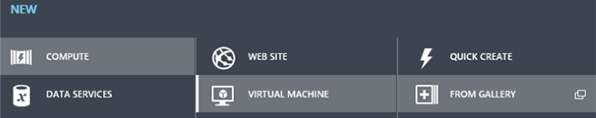
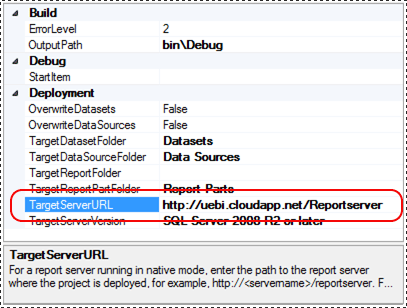

<properties 
    pageTitle="Verwenden Sie zum Erstellen eines virtuellen Computers mit einer einheitlichen Modus Berichtsserver PowerShell | Microsoft Azure"
    description="In diesem Thema werden und führt Sie durch die Bereitstellung und Konfiguration von einem SQL Server Reporting Services einheitlichen Modus Berichtsserver in einer Azure-virtuellen Computern. "
    services="virtual-machines-windows"
    documentationCenter="na"
    authors="guyinacube"
    manager="erikre"
    editor="monicar" 
    tags="azure-service-management"/>
<tags 
    ms.service="virtual-machines-windows"
    ms.devlang="na"
    ms.topic="article"
    ms.tgt_pltfrm="vm-windows-sql-server"
    ms.workload="infrastructure-services"
    ms.date="10/04/2016"
    ms.author="asaxton" />

# Verwenden Sie zum Erstellen einer Azure-virtuellen Computer mit einer einheitlichen Modus Berichtsserver PowerShell

[AZURE.INCLUDE [learn-about-deployment-models](../../includes/learn-about-deployment-models-classic-include.md)]
 

In diesem Thema werden und führt Sie durch die Bereitstellung und Konfiguration von einem SQL Server Reporting Services einheitlichen Modus Berichtsserver in einer Azure-virtuellen Computern. Die Schritte in diesem Dokument verwenden eine Kombination aus manuelle Schritte zum Erstellen des virtuellen Computers und ein Windows PowerShell-Skript zu Reporting Services des virtuellen Computers zu konfigurieren. Das Skript enthält eine Firewallports für HTTP oder HTTPs öffnen.

>[AZURE.NOTE] Wenn Sie keine **HTTPS** auf dem Berichtsserver, **Überspringen Sie Schritt 2**benötigt werden.
>
>Nachdem die virtuellen Computer in Schritt 1 erstellt haben, wechseln Sie zum Abschnitt Skript zum Konfigurieren der Berichtsserver und HTTP verwenden. Nachdem Sie das Skript ausführen ist der Berichtsserver verwendet.

## Voraussetzungen und Annahmen

- **Azure-Abonnement**: Überprüfen Sie die Anzahl der Kerne in Ihrem Abonnement Azure verfügbar. Wenn Sie die empfohlene Größe virtueller Computer **A3**erstellen, benötigen Sie die verfügbaren Kerne **4** . Wenn Sie eine Größe virtueller Computer **A2**verwenden, benötigen Sie verfügbaren Kerne **2** aus.
    
    - Zum Überprüfen der Core Limit Ihres Abonnements, im Portal Azure klassischen klicken Sie auf EINSTELLUNGEN im linken Bereich und dann klicken Sie auf Verwendung im oberen Menü.
    
    - Wenden Sie sich an [Azure-Support](https://azure.microsoft.com/support/options/), um das Kontingent Core zu erhöhen. Virtueller Computer Größeninformationen finden Sie unter [Virtuellen Computern Größen für Azure](virtual-machines-linux-sizes.md).

- **Windows PowerShell-Skripting**: das Thema wird davon ausgegangen, dass Sie über grundlegende Kenntnisse von Windows PowerShell verfügen. Weitere Informationen zur Verwendung von Windows PowerShell finden Sie unter den folgenden:

    - [Starten von Windows PowerShell unter WindowsServer](https://technet.microsoft.com/library/hh847814.aspx)
    
    - [Erste Schritte mit Windows PowerShell](https://technet.microsoft.com/library/hh857337.aspx)

## Schritt 1: Bereitstellen eines Azure-virtuellen Computern

1. Navigieren Sie zum klassischen Azure-Portal an.

1. Klicken Sie im linken Bereich auf **virtuellen Computern** .

    

1. Klicken Sie auf **neu**.

    

1. Klicken Sie **im Katalog**auf.

    

1. Klicken Sie auf **SQL Server 2014 RTM Standard – Windows Server 2012 R2** , und klicken Sie dann auf den Pfeil, um den Vorgang fortzusetzen.

    

    Wenn Sie die Reporting Services-Daten leistungsgesteuert Abonnements Features benötigen, wählen Sie **SQL Server 2014 RTM Enterprise – Windows Server 2012 R2**. Weitere Informationen unter SQL Server-Editionen und Unterstützung von Features finden Sie unter [-Editionen von SQL Server 2012 unterstützte Features](https://msdn.microsoft.com/library/cc645993.aspx#Reporting).

1. Bearbeiten Sie auf der Seite **Konfiguration des virtuellen Computers** die folgenden Felder ein:
                                    
    - Ist mehr als ein **Datum der Freigabe VERSION**, wählen Sie die neueste Version aus.
    
    - **Name des virtuellen Computers**: der Name des Computers wird auch auf der nächsten Seite der Konfiguration als den Standardnamen für die DNS-Cloud-Dienst verwendet. Der DNS-Name muss über Azure Service eindeutig sein. Erwägen Sie das Konfigurieren des virtuellen Computer mit einem Computernamen, der beschreibt, wofür der virtuellen Computer verwendet wird. Beispielsweise Ssrsnativecloud.
    
    - **Stufe**: Standard
    
    - **Größe: A3** ist die empfohlene virtueller Speicher für SQL Server-Auslastung. Wenn ein virtueller Computer nur als einen Berichtsserver verwendet wird, ist eine Größe virtueller Computer A2 ausreichend, wenn der Berichtsserver eine große Arbeitsbelastung auftritt. Virtueller Computer Preisinformationen finden Sie unter [Virtuellen Computern Preise](https://azure.microsoft.com/pricing/details/virtual-machines/).
    
    - **Neuer Benutzername**: der Namen, den Sie als Administrator des virtuellen Computers erstellt wird.
    
    - **Neues Kennwort** und **bestätigen**. Dieses Kennwort ist für das neue Administratorkonto verwendet, und es wird empfohlen, dass Sie ein sicheres Kennwort verwenden.
    
    - Klicken Sie auf **Weiter**. 

1. Bearbeiten Sie auf der nächsten Seite die folgenden Felder ein:

    - **Cloud-Dienst**: **Erstellen einer neuen Cloud-Dienst**auswählen.
    
    - **Cloud Service DNS-Name**: Dies ist der öffentlichen DNS-Name des Cloud-Dienst, der mit dem virtuellen Computer verknüpft ist. Der Standardname ist der Name, den Sie für den Namen des virtuellen Computers in eingegeben haben. Wenn in späteren Schritten des Themas, erstellen Sie ein Zertifikat einer vertrauenswürdiges Zertifizierungsstelle, und klicken Sie dann der DNS-Namen für den Wert von "**ausgestellt für**" des Zertifikats verwendet wird.
    
    - **Region/Zugehörigkeit Gruppe/virtuellen Netzwerk**: Wählen Sie Ihre Region Ihrer Endbenutzer aus.
    
    - **Speicher-Konto**: Verwenden Sie ein automatisch generiertes Speicherkonto.
    
    - **Festlegen der Verfügbarkeit**: keine.
    
    - **ENDPUNKTE** Behalten Sie die Endpunkte **Remotedesktop** und **PowerShell bei** , und fügen Sie dann eine HTTP oder HTTPS-Endpunkt, abhängig von Ihrer Umgebung.

        - **HTTP**: die standardmäßigen öffentlichen und privaten Ports sind **80**. Hinweis Das ändern, wenn Sie einen privaten Port als 80; verwenden **$HTTPport = 80** im HTTP-Skript.

        - **HTTPS**: die standardmäßigen öffentlichen und privaten Ports sind **443**. Aus Sicherheitsgründen ist zum Ändern des privaten Anschluss und Konfigurieren der Firewall und den Berichtsserver den privaten Port verwenden. Weitere Informationen über Endpunkte finden Sie unter [So Festlegen von Kommunikation mit einem virtuellen Computer](virtual-machines-windows-classic-setup-endpoints.md). Hinweis Wenn Sie einen anderen Anschluss als 443, verwenden Sie den Parameter ändern, die **$HTTPsport = 443** im Skript HTTPS.
    
    - Klicken Sie auf Weiter. 

1. Klicken Sie auf der letzten Seite des Assistenten lassen Sie die Standardeinstellung **des virtuellen Computer-Agents installieren** ausgewählt. Die Schritte in diesem Thema Verwenden des virtuellen Computer-Agents nicht, wenn Sie beabsichtigen, die diesem virtuellen Computer beibehalten, die virtuellen Computer-Agents und Erweiterungen werden ermöglichen Ihnen jedoch er CM zu verbessern.  Weitere Informationen zu den virtuellen Computer Agent finden Sie unter [virtueller Computer-Agents und Erweiterungen – Teil 1](https://azure.microsoft.com/blog/2014/04/11/vm-agent-and-extensions-part-1/). Eine der Standard-Erweiterungen installiert Anzeige ausgeführt wird die Erweiterung "BGINFO", die auf dem Desktop virtueller Computer, Systeminformationen wie interne IP-Adresse und freier Speicherplatz angezeigt werden.

1. Klicken Sie auf abgeschlossen. 

1. Den **Status** der virtuellen Computer zeigt als **Felder starten (Provisioning)** während des Prozesses bereitstellen und anschließend als **ausgeführt** , wenn der virtuellen Computer bereitgestellte und zur Verwendung bereit ist.

## Schritt 2: Erstellen eines Zertifikats

>[AZURE.NOTE] Wenn Sie auf dem Berichtsserver HTTPS nicht benötigen, können Sie **Überspringen Sie Schritt 2,** und wechseln Sie zum Abschnitt **Skript zum Konfigurieren der Berichtsserver und HTTP verwenden**. Verwenden des HTTP-Skripts, um schnell den Berichtsserver konfigurieren und der Berichtsserver wird verwendet werden.

HTTPS des virtuellen Computers verwenden möchten, benötigen Sie ein Zertifikat einer vertrauenswürdiges Zertifizierungsstelle. Abhängig von Ihrem Szenario können Sie eine der folgenden beiden Methoden verwenden:

- Ein gültiges SSL-Zertifikat von einer Zertifizierungsstelle (CA) ausgestellt und vertrauenswürdige von Microsoft. Die Zertifikate der Zertifizierungsstelle Stammzertifizierungsstelle müssen über die Microsoft Root Certificate Program verteilt werden. Weitere Informationen zu diesem Programm finden Sie unter [Windows und Windows Phone 8 SSL Root Certificate Program (Mitglied Zertifizierungsstellen)](http://social.technet.microsoft.com/wiki/contents/articles/14215.windows-and-windows-phone-8-ssl-root-certificate-program-member-cas.aspx) und [Einführung in das Microsoft Root Certificate Program](http://social.technet.microsoft.com/wiki/contents/articles/3281.introduction-to-the-microsoft-root-certificate-program.aspx).

- Ein selbst signiertes Zertifikat. Selbstsignierte Zertifikaten werden nicht für die Herstellung Umgebungen empfohlen.

### Verwenden Sie ein Zertifikat erstellt von einer vertrauenswürdigen Zertifizierungsstelle (CA)

1. **Ein Serverzertifikat für die Website von einer Zertifizierungsstelle anfordern**. 

    Sie können mit dem Zertifikat-Assistenten zu eine Datei mit der Anforderung (Certreq.txt) zu erzeugen, die Sie an eine Zertifizierungsstelle senden, oder um eine Anforderung für eine online-Zertifizierungsstelle verwenden. Beispielsweise Microsoft Certificate Services in Windows Server 2012. Abhängig von der Kennung Assurance Ihr Serverzertifikat bieten ist es mehrere Tage bis zu mehreren Monaten für die Zertifizierungsstelle Ihren Antrag genehmigen und senden Sie eine Zertifikatsdatei. 

    Weitere Informationen zum Anfordern einer Serverzertifikate finden Sie unter den folgenden: 
    
    - Verwenden Sie [Certreq](https://technet.microsoft.com/library/cc725793.aspx), [Certreq](https://technet.microsoft.com/library/cc725793.aspx).
    
    - Verwalten von WindowsServer 2012-Sicherheits-Tools.

    [Sicherheits-Tools zum Verwalten von WindowsServer 2012](https://technet.microsoft.com/library/jj730960.aspx)

    >[AZURE.NOTE] Das Feld **ausgestellt für** vertrauenswürdigen SSL-Zertifikat sollten identisch mit der **Cloud Service DNS-NAME** , der für den neuen virtuellen Computer verwendet.

1. **Das Serverzertifikat auf dem Webserver installieren**. Der Webserver ist in diesem Fall den virtuellen Computer, auf dem den Berichtsserver gehostet, und die Website wird in späteren Schritten erstellt, wenn Sie Reporting Services konfigurieren. Weitere Informationen zu das Serverzertifikat auf dem Webserver mithilfe der Zertifikats-MMC-Snap-in installieren finden Sie unter [Installieren eines Zertifikats einer Server](https://technet.microsoft.com/library/cc740068).
    
    Wenn Sie das Skript in diesem Thema enthaltenen verwenden möchten, ist zum Konfigurieren des Berichtsserver, der Wert der Zertifikate **Fingerabdruck** als Parameter des Skripts erforderlich. Finden Sie im nächste Abschnitt Details zum Abrufen des Fingerabdrucks des Zertifikats ein.

1. Weisen Sie das Serverzertifikat mit dem Berichtsserver her. Die Zuordnung ist im nächsten Abschnitt beendet, wenn Sie den Berichtsserver zu konfigurieren.

### Verwenden Sie die virtuellen Computern selbstsignierten Zertifikats

Ein selbst signiertes Zertifikat wurde des virtuellen Computers erstellt, wenn Sie der virtuellen Computer bereitgestellt wurde. Das Zertifikat hat denselben Namen wie der VM DNS-Name. Um Zertifikatfehler zu vermeiden, ist es erforderlich, dass das Zertifikat des virtuellen Computers selbst und alle Benutzer der Website vertrauenswürdig ist.

1. Stammzertifizierungsstelle des Zertifikats auf dem lokalen virtuellen Computer vertrauen möchten, fügen Sie das Zertifikat den **Trusted Root Zertifizierungsstellen**aus. Im folgenden finden eine Zusammenfassung der erforderlichen Schritte. Die detaillierten Schritte zum die Zertifizierungsstelle vertrauen möchten, finden Sie unter [Installieren eines Zertifikats einer Server](https://technet.microsoft.com/library/cc740068).

    1. Vom Azure klassischen Portal wählen Sie den virtuellen Computer aus, und klicken Sie auf Verbinden. Je nach Browserkonfiguration werden Sie möglicherweise aufgefordert, eine RDP-Datei für die Verbindung mit dem virtuellen Computer speichern.
    
         Verwenden Sie Benutzername des virtuellen Computers, Benutzername und Kennwort ein, das Sie konfiguriert werden, wenn Sie den virtuellen Computer erstellt haben. 
    
        In der folgenden Abbildung, beispielsweise der Namen des virtuellen Computers ist **Ssrsnativecloud** und der Benutzername ist **Testbenutzer**.
        
        
    
    1. Führen Sie mmc.exe ein. Weitere Informationen finden Sie unter [wie: Anzeigen von Zertifikaten mit dem MMC-Snap-in](https://msdn.microsoft.com/library/ms788967.aspx).
    
    1. Im Menü **Datei** Console-Anwendung das **Zertifikate** -Snap-in fügen Sie hinzu, wählen Sie **Computerkonto** , wenn Sie aufgefordert werden, und klicken Sie dann auf **Weiter**.
    
    1. Wählen Sie **Lokalen Computer** zu verwalten, und klicken Sie dann auf **Fertig stellen**.
    
    1. Klicken Sie auf **Ok** , und blenden Sie dann die **Zertifikate - persönliche** Knoten, und klicken Sie dann auf **Zertifikate**. Das Zertifikat wird nach der DNS-Name, der den virtuellen Computer benannt und endet mit **cloudapp.net**. Mit der rechten Maustaste in der Name des Zertifikats, und klicken Sie auf **Kopieren**.
    
    1. Erweitern Sie den Knoten **Trusted Root Zertifizierungsstellen** Maustaste klicken Sie dann auf **Zertifikate** , und klicken Sie dann auf **Einfügen**.
    
    1. Um zu überprüfen, klicken Sie auf der Name des Zertifikats unter **Trusted Root Zertifizierungsstellen** auf doppelklicken und stellen Sie sicher, dass keine Fehler enthalten sind und das Zertifikat angezeigt. Wenn Sie das in diesem Thema enthaltene HTTPS-Skript verwenden möchten, ist zum Konfigurieren des Berichtsserver, der Wert der Zertifikate **Fingerabdruck** als Parameter des Skripts erforderlich. **Zum Abrufen des Fingerabdruckwerts**, führen Sie folgende Schritte. Es gibt auch eine Stichprobe PowerShell zum Abrufen des Fingerabdrucks Abschnitt [Skript zum Konfigurieren der Berichtsserver und HTTPS verwenden](#use-script-to-configure-the-report-server-and-HTTPS).
        
        1. Doppelklicken Sie auf den Namen des Zertifikats, beispielsweise ssrsnativecloud.cloudapp.net.
        
        1. Klicken Sie auf die Registerkarte **Details** .
        
        1. Klicken Sie auf **Fingerabdruck**. Der Wert, der den Fingerabdruck wird angezeigt, in das Feld "Details", beispielsweise a6 08 3c df f9 0 b f7 e3 7c 25 Ed a4 Ed 7e IK 91 9-c 2c fb 2f.
        
        1. Kopieren Sie den Fingerabdruck und speichern Sie den Wert für später oder bearbeiten Sie das Skript jetzt.
        
        1. (*) Entfernen Sie bevor Sie das Skript ausführen die Leerzeichen zwischen den Paare von Werten aus. Beispielsweise wäre der Fingerabdruck notiert haben, bevor Sie jetzt a6083cdff90bf7e37c25eda4ed7eac919c2cfb2f.
        
        1. Weisen Sie das Serverzertifikat mit dem Berichtsserver her. Die Zuordnung ist im nächsten Abschnitt beendet, wenn Sie den Berichtsserver zu konfigurieren.

Wenn Sie ein selbst signiertes Zertifikat für SSL verwenden, entspricht dem Namen des Zertifikats bereits der Hostname des den virtuellen Computer an. Daher das DNS des Computers ist global bereits registriert und von einem beliebigen Client zugegriffen werden kann.

## Schritt 3: Konfigurieren des Berichtsservers

In diesem Abschnitt führt Sie durch den virtuellen Computer als einen Berichtsserver für Reporting Services-einheitlichen Modus konfigurieren. Sie können eine der folgenden Methoden zum Konfigurieren des Berichtsservers verwenden:

- Verwenden Sie das Skript zum Konfigurieren des Berichtsservers

- Verwenden Sie zum Konfigurieren des Berichtsservers-Konfigurations-Manager.

Weitere die detaillierten Schritte finden Sie im Abschnitt [eine Verbindung mit des virtuellen Computers und den Reporting Services-Konfigurations-Manager zu starten](virtual-machines-windows-classic-ps-sql-bi.md#connect-to-the-virtual-machine-and-start-the-reporting-services-configuration-manager).

**Authentifizierung Hinweis:** Windows-Authentifizierung ist die empfohlene Authentifizierungsmethode und die Reporting Services-Standardauthentifizierung hat. Nur Benutzer, die auf dem virtuellen Computer konfiguriert sind, können Reporting Services zugreifen und Reporting Services Rollen zugewiesen sind.

### Verwenden Sie zum Konfigurieren der Berichtsserver und HTTP-Skript

Wenn das Windows PowerShell-Skript zum Konfigurieren des Berichtsservers verwenden möchten, gehen Sie folgendermaßen vor. Die Konfiguration umfasst HTTP, nicht HTTPS:

1. Vom Azure klassischen Portal wählen Sie den virtuellen Computer aus, und klicken Sie auf Verbinden. Je nach Browserkonfiguration werden Sie möglicherweise aufgefordert, eine RDP-Datei für die Verbindung mit dem virtuellen Computer speichern.

     Verwenden Sie Benutzername des virtuellen Computers, Benutzername und Kennwort ein, das Sie konfiguriert werden, wenn Sie den virtuellen Computer erstellt haben. 

    In der folgenden Abbildung, beispielsweise der Namen des virtuellen Computers ist **Ssrsnativecloud** und der Benutzername ist **Testbenutzer**.
    
    

1. Öffnen Sie **Windows PowerShell ISE** des virtuellen Computers mit Administratorrechten. Der PowerShell ISE ist standardmäßig in WindowsServer 2012 installiert. Es wird empfohlen, dass Sie die ISE statt in einem standard Windows PowerShell-Fenster verwenden, sodass Sie können fügen das Skript in der ISE, ändern Sie das Skript, und führen Sie das Skript.

1. Klicken Sie in Windows PowerShell ISE im Menü **Ansicht** auf, und klicken Sie dann auf **Skript-Bereich anzeigen**.

1. Kopieren Sie das folgende Skript, und fügen Sie das Skript in der Windows PowerShell ISE Skript-Bereich.

        ## This script configures a Native mode report server without HTTPS
        $ErrorActionPreference = "Stop"
        
        $server = $env:COMPUTERNAME
        $HTTPport = 80 # change the value if you used a different port for the private HTTP endpoint when the VM was created.
        
        ## Set PowerShell execution policy to be able to run scripts
        Set-ExecutionPolicy RemoteSigned -Force
        
        ## Utility method for verifying an operation's result
        function CheckResult
        {
            param($wmi_result, $actionname)
            if ($wmi_result.HRESULT -ne 0) {
                write-error "$actionname failed. Error from WMI: $($wmi_result.Error)"
            }
        }
        
        $starttime=Get-Date
        write-host -foregroundcolor DarkGray $starttime StartTime
        
        ## ReportServer Database name - this can be changed if needed
        $dbName='ReportServer'
        
        ## Register for MSReportServer_ConfigurationSetting
        ## Change the version portion of the path to "v11" to use the script for SQL Server 2012
        $RSObject = Get-WmiObject -class "MSReportServer_ConfigurationSetting" -namespace "root\Microsoft\SqlServer\ReportServer\RS_MSSQLSERVER\v12\Admin"
        
        ## Report Server Configuration Steps
        
        ## Setting the web service URL ##
        write-host -foregroundcolor green "Setting the web service URL"
        write-host -foregroundcolor green ">>>>>>>>>>>>>>>>>>>>>>>>>>>>>>>>>>>>>>>"
        $time=Get-Date
        write-host -foregroundcolor DarkGray $time
        
        ## SetVirtualDirectory for ReportServer site
            write-host 'Calling SetVirtualDirectory'
            $r = $RSObject.SetVirtualDirectory('ReportServerWebService','ReportServer',1033)
            CheckResult $r "SetVirtualDirectory for ReportServer"
        
        ## ReserveURL for ReportServerWebService - port $HTTPport (for local usage)
            write-host "Calling ReserveURL port $HTTPport"
            $r = $RSObject.ReserveURL('ReportServerWebService',"http://+:$HTTPport",1033)
            CheckResult $r "ReserveURL for ReportServer port $HTTPport" 
           
        ## Setting the Database ##
        write-host -foregroundcolor green "Setting the Database"
        write-host -foregroundcolor green ">>>>>>>>>>>>>>>>>>>>>>>>>>>>>>>>>>>>>>>"
        $time=Get-Date
        write-host -foregroundcolor DarkGray $time
        
        ## GenerateDatabaseScript - for creating the database
            write-host "Calling GenerateDatabaseCreationScript for database $dbName"
            $r = $RSObject.GenerateDatabaseCreationScript($dbName,1033,$false)
            CheckResult $r "GenerateDatabaseCreationScript"
            $script = $r.Script
        
        ## Execute sql script to create the database
            write-host 'Executing Database Creation Script'
            $savedcvd = Get-Location
            Import-Module SQLPS              ## this automatically changes to sqlserver provider
            Invoke-SqlCmd -Query $script
            Set-Location $savedcvd
          
        ## GenerateGrantRightsScript 
            $DBUser = "NT Service\ReportServer"
            write-host "Calling GenerateDatabaseRightsScript with user $DBUser"
            $r = $RSObject.GenerateDatabaseRightsScript($DBUser,$dbName,$false,$true)
            CheckResult $r "GenerateDatabaseRightsScript"
            $script = $r.Script
        
        ## Execute grant rights script
            write-host 'Executing Database Rights Script'
            $savedcvd = Get-Location
            cd sqlserver:\
            Invoke-SqlCmd -Query $script
            Set-Location $savedcvd
        
        ## SetDBConnection - uses Windows Service (type 2), username is ignored
            write-host "Calling SetDatabaseConnection server $server, DB $dbName"
            $r = $RSObject.SetDatabaseConnection($server,$dbName,2,'','')
            CheckResult $r "SetDatabaseConnection"  
        
        ## Setting the Report Manager URL ##
        
        write-host -foregroundcolor green "Setting the Report Manager URL"
        write-host -foregroundcolor green ">>>>>>>>>>>>>>>>>>>>>>>>>>>>>>>>>>>>>>>"
        $time=Get-Date
        write-host -foregroundcolor DarkGray $time
        
        ## SetVirtualDirectory for Reports (Report Manager) site
            write-host 'Calling SetVirtualDirectory'
            $r = $RSObject.SetVirtualDirectory('ReportManager','Reports',1033)
            CheckResult $r "SetVirtualDirectory"
        
        ## ReserveURL for ReportManager  - port $HTTPport
            write-host "Calling ReserveURL for ReportManager, port $HTTPport"
            $r = $RSObject.ReserveURL('ReportManager',"http://+:$HTTPport",1033)
            CheckResult $r "ReserveURL for ReportManager port $HTTPport"
        
        write-host -foregroundcolor green "Open Firewall port for $HTTPport"
        write-host -foregroundcolor green ">>>>>>>>>>>>>>>>>>>>>>>>>>>>>>>>>>>>>>>"
        $time=Get-Date
        write-host -foregroundcolor DarkGray $time
        
        ## Open Firewall port for $HTTPport
            New-NetFirewallRule -DisplayName “Report Server (TCP on port $HTTPport)” -Direction Inbound –Protocol TCP –LocalPort $HTTPport
            write-host "Added rule Report Server (TCP on port $HTTPport) in Windows Firewall"
        
        write-host 'Operations completed, Report Server is ready'
        write-host -foregroundcolor DarkGray $starttime StartTime
        $time=Get-Date
        write-host -foregroundcolor DarkGray $time

1. Wenn Sie den virtuellen Computer mit einer HTTP-Port als 80 erstellt haben, ändern Sie den Parameter $HTTPport = 80.

1. Das Skript ist derzeit für Reporting Services konfiguriert. Wenn das Skript für Reporting Services ausgeführt werden soll, ändern Sie den Version Teil der Pfad des Namespaces zu "v11", klicken Sie auf die Get-WmiObject-Anweisung.

1. Führen Sie das Skript.

**Überprüfung**: um zu überprüfen, dass die Funktionalität der einfachen Berichts Server arbeitet, finden Sie im Abschnitt [Überprüfen Sie die Konfiguration](#verify-the-configuration) weiter unten in diesem Thema.

### Verwenden Sie zum Konfigurieren der Berichtsserver und HTTPS Skript

Wenn Sie Windows PowerShell verwenden, um den Berichtsserver zu konfigurieren, führen Sie die folgenden Schritte aus. Die Konfiguration umfasst HTTPS und nicht HTTP.

1. Vom Azure klassischen Portal wählen Sie den virtuellen Computer aus, und klicken Sie auf Verbinden. Je nach Browserkonfiguration werden Sie möglicherweise aufgefordert, eine RDP-Datei für die Verbindung mit dem virtuellen Computer speichern.

     Verwenden Sie Benutzername des virtuellen Computers, Benutzername und Kennwort ein, das Sie konfiguriert werden, wenn Sie den virtuellen Computer erstellt haben. 

    In der folgenden Abbildung, beispielsweise der Namen des virtuellen Computers ist **Ssrsnativecloud** und der Benutzername ist **Testbenutzer**.

    

1. Öffnen Sie **Windows PowerShell ISE** des virtuellen Computers mit Administratorrechten. Der PowerShell ISE ist standardmäßig in WindowsServer 2012 installiert. Es wird empfohlen, dass Sie die ISE statt in einem standard Windows PowerShell-Fenster verwenden, sodass Sie können fügen das Skript in der ISE, ändern Sie das Skript, und führen Sie das Skript.

1. Um ausgeführten Skripts zu aktivieren, führen Sie den folgenden Windows PowerShell-Befehl aus:

        Set-ExecutionPolicy RemoteSigned

    Sie können dann vor, um zu überprüfen, ob die Richtlinie ausführen:

        Get-ExecutionPolicy

1. Klicken Sie in **Windows PowerShell ISE**im Menü **Ansicht** auf, und klicken Sie dann auf **Skript-Bereich anzeigen**.

1. Kopieren Sie das folgende Skript, und fügen Sie ihn in der Windows PowerShell ISE Skript-Bereich.

        ## This script configures the report server, including HTTPS
        $ErrorActionPreference = "Stop"
        $httpsport=443 # modify if you used a different port number when the HTTPS endpoint was created.
        
        # You can run the following command to get (.cloudapp.net certificates) so you can copy the thumbprint / certificate hash
        #dir cert:\LocalMachine -rec | Select-Object * | where {$_.issuer -like "*cloudapp*" -and $_.pspath -like "*root*"} | select dnsnamelist, thumbprint, issuer
        #
        # The certifacte hash is a REQUIRED parameter
        $certificatehash="" 
        # the certificate hash should not contain spaces
        
        if ($certificatehash.Length -lt 1) 
        {
            write-error "certificatehash is a required parameter"
        } 
        # Certificates should be all lower case
        $certificatehash=$certificatehash.ToLower()
        $server = $env:COMPUTERNAME
        # If the certificate is not a wildcard certificate, comment out the following line, and enable the full $DNSNAme reference.
        $DNSName="+"
        #$DNSName="$server.cloudapp.net"
        $DNSNameAndPort = $DNSName + ":$httpsport"
        
        ## Utility method for verifying an operation's result
        function CheckResult
        {
            param($wmi_result, $actionname)
            if ($wmi_result.HRESULT -ne 0) {
                write-error "$actionname failed. Error from WMI: $($wmi_result.Error)"
            }
        }
        
        $starttime=Get-Date
        write-host -foregroundcolor DarkGray $starttime StartTime
        
        ## ReportServer Database name - this can be changed if needed
        $dbName='ReportServer'
        
        write-host "The script will use $DNSNameAndPort as the DNS name and port" 
        
        ## Register for MSReportServer_ConfigurationSetting
        ## Change the version portion of the path to "v11" to use the script for SQL Server 2012
        $RSObject = Get-WmiObject -class "MSReportServer_ConfigurationSetting" -namespace "root\Microsoft\SqlServer\ReportServer\RS_MSSQLSERVER\v12\Admin"
        
        ## Reporting Services Report Server Configuration Steps
        
        ## 1. Setting the web service URL ##
        write-host -foregroundcolor green "Setting the web service URL"
        write-host -foregroundcolor green ">>>>>>>>>>>>>>>>>>>>>>>>>>>>>>>>>>>>>>>"
        $time=Get-Date
        write-host -foregroundcolor DarkGray $time
        
        ## SetVirtualDirectory for ReportServer site
            write-host 'Calling SetVirtualDirectory'
            $r = $RSObject.SetVirtualDirectory('ReportServerWebService','ReportServer',1033)
            CheckResult $r "SetVirtualDirectory for ReportServer"
        
        ## ReserveURL for ReportServerWebService - port 80 (for local usage)
            write-host 'Calling ReserveURL port 80'
            $r = $RSObject.ReserveURL('ReportServerWebService','http://+:80',1033)
            CheckResult $r "ReserveURL for ReportServer port 80" 
        
        ## ReserveURL for ReportServerWebService - port $httpsport
            write-host "Calling ReserveURL port $httpsport, for URL: https://$DNSNameAndPort"
            $r = $RSObject.ReserveURL('ReportServerWebService',"https://$DNSNameAndPort",1033)
            CheckResult $r "ReserveURL for ReportServer port $httpsport" 
        
        ## CreateSSLCertificateBinding for ReportServerWebService port $httpsport
            write-host "Calling CreateSSLCertificateBinding port $httpsport, with certificate hash: $certificatehash"
            $r = $RSObject.CreateSSLCertificateBinding('ReportServerWebService',$certificatehash,'0.0.0.0',$httpsport,1033)
            CheckResult $r "CreateSSLCertificateBinding for ReportServer port $httpsport" 
            
        ## 2. Setting the Database ##
        write-host -foregroundcolor green "Setting the Database"
        write-host -foregroundcolor green ">>>>>>>>>>>>>>>>>>>>>>>>>>>>>>>>>>>>>>>"
        $time=Get-Date
        write-host -foregroundcolor DarkGray $time
        
        ## GenerateDatabaseScript - for creating the database
            write-host "Calling GenerateDatabaseCreationScript for database $dbName"
            $r = $RSObject.GenerateDatabaseCreationScript($dbName,1033,$false)
            CheckResult $r "GenerateDatabaseCreationScript"
            $script = $r.Script
        
        ## Execute sql script to create the database
            write-host 'Executing Database Creation Script'
            $savedcvd = Get-Location
            Import-Module SQLPS                    ## this automatically changes to sqlserver provider
            Invoke-SqlCmd -Query $script
            Set-Location $savedcvd
          
        ## GenerateGrantRightsScript 
            $DBUser = "NT Service\ReportServer"
            write-host "Calling GenerateDatabaseRightsScript with user $DBUser"
            $r = $RSObject.GenerateDatabaseRightsScript($DBUser,$dbName,$false,$true)
            CheckResult $r "GenerateDatabaseRightsScript"
            $script = $r.Script
        
        ## Execute grant rights script
            write-host 'Executing Database Rights Script'
            $savedcvd = Get-Location
            cd sqlserver:\
            Invoke-SqlCmd -Query $script
            Set-Location $savedcvd
        
        ## SetDBConnection - uses Windows Service (type 2), username is ignored
            write-host "Calling SetDatabaseConnection server $server, DB $dbName"
            $r = $RSObject.SetDatabaseConnection($server,$dbName,2,'','')
            CheckResult $r "SetDatabaseConnection"  
        
        ## 3. Setting the Report Manager URL ##
        
        write-host -foregroundcolor green "Setting the Report Manager URL"
        write-host -foregroundcolor green ">>>>>>>>>>>>>>>>>>>>>>>>>>>>>>>>>>>>>>>"
        $time=Get-Date
        write-host -foregroundcolor DarkGray $time
        
        ## SetVirtualDirectory for Reports (Report Manager) site
            write-host 'Calling SetVirtualDirectory'
            $r = $RSObject.SetVirtualDirectory('ReportManager','Reports',1033)
            CheckResult $r "SetVirtualDirectory"
        
        ## ReserveURL for ReportManager  - port 80
            write-host 'Calling ReserveURL for ReportManager, port 80'
            $r = $RSObject.ReserveURL('ReportManager','http://+:80',1033)
            CheckResult $r "ReserveURL for ReportManager port 80"
        
        ## ReserveURL for ReportManager - port $httpsport
            write-host "Calling ReserveURL port $httpsport, for URL: https://$DNSNameAndPort"
            $r = $RSObject.ReserveURL('ReportManager',"https://$DNSNameAndPort",1033)
            CheckResult $r "ReserveURL for ReportManager port $httpsport" 
        
        ## CreateSSLCertificateBinding for ReportManager port $httpsport
            write-host "Calling CreateSSLCertificateBinding port $httpsport with certificate hash: $certificatehash"
            $r = $RSObject.CreateSSLCertificateBinding('ReportManager',$certificatehash,'0.0.0.0',$httpsport,1033)
            CheckResult $r "CreateSSLCertificateBinding for ReportManager port $httpsport" 
        
        write-host -foregroundcolor green "Open Firewall port for $httpsport"
        write-host -foregroundcolor green ">>>>>>>>>>>>>>>>>>>>>>>>>>>>>>>>>>>>>>>"
        $time=Get-Date
        write-host -foregroundcolor DarkGray $time
        
        ## Open Firewall port for $httpsport
            New-NetFirewallRule -DisplayName “Report Server (TCP on port $httpsport)” -Direction Inbound –Protocol TCP –LocalPort $httpsport
            write-host "Added rule Report Server (TCP on port $httpsport) in Windows Firewall"
        
        write-host 'Operations completed, Report Server is ready'
        write-host -foregroundcolor DarkGray $starttime StartTime
        $time=Get-Date
        write-host -foregroundcolor DarkGray $time

1. Ändern Sie den Parameter **$certificatehash** in das Skript ein:

    - Dies ist ein **Erforderlicher** Parameter. Wenn Sie den Wert Zertifikat aus den vorherigen Schritten nicht gespeichert haben, verwenden Sie eine der folgenden Methoden, um den Zertifikathashwert aus den Zertifikatfingerabdruck kopieren.:

        Des virtuellen Computers öffnen Sie Windows PowerShell ISE, und führen Sie den folgenden Befehl aus:

            dir cert:\LocalMachine -rec | Select-Object * | where {$_.issuer -like "*cloudapp*" -and $_.pspath -like "*root*"} | select dnsnamelist, thumbprint, issuer

        Die Ausgabe sieht ähnlich wie der folgende aus. Das Skript eine leere Zeile zurück, der virtuellen Computer nicht über ein Zertifikat konfiguriert beispielsweise verfügen, finden Sie im Abschnitt [mit den virtuellen Computern selbstsignierten Zertifikats](#to-use-the-virtual-machines-self-signed-certificate).
    
    ODER
    
    - Führen Sie mmc.exe des virtuellen Computers, und fügen Sie das **Zertifikate** -Snap-in.
    
    - Doppelklicken Sie unter dem Knoten **Trusted Root Zertifizierungsstellen** auf Ihren Zertifikatnamen. Wenn Sie das selbst signierte Zertifikat von den virtuellen Computer verwenden, wird das Zertifikat nach den DNS-Namen für den virtuellen Computer benannt und endet mit **cloudapp.net**.
    
    - Klicken Sie auf die Registerkarte **Details** .
    
    - Klicken Sie auf **Fingerabdruck**. Der Wert, der den Fingerabdruck wird angezeigt, in das Feld "Details", beispielsweise af 11 60 b6 4 b 28 8 d 89 0a 82 12 ff 6 b a9 c3 66 4f 31 90 48
    
    - **Bevor Sie das Skript ausführen**, entfernen Sie die Leerzeichen zwischen den Paare von Werten. Beispielsweise af1160b64b288d890a8212ff6ba9c3664f319048

1. Ändern Sie den Parameter **$httpsport** ein: 

    - Wenn Sie für den HTTPS-Endpunkt Port 443 verwendet haben, müssen Sie nicht für diesen Parameter in das Skript zu aktualisieren. Verwenden Sie andernfalls wird des Werts des Ports, die, den Sie ausgewählt haben, wenn Sie den privaten HTTPS-Endpunkt des virtuellen Computers konfiguriert.

1. Ändern Sie den Parameter **$DNSName** ein: 

    - Das Skript so konfiguriert, dass ein Zertifikat Platzhalter $DNSName = "+". Wenn Sie keine möchten für eine Platzhalterzeichen Zertifikat Bindung konfigurieren, kommentieren Sie $DNSName tun ="+"und aktivieren die folgende Zeile, die vollständige $DNSNAme Bezug, ## $DNSName="$server.cloudapp.net".

        Ändern Sie den Wert für die $DNSName, wenn Sie nicht die virtuellen Computern DNS-Namen für die Reporting Services verwenden möchten. Wenn Sie den Parameter verwenden, das Zertifikat muss auch diese Namen verwenden, und Sie den Namen global auf einem DNS-Server registrieren.

1. Das Skript ist derzeit für Reporting Services konfiguriert. Wenn das Skript für Reporting Services ausgeführt werden soll, ändern Sie den Version Teil der Pfad des Namespaces zu "v11", klicken Sie auf die Get-WmiObject-Anweisung.

1. Führen Sie das Skript.

**Überprüfung**: um zu überprüfen, dass die Funktionalität der einfachen Berichts Server arbeitet, finden Sie im Abschnitt [Überprüfen Sie die Konfiguration](#verify-the-connection) weiter unten in diesem Thema. Zum Überprüfen des Zertifikats Bindung öffnen ein Eingabeaufforderungsfenster mit Administratorrechten, und führen Sie dann den folgenden Befehl aus:

    netsh http show sslcert

Das Ergebnis wird Folgendes:

    IP:port                      : 0.0.0.0:443

    Certificate Hash             : f98adf786994c1e4a153f53fe20f94210267d0e7

### Verwenden Sie zum Konfigurieren des Berichtsservers-Konfigurations-Manager

Wenn Sie nicht das PowerShell-Skript zum Konfigurieren des Berichtsservers ausführen möchten, führen Sie die Schritte in diesem Abschnitt zu Reporting Services einheitlichen Modus Konfigurations-Manager zu verwenden, um den Berichtsserver zu konfigurieren.

1. Vom Azure klassischen Portal wählen Sie den virtuellen Computer aus, und klicken Sie auf Verbinden. Verwenden Sie den Benutzernamen und das Kennwort ein, das Sie konfiguriert werden, wenn Sie den virtuellen Computer erstellt haben.

    

1. Windows Update ausführen, und Installieren von Updates für den virtuellen Computer. Wenn ein Neustart von dem virtuellen Computer erforderlich ist, starten Sie den virtuellen Computer neu, und schließen Sie wieder zu den virtuellen Computer vom klassischen Azure-Portal an.

1. Geben Sie über das Startmenü des virtuellen Computers **Reporting Services** und **Reporting Services-Konfigurations-Manager**zu öffnen.

1. Lassen Sie die Standardwerte für den **Servernamen** und **Berichts-Server-Instanz**aus. Klicken Sie auf **Verbinden**.

1. Klicken Sie im linken Bereich auf **Webdienst-URL**.

1. Standardmäßig ist die RS für HTTP-Port 80 mit IP-"Alle zugeordneten" konfiguriert. So fügen Sie HTTPS hinzu:

    1. Im **SSL-Zertifikat**: Wählen Sie das Zertifikat, das Sie zum Beispiel [Name der virtuellen Computer] verwenden möchten. cloudapp.net. Wenn keine Zertifikate aufgelistet sind, finden Sie im Abschnitt **Schritt2: Erstellen einer Serverzertifikat** Informationen zum Installieren und das Zertifikat des virtuellen Computers zu vertrauen.
    
    1. Klicken Sie unter **SSL-Port**: 443 auswählen. Wenn Sie den privaten HTTPS-Endpunkt auf dem virtuellen Computer mit einem anderen privaten Anschluss konfiguriert haben, verwenden Sie diesen Wert hier.
    
    1. Klicken Sie auf **Übernehmen** , und warten Sie nach Abschluss des Vorgangs.

1. Klicken Sie im linken Bereich auf **Datenbank**.

    1. Klicken Sie auf **Change Databas**e.
    
    1. Klicken Sie auf **eine neue Berichtsserver-Datenbank erstellen** , und klicken Sie dann auf **Weiter**.
    
    1. Behalten Sie die Standardeinstellung **Servernamen**: Nennen Sie als den virtuellen Computer, und lassen Sie die Standardeinstellung **Authentifizierungstyp** als **Aktueller Benutzer** – **Integrierte Sicherheit**. Klicken Sie auf **Weiter**.
    
    1. Behalten Sie die Standardeinstellung **Datenbankname** als **Berichtsserver** aus, und klicken Sie auf **Weiter**.
    
    1. Behalten Sie die Standardeinstellung **Authentifizierungstyp** wie **Die Anmeldeinformationen** ein, und klicken Sie auf **Weiter**.
    
    1. Klicken Sie auf der Seite **Zusammenfassung** auf **Weiter** .
    
    1. Wenn die Konfiguration abgeschlossen ist, klicken Sie auf **Fertig stellen**.

1. Klicken Sie im linken Bereich auf **Berichts-Manager-URL**. Behalten Sie die Standardeinstellung **Virtuelle Verzeichnis** wie **Berichte** , und klicken Sie auf **Übernehmen**.

1. Klicken Sie auf **Beenden** , um die Reporting Services-Konfigurations-Manager zu schließen.

## Schritt 4: Öffnen Windows-Firewallports

>[AZURE.NOTE] Wenn Sie eines der Skripts zum Konfigurieren des Berichtsservers verwendet, können Sie diesen Abschnitt überspringen. Das Skript enthalten einen Schritt aus, um die Firewallports zu öffnen. Die Standardeinstellung wurde Port 80 für HTTP und 443 für HTTPS.

Remote Verbinden mit dem Berichts-Manager oder den Berichtsserver des virtuellen Computers ist eine TCP-Endpunkt des virtuellen Computers erforderlich. Es ist erforderlich, um denselben Port in Firewall des virtuellen Computers zu öffnen. Der Endpunkt erstellt wurde, wenn Sie der virtuellen Computer bereitgestellt wurde.

Dieser Abschnitt enthält allgemeine Informationen zum Öffnen der Firewallports. Weitere Informationen finden Sie unter [Konfigurieren einer Firewall für Server Berichtszugriff](https://technet.microsoft.com/library/bb934283.aspx)

>[AZURE.NOTE] Wenn Sie das Skript zum Konfigurieren des Berichtsservers verwendet haben, können Sie diesen Abschnitt überspringen. Das Skript enthalten einen Schritt aus, um die Firewallports zu öffnen.

Wenn Sie einen privaten Port für HTTPS als 443 konfiguriert haben, ändern Sie das folgende Skript entsprechend. Führen Sie folgende Schritte aus, um Port **443** auf die Windows-Firewall zu öffnen:

1. Öffnen Sie ein Windows PowerShell-Fenster mit Administratorrechten an.

1. Wenn Sie einen anderen Anschluss als 443 verwendet, wenn Sie den HTTPS-Endpunkt des virtuellen Computers konfiguriert ist, aktualisieren Sie den Port in den folgenden Befehl aus, und führen Sie den Befehl aus:

        New-NetFirewallRule -DisplayName “Report Server (TCP on port 443)” -Direction Inbound –Protocol TCP –LocalPort 443

1. Wenn der Befehl abgeschlossen ist, **Ok** in der Eingabeaufforderung angezeigt wird.

Um zu überprüfen, dass der Port geöffnet ist, öffnen Sie ein Windows PowerShell-Fenster, und führen Sie den folgenden Befehl:

    get-netfirewallrule | where {$_.displayname -like "*report*"} | select displayname,enabled,action

## Überprüfen Sie die Konfiguration

Öffnen Sie Ihren Browser mit Administratorrechten, und navigieren Sie zu der folgenden Berichtsserver Ad Berichts-Manager URLS, um zu überprüfen, dass die Funktionalität der einfachen Berichts Server jetzt arbeitet:

- Des virtuellen Computers navigieren Sie zu der Berichtsserver-URL:

        http://localhost/reportserver

- Navigieren Sie zu der URL des Berichts-Manager, des virtuellen Computers:

        http://localhost/Reports

- Navigieren Sie von Ihrem lokalen Computer zu der **remote** -Manager Bericht des virtuellen Computers. Aktualisieren der DNS-Name im folgenden Beispiel je nach Bedarf an. Wenn Sie zur Eingabe eines Kennworts aufgefordert werden, verwenden Sie die Administratorberechtigungen, die Sie erstellt haben, wenn Sie der virtuellen Computer bereitgestellt wurde. Der Benutzername ist in der [Domäne]\[Benutzername] formatieren, wobei die Domäne der Computername, beispielsweise Ssrsnativecloud\testuser ist. Wenn Sie nicht über HTTP**S**arbeiten, entfernen Sie die **s** in der URL. Finden Sie im nächsten Abschnitt Informationen zum Erstellen von virtuellen Computers weiterer Benutzer aus.

        https://ssrsnativecloud.cloudapp.net/Reports

- Navigieren Sie von Ihrem lokalen Computer zu der remote-Berichtsserver-URL. Aktualisieren der DNS-Name im folgenden Beispiel je nach Bedarf an. Wenn Sie nicht HTTPS verwenden, entfernen Sie das "s" in der URL.

        https://ssrsnativecloud.cloudapp.net/ReportServer

## Erstellen von Benutzern und Zuweisen von Rollen

Nach dem Konfigurieren und den Berichtsserver Überprüfung, ist es häufig administrative zum Erstellen von einem oder mehreren Benutzern und Zuweisen von Benutzern zu Reporting Services-Rollen. Weitere Informationen finden Sie unter:

- [Erstellen eines lokalen Benutzerkontos](https://technet.microsoft.com/library/cc770642.aspx)

- [Gewähren des Benutzerzugriffs auf einen Berichtsserver (Berichts-Manager)](https://msdn.microsoft.com/library/ms156034.aspx))

- [Erstellen und Verwalten von Rollenzuweisungen](https://msdn.microsoft.com/library/ms155843.aspx)

## Erstellen und Veröffentlichen von Berichten auf der Azure-virtuellen Computern

In der folgenden Tabelle sind einige vorhandene Berichte aus einem lokalen Computer mit dem Berichtsserver gehostet auf Microsoft Azure virtuellen Computern veröffentlichen verfügbaren Optionen zusammengefasst:

- **RS.exe Skript**: verwenden RS.exe Skript um Berichtselemente aus und vorhandene Berichtsserver auf Ihre Microsoft Azure virtuellen Computern zu kopieren. Weitere Informationen finden Sie im Abschnitt "Einheitlichen Modus in den einheitlichen Modus – Microsoft Azure-virtuellen Computern" in der [Stichprobe Reporting Services-rs.exe Skript zum Migrieren von Inhalten zwischen Berichtsservern](https://msdn.microsoft.com/library/dn531017.aspx).

- **Berichts-Generator**: des virtuellen Computers enthält, klicken Sie auf die-einmal-Version von Microsoft SQL Server-Berichts-Generator. So starten Sie Berichts-Generator das erste Mal auf den virtuellen Computern

    1. Starten Sie Ihren Browser mit Administratorrechten an.
    
    1. Navigieren Sie zu den Berichts-Manager auf dem virtuellen Computer, und klicken Sie im Menüband auf **Berichts-Generator** .

    Weitere Informationen finden Sie unter [installieren, deinstallieren, und unterstützen von Berichts-Generator](https://technet.microsoft.com/library/dd207038.aspx).

- **SQL Server Data Tools: virtueller Computer**: Wenn Sie den virtuellen Computer mit SQL Server 2012 erstellt, SQL Server Data Tools auf dem virtuellen Computer installiert ist, und können verwendet werden, um den **Bericht Serverprojekte** und Berichte des virtuellen Computers zu erstellen. SQL Server Data Tools können die Berichte mit dem Berichtsserver des virtuellen Computers veröffentlichen.
    
    Wenn Sie den virtuellen Computer mit SQLServer 2014 erstellt haben, können Sie SQL Server Data Tools - BI für visual Studio installieren. Weitere Informationen finden Sie unter:

    - [Microsoft SQL Server Data Tools – Business Intelligence für Visual Studio 2013](https://www.microsoft.com/download/details.aspx?id=42313)

    - [Microsoft SQL Server Data Tools – Business Intelligence für Visual Studio 2012](https://www.microsoft.com/download/details.aspx?id=36843)

    - [SQL Server Data Tools und SQL Server Business Intelligence (BI-SSDT)](http://curah.microsoft.com/30004/sql-server-data-tools-ssdt-and-sql-server-business-intelligence)

- **SQL Server Data Tools: Remote**: auf dem lokalen Computer, erstellen Sie ein Reporting Services-Projekt in SQL Server Data Tools, die Reporting Services-Berichte enthält. Konfigurieren Sie das Projekt, um die Verbindung mit der Webdienst-URL ein.

    

- **Verwenden von Skripts**: Skript verwenden, um Server Melden von Inhalten zu kopieren. Weitere Informationen finden Sie unter [Beispiel Reporting Services-rs.exe Skript zum Migrieren von Inhalten zwischen Berichtsservern](https://msdn.microsoft.com/library/dn531017.aspx).

## Minimieren Sie Kosten aus, wenn Sie den virtuellen Computer nicht verwenden

>[AZURE.NOTE] Um die Gebühren für Ihre Azure virtuellen Computern nicht in Verwendung zu minimieren, fahren Sie den virtuellen Computer vom klassischen Azure-Portal aus. Wenn Sie die Windows-Power-Optionen innerhalb eines virtuellen Computers verwenden, um zu dem virtuellen Computer beenden, unterliegen Sie immer noch den gleichen Betrag für den virtuellen Computer. Klicken Sie zum Verringern Gebühren müssen Sie den virtuellen Computer in der klassischen Azure-Portal zu beenden. Wenn Sie den virtuellen Computer nicht mehr benötigen, denken Sie daran, die den virtuellen Computer und die zugehörigen VHD-Dateien zur Vermeidung von Speicher Gebühren löschen. Weitere Informationen finden Sie im Abschnitt häufig gestellte Fragen am [Virtuellen Computern Preise Details](https://azure.microsoft.com/pricing/details/virtual-machines/).

## Weitere Informationen

### Ressourcen

- Ähnliche Inhalte im Zusammenhang mit einer einzelnen Server-Bereitstellung von SQL Server Business Intelligence und SharePoint 2013 finden Sie unter [Verwenden von Windows PowerShell ein Azure-virtuellen Computer mit SQL Server BI und SharePoint 2013 zu erstellen](https://msdn.microsoft.com/library/azure/dn385843.aspx).

- Ähnliche Inhalte im Zusammenhang mit einer Bereitstellung mit mehreren Servern von SQL Server Business Intelligence und SharePoint 2013 finden Sie unter [Bereitstellen von SQL Server Business Intelligence in Azure virtuellen Computern](https://msdn.microsoft.com/library/dn321998.aspx).

- Allgemeine Informationen zum-Bereitstellungen mit SQL Server Business Intelligence in Azure virtuellen Computern finden Sie unter [SQL Server Business Intelligence in Azure virtuellen Computern](virtual-machines-windows-classic-ps-sql-bi.md).

- Weitere Informationen zu den Kosten der Azure berechnen Sie Gebühren, finden Sie unter der Registerkarte virtuellen Computern [Azure Preisgestaltung Taschenrechner](https://azure.microsoft.com/pricing/calculator/?scenario=virtual-machines).

### Communityinhalt

- Schritt-für-Schritt-Anleitung zum Erstellen ein Reporting Services Native-Modus Berichtsserver ohne Verwendung eines Skripts finden Sie unter [Hostinganbieter SQL Reporting Services auf Azure virtuellen Computern](http://adititechnologiesblog.blogspot.in/2012/07/hosting-sql-reporting-service-on-azure.html).

### Links zu anderen Ressourcen für SQL Server in Azure-virtuellen Computern

[SQLServer auf Azure-virtuellen Computern (Übersicht)](virtual-machines-windows-sql-server-iaas-overview.md)
