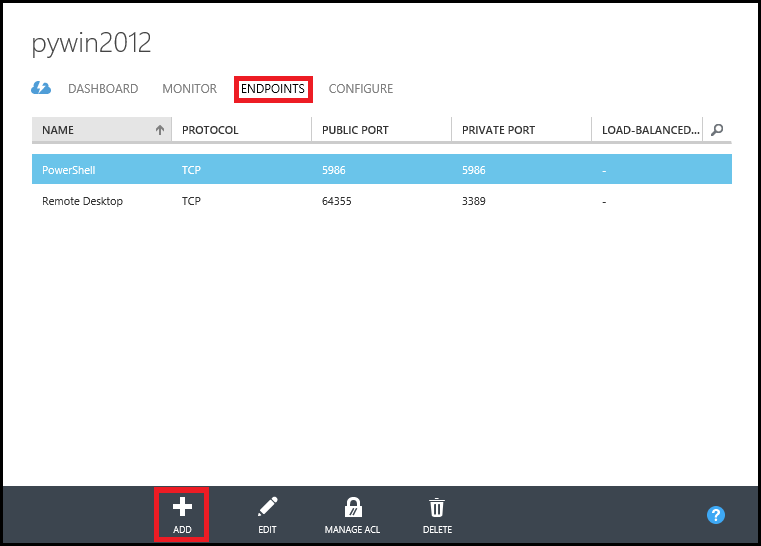
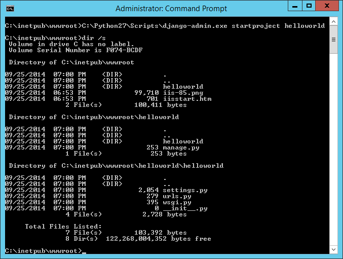

<properties
    pageTitle="Python web app mit Django | Microsoft Azure"
    description="Dieses Lernprogramm zeigt Ihnen wie eine Django basierende Website auf Azure gehostet Verwendung eines Windows Server 2012 R2 Datacenter virtuellen Computers mithilfe des Modells klassischen Bereitstellung."
    services="virtual-machines-windows"
    documentationCenter="python"
    authors="huguesv"
    manager="wpickett"
    editor=""
    tags="azure-service-management"/>

<tags 
    ms.service="virtual-machines-windows" 
    ms.workload="web" 
    ms.tgt_pltfrm="vm-windows" 
    ms.devlang="python" 
    ms.topic="article" 
    ms.date="08/04/2015" 
    ms.author="huvalo"/>

# Django Hallo Welt Web-Anwendung auf einem Windows Server virtuellen Computer

> [AZURE.SELECTOR]
- [Windows](virtual-machines-windows-classic-python-django-web-app.md)
- [Mac/Linux](virtual-machines-linux-python-django-web-app.md)

 

[AZURE.INCLUDE [learn-about-deployment-models](../../includes/learn-about-deployment-models-classic-include.md)]
 

In diesem Lernprogramm beschrieben, wie eine Website Django basierend auf Microsoft Azure Verwendung eines virtuellen Computers von Windows Server hosten. In diesem Lernprogramm wird davon ausgegangen, dass Sie keine vorherige Erfahrung mit Azure haben. Am Ende dieses Lernprogramms, müssen Sie eine Django-basierte Anwendung nach oben und in der Cloud ausgeführt.

Erfahren Sie, wie Sie:

* Richten Sie eine Azure-virtuellen Computern an Host Django aus. Während in diesem Lernprogramm wird erläutert, wie dies unter Windows Server zu erreichen, konnte identisch mit einer Linux virtueller Computer in Azure gehostet wird auch vorgenommen werden.
* Erstellen Sie eine neue Django-Anwendung von Windows aus.

Anhand dieses Lernprogramms erstellen Sie eine einfache Hallo Welt Web-Anwendung. Die Anwendung wird in einer Azure-virtuellen Computern gehostet werden.

Ein Screenshot der fertigen Anwendung wird weiter.

![Ein Browserfenster anzeigen von der Seite Hallo Welt auf Azure][1]

[AZURE.INCLUDE [create-account-and-vms-note](../../includes/create-account-and-vms-note.md)]

## Erstellen und Konfigurieren einer Azure-virtuellen Computern an Host Django

1. Folgen Sie den Anweisungen angegebenen [hier](virtual-machines-windows-classic-tutorial.md) eine Azure-virtuellen Computern der Windows Server 2012 R2 Datacenter Verteilung zu erstellen.

1. Weisen Sie Azure zu Port 80 Datenfluss aus dem Internet an Port 80 des virtuellen Computers weiterleiten an an:
 - Navigieren Sie zu der neu erstellten virtuellen Computern im klassischen Azure-Portal, und klicken Sie auf der Registerkarte **ENDPUNKTE** .
 - Klicken Sie auf die Schaltfläche **Hinzufügen** , am unteren Rand des Bildschirms.
    

 - Öffnen Sie das **TCP-** Protokoll ist **öffentlichen PORT 80** als **Privat PORT 80**.
![][port80]
1. Klicken Sie auf der Registerkarte **DASHBOARD** auf **Verbinden** , um **Remotedesktop** Remote Anmeldung bei der neu erstellten Azure-virtuellen Computern verwenden.  

**Wichtiger Hinweis:** Alle folgenden Anweisungen wird davon ausgegangen, dass Sie ordnungsgemäß an des virtuellen Computers angemeldet und dort Befehle statt auf dem lokalen Computer ausgeben werden.

## Der Installation von Python, Django, WFastCGI

**Hinweis:** Um mithilfe von Internet Explorer, die Sie möglicherweise für IE-Einstellungen konfigurieren herunterladen (Start/Administrative Tools-Server Manager/lokale Server, klicken Sie dann auf **IE erweiterte Konfiguration der Sicherheit**, auf Off gesetzt).

1. Installieren Sie die neuesten Python 2.7 oder 3.4 von [python.org][]ein.
1. Installieren der Wfastcgi und Django-Paketen Pip verwenden.

    Verwenden Sie für Python 2.7 den folgenden Befehl ein.

        c:\python27\scripts\pip install wfastcgi
        c:\python27\scripts\pip install django

    Verwenden Sie für Python 3.4 den folgenden Befehl ein.

        c:\python34\scripts\pip install wfastcgi
        c:\python34\scripts\pip install django

## Installieren von IIS mit FastCGI

1. Installieren Sie IIS mit FastCGI Support.  Auszuführende mehrere Minuten dauern.

        start /wait %windir%\System32\PkgMgr.exe /iu:IIS-WebServerRole;IIS-WebServer;IIS-CommonHttpFeatures;IIS-StaticContent;IIS-DefaultDocument;IIS-DirectoryBrowsing;IIS-HttpErrors;IIS-HealthAndDiagnostics;IIS-HttpLogging;IIS-LoggingLibraries;IIS-RequestMonitor;IIS-Security;IIS-RequestFiltering;IIS-HttpCompressionStatic;IIS-WebServerManagementTools;IIS-ManagementConsole;WAS-WindowsActivationService;WAS-ProcessModel;WAS-NetFxEnvironment;WAS-ConfigurationAPI;IIS-CGI

## Erstellen einer neuen Django-Anwendung

1.  Geben Sie aus *C:\inetpub\wwwroot*zum Erstellen eines neuen Projekts von Django den folgenden Befehl aus:

    Verwenden Sie für Python 2.7 den folgenden Befehl ein.

        C:\Python27\Scripts\django-admin.exe startproject helloworld

    Verwenden Sie für Python 3.4 den folgenden Befehl ein.

        C:\Python34\Scripts\django-admin.exe startproject helloworld

    

1.  Der Befehl **Django-Administrator** generiert eine einfache Struktur für Django-basierten Websites:

  -   **helloworld\manage.py** hilft Ihnen bei Hostinganbieter starten und Beenden Ihrer Website Django-basierten Hostinganbieter
  -   **helloworld\helloworld\settings.py** enthält Django Einstellungen für eine Anwendung.
  -   **helloworld\helloworld\urls.py** enthält die Zuordnung zwischen den einzelnen Url und die Ansicht.

1.  Erstellen Sie eine neue Datei namens **views.py** im Verzeichnis *C:\inetpub\wwwroot\helloworld\helloworld* . Dadurch wird die Ansicht enthalten, die Ausgabe der Seite "Hallo Welt". Starten Sie Editor, und geben Sie Folgendes ein:

        from django.http import HttpResponse
        def home(request):
            html = "<html><body>Hello World!</body></html>"
            return HttpResponse(html)

1.  Ersetzen Sie den Inhalt der Datei urls.py durch den folgenden Code ein.

        from django.conf.urls import patterns, url
        urlpatterns = patterns('',
            url(r'^$', 'helloworld.views.home', name='home'),
        )

## Konfigurieren von IIS

1. Entsperren Sie im Abschnitt Ereignishandler in der globalen applicationhost.config an.  Dadurch wird die Verwendung von der Python Ereignishandler in web.config aktiviert.

        %windir%\system32\inetsrv\appcmd unlock config -section:system.webServer/handlers

1. Aktivieren Sie WFastCGI.  Dadurch wird eine Anwendung in der globalen applicationhost.config hinzugefügt, die auf Ihre Python Interpreter ausführbare und das Skript wfastcgi.py verweist.

    Python 2.7:

        c:\python27\scripts\wfastcgi-enable

    Python 3.4:

        c:\python34\scripts\wfastcgi-enable

1. Erstellen Sie eine Datei web.config in *C:\inetpub\wwwroot\helloworld*ein.  Der Wert der `scriptProcessor` Attribut sollte die Ausgabe der im vorhergehenden Schritt entsprechen.  Pypi für weitere auf Wfastcgi-Einstellungen finden Sie auf der Seite für [Wfastcgi][] .

    Python 2.7:

        <configuration>
          <appSettings>
            <add key="WSGI_HANDLER" value="django.core.handlers.wsgi.WSGIHandler()" />
            <add key="PYTHONPATH" value="C:\inetpub\wwwroot\helloworld" />
            <add key="DJANGO_SETTINGS_MODULE" value="helloworld.settings" />
          </appSettings>
          <system.webServer>
            <handlers>
                <add name="Python FastCGI" path="*" verb="*" modules="FastCgiModule" scriptProcessor="C:\Python27\python.exe|C:\Python27\Lib\site-packages\wfastcgi.pyc" resourceType="Unspecified" />
            </handlers>
          </system.webServer>
        </configuration>

    Python 3.4:

        <configuration>
          <appSettings>
            <add key="WSGI_HANDLER" value="django.core.handlers.wsgi.WSGIHandler()" />
            <add key="PYTHONPATH" value="C:\inetpub\wwwroot\helloworld" />
            <add key="DJANGO_SETTINGS_MODULE" value="helloworld.settings" />
          </appSettings>
          <system.webServer>
            <handlers>
                <add name="Python FastCGI" path="*" verb="*" modules="FastCgiModule" scriptProcessor="C:\Python34\python.exe|C:\Python34\Lib\site-packages\wfastcgi.py" resourceType="Unspecified" />
            </handlers>
          </system.webServer>
        </configuration>

1. Aktualisieren Sie den Speicherort der IIS Standard-Website auf den Ordner des Projekts Django verweisen.

        %windir%\system32\inetsrv\appcmd set vdir "Default Web Site/" -physicalPath:"C:\inetpub\wwwroot\helloworld"

1. Laden Sie schließlich die Webseite in Ihrem Browser ein.

![Ein Browserfenster anzeigen von der Seite Hallo Welt auf Azure][1]

## Beenden der Azure-virtuellen Computern

Wenn Sie mit diesem Lernprogramm fertig sind, fahren Sie und/oder entfernen Sie der neu erstellten Azure-virtuellen Computern zum Freigeben von Ressourcen für andere Lernprogramme und zu vermeiden, dass Azure Verwendung Gebühren anfallen.

[1]: ./media/virtual-machines-windows-classic-python-django-web-app/django-helloworld-browser-azure.png

[port80]: ./media/virtual-machines-windows-classic-python-django-web-app/django-helloworld-port80.png

[Web Platform Installer]: http://www.microsoft.com/web/downloads/platform.aspx
[Python.org]: https://www.python.org/downloads/
[wfastcgi]: https://pypi.python.org/pypi/wfastcgi
