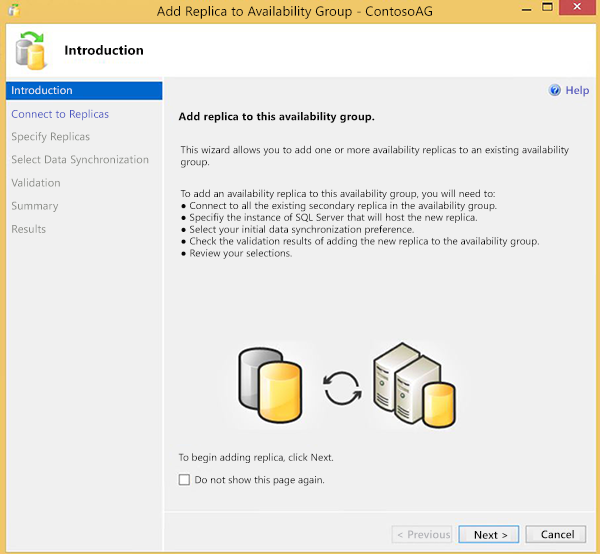
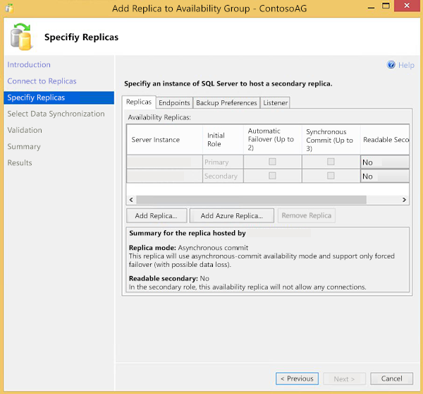
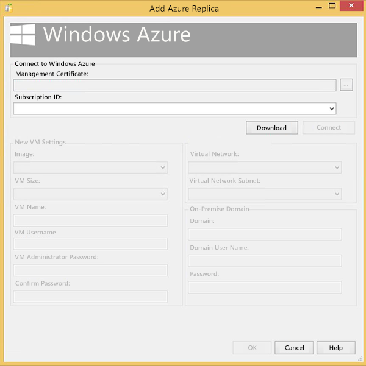
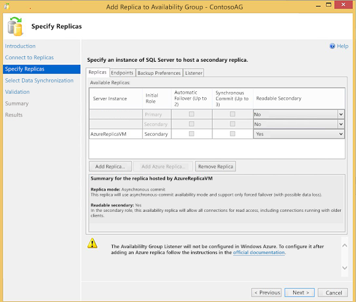
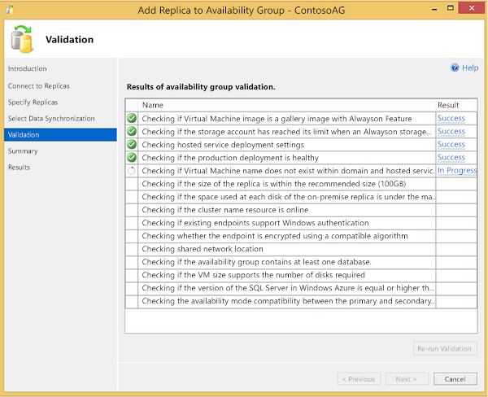

<properties
    pageTitle="Erweitern der lokalen immer auf Verfügbarkeit von Gruppen in Azure | Microsoft Azure"
    description="In diesem Lernprogramm erstellte, mit dem Bereitstellungsmodell klassischen Ressourcen verwendet, und beschreibt, wie der hinzufügen-Assistent in SQL Server Management Studio (SSMS) verwenden, um einer Kopie immer auf Availability Group in Azure hinzuzufügen."
    services="virtual-machines-windows"
    documentationCenter="na"
    authors="MikeRayMSFT"
    manager="jhubbard"
    editor=""
    tags="azure-service-management"/>

<tags
    ms.service="virtual-machines-windows"
    ms.devlang="na"
    ms.topic="article"
    ms.tgt_pltfrm="vm-windows-sql-server"
    ms.workload="infrastructure-services"
    ms.date="07/12/2016"
    ms.author="MikeRayMSFT" />

# Erweitern Sie in Azure lokalen immer auf Verfügbarkeit Gruppen

Immer auf Verfügbarkeit Gruppen bieten hohe Verfügbarkeit für Gruppen der Datenbank durch Hinzufügen von sekundären Replikaten. Diese Replikate ermöglichen die weiß nicht über Datenbanken bei einem Ausfall. Darüber hinaus können sie Auslagern gelesen Auslastung oder zusätzliche Aufgaben verwendet werden.

Sie können lokale Verfügbarkeit von Gruppen in Microsoft Azure erweitern, indem Sie eine oder mehrere Azure virtuellen Computern mit SQL Server bereitgestellt und diese dann als Replikate zu Ihrem lokalen Verfügbarkeit Gruppen hinzufügen.

In diesem Lernprogramm wird davon ausgegangen, dass Sie über Folgendes verfügen:

- Ein aktives Azure-Abonnement. Sie können [für eine kostenlose Testversion registrieren](https://azure.microsoft.com/pricing/free-trial/).

- Vorhandene immer auf Verfügbarkeit Gruppe lokale. Weitere Informationen zu Verfügbarkeit Gruppen finden Sie unter [Immer auf Verfügbarkeit Gruppen](https://msdn.microsoft.com/library/hh510230.aspx).

- Konnektivität zwischen dem lokalen Netzwerk und Azure virtuellen Netzwerks. Weitere Informationen zum Erstellen von diesem virtuellen Netzwerks finden Sie unter [Konfigurieren einer Standort-zu-Standort VPN im klassischen Azure-Portal](../vpn-gateway/vpn-gateway-site-to-site-create.md).

[AZURE.INCLUDE [learn-about-deployment-models](../../includes/learn-about-deployment-models-classic-include.md)]

## Hinzufügen von Azure-Assistent

In diesem Abschnitt werden so **Azure-Assistent hinzufügen** verwenden, um Ihre Lösung immer auf Verfügbarkeit Gruppe zum Einschließen von Azure Replikate zu erweitern.

1. In SQL Server Management Studio, erweitern Sie im Bereich **Immer auf hohen Verfügbarkeit** > **Verfügbarkeit Gruppen** > **[Name der Verfügbarkeit Gruppe]**.

1. Mit der rechten Maustaste **Verfügbarkeit Replikate**, und klicken Sie auf **Replikat hinzuzufügen**.

1. Standardmäßig wird das **Replikat Verfügbarkeit Gruppe-Assistenten hinzufügen** angezeigt. Klicken Sie auf **Weiter**.  Wenn Sie die **nicht mehr anzeigen dieser Seite erneut** am unteren Rand der Seite während einer vorherigen Launch des Assistenten die Option diese ausgewählt haben, wird dieser Bildschirm nicht angezeigt.

    

1. Sie müssen alle vorhandenen sekundären Replikate Verbindung. Klicken Sie auf **verbinden...** Klicken Sie neben jedes Replikat oder Sie können **Alle verbinden...** auf am unteren Rand des Bildschirms. Klicken Sie nach der Authentifizierung auf **Weiter** , um dem nächsten Bildschirm anzuzeigen.

1. Klicken Sie auf der Seite **Replikate angeben** werden mehrere Registerkarten am oberen aufgeführt: **Replikate**, **Endpunkte**, **Sicherung Einstellungen**und **Zuhörer**. Klicken Sie auf der Registerkarte **Replikate** **Azure Replikat hinzufügen...** um den hinzufügen Azure-Assistenten zu starten.

    

1. Wählen Sie vorhandenes Zertifikat Azure Verwaltung aus lokalen Zertifikat Windows Store, wenn Sie vor installiert haben. Wählen Sie aus, oder geben Sie die Id eines Azure-Abonnements, wenn Sie vor verwendet haben. Sie können Download zum Herunterladen und installieren Sie ein Zertifikat einer Azure Management und Laden Sie die Liste der Abonnements mit einem Azure-Konto klicken.

    

1. Füllen Sie jedes Feld auf der Seite mit den Werten, die verwendet werden, die Azure-virtuellen Computern (VM) zu erstellen, die das Replikat gehostet wird.

  	|Einstellung|Beschreibung|
|---|---|
|**Bild**|Wählen Sie die gewünschte Kombination von OS und SQL Server|
|**Virtueller Speicher**|Wählen Sie die Größe des virtuellen Computer, die am besten geeigneten business|
|**Name des virtuellen Computers**|Geben Sie einen eindeutigen Namen für den neuen virtuellen Computer an. Der Name muss zwischen 3 und 15 Zeichen enthalten, können nur Buchstaben, Zahlen und Bindestriche, enthalten und muss mit einem Buchstaben beginnen und enden mit einen Buchstaben oder eine Zahl.|
|**Virtueller Computer Benutzername**|Geben Sie einen Benutzer an, der das Administratorkonto des virtuellen Computers verwendet werden soll|
|**Virtueller Computer Administratorkennworts**|Geben Sie ein Kennwort für das neue Konto|
|**Kennwort bestätigen**|Bestätigen Sie das Kennwort für das neue Konto ein.|
|**Virtuelles Netzwerk**|Geben Sie das Azure virtuelle Netzwerk, das der neue virtuellen Computer verwendet werden sollen. Weitere Informationen virtuelle Netzwerke finden Sie unter [Übersicht über Virtual Netzwerk](../virtual-network/virtual-networks-overview.md).|
|**Virtuelle Netzwerk-Subnetz**|Geben Sie das virtuelle Netzwerk-Subnetz, das der neue virtuellen Computer verwendet werden sollen|
|**Domäne**|Bestätigen Sie, dass der vorab eingetragenen Wert für die Domäne korrekt sind.|
|**Domänenbenutzername**|Geben Sie ein Konto aus, die in der lokalen Administratorgruppe auf dem lokalen Clusterknoten ist|
|**Kennwort**|Geben Sie das Kennwort für den Benutzer Domänennamen|

1. Klicken Sie auf **OK** , um die Einstellungen für die Bereitstellung zu überprüfen.

1. Vertragsbedingungen Leuchten weiter. Lesen Sie, und klicken Sie auf **OK** , wenn diese Sie akzeptieren.

1. Die Seite **Angeben Replikate** wird erneut angezeigt. Überprüfen Sie die Einstellungen für das neue Azure Replikat auf den Registerkarten **Replikate**, **Endpunkte**und **Sicherung Einstellungen** aus. Ändern der Einstellungen, um Ihre Bedürfnisse zuschneiden.  Weitere Informationen über die Parameter auf den folgenden Registerkarten enthalten sind finden Sie unter [Angeben Replikate Seite (neue Gruppe Assistenten hinzufügen/Replikat Assistenten für Verfügbarkeit)](https://msdn.microsoft.com/library/hh213088.aspx). Beachten Sie, dass mithilfe der Registerkarte Zuhörer für Verfügbarkeit Gruppen, die Azure Replikate enthalten Listener erstellt werden können. Darüber hinaus ist eine Zuhörer bereits erstellt wurde vor dem Starten des Assistenten, erhalten Sie eine Nachricht, die angibt, dass es in Azure nicht unterstützt wird. So erstellen Sie im Abschnitt **Erstellen einer Verfügbarkeit Gruppe Zuhörer** Listener werden behandelt.

    

1. Klicken Sie auf **Weiter**.

1. Wählen Sie die Daten Synchronisierung-Methode, die Sie verwenden möchten, klicken Sie auf der Seite **Wählen Sie ursprüngliche Daten Synchronisierung** verwenden, und klicken Sie auf **Weiter**. Wählen Sie in den meisten Fällen **Vollständigen Synchronisierung von Daten**aus. Weitere Informationen zu Methoden für die Synchronisierung finden Sie unter [Wählen Sie Daten Synchronisierung Startseite (immer auf Verfügbarkeit Gruppe Assistenten)](https://msdn.microsoft.com/library/hh231021.aspx).

1. Überprüfen Sie die Ergebnisse auf der Seite **Überprüfung** an. Beheben Sie ausstehende Probleme zu, und führen Sie die Überprüfung erneut aus, falls erforderlich. Klicken Sie auf **Weiter**.

    

1. Überprüfen Sie die Einstellungen auf der Seite **Zusammenfassung** zu, und klicken Sie auf **Fertig stellen**.

1. Der Bereitstellung wird gestartet. Wenn der Assistent erfolgreich abgeschlossen ist, klicken Sie auf **Schließen** um den Assistenten zu beenden.

>[AZURE.NOTE] Das Hinzufügen von Azure-Assistent erstellt eine Protokolldatei in Users\User Name\AppData\Local\SQL Server\AddReplicaWizard an. Diese Protokolldatei kann verwendet werden, mit fehlerhaften Azure Replikat Bereitstellungen zu behandeln. Wenn der Assistent Aktion ausführen fehlschlägt, werden alle vorherigen Vorgänge zurückgesetzt einschließlich den bereitgestellten virtueller Computer löschen.

## Erstellen einer Verfügbarkeit Gruppe Zuhörer

Nachdem die Verfügbarkeit Gruppe erstellt wurde, sollten Sie eine Zuhörer für Clients, die Verbindung zu den Replikaten erstellen. Listener leiten eingehende Verbindungen, entweder zur primären oder einer sekundären schreibgeschützt. Weitere Informationen zum Listener finden Sie unter [Konfigurieren einer ILB Zuhörer für immer auf Verfügbarkeit von Gruppen in Azure](virtual-machines-windows-classic-ps-sql-int-listener.md).

## Nächste Schritte

Durch **Hinzufügen von Azure-Assistent** um in Azure immer auf Verfügbarkeit Gruppe zu erweitern oder können Sie auch einige Arbeitsbelastung der SQL Server vollständig in Azure verschieben. Um anzufangen, finden Sie in [einer SQL Server virtuellen Computern auf Azure bereitgestellt](virtual-machines-windows-portal-sql-server-provision.md).

Weitere Themen im Zusammenhang mit dem SQL Server in Azure-virtuellen Computern ausgeführt wird finden Sie unter [SQL Server auf Azure virtuellen Computern](virtual-machines-windows-sql-server-iaas-overview.md).
