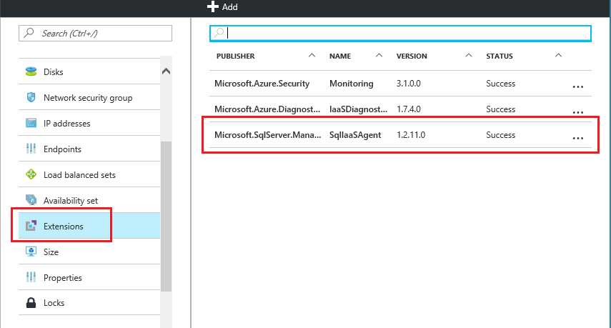

<properties
    pageTitle="SQL Server-Agent-Erweiterung für SQL Server virtuelle Computer (klassisch) | Microsoft Azure"
    description="In diesem Thema beschrieben, wie die SQL Server-Agent-Erweiterung verwalten, die um bestimmte SQL Server-Verwaltungsaufgaben automatisieren wird. Hierzu gehören die automatische Sicherung, automatisierte Patch und Azure-Taste Tresor Integration. In diesem Thema wird den Bereitstellung klassischen Modus verwendet."
    services="virtual-machines-windows"
    documentationCenter=""
    authors="rothja"
    manager="jhubbard"
    editor=""
    tags="azure-service-management"/>

<tags
    ms.service="virtual-machines-windows"
    ms.devlang="na"
    ms.topic="article"
    ms.tgt_pltfrm="vm-windows-sql-server"
    ms.workload="infrastructure-services"
    ms.date="10/27/2016"
    ms.author="jroth"/>

# SQL Server-Agent-Erweiterung für SQL Server virtuellen Computern (klassisch)

> [AZURE.SELECTOR]
- [Ressourcenmanager](virtual-machines-windows-sql-server-agent-extension.md)
- [Klassische](virtual-machines-windows-classic-sql-server-agent-extension.md)

Die SQL Server IaaS Agent-Erweiterung (SQLIaaSAgent) bei Azure-virtuellen Computern zum Automatisieren von Verwaltungsaufgaben ausgeführt wird. Dieses Thema bietet einen Überblick über die Dienste, die durch die Erweiterung sowie die Anweisungen zur Installation, Status und freistellen unterstützt.

[AZURE.INCLUDE [learn-about-deployment-models](../../includes/learn-about-deployment-models-classic-include.md)]Zum Anzeigen der Ressourcenmanager Version der in diesem Artikel finden Sie unter [SQL Server-Agent-Erweiterung für SQL Server virtuellen Computern Ressourcenmanager](virtual-machines-windows-sql-server-agent-extension.md).

## Unterstützte services

Die SQL Server IaaS-Agent-Erweiterung unterstützt die folgenden Verwaltungsaufgaben:

| Administration-Funktion | Beschreibung |
|---------------------|-------------------------------|
| **SQL-automatische Sicherung** | Automatisierung der Planung von Sicherungskopien für alle Datenbanken für die standardmäßige Instanz von SQL Server auf dem virtuellen Computer. Weitere Informationen finden Sie unter [Automatische Sicherung für SQL Server in Azure virtuellen Computern (klassisch)](virtual-machines-windows-classic-sql-automated-backup.md).|
| **SQL automatisierte Patch** | Konfiguriert ein Wartungsfenster während der Updates an Ihre virtuellen Computer stattfinden können, damit Sie Aktualisierungen Höchstwert Zeiten für Ihre Arbeitsbelastung vermeiden können. Weitere Informationen finden Sie unter [Automatisches Patch für SQL Server in Azure virtuellen Computern (klassisch)](virtual-machines-windows-classic-sql-automated-patching.md).|
| **Azure Key Tresor-Integration** | Ermöglicht es Ihnen automatisch installieren und Konfigurieren von Azure-Taste Tresor Ihrer SQL Server virtuellen Computers. Weitere Informationen finden Sie unter [Konfigurieren von Azure Schlüssel Tresor Integration für SQL Server auf Azure-virtuellen Computern (klassisch)](virtual-machines-windows-classic-ps-sql-keyvault.md).|

## Erforderliche Komponenten

Erfüllen die SQL Server IaaS-Agent-Erweiterung Ihrer virtuellen Computers verwenden:

### Betriebssystem:

- WindowsServer 2012
- Windows Server 2012 R2

### SQL Server-Versionen:

- SQLServer 2012
- SQLServer 2014
- SQLServer 2016

### Azure PowerShell:

[Herunterladen und konfigurieren Sie die neuesten Azure PowerShell-Befehle](../powershell-install-configure.md).

Starten Sie Windows PowerShell, und verbinden Sie es mit Ihr Abonnement Azure, mit dem Befehl **AzureAccount hinzufügen** .

    Add-AzureAccount

Wenn Sie mehrere Abonnements verfügen, verwenden Sie **Select-AzureSubscription** , um das Abonnement auszuwählen, die Ihr Ziel enthält klassischen virtueller Computer.

    Select-AzureSubscription -SubscriptionName <subscriptionname>

An diesem Punkt können Sie eine Liste mit den klassischen virtuellen Computern und deren Namen zugeordneten Services mit dem Befehl **Get-AzureVM** erhalten.

    Get-AzureVM

## Installation

Für klassische virtuelle Computer müssen Sie PowerShell verwenden, die SQL Server IaaS-Agent-Erweiterung installieren und konfigurieren die damit verbundenen Dienste. Verwenden Sie das **Set-AzureVMSqlServerExtension** PowerShell-Cmdlet, um die Erweiterung zu installieren. Mit dem folgende Befehl wird beispielsweise installiert die Erweiterung einer Windows Server virtuellen Computers (klassisch) und legt hierfür den Namen "SQLIaaSExtension".

    Get-AzureVM -ServiceName <vmservicename> -Name <vmname> | Set-AzureVMSqlServerExtension -ReferenceName "SQLIaasExtension" -Version "1.2" | Update-AzureVM

Wenn Sie auf die neueste Version von SQL IaaS-Agent-Erweiterung aktualisieren, müssen Sie Ihre virtuellen Computern nach der Aktualisierung der Erweiterung neu starten.

>[AZURE.NOTE] Klassische virtuellen Computern haben keine Option zum Installieren und konfigurieren die SQL-IaaS-Agent-Erweiterung über das Portal.

## Status

Eine Möglichkeit, stellen Sie sicher, dass die Erweiterung installiert sind ist den Status des Agents Azure-Portal anzeigen. Wählen Sie **Alle Einstellungen** in den virtuellen Computern Blade, und klicken Sie dann auf **Erweiterungen**. Sie sollten die **SQLIaaSAgent** Erweiterung aufgeführt angezeigt werden.

Sie können auch mit dem **Get-AzureVMSqlServerExtension** Azure Powershell-Cmdlet verwenden.

    Get-AzureVM –ServiceName "service" –Name "vmname" | Get-AzureVMSqlServerExtension

## Freistellen   

Im Portal Azure können Sie die Erweiterung deinstallieren, indem Sie auf die drei Punkte auf **Erweiterungen** Falz Ihrer virtuellen Computereigenschaften. Klicken Sie dann auf **Löschen**.

Sie können auch das **Entfernen-AzureVMSqlServerExtension** Powershell-Cmdlet verwenden.

    Get-AzureVM –ServiceName "service" –Name "vmname" | Remove-AzureVMSqlServerExtension | Update-AzureVM

## Nächste Schritte

Beginnen Sie mit einer der Dienste durch die Erweiterung unterstützt. Weitere Informationen hierzu finden Sie im Abschnitt [unterstützten Dienste](#supported-services) in diesem Artikel beschriebenen Themen.

Weitere Informationen über das Ausführen von SQL Server auf Azure virtuellen Computern finden Sie unter [SQL Server auf Azure-virtuellen Computern Übersicht](virtual-machines-windows-sql-server-iaas-overview.md).
