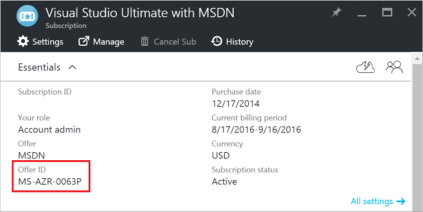
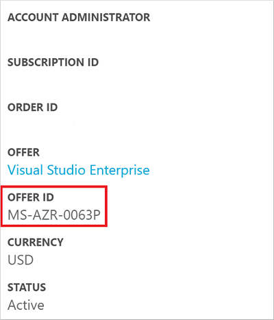

<properties
   pageTitle="Verwenden von Windows-Client-Bilder für Test-/Szenarien | Microsoft Azure"
   description="So verwenden Sie die Vorteile der Visual Studio-Abonnements zur Bereitstellung von Windows 7/8/10 in Azure für Test-/Szenarien"
   services="virtual-machines-windows"
   documentationCenter=""
   authors="iainfoulds"
   manager="timlt"
   editor=""/>

<tags
   ms.service="virtual-machines-windows"
   ms.devlang="na"
   ms.topic="article"
   ms.tgt_pltfrm="vm-windows"
   ms.workload="infrastructure-services"
   ms.date="08/31/2016"
   ms.author="iainfou"/>

# Verwenden von Windows-Client in Azure für Test-/Szenarien

Können Sie Windows 7, Windows 8 oder Windows 10 in Azure für Test-/Szenarien zur Verfügung gestellt, dass Sie über eine entsprechende Visual Studio (vormals MSDN)-Abonnement verfügen. In diesem Artikel werden die anspruchsvoraussetzungen für laufenden Windows-Clients in Azure und die Verwendung der Bilder Azure-Katalog.

## Abonnement gemeinnützige Organisationen – anspruchsvoraussetzungen
Aktive Visual Studio Abonnenten (Personen eine Visual Studio-Abonnementlizenz erworben haben) können Windows-Client für die Entwicklung und Testzwecken verwenden. Windows-Client kann auf Ihrer eigenen Hardware und Azure-virtuellen Computern ausgeführt werden, in einer Art von Azure-Abonnement verwendet werden. Windows-Client kann nicht auf bereitgestellt oder oder verwendet werden auf Azure zur Verwendung für normale, von Personen, die keine aktive Visual Studio Abonnenten sind.

Nähere haben wir bestimmte Windows 10 Bilder aus dem Katalog Azure innerhalb [berechtigt Test-/bietet](#eligible-offers)zur Verfügung. Visual Studio Abonnenten in jede Art von anbieten können auch [angemessen vorbereiten und erstellen](virtual-machines-windows-prepare-for-upload-vhd-image.md) einer 64-Bit-Windows 7, Windows 8 oder Windows 10 Bild und dann [auf Azure hochladen](virtual-machines-windows-upload-image.md). Die Verwendung bleibt gemäß aktive Visual Studio Abonnenten auf Test-/beschränkt.

## Berechtigte Angebote
Die folgende Tabelle enthält das Angebot IDs, die zum Bereitstellen von Windows 10 bis im Katalog Azure berechtigt sind. Die Windows-10-Bilder sind nur für die folgenden Angebote sichtbar. Visual Studio Abonnenten, die Windows-Client in einem anderen Angebot Typ ausführen müssen, müssen Sie [ausreichend vorbereiten und erstellen](virtual-machines-windows-prepare-for-upload-vhd-image.md) einer 64-Bit-Windows 7, Windows 8 oder Windows-10 Bild und [dann auf Azure hochladen](virtual-machines-windows-upload-image.md).

| Anbieten von Namen | Angebotsnummer | Verfügbare Clientabbilder |
|:-----------|:------------:|:-----------------------:|
| [Nutzungsbasierte Test-/](https://azure.microsoft.com/offers/ms-azr-0023p/)                          | 0023P | Windows-10 |
| [Visual Studio Enterprise (MPN) Abonnenten](https://azure.microsoft.com/offers/ms-azr-0029p/)      | 0029P | Windows-10 |
| [Visual Studio Professional-Abonnenten](https://azure.microsoft.com/offers/ms-azr-0059p/)          | 0059P | Windows-10 |
| [Visual Studio Test Professional Abonnenten](https://azure.microsoft.com/offers/ms-azr-0060p/)     | 0060P | Windows-10 |
| [Visual Studio Premium mit MSDN (Vorteil)](https://azure.microsoft.com/offers/ms-azr-0061p/)       | 0061P | Windows-10 |
| [Visual Studio Enterprise-Abonnenten](https://azure.microsoft.com/offers/ms-azr-0063p/)            | 0063P | Windows-10 |
| [Visual Studio Enterprise (BizSpark) Abonnenten](https://azure.microsoft.com/offers/ms-azr-0064p/) | 0064P | Windows-10 |
| [Enterprise-Test-/](https://azure.microsoft.com/ofers/ms-azr-0148p/)                              | 0148P | Windows-10 |

## Aktivieren Sie Ihr Abonnement Azure
Wenn Sie Ihr Angebot-ID nicht kennen, können Sie es über dem Azure-Portal oder im Portal Konto erhalten.

Die Abonnement Angebot-ID wird auf dem Blade 'Abonnements' innerhalb des Portals Azure notiert haben:

 

Sie können auch die Angebots-ID über die [Registerkarte 'Abonnements'](http://account.windowsazure.com/Subscriptions) des Portals Azure-Konto anzeigen:

 

## Nächste Schritte
Nun können Sie Ihre virtuellen Computer mithilfe der [PowerShell](virtual-machines-windows-ps-create.md), [Ressourcenmanager Vorlagen](virtual-machines-windows-ps-template.md)oder [Visual Studio](../vs-azure-tools-resource-groups-deployment-projects-create-deploy.md)bereitstellen.
