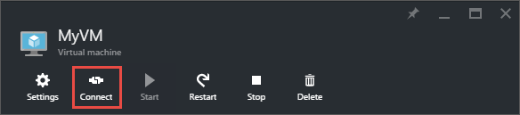

<properties
    pageTitle="Verbinden mit einem WindowsServer virtueller Computer | Microsoft Azure"
    description="Erfahren Sie, wie Sie eine Verbindung herstellen, und melden Sie sich an einen Windows virtuellen Computer mithilfe der Azure-Portal und das Modell zur Bereitstellung von Ressourcenmanager."
    services="virtual-machines-windows"
    documentationCenter=""
    authors="cynthn"
    manager="timlt"
    editor="tysonn"
    tags="azure-resource-manager"/>

<tags
    ms.service="virtual-machines-windows"
    ms.workload="infrastructure-services"
    ms.tgt_pltfrm="vm-windows"
    ms.devlang="na"
    ms.topic="get-started-article"
    ms.date="07/28/2016"
    ms.author="cynthn"/>

# Wie Sie eine Verbindung aus, und melden Sie sich bei einem Azure-virtuellen Computern unter Windows 

Sie erhalten die Schaltfläche **Verbinden** Azure-Portal zum Starten einer Sitzung Remote Desktop (RDP) verwenden. Zuerst Sie Herstellen einer Verbindung mit den virtuellen Computern und dann Sie anmelden.

## Herstellen einer Verbindung des virtuellen Computers mit

1. Wenn Sie bereits, melden Sie sich mit dem [Azure-Portal](https://portal.azure.com/)nicht getan.

2.  Klicken Sie im Menü Hub auf **virtuellen Computern**.

3.  Wählen Sie den virtuellen Computer aus der Liste aus.

4. Klicken Sie auf das Blade des virtuellen Computers auf **Verbinden**.

    
    
 > [AZURE.TIP] Wenn die Schaltfläche **Verbinden** im Portal abgeblendeter, und es keine mit Azure über eine Verbindung [Express weiterleiten](../expressroute/expressroute-introduction.md) oder [Website-zu-Standort VPN Verbindung werden](../vpn-gateway/vpn-gateway-howto-site-to-site-resource-manager-portal.md) , müssen Sie erstellen und Ihre virtuellen Computer eine öffentliche IP-Adresse zuweisen, bevor Sie RDP verwenden können. Weitere Informationen zu [öffentlichen IP-Adressen in Azure](../virtual-network/virtual-network-ip-addresses-overview-arm.md).

## Melden Sie sich bei der virtuellen Computern

[AZURE.INCLUDE [virtual-machines-log-on-win-server](../../includes/virtual-machines-log-on-win-server.md)]

## Nächste Schritte

Wenn Sie Probleme auftreten, wenn Sie versuchen, eine Verbindung herstellen, finden Sie unter [Behandeln von Problemen mit Remotedesktop Verbindungen](virtual-machines-windows-troubleshoot-rdp-connection.md). In diesem Artikel führt Sie durch die Diagnose und Behebung von häufig auftretenden Problemen.
