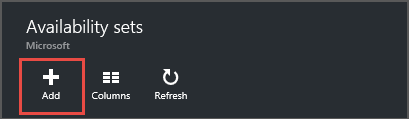

<properties
    pageTitle="Erstellen eine virtuellen Computer Verfügbarkeit Menge | Microsoft Azure"
    description="Informationen Sie zum Erstellen einer Verfügbarkeit für Ihre virtuellen Computern mit Azure-Portal oder im Modell zur Bereitstellung von Ressourcenmanager mit PowerShell festlegen."
    keywords="Festlegen der Verfügbarkeit"
    services="virtual-machines-windows"
    documentationCenter=""
    authors="cynthn"
    manager="timlt"
    editor=""
    tags="azure-resource-manager"/>
<tags
    ms.service="virtual-machines-windows"
    ms.workload="infrastructure-services"
    ms.tgt_pltfrm="vm-windows"
    ms.devlang="na"
    ms.topic="article"
    ms.date="09/27/2016"
    ms.author="cynthn"/>

# Erstellen einer Menge Verfügbarkeit 

Wenn im Portal verwenden, wenn Sie möchten, dass Ihre virtuellen Computer Teil einer Verfügbarkeit festlegen möchten, müssen Sie die Verfügbarkeit legen Sie zuerst erstellen.

Weitere Informationen zum Erstellen und Verwenden von Verfügbarkeit Sätze finden Sie unter [Verwalten der Verfügbarkeit von virtuellen Computern](virtual-machines-windows-manage-availability.md).

## Verwenden Sie zum Erstellen einer Verfügbarkeit festlegen, bevor Sie Ihre virtuellen Computer im portal

1. Klicken Sie im Menü Hub klicken Sie auf **Durchsuchen** , und wählen Sie **Verfügbarkeit legt fest**.

2. Klicken Sie auf die **Verfügbarkeit legt Blade**klicken Sie auf **Hinzufügen**.

    

3. Führen Sie in der Blade **Erstellen Verfügbarkeit festzulegen** die Informationen für den Satz ein.

    

    - **Name** - der Name sollte 1-80 Zeichen besteht aus Zahlen, Buchstaben, Punkte, Unterstriche und Striche sein. Das erste Zeichen muss einen Buchstaben oder eine Zahl sein. Das letzte Zeichen muss einen Buchstaben, Zahl oder Unterstrich an.
    - **Fehlerstrukturanalyse-Domänen** - Fehlerstrukturanalyse Domänen definieren die Gruppe von virtuellen Computern, die eine allgemeine Power Quell- und Netzwerk wechseln freigeben. Standardmäßig die virtuellen Computern sind über bis zu drei Fehlerstrukturanalyse-Domänen getrennt und können zwischen 1 und 3 in geändert werden.
    - **Aktualisieren von Domänen** - fünf aktualisieren, die standardmäßig und diese Domänen zugewiesen werden können zwischen 1 und 20 nicht festgelegt werden. Aktualisieren von Domänen anzugeben, Gruppen von virtuellen Computern und die zugrunde liegende physische Hardware, der zur gleichen Zeit neu gestartet werden kann. Angenommen, wenn wir angeben, dass fünf Domänen aktualisiert werden, wenn mehr als fünf virtuellen Computern innerhalb einer einzelnen Verfügbarkeit festlegen konfiguriert sind, der sechsten virtuellen Computern wird in der Domäne aktualisieren des ersten virtuellen Computers, der siebten in der gleichen UD als den zweiten virtuellen Computern platziert werden usw. Die Reihenfolge der nach einem Neustart möglicherweise nicht sequenzielle, aber nur ein Update Domain wird jeweils neu gestartet.
    - **Abonnement** - wählen Sie das Abonnement verwenden, wenn Sie mehrere verwenden.
    - **Ressourcengruppe** - wählen Sie eine vorhandene Ressourcengruppe durch Klicken auf den Pfeil und eine Ressourcengruppe in der Dropdownliste nach unten auswählen. Sie können auch eine neue Ressourcengruppe erstellen, indem Sie einen Namen eingeben. Der Name kann die folgenden Zeichen enthalten: Buchstaben, Zahlen, Punkte, Striche, Unterstriche und öffnende oder schließende Klammer ein. Der Name darf nicht in einem Zeitraum enden. Alle den virtuellen Computern in der Gruppe Verfügbarkeit in derselben Ressourcengruppe gemäß der Verfügbarkeit erstellt werden müssen.
    - **Standort** : Wählen Sie einen Speicherort aus, in der Dropdown-Liste.

4. Wenn Sie fertig sind, Informationen einzugeben, klicken Sie auf **Erstellen**. Nachdem die Verfügbarkeit Gruppe erstellt wurde, können Sie es in der Liste sehen, nachdem Sie das Portal aktualisiert haben.

## Verwenden Sie zum Erstellen eines virtuellen Computers und eine Verfügbarkeit festlegen zur gleichen Zeit im portal

Wenn Sie einen neuen virtuellen Computer mit dem Portal erstellen, können Sie auch Erstellen einer neuen Verfügbarkeit für den virtuellen Computer festlegen, während Sie den ersten virtuellen Computer in der Gruppe erstellen.

## Hinzufügen eines neuen virtuellen Computers zu einem bestehenden Satz der Verfügbarkeit

Stellen Sie für jede zusätzliche virtuellen Computer, die Sie erstellen, die in der Gruppe angehören sollen sicher, dass Sie in der gleichen **Ressourcengruppe** zu erstellen, und wählen Sie dann auf die vorhandene Verfügbarkeit in Schritt 3 festgelegt. 

## Verwenden von PowerShell zum Erstellen einer Menge Verfügbarkeit

In diesem Beispiel wird eine Verfügbarkeit festlegen in der Ressourcengruppe **RMResGroup** **Westen US** Speicherort erstellt. Dies muss ausgeführt werden, bevor Sie den ersten virtuellen Computer erstellen, die in der Gruppe enthalten sein sollen.

    New-AzureRmAvailabilitySet -ResourceGroupName "RMResGroup" -Name "AvailabilitySet03" -Location "West US"
    
Weitere Informationen finden Sie unter [New-AzureRmAvailabilitySet](https://msdn.microsoft.com/library/mt619453.aspx).

## Behandlung von Problemen

- Beim Erstellen eines virtuellen Computers, wenn die gewünschte Verfügbarkeit Gruppe in der Dropdown-Liste im Portal nicht möglicherweise in einer anderen Ressourcengruppe erstellen. Wenn Sie nicht wissen, die Ressourcengruppe für Ihre Verfügbarkeit festlegen, öffnen Sie das Menü Hub und klicken Sie auf Durchsuchen > Verfügbarkeit legt fest, um eine Liste Ihrer Verfügbarkeit Sätze und dem anzuzeigen Ressourcengruppen, zu der sie gehören.

## Nächste Schritte

Hinzufügen von weiteren Speicherplatz zu Ihrer virtuellen Computer durch Hinzufügen einer weiteren [Daten Datenträger](virtual-machines-windows-attach-disk-portal.md).
