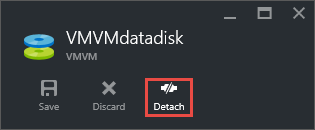

<properties
    pageTitle="Trennen eines Windows virtuellen Computers einen Datenträger | Microsoft Azure"
    description="Erfahren Sie, einen Datenträger anhand eines virtuellen Computers in das Modell zur Bereitstellung von Ressourcenmanager mit Azure trennen."
    services="virtual-machines-windows"
    documentationCenter=""
    authors="cynthn"
    manager="timlt"
    editor=""
    tags="azure-service-management"/>

<tags
    ms.service="virtual-machines-windows"
    ms.workload="infrastructure-services"
    ms.tgt_pltfrm="vm-windows"
    ms.devlang="na"
    ms.topic="article"
    ms.date="09/27/2016"
    ms.author="cynthn"/>

# So trennen Sie einen Datenträger aus einem Windows-Computer

Wenn Sie einen Datenträger, der mit einem virtuellen Computer angeschlossen ist nicht mehr benötigen, können Sie ganz einfach trennen. Dies entfernt den Datenträger aus des virtuellen Computers, aber nicht aus Speicher entfernen. 

> [AZURE.WARNING] Wenn Sie einen Datenträger trennen ist es nicht automatisch gelöscht. Wenn Sie Premium Speicher abonniert haben, werden Sie weiterhin Speicherplatz für den Datenträger anfallen. Weitere Informationen finden Sie in der [Preise und Abrechnung bei Verwendung von Premium-Speicher](../storage/storage-premium-storage.md#pricing-and-billing). 

Wenn Sie die vorhandenen Daten auf dem Datenträger erneut verwenden möchten, können Sie desselben virtuellen Computers oder einem anderen Platzhalter erneut an.  

## Trennen Sie einen Datenträger mit dem portal

1. Wählen Sie im Portal Hub **virtuellen Computern**aus.

2. Wählen Sie die virtuellen Computern, die den Datenträger Daten, die, den Sie verwenden möchten enthält, trennen, und klicken Sie dann auf **Alle Einstellungen**.

3. Wählen Sie in den **Einstellungen** Blade **Datenträger**aus.

4. Wählen Sie das Blade **Datenträger** den Datenträger Daten, den Sie trennen möchten.

5. Klicken Sie in das Blade für den Datenträger Daten auf **Trennen**.

    

Der Datenträger verbleibt im Speicher, jedoch nicht mehr an einem virtuellen Computer angefügt wird.

## Trennen Sie einen Datenträger mithilfe der PowerShell

In diesem Beispiel wird der erste Befehl des virtuellen Computers mit dem Namen **MyVM07** in der **RG11** Ressourcengruppe verwenden das Cmdlet "Get-AzureRmVM". Der Befehl des virtuellen Computers in der **$VirtualMachine** -Variablen gespeichert. 

Der zweite Befehl entfernt den Daten Datenträger mit dem Namen DataDisk3 virtuellen Computer an. 

Der letzte Befehl aktualisiert den Zustand des virtuellen Computers bis zum Abschluss der den Datenträger Daten zu entfernen.

    $VirtualMachine = Get-AzureRmVM -ResourceGroupName "RG11" -Name "MyVM07" 
    Remove-AzureRmVMDataDisk -VM $VirtualMachine -Name "DataDisk3"
    Update-AzureRmVM -ResourceGroupName "RG11" -Name "MyVM07" -VM $VirtualMachine

Weitere Informationen finden Sie unter [Entfernen-AzureRmVMDataDisk](https://msdn.microsoft.com/library/mt603614.aspx)

## Nächste Schritte

Wenn Sie den Datenträger Daten wiederverwenden möchten, können Sie nur [Datei als Anlage an eine andere virtueller Computer](virtual-machines-windows-attach-disk-portal.md)
