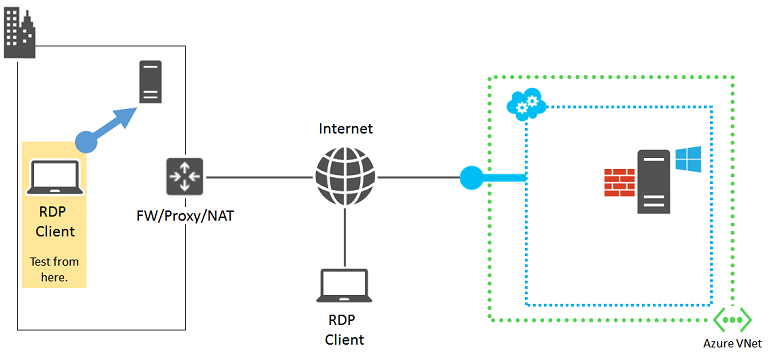
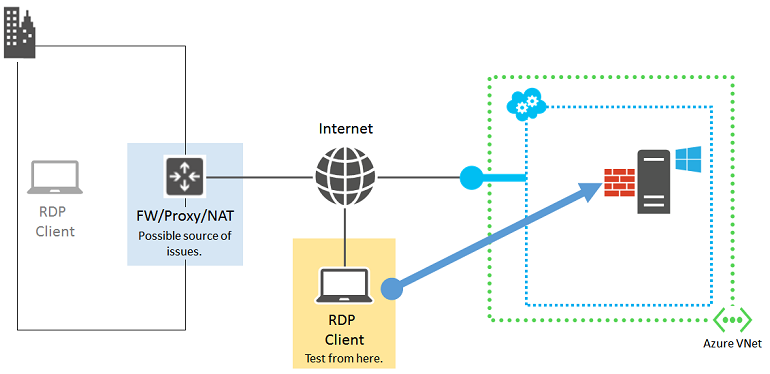
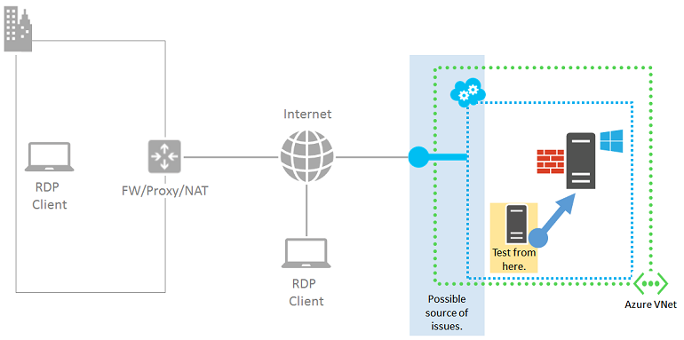

<properties
    pageTitle="Ausführliche Remotedesktop Problembehandlung | Microsoft Azure"
    description="Überprüfen Sie die detaillierten Schritte zur Problembehandlung remote desktop Fehler, ist nicht möglich, ein Windows-virtuellen Computern in Azure"
    services="virtual-machines-windows"
    documentationCenter=""
    authors="iainfoulds"
    manager="timlt"
    editor=""
    tags="top-support-issue,azure-service-management,azure-resource-manager"
    keywords="kann keine Verbindung herstellen mit Remotedesktop, Problembehandlung bei Remotedesktop, Remotedesktop kann keine Verbindung herstellen, remote desktop Fehler, Remotedesktop Problembehandlung, remote desktop-Probleme
"/>

<tags
    ms.service="virtual-machines-windows"
    ms.workload="infrastructure-services"
    ms.tgt_pltfrm="vm-windows"
    ms.devlang="na"
    ms.topic="support-article"
    ms.date="09/27/2016"
    ms.author="iainfou"/>

# Ausführliche Schritte zur Problembehandlung für remote desktop Verbindungsprobleme, Windows virtuellen Computern in Azure

Dieser Artikel enthält ausführliche zur Problembehandlung Schritte aus, um die diagnose und Behebung von komplexen Remotedesktop Fehler für Windows-basiertem Azure-virtuellen Computern an.

> [AZURE.IMPORTANT] Um die häufiger Remotedesktop Fehler zu vermeiden, sicherzustellen Sie, lesen [den grundlegenden Artikel zur Problembehandlung für Remote Desktop](virtual-machines-windows-troubleshoot-rdp-connection.md) , bevor Sie fortfahren.

Treten möglicherweise eine Fehlermeldung bei Remotedesktop, die nicht verdeckt [der grundlegende Remotedesktop](virtual-machines-windows-troubleshoot-rdp-connection.md)Leitfaden zur Problembehandlung in einer bestimmten Fehler ähneln. Wie folgt vor, um zu ermitteln, warum der Remote Desktop (RDP)-Client keine Verbindung zum Dienst RDP des Azure-virtuellen Computers ist.

[AZURE.INCLUDE [learn-about-deployment-models](../../includes/learn-about-deployment-models-both-include.md)]

Wenn Sie an einer beliebigen Stelle in diesem Artikel weitere Hilfe benötigen, können Sie die Azure-Experten auf [der MSDN-Azure und den Stapelüberlauf Foren](https://azure.microsoft.com/support/forums/)kontaktieren. Alternativ können Sie auch einen Supportvorfall Azure ablegen. Wechseln Sie zur [Azure-Support-Website](https://azure.microsoft.com/support/options/) , und klicken Sie auf **Anfordern von Support**. Informationen zur Verwendung von Azure-Unterstützung, lesen Sie den [Microsoft Azure Support häufig gestellte Fragen](https://azure.microsoft.com/support/faq/).

## Komponenten einer Remotedesktop-Verbindung

Die folgenden Komponenten spielen in eine RDP-Verbindung:

Bevor Sie fortfahren, kann es hilfreich, um zu überprüfen, auf was sich seit der letzten erfolgreichen Remotedesktop-Verbindung zu den virtuellen Computer geändert hat. Beispiel:

- Die öffentliche IP-Adresse der virtuellen Computers oder der Cloud-Dienst, den virtuellen Computer (auch die virtuelle IP-Adresse [VIP](https://en.wikipedia.org/wiki/Virtual_IP_address)genannt) enthält, hat sich geändert. Der Fehler RDP möglicherweise Ihre DNS-Client-Cache immer noch die *alte IP-Adresse* für den DNS-Namen registriert hat. Leeren Sie Ihr DNS-Client-Cache zu, und versuchen Sie erneut, den virtuellen Computer zu verbinden. Oder versuchen Sie es direkt mit den neuen VIP.
- Verwenden Sie eine Drittanbieter-Anwendung zum Verwalten Ihrer Remote Desktop-Verbindungen statt mithilfe der Verbindung durch den Azure-Portal generiert. Stellen Sie sicher, dass die Anwendungskonfiguration, die richtige TCP-für den Datenverkehr Remotedesktop enthält. Sie können diesen Port für eine klassische virtuellen Computern im [Portal Azure](https://portal.azure.com)überprüfen, indem Sie auf Einstellungen des virtuellen Computers > Endpunkte.

## Vorbereitende Schritte

Bevor Sie mit der detaillierte Problembehandlung,

- Überprüfen Sie den Status des virtuellen Computers in der klassischen Azure-Portal oder im Azure-Portal für offensichtlich Probleme.
- Führen Sie die [Schritte RDP häufigen die grundlegende Problembehandlung Leitfaden Quick Fix](virtual-machines-windows-troubleshoot-rdp-connection.md#quick-troubleshooting-steps)aus.

Versuchen Sie es Wiederherstellen der Verbindung mit dem virtuellen Computer über Remote Desktop nach der folgenden Schritte aus.

## Detaillierte Schritte zur Problembehandlung

Remotedesktop-Clients möglicherweise nicht erreichen Remotedesktop Dienst des Azure-virtuellen Computers aufgrund von Problemen bei den folgenden Quellen:

- [Remote Desktop-Client-computer](#source-1-remote-desktop-client-computer)
- [Organisation Intranet Kante Gerät](#source-2-organization-intranet-edge-device)
- [Cloud-Service-Endpunkts an, und greifen Sie auf Steuerung Liste (ACL)](#source-3-cloud-service-endpoint-and-acl)
- [Netzwerk-Sicherheitsgruppen](#source-4-network-security-groups)
- [Azure virtuellen Windows-basiertem Computer](#source-5-windows-based-azure-vm)

## Quelle 1: Remote Desktop Clientcomputer

Stellen Sie sicher, dass Ihr Computer Remote Desktop-Verbindungen mit einem anderen lokalen, Windows-basierten Computer vorgenommen werden kann.

Wenn dies nicht möglich ist, überprüfen Sie die folgenden Einstellungen auf Ihrem Computer:

- Eine lokale Firewall-Einstellung, die Remotedesktop Datenverkehr blockiert.
- Lokal installiert Proxy-Clientsoftware, die den Remote Desktop-Verbindungen verhindert wird.
- Lokal installiert Netzwerk Überwachung der Software, die den Remote Desktop-Verbindungen verhindert wird.
- Andere Arten von Sicherheitssoftware, die entweder den Datenverkehr überwachen oder bestimmte Arten von Datenverkehr, das verhindert Remote Desktop-Verbindungen zulassen/sperren.

In diesen Fällen vorübergehend deaktivieren der Software, und versuchen, eine Verbindung mit einer lokalen Computer über Remote Desktop. Wenn Sie sich die tatsächliche Ursache auf diese Weise feststellen können, arbeiten Sie mit Ihr Netzwerkadministrator zur Behebung der Software Einstellungen Remote Desktop-Verbindungen zulässt.

## Quelle 2: Organisation Intranet Kante Gerät

Stellen Sie sicher, dass Ihr Computer direkt mit dem Internet verbunden Remote Desktop-Verbindungen mit Ihrer Azure-virtuellen Computern vornehmen kann.

Wenn Sie nicht mit einen Computer verfügen, der direkt mit dem Internet verbunden ist, erstellen Sie und Testen Sie mit einer neuen Azure-virtuellen Computern in einer Ressource Gruppe oder Cloud-Dienst. Weitere Informationen finden Sie unter [Erstellen eines virtuellen Computers ausführen Windows in Azure](virtual-machines-windows-hero-tutorial.md). Sie können nach dem Test des virtuellen Computers und der Ressourcengruppe oder der Cloud-Dienst löschen.

Wenn Sie eine Remotedesktop Verbindung mit einem Computer direkt mit dem Internet verbundenen erstellen können, überprüfen Sie Ihre Organisation Intranet Kante Gerät für:

- Eine interne Firewall HTTPS-Verbindungen mit dem Internet blockieren.
- Einen Proxyserver Remote Desktop-Verbindungen verhindert.
- Einen unbefugten oder Netzwerk Überwachung Software für Geräte im Netzwerk Kante, das den Remote Desktop-Verbindungen verhindert wird ausgeführt.

Arbeiten Sie mit Ihren Netzwerkadministrator zur Behebung der Einstellungen für Ihre Organisation Intranet Kante Gerät HTTPS-basierte Remote Desktop-Verbindungen mit dem Internet zulässt.

## Quelle 3: Cloud Service-Endpunkts an und ACL

Für virtuelle Computer mit dem Modell zur Bereitstellung von klassischen erstellt stellen Sie sicher, dass ein anderes Azure-virtuellen Computer, der in der gleichen Cloud-Dienst oder virtuelles Netzwerk Remote Desktop-Verbindungen an Ihre Azure-virtuellen Computer vorgenommen werden können.

> [AZURE.NOTE] In Ressourcenmanager erstellte Maschinen, fahren Sie mit [Quelle 4: Netzwerk Sicherheitsgruppen](#source-4-network-security-groups).

Wenn Sie nicht über einen anderen virtuellen Computer in der gleichen Cloud-Dienst oder virtuelles Netzwerk verfügen, erstellen Sie eine. Führen Sie die Schritte in [Erstellen eines virtuellen Computers Windows in Azure ausgeführt](virtual-machines-windows-hero-tutorial.md). Löschen Sie den virtuellen Testcomputer, nachdem der Test abgeschlossen ist.

Wenn Sie über Remote Desktop mit einem virtuellen Computer in der gleichen Cloud-Dienst oder virtuelles Netzwerk herstellen können, überprüfen Sie diese Einstellungen:

- Der Endpunktkonfiguration für Remotedesktop Datenverkehr am Ziel virtueller Computer: die private TCP-des Endpunkts muss die Grundlage des virtuellen Computers Remote Desktop-Dienst hört TCP-übereinstimmen (der Standardwert liegt 3389).
- Die ACL für den Remote Desktop Datenverkehr Endpunkt am Ziel virtueller Computer: ACLs können Sie angeben, gewährt oder verweigert eingehenden Datenverkehr aus dem Internet basierend auf deren Quelle IP-Adresse. Unauffindbar ACLs können verhindern, dass die eingehenden Remotedesktop Datenverkehr an den Endpunkt. Überprüfen Ihre ACLs, um sicherzustellen, dass eingehenden Verkehr aus Ihrer öffentlichen IP-Adressen von Ihrem Proxy oder anderen Kante Server ist zulässig. Weitere Informationen finden Sie unter [was eine Network Access Control (ACL) ist?](../virtual-network/virtual-networks-acl.md)

Um der Endpunkt ist die Ursache des Problems zu überprüfen, entfernen Sie den aktuellen Endpunkt und Erstellen eines neuen Kontos, einen zufälligen Port im Bereich von 49152 – 65535 für die Nummer des externen Ports auswählen. Weitere Informationen finden Sie unter [Informationen zum Einrichten von Endpunkten in einem virtuellen Computer](virtual-machines-windows-classic-setup-endpoints.md).

## Quelle 4: Netzwerk-Sicherheitsgruppen

Eine genauere Kontrolle der zulässigen eingehenden und ausgehenden Datenverkehr zulassen Sicherheitsgruppen Netzwerk Sie können erstellen Regeln, die mehrere Subnetze und cloud Services in einem Azure-virtuellen Netzwerk. Überprüfen Sie Ihre Netzwerk-Sicherheitsgruppe-Regeln, um sicherzustellen, dass Remotedesktop Datenverkehr aus dem Internet zulässig ist:

- Wählen Sie Ihre virtuellen Computer im Azure-Portal aus.
- Klicken Sie auf **Alle Einstellungen** | **Netzwerk-Schnittstellen** und wählen Sie Ihre Netzwerk-Oberfläche aus.
- Klicken Sie auf **Alle Einstellungen** | **Netzwerk-Sicherheitsgruppe** , und wählen Sie Ihr Netzwerk-Sicherheitsgruppe.
- Klicken Sie auf **Alle Einstellungen** | **Regeln für eingehende Sicherheit** und stellen Sie sicher, Sie haben eine Regel zum gewähren RDP TCP-Anschluss 3389.
    - Wenn Sie eine Regel nicht verfügen, klicken Sie auf **Hinzufügen** , um eine Regel zu erstellen. Geben Sie für das Protokoll und dann auf **3389** für den Port Zielbereich **TCP** ein.
    - Stellen Sie sicher, dass die Aktion auf **Zulassen** festgelegt ist, und klicken Sie auf OK, um Ihre neue eingehende Regel zu speichern.

Weitere Informationen finden Sie unter [was eine Netzwerk Sicherheit Gruppe (NSG) ist?](../virtual-network/virtual-networks-nsg.md)

## Quelle 5: Windows-basiertem Azure virtueller Computer

Verwenden Sie die [Diagnose-Paket Azure IaaS (Windows)](https://home.diagnostics.support.microsoft.com/SelfHelp?knowledgebaseArticleFilter=2976864) um festzustellen, ob der Fehler aufgrund der Azure-virtuellen Computern selbst ist. Wenn dieses Diagnosepaket **RDP-Verbindung zu einer Azure-virtuellen Computer (Neustart erforderlich)** dieses Problem zu lösen kann, folgen Sie den Anweisungen in [diesem Artikel](virtual-machines-windows-reset-rdp.md)aus. In diesem Artikel werden zurückgesetzt, den Dienst Remote Desktop des virtuellen Computers:

- Aktivieren Sie die Windows-Firewall "Remotedesktop" Standardregel (TCP-Port 3389).
- Aktivieren Sie Remote Desktop-Verbindungen durch Festlegen den HKLM\System\CurrentControlSet\Control\Terminal Server\fDenyTSConnections Registrierungseintrag auf 0 ein.

Versuchen Sie die Verbindung zwischen Ihrem Computer aus. Wenn Sie noch nicht über Remote Desktop verbinden können, überprüfen Sie folgende mögliche Probleme:

- Remotedesktop Dienst wird nicht auf dem Ziel virtueller Computer ausgeführt werden.
- Der Dienst Remotedesktop hört TCP-Port 3389 nicht.
- Windows-Firewall oder einen anderen lokalen Firewall verfügt über eine ausgehende Regel, die den Datenverkehr Remotedesktop verhindert wird.
- Remote Desktop-Verbindungen ist verhindern von unbefugten oder Netzwerk Überwachung Software für das Azure-virtuellen Computern ausgeführt.

Virtuellen Computern erstellt, das Bereitstellungsmodell klassischen verwenden können Sie eine remote PowerShell Azure-Sitzung zu Azure-virtuellen Computern. Zuerst müssen Sie ein Zertifikat für die Cloud Hostingdienst des virtuellen Computers zu installieren. Wechseln Sie zu [Konfigurieren von Secure Remote PowerShell Access zu Azure virtuellen Computern](http://gallery.technet.microsoft.com/scriptcenter/Configures-Secure-Remote-b137f2fe) und herunterladen Sie die Skriptdatei **InstallWinRMCertAzureVM.ps1** mit Ihrem lokalen Computer.

Als Nächstes installieren Sie Azure PowerShell, wenn Sie noch nicht geschehen ist. Informationen Sie [zum Installieren und Konfigurieren von Azure PowerShell](../powershell-install-configure.md).

Als Nächstes öffnen Sie ein Eingabeaufforderungsfenster Azure PowerShell, und ändern Sie den aktuellen Ordner in den Speicherort der Skriptdatei **InstallWinRMCertAzureVM.ps1** . Um eine Azure PowerShell-Skript ausführen zu können, müssen Sie die richtige Ausführungsrichtlinie festlegen. Führen Sie den Befehl **Get-ExecutionPolicy** Sie Ihre aktuelle Richtlinie bestimmen. Informationen zum Festlegen der geeigneten Pegel finden Sie unter [Set-ExecutionPolicy](https://technet.microsoft.com/library/hh849812.aspx).

Als Nächstes geben Sie den Namen Ihres Abonnements Azure, den Namen der Cloud-Dienst und der Name des virtuellen Computers (entfernen die Zeichen < und >), und führen Sie dann auf diese Befehle.

    $subscr="<Name of your Azure subscription>"
    $serviceName="<Name of the cloud service that contains the target virtual machine>"
    $vmName="<Name of the target virtual machine>"
    .\InstallWinRMCertAzureVM.ps1 -SubscriptionName $subscr -ServiceName $serviceName -Name $vmName

Sie können die richtige Abonnementname aus der Eigenschaft _SubscriptionName_ der Anzeige des Befehls **Get-AzureSubscription** erhalten. Sie können den Namen des Cloud-Dienst für den virtuellen Computer in der Spalte _ServiceName_ in der Anzeige des Befehls **Get-AzureVM** erhalten.

Überprüfen Sie, ob Sie das neue Zertifikat haben. Öffnen Sie ein Zertifikate-Snap-in für den aktuellen Benutzer, und suchen Sie in den Ordner **Trusted Root aufgeführt** . Ein Zertifikat mit der DNS-Name der Cloud-Dienst in der Spalte Ausgestellt für sollte angezeigt werden (Beispiel: cloudservice4testing.cloudapp.net).

Als Nächstes Einleiten einer remote PowerShell Azure-Sitzung mithilfe der folgenden Befehle ein.

    $uri = Get-AzureWinRMUri -ServiceName $serviceName -Name $vmName
    $creds = Get-Credential
    Enter-PSSession -ConnectionUri $uri -Credential $creds

Nach der Eingabe gültiger Anmeldeinformationen, sollte ungefähr folgende Azure PowerShell Aufforderung angezeigt werden:

    [cloudservice4testing.cloudapp.net]: PS C:\Users\User1\Documents>

Im erste Teil des diese Aufforderung ist Ihr Name der Cloud-Dienst, die das Ziel virtuellen Computer enthält, auf denen unterscheiden sich möglicherweise "cloudservice4testing.cloudapp.net" verwenden. Sie können nun Azure PowerShell ausgestellt Befehle für diesen Clouddienst die Probleme untersuchen angegeben ist, und die Konfiguration korrigieren.

### Die Remote Desktop Services überwacht TCP-manuell korrigieren

Wenn Sie nicht im [Azure IaaS (Windows) Diagnosepaket](https://home.diagnostics.support.microsoft.com/SelfHelp?knowledgebaseArticleFilter=2976864) für das Problem **RDP-Verbindung zu einer Azure-virtuellen Computer (Neustart erforderlich)** bei der remote PowerShell Azure Sitzung Aufforderung ausführen können, führen Sie diesen Befehl.

    Get-ItemProperty -Path "HKLM:\System\CurrentControlSet\Control\Terminal Server\WinStations\RDP-Tcp" -Name "PortNumber"

Die Eigenschaft "PortNumber" zeigt die Nummer des aktuellen Ports. Ändern Sie bei Bedarf die Remotedesktop port Zahl zurück, um den Standardwert (3389) mit dem folgenden Befehl.

    Set-ItemProperty -Path "HKLM:\System\CurrentControlSet\Control\Terminal Server\WinStations\RDP-Tcp" -Name "PortNumber" -Value 3389

Stellen Sie sicher, dass der Port mit dem folgenden Befehl zum 3389 geändert wurde.

    Get-ItemProperty -Path "HKLM:\System\CurrentControlSet\Control\Terminal Server\WinStations\RDP-Tcp" -Name "PortNumber"

Beenden Sie die remote PowerShell Azure-Sitzung mit dem folgenden Befehl ein.

    Exit-PSSession

Überprüfen Sie, ob der Endpunkt Remotedesktop für den Azure-virtuellen Computer TCP-3398 auch als seine internen Anschluss verwendet. Starten Sie den Azure-virtuellen Computer neu, und versuchen Sie erneut eine Verbindung Remotedesktop.

## Zusätzliche Ressourcen

[Azure IaaS (Windows) Diagnose-Paket](https://home.diagnostics.support.microsoft.com/SelfHelp?knowledgebaseArticleFilter=2976864)

[Zurücksetzen eines Kennworts oder der Remote Desktop-Dienst für Windows-virtuellen Computern](virtual-machines-windows-reset-rdp.md)

[So installieren und Konfigurieren von Azure PowerShell](../powershell-install-configure.md)

[Behandeln von Problemen mit Secure Shell (SSH) Verbindungen mit einer Linux-basierten Azure-virtuellen Computern](virtual-machines-linux-troubleshoot-ssh-connection.md)

[Behandeln von Problemen mit Zugriff auf eine Anwendung ausgeführt wird, klicken Sie auf eine Azure-virtuellen Computern](virtual-machines-linux-troubleshoot-app-connection.md)
