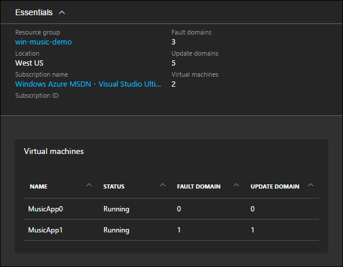
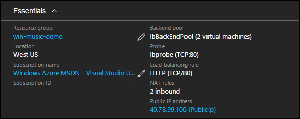
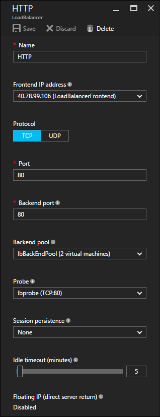
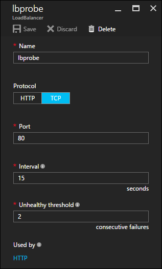
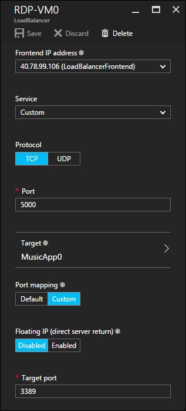

<properties
   pageTitle="Verfügbarkeit und Skalierung in Azure Ressourcenmanager Vorlagen | Microsoft Azure"
   description="Azure-virtuellen Computern DotNet Core Lernprogramm"
   services="virtual-machines-windows"
   documentationCenter="virtual-machines"
   authors="neilpeterson"
   manager="timlt"
   editor="tysonn"
   tags="azure-resource-manager"/>

<tags
   ms.service="virtual-machines-windows"
   ms.devlang="na"
   ms.topic="article"
   ms.tgt_pltfrm="vm-windows"
   ms.workload="infrastructure-services"
   ms.date="10/21/2016"
   ms.author="nepeters"/>

# <a name="availability-and-scale-in-azure-resource-manager-templates"></a>Verfügbarkeit und Skalierung in Azure Ressourcenmanager Vorlagen

Verfügbarkeit und Skalierung verweisen auf Verfügbarkeit und die Möglichkeit, bei Bedarf erfüllen. Wenn eine Anwendung von 99,9 % der Zeit sein muss, muss es eine Architektur verfügen, die mehrere gleichzeitige berechnen Ressourcen ermöglicht. Beispielsweise enthält eine Konfiguration mit einer höheren Ebene über die Verfügbarkeit von statt einer einzelnen Websites mehrerer Instanzen von derselben Website angezeigt, einschließlich Lastenausgleich Technologie davor. In dieser Konfiguration kann eine Instanz der Anwendung für die Wartung, abgeschaltet werden während der verbleibenden funktionieren weiterhin. Dezimalstellen beziehen sich andererseits auf Applikationen Möglichkeit zum Demand dienen. Mit einer Auslastung kann angeglichene Anwendung, hinzufügen oder Entfernen von Instanzen aus dem Pool eine Anwendung Nachfrage zu skalieren.

Dieses Dokument beschreibt, wie die Bereitstellung von Musik Store Beispielen für Verfügbarkeit und Skalierung konfiguriert ist. Alle Abhängigkeiten und eindeutige Konfigurationen werden hervorgehoben. Für optimale Ergebnisse, vorab eine Instanz der Lösung Azure-Abonnement und Arbeit zusammen mit der Vorlage Ressourcenmanager Azure bereitgestellt werden. Die vollständige Vorlage – [Musik Store Bereitstellung unter Windows](https://github.com/Microsoft/dotnet-core-sample-templates/tree/master/dotnet-core-music-windows)finden Sie hier.

## <a name="availability-set"></a>Festlegen der Verfügbarkeit

Legen Sie eine Verfügbarkeit erstreckt sich logisch Azure-virtuellen Computern auf physischen Hosts und andere infrastrukturelle Komponenten wie Power benötigtes Material und physische Netzwerke Hardware. Verfügbarkeit Sätze stellen Sie sicher, dass während der Wartung, Gerätefehler oder andere unten Zeit, nicht alle virtuellen Computern vorgenommen werden. Eine Verfügbarkeit festlegen können zu einer Vorlage Ressourcenmanager Azure mithilfe der Visual Studio-Ressource Assistent oder Einfügen von gültigen JSON in einer Vorlage hinzugefügt werden.

Führen Sie diesen Link, um finden in der Stichprobe JSON innerhalb der Ressourcenmanager Vorlage – [Verfügbarkeit festzulegen](https://github.com/Microsoft/dotnet-core-sample-templates/blob/master/dotnet-core-music-windows/azuredeploy.json#L368).


```none
{
  "apiVersion": "2015-06-15",
  "type": "Microsoft.Compute/availabilitySets",
  "name": "[variables('availabilitySetName')]",
  "location": "[resourceGroup().location]",
  "tags": {
    "displayName": "availability-set"
  },
  "properties": {
  }
}
```

Eine Verfügbarkeit festlegen, wird als eine Eigenschaft einer Ressource virtuellen Computern deklariert. 

Führen Sie diesen Link, um das JSON-Beispiel innerhalb der Ressourcenmanager Vorlage – [Verfügbarkeit festlegen Association mit virtuellen Computern](https://github.com/Microsoft/dotnet-core-sample-templates/blob/master/dotnet-core-music-windows/azuredeploy.json#L302)finden Sie unter.

```none
"properties": {
  "availabilitySet": {
    "id": "[resourceId('Microsoft.Compute/availabilitySets', variables('availabilitySetName'))]"
  }
```
Die Verfügbarkeit von Azure-Portal gesehen festlegen. Jede virtuellen Computern und Details über die Konfiguration werden hier detailliert beschrieben.



Ausführliche Informationen zu Verfügbarkeit Mengen finden Sie unter [Verwalten der Verfügbarkeit von virtuellen Computern](./virtual-machines-windows-manage-availability.md). 

## <a name="network-load-balancer"></a>Netzwerk-Lastenausgleich

Eine Sammlung Verfügbarkeit Anwendung Fehlertoleranz bereit, bereitgestellt, ein Lastenausgleich viele Instanzen der Anwendung auf eine einzelne Netzwerkadresse. Mehrere Instanzen einer Anwendung können auf viele virtuellen Computern, die jeweils bei einer Verbindung zu einem Lastenausgleich gehostet werden. Wie die Anwendung erfolgt leitet Lastenausgleich die eingehende Anforderung über die angefügten Mitglieder an. Ein Lastenausgleich mithilfe der Visual Studio-Ressource Assistent hinzugefügt werden kann, oder durch Einfügen ordnungsgemäß formatiert ist JSON-Ressource in die Ressourcenmanager Azure-Vorlage.

Führen Sie diesen Link, um das JSON-Beispiel innerhalb der Ressourcenmanager Vorlage – [Netzwerklastenausgleich](https://github.com/Microsoft/dotnet-core-sample-templates/blob/master/dotnet-core-music-windows/azuredeploy.json#L198)finden Sie unter.

```none
{
  "apiVersion": "2015-06-15",
  "type": "Microsoft.Network/loadBalancers",
  "name": "[variables('loadBalancerName')]",
  "location": "[resourceGroup().location]",
  "tags": {
    "displayName": "load-balancer"
  },
  ........<truncated>
}
```

Da die Stichprobe Anwendung über eine öffentliche IP-Adresse mit dem Internet verfügbar gemacht wird, wird diese Adresse Lastenausgleich zugeordnet. 

Führen Sie diesen Link, um das JSON-Beispiel in die Ressourcenmanager Vorlage – [Netzwerklastenausgleich Association mit öffentlichen IP-Adresse](https://github.com/Microsoft/dotnet-core-sample-templates/blob/master/dotnet-core-music-windows/azuredeploy.json#L211)angezeigt.

```none
"frontendIPConfigurations": [
  {
    "properties": {
      "publicIPAddress": {
        "id": "[resourceId('Microsoft.Network/publicIPAddresses', variables('publicIpAddressName'))]"
      }
    },
    "name": "LoadBalancerFrontend"
  }
]
```

Aus dem Azure-Portal zeigt die Network laden Lastenausgleich (Übersicht) die Zuordnung mit der öffentlichen IP-Adresse.



## <a name="load-balancer-rule"></a>Laden Lastenausgleich Regel

Wenn Sie ein Lastenausgleich verwenden zu können, sind Regeln konfiguriert, die steuern, wie Datenverkehr den beabsichtigten Ressourcen verteilt. Mit der Stichprobe Musik Store-Anwendung Datenverkehr auf Port 80 der öffentlichen IP-Adresse eintrifft und über Port 80 alle virtuellen Computern verteilt ist. 

Führen Sie diesen Link, um das JSON-Beispiel innerhalb der Ressourcenmanager Vorlage – [Laden Lastenausgleich Regel](https://github.com/Microsoft/dotnet-core-sample-templates/blob/master/dotnet-core-music-windows/azuredeploy.json#L226)angezeigt.


```none
"loadBalancingRules": [
  {
    "name": "[variables('loadBalencerRule')]",
    "properties": {
      "frontendIPConfiguration": {
        "id": "[concat(resourceId('Microsoft.Network/loadBalancers', variables('loadBalancerName')), '/frontendIPConfigurations/LoadBalancerFrontend')]"
      },
      "backendAddressPool": {
        "id": "[variables('lbPoolID')]"
      },
      "protocol": "Tcp",
      "frontendPort": 80,
      "backendPort": 80,
      "enableFloatingIP": false,
      "idleTimeoutInMinutes": 5,
      "probe": {
        "id": "[variables('lbProbeID')]"
      }
    }
  }
]
```

Eine Ansicht der Netzwerk laden Lastenausgleich Regel aus dem Portal.



## <a name="load-balancer-probe"></a>Laden Lastenausgleich Prüfpunkt

Lastenausgleich muss auch jedem virtuellen Computer zu überwachen, sodass Anfragen nur für laufende Systeme bereitgestellt werden. Diese Überwachung erfolgt Konstante Überprüfung eines vordefinierten Ports. Port 80 auf alle darin enthaltenen virtuellen Computern Prüfpunkt ist die Bereitstellung von Musik Store konfiguriert. 

Führen Sie diesen Link, um das JSON-Beispiel innerhalb der Ressourcenmanager Vorlage – [Laden Lastenausgleich Prüfpunkt](https://github.com/Microsoft/dotnet-core-sample-templates/blob/master/dotnet-core-music-windows/azuredeploy.json#L247)finden Sie unter.


```none
"probes": [
  {
    "properties": {
      "protocol": "Tcp",
      "port": 80,
      "intervalInSeconds": 15,
      "numberOfProbes": 2
    },
    "name": "lbprobe"
  }
]
```

Der Lastenausgleich laden Prüfpunkt vom Azure-Portal angezeigt.



## <a name="inbound-nat-rules"></a>Eingehende Regeln NAT

Wenn ein Lastenausgleich verwenden zu können, müssen Regeln an, die nicht laden angeglichene Zugriff auf das jedes virtuellen Computers abgelegt werden. Beispielsweise beim Erstellen einer RDP-Verbindungs mit jedem virtuellen Computer sollte diesen Datenverkehr nicht Lastenausgleich, lieber ein zuvor festgelegten Pfad konfiguriert werden soll. Zuvor festgelegten Pfade werden mithilfe einer Regel für eingehende NAT Ressource konfiguriert. Verwenden diese Ressource, kann eingehende Kommunikation einzelne virtuelle Maschinen zugeordnet werden. 

Mit der Anwendung die Musik Store, wird ein Port 5000 ab Anschluss 3389 jedes virtuellen Computers für RDP Zugriff zugeordnet. Die `copyindex()` Funktion wird verwendet, um den eingehenden Port zu erhöhen, dass die zweite virtuellen Computern einen eingehenden Anschluss von 5001, die dritte 5002 empfängt usw..

Führen Sie diesen Link, um das JSON-Beispiel innerhalb der Ressourcenmanager Vorlage – [Eingehende NAT Regeln](https://github.com/Microsoft/dotnet-core-sample-templates/blob/master/dotnet-core-music-windows/azuredeploy.json#L260)finden Sie unter. 

```none
{
  "apiVersion": "2015-06-15",
  "type": "Microsoft.Network/loadBalancers/inboundNatRules",
  "name": "[concat(variables('loadBalancerName'), '/', 'RDP-VM', copyIndex())]",
  "location": "[resourceGroup().location]",
  "tags": {
    "displayName": "load-balancer-nat-rule"
  },
  "copy": {
    "name": "lbNatLoop",
    "count": "[parameters('numberOfInstances')]"
  },
  "dependsOn": [
    "[concat('Microsoft.Network/loadBalancers/', variables('loadBalancerName'))]"
  ],
  "properties": {
    "frontendIPConfiguration": {
      "id": "[variables('ipConfigID')]"
    },
    "protocol": "tcp",
    "frontendPort": "[copyIndex(5000)]",
    "backendPort": 3389,
    "enableFloatingIP": false
  }
}
```

Ein Beispiel für eingehende NAT Regel aus, wie in der Azure-Portal zu sehen. Eine Regel RDP NAT wird für jeden virtuellen Computer in der Bereitstellung erstellt.



Ausführliche Informationen zu den Azure Netzwerklastenausgleich finden Sie unter [den Lastenausgleich für Azure-Infrastrukturdiensten](./virtual-machines-windows-load-balance.md).

## <a name="deploy-multiple-vms"></a>Bereitstellen von mehreren virtuellen Computern

Schließlich sind für eine Verfügbarkeit festlegen oder Lastenausgleich effektiv funktioniert, mehrere virtuelle Computer erforderlich. Mehrere virtuellen Computern können mithilfe der Funktion Azure Ressourcenmanager Vorlage kopieren bereitgestellt werden. Mithilfe der Kopierfunktion, es ist nicht erforderlich, um eine begrenzte Anzahl von virtuellen Computern zu definieren, lieber diesen Wert kann dynamisch bereitgestellt werden zum Zeitpunkt der Bereitstellung. Die Funktion "Kopieren" verbraucht die Anzahl der Instanzen erstellt werden und die Ziehpunkte, die richtige Anzahl von virtuellen Computern und die zugeordneten Ressourcen bereitstellen.

In die Musik Store Beispielvorlage ist ein Parameter definiert, die in die Anzahl der Instanzen akzeptiert. Diese Nummer dient überall auf der Vorlage beim Erstellen von virtuellen Computern und zugehörige Ressourcen.

```none
"numberOfInstances": {
  "type": "int",
  "minValue": 1,
  "defaultValue": 2,
  "metadata": {
    "description": "Number of VM instances to be created behind load balancer."
  }
},
```

Klicken Sie auf die Ressource virtuellen Computern wird die Schleife kopieren einen Namen und die Anzahl der Instanzenparameter verwendet, um die Anzahl der Exemplare resultierende steuern angegeben.

Führen Sie diesen Link, um das JSON-Beispiel innerhalb der Ressourcenmanager Vorlage – [Funktion "Kopieren" virtuellen Computern](https://github.com/Microsoft/dotnet-core-sample-templates/blob/master/dotnet-core-music-windows/azuredeploy.json#L290)finden Sie unter. 


```none
{
  "apiVersion": "2015-06-15",
  "type": "Microsoft.Compute/virtualMachines",
  "name": "[concat(variables('vmName'),copyindex())]",
  "location": "[resourceGroup().location]",
  "copy": {
    "name": "virtualMachineLoop",
    "count": "[parameters('numberOfInstances')]"
  }
```

Mit der Kopierfunktion die aktuelle Iteration zugegriffen werden die `copyIndex()` (Funktion). Der Wert der Funktion Index kopieren kann virtuellen Computern und anderen Ressourcen Namen verwendet werden. Wenn zwei Instanzen eines virtuellen Computers bereitgestellt werden, benötigen sie beispielsweise unterschiedliche Namen. Die `copyIndex()` (Funktion) als Teil der Name des virtuellen Computers verwendet werden kann, um einen eindeutigen Namen zu erstellen. Ein Beispiel für die `copyindex()` für die Benennung von Zwecke verwendete Funktion kann in der Ressource virtuellen Computern angezeigt werden. Hier ist der Name des Computers eine Verkettung von der `vmName` Parameter, und die `copyIndex()` (Funktion). 

Führen Sie diesen Link, um finden in der Stichprobe JSON innerhalb der Ressourcenmanager Vorlage – [Kopieren Index (Funktion)](https://github.com/Microsoft/dotnet-core-sample-templates/blob/master/dotnet-core-music-windows/azuredeploy.json#L309). 


```none
"osProfile": {
  "computerName": "[concat(variables('vmName'),copyindex())]",
  "adminUsername": "[parameters('adminUsername')]",
  "adminPassword": "[parameters('adminPassword')]"
}
```

Die `copyIndex` Funktion wird in die Musik Store Beispielvorlage mehrmals verwendet. Ressourcen und Funktionen nutzen `copyIndex` einschließen nichts speziell für einen einzelnen Instanz des virtuellen Computers solche und Netzwerk-Schnittstelle, laden Lastenausgleich Regeln, und eine Funktionen abhängig. 

Weitere Informationen zur Kopierfunktion finden Sie unter [Erstellen mehrerer Instanzen von Ressourcen in Azure Ressourcenmanager](../resource-group-create-multiple.md).

## <a name="next-step"></a>Als Nächstes

<hr>

[Schritt 4 – Bereitstellung der Anwendung mit Azure Ressourcenmanager Vorlagen](./virtual-machines-windows-dotnet-core-5-app-deployment.md)