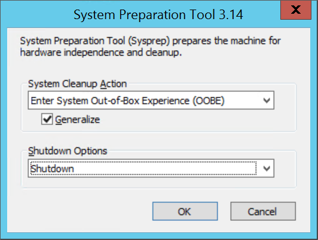

<properties
    pageTitle="Einem Windows virtuelle Festplatte generalize | Microsoft Azure"
    description="Sie lernen, wie Sysprep verwenden, um einen Windows virtuellen Computer zur Verwendung mit dem Modell zur Bereitstellung von Ressourcenmanager generalize."
    services="virtual-machines-windows"
    documentationCenter=""
    authors="cynthn"
    manager="timlt"
    editor="tysonn"
    tags="azure-resource-manager"/>

<tags
    ms.service="virtual-machines-windows"
    ms.workload="infrastructure-services"
    ms.tgt_pltfrm="vm-windows"
    ms.devlang="na"
    ms.topic="article"
    ms.date="10/20/2016"
    ms.author="cynthn"/>
    
    
    
    
# Einen Windows-Computer mithilfe von Sysprep generalize

In diesem Abschnitt wird gezeigt, wie auf Ihrem Windows-virtuellen Computern für die Verwendung als Bild generalize erstellt wird. Sysprep entfernt alle Ihre persönlichen Kontoinformationen, unter anderem und vorbereitet des Computers als ein Bild verwendet werden soll. Ausführliche Informationen zu Sysprep finden Sie unter [wie Sysprep verwenden: ein Einführung](http://technet.microsoft.com/library/bb457073.aspx).

Stellen Sie sicher, dass die Serverrollen, die auf dem Computer ausgeführt von Sysprep unterstützt werden. Weitere Informationen finden Sie unter [Sysprep-Unterstützung für Serverrollen](https://msdn.microsoft.com/windows/hardware/commercialize/manufacture/desktop/sysprep-support-for-server-roles)

>[AZURE.IMPORTANT] Wenn Sie Sysprep vor dem Hochladen der virtuellen Festplatte in Azure zum ersten Mal ausgeführt werden, stellen Sie sicher, dass Sie [Ihre virtuellen Computer vorbereitet](virtual-machines-windows-prepare-for-upload-vhd-image.md) haben, bevor Sysprep ausgeführt. 

1. Melden Sie sich der Windows-Computer an.

2. Öffnen Sie das Eingabeaufforderungsfenster als Administrator an. Wechseln Sie zu **%windir%\system32\sysprep**, und führen Sie `sysprep.exe`.

3. Klicken Sie im Dialogfeld **Tool zum Vorbereiten** **Geben System Out-of-Box-Experience (OOBE)**wählen Sie aus, und stellen Sie sicher, dass das Kontrollkästchen **verallgemeinern** ausgewählt ist.

4. Wählen Sie **war(en)** **War(en) Optionen**aus.

5. Klicken Sie auf **OK**.

    

6. Wenn Sysprep abgeschlossen ist, wird es beendet des virtuellen Computers wird. 

## Nächste Schritte

- Wenn der virtuellen Computer lokal ist, können Sie jetzt [die virtuelle Festplatte in Azure hochladen](virtual-machines-windows-upload-image.md).
- Wenn Sie der virtuellen Computer bereits in Azure ist, können Sie jetzt [Erstellen Sie ein Bild aus dem GRG virtuellen Computer](virtual-machines-windows-capture-image.md).