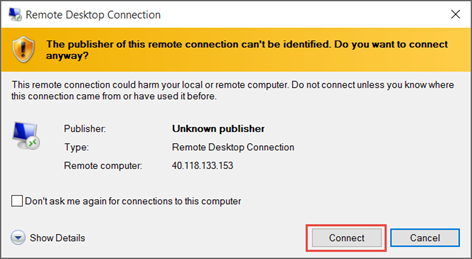

<properties
    pageTitle="Installieren Sie Ihre erste Windows virtuellen Computers IIS | Microsoft Azure"
    description="Experimentieren Sie mit der ersten Windows-Computer, nach der Installation von IIS und Anschluss 80 und unter Verwendung des Azure-Portals wird geöffnet."
    keywords=""
    services="virtual-machines-windows"
    documentationCenter=""
    authors="cynthn"
    manager="timlt"
    editor=""
    tags="azure-resource-manager"/>
<tags
    ms.service="virtual-machines-windows"
    ms.workload="infrastructure-services"
    ms.tgt_pltfrm="vm-windows"
    ms.devlang="na"
    ms.topic="article"
    ms.date="09/06/2016"
    ms.author="cynthn"/>

# Experimentieren Sie mit der Installation von einer Rolle auf Ihrem Windows-virtuellen Computer
    
Nachdem Sie des ersten virtuellen Computers (virtueller Computer) Stand und ausgeführt haben, können Sie zum Installieren von Software und Dienste verschieben. In diesem Lernprogramm werden wir nun Server-Manager des Windows Server virtuellen Computers verwenden, um IIS zu installieren. Klicken Sie dann erstellen wir eine Netzwerk Sicherheit Gruppe (NSG) mithilfe des Azure-Portals um Port 80 für IIS-Verkehr zu öffnen. 

Wenn Sie bereits Ihre erste virtueller Computer erstellt haben, sollten Sie zum [Erstellen Ihrer ersten Windows virtuellen Computers Azure-Portal](virtual-machines-windows-hero-tutorial.md) zurückkehren bevor Sie dieses Lernprogramm fortsetzen.

## Stellen Sie sicher, dass der virtuellen Computer ausgeführt wird

1. Öffnen Sie das [Azure-Portal](https://portal.azure.com)an.
2. Klicken Sie im Menü Hub auf **virtuellen Computern**. Wählen Sie den virtuellen Computer aus der Liste aus.
3. Wenn der Status **gestoppt (Deallocated)**angezeigt wird, klicken Sie auf die Schaltfläche **Start** , klicken Sie auf den virtuellen Computer Falz **Essentials** . Wenn der Status **ausgeführt**wird, können Sie mit dem nächsten Schritt verschieben.

## Herstellen einer Verbindung des virtuellen Computers mit, und melden Sie sich

1.  Klicken Sie im Menü Hub auf **virtuellen Computern**. Wählen Sie den virtuellen Computer aus der Liste aus.

3. Klicken Sie auf das Blade des virtuellen Computers klicken Sie auf **Verbinden**. Dies erstellt und downloads für eine Remote Desktop Protocol-Datei (RDP-Datei), die sich wie eine Verknüpfung zur Verbindung mit Ihrem Computers befindet. Möglicherweise möchten die Datei auf dem Desktop für den einfachen Zugriff zu speichern. **Öffnen** dieser Datei in Verbindung mit Ihrem virtuellen Computer.

    

4. Sie erhalten eine Warnung, die die RDP von einem unbekannten Herausgeber stammt. Dies ist normal. Klicken Sie auf **Verbinden** , um den Vorgang fortzusetzen, klicken Sie im Fenster Remotedesktop.

    

5. Geben Sie den Benutzernamen und das Kennwort für das lokale Konto, das Sie erstellt haben, wenn Sie den virtuellen Computer erstellt haben, klicken Sie im Windows-Sicherheit. Der Benutzername wird als *Vmname*& #92 eingegeben; der *Benutzername*, klicken Sie dann auf **OK**.

    
    
6.  Sie erhalten eine Warnung, dass das Zertifikat überprüft werden kann. Dies ist normal. Klicken Sie auf **Ja** zum Überprüfen der Identität des virtuellen Computers und Fertig stellen auf Protokollierung.

    

Wenn Sie auf Probleme beim Ausführen bei dem Versuch, eine Verbindung herstellen, finden Sie unter [Behandeln von Problemen mit Remote Desktop-Verbindungen zu einem Windows-basierten Azure virtuellen Computern](virtual-machines-windows-troubleshoot-rdp-connection.md).

## Installieren Sie IIS Ihrer virtuellen Computers

Jetzt, da Sie in den virtuellen Computer angemeldet sind, werden wir eine Serverrolle installieren, sodass Sie weitere experimentieren können.

1. Öffnen Sie **Server-Manager** , sofern es noch nicht geöffnet ist. Klicken Sie auf das Menü **Start** , und klicken Sie dann auf **Server-Manager**.
2. Wählen Sie **Server-Manager**aus dem linken Bereich **Lokalen Server** aus. 
3. Wählen Sie im Menü **Verwalten** > **Hinzufügen von Rollen und Features**.
4. Klicken Sie in das Hinzufügen von Rollen und Features-Assistenten auf der Seite **Installation Type** **rollenbasierte oder featurebasierten Installation**wählen Sie, und klicken Sie dann auf **Weiter**.

    

5. Wählen Sie aus dem Serverpool den virtuellen Computer aus, und klicken Sie auf **Weiter**.
6. Wählen Sie auf der Seite **Serverrollen** **Webserver (IIS)**ein.

    

7. Im Popup zum Hinzufügen von Features für IIS erforderlich ist Stellen Sie sicher, dass **enthalten Tools zum Projektmanagement** ausgewählt ist, und klicken Sie dann auf **Features hinzufügen**. Wenn das Popup geschlossen wird, klicken Sie im Assistenten auf **Weiter** .

    

8. Klicken Sie auf der Seite Features auf **Weiter**.
9. Klicken Sie auf der Seite **Webserver Rolle (IIS)** auf **Weiter**. 
10. Klicken Sie auf der Seite **Rollendienste** auf **Weiter**. 
11. Klicken Sie auf der Seite **Bestätigung** auf **Installieren**. 
12. Wenn die Installation abgeschlossen ist, klicken Sie auf **Schließen** , klicken Sie im Assistenten.

## Öffnen Sie Port 80 

Damit für Ihre virtuellen Computer eingehenden Verkehr über den Port 80 annehmen können müssen Sie eine eingehende Regel der Netzwerk-Sicherheitsgruppe hinzufügen. 

1. Öffnen Sie das [Azure-Portal](https://portal.azure.com)an.
2. Wählen Sie **virtuellen Computern** den virtuellen Computer, die Sie erstellt haben.
3. Klicken Sie in den Einstellungen virtuellen Computern Wählen Sie **Netzwerk-Schnittstellen** , und wählen Sie dann auf die vorhandene Netzwerkschnittstelle.

    

4. Klicken Sie in **Essentials** für die Benutzeroberfläche Netzwerk auf der **Network-Sicherheitsgruppe**.

    

5. In der **Essentials** Blade für die NSG sollten Sie eine vorhandene Standard eingehende Regel für die **standardmäßige zulassen Rdp** verfügen, die Sie sich bei dem virtuellen Computer anmelden können. Fügen Sie ein anderes eingehende Regel IIS-Datenverkehr zulässt. Klicken Sie auf **Regel für eingehende Sicherheit**.

    

6. **Eingehende Sicherheitsregeln**klicken Sie auf **Hinzufügen**.

    

7. **Eingehende Sicherheitsregeln**klicken Sie auf **Hinzufügen**. Geben Sie im Portbereich **80** ein, und stellen Sie sicher, dass **Zulassen** ausgewählt ist. Wenn Sie fertig sind, klicken Sie auf **OK**.

    
 
Weitere Informationen zu NSGs, eingehende und ausgehende Regeln finden Sie unter [Externer Zugriff auf Ihre virtuellen Computer mit dem Azure-Portal zulassen](virtual-machines-windows-nsg-quickstart-portal.md)
 
## Verbinden Sie mit der standardmäßigen IIS-website

1. Klicken Sie im Portal Azure klicken Sie auf **virtuellen Computern** , und wählen Sie dann Ihre virtuellen Computer.
2. Kopieren Sie in das Blade **Essentials** Ihre **öffentliche IP-Adresse**ein.

    

2. Öffnen Sie einen Browser, und geben Sie in der Adressleiste in Ihre öffentliche IP-Adresse wie folgt: http://<publicIPaddress> , und klicken Sie auf die **EINGABETASTE** , um die an diese Adresse zu wechseln.
3. Ihr Browser sollte die standardmäßige IIS-Webseite geöffnet werden. Es sieht ungefähr wie folgt aus:

    

    

## Nächste Schritte

- Sie können auch mit [einen Datenträger anfügen](virtual-machines-windows-attach-disk-portal.md) an Ihre virtuellen Computern experimentieren. Daten Datenträger bieten mehr Speicherplatz für den virtuellen Computer an.
