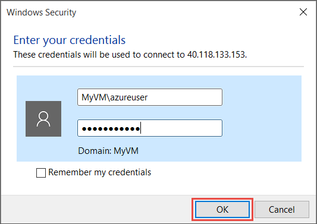
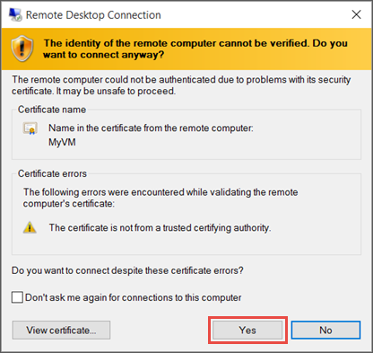
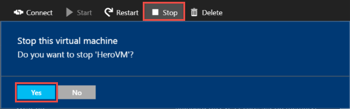

<properties
    pageTitle="Erstellen Ihrer ersten Windows virtueller Computer | Microsoft Azure"
    description="Erfahren Sie, wie Ihre erste Windows-Computer mithilfe von Azure-Portal erstellt."
    keywords="Windows-Computer, Erstellen einer virtuellen Computern, virtuellen Computer Einrichten eines virtuellen Computers"
    services="virtual-machines-windows"
    documentationCenter=""
    authors="cynthn"
    manager="timlt"
    editor=""
    tags="azure-resource-manager"/>
<tags
    ms.service="virtual-machines-windows"
    ms.workload="infrastructure-services"
    ms.tgt_pltfrm="vm-windows"
    ms.devlang="na"
    ms.topic="hero-article"
    ms.date="09/06/2016"
    ms.author="cynthn"/>

# Erstellen des ersten virtuellen Computers für Windows Azure-Portal

In diesem Lernprogramm erfahren Sie wie einfach es ist, erstellen ein Windows-virtuellen Computern (virtueller Computer) in wenigen Minuten mithilfe des Azure-Portals.  

Wenn Sie ein Azure-Abonnement besitzen, erstellen Sie ein [kostenloses Konto](https://azure.microsoft.com/free/) , bevor Sie beginnen.

## Wählen Sie das Bild virtueller Computer vom marketplace

Wir verwenden eines Bilds Windows Server 2012 R2 Datacenter beispielhaft, aber das ist nur eine der Azure bietet viele Bilder. Bild Auswahl abhängig von Ihrem Abonnement ab. Beispielsweise sind einige desktop-Images [MSDN-Abonnenten](https://azure.microsoft.com/pricing/member-offers/msdn-benefits-details/?WT.mc_id=A261C142F)zur Verfügung.

1. Melden Sie sich mit dem [Azure-Portal](https://portal.azure.com)aus.

2. Klicken Sie auf **neu**, klicken Sie auf das Menü Hub > **virtuellen Computern** > **Windows Server 2012 R2 Datacenter**.

    

3. Auf **Windows Server 2012 R2 Datacenter** vorher, in **ein Bereitstellungsmodell auswählen**stellen Sie sicher, dass **Ressourcenmanager** ausgewählt ist. Klicken Sie auf **Erstellen**.

    

## Erstellen Sie die Windows-Computer

Nachdem Sie das Bild auswählen, können Sie die Standardeinstellungen verwenden und schnell des virtuellen Computers zu erstellen.

1. Geben Sie in die **Grundlagen** Blade einen **Namen** für den virtuellen Computer ein. Der Name muss 1 bis 15 Zeichen lang sein, und es darf keine Sonderzeichen enthalten.

2. Geben Sie einen **Benutzernamen**und ein sicheres **Kennwort** , das verwendet wird, um ein lokales Konto des virtuellen Computers zu erstellen. Das lokale Konto dient zum an- und den virtuellen Computer verwalten. 

    Das Kennwort muss 8-123 Zeichen lang sein und drei aus den folgenden vier Komplexität-Anforderungen entsprechen: einen Kleinbuchstaben, einen Großbuchstaben enthalten, eine Zahl und ein Sonderzeichen. Finden Sie weitere Informationen zu [Benutzername und Kennwort Anforderungen](virtual-machines-windows-faq.md#what-are-the-username-requirements-when-creating-a-vm).

3. Wählen Sie eine vorhandene [Ressourcengruppe](../azure-resource-manager/resource-group-overview.md#resource-groups) aus, oder geben Sie den Namen für eine neue. Geben Sie eine Azure Datacenter **Speicherort** , beispielsweise **Westen US**ein. 

4. Wenn Sie fertig sind, klicken Sie auf **OK** , um zum nächsten Abschnitt zu gelangen. 

    

    
5. Wählen Sie eine virtueller [Größe](virtual-machines-windows-sizes.md)aus, und klicken Sie dann auf **Wählen Sie aus** , um den Vorgang fortzusetzen. 

    

6. Klicken Sie auf das Blade **Einstellungen** können Sie die Speicherung und Netzwerk-Optionen ändern. Akzeptieren Sie die Standardeinstellungen für dieses Lernprogramm. Wenn Sie eine Größe des virtuellen Computers ausgewählt haben, die es unterstützt, können Sie Azure Premium Speicher versuchen, indem Sie in den **Typ der Datenträger** **Premium (SSD)** auswählen. Wenn Sie alle Änderungen vorgenommen haben, klicken Sie auf **OK**.

    

7. Klicken Sie auf **Zusammenfassung** , um Ihre Auswahl zu überprüfen. Wenn Sie die **Überprüfung übergebene** Nachricht angezeigt wird, klicken Sie auf **OK**.

    

8. Während des virtuellen Computers Azure erstellt hat, können Sie den Fortschritt auf **virtuellen Computern** im Menü Hub nachverfolgen. 

## Herstellen einer Verbindung des virtuellen Computers mit, und melden Sie sich auf

1.  Klicken Sie im Menü Hub auf **virtuellen Computern**.

2.  Wählen Sie den virtuellen Computer aus der Liste aus.

3. Klicken Sie auf das Blade des virtuellen Computers auf **Verbinden**. Dies erstellt und downloads für eine Remote Desktop Protocol-Datei (RDP-Datei), die sich wie eine Verknüpfung zur Verbindung mit Ihrem Computers befindet. Möglicherweise möchten Sie zum Speichern der Datei auf dem Desktop Zugriff zu erleichtern. **Öffnen** dieser Datei in Verbindung mit Ihrem virtuellen Computer.

    

4. Sie erhalten eine Warnung, die die RDP von einem unbekannten Herausgeber stammt. Dies ist normal. Klicken Sie auf **Verbinden** , um den Vorgang fortzusetzen, klicken Sie im Fenster Remotedesktop.

    

5. Geben Sie den Benutzernamen und das Kennwort für das lokale Konto, das Sie erstellt haben, wenn Sie den virtuellen Computer erstellt haben, klicken Sie im Windows-Sicherheit. Der Benutzername wird als *Vmname*& #92 eingegeben; der *Benutzername*, klicken Sie dann auf **OK**.

    
    
6.  Sie erhalten eine Warnung, dass das Zertifikat überprüft werden kann. Dies ist normal. Klicken Sie auf **Ja** zum Überprüfen der Identität des virtuellen Computers und Fertig stellen auf Protokollierung.

    

Wenn Sie auf Probleme beim Ausführen bei dem Versuch, eine Verbindung herstellen, finden Sie unter [Behandeln von Problemen mit Remotedesktop Verbindungen zu einem Windows-basierten Azure virtuellen Computern](virtual-machines-windows-troubleshoot-rdp-connection.md).

Sie können jetzt mit den virtuellen Computern arbeiten, wie Sie mit einem beliebigen anderen Server verwenden.

## Optional: Beenden Sie den virtuellen Computer

Es ist eine gute Idee, den virtuellen Computer beenden, damit Sie nicht Gebühren anfallen, wenn Sie tatsächlich verwenden nicht zur Verfügung. Klicken Sie einfach auf **Beenden** , und klicken Sie dann auf **Ja**.

    
Klicken Sie auf die Schaltfläche **Start** , um den virtuellen Computer neu zu starten, wenn Sie bereit sind, erneut zu verwenden.

## Nächste Schritte

- Sie können mit Ihrer neuen virtuellen Computer nach [der Installation von IIS](virtual-machines-windows-hero-role.md)experimentieren. In diesem Lernprogramm wird gezeigt, wie Port 80 für eingehenden Webdatenverkehr mithilfe einer Netzwerk-Sicherheitsgruppe (NSG) zu öffnen. 

- Sie können auch [einen virtuellen Windows PowerShell mit erstellen](virtual-machines-windows-ps-create.md) oder [Erstellen eines Linux virtuellen Computers](virtual-machines-linux-quick-create-cli.md) mithilfe der CLI Azure.

- Wenn Sie bei der Automatisierung Bereitstellungen interessiert sind, finden Sie unter [Erstellen von einem Windows-Computer mithilfe einer Vorlage Ressourcenmanager](virtual-machines-windows-ps-template.md).
