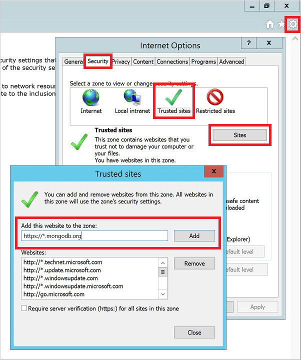
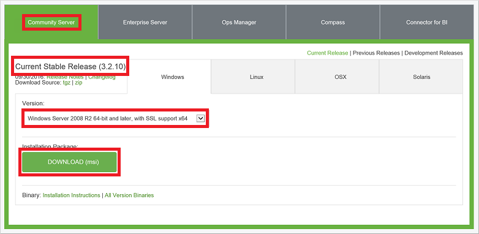
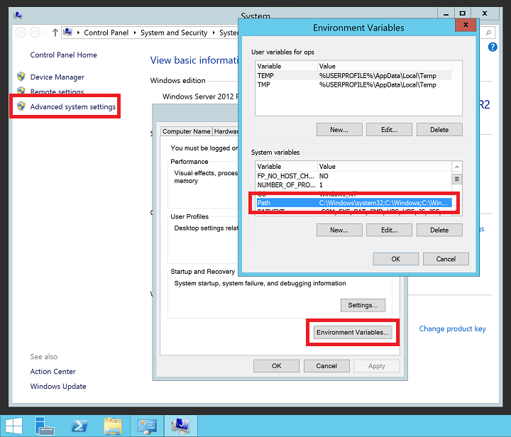

<properties
    pageTitle="Installieren Sie auf einem Windows-virtuellen Computer MongoDB | Microsoft Azure"
    description="Informationen Sie zum Installieren MongoDB einer Azure virtuellen Computers unter Windows Server 2012 R2 mit dem Ressourcenmanager Bereitstellungsmodell erstellt."
    services="virtual-machines-windows"
    documentationCenter=""
    authors="iainfoulds"
    manager="timlt"
    editor=""/>

<tags
    ms.service="virtual-machines-windows"
    ms.workload="infrastructure-services"
    ms.tgt_pltfrm="vm-windows"
    ms.devlang="na"
    ms.topic="article"
    ms.date="10/04/2016"
    ms.author="iainfou"/>

# <a name="install-and-configure-mongodb-on-a-windows-vm-in-azure"></a>Installieren und Konfigurieren von MongoDB auf einen virtuellen Computer Windows Azure
[MongoDB](http://www.mongodb.org) ist eine beliebte Source-öffnen, leistungsfähige NoSQL-Datenbank. In diesem Artikel leitet Sie durch die Installation und Konfiguration von MongoDB auf einem Windows Server 2012 R2 virtuellen Computer (virtueller Computer) in Azure. Sie können auch [eine Linux virtuellen Computers in Azure MongoDB installieren](virtual-machines-linux-install-mongodb.md).


## <a name="prerequisites"></a>Erforderliche Komponenten

Bevor Sie installieren und Konfigurieren von MongoDB, müssen Sie zum Erstellen eines virtuellen Computers, und fügen Sie einen Datenträger idealerweise hinzu. Finden Sie unter Erstellen eines virtuellen Computers, und fügen Sie einen Datenträger den folgenden Artikeln:

- [Erstellen eines Windows Server virtuellen Computers mithilfe des Azure-Portals](virtual-machines-windows-hero-tutorial.md) oder [Erstellen Sie ein Windows Server virtueller Computer mithilfe der PowerShell Azure](virtual-machines-windows-ps-create.md)
- [Fügen Sie einen Datenträger in einen Windows Server virtuellen mit Azure-Portal](virtual-machines-windows-attach-disk-portal.md) oder [Fügen Sie einen Datenträger in einen Windows Server virtuellen mit Azure PowerShell](https://msdn.microsoft.com/library/mt603673.aspx)
    
Installieren und konfigurieren MongoDB, [Melden Sie sich bei Ihrem Windows Server virtueller Computer](virtual-machines-windows-connect-logon.md) mit dem Remotedesktop beginnen soll.


## <a name="install-mongodb"></a>Installieren von MongoDB

> [AZURE.IMPORTANT] MongoDB Sicherheitsfeatures, wie z. B. Authentifizierung und IP-Adressbindung, sind standardmäßig nicht aktiviert. Sicherheitsfeatures sollten vor der Bereitstellung von MongoDB zu einer Umgebung für die Herstellung aktiviert sein. Weitere Informationen finden Sie unter [MongoDB Sicherheit und Authentifizierung](http://www.mongodb.org/display/DOCS/Security+and+Authentication).

1. Nachdem Sie mit der virtuellen Computer mithilfe von Remotedesktop verbunden haben, öffnen Sie Internet Explorer im Menü **Start** des virtuellen Computers.

2. Wählen Sie beim ersten Öffnen von Internet Explorer **verwenden empfohlen, Sicherheit, Datenschutz, und Kompatibilität Einstellungen** , und klicken Sie auf **OK**.

3. Verbesserte Sicherheit-Konfiguration von Internet Explorer ist standardmäßig aktiviert. Fügen Sie die MongoDB-Website zur Liste der zulässigen Websites hinzu:

    - Wählen Sie das Symbol **Extras** in der oberen rechten Ecke aus.
    - **Internetoptionen**wählen Sie die Registerkarte **Sicherheit** , und wählen Sie dann auf das Symbol **Vertrauenswürdige Sites** .
    - Klicken Sie auf die Schaltfläche **Sites** . Hinzufügen von _https://\*. mongodb.org_ zur Liste der vertrauenswürdigen Websites, und schließen Sie dann das Dialogfeld.

    

4. Navigieren Sie zu der Seite [MongoDB - Downloads](http://www.mongodb.org/downloads) (http://www.mongodb.org/downloads).

5. Standardmäßig sollten sie die **Community Server** -Edition und der neuesten Version der aktuellen unveränderliche für Windows Server 2008 R2 64-Bit- und höher auszuwählen. Wenn das Installationsprogramm herunterladen möchten, klicken Sie auf **herunterladen (Msi)**.

    

    Führen Sie das Installationsprogramm aus, nachdem der Download abgeschlossen ist.

6. Lesen Sie und akzeptieren Sie den Lizenzvertrag. Wenn Sie aufgefordert werden, wählen Sie die Installation **abgeschlossen** .

7. Klicken Sie auf dem Bildschirm abgeschlossen auf **Installieren**.


## <a name="configure-the-vm-and-mongodb"></a>Konfigurieren der virtuellen Computer und MongoDB

1. Path-Variablen werden durch das Installationsprogramm MongoDB nicht aktualisiert werden. Ohne die MongoDB `bin` Stelle auf Ihrer Path-Variable haben, müssen Sie den vollständigen Pfad jedes Mal angeben, Sie eine MongoDB ausführbare Datei verwenden. Um die Position der Pfad Variablen hinzuzufügen:

    - Mit der rechten Maustaste im Menüs **Start** , und wählen Sie **System**.
    - Klicken Sie auf **Erweiterte Systemeinstellungen**, und klicken Sie dann auf **Variablen Umgebung**.
    - Klicken Sie unter **Systemvariablen** **Pfad**wählen Sie aus, und klicken Sie dann auf **Bearbeiten**.

    

    Fügen Sie den Pfad zu Ihrem MongoDB `bin` Ordner. MongoDB installiert ist in der Regel `C:\Program Files\MongoDB`. Überprüfen Sie den Installationspfad Ihrer virtuellen Computers. Im folgenden Beispiel werden die Standardeinstellung MongoDB installieren Speicherort für die `PATH` Variable:

    ```
    ;C:\Program Files\MongoDB\Server\3.2\bin
    ```

    > [AZURE.NOTE] Achten Sie darauf, das vorangestellte Semikolon hinzufügen (`;`) um anzugeben, dass Sie einen Speicherort zum Hinzufügen Ihrer `PATH` Variable.

2. Erstellen Sie auf dem Datenträger Daten MongoDB Daten- und Protokolldateien Verzeichnisse durchsuchen. Wählen Sie im Menü **Start** **Eingabeaufforderungsfenster**. Erstellen Sie in den folgenden Beispielen Verzeichnisse auf Laufwerk F:

    ```
    mkdir F:\MongoData
    mkdir F:\MongoLogs
    ```

3. Starten Sie eine Instanz MongoDB mit den folgenden Befehl aus, den Pfad für Ihre Daten anpassen, und melden Sie sich entsprechend Verzeichnisse durchsuchen:

    ```
    mongod --dbpath F:\MongoData\ --logpath F:\MongoLogs\mongolog.log
    ```

    Es kann mehrere Minuten dauern MongoDB reservieren die Journaldateien, und beginnen, warten auf Verbindungen. Alle Lognachrichten werden in der Datei *F:\MongoLogs\mongolog.log* als geleitet `mongod.exe` Server startet und reserviert Journaldateien.

    > [AZURE.NOTE] Der Eingabeaufforderung bleibt auf diese Aufgabe den Fokus besitzt, während Ihr MongoDB Instanz ausgeführt wird. Lassen Sie das Eingabeaufforderungsfenster geöffnet weiterhin MongoDB ausführen. Oder MongoDB als Dienst, wie im nächsten Schritt ausführlich installieren.

4. Installieren Sie mehr robuste MongoDB nutzen zu können, die `mongod.exe` als Dienst. Erstellen eines Diensts bedeutet, dass Sie nicht jedes Mal MongoDB verwenden möchten ausgeführte Befehlszeile verlassen müssen. Erstellen Sie den Dienst, den Pfad für Ihre Daten und der Protokolldateien Verzeichnisse entsprechend anpassen:

    ```
    mongod --dbpath F:\MongoData\ --logpath F:\MongoLogs\mongolog.log `
        --logappend  --install
    ```

    Dieser Befehl erstellt einen Dienst namens MongoDB, mit einer Beschreibung der "Mongo DB". Die folgenden Parameter werden auch angegeben:

    - Die `--dbpath` Option gibt den Speicherort der Datenverzeichnis.
    - Die `--logpath` Option muss eine Protokolldatei angeben verwendet werden, da der laufende Dienst keinen im Befehlsfenster Ausgabe angezeigt.
    - Die `--logappend` Option gibt an, dass ein Neustart des Diensts bewirkt, dass die Ausgabe, um die vorhandene Protokolldatei angefügt werden soll.

  Um den MongoDB-Dienst starten möchten, führen Sie den folgenden Befehl aus:

    ```
    net start MongoDB
    ```

    Weitere Informationen zum Erstellen von MongoDB Dienst finden Sie unter [Konfigurieren von Windows-Dienst für MongoDB](https://docs.mongodb.com/manual/tutorial/install-mongodb-on-windows/#mongodb-as-a-windows-service).

## <a name="test-the-mongodb-instance"></a>Testen der MongoDB Instanz

Mit MongoDB als einzelne Instanz ausgeführt oder als Dienst installiert haben können Sie jetzt erstellen und Verwenden von Ihrer Datenbanken starten. Um die administrative MongoDB-Verwaltungsshell beginnen möchten, öffnen Sie ein anderes Eingabeaufforderungsfenster aus dem Menü **Start** , und geben Sie den folgenden Befehl aus:

```
mongo  
```

Sie können die Datenbanken mit Liste der `db` Befehl. Fügen Sie die Daten wie folgt:

```
db.foo.insert( { a : 1 } )
```

Suchen Sie nach Daten wie folgt aus:

```
db.foo.find()
```

Die Ausgabe ist ähnlich wie im folgenden Beispiel:

```
{ "_id" : "ObjectId("57f6a86cee873a6232d74842"), "a" : 1 }
```

Beenden der `mongo` Konsole wie folgt:

```
exit
```

## <a name="configure-firewall-and-network-security-group-rules"></a>Konfigurieren der Firewall und Netzwerk-Sicherheitsgruppe Regeln
Nun MongoDB installiert und ausgeführt wird, öffnen Sie einen Port in Windows-Firewall, damit Sie per Remotezugriff auf MongoDB zugreifen können. Zum Erstellen einer neuen Regel auf eingehenden TCP-27017 zulässig öffnen Sie einer administrativen PowerShell-Eingabeaufforderung zu, und geben Sie den folgenden Befehl aus:

```powerShell
New-NetFirewallRule -DisplayName "Allow MongoDB" -Direction Inbound `
    -Protocol TCP -LocalPort 27017 -Action Allow
```

Sie können die Regel auch mithilfe des **Windows-Firewall mit erweiterter Sicherheit** grafisch Verwaltungstools erstellen. Erstellen einer neuen Regel auf eingehenden TCP-27017 zulässig.

Falls erforderlich, erstellen Sie eine Regel Netzwerk-Sicherheitsgruppe Zugriff auf MongoDB von außerhalb der vorhandenen Subnetz Azure virtuelles Netzwerk zulassen. Sie können die Netzwerk-Sicherheitsgruppe Regeln mithilfe der [Azure-Portal](virtual-machines-windows-nsg-quickstart-portal.md) oder [Azure PowerShell](virtual-machines-windows-nsg-quickstart-powershell.md)erstellen. Wie bei der Windows-Firewall Regeln zulassen Sie TCP-27017 auf die Netzwerkschnittstelle virtuelle, der Ihre MongoDB VM

> [AZURE.NOTE] TCP-27017 ist der Standardport von MongoDB verwendet. Sie können diesen Anschluss ändern, indem Sie mit der `--port` Parameter beim Starten von `mongod.exe` manuell oder aus einem Dienst. Wenn Sie den Port ändern, stellen Sie sicher, aktualisieren Sie die Windows-Firewall und Netzwerk-Sicherheitsgruppe Regeln in den vorherigen Schritten.


## <a name="next-steps"></a>Nächste Schritte
In diesem Lernprogramm haben Sie wie installieren und Konfigurieren von MongoDB auf Ihrem Windows-virtuellen Computer an. Sie können jetzt MongoDB auf Ihrem Windows virtuellen Computer zugreifen, indem Sie die folgenden erweiterten Themen in der [Dokumentation MongoDB](https://docs.mongodb.com/manual/).
