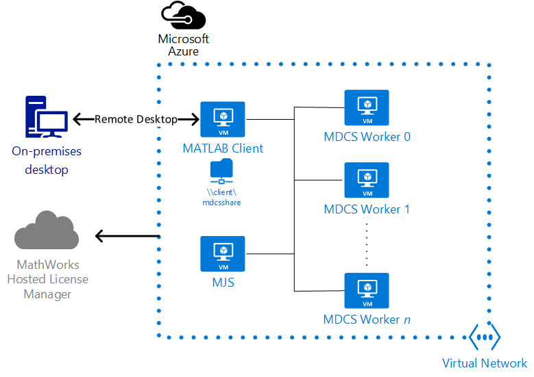
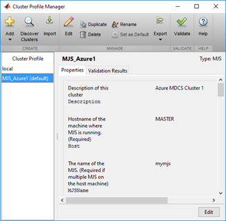

<properties
   pageTitle="MATLAB Cluster auf virtuellen Computern | Microsoft Azure"
   description="Verwenden Sie Microsoft Azure-virtuellen Computern MATLAB verteilt Computing Servercluster zum Ausführen Ihrer rechenintensiven parallele MATLAB Auslastung erstellen"
   services="virtual-machines-windows"
   documentationCenter=""
   authors="mscurrell"
   manager="timlt"
   editor=""/>

<tags
   ms.service="virtual-machines-windows"
   ms.devlang="na"
   ms.topic="article"
   ms.tgt_pltfrm="Windows"
   ms.workload="infrastructure-services"
   ms.date="05/09/2016"
   ms.author="markscu"/>

# Erstellen von MATLAB Distributed Computing Server Cluster auf Azure-virtuellen Computern 

Verwenden Sie Microsoft Azure-virtuellen Computern, um einen oder mehrere MATLAB verteilt Computing Servercluster zum Ausführen Ihrer rechenintensiven parallele MATLAB Auslastung zu erstellen. Installieren Sie die Software MATLAB Distributed Computing Server eines virtuellen Computers zu einer Vorlage Azure Schnellstart oder Azure-PowerShell-Skript (verfügbar auf [GitHub](https://github.com/Azure/azure-quickstart-templates/tree/master/matlab-cluster)) als Basis Bild verwenden und zum Bereitstellen und Verwalten von Cluster aus. Verbinden Sie nach der Bereitstellung mit dem Cluster Ihrer Auslastung ausführen. 

## Informationen zu MATLAB und MATLAB Distributed Computing Server 

Die [MATLAB](http://www.mathworks.com/products/matlab/) -Plattform ist zum Lösen von Problemen mit engineering und wissenschaftliche optimiert. MATLAB Benutzer mit umfangreichen Simulationen und Datenverarbeitung Aufgaben können MathWorks Parallel computing Produkte, deren Auslastung berechnen ankommt beschleunigen, indem Computecluster und Raster Dienste nutzen. [Parallele Computing Toolbox](http://www.mathworks.com/products/parallel-computing/) können MATLAB Benutzer Parallelisieren von Applications nutzen GPUs, Multi-Core-Prozessoren und Cluster zu berechnen. [MATLAB Distributed Computing Server](http://www.mathworks.com/products/distriben/) können MATLAB Benutzer viele Computer in einem berechnungscluster nutzen. 

Mithilfe von Azure-virtuellen Computern können Sie MATLAB Distributed Computing Server Cluster erstellen, die alle dieselbe Verfahren zur Verfügung, und übermitteln Sie parallelen Arbeit als lokalen Cluster, wie z. B. interaktive Aufträge, Stapelverarbeitung, unabhängige Aufgaben und Vorgänge kommunizieren aufweisen. Mithilfe von Azure in Verbindung mit der MATLAB-Plattform weist viele Vorteile im Vergleich zu bereitgestellt und mit herkömmlichen lokalen Hardware: ein Bereich des virtuellen Computers Größen, Entstehung Cluster bei Bedarf, damit Sie nur für die Ressourcen berechnen Sie verwenden, und die Möglichkeit zum Testen von Datenmodellen bei bezahlen.  

## Erforderliche Komponenten

* **Clientcomputer** - Sie benötigen einen Windows-basierten Clientcomputer zur Kommunikation mit Azure und MATLAB Distributed Computing Server Cluster nach der Bereitstellung. 

* **Azure PowerShell** - finden Sie unter [Informationen zum Installieren und konfigurieren Azure PowerShell](../powershell-install-configure.md) zur Installation auf dem Clientcomputer. 

* **Azure-Abonnement** – Wenn Sie ein Abonnement besitzen, können Sie ein [Konto frei](https://azure.microsoft.com/free/) in nur ein paar Minuten erstellen. Erwägen Sie für größere Cluster ein Abonnement je nach Bedarf berechnet oder andere Kaufoptionen aus. 

* **Kerne Kontingent** - möglicherweise müssen Sie das Kontingent Core, um eine große Cluster oder mehrere MATLAB Distributed Computing Server Cluster bereitstellen zu erhöhen. Um ein Kontingent, [Öffnen Sie eine Supportanfrage online Kunden](https://azure.microsoft.com/blog/2014/06/04/azure-limits-quotas-increase-requests/) kostenlos zu erhöhen. 

* **MATLAB, Parallel Computing Toolbox und MATLAB Distributed Computing Server Lizenzen** - die Skripts wird davon ausgegangen, dass die [MathWorks gehostet Lizenz-Manager](http://www.mathworks.com/products/parallel-computing/mathworks-hosted-license-manager/) für alle Lizenzen verwendet wird.  

* **MATLAB Distributed Computing Server-Software** - installiert werden auf einen virtuellen Computer, die als Basis virtueller Computer-Image für den Cluster virtuellen Computern verwendet werden soll. 

## High-Level-Schritte

Um Azure-virtuellen Computern für Ihre Cluster MATLAB Distributed Computing Server verwenden, sind die folgenden allgemeinen Schritte erforderlich. Wenn Sie ausführliche Anweisungen sind in der Dokumentation öffentlichem die Schnellstart-Vorlage und Skripts auf [GitHub](https://github.com/Azure/azure-quickstart-templates/tree/master/matlab-cluster).

1. **Erstellen einer Basis virtueller Computer-image**  
    * Herunterladen Sie und installieren Sie MATLAB Distributed Computing Server-Software auf diesem virtuellen Computer. 

    >[AZURE.NOTE]Dieser Vorgang kann ein paar Stunden dauern, aber nur nachdem verwenden Sie für jede Version von MATLAB erledigen müssen.   
    
2. **Erstellen Sie einen oder mehrere Cluster**  
    * Verwenden Sie die bereitgestellten PowerShell Skripts oder mit der Schnellstart-Vorlage können Sie um einen Cluster aus dem Basis virtueller Computer Bild zu erstellen.   
    * Die Verwaltung der Cluster mit dem bereitgestellten PowerShell-Skript, wodurch Sie Liste, anzuhalten, fortzusetzen und Cluster löschen. 
 
## Cluster-Konfigurationen 

Aktuell, aktivieren mit die Cluster Erstellungsskript und die Vorlage eines einzelnen MATLAB Distributed Computing Server Suchtopologie erstellen. Wenn Sie möchten, erstellen Sie weitere Cluster mit jeder Cluster müssen dieselbe Anzahl von Worker virtuellen Computern, die mit anderen virtuellen Computer an Papiergrößen, usw. 

### MATLAB Client und Cluster in Azure 

MATLAB-Client-Knoten, MATLAB Job Scheduler Knoten und MATLAB Distributed Computing Server "Worker" Knoten werden alle als Azure-virtuellen Computern in einem Netzwerk virtuelle konfiguriert wie in der folgenden Abbildung gezeigt. 

* Wenn den Cluster verwenden möchten, Herstellen einer Verbindung Client-Knotens mit Remotedesktop. Client-Knotens wird den MATLAB-Client ausgeführt. 

* Client-Knotens verfügt über eine Dateifreigabe, die von allen Arbeitskräften zugegriffen werden kann.

* MathWorks gehostet License Manager wird für die Lizenz Prüfungen für alle MATLAB Software verwendet. 

* Standardmäßig eine MATLAB Distributed Computing Server Worker pro Core auf der Worker virtuellen Computern erstellt, aber Sie können beliebig viele angeben. 

## Verwenden eines Azure-basierten Clusters 

Als müssen mit anderen Arten von MATLAB Distributed Computing Server Cluster, Sie Cluster-Profil-Manager im Client MATLAB (auf dem Client virtueller Computer) verwenden, um ein MATLAB Job Scheduler Cluster Profil zu erstellen.

## Nächste Schritte

* Weitere Informationen zum Bereitstellen und Verwalten von MATLAB Distributed Computing Server Cluster in Azure finden Sie unter [GitHub](https://github.com/Azure/azure-quickstart-templates/tree/master/matlab-cluster) Repository, enthält die Vorlagen und Skripts. 

* Wechseln Sie zu der [Website MathWorks](http://www.mathworks.com/) eine ausführliche Dokumentation für MATLAB und MATLAB Distributed Computing Server.
