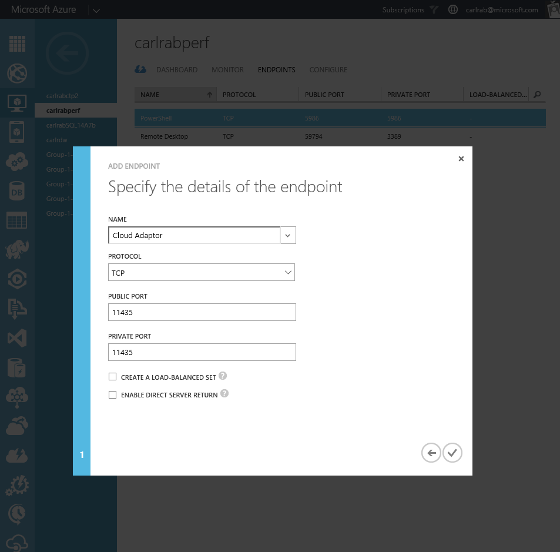
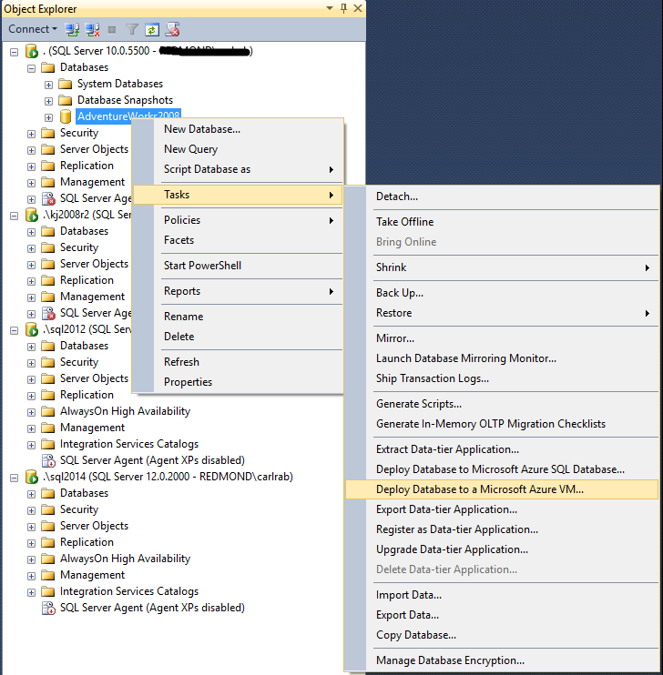
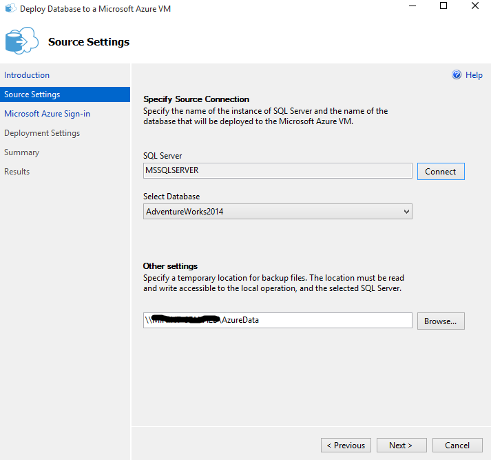
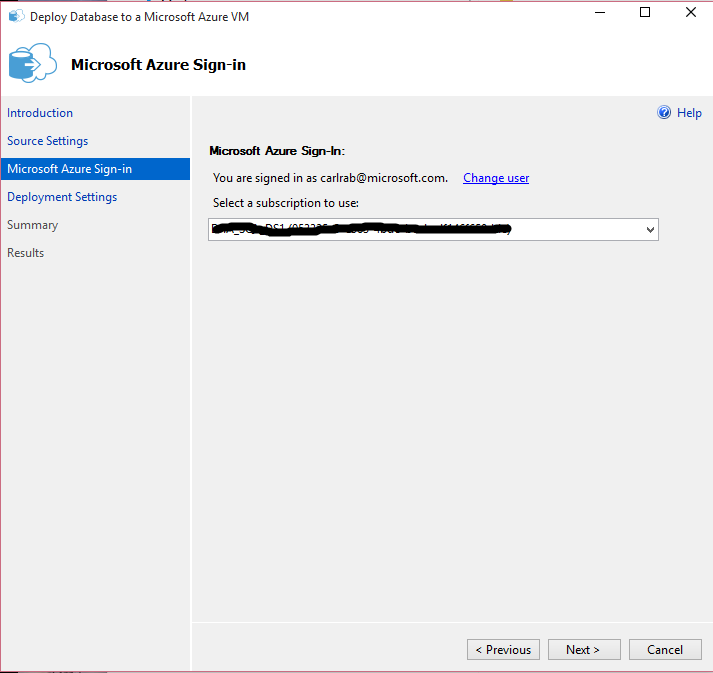
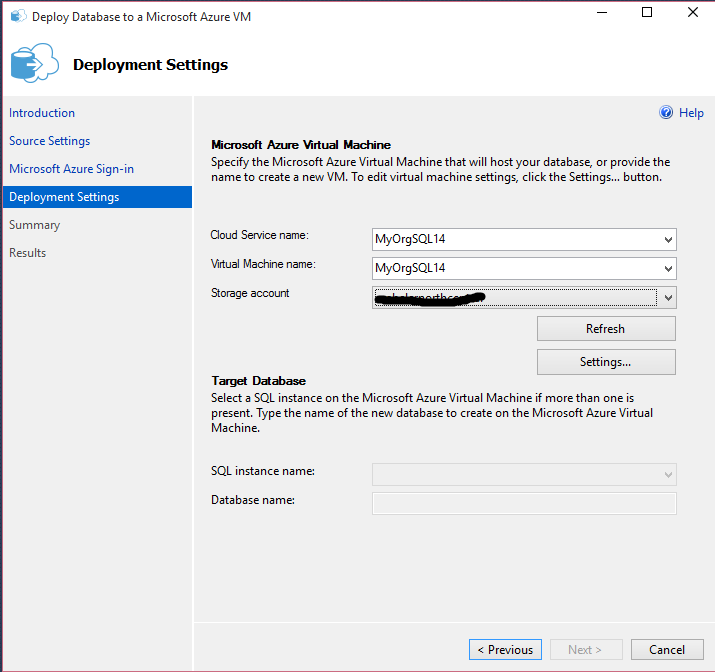
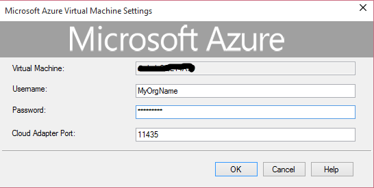
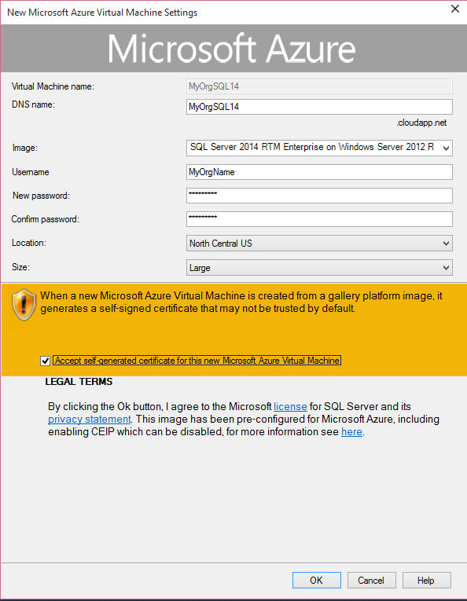
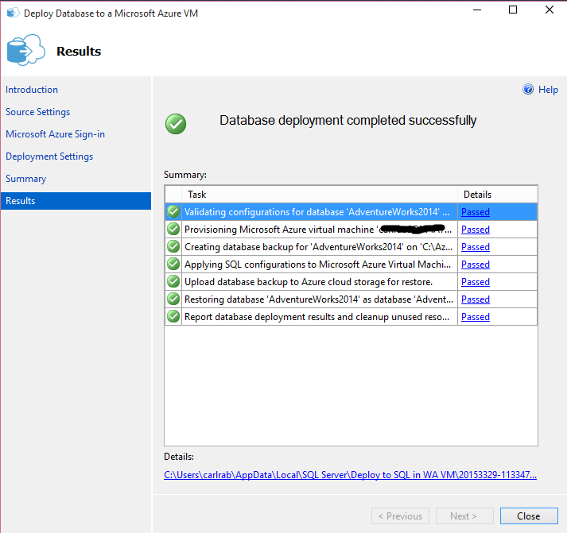

<properties
    pageTitle="Migrieren eine SQL Server-Datenbank mit SQL Server auf einen virtuellen | Microsoft Azure"
    description="Informationen Sie zum Migrieren von einer lokalen Benutzer-Datenbank mit SQL Server in einer Azure-virtuellen Computern."
    services="virtual-machines-windows"
    documentationCenter=""
    authors="sabotta"
    manager="jhubbard"
    editor=""
    tags="azure-service-management" />
<tags
    ms.service="virtual-machines-windows"
    ms.workload="infrastructure-services"
    ms.tgt_pltfrm="vm-windows-sql-server"
    ms.devlang="na"
    ms.topic="article"
    ms.date="09/26/2016"
    ms.author="carlasab"/>

# Migrieren einer SQL Server-Datenbank mit SQL Server auf eine Azure-virtuellen Computer

[AZURE.INCLUDE [learn-about-deployment-models](../../includes/learn-about-deployment-models-both-include.md)]Ressourcenmanager Modell.

Es gibt eine Reihe von Methoden für die Migration von einer lokalen SQL Server-Benutzer-Datenbank in SQL Server auf eine Azure-virtuellen Computer an. In diesem Artikel wird kurz erläutern verschiedenen Methoden, empfiehlt sich die beste Methode für verschiedene Szenarien und enthalten ein [Lernprogramm](#azure-vm-deployment-wizard-tutorial) , um Sie durch die Verwendung von Assistenten **Bereitstellen einer SQL Server-Datenbank zu eines Microsoft Azure-virtuellen Computers** zu begleiten. 

Die Methode, mit dem **Bereitstellen einer SQL Server-Datenbank zu eines Microsoft Azure-virtuellen Computers** -Assistenten in das [Lernprogramm](#azure-vm-deployment-wizard-tutorial) beschriebenen wendet nur klassische Bereitstellungsmodell aus. 

## Was sind die primäre Migrationsmethoden?

Die primäre Migrationsmethoden sind:

- Das Bereitstellen einer SQL Server-Datenbank zu einer Microsoft Azure-virtuellen Computer-Assistenten verwenden
- Führen Sie auf eine lokale Sicherung Komprimierung und kopieren Sie die Sicherungsdatei manuell in der Azure-virtuellen Computern
- Führen Sie eine Sicherung URL und Wiederherstellen in der Azure-virtuellen Computern aus der URL
- Trennen Daten-und Protokoll zu Azure Blob-Speicher kopieren, und klicken Sie dann über eine Verbindung mit SQL Server auf virtuellen Azure-Computer URL
- Lokalen physischen Computer in Hyper-V virtuelle Festplatte konvertieren, Hochladen in Azure Blob-Speicher und dann bereitstellen als neue virtueller Computer mit virtuelle Festplatte hochgeladen werden.
- Lieferort den Festplatte mithilfe der Windows-Import/Export-Dienst
- Wenn Sie eine Bereitstellung AlwaysOn lokal verwenden beim Erstellen eines Replikats Azure und dann Failover, zeigen Benutzer zur Azure-Datenbankinstanz [Azure-Assistent hinzufügen](virtual-machines-windows-classic-sql-onprem-availability.md)
- Verwenden von SQL Server- [Transaktionsreplikation](https://msdn.microsoft.com/library/ms151176.aspx) Azure SQL Server-Instanz als Abonnent konfigurieren, und deaktivieren anschließend die Replikation, die Benutzer auf die Azure-Datenbank-Instanz zeigen

## Auswählen der Migrationsmethode

Für optimale Leistung durchstellen ist Migration von Datenbankdateien in den Azure virtuellen Computer verwenden eine komprimierte Sicherungsdatei im Allgemeinen die beste Methode aus. Dies ist die Methode, die das [Bereitstellen einer SQL Server-Datenbank zu einer Microsoft Azure-virtuellen Computer-Assistenten](#azure-vm-deployment-wizard-tutorial) verwendet. Mit diesem Assistenten wird das empfohlene Verfahren zum Migrieren einer lokalen Benutzer Datenbank Ausführung auf SQL Server 2005 oder höher verwenden, um den SQL Server-2014 oder größer, wenn die Sicherungsdatei komprimierte Datenbank weniger als 1 TB ist.

Um Ausfallzeiten während des Migrationsvorgangs Datenbank zu minimieren, verwenden Sie entweder die Option AlwaysOn oder Transaktionsreplikation aus.

Ist es nicht möglich, die oben genannten Methoden verwenden, können Sie die Datenbank manuell. Bei dieser Methode können Sie in der Regel beginnt mit einer Sicherungskopie der Datenbank gefolgt von einer Kopie der Datenbank sichern in Azure, und führen Sie dann eine Datenbank wiederherstellen. Sie können auch die Datenbankdateien selbst in Azure kopieren und fügen Sie diese. Vorhanden verschiedener Methoden, an denen Sie dieses manuelle Verfahren zum Migrieren einer Datenbank in einer Azure-virtuellen Computer ausführen können.

> [AZURE.NOTE] Wenn Sie SQL Server 2014 oder SQL Server 2016 von älteren Versionen von SQL Server aktualisieren, sollten Sie, ob Änderungen erforderlich sind. Es empfiehlt sich, Sie alle Abhängigkeiten von Features, die nicht als Teil Ihres Migrationsprojekts von der neuen Version von SQL Server unterstützt. Weitere Informationen zu den unterstützten Editionen und Szenarien finden Sie unter [Upgrade auf SQL Server](https://msdn.microsoft.com/library/bb677622.aspx).

In der folgenden Tabelle Listen der primären Migration Methoden und erläutert, wann die Verwendung der einzelnen Methoden am besten geeignet ist.

| Methode  | Version der Quelldatenbank  |  Version der Zieldatenbank | Quelle Datenbank Sicherung Größe Einschränkung  | Notizen  |
|---|---|---|---|---|
| [Das Bereitstellen einer SQL Server-Datenbank zu einer Microsoft Azure-virtuellen Computer-Assistenten verwenden](#azure-vm-deployment-wizard-tutorial) | SQLServer 2005 oder höher | SQLServer 2014 oder höher | < 1 TB  | Schnellste und einfachste Methode, verwenden Sie nach Möglichkeit zum Migrieren zu einer neuen oder vorhandenen SQL Server-Instanz in einer Azure-virtuellen Computern | 
| [Verwenden der Azure-Assistent hinzufügen](virtual-machines-windows-classic-sql-onprem-availability.md) | SQLServer 2012 oder höher | SQLServer 2012 oder höher | [Azure-virtuellen Computer Speichergrenzwerte für](https://azure.microsoft.com/documentation/articles/azure-subscription-service-limits/) | Minimiert Ausfallzeiten Verwendung bei eine lokalen Bereitstellung von AlwaysOn. |
| [Verwenden von SQL Server-Transaktionen Replikation](https://msdn.microsoft.com/library/ms151176.aspx) | SQLServer 2005 oder höher | SQLServer 2005 oder höher | [Azure-virtuellen Computer Speichergrenzwerte für](https://azure.microsoft.com/documentation/articles/azure-subscription-service-limits/) | Verwenden Sie, wenn Sie Ausfallzeiten minimieren müssen und verfügen nicht über eine AlwaysOn lokalen Bereitstellung |
| [Führen Sie auf eine lokale Sicherung Komprimierung und kopieren Sie die Sicherungsdatei manuell in der Azure-virtuellen Computern](#backup-to-file-and-copy-to-vm-and-restore) | SQLServer 2005 oder höher | SQLServer 2005 oder höher | [Azure-virtuellen Computer Speichergrenzwerte für](https://azure.microsoft.com/documentation/articles/azure-subscription-service-limits/) | Verwenden Sie nur beim können keine Assistenten, z. B. wenn die Version der Zieldatenbank kleiner als SQL Server 2012 SP1 CU2 ist oder die Sicherung Datenbankgröße ist größer als 1 TB (12,8 TB mit SQL Server 2016) |
| [Führen Sie eine Sicherung URL und Wiederherstellen in der Azure-virtuellen Computern aus der URL](#backup-to-url-and-restore) | CU2 für SQL Server 2012 SP1 oder höher | CU2 für SQL Server 2012 SP1 oder höher | < 12,8 TB für SQL Server 2016, andernfalls < 1 TB | Im Allgemeinen mit [Sicherung-URL](https://msdn.microsoft.com/library/dn435916.aspx) ist in der Leistung bei der Verwendung des Assistenten entspricht und nicht ganz einfach |
| [Trennen Daten-und Protokoll zu Azure Blob-Speicher kopieren, und klicken Sie dann über eine Verbindung mit SQL Server in Azure-virtuellen Computern URL](#detach-and-copy-to-url-and-attach-from-url) | SQLServer 2005 oder höher | SQLServer 2014 oder höher | [Azure-virtuellen Computer Speichergrenzwerte für](https://azure.microsoft.com/documentation/articles/azure-subscription-service-limits/) | Verwenden Sie diese Methode, wenn Sie, [diese Dateien mithilfe des Diensts für Azure Blob-Speicher zu speichern planen](https://msdn.microsoft.com/library/dn385720.aspx) , und verbinden Sie sie mit SQL Server ausgeführt wird, eine Azure-virtuellen Computer, insbesondere mit sehr großen Datenbanken |
| [Lokalen Computer in Hyper-V virtuelle Festplatten konvertieren, auf Azure Blob-Speicher hochladen und dann Bereitstellen eines neuen virtuellen Computers mit hochgeladene virtuelle Festplatte](#convert-to-vm-and-upload-to-url-and-deploy-as-new-vm) | SQLServer 2005 oder höher | SQLServer 2005 oder höher | [Azure-virtuellen Computer Speichergrenzwerte für](https://azure.microsoft.com/documentation/articles/azure-subscription-service-limits/) | Verwenden, wenn als Teil der Migration der Datenbank hängt von den anderen Benutzerdatenbanken und/oder Systemdatenbanken zusammen [Onlineschalten eigene SQL Server-Lizenz](../sql-database/sql-database-paas-vs-sql-server-iaas.md), wenn Sie eine Datenbank migrieren, die Sie auf einer älteren Version von SQL Server oder ausgeführt werden, wenn System und Benutzer migrieren Datenbanken. |
| [Lieferort den Festplatte mithilfe der Windows-Import/Export-Dienst](#ship-hard-drive) | SQLServer 2005 oder höher | SQLServer 2005 oder höher | [Azure-virtuellen Computer Speichergrenzwerte für](https://azure.microsoft.com/documentation/articles/azure-subscription-service-limits/) | Verwenden Sie den [Windows-Import/Export-Dienst](../storage/storage-import-export-service.md) beim manuellen Kopiermethode zu langsam, z. B. mit sehr großen Datenbanken ist |

## Azure virtueller Computer Bereitstellung-Assistent-Lernprogramm

Mithilfe des Assistenten **Bereitstellen einer SQL Server-Datenbank zu eines Microsoft Azure-virtuellen Computers** in Microsoft SQL Server Management Studio Migrieren einer SQL Server 2005, SQL Server 2008, SQL Server 2008 R2, SQL Server 2012, SQL Server 2014 oder SQL Server 2016 lokale Benutzer Database-(bis zu 1 TB) SQL Server 2014 oder SQL Server 2016 in einer Azure-virtuellen Computern. Verwenden Sie diesen Assistenten eine Benutzerdatenbank zu einer vorhandenen Azure-virtuellen Computern oder in einer Azure virtueller Computer mit SQL Server während der Migration vom Assistenten erstellte migrieren. Wenn Sie auf eine neuere Version von SQL Server eine Datenbank migrieren, wird die Datenbank während des Prozesses automatisch aktualisiert.

Die Methode wendet nur klassische Bereitstellungsmodell aus. 

### Neueste Version von der Bereitstellen einer SQL Server-Datenbank auf einen Assistenten Microsoft Azure-virtuellen Computer herunterladen.

Verwenden Sie die neueste Version von Microsoft SQL Server Management Studio für SQL Server, um sicherzustellen, dass Sie die neueste Version des Assistenten **Bereitstellen einer SQL Server-Datenbank zu eines Microsoft Azure-virtuellen Computers** haben. Die neueste Version von diesem Assistenten übernimmt die neuesten Updates zum klassischen Azure-Portal und unterstützt die neueste Azure-virtuellen Computer Bilder in der Galerie (ältere Versionen des Assistenten möglicherweise nicht funktionieren). Abrufen der neuesten Version von Microsoft SQL Server Management Studio für SQL Server, [herunterladen](http://go.microsoft.com/fwlink/?LinkId=616025) und installieren es auf einem Clientcomputer mit der Verbindung zu der Datenbank, die Sie migrieren und mit dem Internet planen.

### Konfigurieren Sie die vorhandenen Azure-virtuellen Computern und SQL Server-Instanz (falls zutreffend)

Wenn Sie zu einer vorhandenen Azure-virtuellen Computer migrieren, sind die folgenden Konfigurationsschritte erforderlich:

- Konfigurieren Sie den Azure-virtuellen Computer und SQL Server-Instanz, um die Verbindung aus einem anderen Computer aktivieren, indem Sie die Schritte zum [Verbinden mit der SQL Server virtueller Computer Instanz von SSMS auf einem anderen Computer](virtual-machines-windows-sql-connect.md)an. Nur die SQL Server-2014 und SQL Server 2016 Bilder im Katalog werden unterstützt, wenn Sie mit dem Assistenten zum Migrieren.
- Konfigurieren eines geöffneten Endpunkts für den Dienst SQL Server Cloud Netzwerkadapter auf dem Gateway Microsoft Azure mit privaten 11435-Port an. Dieser Port wird als Teil der Bereitstellung von SQL Server 2014 oder SQL Server 2016 eines Microsoft Azure-virtuellen Computers erstellt. Die Cloud Netzwerkadapter wird auch eine Regel Windows-Firewall zulassen eingehenden TCP-Verbindungen am Standardport 11435 erstellt. Diesen Endpunkt kann der Assistent nutzen den Cloud Netzwerkadapter-Dienst, um die Sicherungsdateien aus der lokalen Instanz in den Azure-virtuellen Computer zu kopieren. Weitere Informationen finden Sie in der [Cloud Netzwerkadapter für SQL Server](https://msdn.microsoft.com/library/dn169301.aspx).

    

### Führen Sie der Verwendung der Bereitstellen einer SQL Server-Datenbank eines Microsoft Azure-virtuellen Computer-Assistenten

1. Öffnen Sie Microsoft SQL Server Management Studio für Microsoft SQL Server 2016 und Herstellen einer Verbindung mit der Datenbank, die Sie zu einer Azure-virtuellen Computer migriert SQL Server-Instanz mit.
2. Mit der rechten Maustaste in der Datenbank, die Sie migrieren, zeigen Sie auf Aufgaben, und klicken Sie dann auf bereitstellen zu eines Microsoft Azure-virtuellen Computers.

    

3. Klicken Sie auf der Begrüßungsseite auf Weiter.
4. Verbinden Sie auf der Einstellungsseite Quelle mit SQL Server-Instanz, enthält die Datenbank, die Sie zum Migrieren zu einer Azure-virtuellen Computer abgelegt werden.
5. Geben Sie einen temporären Speicherort für die Sicherungsdateien an. Wenn die Verbindung zu einem Remoteserver herstellen können, müssen Sie auf einem Netzlaufwerk angeben.

    

6. Klicken Sie auf Weiter.
7. Klicken Sie auf der Microsoft Azure-Anmeldeseite klicken Sie auf anmelden, und melden Sie sich bei Ihrem Konto Azure.
8. Wählen Sie das Abonnement, das Sie verwenden möchten, verwenden, und klicken Sie auf Weiter.

    

9. Klicken Sie auf der Einstellungsseite Bereitstellung können Sie angeben, einen neuen oder einem vorhandenen Cloud-Dienst und einen Namen virtuellen Computern:

 - Geben Sie einen neuen Namen für Cloud-Dienst und virtuellen Computern Namen zum Erstellen einer neuen Cloud-Dienst mit einer neuen Azure-virtuellen Computern mit einem SQL Server 2014 oder SQL Server 2016 Katalog Image ein.

     - Wenn Sie einen neuen Namen für die Cloud-Dienst angeben möchten, geben Sie das Speicherkonto, das Sie verwenden möchten.

     - Wenn Sie den Namen einer vorhandenen Cloud-Dienst angeben, wird das Speicherkonto abgerufen und für Sie eingegeben.

 - Geben Sie einen vorhandenen Cloud-Dienst und neuen virtuellen Computernamen zum Erstellen einer neuen Azure-virtuellen Computern in einer vorhandenen Cloud-Dienst an. Geben Sie ein Bild mit SQL Server 2014 oder SQL Server 2016 Katalog nur an.
 - Geben Sie eine vorhandene Cloud-Dienst Namen und Name des virtuellen Computers zu einer vorhandenen Azure-virtuellen Computern verwenden. Dabei muss es sich um ein Bild mit einer SQL Server-2014 oder SQL Server 2016 Katalog Bild erstellt.

        

10. Klicken Sie auf Einstellungen
  - Wenn Sie einer vorhandenen Cloud-Dienst Namen und der Name des virtuellen Computers angegeben haben, werden Sie aufgefordert, den Benutzernamen und das Kennwort bereitzustellen.

        

    - Wenn Sie einen neuen Namen für die virtuellen Computern angegeben haben, werden Sie aufgefordert, wählen Sie ein Bild aus der Liste der Gallery-Bilder, und geben Sie die folgende Informationen:
      - Abbildung des – wählen Sie nur für SQL Server 2014 oder SQL Server 2016
        - Benutzername
        - Neues Kennwort
        - Kennwort bestätigen
        - Speicherort
        - Größe.
    - Darüber hinaus klicken Sie, um die automatisch generiertes Zertifikat für diese neue Microsoft Azure virtuellen Computern akzeptieren, und klicken Sie dann auf OK.

    

11. Geben Sie den Namen der Ziel-Datenbank aus, wenn der Name der Quelldatenbank abweicht. Wenn die Zieldatenbank bereits vorhanden ist, wird das System automatisch erhöht den Datenbanknamen anstatt vorhandene Datenbank überschreiben.
12. Klicken Sie auf Weiter, und klicken Sie dann auf Fertig stellen.

    

13. Wenn Sie den Assistenten zu schließen, Herstellen einer Verbindung Ihres virtuellen Computers mit, und stellen Sie sicher, dass die Datenbank migriert wurde.
14. Wenn Sie einen neuen virtuellen Computer erstellt haben, konfigurieren Sie die Azure-virtuellen Computern und SQL Server-Instanz anhand der Schritte zum [Verbinden mit der SQL Server virtueller Computer Instanz von SSMS auf einem anderen Computer](virtual-machines-windows-sql-connect.md).

## Sicherung auf Datei und Kopieren in die virtuellen Computer und Wiederherstellen

Verwenden Sie diese Methode, wenn Sie nicht das Bereitstellen einer SQL Server-Datenbank zu einer Microsoft Azure-virtuellen Computer-Assistenten verwenden können, entweder, weil Sie auf eine Version von SQL Server vor SQL Server 2014 migrieren oder die Sicherungsdatei größer als 1 TB ist. Wenn die Sicherungsdatei größer als 1 TB ist, müssen Sie es versehen, da die maximale Größe eines Datenträgers virtueller Computer 1 TB groß ist. Verwenden Sie die folgenden allgemeinen Schritte zum Migrieren einer Benutzerdatenbank mit dieser manuellen Methode:

1.  Führen Sie eine vollständige Sicherung auf einem lokalen Speicherort.
2.  Erstellen oder Hochladen eines virtuellen Computers mit der Version von SQL Server gewünscht.
3.  Setup-Konnektivität, die Ihren Anforderungen entsprechend. Finden Sie unter [Verbinden mit einer SQL Server virtuellen Computern auf Azure (Ressourcen-Manager)](virtual-machines-windows-sql-connect.md).
4.  Kopieren Sie Ihre Sicherungsdateien in Ihrer virtuellen Computer über remote Desktop, Windows Explorer oder des Befehls Kopieren von einer Befehlszeile aus.

## Sicherung URL und Wiederherstellen

Verwenden Sie die [URL Sicherung](https://msdn.microsoft.com/library/dn435916.aspx) Methode, wenn Sie das Bereitstellen einer SQL Server-Datenbank zu einer Microsoft Azure-virtuellen Computer-Assistenten verwenden können, da die Sicherungsdatei größer als 1 TB ist und Sie von und bis SQL Server 2016 migrieren. Kleiner als 1 TB oder eine Version von SQL Server vor 2016 für SQL Server-Datenbanken empfehlen Verwenden des Assistenten. Mit SQL Server 2016 sind aufgeteilten Sätze Sicherung unterstützt werden, für Leistung empfohlen und erforderlich, um die Größengrenzwerte pro Blob nicht überschreiten. Für sehr große Datenbanken empfiehlt sich die Verwendung des [Windows-Import/Export-Dienst](../storage/storage-import-export-service.md) .

## Trennen-URL kopieren und Anfügen von URL

Verwenden Sie diese Methode, wenn Sie, [diese Dateien mithilfe des Diensts für Azure Blob-Speicher zu speichern planen](https://msdn.microsoft.com/library/dn385720.aspx) , und verbinden Sie sie mit SQL Server auf eine Azure-virtuellen Computer, besonders mit sehr großen Datenbanken ausgeführt. Verwenden Sie die folgenden allgemeinen Schritte zum Migrieren einer Benutzerdatenbank mit dieser manuellen Methode:

1.  Trennen Sie die Datenbankdateien aus der lokalen Datenbank-Instanz ein.
2.  Kopieren Sie die getrennte Datenbankdateien in Azure Blob-Speicher mit dem [Befehlszeilendienstprogramm AZCopy](../storage/storage-use-azcopy.md)ein.
3.  Anfügen von Datenbankdateien aus dem Azure-URL an den SQL Server-Instanz auf dem Azure-virtuellen Computer.

## Konvertieren in virtueller Computer-URL hochladen und Bereitstellen als neue virtueller Computer

Verwenden Sie diese Methode, um alle System und Benutzer Datenbanken in einer lokalen SQL Server-Instanz zur Azure-virtuellen Computern migrieren. Verwenden Sie die folgenden allgemeinen Schritte, um eine vollständige SQL Server-Instanz mithilfe dieser manuellen Methode migrieren:

1.  Konvertieren Sie physischen oder virtuellen Computern mithilfe von [Microsoft virtuellen Computern Konverter](http://technet.microsoft.com/library/dn873998.aspx)in Hyper-V virtuelle Festplatten ein.
2.  Hochladen von virtuellen Festplatte Dateien auf Azure-Speicher mithilfe des [Cmdlet AzureVHD hinzufügen](https://msdn.microsoft.com/library/windowsazure/dn495173.aspx).
3.  Bereitstellen eines neuen virtuellen Computers mithilfe der hochgeladenen virtuellen Festplatte an.

> [AZURE.NOTE] Um eine gesamte Anwendung migrieren, bietet [Azure Website Wiederherstellung](../site-recovery/site-recovery-overview.md)].

## Festplatte liefern

Verwenden Sie die [Windows-Import/Export-Service-Methode](../storage/storage-import-export-service.md) , um große Datenmengen Datei in Azure Blob-Speicher in Situationen zu übertragen, über das Netzwerk hochladen erheblichen Kosten verbunden sein oder nicht soweit möglich ist. Mit diesem Dienst senden Sie eine oder mehrere Festplatten mit den Daten in einer Azure Data Center, wo Ihre Daten zu Ihrem Speicherkonto hochgeladen wird.

## Nächste Schritte

Weitere Informationen über das Ausführen von SQL Server auf Azure virtuellen Computern finden Sie unter [SQL Server auf Azure-virtuellen Computern Übersicht](virtual-machines-windows-sql-server-iaas-overview.md).

Anweisungen zum Erstellen eines Microsoft Azure SQL Server virtuellen Computers aus einem aufgenommene Bild finden Sie unter [Tipps und Tricks zum Klonen' SQL Azure-virtuellen Computern aufgenommene Bilder](https://blogs.msdn.microsoft.com/psssql/2016/07/06/tips-tricks-on-cloning-azure-sql-virtual-machines-from-captured-images/) in der SQL Server-Entwickler CSS-Blog.
