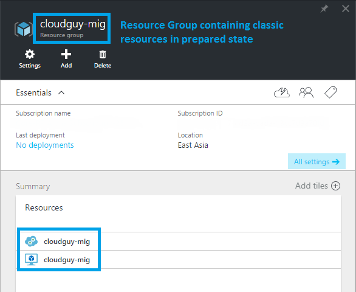

<properties
    pageTitle="Technische aneignen auf Plattform unterstützt Migration von klassischen Ressourcenmanager zu Azure | Microsoft Azure"
    description="In diesem Artikel wird eine technische aneignen auf Plattform unterstützt Migration von Ressourcen aus klassischen zu Azure Ressourcenmanager"
    services="virtual-machines-windows"
    documentationCenter=""
    authors="singhkays"
    manager="timlt"
    editor=""
    tags="azure-resource-manager"/>

<tags
    ms.service="virtual-machines-windows"
    ms.workload="infrastructure-services"
    ms.tgt_pltfrm="vm-windows"
    ms.devlang="na"
    ms.topic="article"
    ms.date="08/22/2016"
    ms.author="kasing"/>

# Technische aneignen auf Plattform unterstützt Migration von Classic zu Azure Ressourcenmanager
Nachstehend wird eine tief greifende über das Migrieren von klassischen Azure-Bereitstellungsmodell zum Azure Ressourcenmanager Bereitstellungsmodell aus. Betrachten wir Ressourcen auf einer Stufe Ressourcen- und Features, die Ihnen helfen zu verstehen, wie die Azure-Plattform Ressourcen zwischen den beiden Modellen migriert werden. Weitere Informationen finden Sie im Dienst Ankündigungsartikel: [Plattform unterstützt Migration IaaS Ressourcen aus klassischen zu Azure Ressourcenmanager](virtual-machines-windows-migration-classic-resource-manager.md).

## Eine ausführliche Anleitung zur migration

Sie können das klassische und Ressourcenmanager Darstellungen von Ressourcen in der folgenden Tabelle suchen. Weitere Features und Ressourcen werden derzeit nicht unterstützt.

| Klassische Darstellung                                 | Ressourcenmanager Darstellung                 | Detaillierte Notizen                                                                                                                                                                                                                                                                                                                                                                                                                                                      
|--------------------------------------------------------|-------------------------------------------------|-------------------------------------------------------------------------------------------------------------------------------------------------------------------------------------------------------------------------------------------------------------------------------------------------------------------------------------------------------------------------------------------------------------------------------------------------------------------|
| Name der Cloud-Dienst                                     | DNS-name                                        | Während der Migration wird erstellt eine neue Ressourcengruppe für jede Cloud-Dienst, mit dem naming Muster `<cloudservicename>-migrated`. Diese Ressourcengruppe enthält alle Ressourcen. Der Name der Cloud-Dienst wird ein DNS-Name, die die öffentliche IP-Adresse zugeordnet ist.                                                                                                                                                                                                    |   
| Virtuellen Computern                                        | Virtuellen Computern                                 | Virtueller Computer-spezifische Eigenschaften werden unverändert migriert. Bestimmte OsProfile Informationen, wie Computernamen, wird nicht in der klassischen Bereitstellungsmodell gespeichert und bleibt nach der Migration leer.                                                                                                                                                                                                                                                                |   
| Datenträgerressourcen, die virtuellen Computer angefügt                          | Implizit mit virtuellen Computer verbundenen Datenträger                   | Datenträger werden nicht als auf oberster Ebene Ressourcen im Bereitstellungsmodell Ressourcenmanager erstellt. Sie werden als implizit Datenträger unter dem virtuellen Computer migriert werden. Nur Festplatten, die um einen virtuellen Computer angeschlossen sind, werden derzeit unterstützt. Ressourcenmanager virtuellen Computern können nun klassischen Speicherkonten auf dem Datenträger einfach ohne jegliche Updates migriert werden können. |   
| Virtueller Computer Erweiterungen                                          | Virtueller Computer Erweiterungen                                   | Alle Ressourcen-Erweiterungen, mit Ausnahme von XML-Erweiterungen werden aus dem Bereitstellungsmodell klassischen migriert.                                                                                                                                                                                                                                                                                                                                                                        |   
| Zertifikate virtuellen Computern                           | Die Zertifikate in Azure Key Tresor                 | Wenn ein Clouddienst Dienstzertifikate, eine neue Azure-Tresor pro Cloud-Dienst enthält und die Zertifikate in der wichtigsten Tresor verschiebt. Die Zertifikate aus dem Key Tresor verweisen, werden die virtuellen Computern aktualisiert.                                                                                                                                                                                                                               |  
| WinRM-Konfiguration                                    | Klicken Sie unter OsProfile WinRM-Konfiguration             | Windows, die Konfiguration der Remote-Verwaltung verschoben wird als Teil der Migration unverändert bei.                                                                                                                                                                                                                                                                                                                                                                                            |   
| Verfügbarkeit-Set-Eigenschaft                              | Verfügbarkeit-Set-Ressourcen                       | Verfügbarkeit-Set Spezifikation wurde eine Eigenschaft des virtuellen Computers im Bereitstellungsmodell klassischen. Verfügbarkeit Datensätze werden auf oberster Ebene Ressource als Teil der Migration. Die folgenden Konfigurationen werden nicht unterstützt: mehrere Verfügbarkeit legt pro Cloud-Dienst oder einen oder mehrere Verfügbarkeit legt zusammen mit den virtuellen Computern, die nicht in alle Verfügbarkeit in einen Cloud-Dienst festgelegt sind.                                                                                |   
| Netzwerkkonfiguration eines virtuellen Computers                          | Primäre Netzwerk-Benutzeroberfläche                       | Netzwerkkonfiguration eines virtuellen Computers wird als die primäre Netzwerk Benutzeroberflächen-Ressource nach der Migration dargestellt. Für virtuelle Computer, die nicht in einem virtuellen Netzwerk befinden, ändert sich die interne IP-Adresse während der Migration.                                                                                                                                                                                                                                                            |   
| Mehrere Netzwerk-Schnittstellen eines virtuellen Computers                    | Netzwerk-Schnittstellen                              | Wenn ein virtueller Computer mehrere Netzwerkschnittstellen zugeordnet sind, wird jedes Netzwerk-Benutzeroberfläche einer Ressource auf oberster Ebene, als Teil der Migration im Bereitstellungsmodell Ressourcenmanager sowie alle Eigenschaften aus.                                                                                                                                                                                                                                                            |  
| Lastenausgleich Endpunkt festlegen                             | Lastenausgleich                                   | In der klassischen Bereitstellungsmodell zugewiesen die Plattform ein implizit Lastenausgleich für jede Cloud-Dienst. Während der Migration eine neue Lastenausgleich Ressource wird erstellt, und der Lastenausgleich Endpunkt-Satz wird Lastenausgleich Regeln.                                                                                                                                                                                                                                     |   
| Eingehende Regeln NAT                                      | Eingehende Regeln NAT                               | Eingabe Endpunkte des virtuellen Computers definiert werden in eingehende Regeln für die Netzwerkadreßübersetzung unter Lastenausgleich während der Migration konvertiert.                                                                                                                                                                                                                                                                                                                                           |  
| VIP-Adresse                              | Öffentliche IP-Adresse mit DNS-Namen                 | Die virtuelle IP-Adresse wird von einer öffentlichen IP-Adresse und dem Lastenausgleich zugeordnet ist.                                                                                                                                                                                                                                                                                                                                                        |   
| Virtuelles Netzwerk                                        | Virtuelles Netzwerk                                 | Das virtuelle Netzwerk wird mit allen Eigenschaften, um das Modell zur Bereitstellung von Ressourcenmanager migriert. Eine neue Ressourcengruppe wird erstellt, mit dem Namen `-migrated`. Es gibt [nicht unterstützte Konfigurationen](virtual-machines-windows-migration-classic-resource-manager.md)aus.                                                                                                                                                                                                  |   
| Reservierte IP-Adressen                                           | Öffentliche IP-Adresse mit Methode statischen Verteilung  | Reservierte IP-Adressen Lastenausgleich zugeordnet werden migriert, zusammen mit der Migration von Cloud-Dienst oder des virtuellen Computers. Nicht zugeordnete reservierte IP-Migration wird derzeit nicht unterstützt.                                                                                                                                                                                                                                                           |   
| Öffentliche IP-Adresse pro virtueller Computer                               | Öffentliche IP-Adresse mit dynamischen Zuteilung-Methode | Die öffentliche IP-Adresse, den virtuellen Computer zugeordnet wird als eine öffentliche IP-Adressenressource, mit der Methode der Verteilung auf statische festgelegt konvertiert.                                                                                                                                                                                                                                                                                                                                   |   
| NSGs                                | NSGs                         | Netzwerk-Sicherheitsgruppen ein Subnetz zugeordnet werden als Teil der Migration zum Bereitstellungsmodell Ressourcenmanager geklont. Die NSG im Bereitstellungsmodell klassischen wird während der Migration nicht entfernt. Die Vorgänge Management-Ebene für die NSG sind jedoch blockiert, während die Migration ausgeführt wird.                                                                                                                                                                             |  
| DNS-Server                                            | DNS-Server                                     | DNS-Server ein virtuelles Netzwerk oder den virtuellen Computer zugeordnet werden als Teil der entsprechenden Ressourcenmigration sowie alle Eigenschaften migriert.                                                                                                                                                                                                                                                                                                                    |   
| UDRs                                    | UDRs                             | Benutzerdefinierte leitet ein Subnetz zugeordnet werden als Teil der Migration zum Bereitstellungsmodell Ressourcenmanager geklont. Die UDR im Bereitstellungsmodell klassischen wird während der Migration nicht entfernt. Während die Migration ausgeführt wird, sind die Vorgänge Management-Ebene für die UDR blockiert.                                                                                                                                                                             |   
| IP-Eigenschaft auf einer virtuellen Computers Netzwerkkonfiguration Weiterleitung | IP-Eigenschaft auf die NIC Weiterleitung               | Die Eigenschaft einer virtuellen Computers Weiterleitung IP-Adresse wird auf eine Eigenschaft an der Schnittstelle während der Migration konvertiert.                                                                                                                                                                                                                                                                                                                                                           |   
| Lastenausgleich mit mehreren IP-Adressen                        | Lastenausgleich mit mehreren öffentlichen IP-Ressourcen | Jeder öffentliche IP-Adresse, den Lastenausgleich zugeordnet ist in einer öffentlichen IP-Ressource konvertiert und Lastenausgleich nach der Migration zugeordnet.                                                                                                                                                                                                                                                                                                       |   
| Interne DNS-Namen des virtuellen Computers                           | Interne DNS-Namen der Netzwerkkarte                    | Während der Migration werden die internen DNS-Suffixe für die virtuelle Computer in eine schreibgeschützte Eigenschaft, die mit dem Namen "InternalDomainNameSuffix" des Netzwerkschnittstellenadapters migriert. Das Suffix nach der Migration bleibt unverändert und virtueller Computer mit einer Auflösung von sollte weiterhin wie zuvor funktionieren.                                                                                                                                                                                                           |   

## Abbildung einer einfachen Migration Anleitung

Das folgende Bildschirmabbild zeigt einen vorhandenen Clouddienst mit eines virtuellen Computers (nicht in einem virtuellen Netzwerk) nach der Vorbereitungsphase an:

Nach Abschluss des Migrationsvorgangs die folgenden Screenshots zeigen, dass die neuen Ressourcen in einer neuen Ressourcengruppe erstellt wurden: 

## Nächste Schritte

Jetzt, da Sie die Migration von klassischen IaaS Ressourcen zu Ressourcenmanager verstanden haben, können Sie beginnen, Migrieren von Ressourcen.

- [Mithilfe von PowerShell IaaS Ressourcen klassischen Migrieren zu Azure Ressourcenmanager](virtual-machines-windows-ps-migration-classic-resource-manager.md)
- [Verwenden Sie CLI IaaS Ressourcen aus klassischen zu Azure Ressourcenmanager migrieren](virtual-machines-linux-cli-migration-classic-resource-manager.md)
- [Plattform unterstützt Migration IaaS Ressourcen aus klassischen zu Azure Ressourcenmanager](virtual-machines-windows-migration-classic-resource-manager.md)
- [Duplizieren eines klassischen virtuellen Computers zu Azure Ressourcenmanager mithilfe der PowerShell-Skripts community](virtual-machines-windows-migration-scripts.md)
