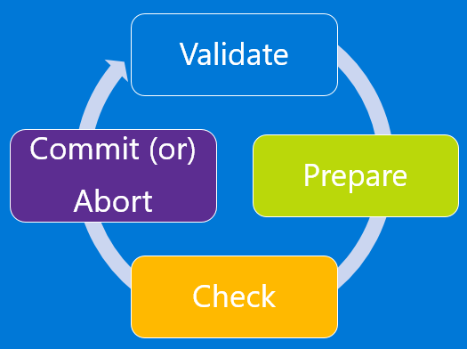

<properties
    pageTitle="Plattform unterstützt Migration von IaaS Ressourcen von klassischen Ressourcenmanager zu Azure | Microsoft Azure"
    description="In diesem Artikel führt durch die Plattform unterstützt Migration von Ressourcen aus klassischen zu Azure Ressourcenmanager"
    services="virtual-machines-windows"
    documentationCenter=""
    authors="singhkays"
    manager="timlt"
    editor=""
    tags="azure-resource-manager"/>

<tags
    ms.service="virtual-machines-windows"
    ms.workload="infrastructure-services"
    ms.tgt_pltfrm="vm-windows"
    ms.devlang="na"
    ms.topic="article"
    ms.date="08/22/2016"
    ms.author="kasing"/>

# Plattform unterstützt Migration IaaS Ressourcen aus klassischen zu Azure Ressourcenmanager

In diesem Artikel beschreiben wir, wie wir Migration von Infrastruktur als eine Ressourcen Service (IaaS) in der Standardansicht Ressourcenmanager Bereitstellungsmodelle aktivieren möchten. Sie können weitere Informationen zu [Ressourcenmanager Azure-Features und Vorteile](../azure-resource-manager/resource-group-overview.md). Erläutert, wie Sie Ressourcen aus den Bereitstellungsmodellen zwei verbinden, die in Ihrem Abonnement gemeinsam vorhanden sind, mithilfe von virtuellen Netzwerk-Standorten Gateways. 

## Ziel für die migration

Ressourcenmanager Bereitstellen von Vorlagen durch komplexe Applikationen ermöglicht, virtuellen Computern mithilfe von virtuellen Computer Erweiterungen konfiguriert und übernimmt Access Management und kategorisieren. Azure Ressourcenmanager enthält skalierbare, parallele Bereitstellung für virtuelle Computer in Verfügbarkeit Sätze. Das neue Bereitstellungsmodell bietet auch unabhängig voneinander Lifecycle Management von Datenverarbeitung, Netzwerk und Speicher. Schließlich besteht ein Fokus auf die Aktivierung der Sicherheit mit der Durchsetzung von virtuellen Computern in einem Netzwerk virtuelle standardmäßig.

Fast alle Features aus dem Bereitstellungsmodell klassischen werden für Datenverarbeitung, Netzwerk und Speicher unter Azure Ressourcenmanager unterstützt. Um die neuen Funktionen in Azure Ressourcenmanager nutzen, können Sie die vorhandene Bereitstellungen aus dem Modell zur Bereitstellung von klassischen migrieren.

## Änderungen an der Automatisierung und nach der Migration-Tools

Als Bestandteil der Migration von Ressourcen aus dem Modell zur Bereitstellung von klassischen in das Modell zur Bereitstellung von Ressourcenmanager müssen Sie Ihre vorhandene Automatisierung oder Tools, um sicherzustellen, dass sie nach der Migration funktioniert weiterhin aktualisieren.

## Bedeutung der Migration von IaaS Ressourcen aus klassischen zu Ressourcenmanager

Bevor wir die Details einen Drilldown, sehen wir uns den Unterschied zwischen Daten-Ebene und Management-Ebene Vorgänge IaaS-Ressourcen.

- *Management Ebene* werden Anrufe, die in der Ebene Management oder die API zum Ändern der Ressourcen gehören. Operationen wie ein virtuellen Computers zu erstellen, einen Neustart eines virtuellen Computers und Aktualisieren eines virtuellen Netzwerks mit einem neuen Subnetz verwalten beispielsweise die laufenden Ressourcen. Diese beeinflussen nicht direkt, Herstellen einer Verbindung mit der Instanzen.
- *Data plane* (Anwendung) werden die Laufzeit der Anwendung selbst und Interaktion mit Instanzen, die durch die Azure-API verlaufen nicht umfasst. Zugreifen auf Ihre Website oder Ziehen von Daten aus einer laufenden SQL Server-Instanz oder einem Server MongoDB werden betrachtet Daten Ebene oder Anwendung Interaktion. Kopieren eines BLOBs von einem Konto Speicherplatz und den Zugriff auf eine öffentliche IP-Adresse RDP oder SSH in den virtuellen Computern sind auch Daten Ebene. Diese Vorgänge lassen Sie die Anwendung über Datenverarbeitung, Netzwerke und Speicher ausgeführt.

>[AZURE.NOTE] Die Azure-Plattform in einigen Migrationsszenarien Tabstopps, freigegeben und dem Neustart Ihren virtuellen Computern. Dies budgetgerecht tritt einen kurzen Daten-Ebene Ausfall.

## Bereiche der Migration werden unterstützt

Es gibt drei Migration Bereiche, die hauptsächlich Datenverarbeitung, Netzwerk und Speicher ausgerichtet. 

### Migration von virtuellen Computern (nicht in einem virtuellen Netzwerk)

Im Bereitstellungsmodell Ressourcenmanager wird Sicherheit für die Anwendung standardmäßig erzwungen. Alle virtuellen Computern müssen in einem virtuellen Netzwerk im Modell Ressourcenmanager sein. Nach dem Neustart des Azure-Plattform (`Stop`, `Deallocate`, und `Start`) der virtuellen Computern als Teil der Migration. Sie haben zwei Optionen für die virtuelle Netzwerke:

- Sie können die Plattform zum Erstellen eines neuen virtuellen Netzwerks und zum Migrieren des virtuellen Computers in das neue virtuelle Netzwerk anfordern.
- Sie können den virtuellen Computer in ein vorhandenes virtuelles Netzwerk in Ressourcenmanager migrieren.

>[AZURE.NOTE] In diesem Bereich Migration können sowohl die Management-Ebene Vorgänge und die Daten-Ebene Vorgänge nicht für einen Zeitraum während der Migration zugelassen werden.

### Migration von virtuellen Computern (in einem virtuellen Netzwerk)

Für die meisten Konfigurationen virtueller Computer ist nur die Metadaten zwischen den klassischen und Ressourcenmanager Bereitstellungsmodellen migrieren. Die zugrunde liegenden virtuellen Computern sind auf der gleichen Hardware, in demselben Netzwerk, und klicken Sie mit der gleichen Speicher ausgeführt. Die Vorgänge Management-Ebene für einen bestimmten Zeitraum während der Migration möglicherweise nicht zulässig. Jedoch weiterhin die Daten Ebene entwickelt. Anwendung auf virtuellen Computern (klassische) ausgeführt entstehen während der Migration d. h., keine Ausfallzeiten.

Die folgenden Konfigurationen werden derzeit nicht unterstützt. Wenn Unterstützung in der Zukunft einige virtuellen Computern in hinzugefügt wird möglicherweise diese Konfiguration Ausfallzeiten anfallen (Wechseln durch Beenden, freigeben, und starten Sie Vorgänge virtueller Computer neu).

-   Sie verfügen über mehrere Verfügbarkeit in einem einzelnen Clouddienst festlegen.
-   Sie haben eine oder mehrere Verfügbarkeit Sätze und virtuellen Computern, die nicht in einer Verfügbarkeit in einem einzelnen Clouddienst festgelegt sind.

>[AZURE.NOTE] In diesem Bereich Migration möglicherweise die Ebene Management für einen Zeitraum während der Migration nicht zulässig. Möchten Sie für bestimmte wie zuvor beschrieben Daten-Ebene Ausfallzeiten auftritt.

### Die Migration – Speicher-Konten

Nahtlose Migration zulässig, können Sie in einem Speicherkonto klassischen Ressourcenmanager virtuellen Computern bereitstellen. Mit dieser Funktion berechnen und Netzwerk-Ressourcen können und unabhängig von Speicherkonten migriert werden sollte. Wenn Sie über Ihre virtuellen Computern und virtuelles Netzwerk migrieren, müssen Sie über Ihre Speicherkonten bis zum Abschluss der Migration zu migrieren. 

>[AZURE.NOTE] Das Modell zur Bereitstellung von Ressourcenmanager keinen des Konzepts der klassischen Bilder und Festplatten. Wenn das Speicherkonto migrierte, klassische Bilder und Laufwerke sind nicht in den Stapel Ressourcenmanager sichtbar aber der zugrunde liegende virtuelle Festplatten bleiben im Speicherkonto. 

## Nicht unterstützte Features und Konfigurationen

Wir unterstützen derzeit nicht einige Features und Konfigurationen. Den folgenden Abschnitten werden unsere Empfehlungen, um diese an.

### Nicht unterstützte features

Die folgenden Features sind derzeit nicht unterstützt. Sie können optional entfernen diese Einstellungen, die virtuellen Computern migrieren, und aktivieren Sie die Einstellungen im Bereitstellungsmodell Ressourcenmanager dann wieder.

Anbieter für Ressourcen | Feature
---------- | ------------
Berechnen | Nicht zugeordnete virtuellen Computern Festplatten.
Berechnen | Bilder des virtuellen Computers.
Netzwerk | Endpunkt ACLs.
Netzwerk | Virtuelle Netzwerkgateways (Standort zu Standort Azure ExpressRoute, Anwendungsgateway, zeigen Sie auf Website).
Netzwerk | Virtuelle Netzwerke VNet Peering verwenden. (VNet in der Cloud migrieren, und klicken Sie dann peer) Weitere Informationen zu [VNet Peering] (... /Virtual-Network/Virtual-Network-Peering-Overview.MD).
Netzwerk | Datenverkehr-Manager-Profilen.

### Nicht unterstützte Konfigurationen

Die folgenden Konfigurationen werden derzeit nicht unterstützt.

Dienst | Konfiguration | Empfehlungen
---------- | ------------ | ------------
Ressourcenmanager | Rolle basierend Access Steuerelement (RBAC) für klassische Ressourcen | Da der URI der Ressourcen nach der Migration geändert wird, empfiehlt es sich, dass Sie die RBAC Richtlinie Updates planen, die nach der Migration erfolgen müssen.
Berechnen | Mehrere Subnetze eines virtuellen Computers zugeordnet sind. | Aktualisieren Sie die Subnetzkonfiguration nur Subnetze verweisen.
Berechnen | Virtuellen Computern, die zu einem virtuellen Netzwerk gehören, aber keine explizite Subnetz zugewiesen haben | Optional können Sie den virtuellen Computer löschen.
Berechnen | Virtuellen Computern, die automatisch skalieren Richtlinien Benachrichtigungen aufweisen | Die Migration durchläuft, und diese Einstellungen werden gelöscht. Es wird dringend empfohlen, dass Sie Ihre Umgebung evaluieren, bevor Sie die Migration ausführen. Alternativ können Sie die Benachrichtigungseinstellungen nach Abschluss der Migration neu konfigurieren.
Berechnen | VM XML-Erweiterungen (BGInfo 1. * ist, Visual Studio Debugger, Web bereitstellen und Debuggen Remoteprozeduraufruf) | Dies wird nicht unterstützt. Es wird empfohlen, dass Sie folgenden Erweiterungen aus des virtuellen Computers weiterhin Migration entfernen, oder sie während des Migrationsvorgangs automatisch gelöscht werden werden.
Berechnen | Boot Diagnose mit Premium-Speicher | Deaktivieren Sie Boot Diagnose Feature für die virtuellen Computern, bevor Sie mit der Migration fortfahren. Sie können Boot Diagnose in den Stapel Ressourcenmanager nach Abschluss die Migration wieder aktivieren. Darüber hinaus sollte Blobs, die für den Screenshot und seriellen Protokolle verwendet werden, damit Sie nicht mehr für diese Blobs belastet werden gelöscht.
Berechnen | Cloud-Diensten, die Web/Worker-Rollen enthalten. | Dies wird derzeit nicht unterstützt.
Netzwerk | Virtuelle Netzwerke, die virtuellen Computern und Web/Worker-Rollen enthalten. |  Dies wird derzeit nicht unterstützt.
Azure App-Verwaltungsdienst | Virtuelle Netzwerke, die App-Service-Umgebungen enthalten | Dies wird derzeit nicht unterstützt.
Azure HDInsight | Virtuelle Netzwerke, die Dienste HDInsight enthalten | Dies wird derzeit nicht unterstützt.
Microsoft Dynamics Lifecycle Services | Virtuelle Netzwerke, die virtuellen Computern enthalten, die von Dynamics Lebenszyklus Services verwaltet werden | Dies wird derzeit nicht unterstützt.
Berechnen | Azure-Sicherheitscenter Erweiterungen mit einer VNET, die ein VPN-Gateway oder ER Gateway mit auf Prem DNS-Server hat | Azure-Sicherheitscenter installiert automatisch Erweiterungen auf Ihre virtuellen Computern überwachen ihre Sicherheit und Benachrichtigungen auslösen. Diese Erweiterungen erhalten in der Regel automatisch installiert, wenn die Richtlinie Azure Sicherheitscenter auf das Abonnement aktiviert ist. Während der Migration Gateway wird derzeit nicht unterstützt und das Gateway bevor Sie mit die Migration Commit gelöscht werden soll, geht der Zugriff auf das Internet virtueller Computer Speicher Konto verloren, wenn das Gateway gelöscht wird. Die Migration wird nicht fortgesetzt werden, wenn dies passiert, wie das Gast Agent Status Blob aufgefüllt werden kann. Es wird empfohlen, um Sicherheitscenter Azure-Richtlinie auf das Abonnement 3 Stunden, bevor Sie mit der Migration zu deaktivieren.

## Die Migrations-Oberfläche

Bevor Sie mit der Migration beginnen, wird Folgendes empfohlen:

- Stellen Sie sicher, dass die Ressourcen, die Sie migrieren möchten alle nicht unterstützte Features oder Konfigurationen verwenden nicht. In der Regel die Plattform erkennt diese Probleme und führt zu einem Fehler.
- Wenn Sie virtuellen Computern, die nicht in einem virtuellen Netzwerk befinden haben, werden er beendet und als Teil des Vorgangs vorbereiten freigegeben. Wenn Sie nicht die öffentliche IP-Adresse verlieren möchten, suchen Sie in reserviert werden die IP-Adresse vor dem Auslösen des Vorgangs vorbereiten. Jedoch, wenn der virtuelle Computer in einem virtuellen Netzwerk befinden, sie sind nicht beendet und freigegeben.
- Planen der Migrations während außerhalb der Geschäftszeiten unerwarteter Fehler gerecht werden kann, die während der Migration passieren kann.
- Laden Sie die aktuelle Konfiguration Ihrer virtuellen Computer mithilfe der PowerShell, Befehle line Interface (CLI) oder REST-APIs um zu erleichtern für die Überprüfung nach Abschluss der vorbereiten Schritt aus.
- Aktualisieren Sie Ihre Skripts Automatisierung/Operationalization, um das Modell zur Bereitstellung von Ressourcenmanager vor Beginn die Migration zu behandeln. Optional können Sie ausführen GET-Vorgänge, wenn die Ressourcen Status vorbereitet sind.
- Auswerten der RBAC-Richtlinien, die den klassischen IaaS-Ressourcen konfiguriert sind, und Planen Sie nach Abschluss die Migration.

Die Migrationsworkflow sieht wie folgt aus

>[AZURE.NOTE] Alle Vorgänge, die in den folgenden Abschnitten beschriebenen sind Idempotent. Wenn Sie ein Problem als ein nicht unterstütztes Feature oder einem Konfigurationsfehler haben, wird empfohlen, dass Sie zur Vorbereitung, wiederholen Sie Abbrechen oder Vorgang abzuschließen. Die Azure-Plattform versucht, die Aktion erneut.

### Überprüfen Sie die

Der Vorgang überprüfen ist der erste Schritt des Migrationsvorgangs. Das Ziel dieses Schritts ist zum Analysieren von Daten in den Hintergrund für die Ressourcen unter Migration und Erfolg/Fehler zurückgibt, wenn die Ressourcen in der Migration sind.

Sie wählen Sie das virtuelle Netzwerk oder den angebotenen Service (wenn es sich nicht um ein virtuelles Netzwerk ist), dass für die Migration überprüft werden sollen.

* Wenn die Ressource nicht kann der Migration, Listen die Azure-Plattform alle Gründe für warum es für die Migration nicht unterstützt wird.

### Vorbereiten

Die Vorbereitung ist im zweiten Schritt des Migrationsvorgangs. Das Ziel dieses Schritts ist simulieren die Transformation der IaaS Ressourcen aus klassischen zu Ressourcenmanager Ressourcen und präsentieren dies für Sie zu visualisieren nebeneinander.

Sie wählen Sie das virtuelle Netzwerk oder den angebotenen Service (wenn es sich nicht um ein virtuelles Netzwerk ist), dass Sie für die Migration vorbereiten möchten.

* Ist die Ressource nicht in der Migration, wird die Azure-Plattform des Migrationsvorgangs Tabstopps und listet den Grund, warum das Vorbereiten fehlgeschlagen.
* Wenn die Ressource Migration kann, nach unten im ersten Azure-Plattform sperren und die Vorgänge Management-Ebene für die Ressourcen in die Migration. Beispielsweise können Sie nicht auf einen Datenträger eines virtuellen Computers unter Migration hinzufügen.

Die Azure-Plattform beginnt dann die Migration von Metadaten von klassischen zu Ressourcenmanager für die Migration von Ressourcen.

Nach Abschluss des Vorgangs vorbereiten, Sie haben die Möglichkeit, die Ressourcen sowohl klassische visualisieren und Ressourcenmanager. Für jede im Bereitstellungsmodell klassischen Cloud-Dienst, die Azure-Plattform erstellt einen Gruppennamen für Ressourcen, die das Muster weist `cloud-service-name>-migrated`.

>[AZURE.NOTE] Virtuellen Computern, die nicht in einem klassischen virtuelle Netzwerk befinden, werden in dieser Phase der Migration freigegeben beendet.

### Kontrollkästchen (manuell oder Skripts)

Aktivieren Sie im Schritt können Sie optional die Konfiguration, die Sie zuvor heruntergeladen haben verwenden, um zu überprüfen, dass die Migration richtig aussieht. Alternativ können Sie auf dem Portal und dem Kontrollkästchen Stelle melden Sie sich die Eigenschaften und Ressourcen zu überprüfen, ob Metadatenmigration gut aussieht.

Wenn Sie ein virtuelles Netzwerk migrieren, wird die meisten Konfiguration von virtuellen Computern nicht neu gestartet. Für Applikationen auf diesen virtuellen Computern können Sie überprüfen, dass die Anwendung weiterhin ausgeführt wird.

Sie können testen Sie Ihre Überwachung/Automatisierung und Betrieb von Skripts finden Sie unter Wenn die virtuellen Computern wie erwartet funktionieren und Ihre aktualisierten Skripts ordnungsgemäß funktionieren. Nur GET-Vorgänge werden unterstützt, wenn die Ressourcen Status vorbereitet sind.

Es gibt keine festlegen Zeitfensters auf commit die Migration werden benötigten aus. Sie können die erforderlichen so viel Zeit wie in diesem Zustand soll. Die Verwaltungsebene ist jedoch für diese Ressourcen gesperrt, bis Sie Abbruch oder commit.

Wenn Sie alle Probleme auftreten, können Sie Abbrechen die Migration und kehren Sie zum klassischen Bereitstellungsmodell. Nachdem Sie zurückkehren, wird die Azure-Plattform für Ressourcen, Vorgänge Management-Ebene öffnen, sodass normale Vorgänge auf diese virtuellen Computern im Bereitstellungsmodell klassischen fortgesetzt werden können.

### Abbrechen

Abbruch ist ein optionaler Schritt, den Sie verwenden können, um die Änderungen im Modell zur klassischen Bereitstellung wiederherstellen, und halten Sie die Migration.

>[AZURE.NOTE] Dieser Vorgang kann nicht ausgeführt werden, nachdem Sie den Commitvorgang ausgelöst haben.  

### Commit ausführen

Nachdem Sie die Überprüfung abgeschlossen haben, können Sie die Migration abzuschließen. Ressourcen werden nicht mehr in der klassischen und stehen nur in das Modell zur Bereitstellung von Ressourcen-Manager. Die migrierten Ressourcen können nur in das neue Portal verwaltet werden.

>[AZURE.NOTE] Dies ist eine idempotente Operation. Schlägt fehl, empfiehlt es sich, dass Sie den Vorgang zu wiederholen. Wenn weiterhin ein Fehler auftritt, erstellen Sie eine Support-Ticket oder erstellen Sie einen Forumsbeitrag mit einer Kategorie ClassicIaaSMigration unsere [virtuellen Computer-Forum](https://social.msdn.microsoft.com/Forums/azure/en-US/home?forum=WAVirtualMachinesforWindows).

## Häufig gestellte Fragen

**Wirkt dieser Migrationsplan sich keines meine vorhandenen Diensten und Anwendungen, die auf Azure-virtuellen Computern ausgeführt werden?**

Nein. Die virtuellen Computern (klassische) sind vollständig unterstützte Services im allgemeinen Verfügbarkeit gebracht. Sie können weiterhin diese Ressourcen verwenden, um Ihr Platzbedarf auf Microsoft Azure zu erweitern.

**Was geschieht mit meiner virtuellen Computern, wenn ich nicht in Kürze migrieren möchten?**

Wir werden nicht die vorhandenen klassischen APIs und Ressourcenmodell veralteter. Wir möchten Migration einfach, erwägen die erweiterten Features, die im Bereitstellungsmodell Ressourcenmanager verfügbar sind. Es wird dringend empfohlen, dass Sie darum [einiger den Fortschritten](virtual-machines-windows-compare-deployment-models.md) , die IaaS unter Ressourcenmanager gehören.

**Was bedeutet dieser Migrationsplan für meine vorhandene Tools?**

Aktualisieren der Tools zum Bereitstellungsmodell Ressourcenmanager ist eine über die wichtigsten Änderungen, die Sie in der Migrations-Plänen berücksichtigt werden müssen.

**Wie lange wird der Management-Ebene Ausfall sein?**

Dies ist die Anzahl der Ressourcen, die migriert werden abhängig. Für kleinere Bereitstellungen (ein paar mehrere virtuelle Computer) sollte die gesamte Migration weniger als eine Stunde in Anspruch nehmen. Für umfangreiche Bereitstellungen (hundert virtuellen Computern) kann die Migration ein paar Stunden dauern.

**Kann ich nach der meine Migrieren von Ressourcen in Ressourcenmanager zugesichert sind einsatzbereit?**

Sie können Ihre Migration Abbrechen, solange die Ressourcen Status vorbereitet sind. Zurücksetzen wird nicht unterstützt werden, nachdem die Ressourcen durch Commit-Vorgang erfolgreich migriert wurden.

**Kann ich meine Migration zurücksetzen, wenn die Commit durchgeführt?**

Migration kann nicht abgebrochen werden, wenn der Commitvorgang fehlschlägt. Alle Migrationsvorgänge, einschließlich des Vorgangs Commit sind Idempotent. So empfiehlt es sich, dass Sie den Vorgang nach einer kurzen Zeit zu wiederholen. Wenn Sie immer noch einen Fehler stoßen, erstellen Sie einer Support-Ticket oder einen Forumsbeitrag mit dem Tag ClassicIaaSMigration unsere [virtuellen Computer-Forum](https://social.msdn.microsoft.com/Forums/azure/en-US/home?forum=WAVirtualMachinesforWindows).

**Habe ich eine andere express Routing Verbindung erwerben, wenn ich mich IaaS unter Ressourcenmanager verwenden?**

Nein. Wir aktiviert zuletzt [ExpressRoute Schaltkreise in der Standardansicht zum Bereitstellungsmodell Ressourcenmanager verschieben](../expressroute/expressroute-move.md). Sie müssen keine neue ExpressRoute Verbindung kaufen, wenn Sie bereits über eine verfügen.

**Was passiert, wenn ich rollenbasierte Access Control Richtlinien für meine klassischen IaaS Ressourcen konfiguriert haben?**

Während der Migration transformieren die Ressourcen aus dem klassischen zu Ressourcenmanager. Daher wird empfohlen, dass Sie die RBAC Richtlinie Updates planen, die nach der Migration erfolgen müssen.

**Was geschieht, wenn ich Azure Website Wiederherstellung oder Azure Sicherung heute verwende?**

Zum Migrieren Ihrer virtuellen Computern, die Sicherungskopie, finden Sie unter [aktiviert sind haben ich meine klassischen virtuellen Computern in Sicherung Tresor gesichert. Ich möchte nun meine virtuellen Computern klassischen Modus in Ressourcenmanager Modus migrieren. Wie kann ich sichern sie in der Wiederherstellung Services Tresor?](../backup/backup-azure-backup-ibiza-faq.md#i-have-backed-up-my-classic-vms-in-backup-vault-now-i-want-to-migrate-my-vms-from-classic-mode-to-resource-manager-mode-how-can-i-backup-them-in-recovery-services-vault)

**Kann ich mein Abonnement oder Ressourcen, um festzustellen, ob sie in der Migration befinden überprüfen?**

Ja. Der erste Schritt bei der Vorbereitung für die Migration werden in die Migrationsoption-Plattform unterstützt überprüfen, dass die Ressourcen in der Migration werden. Für den Fall, dass der Vorgang überprüfen fehlschlägt, erhalten Sie Nachrichten für alle Gründe für den von die Migration abgeschlossen werden kann.

**Was passiert, wenn ich eine Kontingent Fehler auftreten, während die IaaS-Ressourcen für die Migration vorbereiten?**

Es empfiehlt sich, dass Sie Ihre Migration abzubrechen, und melden Sie sich eine Supportanfrage an die Kontingente in der Region vergrößern, in dem Sie die virtuellen Computern migrieren. Nachdem die Anfrage Kontingent genehmigt wurde, können Sie beginnen, die Migrationsschritte erneut ausführen.

**Wie melde ich ein Problem?**

Veröffentlichen Sie Ihre Probleme und Fragen zur Migration auf unsere [virtuellen Computer-Forum](https://social.msdn.microsoft.com/Forums/azure/en-US/home?forum=WAVirtualMachinesforWindows), mit dem Schlüsselwort ClassicIaaSMigration ein. Es empfiehlt sich, alle Ihre Fragen in diesem Forum veröffentlichen. Wenn Sie einen Support-Vertrag haben, können Sie Willkommen bei einer Support-Ticket zu melden.

**Was geschieht, wenn ich die Namen der Ressourcen nicht zufrieden sind, die die Plattform während der Migration ignoriert?**

Während der Migration werden alle Ressourcen, die Sie explizit Namen für im Bereitstellungsmodell klassischen bereitstellen beibehalten. In einigen Fällen werden neue Ressourcen erstellt. Beispiel: Netzwerk-Schnittstellen für jede virtueller Computer erstellt wird. Zurzeit unterstützt nicht die Möglichkeit, die Namen der diese neuen Ressourcen während der Migration erstellt steuern. Melden Sie sich Ihre stimmen für dieses Feature im [Forum Azure Feedback](http://feedback.azure.com).

* *ich erhalte die Fehlermeldung *"virtuellen Computer meldet den allgemeinen Agentenstatus als nicht bereit. Daher kann der virtuellen Computer migriert werden. Stellen Sie sicher, dass der Agent virtueller Computer allgemeine Agentstatus als sofort berichtet"* oder *"virtuellen Computer enthält, deren Status wird nicht aus dem virtuellen Computer gemeldet, Erweiterung. Daher diesem virtuellen Computer kann nicht migriert werden."***

Diese Nachricht empfangen wird, wenn Sie der virtuellen Computer nicht über ausgehende Verbindungen mit dem Internet verfügt. Der Agent virtueller Computer verwendet ausgehende Verbindungen, um das Konto Azure-Speicher zum Aktualisieren des Status des Agents fünf Minuten erreichen.

## Nächste Schritte
Jetzt, da Sie die Migration von klassischen IaaS Ressourcen zu Ressourcenmanager verstanden haben, können Sie beginnen, Migrieren von Ressourcen.

- [Technische aneignen auf Plattform unterstützt Migration von Classic zu Azure Ressourcenmanager](virtual-machines-windows-migration-classic-resource-manager-deep-dive.md)
- [Mithilfe von PowerShell IaaS Ressourcen klassischen Migrieren zu Azure Ressourcenmanager](virtual-machines-windows-ps-migration-classic-resource-manager.md)
- [Verwenden Sie CLI IaaS Ressourcen aus klassischen zu Azure Ressourcenmanager migrieren](virtual-machines-linux-cli-migration-classic-resource-manager.md)
- [Duplizieren eines klassischen virtuellen Computers zu Azure Ressourcenmanager mithilfe der PowerShell-Skripts community](virtual-machines-windows-migration-scripts.md)
