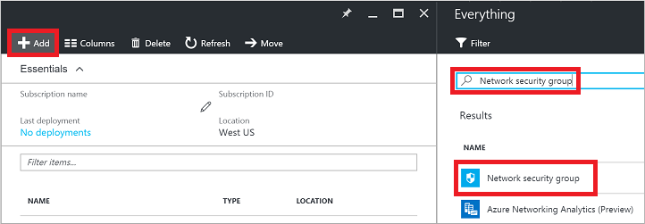
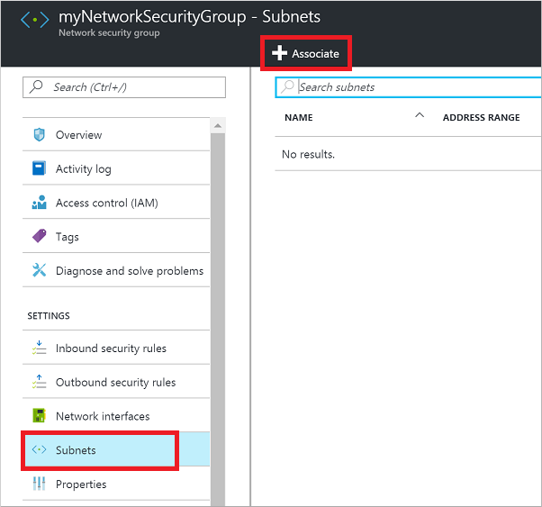
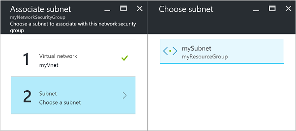

<properties
   pageTitle="Öffnen eines virtuellen Computers Verwenden des Portals Azure-Ports | Microsoft Azure"
   description="Informationen Sie zum Öffnen eines Ports / erstellen einen Endpunkt auf Ihrem Windows virtueller Computer mithilfe des Ressource-Manager-Bereitstellung Modells Azure-Portal"
   services="virtual-machines-windows"
   documentationCenter=""
   authors="iainfoulds"
   manager="timlt"
   editor=""/>

<tags
   ms.service="virtual-machines-windows"
   ms.devlang="na"
   ms.topic="article"
   ms.tgt_pltfrm="vm-windows"
   ms.workload="infrastructure-services"
   ms.date="10/27/2016"
   ms.author="iainfou"/>

# Öffnen eines virtuellen Computers Ports in Azure mithilfe des Azure-Portals
[AZURE.INCLUDE [virtual-machines-common-nsg-quickstart](../../includes/virtual-machines-common-nsg-quickstart.md)]

## Symbolleiste Befehle
Sie können auch [mithilfe der PowerShell Azure Schritte ausführen](virtual-machines-windows-nsg-quickstart-powershell.md).

Erstellen Sie zuerst Ihre Netzwerk-Sicherheitsgruppe an. Wählen Sie eine Ressourcengruppe im Portal aus, klicken Sie auf **Hinzufügen**, und klicken Sie dann suchen Sie, und wählen Sie 'Netzwerk-Sicherheitsgruppe':

Geben Sie einen Namen für Ihr Netzwerk-Sicherheitsgruppe, wählen Sie aus oder erstellen Sie eine Ressourcengruppe, und wählen Sie einen Speicherort aus. Klicken Sie auf **Erstellen** klicken Sie abschließend:

Wählen Sie Ihre neue Netzwerk-Sicherheitsgruppe aus. Wählen Sie 'Regeln eingehende Sicherheit', und klicken Sie auf die Schaltfläche **Hinzufügen** , um eine Regel zu erstellen:

Geben Sie einen Namen für die neue Regel. Port 80 ist standardmäßig bereits eingegeben. Diese Blade ist, in dem Sie die Quelle, Protokoll und Ziel beim weiteren Regeln in Ihrem Netzwerk-Sicherheitsgruppe hinzufügen ändern möchten. Klicken Sie auf **OK** , um die Regel zu erstellen:

Der letzte Schritt ist, Ihr Netzwerk-Sicherheitsgruppe mit einem Subnetz oder eine bestimmte Schnittstelle zugeordnet werden soll. Ordnen Sie die Sicherheitsgruppe Netzwerk ein Subnetz. Wählen Sie 'Subnets', und klicken Sie auf **zuordnen**:

Wählen Sie das virtuelle Netzwerk, und wählen Sie dann auf die entsprechende Subnetz:

Sie haben nun erstellt eine Sicherheitsgruppe Netzwerk, erstellt eine eingehende Regel, die Datenverkehr auf Port 80 ermöglicht, und ein Subnetz zugeordnet. Alle virtuellen Computern, die Verbindung zu diesem Subnetz sind auf Port 80 erreichbar.

## Weitere Informationen zum Netzwerk-Sicherheitsgruppen
Hier die Symbolleiste Befehle ermöglichen Ihnen, Einstieg und die Verwendung mit den Datenverkehr an Ihre virtuellen Computer entdeckt aufzurufen. Netzwerk-Sicherheitsgruppen enthalten zahlreiche hervorragende Features und Genauigkeit zum Steuern des Zugriffs auf Ihre Ressourcen. Weitere Informationen zum [Erstellen einer Sicherheitsgruppe Netzwerk und hier ACL-Regeln](../virtual-network/virtual-networks-create-nsg-arm-ps.md).

Sie können als Teil der Ressourcenmanager Azure Vorlagen Sicherheitsgruppen Netzwerk und ACL-Regeln definieren. Weitere Informationen zum [Erstellen von Netzwerk-Sicherheitsgruppen mit Vorlagen](../virtual-network/virtual-networks-create-nsg-arm-template.md)finden.

Wenn Sie mit Port-Weiterleitung einen eindeutigen externen Port mit einem internen Anschluss Ihrer virtuellen Computers zuordnen müssen, verwenden Sie ein Lastenausgleich und Regeln (Netzwerkadressübersetzung). Angenommen, möchten Sie verfügbar machen TCP-8080 extern und Port 80 eines virtuellen Computers TCP gerichtete Datenverkehr haben. Weitere Informationen zum [Erstellen eines Internet zugänglichen Lastenausgleich](../load-balancer/load-balancer-get-started-internet-arm-ps.md).

## Nächste Schritte
In diesem Beispiel haben Sie eine einfache Regel HTTP-Verkehr zulassen erstellt. Finden Sie Informationen zum Erstellen von ausführlichere Umgebungen in den folgenden Artikeln:

- [Azure Ressourcenmanager (Übersicht)](../azure-resource-manager/resource-group-overview.md)
- [Was ist ein Netzwerk Sicherheit Gruppe (NSG)?](../virtual-network/virtual-networks-nsg.md)
- [Übersicht über die Azure Ressourcenmanager für Lastenausgleich](../load-balancer/load-balancer-arm.md)
