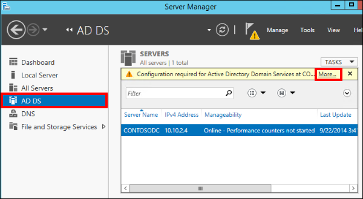
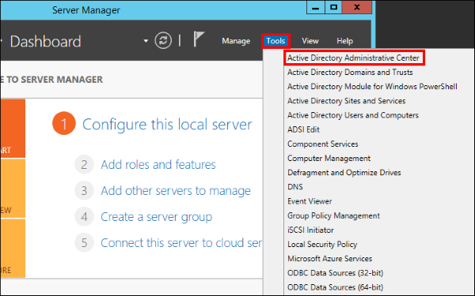
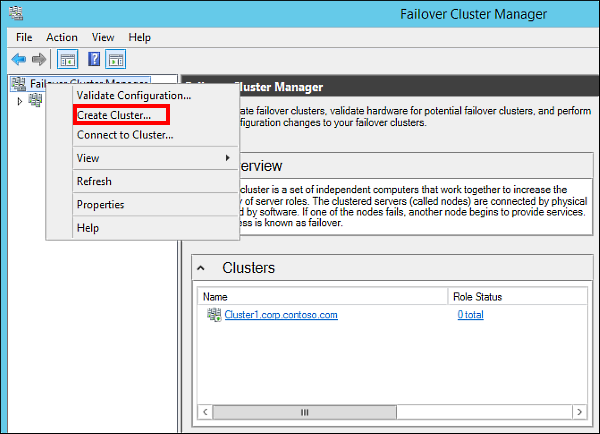
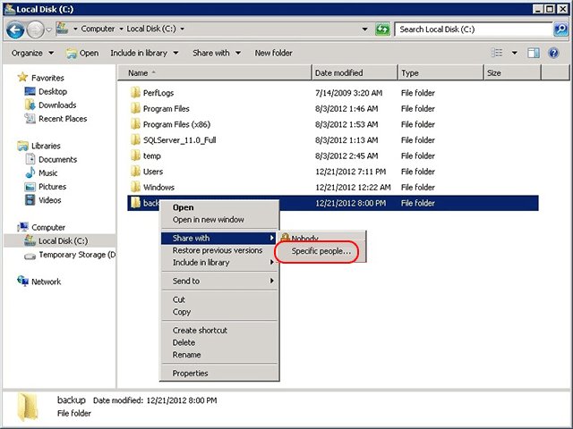

<properties
    pageTitle="Konfigurieren Sie immer auf Verfügbarkeit Gruppe Azure-virtuellen Computer manuell - Microsoft Azure"
    description="Erstellen einer immer auf Verfügbarkeit Gruppe mit Azure-virtuellen Computern an. In diesem Lernprogramm verwendet die Benutzeroberfläche und Tools hauptsächlich anstatt scripting."
    services="virtual-machines"
    documentationCenter="na"
    authors="MikeRayMSFT"
    manager="timlt"
    editor="monicar"
    tags="azure-service-management" />
<tags
    ms.service="virtual-machines"
    ms.devlang="na"
    ms.topic="article"
    ms.tgt_pltfrm="vm-windows-sql-server"
    ms.workload="infrastructure-services"
    ms.date="10/21/2016"
    ms.author="MikeRayMSFT" />

# <a name="configure-always-on-availability-group-in-azure-vm-manually---resource-manager"></a>Konfigurieren Sie immer auf Verfügbarkeit Gruppe Azure-virtuellen Computer manuell - Ressourcenmanager

> [AZURE.SELECTOR]
- [Ressourcenmanager: Vorlage](virtual-machines-windows-portal-sql-alwayson-availability-groups.md)
- [Ressourcenmanager: Manueller](virtual-machines-windows-portal-sql-alwayson-availability-groups-manual.md)
- [Klassische: Benutzeroberfläche](virtual-machines-windows-classic-portal-sql-alwayson-availability-groups.md)
- [Klassische: PowerShell](virtual-machines-windows-classic-ps-sql-alwayson-availability-groups.md)

<br/>

In diesem Lernprogramm durchgehende veranschaulicht die SQL Server Verfügbarkeit Gruppen auf Azure Ressource-Manager virtuellen Computern implementieren. 

In diesem Lernprogramm erstellen Sie die folgenden Elemente:

- Ein virtuelles Netzwerk mit zwei Subnetzen, einschließlich einer Front-End- und Back-End-Subnetz

- Legen Sie zwei Domain Controller in einer Verfügbarkeit mit einer Domäne Active Directory (AD) 

- Zwei SQL Server-virtuellen Computern in einem Satz Verfügbarkeit in die Back-End-Subnetz bereitgestellt und der AD-Domäne

- Eine 3-Knoten WSFC Cluster mit Quorummodell die Mehrzahl der Knoten

- Eine interne Lastenausgleich mit eine oder mehrere IP-Adressen auf eine oder mehrere Verfügbarkeit Gruppe Listener unterstützen

- Eine Gruppe Verfügbarkeit mit zwei synchroner Commit Replikaten einer Datenbank Verfügbarkeit

In der Abbildung unten ist die Lösung grafisch dargestellt.


Dies ist eine mögliche Konfiguration. Sie können es für für Ihren Anforderungen ändern. Beispielsweise können Sie die Anzahl der virtuellen Computern reduzieren, mithilfe eines Domänencontrollers als Quorum Dateifreigabenzeuge. Dies würde die Anzahl der virtuellen Computern für eine Gruppe von zwei-Replikat Verfügbarkeit verringern. Diese Methode verringert die Anzahl der virtuellen Computer mit einem aus der Lösung.

In diesem Lernprogramm erstellt eine einzelne Verfügbarkeit-Gruppe mit einer IP-Adresse für die Zuhörer. Sie können auch eine IP-Adresse und dem Zuhörer für jede mehrere Verfügbarkeit Gruppen erstellen. Jede IP-Adresse verwendet dieselbe Lastenausgleich. Um mehrere IP-Adresse(n) auf ein Lastenausgleich konfigurieren möchten, verwenden Sie PowerShell aus. Weitere Informationen finden Sie unter [Konfigurieren ein oder mehrere immer auf Verfügbarkeit Gruppe Listeners - Ressourcenmanager](virtual-machines-windows-portal-sql-ps-alwayson-int-listener.md).

Ein paar Stunden durchführen dieses Lernprogramms benötigt werden, da Sie erstellen und konfigurieren mehrere Azure-virtuellen Computern müssen. Sie können auch automatisch diese gesamte Lösung erstellen. Im Portal Azure wird immer auf Verfügbarkeit Gruppen mit einem Zuhörer eine Katalog eingerichtet. Die Einrichtung Katalog konfiguriert alles, was Sie Verfügbarkeit Gruppen automatisch benötigen. Weitere Informationen finden Sie unter [Portal - Ressourcenmanager](virtual-machines-windows-portal-sql-alwayson-availability-groups.md). 

[AZURE.INCLUDE [availability-group-template](../../includes/virtual-machines-windows-portal-sql-alwayson-ag-template.md)]

In diesem Lernprogramm wird Folgendes vorausgesetzt:

- Sie verfügen bereits über ein Azure-Konto.

- Sie wissen bereits, wie eine SQL Server virtuellen Computer aus dem virtuellen Computern Katalog über die Benutzeroberfläche bereitstellen. Weitere Informationen finden Sie unter [Bereitstellung eines SQL Server virtuellen Computers auf Azure](virtual-machines-windows-portal-sql-server-provision.md)

- Sie verfügen bereits über ein grundlegendes Verständnis der Verfügbarkeit von Gruppen. Weitere Informationen finden Sie unter [Immer auf Verfügbarkeit Gruppen (SQL Server)](https://msdn.microsoft.com/library/hh510230.aspx).

>[AZURE.NOTE] Wenn Sie Verfügbarkeit Entwurfsphase mit SharePoint interessiert sind, finden Sie auch unter [Konfigurieren von SQL Server 2012 immer auf Verfügbarkeit Gruppen für SharePoint 2013](https://technet.microsoft.com/library/jj715261.aspx).

## <a name="create-resource-group"></a>Ressourcengruppe erstellen

1. Melden Sie sich mit dem [Azure-Portal](http://portal.azure.com)aus. 

2. Klicken Sie auf **+ neu** , und geben Sie im Suchfenster **Marketplace** **Ressourcengruppe** aus.
 
    

1. Klicken Sie auf **Ressourcengruppe** 

    

1. Klicken Sie auf **Erstellen**. 

2. Geben Sie in das Blade **Ressourcengruppe** unter **Gruppe Ressourcenname** **SQL-HA-RG**

3. Wenn Sie mehrere Azure-Abonnements haben, stellen Sie sicher, dass das Abonnement Azure-Abonnement ist die Verfügbarkeit Gruppe erstellen möchten. 

4. Wählen Sie einen Speicherort aus. Der Speicherort ist der Azure Region, in der Gruppe Verfügbarkeit erstellen werden soll. In diesem Lernprogramm werden wir Azure an alle Ressourcen erstellen. 

5. Stellen Sie sicher, dass die **Pin zum Dashboard** aktiviert ist. Diese Einstellung optional stellen eine Verknüpfung für die Ressourcengruppe auf dem Azure Portals Dashboard. 

6. Klicken Sie auf **Erstellen** , um die Ressourcengruppe erstellen.

Azure erstellt die Ressourcengruppe und Stifte eine Verknüpfung mit der Ressourcengruppe im Portal.

## <a name="create-network-and-subnets"></a>Erstellen von Netzwerk- und Subnetze

Im nächsten Schritt wird die Netzwerke und Subnetze in Azure Ressourcengruppe erstellen.

Die Lösung verwendet eine virtuelles Netzwerk mit unterschiedlichen zwei. Die [Virtuelle Network (Übersicht)](../virtual-network/virtual-networks-overview.md) enthält weitere Informationen zu Netzwerken in Azure.

So erstellen Sie das virtuelle Netzwerk

1.  Klicken Sie auf das Portal Azure klicken Sie auf der neuen Ressourcengruppe auf, und klicken Sie auf **+** um ein neues Element der Ressourcengruppe hinzuzufügen. Azure wird das Blade **Alles** geöffnet. 

    

1.  Suchen Sie nach **virtuelles Netzwerk**.

      

1.  Klicken Sie auf **virtuellen Netzwerk**.

1.  Klicken Sie in das Blade **virtuellen Netzwerk** auf das Modell zur Bereitstellung von **Ressourcen-Manager** , und klicken Sie auf **Erstellen**.

      

1.  Konfigurieren Sie das virtuelle Netzwerk auf das Blade **virtuelles Netzwerk erstellen** . 

    Die folgende Tabelle zeigt die Einstellungen für das virtuelle Netzwerk.

  	| **Feld**                | Wert                                    |
  	| ------------------------ | ---------------------------------------- |
  	| **Namen**                 | autoHAVNET                               |
  	| **Adresse-Speicherplatz**        | 10.0.0.0/16                              |
  	| **Subnetnamen**          | Subnetz-1                                 |
  	| **Subnetzadressbereichs** | 10.0.0.0/24                              |
  	| **Abonnement**         | Geben Sie das Abonnement, das Sie verwenden möchten. Wenn Sie nur ein Abonnement besitzen, kann dies leer sein. |
  	| **Speicherort**             | Geben Sie den Azure-Speicherort.              |

     Ihre Adresse Leerzeichen und Subnetz Adressbereichs kann aus der Tabelle abweichen. Abhängig von Ihrem Abonnement Azure wird gibt an eine verfügbare Adresse Leerzeichen und die entsprechenden Subnetzadressbereichs. Ist keine ausreichende Adresse Platz verfügbar, verwenden Sie ein anderes Abonnement aus. 

1.  Klicken Sie auf **Erstellen**

    

Azure gibt Sie dem Portal Dashboard und benachrichtigt Sie, wenn Sie der neuen Website erstellt wurde.

### <a name="create-the-second-subnet"></a>Erstellen Sie das zweite Subnetz

An diesem Punkt enthält virtuelle Netzwerks ein Subnetz, mit dem Namen Subnetz-1. Verwenden Sie die Domänencontroller dieses Subnetz aus. Verwenden Sie die SQL Server eine zweite Subnetz mit dem Namen **Subnetz Basis 2 zurück**. So konfigurieren Sie Subnetz Basis 2 zurück

1. Klicken Sie auf dem Dashboard auf die Ressourcengruppe, die Sie erstellt haben, **SQL-HA-RG**. Suchen Sie im Netzwerk aus, in der Ressourcengruppe unter **Ressourcen**.

    Wenn **SQL-HA-RG** nicht angezeigt wird, finden Sie es, indem **Ressourcengruppen** und Filtern nach den Namen der Ressource Gruppe ein.

1. Klicken Sie auf **AutoHAVNET** in der Liste der Ressourcen. Azure wird das Netzwerk Konfiguration Blade geöffnet.

1. **AutoHAVNET** virtuelle Netzwerk, klicken Sie auf **Alle Einstellungen.**

1. **Auf die** Einstellungen** Blade, klicken Sie auf **Subnetze **.
 
    Beachten Sie das Subnetz, das Sie bereits erstellt haben. 
 
    

1. Erstellen Sie ein zweites Subnetz an. Klicken Sie auf **+ Subnetz gehören**. 
 
1. Konfigurieren Sie das Blade **Subnetz hinzufügen** im Subnetz durch Eingeben der **Subnetz-2** unter **Namen**ein. Azure gibt automatisch einen gültigen **Adressbereichs**an. Stellen Sie sicher, dass diese Adressbereich mindestens 10 Adressen enthält. In einer Umgebung Herstellung können Sie mehrere Adressen erfordern. 
 
1. Klicken Sie auf **OK**.
 
    

Hier finden Sie eine Zusammenfassung der Konfiguration Einstellungen für das virtuelle Netzwerk und beide Subnetze an.

| **Feld**                | Wert                                    |
| ------------------------ | ---------------------------------------- |
| **Namen**                 | **autoHAVNET**                           |
| **Adresse-Speicherplatz**        | Abhängig von Leerzeichen verfügbare Adresse Ihres Abonnements. Ein häufig angegebener Wert ist 10.0.0.0/16 |
| **Subnetnamen**          | **Subnetz-1**                             |
| **Subnetzadressbereichs** | Abhängig von verfügbaren Adressbereiche in Ihr Abonnement. Ein häufig angegebener Wert ist 10.0.0.0/24 an. |
| **Subnetnamen**          | **Subnetz Basis 2 zurück**                             |
| **Subnetzadressbereichs** | Abhängig von verfügbaren Adressbereiche in Ihr Abonnement. Ein häufig angegebener Wert ist 10.0.1.0/24. |
| **Abonnement**         | Geben Sie das Abonnement, das Sie verwenden möchten. |
| **Ressourcengruppe**       | **SQL-HA-RG**                            |
| **Speicherort**             | Geben Sie den gleichen Speicherort, den Sie für die Ressourcengruppe ignoriert. |

## <a name="create-availability-sets"></a>Verfügbarkeit von Gruppen erstellen

Bevor Sie Erstellen von virtuellen Computern, müssen Sie Verfügbarkeit Mengen erstellen. Ausfall geplanten oder nicht geplanten Wartung Ereignisse reduzieren Verfügbarkeit Gruppen Eine Sammlung von Azure Verfügbarkeit ist eine logische Gruppe von Ressourcen, die Azure auf physische Fehlerstrukturanalyse- und aktualisieren Domänen platziert wurde. Fehlerstrukturanalyse-Domäne wird sichergestellt, dass die Verfügbarkeit der Gruppenmitglieder separate Power und Netzwerk-Ressourcen. Eine Domäne aktualisieren: Damit ist sichergestellt, dass die Verfügbarkeit der Gruppenmitglieder nicht für die Wartung zur gleichen Zeit geschaltet sind nach unten. [Verwalten der Verfügbarkeit von virtuellen Computern](virtual-machines-windows-manage-availability.md).

Sie benötigen zwei Verfügbarkeit Sätze. Eine ist für die Domänencontroller. Die zweite wird für die SQL Server.

Zum Erstellen einer Gruppe Verfügbarkeit der Ressourcengruppe wechseln Sie, und klicken Sie auf **Hinzufügen**. Filtern der Ergebnisse durch Eingeben der **Verfügbarkeit festzulegen**. Klicken Sie in den Suchergebnissen auf **Verfügbarkeit festzulegen** . Klicken Sie auf **Erstellen**.

Konfigurieren Sie zwei Sätze von Verfügbarkeit gemäß der Parameter in der folgenden Tabelle aus.

| **Feld**          | Festlegen von Domänencontroller Verfügbarkeit | Verfügbarkeit von SQL Server festlegen |
| ------------------ | ---------------------------------- | --------------------------- |
| **Namen**           | adavailabilitySet                  | sqlAvailabilitySet          |
| **Ressourcengruppe** | SQL-HA-RG                          | SQL-HA-RG                   |
| **Fehlerstrukturanalyse-Domänen**  | 3                                  | 3                           |
| **Aktualisieren von Domänen** | 5                                  | 3                           |

Nach dem Erstellen der Verfügbarkeit Sätze kehren Sie zu der Ressourcengruppe Azure-Portal zurück.

## <a name="create-domain-controllers"></a>Erstellen von Domain Controller

Nachdem Sie das Netzwerk erstellt haben, Lastenausgleich Subnetze, Verfügbarkeit Sets und eine mit Internetzugang. Sie können nun die virtuellen Computer für die Domänencontroller erstellen.

### <a name="create-the-virtual-machines-for-the-domain-controllers"></a>Erstellen Sie die virtuellen Computer für die Domänencontroller

Zum Erstellen und konfigurieren die Domänencontroller, kehren Sie zu der **SQL-HA-RG** Ressourcengruppe zurück.

1. Klicken Sie auf Hinzufügen. Das Blade **Alles** wird geöffnet.

2. Typ, **Windows Server 2012 R2 Datacenter**. 

3. Klicken Sie auf **Windows Server 2012 R2 Datacenter**. Stellen Sie in der **Windows Server 2012 R2 Datacenter** Blade sicher, dass das Modell zur Bereitstellung von **Ressourcen-Manager** ist, und klicken Sie auf **Erstellen**. Azure wird das **Erstellen von virtuellen Computern** Blade geöffnet. 

Die vorherigen Schritte zweimal, um zwei virtuellen Computern zu erstellen. Benennen Sie die zwei virtuellen Computern an:

- AD-primär-dc
- AD-sekundären-dc

 >[AZURE.NOTE] **AD-sekundären-dc** ist eine optionale Komponente in Active Directory-Domänendiensten hohe Verfügbarkeit bereitstellen. 

Die folgende Tabelle zeigt die Einstellungen für diese zweier Autos.

| **Feld** | Wert 
| ----- | ---- 
| **Benutzername** | DomainAdmin "
| **Kennwort** | Contoso! 0000 |
| **Abonnement** | *Ihr Abonnement* |
| **Ressourcengruppe** | SQL-HA-RG |
| **Speicherort** | *Ihres Standorts* 
| **Größe** | D1_V2 (Standard)
| **Speichertyp** | Standard
| **Speicher-Konto** | *Automatisch erstellt*
| **Virtuelles Netzwerk** | autoHAVNET
| **Subnetz** | Subnetz-1
| **Öffentliche IP-Adresse** | *Denselben Namen wie dem virtuellen Computer*
| **Netzwerk-Sicherheitsgruppe** | *Denselben Namen wie dem virtuellen Computer*
| **Diagnose** | Aktiviert
| **Diagnose Speicher-Konto** | *Automatisch erstellt*
| **Festlegen der Verfügbarkeit** | adAvailabilitySet

>[AZURE.NOTE] Sie können nicht ändern, die Verfügbarkeit eines virtuellen Computers festgelegt werden, nachdem sie erstellt wurde.

Azure erstellt die virtuellen Computer an.

Nach der Erstellung der virtuellen Computern Konfigurieren des Domänencontrollers.

### <a name="configure-the-domain-controller"></a>Konfigurieren des Domänencontrollers

Konfigurieren Sie in den folgenden Schritten den Computer **Ad-primär-dc** als Domänencontroller für corp.contoso.com aus.

1. Klicken Sie im Portal öffnen Sie die **SQL-HA-RG** Ressourcengruppe, und wählen Sie den Computer **Ad-primär-dc** . Klicken Sie auf das Blade **Ad-primär-dc** auf **Verbinden** , um eine RDP-Datei für den Remotezugriff desktop geöffnet.
 
    

2. Melden Sie sich mit Ihrem konfigurierten Administratorkonto (**\DomainAdmin**) und das Kennwort (**Contoso! 0000**).

3. Standardmäßig sollte das **Server-Manager** -Dashboard angezeigt werden.

4. Klicken Sie auf den Link **Hinzufügen Rollen und Funktionen** auf dem Dashboard.

    
 
5. Wählen Sie **Weiter** , bis Sie zum Abschnitt **Serverrollen** gelangen.

6. Wählen Sie die Rollen **Active Directory-Domänendienste** und **DNS-Server** aus. Wenn Sie dazu aufgefordert werden, fügen Sie zusätzliche Features von Ausführenden erforderlich.

    >[AZURE.NOTE] Windows gewarnt, dass keine statische IP-Adresse. Wenn Sie die Konfiguration testen, klicken Sie auf Weiter. Legen Sie für die Herstellung Szenarien die IP-Adresse auf statischen in der Azure-Portal oder [Verwenden Sie zum Festlegen der statischen IP-Adresse des Computers Domänencontroller PowerShell](../virtual-network/virtual-networks-reserved-private-ip.md)ein.

    

7. Klicken Sie auf **Weiter** , bis Sie den Abschnitt **zur Bestätigung** erreicht haben. Aktivieren Sie das Kontrollkästchen **den Zielserver automatisch bei Bedarf neu zu starten** .

8. Klicken Sie auf **Installieren**.

9. Nach der Installation des Features abgeschlossen haben, kehren Sie zu dem **Server-Manager** -Dashboard zurück.

10. Die Option neue **AD DS** im linken Bereich.

11. Klicken Sie auf den Link auf der gelben Leiste der Warnung **mehr** .

    

12. Klicken Sie in der Spalte **Aktion** des Dialogfelds **Alle Server Aufgabendetails** auf **Heraufstufen dieser Server zu einem Domäne herauf**.

13. Verwenden Sie in der **Active Directory Konfiguration Assistent zum Domänendiensten**die folgenden Werte ein:

  	| **Seite**                      | Einstellung                                  |
  	| ----------------------------- | ---------------------------------------- |
  	| **Bereitstellungskonfiguration**  | **Hinzufügen einer neuen Gesamtstruktur** = ausgewählte<br/>**Quadratwurzel Domänennamen** corp.contoso.com = |
  	| **Domänencontroller-Optionen** | **DSRM-Kennwort** = Contoso! 0000<br/>**Kennwort bestätigen** = Contoso! 0000 |
 
1. Klicken Sie auf **Weiter** , bis die anderen Seiten des Assistenten zu gelangen. Stellen Sie sicher, dass Sie die folgende Meldung angezeigt wird, klicken Sie auf der Seite **Erforderliche Komponenten prüfen** : **Alle vorbereitende Prüfungen erfolgreich übergeben**. Beachten Sie, dass sollten Sie alle entsprechenden Warnhinweise überprüfen, aber es möglich ist, die Installation fortsetzen.

1. Klicken Sie auf **Installieren**. **Ad-primär-dc** virtuellen Computers wird automatisch neu gestartet.

### <a name="configure-the-second-domain-controller"></a>Konfigurieren des zweiten Domänencontrollers

Nachdem der primäre Domänencontroller neu gestartet wurde, können Sie den zweiten Domänencontroller konfigurieren. Mit diesem optionale Schritt ist für eine hohe Verfügbarkeit. Wenn Sie diesen Schritt abgeschlossen haben, müssen Sie die private IP-Adresse für den Domänencontroller kennen. Sie können dies vom Azure-Portal erhalten. Wie folgt vor, um den zweiten Domänencontroller konfigurieren.

1. Melden Sie sich mit dem **Ad-primär-dc** Computer an. 

2. Öffnen Sie Remote Desktop, und stellen eine Verbindung zu den sekundären Domänencontroller IP-Adresse. Wenn Sie die IP-Adresse der Domänencontroller sekundäre nicht kennen, wechseln Sie zu der Azure-Portal, und überprüfen Sie die Adresse für den sekundären Domänencontroller Netzwerkschnittstelle zugewiesen. 

3. Ändern der bevorzugten DNS-Serveradresse auf die Adresse für den Domänencontroller. 

4. Starten Sie die RDP-Datei auf dem primären Domänencontroller (**Ad-primär-dc**), und melden Sie sich bei dem virtuellen Computer mithilfe Ihrer konfigurierten Administratorkonto (**BUILTIN\DomainAdmin**) und das Kennwort (**Contoso! 0000**).

5. Starten Sie von der primäre Domäne einen Remotedesktop **Ad-sekundären-dc** mithilfe der IP-Adresse ein. Verwenden Sie den gleichen Konto und das Kennwort ein.

6. Sobald Sie angemeldet sind, sollte das **Server-Manager** -Dashboard angezeigt werden. Klicken Sie im linken Bereich auf **Lokale Server** .

7. Wählen Sie den Link **IPv4-Adresse zugewiesen von DHCP, IPv6 aktiviert** .

8. Wählen Sie das Netzwerksymbol, klicken Sie im Fenster **Netzwerk Verbindungen** .
 
    
 
9. Klicken Sie auf der Befehlsleiste auf **Ändern der für diese Verbindung** (abhängig von der Größe des Fensters, möglicherweise müssen Sie den richtigen Doppelpfeil, um diesen Befehl anzuzeigen klicken Sie auf).

10. Wählen Sie **Internet Protocol Version 4 (TCP/IPv4)** aus, und klicken Sie auf Eigenschaften.

11. Aktivieren Sie verwenden der folgende DNS-Server Adressen, und geben die Adresse der primären Domänen-Controller in **bevorzugte DNS-Server**.

12. Der Adresse eines virtuellen Computers im Subnetz Subnetz-1 in das Azure virtuelle Netzwerk zugeordnet ist, und diesen virtuellen Computer ist **Ad-primär-dc**aus. Um **Ad-primär-dc**IP-Adresse zu überprüfen, verwenden Sie den **Nslookup Ad-primär-dc** in der Befehlszeile, wie unten dargestellt.
 
    
 
     >[AZURE.NOTE] Nach dem Einrichten der DNS-Einträge, verlieren Sie möglicherweise die RDP-Sitzung auf dem Mitgliedsserver. Wenn Sie dies tun, starten Sie den virtuellen Computer vom Azure-Portal neu.
      
1. Klicken Sie auf **OK** und dann auf **Schließen** um die Änderungen zu übernehmen. Sie können nun den virtuellen Computer mit **corp.contoso.com**verknüpfen können.

2. Wiederholen Sie die Schritte aus, dass zum Erstellen des ersten Domänencontrollers, es sei denn, in der **Domäne Services Konfiguration Assistenten zum Active Directory**verwenden Sie die folgenden Werte:

| Seite                          | Einstellung                                  |
| ----------------------------- | ---------------------------------------- |
| **Bereitstellungskonfiguration**  | **Hinzufügen einer Domänencontroller zu einer vorhandenen Domäne** = ausgewählte<br/>**Stamm** = corp.contoso.com |
| **Domänencontroller-Optionen** | **DSRM-Kennwort** = Contoso! 0000<br/>**Kennwort bestätigen** = Contoso! 0000 |


### <a name="configure-domain-accounts"></a>Domänenkonten konfigurieren

In den nächsten Schritten konfigurieren Sie die Active Directory (AD) Konten zur späteren Verwendung.

1. Melden Sie sich wieder an den Computer **Ad-primär-dc** an.

2. **Server** -Manager wählen Sie **Tools** aus, und klicken Sie dann auf **Active Directory Administrative Center**.

    

3. In den **Active Directory Administrative Center** select **Unternehmen (lokal)** aus dem linken Bereich.

4. Klicken Sie im rechten Bereich der **Aufgaben** wählen Sie **neu** , und klicken Sie dann auf **Benutzer**. Verwenden Sie die folgenden Einstellungen:

  	| Einstellung                    | Wert        |
  	| -------------------------- | ------------ |
    **Vorname**             | Installieren      |
    **Benutzer SamAccountName**    | Installieren      |
    **Kennwort**               | Contoso! 0000 |
    **Kennwort bestätigen**       | Contoso! 0000 |
    **Andere Kennwortoptionen** | Ausgewählt     |
    **Kennwort läuft nie ab.** | Aktiviert      |
 
1. Klicken Sie auf **OK** , um den Benutzer **Installieren** zu erstellen. Verwenden Sie dieses Konto Failovercluster und der Verfügbarkeit Gruppe konfigurieren.

2. Erstellen Sie zwei zusätzliche Benutzer mit denselben Schritten: **CORP\SQLSvc1** und **CORP\SQLSvc2**. SQL Server-Dienste verwenden diese Konten. Als Nächstes erteilen Sie **CORP\Install** die notwendigen Berechtigungen zum Konfigurieren von Windows Service Failover Cluster (WSFC).

3. Wählen Sie in der **Active Directory Administrative Center** **Unternehmen (lokal)** im linken Bereich ein. Klicken Sie im rechten Bereich **Aufgaben** auf **Eigenschaften**.
 
    
 
4. Wählen Sie **Erweiterungen**aus, und klicken Sie dann auf die Schaltfläche **Erweitert** auf der Registerkarte **Sicherheit** .

5. Klicken Sie im Dialogfeld **Erweiterte Sicherheitseinstellungen für Unternehmen** . Klicken Sie auf **Hinzufügen**.

6. Klicken Sie auf, **Wählen Sie eine der Tilgungsanteile aus**. Suchen Sie nach **CORP\Install**. Klicken Sie auf **OK**.

7. Wählen Sie die Berechtigungen **alle Eigenschaften lesen** und **Objekte Computer erstellen** .

    

8. Klicken Sie auf **OK**, und klicken Sie dann erneut auf **OK** . Schließen Sie das Eigenschaftenfenster Unternehmen ein.

Jetzt, da Sie die Konfiguration von Active Directory und der Benutzerobjekte abgeschlossen haben, erstellen Sie zwei SQL Server virtuellen Computern, eine Zeugenserver virtueller Computer. Klicken Sie dann teilnehmen an alle drei zu der Domäne.

## <a name="create-sql-servers"></a>Erstellen von SQL Server

###<a name="create-and-configure-the-sql-server-vms"></a>Erstellen und Konfigurieren der SQL Server-virtuellen Computern

Erstellen Sie als Nächstes drei virtuellen Computern, einschließlich zwei SQL Server-virtuellen Computern und ein WSFC Knoten. Um jeden der virtuellen Computern erstellen, kehren Sie zum **SQL-HA-RG** Ressourcengruppe aus, klicken Sie auf **Hinzufügen**, suchen Sie nach der entsprechenden Katalogelement, **virtuellen Computern**und **-Katalog aus**. Verwenden Sie dann die Vorlagen in der folgenden Tabelle beim Erstellen der virtuellen Computern.

| Seite                                     | VM1                                      | VM2                                      | VM3                                      |
| ---------------------------------------- | ---------------------------------------- | ---------------------------------------- | ---------------------------------------- |
| Wählen Sie das entsprechende Katalogelement      | **Windows Server 2012 R2 Datacenter**    | **SQL Server 2014 SP1 Enterprise unter Windows Server 2012 R2** | **SQL Server 2014 SP1 Enterprise unter Windows Server 2012 R2** |
| Konfiguration des virtuellen Computers **Grundlagen** | **Name** = Cluster-Dateifreigabenzeuge<br/>**Benutzername** = DomainAdmin "<br/>**Kennwort** = Contoso! 0000<br/>**Abonnement** = Ihres Abonnements<br/>**Ressourcengruppe** = SQL-HA-RG<br/>**Ort** = Ihres Standorts Azure | **Namen** Sqlserver-0 =<br/>**Benutzername** = DomainAdmin "<br/>**Kennwort** = Contoso! 0000<br/>**Abonnement** = Ihres Abonnements<br/>**Ressourcengruppe** = SQL-HA-RG<br/>**Ort** = Ihres Standorts Azure | **Name** = Sqlserver-1<br/>**Benutzername** = DomainAdmin "<br/>**Kennwort** = Contoso! 0000<br/>**Abonnement** = Ihres Abonnements<br/>**Ressourcengruppe** = SQL-HA-RG<br/>**Ort** = Ihres Standorts Azure |
| Konfiguration des virtuellen Computers **Größe**   | DS1 (1 Core, 3,5 GB Arbeitsspeicher)              | **Größe** = DS-2 (2 Kerne, 7 GB Arbeitsspeicher)   | **Größe** = DS-2 (2 Kerne, 7 GB Arbeitsspeicher)   |
|Konfiguration des virtuellen Computers **Einstellungen**|**Speicher** = Premium (SSD)<br/>**NETZWERKSUBNETS** = AutoHAVNET<br/>**Speicher-Konto** verwenden ein Speicherkonto automatisch generierte =<br/>**Subnetz** = subnet-2(10.1.1.0/24)<br/>**Öffentliche IP-Adresse** = keine<br/>**Netzwerk-Sicherheitsgruppe** = keine<br/>**Überwachung Diagnose** = aktiviert<br/>**Diagnose Speicherkonto** =, verwenden Sie ein automatisch generiertes Speicherkonto<br/>**Festlegen der Verfügbarkeit** = SqlAvailabilitySet<br/>|**Speicher** = Premium (SSD)<br/>**NETZWERKSUBNETS** = AutoHAVNET<br/>**Speicher-Konto** verwenden ein Speicherkonto automatisch generierte =<br/>**Subnetz** = subnet-2(10.1.1.0/24)<br/>**Öffentliche IP-Adresse** = keine<br/>**Netzwerk-Sicherheitsgruppe** = keine<br/>**Überwachung Diagnose** = aktiviert<br/>**Diagnose Speicherkonto** =, verwenden Sie ein automatisch generiertes Speicherkonto<br/>**Festlegen der Verfügbarkeit** = SqlAvailabilitySet<br/>|**Speicher** = Premium (SSD)<br/>**NETZWERKSUBNETS** = AutoHAVNET<br/>**Speicher-Konto** verwenden ein Speicherkonto automatisch generierte =<br/>**Subnetz** = subnet-2(10.1.1.0/24)<br/>**Öffentliche IP-Adresse** = keine<br/>**Netzwerk-Sicherheitsgruppe** = keine<br/>**Überwachung Diagnose** = aktiviert<br/>**Diagnose Speicherkonto** =, verwenden Sie ein automatisch generiertes Speicherkonto<br/>**Festlegen der Verfügbarkeit** = SqlAvailabilitySet<br/>
|Konfiguration des virtuellen Computers **SQL Server-Einstellungen**|Nicht verfügbar|**SQL-Konnektivität** = privat (innerhalb von Virtual Network)<br/>**Port** 1433 =<br/>**SQL-Authentifizierung** = deaktivieren<br/>**Konfiguration von Speicher** = Allgemein<br/>**Automatische Patch** = Sonntag um 2:00 Uhr<br/>**Automatische Sicherung** = deaktiviert</br>**Integration von Azure Schlüssel Tresor** = deaktiviert|**SQL-Konnektivität** = privat (innerhalb von Virtual Network)<br/>**Port** 1433 =<br/>**SQL-Authentifizierung** = deaktivieren<br/>**Konfiguration von Speicher** = Allgemein<br/>**Automatisierte Patch** = Sonntag um 2:00 Uhr<br/>**Automatische Sicherung** = deaktiviert</br>**Integration von Azure Schlüssel Tresor** = deaktiviert|

<br/>

>[AZURE.NOTE] Da Autos grundlegende Ebene mit Lastenausgleich Endpunkte erforderlich, indem Sie die Verfügbarkeit Gruppe Zuhörer nicht unterstützt werden, schlägt die vorherige Konfiguration STANDARD in virtuellen Computern vor. Darüber hinaus werden die Computer Größen hier vorgeschlagene zum Testen der Verfügbarkeit von Gruppen in Azure-virtuellen Computern auffällt. Optimale Leistung auf Produktionsarbeitslasten finden Sie unter der Empfehlungen für SQL Server-Computer Größen und Konfiguration [Leistung best](virtual-machines-windows-sql-performance.md)Practices für SQL Server in Azure virtuellen Computern.


Nachdem die drei virtuellen Computern vollständig bereitgestellt werden, müssen Sie fügen sie der Domäne **corp.contoso.com** und die Computer Administratorrechte CORP\Install gewähren.

Helfen Sie fortzufahren, oder notieren Sie sich die Azure virtuelle IP-Adresse für jeden virtuellen Computer an. Erhalten Sie die IP-Adresse für jeden Server aus. Klicken Sie auf die Ressource **AutohaVNET** , in der Ressourcengruppe Azure SQL-HA-RG. Das Blade **AutohaVNET** zeigt die IP-Adressen für jeden Computer in Ihrem Netzwerk.

Aufzeichnen der IP Adressen für die folgenden Geräte an: 

| Rolle | Gerät | IP Address
| ----- | ----- | -----
| Primärer controller | AD-primär-dc |
| Sekundäre Domänencontroller | AD-sekundären-dc |
| Zeugendateifreigabe Cluster | Cluster-Dateifreigabenzeuge |
| SqlServer | SQLServer-0 | 
| SqlServer | SQLServer-1 | 

Verwenden Sie diese Adressen zum Konfigurieren des DNS-Diensts für jeden virtuellen Computer an. Führen Sie die folgenden Schritte für jede der drei virtuellen Computern an.


1. Ändern Sie zunächst die bevorzugte DNS-Server-Adresse für jeden Mitgliedsserver aus. 

2. Starten Sie die RDP-Datei auf dem primären Domänencontroller (**Ad-primär-dc**), und melden Sie sich bei dem virtuellen Computer mithilfe Ihrer konfigurierten Administratorkonto (**BUILTIN\DomainAdmin**) und das Kennwort (**Contoso! 0000**).

3. Starten Sie von der primäre Domäne einen Remotedesktop **Sqlserver-0** mithilfe der IP-Adresse ein. Verwenden Sie den gleichen Konto und das Kennwort ein.

4. Sobald Sie angemeldet sind, sollte das **Server-Manager** -Dashboard angezeigt werden. Klicken Sie im linken Bereich auf **Lokale Server** .

5. Wählen Sie den Link **IPv4-Adresse zugewiesen von DHCP, IPv6 aktiviert** .

6. Wählen Sie das Netzwerksymbol, klicken Sie im Fenster **Netzwerk Verbindungen** .

    

7. Klicken Sie auf der Befehlsleiste auf **Ändern der für diese Verbindung** (abhängig von der Größe des Fensters, möglicherweise müssen Sie den richtigen Doppelpfeil, um diesen Befehl anzuzeigen klicken Sie auf).

8. Wählen Sie **Internet Protocol Version 4 (TCP/IPv4)** aus, und klicken Sie auf Eigenschaften.

9. Aktivieren Sie verwenden der folgende DNS-Server Adressen, und geben die Adresse der primären Domänen-Controller in **bevorzugte DNS-Server**.

10. Der Adresse eines virtuellen Computers im Subnetz Subnetz-1 in das Azure virtuelle Netzwerk zugeordnet ist, und diesen virtuellen Computer ist **Ad-primär-dc**aus. Um **Ad-primär-dc**IP-Adresse zu überprüfen, verwenden Sie den **Nslookup Ad-primär-dc** in der Befehlszeile, wie unten dargestellt.

    

    >[AZURE.NOTE] Nach dem Einrichten der DNS-Einträge, verlieren Sie möglicherweise die RDP-Sitzung auf dem Mitgliedsserver. Wenn Sie dies tun, starten Sie den virtuellen Computer vom Azure-Portal neu.

1. Klicken Sie auf **OK** und dann auf **Schließen** um die Änderungen zu übernehmen. Sie können nun den virtuellen Computer mit **corp.contoso.com**verknüpfen können.

2. Klicken Sie auf den Link **Arbeitsgruppe** , wieder im **Lokalen Server** -Fenster.

3. Klicken Sie im Abschnitt **Computernamen** auf **Ändern**.

4. Wählen Sie das Kontrollkästchen **Domäne** aus, und geben Sie **corp.contoso.com** in das Textfeld ein. Klicken Sie auf **OK**.

5. Geben Sie im Dialogfeld **Windows-Sicherheit** Popup die Anmeldeinformationen für das standardmäßige Domänenadministratorkonto (**CORP\DomainAdmin**) und das Kennwort (**Contoso! 0000**).

6. Wenn die Meldung "Willkommen bei der Domäne corp.contoso.com" angezeigt wird, klicken Sie auf **OK**.

7. Klicken Sie auf **Schließen**, und klicken Sie dann im Popup-Dialogfeld auf **Jetzt neu starten** .

8. Wiederholen Sie diese Schritte für die Datei Zeugenserver und jede SQL Server freigeben. 

### <a name="add-the-corpinstall-user-as-an-administrator-on-each-cluster-vm"></a>Fügen Sie den Benutzer Corp\Install auf jeden Cluster virtuellen Computer als Administrator hinzu:

1. Warten Sie, bis Sie der virtuellen Computer neu gestartet wurde, und klicken Sie dann starten Sie die Datei RDP wieder von der primäre Domäne **Sqlserver-0** mit dem **BUILTIN\DomainAdmin** -Konto bei der Anmeldung beim.

2. **Server** -Manager wählen Sie **Tools**aus, und klicken Sie dann auf **Computer Verwaltung**.

    

3. Im Fenster **Computer Verwaltung** erweitern Sie **Lokale Benutzer und Gruppen**, und wählen Sie dann **Gruppen**.

4. Doppelklicken Sie auf die Gruppe der **Administratoren** .

5. Klicken Sie im Dialogfeld **Eigenschaften von Administratoren** auf die Schaltfläche **Hinzufügen** .

6. Geben Sie den Benutzer **CORP\Install**, und klicken Sie dann auf **OK**. Wenn für Anmeldeinformationen aufgefordert werden, verwenden Sie das Konto **DomainAdmin "** mit der **Contoso! 0000** Kennwort.

7. Klicken Sie auf **OK** , um das Dialogfeld **Eigenschaften von Administrator** zu schließen.

8. Wiederholen Sie die obigen Schritte für **SQL Server-1**und **Cluster-Dateifreigabenzeuge**aus.

## <a name="create-the-cluster"></a>Erstellen des Clusters

### <a name="add-the-failover-clustering-feature-to-each-cluster-vm"></a>**Das Failoverclusterfeature** zu jeder Cluster virtuellen Computer hinzufügen.
 
1. RDP **Sqlserver -**0.
 
1. Klicken Sie auf dem **Server-Manager** -Dashboard **Hinzufügen Rollen und Features**auf.
 
1. **Hinzufügen von Rollen und Features-Assistenten**klicken Sie auf **Weitersuchen** , bis Sie **Features** zu gelangen.
 
1. Wählen Sie **Failoverclustering**aus. Wenn Sie dazu aufgefordert werden, fügen Sie eine beliebige andere abhängige Features hinzu.
 
    
 
1. Klicken Sie auf **Weiter**, und klicken Sie dann auf der Seite **Bestätigung** auf **Installieren** .
 
1. Klicken Sie auf **Schließen**, klicken Sie nach Abschluss der Installation des **Failoverclustering** Features.
 
1. Melden Sie sich bei dem virtuellen Computer ab.
 
1. Wiederholen Sie die Schritte in diesem Abschnitt auf **Sqlserver-1**und **Cluster-Dateifreigabenzeuge**aus.
 
Die SQL Server-virtuellen Computern sind jetzt nach der Bereitstellung und Ausführung, aber sie werden mit Standardoptionen mit SQL Server installiert.

### <a name="create-the-wsfc-cluster"></a>Erstellen des WSFC Clusters

In diesem Abschnitt erstellen Sie WSFC Cluster um der Verfügbarkeit Gruppe zu hosten. Nun sollten Sie jede der drei virtuellen Computern im Cluster WSFC mit die folgenden getan haben:

- Nach der Bereitstellung vollständig in Azure

- Verknüpfte virtueller Computer mit der Domäne

- Hinzugefügten **CORP\Install** in der Gruppe Administratoren

- Das Failoverclusterfeature hinzugefügt

Alle Dies sind die Voraussetzungen für jedes virtuellen Computers, bevor Sie es mit dem WSFC Cluster an Besprechung teilnehmen können.

Beachten Sie, dass das Azure virtuelle Netzwerk nicht auf die gleiche Weise wie eine lokale Netzwerk so verhält. Sie müssen den Cluster in der folgenden Reihenfolge zu erstellen:

1. Erstellen Sie einen einzigen Knoten Cluster auf einem Knoten (**Sqlserver-0**).

2. Ändern Sie die IP-Adresse auf eine nicht verwendete IP-Adresse in die **Sqlsubnet**ein.

3. Zeigen Sie den Clusternamen online.

4. Fügen Sie die anderen Knoten (**Sqlserver-1** und **Cluster-Dateifreigabenzeuge**) hinzu.

Folgen Sie den Schritten unter den Cluster konfigurieren.

1. Starten Sie die RDP-Datei für **SQL Server-0** , und melden Sie sich mit dem Domänenkonto **CORP\Install**.

2. Klicken Sie auf dem **Server-Manager** -Dashboard auf **Extras**, und klicken Sie dann auf **Failovercluster-Manager**.

3. Klicken Sie im linken Bereich mit der rechten Maustaste **Failovercluster-Manager**, und klicken Sie dann auf **Cluster erstellen**, wie unten dargestellt.
 
    
 
1. Klicken Sie im Assistenten zum Erstellen von Cluster Cluster zu erstellen einen einem Knoten schrittweise Seiten mit den folgenden Einstellungen:
 
  	|Seite                                     | Einstellungen                                 
  	|---------------------------------------- | ---------------------------------------- |
  	|Bevor Sie beginnen                         | Verwenden Sie die Standardeinstellungen                             |
  	|Wählen Sie Server aus.                           | Geben Sie im Feld **Servername EINGABETASTE** **Sqlserver-0** ein, und klicken Sie auf **Hinzufügen** |
  	|Warnung Validierung                       | Wählen Sie **Nr. ich Support von Microsoft keine für diesen Cluster erforderlich, und daher nicht die Überprüfung Tests ausführen soll. Wenn ich klicken Sie auf Weiter, weiterhin Cluster erstellen**. |
  	|Access-Point für die Verwaltung des Clusters | Typ **Cluster1** **Cluster** Namen    |
  	| Bestätigung                             | Verwenden Sie Standardwerte, es sei denn, Sie Speicher Leerzeichen verwenden. Siehe den Hinweis am Ende dieser Tabelle. |


    >[AZURE.NOTE] Bei Verwendung [Von Leerzeichen](https://technet.microsoft.com/library/hh831739), die mehrere Datenträger in, um Speicherpools gruppiert, müssen Sie das Kontrollkästchen **alle in Frage kommenden Speicher zum Cluster hinzufügen** , auf der Seite **Bestätigung** deaktivieren. Wenn Sie diese Option nicht deaktivieren gehen Sie wie folgt, verarbeitet Windows Detatches die virtuellen Laufwerke während der Cluster. Daher wird erst angezeigt, in dem Datenträger-Manager oder Explorer im Speicher Leerzeichen aus dem Cluster entfernt werden und mithilfe der PowerShell angefügt.
 
    Jetzt, da Sie den Cluster erstellt haben, überprüfen Sie die Konfiguration, und fügen Sie die verbleibenden Knoten. 
 
1. Im mittleren Bereich, führen Sie einen Bildlauf nach unten bis zum Abschnitt **Cluster Core Ressourcen** und erweitern Sie die **Namen: Clutser1** Details. Sowohl den **Namen** und die **IP-Adresse** Ressourcen in den Status **Fehler** auftreten. Die IP-Adressen-Ressource kann nicht online geschaltet werden, da der Cluster die IP-Adresse wie des Computers selbst zugeordnet ist, welche ist eine doppelte Adresse.

2. Mit der rechten Maustaste in der fehlerhaften Ressource für die **IP-Adresse** ein, und klicken Sie dann auf **Eigenschaften**.

    

3. Wählen Sie **Statische IP-Adresse** aus, und geben Sie eine verfügbare Adresse aus Subnetz Basis 2 zurück in das Textfeld Adresse. Klicken Sie dann auf **OK**.

4. Klicken Sie im Abschnitt **Cluster Core Ressourcen** mit der Maustaste **Namen: Cluster1** , und klicken Sie auf **Online schalten**. Klicken Sie dann warten Sie, bis beide Ressourcen online sind. Wenn die Cluster Namenressource online ist, wird den DC-Server mit einem neuen AD-Computerkonto aktualisiert. Verwenden Sie dieses Active Directory-Konto, um der Verfügbarkeit Gruppe gruppierte Dienst später auszuführen.

5. Schließlich fügen Sie die übrigen Knoten zum Cluster hinzu. Klicken Sie in der Strukturansicht Browser **Cluster1.corp.contoso.com** Maustaste, und klicken Sie auf **Knoten hinzufügen**, wie unten dargestellt.

    

6. Klicken Sie im **Assistenten zum Hinzufügen von Knoten**auf **Weiter**. Auf der Seite **Select Servers** fügen Sie **Sqlserver-1** und **Cluster-Dateifreigabenzeuge** zur Liste hinzu, indem Sie den Servernamen im Feld **Servername EINGABETASTE** eingeben und dann auf **Hinzufügen**. Wenn Sie fertig sind, klicken Sie auf **Weiter**.

7. Klicken Sie auf der Seite **Überprüfung Warnung** auf **Nein** (in einem Szenario Herstellung sollten Sie die Überprüfung Tests durchführen). Klicken Sie dann auf **Weiter**.

8. Klicken Sie auf **Weiter** , um den Knoten hinzuzufügen, **der Bestätigungsseite** .

    >[AZURE.WARNING] Bei Verwendung [Von Leerzeichen](https://technet.microsoft.com/library/hh831739), die mehrere Datenträger in, um Speicherpools gruppiert, müssen Sie das Kontrollkästchen **alle in Frage kommenden Speicher zum Cluster hinzufügen** deaktivieren. Wenn Sie nicht diese Option deaktivieren, werden die virtuellen Laufwerke während des Clusterprozesses getrennt. Daher nicht angezeigt Datenträger Manager oder Explorer, bis die Speicher Leerzeichen aus Cluster entfernt werden und mithilfe von PowerShell angefügt.

9. Sobald die Knoten zum Cluster hinzugefügt werden, klicken Sie auf **Fertig stellen**. Failovercluster-Manager sollte jetzt angezeigt werden, dass Ihre Cluster weist die folgenden drei Knoten und in den Container **Knoten** auflisten.

10. Melden Sie sich bei der remote desktop-Sitzung ab.

## <a name="configure-availability-groups"></a>Konfigurieren Sie die Verfügbarkeit von Gruppen

In diesem Abschnitt werden Sie sowohl **Sqlserver-0** und **1-Sqlserver**Folgendes ausführen:

- Hinzufügen von **CORP\Install** als Rolle Sysadmin mit der SQL Server-Standardinstanz

- Öffnen Sie die Firewall für den Remotezugriff auf SQL Server für die SQL Server, die Datenbank Spiegelung Endpunkt und den Port Azure laden Lastenausgleich Prüfpunkt 

- Aktivieren Sie das Feature der Verfügbarkeit von Gruppen

- Ändern des SQL Server-Dienstkontos **CORP\SQLSvc1** und **CORP\SQLSvc2**, Hilfethemas

Diese Aktionen können in einer beliebigen Reihenfolge ausgeführt werden. Dennoch werden die folgenden Schritte aus, in der Reihenfolge durchzuführen. Führen Sie die Schritte für **SQL Server-0** und **Sqlserver-1**:

### <a name="add-installation-account-as-sysadmin-fixed-server-role-on-each-sql-server"></a>Fügen Sie Installationskonto als Systemadministrator auf jedem SQL Server festen hinzu

1. Wenn Sie nicht aus der remote desktop-Sitzung für den virtuellen Computer angemeldet haben, tun Sie dies jetzt.

2. Starten Sie die RDP-Dateien für **SQL Server-0** und **Sqlserver-1** , und melden Sie sich als **BUILTIN\DomainAdmin**.

3. Starten Sie **SQL Server Management Studio**, **CORP\Install** als Rolle **Sysadmin** mit der SQL Server-Standardinstanz hinzufügen. Klicken Sie auf **Anmeldung** **Objekt-Explorer**und klicken Sie auf **Neuer Benutzername**.

4. Geben Sie im Feld **Login Name** **CORP\Install** ein.

5. Wählen Sie auf der Seite **Serverrollen** **Sysadmin**ein. Klicken Sie dann auf **OK**. Nachdem das Login erstellt wurde, können Sie ihn durch Erweitern **Benutzernamen** im **Objekt-Explorer**anzeigen.

### <a name="open-the-firewall-for-remote-access-to-sql-server-and-the-probe-port-on-each-sql-server"></a>Öffnen des Firewalls für den Remotezugriff auf SQL Server und den Port Prüfpunkt auf jedem SQL Server

Diese Lösung erfordert zwei Firewall-Regeln auf jedem SQL Server. Die erste Regel bietet eingehenden Zugriff auf SQL Server, der zweite liefert eingehenden Zugriff für den Lastenausgleich und die Zuhörer. 

1. Als Nächstes erstellen Sie eine Firewall-Regel für SQL Server. Starten Sie **Windows Firewall mit erweiterter Sicherheit**auf dem Bildschirm **zu starten** .

2. Wählen Sie im linken Bereich **Eingehende Regeln**. Klicken Sie im rechten Bereich auf **Neue Regel**.

3. Klicken Sie auf der Seite **Regeltyp** wählen Sie **Programm aus**und dann auf **Weiter**.

4. Klicken Sie auf der Seite **Programm** wählen Sie **dieser Pfad des Programms** , und geben Sie **%ProgramFiles%\Microsoft SQL Server\MSSQL12. MSSQLSERVER\MSSQL\Binn\sqlservr.exe** in das Textfeld (Wenn Sie diese Anweisungen folgen, jedoch mithilfe von SQL Server 2012, SQL Server-Verzeichnis **MSSQL11 ist. MSSQLSERVER**). Klicken Sie dann auf **Weiter**.

5. Klicken Sie auf der Seite **Aktion** behalten Sie **Verbindung zulassen** ausgewählt bei, und klicken Sie auf **Weiter**.

6. Klicken Sie in **der Profilseite** akzeptieren Sie die Standardeinstellungen, und klicken Sie auf **Weiter**.

7. Klicken Sie auf der Seite **Namen** Geben Sie eine Regel an, wie etwa **SQL Server (Programmregel)** in das Textfeld **Name** und dann klicken Sie auf **Fertig stellen**.

8. Erstellen einer Regel zusätzliche eingehenden Firewall für den Port Probe an. Mit dieser Regel wird eine Regel eingehenden TCP-59999, für die Zwecke dieses Lernprogramms. Benennen Sie die Regel **SQL Server Zuhörer**.


Führen Sie alle Schritte auf beide SQL Server ein.

### <a name="enable-availability-groups-feature-on-each-sql-server"></a>Verfügbarkeit von Gruppen Feature auf jedem SQL Server aktivieren

Führen Sie diese Schritte auf beiden SQL-Servern. 

1. Als Nächstes, aktivieren Sie das Feature **AlwaysOn Verfügbarkeit Gruppen** . Starten Sie **den Startbildschirm** **SQL Server-Konfigurations-Manager**.

2. Klicken Sie in der Strukturansicht Browser auf **SQL Server-Dienste**, und klicken Sie dann mit der rechten Maustaste in des Diensts **SQL Server (MSSQLSERVER)** , und klicken Sie auf **Eigenschaften**.

3. Klicken Sie auf der Registerkarte **AlwaysOn hohen Verfügbarkeit** , und klicken Sie dann **Aktivieren AlwaysOn Verfügbarkeit Gruppen**, wählen Sie, wie unten dargestellt, und klicken Sie dann auf **Übernehmen**. Klicken Sie im Popupfenster auf **OK** , und schließen Sie noch nicht im Eigenschaftenfenster. Sie können den SQL Server-Dienst neu starten, nach der Änderung des Dienstkontos.

    

### <a name="set-the-sql-server-service-account-on-each-sql-server"></a>Festlegen des SQL Server-Dienstkontos auf jedem SQL Server

Führen Sie diese Schritte auf beiden SQL-Servern.

1. Als Nächstes ändern Sie die SQL Server-Dienstkontos. Geben Sie **CORP\SQLSvc1** (für **SQL Server-0**) oder **CORP\SQLSvc2** (für **SQL Server-1**) in das Feld **Kontoname**dann klicken Sie auf der Registerkarte **Anmelden** , und klicken Sie dann füllen Sie aus und bestätigen Sie das Kennwort, und klicken Sie dann auf **OK**.

2. Klicken Sie im Popupfenster auf **Ja,** um den SQL Server-Dienst neu zu starten. Nach dem Neustart des SQL Server-Diensts werden im Eigenschaftenfenster vorgenommenen Änderungen wirksam.

3. Melden Sie sich bei der virtuellen Computern ab.

### <a name="create-the-availability-group"></a>Erstellen Sie die Gruppe der Verfügbarkeit

Sie können nun zum Konfigurieren einer Gruppe Verfügbarkeit. Im folgenden finden Sie eine Gliederung, was Sie tun können:

- Erstellen Sie eine neue Datenbank (**MyDB1**) auf dem **SQL Server-0**

- Nehmen Sie sowohl eine vollständige Sicherung und eine Sicherungskopie der Datenbank Transaktion

- Wiederherstellen der vollständigen und melden Sie sich Sicherungskopien **Sqlserver-1** mit der Option **NORECOVERY**

- Erstellen der Gruppe Verfügbarkeit (**AG1**) mit synchroner Commit ausführen, automatisches Failover und lesbaren sekundäre Replikate

### <a name="create-the-mydb1-database-on-sqlserver-0"></a>Erstellen Sie die Datenbank MyDB1 auf Sqlserver-0:

1. Wenn Sie noch nicht aus der remote desktop Sitzungen für **Sqlserver-0** und **1-Sqlserver**angemeldet haben, tun Sie dies jetzt ein.

2. Starten Sie die RDP-Datei für **SQL Server-0** ein, und melden Sie sich als **CORP\Install**.

3. Im **Datei-Explorer**klicken Sie unter * *C:\**, erstellen Sie ein Verzeichnis namens * *Sicherung**. Verwenden Sie dieses Verzeichnis verwenden zum Sichern und Wiederherstellen der Datenbank.

4. Mit der rechten Maustaste in des neuen Verzeichnis, zeigen Sie auf **Freigeben**, und klicken Sie dann auf **bestimmte Personen**, wie unten dargestellt.

    

5. Fügen Sie **CORP\SQLSvc2 hinzu** , **CORP\SQLSvc1** hinzufügen, und probieren Sie es mit **Lese-und** Schreibberechtigung, probieren Sie es **** Lese-/Schreibberechtigung, wie unten dargestellt, und klicken Sie dann auf **Freigeben**. Sobald das Dateifreigabe-Prozess abgeschlossen ist, klicken Sie auf **Fertig**.

    

6. Als Nächstes erstellen Sie die Datenbank aus. Klicken Sie im Menü **Start** Starten von **SQL Server Management Studio**und dann auf **Verbinden** Verbindung mit der SQL Server-Standardinstanz.

7. Klicken Sie im **Objekt-Explorer**mit der rechten Maustaste **Datenbanken** und dann auf **Neue Datenbank**.

8. Klicken Sie in das Feld **Datenbankname**Geben Sie **MyDB1**, und klicken Sie auf **OK**.

### <a name="take-a-full-backup-of-mydb1-and-restore-it-on-sqlserver-1"></a>Nehmen Sie eine vollständige Sicherungskopie der MyDB1 und Wiederherstellen Sie, klicken Sie auf SQL Server-1:

1. Als Nächstes führen Sie eine vollständige Sicherungskopie der Datenbank. **Objekt-Explorer**erweitern Sie **Datenbanken**, und klicken Sie dann mit der rechten Maustaste **MyDB1**, zeigen Sie auf **Aufgaben**, und klicken Sie auf **Sichern**.

2. Lassen Sie im Abschnitt **Quelle** **Sicherungstyp** auf **vollständige**festgelegt. Klicken Sie im Abschnitt **Ziel** auf **Entfernen** , um diesen Pfad für die Sicherungsdatei entfernen.

3. Klicken Sie im Abschnitt **Ziel** auf **Hinzufügen**.

4. Geben Sie in das Textfeld **Dateiname** ** \\ \\sqlserver-0\backup\MyDB1.bak**. Klicken Sie dann, klicken Sie auf **OK**, und klicken Sie dann auf **OK** , erneut aus, um die Datenbank sichern. Wenn der Sicherungsdatei Vorgang abgeschlossen ist, klicken Sie auf **OK** , um das Dialogfeld zu schließen.

5. Als Nächstes erhalten Sie ein Transaktionsprotokoll Sicherungskopie der Datenbank. **Objekt-Explorer**erweitern Sie **Datenbanken**, und klicken Sie dann mit der rechten Maustaste **MyDB1**, zeigen Sie auf **Aufgaben**, und klicken Sie auf **Sichern**.

6. Wählen Sie **Sichern** **Log Transaktion**. Lassen Sie den **Ziel** -Dateipfad festlegen, die Sie zuvor angegeben haben, und klicken Sie auf **OK**. Sobald der Sicherung Vorgang abgeschlossen ist, klicken Sie erneut auf **OK** .

7. Stellen Sie als Nächstes den vollständigen und Transaktion Log Sicherungskopien auf **Sqlserver-1**her. Starten Sie die RDP-Datei für **SQL Server-1** , und melden Sie sich als **CORP\Install**. Lassen Sie die für **SQL Server-0** remote desktop-Sitzung geöffnet.

8. Klicken Sie im Menü **Start** Starten von **SQL Server Management Studio**und dann auf **Verbinden** Verbindung mit der SQL Server-Standardinstanz.

9. Klicken Sie im **Objekt-Explorer**mit der rechten Maustaste **Datenbanken** und dann auf **Datenbank wiederherstellen**.

10. Klicken Sie im Abschnitt **Quelle** wählen Sie **Gerät**, und klicken Sie auf die **...** Schaltfläche.

11. **Wählen Sie zusätzliche Geräte aus**klicken Sie auf **Hinzufügen**.

12. Geben Sie die Sicherungsdatei, ** \\ \\Sqlserver-0\backup**, klicken Sie dann auf aktualisieren, und klicken Sie dann MyDB1.bak, wählen Sie aus und klicken Sie dann klicken Sie auf OK, und klicken Sie dann erneut auf OK. Nun sollten Sie die vollständige Sicherung angezeigt und der Sicherungskopie in die Sicherung auf Bereich wiederherstellen.

13. Wechseln Sie zur Seite Optionen, und klicken Sie dann wählen Sie mit NORECOVERY Wiederherstellen Wiederherstellung Zustand, und klicken Sie dann auf OK, um die Datenbank wiederherzustellen. Klicken Sie nach Abschluss des Wiederherstellungsvorgangs auf OK.

### <a name="create-the-availability-group"></a>Erstellen der Verfügbarkeit Gruppe an:

1. Wechseln Sie zu der remote desktop-Sitzung für **SQL Server-0**zurück. **Objekt-Explorer** in SSMS mit der rechten Maustaste **AlwaysOn hohen Verfügbarkeit** , und klicken Sie auf **Verfügbarkeit Gruppen-Assistent**, wie unten dargestellt.

    

1. Klicken Sie in **der Begrüßungsseite** auf **Weiter**. Klicken Sie auf der Seite **Verfügbarkeit Gruppennamen angeben** Geben Sie **AG1** in **Verfügbarkeit Gruppennamen**, und klicken Sie erneut auf **Weiter** .

    

1. Auf der Seite **Datenbanken auswählen** wählen Sie **MyDB1** aus, und klicken Sie auf **Weiter**. Die Datenbank entsprechen die erforderlichen Komponenten für eine Gruppe Verfügbarkeit, da Sie mindestens eine vollständige Sicherung, klicken Sie auf der beabsichtigte primäres Replikat durchgeführt haben.

    

1. Klicken Sie auf der Seite **Replikate angeben** auf **Replikat hinzufügen**.

    

1. Das Dialogfeld **mit Server verbinden** informiert. Geben Sie im Feld **Servername** **Sqlserver-1** ein, und klicken Sie auf **Verbinden**.

    

2. Wieder in der Seite **Angeben Replikate** sollte jetzt **Sqlserver-1** aufgeführt **Verfügbarkeit Replikate**angezeigt werden. Konfigurieren Sie die Replikate aus, wie unten dargestellt. 

    

3. Klicken Sie auf die **Endpunkte** zum Anzeigen der Datenbank Spiegelung Endpunkt, die von dieser Gruppe Verfügbarkeit verwendet werden. Jede Instanz von SQL Server darf eine Spiegelung Endpunkt Datenbank haben. Hinweis TCP port dieses Assistenten gibt für diesen Endpunkt an. Erstellen einer eingehenden Firewall-Regel auf jedem Server, um dieses TCP-an.

    Wenn Sie fertig sind, klicken Sie auf **Weiter**.

4. Auf der Seite **Wählen Sie ursprüngliche Daten Synchronisierung** wählen Sie **nur Verknüpfung** aus, und klicken Sie auf **Weiter**. Sie haben Daten Synchronisierung bereits manuell ausgeführt, wenn Sie die vollständigen und Transaktion Sicherungskopien auf dem **SQL Server-0** erstellen und diese auf **1-Sqlserver**wiederhergestellt. Sie können stattdessen auch nicht die Sicherung ausführen und Vorgänge in Ihrer Datenbank wiederherstellen, und wählen Sie **vollständigen** zum zulassen, dass die Verfügbarkeit von Gruppen-Assistent für Sie Daten Synchronisierung durchzuführen. Dies jedoch ist nicht bei sehr großen Datenbanken empfohlen, die in einigen Unternehmen gefunden werden.

    

5. Klicken Sie auf der Seite **Überprüfung** auf **Weiter**. Auf dieser Seite sollte ähnlich wie unten aussehen. Es wird eine Warnung für die Zuhörer Konfiguration, da Sie eine Verfügbarkeit Gruppe Zuhörer nicht konfiguriert haben. Sie können diese Warnung, ignorieren, da dieses Lernprogramms nicht mit einem Zuhörer konfigurieren. In diesem Lernprogramm haben Sie die Zuhörer später zu erstellen.

    

6. Klicken Sie auf der Seite **Zusammenfassung** klicken Sie auf **Fertig stellen**und dann warten Sie, während der Assistent die neue Gruppe für die Verfügbarkeit konfiguriert. In **die Statusseite** können Sie **Weitere Details** zum Anzeigen des Fortschritts detaillierte klicken. Nachdem der Assistent abgeschlossen ist, prüfen Sie **die Ergebnisseite zum überprüfen die Verfügbarkeit Gruppe erfolgreich erstellt wurde, wie unten dargestellt, und klicken Sie auf **Schließen** , um den Assistenten zu beenden** .

    

7. **Objekt-Explorer**erweitern Sie **AlwaysOn hohen Verfügbarkeit**und dann **Verfügbarkeit Gruppen**. Sie sollten jetzt die neue Gruppe der Verfügbarkeit in diesem Container sehen. Mit der rechten Maustaste **AG1 (primär)** , und klicken Sie auf **Dashboard anzeigen**.

    

8. Ihr **AlwaysOn Dashboard** sollte das unten abgebildete ähneln. Sie können die Replikate, der Failovermodus jedes Replikats und der Synchronisierungsstatus anzeigen.

    

9. Zurück zum **Server-Manager**, klicken Sie auf **Extras**und dann **Failovercluster-Manager**starten.

10. Erweitern Sie **Cluster1.corp.contoso.com**, und klicken Sie dann **Diensten und Anwendungen**. Wählen Sie die **Rollen** aus, und beachten Sie, dass die Rolle **AG1** Verfügbarkeit Gruppe erstellt wurde. Beachten Sie, dass AG1 beliebige IP-Adresse, die von der, die Datenbank Clients mit der Verfügbarkeit Gruppe herstellen können nicht haben, da Sie eine Zuhörer nicht konfiguriert haben. Sie können direkt mit dem primären Knoten für Lese-und Schreibzugriff Vorgänge und der sekundäre Knoten für schreibgeschützte Abfragen herstellen.

    

    >[AZURE.WARNING] Versuchen Sie nicht über die Verfügbarkeit Gruppe aus der Failovercluster-Manager fehlschlägt. Alle Failovervorgängen sollte innerhalb **AlwaysOn Dashboard** in SSMS aus ausgeführt werden. Weitere Informationen finden Sie unter [Einschränkungen auf verwenden der WSFC Failovercluster-Manager mit Verfügbarkeit Gruppen](https://msdn.microsoft.com/library/ff929171.aspx).

## <a name="configure-internal-load-balancer"></a>Konfigurieren von internen Lastenausgleich

Und mit der Verfügbarkeit Gruppe direkt herstellen zu können, müssen Sie ein Lastenausgleich konfigurieren. Lastenausgleich weist den Clientdatenverkehr in den virtuellen Computer, die an die Zuhörer IP-Adresse und den Port Prüfpunkt gebunden ist. In diesem Lernprogramm verwenden Sie eine interne Lastenausgleich oder ILB. Die ILB ermöglicht Datenverkehr von innerhalb der gleichen virtuellen Netzwerk Verbindung zu SQL Server. Anwendungen, die über das Internet eine Verbindung mit SQL Server benötigen erfordern eine Internet zugänglichen – oder externen – Lastenausgleich. Weitere Informationen finden Sie unter [Übersicht Azure Lastenausgleich](../load-balancer/load-balancer-overview.md).

>[AZURE.NOTE] In diesem Lernprogramm erfahren, wie eine einzelne Zuhörer - mit einer ILB IP-Adresse erstellt. So erstellen einen oder mehrere Listener mit einer oder m oder eIP Adressen finden Sie unter [Erstellen Verfügbarkeit Zuhörer gruppieren und Lastenausgleich | Azure](virtual-machines-windows-portal-sql-ps-alwayson-int-listener.md). 

### <a name="create-the-load-balancer-in-azure"></a>Erstellen von Lastenausgleich in Azure

1. Im Portal Azure wechseln Sie zu der **SQL-HA-RG** , und klicken Sie auf **+ Hinzufügen**.

2. Suchen nach **Lastenausgleich**. Auswählen von Microsoft veröffentlichten Lastenausgleich, und klicken Sie auf **Erstellen**.

3. Konfigurieren Sie die folgenden Parameter für den Lastenausgleich an.

| Einstellung | Feld |
| --- | ---
| **Namen** | sqlLB
| **Farbschema** | Interner
| **Virtuelles Netzwerk** | autoHAVNET
| **Subnetz** | Subnetz Basis 2 zurück. Dies ist die IP-Adresse, die Sie für die Zuhörer in die Ressource festgelegt werden. 
| **IP-Adresse Zuordnung** | Statische
| **IP-Adresse** | Verwenden Sie eine verfügbare Adresse aus Subnetz Basis 2 zurück.
| **Abonnement** | Verwenden Sie das gleiche Abonnement als alle anderen Ressourcen in dieser Lösung.
| **Speicherort** | Verwenden Sie am selben Speicherort wie alle anderen Ressourcen in dieser Lösung.

Klicken Sie auf **Erstellen**.

Stellen Sie die folgenden Einstellungen auf dem Lastenausgleich aus:

| Einstellung | Feld |
| --- | ---|
| **Back-End-Ressourcenpool** Namen | sqlLBBE 
| **Verfügbarkeit von SQLLBBE festlegen** | sqlAvailabilitySet
| **SQLLBBE virtuellen Computern** | SQLServer-0, Sqlserver-1
| **Untersuchten SQLLBBE** | SQLAlwaysOnEndPointListener
| **Prüfpunkt** Namen | SQLAlwaysOnEndPointProbe
| **Prüfpunkt Protokoll** | TCP
| **Prüfpunkt Port** | 59999 - Beachten Sie, dass Sie alle nicht verwendeten Port verwenden können.
| **Prüfpunkt Intervall** | 5
| **Prüfpunkt fehlerhaften Schwellenwert** | 2
| **Prüfpunkt untersuchten** | SQLAlwaysOnEndPointListener
| **Lastenausgleich Regeln** Namen | SQLAlwaysOnEndPointListener
| **Protokoll Lastenausgleich von Regeln** | TCP
| **Laden Sie Lastenausgleich Regeln Port** | 1433 * 
| **Lastenausgleich Regeln Port Back-End-** | 1433
| **Prüfpunkt Lastenausgleich von Regeln** | SQLAlwaysOnEndPointProbe
| **Lastenausgleich Sitzung Beibehaltung von Regeln** | Keine
| **Lastenausgleich Zeitlimit von Regeln** | 4
| **Lastenausgleich Regeln beweglich IP (Absenderadresse direkte Server)** | Aktiviert

> * 1433 ist der Standardport für SQL Server. Verwenden Sie für den Port front-End für die Standardinstanz. Wenn Sie mehrere Verfügbarkeit Gruppen benötigen, müssen Sie zusätzliche IP-Adressen für jede Gruppe Verfügbarkeit zu erstellen. Jede Gruppe Verfügbarkeit benötigen einen eigenen front-End-Anschluss. Finden Sie unter [Erstellen Verfügbarkeit Zuhörer gruppieren und Lastenausgleich | Azure](virtual-machines-windows-portal-sql-ps-alwayson-int-listener.md).

>[AZURE.NOTE] Sie müssen die direkte Server zurück in den Lastenausgleich Regeln zum Zeitpunkt der Erstellung aktivieren.

Nachdem Sie den Lastenausgleich konfiguriert haben, konfigurieren Sie die Zuhörer auf Failovercluster. 

## <a name="configure-the-listener"></a>Konfigurieren der Zuhörer

Führen Sie als nächste besteht darin, eine Verfügbarkeit Gruppe Zuhörer auf Failovercluster konfigurieren. 

1. RDP auf dem SQL Server aus Active Directory-primär-dc Sqlserver-0.

2. Notieren Sie im Failovercluster-Manager, den Namen des Cluster-Netzwerks. Um den Clusternetzwerknamen im **Failovercluster-Manager**zu ermitteln, klicken Sie im linken Bereich auf **Netzwerke** . Verwenden Sie diesen Namen in der `$ClusterNetworkName` Variable in der PowerShell-Skript.

3. Im Failovercluster-Manager, erweitern Sie den Clusternamen, und klicken Sie auf **Rollen**.

4. Klicken Sie in **Rollen**, mit der rechten Maustaste in des Verfügbarkeit Gruppennamen ein, und wählen Sie dann auf **Ressource hinzufügen** > **Client Access Points**. 

5. Geben Sie **Aglistener** **Namen**ein. Klicken Sie zweimal auf **Weiter** , und klicken Sie dann auf **Fertig stellen**. Schalten Sie die Zuhörer oder Ressource online an diesem Punkt.

6. Klicken Sie auf der Registerkarte **Ressourcen** , und klicken Sie dann erweitern Sie den soeben erstellten Client Access Point. Mit der rechten Maustaste in der IP-Ressource, und klicken Sie auf Eigenschaften. Notieren Sie den Namen der IP-Adresse ein. Verwenden Sie diesen Namen in der `$IPResourceName` Variable in der PowerShell-Skript.

7. Klicken Sie unter **IP-Adresse** klicken Sie auf **Statische IP-Adresse** aus, und legen Sie die statische IP-Adresse auf derselben Adresse, die Sie auf das Portal Azure für **SqlLB** Lastenausgleich verwendet. Verwenden der in derselben Adresse auf die `$ILBIP` Variables in Powershell-Skript. 

8. Deaktivieren von NetBIOS für diese Adresse ein, und klicken Sie auf **OK**. 

9. Klicken Sie auf Cluster-Knoten, der aktuell primäre Replikat hostet, öffnen Sie einer erhöhten PowerShell ISE, und fügen Sie die folgenden Befehle in, um ein neues Skript.

    ```
    $ClusterNetworkName = "<MyClusterNetworkName>" # the cluster network name (Use Get-ClusterNetwork on Windows Server 2012 of higher to find the name)
    $IPResourceName = "<IPResourceName>" # the IP Address resource name
    $ILBIP = "<X.X.X.X>" # the IP Address of the Internal Load Balancer (ILB). This is the static IP address for the load balancer you configured in the Azure portal.
   [int]$ProbePort = <nnnnn> # In this sample we've using 59999 for the probe port. 

    Import-Module FailoverClusters

    Get-ClusterResource $IPResourceName | Set-ClusterParameter -Multiple @{"Address"="$ILBIP";"ProbePort"=$ProbePort;"SubnetMask"="255.255.255.255";"Network"="$ClusterNetworkName";"EnableDhcp"=0}
    ```

10. Aktualisieren der Variablen, und führen Sie das Skript PowerShell, um die IP-Adresse und den Port für den neuen Zuhörer konfigurieren.

11. **Failovercluster-Manager**mit der rechten Maustaste in der Verfügbarkeit Gruppe Ressource, und klicken Sie auf **Eigenschaften**. Legen Sie auf der Registerkarte **Abhängigkeiten** der Ressourcengruppe hängt von den Netzwerknamen Zuhörer sein. 

12. Legen Sie die Zuhörer Port-Eigenschaft auf 1433. Hierzu öffnen Sie SQL Server Management Studio, mit der rechten Maustaste auf die Verfügbarkeit Gruppe Zuhörer, und wählen Sie Eigenschaften aus. Legen Sie **Port** 1433 fest. Sie sollten dieselbe Port-Nummer verwenden, die Sie für den SQL Server konfiguriert. 

13. An diesem Punkt können Sie die Zuhörer online bringen. Mit der rechten Maustaste in des Zuhörer Namens, und klicken Sie auf **Online schalten**.

### <a name="test-the-connection-to-the-listener"></a>Testen Sie die Verbindung zu der Zuhörer

Die Verbindung zu testen:

1. RDP mit SQL Server, die nicht das Replikat besitzt.

2. Verwenden Sie Sqlcmd-Programm, um die Verbindung zu testen. Beispielsweise stellt das folgende Skript eine Sqlcmd-Verbindung an die primäre durch die Zuhörer mit Windows-Authentifizierung her:

    ```
    sqlcmd -S "<listenerName>" -E
    ```

  Wenn die Zuhörer einen Anschluss als 1433 verwendet wird, müssen Sie die Nummer des Ports im Test angeben. Die folgende Abfrage ergibt beispielsweise die Verbindung zu den Zuhörer Namen Port 1435 verwenden:

    ```
    sqlcmd -S "<listenerName>",1435 -E
    ```


## <a name="next-steps"></a>Nächste Schritte

Weitere Informationen zur Verwendung von SQL Server in Azure finden Sie unter [SQL Server auf Azure virtuellen Computern](virtual-machines-windows-sql-server-iaas-overview.md).
