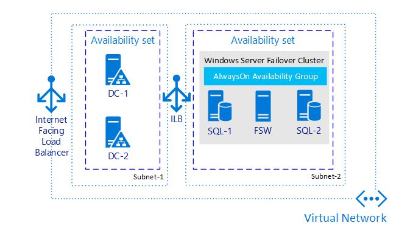
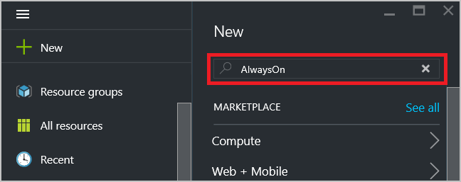
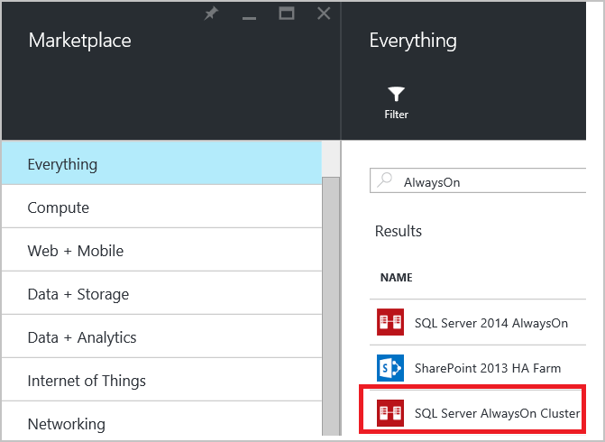
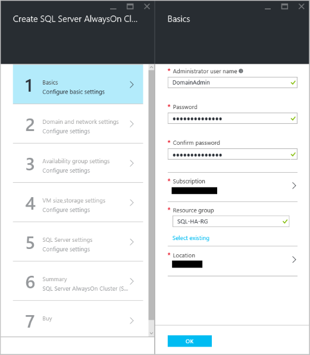
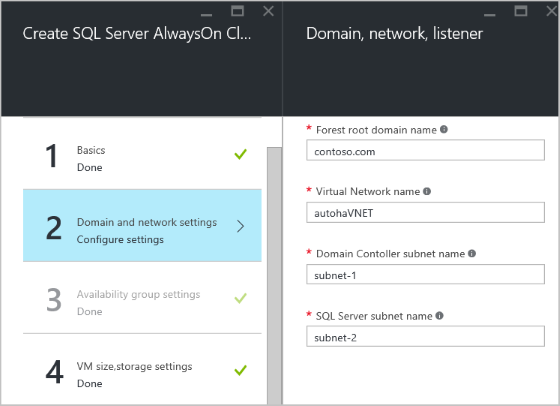
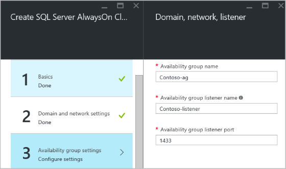
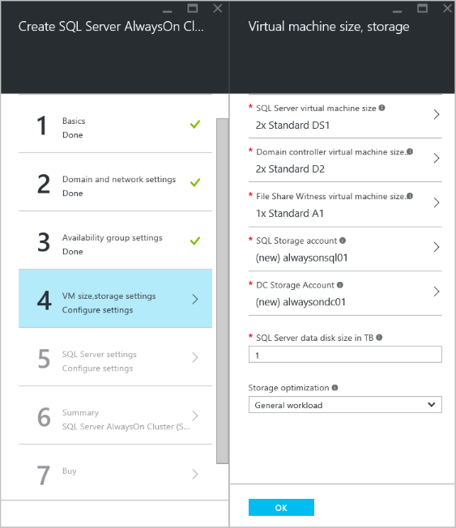
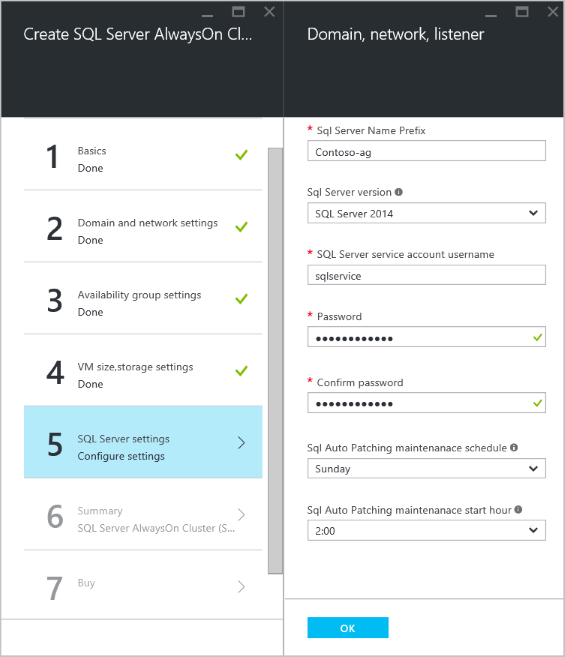
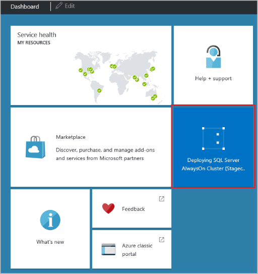
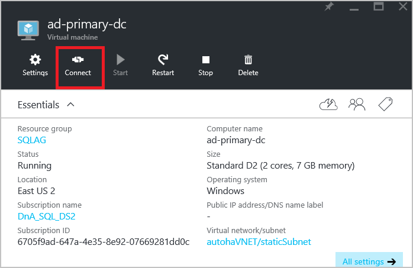

<properties
    pageTitle="Konfigurieren Sie immer auf Verfügbarkeit Gruppe Azure-virtuellen Computer automatisch - Ressourcenmanager"
    description="Erstellen einer Gruppe immer auf Verfügbarkeit mit Azure-virtuellen Computern im Modus Azure Ressourcenmanager. In diesem Lernprogramm verwendet hauptsächlich die Benutzeroberfläche, um die gesamte Lösung automatisch zu erstellen."
    services="virtual-machines-windows"
    documentationCenter="na"
    authors="MikeRayMSFT"
    manager="jhubbard"
    editor=""
    tags="azure-resource-manager" />
<tags
    ms.service="virtual-machines-windows"
    ms.devlang="na"
    ms.topic="article"
    ms.tgt_pltfrm="vm-windows-sql-server"
    ms.workload="infrastructure-services"
    ms.date="10/20/2016"
    ms.author="MikeRayMSFT" />

# Konfigurieren Sie immer auf Verfügbarkeit Gruppe Azure-virtuellen Computer automatisch - Ressourcenmanager

> [AZURE.SELECTOR]
- [Ressourcenmanager: Vorlage](virtual-machines-windows-portal-sql-alwayson-availability-groups.md)
- [Ressourcenmanager: Manueller](virtual-machines-windows-portal-sql-alwayson-availability-groups-manual.md)
- [Klassische: Benutzeroberfläche](virtual-machines-windows-classic-portal-sql-alwayson-availability-groups.md)
- [Klassische: PowerShell](virtual-machines-windows-classic-ps-sql-alwayson-availability-groups.md)

 

In diesem End-to-End-Lernprogramm erfahren Sie zum Erstellen einer SQL Server-Gruppe Verfügbarkeit mit Ressourcenmanager Azure-virtuellen Computern. Das Lernprogramm verwendet Azure Blades so konfigurieren Sie die Vorlage ein. Sie überprüfen die Standardeinstellungen, geben Sie die erforderliche Einstellungen, und aktualisieren Sie die Blades im Portal aus, wie Sie in diesem Lernprogramm durchzuführen.

Am Ende des Lernprogramms wird der SQL Server-Verfügbarkeit Gruppe Lösung in Azure die folgenden Elemente umfassen:

- Ein virtuelles Netzwerk, mehrere Subnetze, einschließlich einer Front-End- und Back-End-Subnetz enthält

- Zwei Domäne-Controller mit einer Domäne Active Directory (AD)

- Zwei SQL Server virtueller Computer mit dem Back-End-Subnetz bereitgestellt, und der AD-Domäne

- Eine 3-Knoten WSFC Cluster mit den Knoten Mehrzahl Quorummodell

- Eine Gruppe Verfügbarkeit mit zwei synchroner Commit Replikaten einer Datenbank Verfügbarkeit

In der Abbildung unten ist die Lösung grafisch dargestellt.

Alle Ressourcen in dieser Lösung zu einer einzigen Ressourcengruppe gehören.

In diesem Lernprogramm wird Folgendes vorausgesetzt:

- Sie verfügen bereits über ein Azure-Konto. Wenn Sie eine, [Melden Sie sich für ein Testkonto](http://azure.microsoft.com/pricing/free-trial/)besitzen.

- Sie wissen bereits, wie eine SQL Server virtuellen Computer aus dem virtuellen Computern Katalog über die Benutzeroberfläche bereitstellen. Weitere Informationen finden Sie in [einer SQL Server-virtuellen Computern auf Azure bereitgestellt](virtual-machines-windows-portal-sql-server-provision.md)

- Sie verfügen bereits über ein grundlegendes Verständnis der Verfügbarkeit von Gruppen. Weitere Informationen finden Sie unter [immer auf Verfügbarkeit Gruppen (SQL Server)](http://msdn.microsoft.com/library/hh510230.aspx).

>[AZURE.NOTE] Wenn Sie sich mit der Verfügbarkeit von Gruppen mit SharePoint interessiert sind, finden Sie auch unter [Konfigurieren von SQL Server 2012 immer auf Verfügbarkeit Gruppen für SharePoint 2013](http://technet.microsoft.com/library/jj715261.aspx).

In diesem Lernprogramm verwenden Sie das Azure-Portal an:

- Wählen Sie die Vorlage aus dem Portal immer auf

- Die Vorlageneinstellungen zu überprüfen und Aktualisieren von wenigen Konfiguration Ihrer Umgebung

- Überwachen von Azure, während sie die gesamte Umgebung erstellt

- Herstellen einer mit einem der Domänencontroller, und klicken Sie dann auf einen der SQL Server

[AZURE.INCLUDE [availability-group-template](../../includes/virtual-machines-windows-portal-sql-alwayson-ag-template.md)]

## Bereitstellen von Cluster aus dem Katalog

Azure bietet ein Bild im Katalog für die gesamte Lösung. Um die Vorlage zu suchen:

1.  Melden Sie sich mit Ihrem Konto Azure-Portal an.
1.  Klicken Sie in Azure Portals auf **+ neu.** Im Portal wird das neue Blade geöffnet.
1.  Klicken Sie auf die neue Blade-Suche für **AlwaysOn**.

1.  Suchen Sie in den Suchergebnissen **SQL Server AlwaysOn Cluster**aus.

1.  Wählen Sie auf **Wählen Sie ein Bereitstellungsmodell** **Ressourcenmanager**ein.

### Grundlagen

Klicken Sie auf die **Grundlagen** und konfigurieren Sie Folgendes:

- **Administratorbenutzernamen** ist ein Benutzerkonto mit Administratorberechtigungen für die Domäne und ein Mitglied der festen SQL Server-Rolle Sysadmin auf beide Instanzen von SQL Server. In diesem Lernprogramm verwenden Sie **DomainAdmin "**ein.

- **Kennwort** ist das Kennwort für das Administratorkonto der Domäne. Verwenden Sie ein komplexes Kennwort ein. Bestätigen Sie das Kennwort ein.

- **Abonnement** ist das Abonnement, das Azure Ausführen aller Ressourcen bereitgestellt, die für die Gruppe Verfügbarkeit in Rechnung gestellt werden. Sie können ein anderes Abonnement angeben, wenn Ihr Konto mehrere Abonnements enthält.

- **Ressourcengruppe** entspricht dem Namen für die Gruppe, dass alle Azure Ressourcen von diesem Lernprogramm erstellt, zugeordnet werden soll. In diesem Lernprogramm verwenden Sie **SQL-HA-RG**. Weitere Informationen finden Sie unter (Übersicht Azure Ressourcenmanager) [Ressource-Gruppe-overview.md / # Ressource-Gruppen].

- **Speicherort** ist der Azure Region, in dem die Ressourcen in diesem Lernprogramm erstellt wird. Wählen Sie eine Azure Region die Infrastruktur hosten.

Im folgenden finden Sie das **Grundlagen** Blade aussehen:

- Klicken Sie auf **OK**.

### Domäne und Netzwerk-Einstellungen

Diese Vorlage Azure Katalog erstellt eine neue Domäne mit neuen Domain Controller an. Außerdem wird ein neues Netzwerk und zwei Subnetzen erstellt. Die Vorlage ist nicht möglich, die Server in einer vorhandenen Domäne oder virtuelles Netzwerk erstellen. Im nächsten Schritt wird so konfigurieren Sie die Domäne und Netzwerk-Einstellungen.

Prüfen Sie auf **Einstellungen für Domäne und Netzwerk** Blade der vordefinierten Werte für die Domäne und Netzwerk-Einstellungen aus:

- **Namen Gesamtstruktur Stamm** ist den Domänennamen ein, der für die AD-Domäne verwendet wird, die den Cluster gehostet wird. Verwenden Sie das Lernprogramm **"contoso.com"**ein.

- **Virtuellen Netzwerknamen** entspricht den Netzwerknamen für das Azure virtuelle Netzwerk. In diesem Lernprogramm verwenden Sie **AutohaVNET**.

- **Domain Controller Subnetnamen** wird Name eines Teils des virtuellen Netzwerks, auf dem den Domänencontroller gehostet. In diesem Lernprogramm verwenden Sie **Subnetz-1**. Dieses Subnetz wird das Präfix für die Adresse **10.0.0.0/24**verwendet.

- **Namen der SQL Server-Subnetz** ist der Name eines Teils des virtuellen Netzwerks, dass die SQL Server-Hosts und die Dateifreigabe Zeuge. In diesem Lernprogramm verwenden Sie **Subnetz Basis 2 zurück**. Dieses Subnetz wird das Präfix für die Adresse **10.0.1.0/26**verwendet.

Erfahren Sie mehr über virtuelle Netzwerke in [Azure finden Sie unter Übersicht über Virtual Netzwerk](../virtual-network/virtual-networks-overview.md).  

Die **Domäne und Netzwerk Einstellungen** sollte wie folgt aussehen:

Bei Bedarf können Sie diese Werte ändern. In diesem Lernprogramm verwenden wir die voreingestellten Werte ein.

- Überprüfen Sie die Einstellungen, und klicken Sie auf **OK**.

###Verfügbarkeit von gruppeneinstellungen

Prüfen Sie auf **gruppeneinstellungen Verfügbarkeit** der vordefinierten Werte für die Verfügbarkeit von Gruppe und der Zuhörer ein.

- **Verfügbarkeit Gruppennamen** ist für die Gruppe Verfügbarkeit der gruppierten Ressourcenname. In diesem Lernprogramm verwenden Sie **Contoso-ag**aus.

- **Verfügbarkeit Zuhörer Gruppenname** wird von der Cluster und dem internen Lastenausgleich verwendet. Herstellen einer Verbindung mit SQL Server Clients können diesen Namen Verbindung zu den geeigneten Kopie der Datenbank verwenden. In diesem Lernprogramm verwenden Sie **Contoso-Zuhörer**ein.

-  **Verfügbarkeit Gruppe Zuhörer Port** gibt an, dass die TCP-der SQL Server-Zuhörer verwendet wird. In diesem Lernprogramm verwenden Sie den Standardport **1433**.

Bei Bedarf können Sie diese Werte ändern. In diesem Lernprogramm verwenden Sie die voreingestellten Werte ein.  

- Klicken Sie auf **OK**.

###Virtueller Speicher, Speicher-Einstellungen

**Virtueller Speicher** auf Speicher Einstellungen wählen Sie eine SQL Server-virtuellen Computern Größe aus, und überprüfen Sie die anderen Einstellungen.

- **SQL Server** wird virtuellen Computern die Größe der Azure-virtuellen Computern für SQL Server. Wählen Sie eine Größe des virtuellen Computers für Ihre Arbeitsbelastung geeignet. Wenn Sie erstellen diese Umgebung für das Lernprogramm **DS2**verwenden. Für Produktionsarbeitslasten Größe des virtuellen Computers, die die Arbeitsbelastung unterstützen können auswählen. Viele Produktionsarbeitslasten benötigen **DS4** oder größere. Die Vorlage wird zwei virtuellen Computern dieser Größe erstellen und Installieren von SQL Server auf jedem. Weitere Informationen finden Sie unter [Größe für virtuelle Computer](virtual-machines-linux-sizes.md).

>[AZURE.NOTE]Azure wird Enterprise Edition von SQL Server installiert. Die Kosten hängen davon ab, die Edition und die Größe des virtuellen Computers. Ausführliche Informationen zu den aktuellen Kosten finden Sie unter [virtuellen Computern Preise](http://azure.microsoft.com/pricing/details/virtual-machines/#Sql).

- **Domain Controller-virtuellen Computern Größe** ist die Größe des virtuellen Computers für die Domänencontroller. In diesem Lernprogramm verwenden Sie **D2**.

- **Größe des virtuellen Computers File freigeben Witness** wird die Größe des virtuellen Computers für die Zeugendateifreigabe. In diesem Lernprogramm verwenden Sie **A1**ein.

- **SQL-Speicher-Konto** ist der Name des Speicherkontos, die SQL Server-Daten und Betriebssystem-Laufwerke enthalten soll. In diesem Lernprogramm verwenden Sie **alwaysonsql01**aus.

- **DC Speicher-Konto** ist der Name des Speicherkontos für die Domänencontroller. In diesem Lernprogramm verwenden Sie **alwaysondc01**.

- Sie die **Größe des Datenträgers SQL Server-Daten** in TB ist die Größe des Datenträgers SQL Server Data in TB. Geben Sie eine Zahl von 1 bis 4. Dies ist die Größe des Datenträgers Daten, die jeder SQL Server zugeordnet werden soll. In diesem Lernprogramm verwenden Sie **1**aus.

- **Optimierung der Speicher** legt bestimmte Speicher Konfiguration Einstellungen für den SQL Server-virtuellen Computern basierend auf dem Typ Arbeitsbelastung an. Alle SQL Server in diesem Szenario verwenden Premium Speicher mit Azure Datenträger Host Cache auf schreibgeschützt festgelegt. Darüber hinaus können Sie SQL Server-Einstellungen für die Arbeitsbelastung optimieren, indem Sie eine der folgenden drei Einstellungen auswählen:

    - **Allgemeine Arbeitsbelastung** legt keine bestimmten Konfigurations-Einstellungen

    - **Verarbeitung von Transaktionen ausgelegt** legt Spur Kennzeichnung 1117 und 1118

    - **Datawarehousing** Spur Kennzeichnung 1117 legt und 610

In diesem Lernprogramm verwenden Sie **Allgemeine Arbeitsbelastung**aus.

- Überprüfen Sie die Einstellungen, und klicken Sie auf **OK**.

####Eine Notiz zu Speicher

Zusätzliche Optimierungen abhängig von der Größe der Festplatten mit den SQL Server-Daten. Für jede TB der Datenträger fügt Azure zusätzlichen 1 TB Premium Speicher (SSD) hinzu. Ein Server 2 TB oder mehr erforderlich ist, erstellt die Vorlage einen Speicherpool auf jedem SQL Server aus. Ein Speicherpool ist eine Form von-Virtualisierung, werden mehrere Datenträger so konfiguriert, dass höhere Kapazität, Stabilität und Leistung bereitstellen.  Die Vorlage erstellt eine Speicherplatz auf dem Speicherpool dann und stellt dies als ein einzelnen Daten an das Betriebssystem. Die Vorlage angibt, diese Datenträger wie der Datenträger Daten für SQL Server. Die Vorlage Abstimmung Speicherpool für SQL Server mit den folgenden Einstellungen:

- Streifengröße ist die Interleave-Einstellung für das virtuelle Laufwerk. Für Transaktionen Auslastung ist dies auf 64 KB festgelegt. Für Data Warehouse Auslastung ist die Einstellung 256 KB.

- Stabilität ist einfach (keine Flexibilität).

>[AZURE.NOTE] Azure Premium Speicher ist lokal redundant und drei Kopien der Daten in einem einzigen Bereich, behält, sodass keine zusätzliche Stabilität bei Speicherpool erforderlich ist.

- Anzahl der Spalten gleich die Anzahl der Datenträger im Speicherpool.

Weitere Informationen zu Speicher finden Sie unter Leerzeichen und Speicher-Pools:

- [Übersicht über die Speicher Leerzeichen](http://technet.microsoft.com/library/hh831739.aspx).

- [Windows Server-Sicherung und Speicherpools](http://technet.microsoft.com/library/dn390929.aspx)

Weitere Informationen zu best Practices für die SQL Server-Konfiguration finden Sie unter [Leistung bewährte Methoden für SQL Server in Azure-virtuellen Computern](virtual-machines-windows-sql-performance.md)

###SQL Server-Einstellungen

Überprüfen Sie und ändern Sie der SQL Server virtueller Computer Präfix, SQL Server-Version, SQL Server-Dienstkonto und Kennwort und die Wartung Terminplan Patch SQL automatisch, **SQL Server** -Einstellungen.

- **SQL Server ein Präfix** zum Erstellen eines Namens für jeden SQL Server. In diesem Lernprogramm verwenden Sie **Contoso-ag**aus. Die SQL Server-Namen werden *Contoso-ag-0* , *Contoso-ag-1*.

- **SQL Server-Version** wird die Version von SQL Server. In diesem Lernprogramm verwenden Sie **SQL Server 2014**. Sie können auch **SQL Server 2012** oder **SQL Server 2016**auswählen.

- **SQL Server-Dienst Benutzer Kontonamen** ist den Domänennamen-Konto für den SQL Server-Dienst an. In diesem Lernprogramm verwenden Sie **Sqlservice**aus.

- **Kennwort** ist das Kennwort für das SQL Server-Dienstkonto.  Verwenden Sie ein komplexes Kennwort ein. Bestätigen Sie das Kennwort ein.

- **SQL automatische Patch Wartung Terminplan** identifiziert den Wochentag, Azure SQL-Server automatisch patch wird. Geben Sie in diesem Lernprogramm **Sonntag**aus.

- **SQL automatische Patch Wartung starten Stunde** ist die Uhrzeit für den Bereich Azure beim automatischen Patch beginnen soll.

>[AZURE.NOTE]Das Fenster Patch für jeden virtuellen Computer ist durch eine Stunde gestaffelt. Nur ein virtueller Computer ist jeweils müssen, um zu verhindern, dass Unterbrechung der Dienste korrigiert.

Überprüfen Sie die Einstellungen, und klicken Sie auf **OK**.

###Zusammenfassung

Klicken Sie auf der Seite "Zusammenfassung" überprüft Azure die Einstellungen. Sie können auch die Vorlage herunterladen. Überprüfen Sie die Zusammenfassung. Klicken Sie auf **OK**.

###Kaufen

Diese endgültige Blade enthält, **Nutzungsbedingungen**und **Datenschutzrichtlinien**. Überprüfen Sie diese Informationen ein. Wenn Sie zum Erstellen der virtuellen Computern und alle anderen erforderlichen Ressourcen für die Gruppe Verfügbarkeit Azure bereit sind, klicken Sie auf **Erstellen**.

Azure-Portal erstellt die Ressourcengruppe und aller Ressourcen.

##Monitor-Bereitstellung

Überwachen Sie den Fortschritt der Bereitstellung vom Azure-Portal an. Ein Symbol für die Bereitstellung wird automatisch an dem Azure Portals Dashboard angeheftet.

##Verbinden mit SQLServer

Die neuen Instanzen von SQL Server ausführen auf virtuellen Computern, die keine Verbindung zum Internet haben. Die Domänencontroller müssen jedoch eine Verbindung gegenüberliegende Internet. Um die Verbindung mit der SQL-Servers mit dem Remotedesktop, ersten RDP auf einen der Domänencontroller. Öffnen Sie eine zweite RDP auf dem SQL Server von der Domäne.

Gehen Sie um RDP an die primäre Domänencontroller folgendermaßen vor:

1.  Vom Azure Portals Dashboard sehr, dass die Bereitstellung erfolgreich war.

1.  Klicken Sie auf **Ressourcen**.

1.  Klicken Sie in das Blade **Ressourcen** auf **Ad-primär-dc** , also den Netzwerknamen des virtuellen Computers für die primäre Domänencontroller.

1.  Klicken Sie auf das Blade für **Ad-primär-dc** auf **Verbinden**. Ihr Browser fragt, ob zum Öffnen oder speichern das Objekt remote-Verbindung verwendet werden soll. Klicken Sie auf **Öffnen**.

1.  **Remotedesktop-Verbindung** möglicherweise eine Warnung, dass der Herausgeber der remote-Verbindung identifiziert werden kann. Klicken Sie auf **Verbinden**.

1.  Windows-Sicherheit aufgefordert, geben Sie Ihre Anmeldeinformationen ein, die IP-Adresse der primären Domänen-Controller Verbindung. Klicken Sie auf **ein anderes Konto verwenden**. Geben Sie **Contoso\DomainAdmin** **Benutzername** ein. Dies ist das Konto, das Sie für Administratorbenutzernamen ausgewählt haben. Verwenden Sie das komplexe Kennwort ein, die Sie ausgewählt haben, wenn Sie die Vorlage konfiguriert.

1.  **Remotedesktop** möglicherweise eine Warnung, dass der Remotecomputer aufgrund von Problemen mit dem Sicherheitszertifikat nicht authentifiziert werden konnten. Es wird der Name des Zertifikats angezeigt. Wenn Sie das Lernprogramm befolgt wird der Name **Ad-primär-dc.contoso.com**sein. Klicken Sie auf **Ja**.

Sie sind jetzt mit Domänen-Controller verbunden. Gehen Sie um RDP auf dem SQL Server folgendermaßen vor:

1.  Öffnen Sie auf dem Domänencontroller **Remote Desktop-Verbindung**aus.

1.  Geben Sie für **Computer**den Namen einer SQL Server aus. Geben Sie in diesem Lernprogramm **Sqlserver-0**ein.

1.  Verwenden Sie den gleichen Benutzerkonto und das Kennwort, das Sie zum RDP an den Domänencontroller verwendet wird.

Sie sind jetzt mit RDP auf dem SQL Server verbunden. Öffnen Sie SQL Server Management Studio, mit der Standardinstanz von SQL Server herstellen, und stellen Sie sicher, dass die Gruppe Availabilty konfiguriert ist.

