<properties
    pageTitle="Bereitstellen einer SQL Server-virtuellen Computern | Microsoft Azure"
    description="Erstellen und Verbinden mit einer SQL Server-virtuellen Computern in Azure Verwenden des Portals. In diesem Lernprogramm verwendet den Ressourcenmanager-Modus."
    services="virtual-machines-windows"
    documentationCenter="na"
    authors="rothja"
    editor=""
    manager="jhubbard"
    tags="azure-resource-manager" />
<tags
    ms.service="virtual-machines-windows"
    ms.devlang="na"
    ms.topic="hero-article"
    ms.tgt_pltfrm="vm-windows-sql-server"
    ms.workload="infrastructure-services"
    ms.date="09/21/2016"
    ms.author="jroth" />

# Bereitstellen einer SQL Server-virtuellen Computern Azure-Portal

> [AZURE.SELECTOR]
- [Portal](virtual-machines-windows-portal-sql-server-provision.md)
- [PowerShell](virtual-machines-windows-ps-sql-create.md)

In diesem Lernprogramm durchgehende veranschaulicht die Azure-Portal zu verwenden, um einen virtuellen Computer mit SQL Server bereitzustellen.

Klicken Sie im Katalog Azure-virtuellen Computern (virtueller Computer) enthält mehrere Bilder, die Microsoft SQL Server enthalten. Mit nur wenigen Mausklicks können Sie Wählen eines der Bilder SQL VM aus dem Katalog und es in Ihrer Umgebung Azure bereitstellen.

In diesem Lernprogramm werden Sie folgende Aufgaben ausführen:

- [Wählen Sie ein Bild SQL VM aus dem Katalog aus.](#select-a-sql-vm-image-from-the-gallery)
- [Konfigurieren Sie und erstellen Sie den virtuellen Computer](#configure-the-vm)
- [Öffnen Sie den virtuellen Computer mit dem Remotedesktop](#open-the-vm-with-remote-desktop)
- [Verbinden Sie mit SQL Server Remote](#connect-to-sql-server-remotely)

## Wählen Sie ein Bild SQL VM aus dem Katalog aus.

1. Melden Sie sich mit Ihrem Konto [Azure-Portal](https://portal.azure.com) an.

    >[AZURE.NOTE] Wenn Sie nicht über ein Azure-Konto verfügen, besuchen Sie [Azure-Testversion frei](https://azure.microsoft.com/pricing/free-trial/).

1. Klicken Sie auf **neu**, klicken Sie im Portal Azure. Im Portal wird das Blade **neu** geöffnet. Die SQL Server virtueller Computer-Ressourcen sind in der Gruppe **virtuellen Computern** der Marketplace.

1. Klicken Sie in das **neue** Blade auf **virtuellen Computern**.

1. Klicken Sie auf das Blade **virtuellen Computern** **finden Sie unter alle** , zum Anzeigen aller Bilder.

    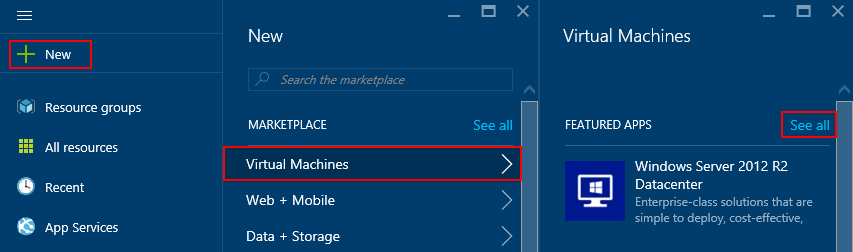

1. Klicken Sie unter **Datenbank-Servern** **SQL Server**auf. Möglicherweise müssen einen Bildlauf nach unten, **Datenbankserver**gesucht werden soll. Überprüfen Sie die verfügbaren Vorlagen für SQL Server.

    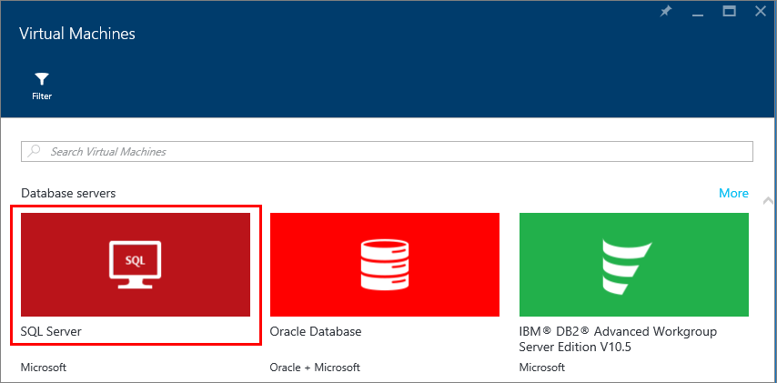

1. Jede Vorlage identifiziert eine SQL Server-Version und einem Betriebssystem. Wählen Sie eine der folgenden Bilder aus der Liste aus. Überprüfen Sie dann das Details Blade, das eine Beschreibung des Bilds virtuellen Computern bereitstellt.

    >[AZURE.NOTE] SQL VM Bilder umfassen zur Lizenzierung Kosten für SQL Server in die pro Minute Preise von den virtuellen Computer, die Sie erstellen. Es gibt eine weitere Möglichkeit Bezahlung zu bringen-your-Besitzer-Lizenz (BYOL) nur für den virtuellen Computer aus. Diese Bildnamen werden {BYOL} vorangestellt. Weitere Informationen zu dieser Option finden Sie unter [Erste Schritte mit SQL Server auf Azure virtuellen Computern](virtual-machines-windows-sql-server-iaas-overview.md).

1. Klicken Sie unter **Wählen Sie ein Bereitstellungsmodell**stellen Sie sicher, dass **Ressourcenmanager** ausgewählt ist. Ressourcen-Manager ist das Modell empfohlene Bereitstellung für neue virtuelle Computer. Klicken Sie auf **Erstellen**.

    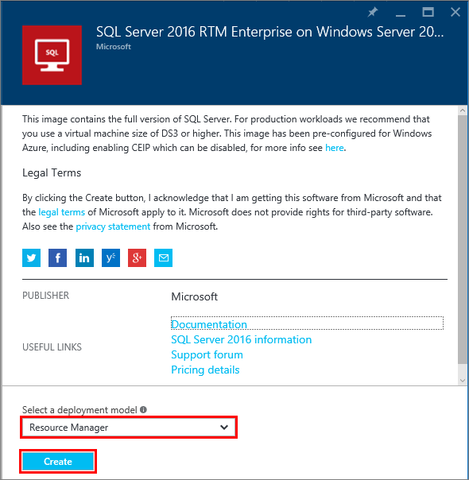

## Konfigurieren Sie den virtuellen Computer
Es gibt fünf Blades zum Konfigurieren einer SQL Server-virtuellen Computern aus.

| Schritt               | Beschreibung                          |
|---------------------|-------------------------------|
| **Grundlagen**              | [Konfigurieren von Einstellungen zur grundlegenden](#1-configure-basic-settings)      |
| **Größe**                | [Wählen Sie die Größe des virtuellen Computers](#2-choose-virtual-machine-size)   |
| **Einstellungen**            | [Optionale Features konfigurieren](#3-configure-optional-features)   |
| **SQL Server-Einstellungen** | [Konfigurieren von SQL Server-Einstellungen](#4-configure-sql-server-settings) |
| **Zusammenfassung**             | [Überprüfen Sie die Zusammenfassung](#5-review-the-summary)            |

## 1. grundlegende Einstellungen konfigurieren
Geben Sie in die **Grundlagen** Blade die folgenden Informationen ein:

* Geben Sie einen eindeutigen virtuellen Computern **Namen**ein.
* Geben Sie einen **Benutzernamen** für das lokale Administratorkonto des virtuellen Computers. Dieses Konto wird auch festen SQL Server-Rolle **Sysadmin** hinzugefügt.
* Geben Sie ein sicheres **Kennwort**ein.
* Wenn Sie mehrere Abonnements haben, stellen Sie sicher, dass das Abonnement für den neuen virtuellen Computer korrekt ist.
* Geben Sie im Feld **Ressourcengruppe** einen Namen für eine neue Ressourcengruppe ein. Alternativ zum Verwenden einer vorhandenen Ressource Gruppe klicken Sie auf **vorhandene auswählen**. Eine Ressourcengruppe ist eine Zusammenstellung von zugehörige Ressourcen in Azure (virtuellen Computern, Speicherkonten, virtuelle Netzwerke usw.).

    >[AZURE.NOTE] Es wird empfohlen, eine neue Ressourcengruppe verwenden, wenn Sie nur testen oder SQL Server-Bereitstellungen in Azure Kennenlernen. Wenn Sie mit den Test abgeschlossen haben, löschen Sie die Ressourcengruppe aus, um den virtuellen Computer und alle dieser Ressourcengruppe zugeordneten Ressourcen automatisch zu löschen. Weitere Informationen zu Ressourcengruppen finden Sie unter [Azure Ressourcenmanager Übersicht](../azure-resource-manager/resource-group-overview.md).

* Wählen Sie einen **Speicherort** für die Bereitstellung aus.
* Klicken Sie auf **OK** , um die Einstellungen zu speichern.

    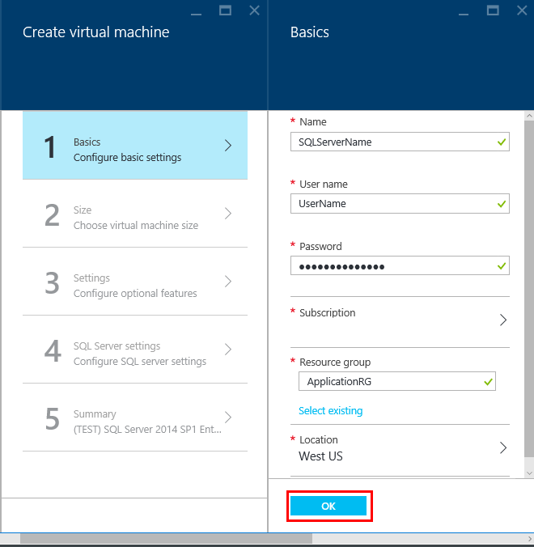

## 2. Wählen Sie die Größe des virtuellen Computers
Wählen Sie im Schritt **Größe** Größe des virtuellen Computers in das Blade **auswählen eine Größe** aus. Das Blade zeigt zunächst empfohlene maschinellen Größen basierend auf der Vorlage, die Sie ausgewählt haben. Er schätzt auch die monatliche Kosten, um den virtuellen Computer auszuführen.

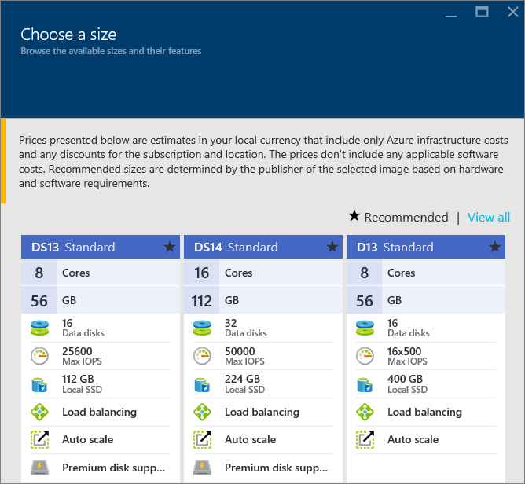

Produktionsarbeitslasten wird empfohlen, markieren die Größe des virtuellen Computers, die [Premium-Speicher](../storage/storage-premium-storage.md)unterstützt. Wenn Sie die Ebene der Leistung nicht benötigen, verwenden Sie die Schaltfläche **Alle anzeigen** , die alle Computer Größenoptionen anzeigt. Sie möglicherweise beispielsweise einen kleineren Schriftgrad ein Computer für eine Entwicklung oder testumgebung verwenden.

>[AZURE.NOTE] Weitere Informationen zu virtuellen Computern Größen finden Sie unter, [Größen für virtuelle Computer](virtual-machines-windows-sizes.md). Hinweise zu SQL Server virtueller Computer Größen finden Sie unter [Leistung bewährte Methoden für SQL Server in Azure virtuellen Computern](virtual-machines-windows-sql-performance.md).

Wählen Sie die Größe Ihres Computers aus, und klicken Sie dann auf **auswählen**.

## 3 optionale Features konfigurieren
Konfigurieren Sie in den **Einstellungen** Blade Azure-Speicher, Netzwerke und Überwachen des virtuellen Computers.

- Geben Sie unter **Speicher**an einem **Geben Sie den Datenträger** entweder Standard oder Premium (SSD). Premium-Speicher ist für Produktionsarbeitslasten empfohlen.

>[AZURE.NOTE] Wenn Sie Premium (SSD) für eine maschinelle Größe, die Premium-Speicher nicht unterstützt auswählen, wird die Größe Ihres Computers automatisch geändert.  

- Klicken Sie unter **Speicher-Konto**können Sie den Namen des Kontos automatisch bereitgestellte Speicher akzeptieren. Sie können auch auf **Speicher-Konto** aus, wählen Sie ein vorhandenes Konto und Kontotyp Speicher konfigurieren klicken. Standardmäßig wird Azure ein Neukunde Speicher mit lokal redundante Speicherung erstellt. Weitere Informationen zu Speicheroptionen finden Sie unter [Replikation Azure-Speicher](../storage/storage-redundancy.md).

- Klicken Sie unter **Netzwerk**können Sie die Werte automatisch gefüllten akzeptieren. Sie können auch auf jede Funktion der **virtuellen Netzwerk**, **Subnetz**, **öffentliche IP-Adresse**und **Netzwerk-Sicherheitsgruppe**manuell konfigurieren klicken. Behalten Sie für die Zwecke dieses Lernprogramms die Standardwerte bei.

- Azure ermöglicht die **Überwachung** standardmäßig mit demselben Speicherkonto für den virtuellen Computer bestimmt. Sie können diese Einstellungen hier ändern.

- Legen Sie unter **Festlegen der Verfügbarkeit**einer Verfügbarkeit Reihe ein. Für die Zwecke dieses Lernprogramms können Sie **keine**auswählen. Wenn Sie beabsichtigen, SQL AlwaysOn Verfügbarkeit Gruppen eingerichtet, konfigurieren Sie die Verfügbarkeit zur Vermeidung von des virtuellen Computers, neu zu erstellen.  Weitere Informationen finden Sie unter [Verwalten der Verfügbarkeit von virtuellen Computern](virtual-machines-windows-manage-availability.md).

Wenn Sie fertig sind konfigurieren diese Einstellungen, klicken Sie auf **OK**.

## 4 Konfigurieren von SQL Server-Einstellungen
Konfigurieren Sie in der **SQL Server-Einstellungen** Blade bestimmte Einstellungen und Optimierungen für SQL Server aus. Folgende: Einstellungen, die Sie für SQL Server konfigurieren können

| Einstellung               |
|---------------------|
| [Konnektivität](#connectivity)              |
| [Authentifizierung](#authentication)                |
| [Speicherkonfiguration](#storage-configuration)            |
| [Automatische Patch](#automated-patching) |
| [Automatische Sicherung](#automated-backup)             |
| [Azure Key Tresor-Integration](#azure-key-vault-integration)             |
| [R Services](#r-services) |

### Konnektivität
Geben Sie unter **SQL-Konnektivität**die Art des Zugriffs, die Sie SQL Server-Instanz dieses virtuellen Computers möchten. Wählen Sie im Rahmen dieses Lernprogramms, **öffentlichen (Internet)** für Verbindungen mit SQL Server aus Computern oder Dienste im Internet zulässt. Diese Option ausgewählt ist konfiguriert Azure automatisch die Firewall und Netzwerksicherheitsgruppe für den Datenverkehr am Anschluss 1433 zulässt.  

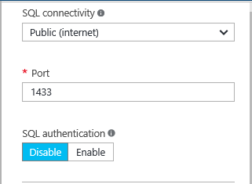

Informationen zum Verbinden mit SQL Server über das Internet müssen Sie auch SQL Server-Authentifizierung aktivieren, die im nächsten Abschnitt beschrieben wird.

>[AZURE.NOTE] Es ist möglich, mehrere Einschränkungen für die Kommunikation im Netzwerk Ihrer SQL Server virtueller Computer hinzuzufügen. Sie können dafür durch Bearbeiten der Netzwerk-Sicherheitsgruppe aus, nach der virtuellen Computer erstellt wird. Weitere Informationen finden Sie unter [was eine Netzwerk Sicherheit Gruppe (NSG) ist?](../virtual-network/virtual-networks-nsg.md)

Wenn Sie lieber nicht Verbindungen, um die Datenbank-Engine über das Internet aktivieren, wählen Sie eine der folgenden Optionen aus:

- **Lokale (innerhalb nur virtueller Computer)** für Verbindungen mit SQL Server nur aus, in dem virtuellen Computer zulässt.
- **Private (innerhalb von Virtual Network)** für Verbindungen mit SQL Server aus Computern oder Dienste in der gleichen virtuellen Netzwerk zulassen.

>[AZURE.NOTE] Das Bild virtuellen Computern für SQL Server Express Edition wird das Protokoll TCP/IP nicht automatisch aktiviert. Dies gilt auch für die öffentliche und Private Connectivity-Optionen. Für Express-Edition müssen Sie SQL Server-Konfigurations-Manager [das Protokoll TCP/IP manuell](#configure-sql-server-to-listen-on-the-tcp-protocol) aktivieren nach dem Erstellen des virtuellen Computer verwenden.

Im Allgemeinen verbessern Sie Sicherheit durch Auswahl der am meisten eingeschränkten Connectivity, die Ihrem Szenario ermöglicht. Aber alle Optionen sind sicherungsfähige bis Netzwerk-Sicherheitsgruppe Regeln und SQL/Windows-Authentifizierung.

Standardmäßig **Port** 1433. Sie können eine andere Port-Nummer angeben.
Weitere Informationen finden Sie unter [Verbinden zu einer SQL Server virtuellen Computern (Ressourcenmanager) | Microsoft Azure](virtual-machines-windows-sql-connect.md).

### Authentifizierung
Wenn Sie die SQL Server-Authentifizierung erforderlich ist, klicken Sie unter **SQL-Authentifizierung**auf **Aktivieren** .

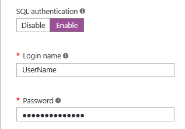

>[AZURE.NOTE] Wenn Sie beabsichtigen, SQL Server über das Internet (d. h. die Option öffentlichen Connectivity) zugreifen, müssen Sie hier die SQL-Authentifizierung aktivieren. Öffentliche Zugriff auf dem SQL Server erfordert die Verwendung der SQL-Authentifizierung.

Wenn Sie die SQL Server-Authentifizierung aktivieren, geben Sie einen **Benutzernamen** und **ein Kennwort**ein. Dieser Benutzername wird als eine SQL Server-Authentifizierung Login und Mitglied der festen Rolle **Sysadmin** konfiguriert. Weitere Informationen zu den Authentifizierungsmodi finden Sie unter [Auswählen eines Authentifizierungsmodus](http://msdn.microsoft.com/library/ms144284.aspx) .

Wenn Sie SQL Server-Authentifizierung nicht aktivieren, können Sie das lokale Administratorkonto in Verbindung mit SQL Server-Instanz des virtuellen Computers verwenden.

### Speicherkonfiguration
Klicken Sie auf **Speicher-Konfiguration** , damit die Anforderungen Speicher angeben.

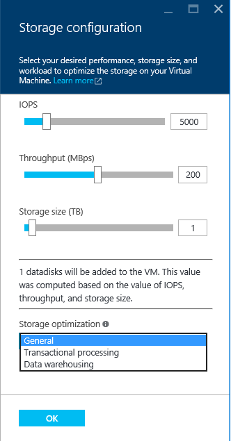

>[AZURE.NOTE] Wenn Sie die standardmäßigen Speicher auswählen, ist diese Option nicht verfügbar. Optimierung der automatischen Speicher steht nur für Premium-Speicher.

Sie können die Anforderungen als Eingabe-/Ausgabe-Vorgänge pro Sekunde (IOPs), Durchsatz in MB/s und Gesamtspeichergröße angeben. Konfigurieren Sie diese Werte mithilfe der gleitende Skalen aus. Im Portal berechnet automatisch die Anzahl der Datenträger basierend auf diese Anforderungen an.

Standardmäßig optimiert Azure den Speicherplatz für 5000 IOPs, 200 MB und 1 TB Speicherplatz an. Sie können diese basierend auf Arbeitsbelastung Speicher-Einstellungen ändern. Wählen Sie unter **Speicher für optimiert**eine der folgenden Optionen aus:

- **Allgemeine** ist die Standardeinstellung und unterstützt die meisten Auslastung.
- Verarbeitung von **Transaktionen ausgelegt** optimiert die Speicherung bei OLTP traditionelle Datenbanken.
- **Datawarehousing** optimiert den Speicherplatz für analytischen und reporting Auslastung.

>[AZURE.NOTE] Die oberen Grenzwerte für die Schieberegler variieren je nach der Größe des ausgewählten virtuellen Computers.

### Automatische Patch
**Automatische Patch** ist standardmäßig aktiviert. Automatisierte Patch ermöglicht Azure in SQL Server und das Betriebssystem automatisch-patch. Geben Sie an einem Tag der Woche, Zeit und Dauer für ein Wartungsfenster. Azure führt Patch in diesem Wartungsfenster. Der Wartung Fenster Terminplan verwendet das Gebietsschema virtueller Computer für die Zeit an. Wenn Sie keine Azure in SQL Server und das Betriebssystem automatisch-patch, klicken Sie auf **Deaktivieren**.  

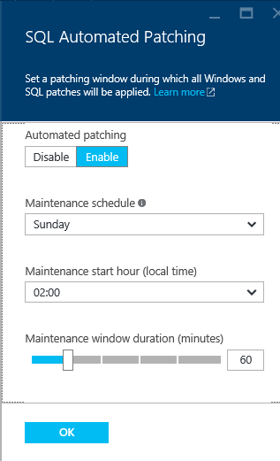

Weitere Informationen finden Sie unter [Automatisches Patch für SQL Server in Azure virtuellen Computern](virtual-machines-windows-sql-automated-patching.md).

### Automatische Sicherung
Aktivieren Sie die automatische Datenbanksicherungskopien für alle Datenbanken unter **dem automatischen Sicherung**. Automatische Sicherung ist standardmäßig deaktiviert.

Wenn Sie die SQL-automatische Sicherung aktivieren, können Sie Folgendes konfigurieren:

- Aufbewahrungszeitraum (Tage) nach Sicherungskopien
- Speicher-Konto für Sicherungskopien verwendet werden soll
- Verschlüsselungsoption und das Kennwort für Sicherungskopien

Klicken Sie auf **Aktivieren**, um die Sicherungskopie zu verschlüsseln. Geben Sie dann das **Kennwort**ein. Azure ein Zertifikat zum Verschlüsseln der Sicherungskopien erstellt und verwendet das angegebene Kennwort schützen, dass das Zertifikat.

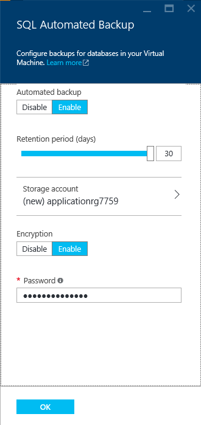

 Weitere Informationen finden Sie unter [Automatische Sicherung für SQL Server in Azure virtuellen Computern](virtual-machines-windows-sql-automated-backup.md).

### Azure-Taste Tresor-integration
Um Sicherheit Kennwörter für die Verschlüsselung in Azure speichern möchten, klicken Sie auf **Azure Key Tresor Integration** , und klicken Sie auf **Aktivieren**.

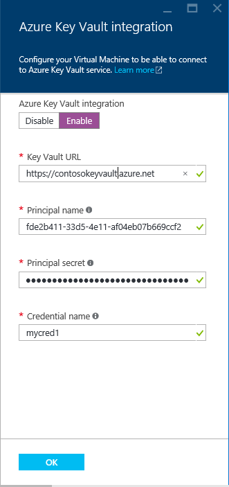

Der folgenden Tabelle sind die Parameter so konfigurieren Sie die Integration von Azure-Taste Tresor erforderlich.

|PARAMETER|BESCHREIBUNG|BEISPIEL|
|----------|----------|-------|
|**Key Tresor-URL** |Die Position des der wichtigsten Tresor.|https://contosokeyvault.Vault.Azure.NET/ |
|**Benutzerprinzipalnamen** |Azure Active Directory-Dienst Benutzerprinzipalnamen. Dieser Name wird auch als die Client-ID bezeichnet  |fde2b411 - 33d 5-4e11-af04eb07b669ccf2|
| **Hauptbenutzer geheim**|Azure Active Directory-Dienst Hauptbenutzer geheim. Diese geheim wird auch als das Geheimnis Client bezeichnet. | 9VTJSQwzlFepD8XODnzy8n2V01Jd8dAjwm/azF1XDKM =|
|**Namen von Anmeldeinformationen**|**Anmeldeinformationen Namen**: AKV Integration erstellt einen Eintrag in SQL Server verschoben, sodass den virtuellen Computer auf die wichtigsten Tresor zugreifen. Wählen Sie einen Namen für diese Anmeldeinformationen ein.| mycred1|

Weitere Informationen finden Sie unter [Konfigurieren von Azure Schlüssel Tresor Integration für SQL Server auf Azure-virtuellen Computern](virtual-machines-windows-ps-sql-keyvault.md).

Wenn Sie die Konfiguration von SQL Server-Einstellungen abgeschlossen haben, klicken Sie auf **OK**.

### R services
Für SQL Server 2016 Enterprise Edition müssen Sie die Option zum Aktivieren von [SQL Server R Services](https://msdn.microsoft.com/library/mt604845.aspx). So können Sie erweiterte Analytics mit SQL Server 2016 verwenden. Klicken Sie auf dem **SQL Server-Einstellungen** -Blade auf **Aktivieren** .

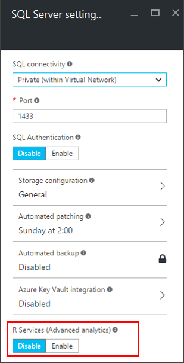

>[AZURE.NOTE] Für SQL Server-Bilder, die nicht 2016 Enterprise Edition sind, ist die Option zum Aktivieren von Diensten R deaktiviert.

## 5 überprüfen Sie 5 die Zusammenfassung
Überprüfen Sie in der **Zusammenfassung** Blade die Zusammenfassung, und klicken Sie auf **OK** , um die SQL Server, Ressourcengruppe und Ressourcen für diese virtuellen Computer angegebenen zu erstellen.

Sie können die Bereitstellung von Azure-Portal überwachen. Die Schaltfläche **Benachrichtigungen** am oberen Rand des Bildschirms zeigt grundlegende Status der Bereitstellung.

>[AZURE.NOTE] Um eine Vorstellung auf Bereitstellungszeiten beschleunigen, bereitgestellt ich eine SQL VM in der Region ostasiatischen US mit Standardeinstellungen. Dieser Test-Bereitstellung benötigte insgesamt 26 Minuten. Aber möglicherweise erzielen Sie eine schnellere oder langsamer Zeitpunkt der Bereitstellung auf der Grundlage Ihrer Region und Einstellungen ausgewählt.

## Öffnen Sie den virtuellen Computer mit dem Remotedesktop

Gehen Sie folgendermaßen vor, für die Verbindung mit dem virtuellen Computer mit dem Remotedesktop:

1. Nach dem Azure-virtuellen Computer erstellt wurde, wird das Symbol für den virtuellen Computer auf Ihre Azure Dashboard angezeigt. Sie können sie suchen, indem Sie die vorhandenen virtuellen Computer durchsuchen. Klicken Sie auf der neuen SQL-virtuellen Computern. Eine Blade **virtuellen Computers** zeigt Ihre virtuellen Computern Details an.
1. Klicken Sie am oberen Rand der Blade **virtuellen Computers** auf **Verbinden**.
1. Im Browser downloads eine RDP-Datei für den virtuellen Computer an. Öffnen Sie die RDP-Datei ein.
    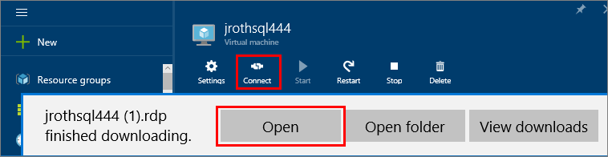
1. Der Remotedesktop-Verbindung werden Sie benachrichtigt, dass der Herausgeber der remote-Verbindung identifiziert werden kann. Klicken Sie auf **Verbinden** , um den Vorgang fortzusetzen.
1. Klicken Sie auf **ein anderes Konto verwenden**, klicken Sie im Dialogfeld **Windows-Sicherheit** .
1. Für **Benutzernamen** ein ** \<Benutzername >**, wobei <user name> ist der Benutzername, die Sie angegeben haben, wenn Sie den virtuellen Computer konfiguriert. Sie müssen einen initial umgekehrter Schrägstrich vor dem Namen hinzufügen.
1. Geben Sie das **Kennwort ein** , die Sie zuvor für diese virtuellen Computer konfiguriert haben, und klicken Sie dann auf **OK** , um eine Verbindung herstellen.
1. Wenn Sie eine andere **Remote Desktop Connection** -Dialogfeld, ob Verbindung gefragt werden, klicken Sie auf **Ja**.

Nachdem Sie mit der SQL Server-virtuellen Computern verbunden haben, können Sie SQL Server Management Studio starten und Verbinden mit Windows-Authentifizierung mit lokaler Administrator-Anmeldeberechtigungen. Wenn Sie SQL Server-Authentifizierung aktiviert haben, können Sie auch Verbinden mit SQL-Authentifizierung mit dem SQL-Benutzernamen und Ihr Kennwort ein, die Sie während der Bereitstellung konfiguriert.

Zugriff auf dem Computer können Sie direkt Computer- und SQL Server-Einstellungen, die Ihren Anforderungen entsprechend zu ändern. Beispielsweise könnten Sie konfigurieren Sie die Firewalleinstellungen oder SQL Server-Konfigurations-Einstellungen ändern.

## Verbinden Sie mit SQL Server Remote

In diesem Lernprogramm ausgewählt wir **öffentlichen** Zugriff für den virtuellen Computern und **SQL Server-Authentifizierung**. Automatisch konfiguriert diese Einstellungen des virtuellen Computers zum Zulassen von SQL Server-Verbindungen von einem beliebigen Client über das Internet (vorausgesetzt, dass sie die richtige SQL-Anmeldung haben).

>[AZURE.NOTE] Wenn Sie während der Bereitstellung nicht öffentlichen ausgewählt haben, sind zusätzliche Schritte erforderlich, zu Ihrer SQL Server-Instanz über das Internet zugreifen. Weitere Informationen finden Sie unter [Verbinden zu einer SQL Server virtuellen Computern](virtual-machines-windows-sql-connect.md).

Die folgenden Abschnitte zeigen die Herstellung der Verbindung zu Ihrer SQL Server-Instanz der virtuellen Computers von einem anderen Computer über das Internet.

> [AZURE.INCLUDE [Connect to SQL Server in a VM Resource Manager](../../includes/virtual-machines-sql-server-connection-steps-resource-manager.md)]

## Nächste Schritte
Weitere Informationen zur Verwendung von SQL Server in Azure finden Sie unter [SQL Server auf Azure virtuellen Computern](virtual-machines-windows-sql-server-iaas-overview.md) und [Häufig gestellte Fragen](virtual-machines-windows-sql-server-iaas-faq.md).

Sehen Sie ein video Überblick von SQL Server auf Azure virtuellen Computern [Azure-virtuellen Computer ist die beste Plattform für SQL Server 2016](https://channel9.msdn.com/Events/DataDriven/SQLServer2016/Azure-VM-is-the-best-platform-for-SQL-Server-2016)aus.

[Durchsuchen der Learning Path](https://azure.microsoft.com/documentation/learning-paths/sql-azure-vm/) für SQL Server auf Azure-virtuellen Computern.
