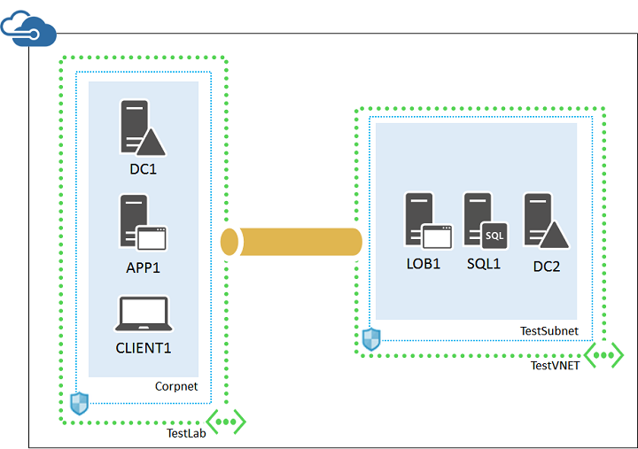
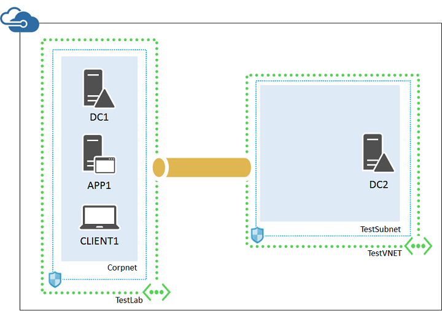
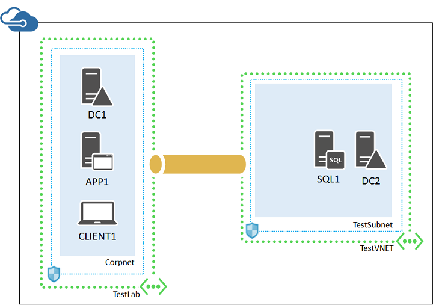

<properties 
    pageTitle="LOB-Anwendung testumgebung | Microsoft Azure" 
    description="Informationen zum Erstellen einer webbasierten, branchenspezifische Anwendung in einen Cloud-hybridumgebung für IT Pro oder Entwicklung zu testen." 
    services="virtual-machines-windows" 
    documentationCenter="" 
    authors="JoeDavies-MSFT" 
    manager="timlt" 
    editor=""
    tags="azure-resource-manager"/>

<tags 
    ms.service="virtual-machines-windows" 
    ms.workload="infrastructure-services" 
    ms.tgt_pltfrm="vm-windows" 
    ms.devlang="na" 
    ms.topic="article" 
    ms.date="09/30/2016" 
    ms.author="josephd"/>

# Einrichten einer webbasierten LOB-Anwendungs in einem Hybriden Cloud zum Testen

In diesem Thema führt Sie durch die Erstellung einer simulierten Hybriden Cloud-Umgebung zum Testen einer webbasierten Textzeile branchenspezifische Anwendung in einem Microsoft Azure gehostet wird. So sieht die sich daraus ergebende Konfiguration aus.

Diese Konfiguration besteht aus:

- Ein simuliertes lokalen-Netzwerk in Azure (die TestLab VNet) gehostet wird.
- Ein Kreuz lokale virtuelle Netzwerk in Azure (TestVNET) gehostet wird.
- Eine VNet-VNet-VPN-Verbindung.
- Eine webbasierte LOB Server, SQLServer und sekundären Domänencontroller in das TestVNET virtuelle Netzwerk.

Diese Konfiguration bietet eine Basis und allgemeiner Ausgangspunkt aus dem können Sie:

- Entwickeln Sie und Testen Sie der LOB Applikationen auf Internet Information Services (IIS) mit einer SQL Server-2014 Datenbank Back-End-in Azure gehostet.
- Testen der des simulierten Hybrid cloudbasierten IT erfolgen.

Es gibt drei wichtige Phasen zu dieser hybriden Cloud Test-Umgebung einrichten:

1.  Richten Sie die simulierten Hybriden Cloud-Umgebung aus.
2.  Konfigurieren des SQL Server-Computers (SQL1).
3.  Konfigurieren des LOB-Servers (LOB1).

Diese Arbeitsbelastung erfordert ein Azure-Abonnement. Wenn Sie eine MSDN- oder Visual Studio-Abonnement besitzen, finden Sie unter [monatliche Azure Kreditkarte für Visual Studio Abonnenten](https://azure.microsoft.com/pricing/member-offers/msdn-benefits-details/).

Ein Beispiel für eine Herstellung LOB-Anwendung in Azure gehostet wird finden Sie unter der **Branchenanwendungen** Architektur Entwurf bei [Microsoft Software Diagramme zur Unternehmensarchitektur und Entwürfen](http://msdn.microsoft.com/dn630664).

## Phase 1: Einrichten der simulierten Hybriden Cloud-Umgebung

Erstellen der [eines simulierten hybridumgebung Cloud-Tests zurück](virtual-machines-windows-ps-hybrid-cloud-test-env-sim.md). Da dieser testumgebung, die das Vorhandensein des Servers APP1 im Corpnet Subnetz nicht erforderlich ist, können Sie es jetzt beenden.

Dies ist Ihre aktuelle Konfiguration.

 
## Phase 2: Konfigurieren des SQL Server-Computers (SQL1)

Aus dem Azure-Portal Starten des Computers DC2 erforderlich.

Als Nächstes erstellen Sie einen virtuellen Computer für SQL1 mit folgenden Befehlen in einer Azure PowerShell-Eingabeaufforderung auf dem lokalen Computer. Füllen Sie vor dem Ausführen dieser Befehle, die den Variablenwerten und entfernen Sie die Zeichen < und >.

    $rgName="<your resource group name>"
    $locName="<the Azure location of your resource group>"
    $saName="<your storage account name>"
    
    $vnet=Get-AzureRMVirtualNetwork -Name "TestVNET" -ResourceGroupName $rgName
    $subnet=Get-AzureRmVirtualNetworkSubnetConfig -VirtualNetwork $vnet -Name "TestSubnet"
    $pip=New-AzureRMPublicIpAddress -Name SQL1-NIC -ResourceGroupName $rgName -Location $locName -AllocationMethod Dynamic
    $nic=New-AzureRMNetworkInterface -Name SQL1-NIC -ResourceGroupName $rgName -Location $locName -Subnet $subnet -PublicIpAddress $pip
    $vm=New-AzureRMVMConfig -VMName SQL1 -VMSize Standard_A4
    $storageAcc=Get-AzureRMStorageAccount -ResourceGroupName $rgName -Name $saName
    $vhdURI=$storageAcc.PrimaryEndpoints.Blob.ToString() + "vhds/SQL1-SQLDataDisk.vhd"
    Add-AzureRMVMDataDisk -VM $vm -Name "Data" -DiskSizeInGB 100 -VhdUri $vhdURI  -CreateOption empty
    
    $cred=Get-Credential -Message "Type the name and password of the local administrator account for the SQL Server computer." 
    $vm=Set-AzureRMVMOperatingSystem -VM $vm -Windows -ComputerName SQL1 -Credential $cred -ProvisionVMAgent -EnableAutoUpdate
    $vm=Set-AzureRMVMSourceImage -VM $vm -PublisherName MicrosoftSQLServer -Offer SQL2014-WS2012R2 -Skus Standard -Version "latest"
    $vm=Add-AzureRMVMNetworkInterface -VM $vm -Id $nic.Id
    $storageAcc=Get-AzureRMStorageAccount -ResourceGroupName $rgName -Name $saName
    $osDiskUri=$storageAcc.PrimaryEndpoints.Blob.ToString() + "vhds/SQL1-OSDisk.vhd"
    $vm=Set-AzureRMVMOSDisk -VM $vm -Name "OSDisk" -VhdUri $osDiskUri -CreateOption fromImage
    New-AzureRMVM -ResourceGroupName $rgName -Location $locName -VM $vm

Verwenden das Azure-Portal Verbindung zum SQL1 mit dem lokalen Administratorkonto der SQL1.

Konfigurieren Sie anschließend die Windows-Firewall Regeln zum Testen der grundlegende Konnektivität und SQL Server-Verkehr zu ermöglichen. Führen Sie von einem Administrator Ebene Windows PowerShell-Eingabeaufforderung auf SQL1 folgende Befehle aus.

    New-NetFirewallRule -DisplayName "SQL Server" -Direction Inbound -Protocol TCP -LocalPort 1433,1434,5022 -Action allow 
    Set-NetFirewallRule -DisplayName "File and Printer Sharing (Echo Request - ICMPv4-In)" -enabled True
    ping dc2.corp.contoso.com

Der Pingbefehl sollte vier erfolgreich Antworten von IP-Adresse 192.168.0.4 führen.

Fügen Sie des Datenträgers zusätzliche Daten auf SQL1 als neue Volume mit dem Laufwerkbuchstaben F:.

1.  Im linken Bereich des Server-Manager klicken Sie auf **Datei und Storage Services**, und klicken Sie dann auf **Festplatten**.
2.  Klicken Sie im Bereich Inhalt in der Gruppe **Datenträger** **Datenträger 2** (mit der **Partition** auf **unbekannten**festgelegt) auf.
3.  Klicken Sie auf **Aufgaben**, und klicken Sie dann auf **Neues Volume**.
4.  Klicken Sie auf die vor Seite des Assistenten zu beginnen, klicken Sie auf **Weiter**.
5.  Wählen Sie auf der Seite Server und Datenträger klicken Sie auf **dem Datenträger 2**, und klicken Sie dann auf **Weiter**. Wenn Sie dazu aufgefordert werden, klicken Sie auf **OK**.
6.  Klicken Sie auf die Größe der Seite Lautstärke angeben klicken Sie auf **Weiter**.
7.  Klicken Sie auf Zuordnen zu einer Seite Laufwerk, Buchstaben oder einen Ordner klicken Sie auf **Weiter**.
8.  Klicken Sie auf der Seite Wählen Sie eine Datei Systemeinstellungen auf **Weiter**.
9.  Klicken Sie auf der Seite bestätigen Auswahl auf **Erstellen**.
10. Wenn Sie fertig sind, klicken Sie auf **Schließen**.

Diese Befehle in der Windows PowerShell-Befehlszeile SQL1 ausgeführt:

    md f:\Data
    md f:\Log
    md f:\Backup

Als Nächstes Unternehmen Windows Server Active Directory-Domäne mit den folgenden Befehlen in der Windows PowerShell-Eingabeaufforderung auf SQL1 SQL1 Verknüpfung.

    Add-Computer -DomainName corp.contoso.com
    Restart-Computer

Verwenden Sie das Konto CORP\User1, wenn Sie aufgefordert werden, um Anmeldeinformationen für den Befehl **Hinzufügen-Computer** Domäne bereitzustellen.

Verwenden Sie nach dem Neustart Azure-Portal mit SQL1 *mit dem lokalen Administratorkonto der SQL1*verbinden.

Konfigurieren Sie anschließend SQL Server 2014, um das Laufwerk F: für neue Datenbanken und Benutzerberechtigungen-Konto verwenden.

1.  Geben Sie **SQL Server Management**vom Startbildschirm und klicken Sie dann auf **SQL Server 2014 Management Studio**.
2.  Klicken Sie in **Verbindung mit dem Server herstellen**auf **Verbinden**.
3.  Klicken Sie im Strukturansichtsbereich Objekt-Explorer mit der rechten Maustaste **SQL1**, und klicken Sie dann auf **Eigenschaften**.
4.  Klicken Sie im Fenster **Server-Eigenschaften** auf **Database Settings**.
5.  Suchen Sie die **Datenbank Standardspeicherorte** , und legen Sie diese Werte: 
    - Geben Sie den Pfad **f:\Data** **Daten**ein.
    - **Log**Geben Sie den Pfad **f:\Log**ein.
    - Geben Sie den Pfad **f:\Backup** **Sicherung**ein.
    - Hinweis: Diese Orte wird nur für neue Datenbanken verwenden.
6.  Klicken Sie auf **OK** , um das Fenster zu schließen.
7.  Klicken Sie im Strukturansichtsbereich **Objekt-Explorer** öffnen Sie **Sicherheit**.
8.  Klicken Sie auf **Anmeldung** , und klicken Sie dann auf **Neuer Benutzername**.
9.  Geben Sie im Feld **Login Name** **CORP\User1**ein.
10. Klicken Sie auf der Seite **Serverrollen** **Sysadmin**klicken Sie auf, und klicken Sie dann auf **OK**.
11. Schließen Sie Microsoft SQL Server Management Studio.

Dies ist Ihre aktuelle Konfiguration.

 
## Phase 3: Konfigurieren des LOB-Servers (LOB1)

Erstellen Sie zuerst eine virtuellen Computern für LOB1 mit diesen Befehlen an der Azure-PowerShell-Eingabeaufforderung auf dem lokalen Computer.

    $rgName="<your resource group name>"
    $locName="<your Azure location, such as West US>"
    $saName="<your storage account name>"
    
    $vnet=Get-AzureRMVirtualNetwork -Name "TestVNET" -ResourceGroupName $rgName
    $subnet=Get-AzureRmVirtualNetworkSubnetConfig -VirtualNetwork $vnet -Name "TestSubnet"
    $pip=New-AzureRMPublicIpAddress -Name LOB1-NIC -ResourceGroupName $rgName -Location $locName -AllocationMethod Dynamic
    $nic=New-AzureRMNetworkInterface -Name LOB1-NIC -ResourceGroupName $rgName -Location $locName -Subnet $subnet -PublicIpAddress $pip
    $vm=New-AzureRMVMConfig -VMName LOB1 -VMSize Standard_A2
    $storageAcc=Get-AzureRMStorageAccount -ResourceGroupName $rgName -Name $saName
    $cred=Get-Credential -Message "Type the name and password of the local administrator account for LOB1."
    $vm=Set-AzureRMVMOperatingSystem -VM $vm -Windows -ComputerName LOB1 -Credential $cred -ProvisionVMAgent -EnableAutoUpdate
    $vm=Set-AzureRMVMSourceImage -VM $vm -PublisherName MicrosoftWindowsServer -Offer WindowsServer -Skus 2012-R2-Datacenter -Version "latest"
    $vm=Add-AzureRMVMNetworkInterface -VM $vm -Id $nic.Id
    $osDiskUri=$storageAcc.PrimaryEndpoints.Blob.ToString() + "vhds/LOB1-TestLab-OSDisk.vhd"
    $vm=Set-AzureRMVMOSDisk -VM $vm -Name LOB1-TestVNET-OSDisk -VhdUri $osDiskUri -CreateOption fromImage
    New-AzureRMVM -ResourceGroupName $rgName -Location $locName -VM $vm

Als Nächstes verwenden Sie das Azure-Portal mit den Anmeldeinformationen des Kontos Lokaler Administrator des LOB1 eine Verbindung zu LOB1.

Konfigurieren Sie anschließend eine Regel Windows-Firewall Datenverkehr für grundlegende-Verbindungstest zulässt. Führen Sie aus einem Administrator Ebene Windows PowerShell-Eingabeaufforderung auf LOB1 folgende Befehle aus.

    Set-NetFirewallRule -DisplayName "File and Printer Sharing (Echo Request - ICMPv4-In)" -enabled True
    ping dc2.corp.contoso.com

Der Pingbefehl sollte vier erfolgreich Antworten von IP-Adresse 192.168.0.4 führen.

Fügen Sie als Nächstes LOB1 zur Domäne AD mit diesen Befehlen an der Windows PowerShell-Eingabeaufforderung ein.

    Add-Computer -DomainName corp.contoso.com
    Restart-Computer

Verwenden Sie das Konto CORP\User1, wenn Sie aufgefordert werden, um Anmeldeinformationen für den Befehl **Hinzufügen-Computer** Domäne bereitzustellen.

Verwenden Sie nach dem Neustart Azure-Portal Verbindung zu LOB1 mit den CORP\User1-Konto und das Kennwort ein.

Als Nächstes konfigurieren Sie LOB1 für IIS und Testen Sie des Zugriffs von CLIENT1 aus.

1.  Klicken Sie aus dem Server-Manager auf **Add Rollen und Features**.
2.  Klicken Sie auf der Seite **, bevor Sie beginnen** klicken Sie auf **Weiter**.
3.  Klicken Sie auf der Seite **Wählen Sie die Installationsart** auf **Weiter**.
4.  Klicken Sie auf der Seite **Wählen Sie Zielserver** auf **Weiter**.
5.  Klicken Sie auf der Seite **Serverrollen** in der Liste der **Rollen**auf **Webserver (IIS)** .
6.  Wenn Sie dazu aufgefordert werden, klicken Sie auf **Features hinzufügen**, und klicken Sie dann auf **Weiter**.
7.  Klicken Sie auf der Seite **Features auswählen** auf **Weiter**.
8.  Klicken Sie auf der Seite **Webserver (IIS)** auf **Weiter**.
9.  Klicken Sie auf der Seite **Wählen Sie die Rolle Services** wählen Sie aus oder deaktivieren Sie die Kontrollkästchen für die Dienste, die Sie zum Testen der LOB-Anwendung müssen, und klicken Sie dann auf **Weiter**.
10. Klicken Sie auf der Seite **Confirm Installationsauswahl** auf **Installieren**.
11. Warten Sie, bis die Installation von Komponenten abgeschlossen ist, und klicken Sie dann auf **Schließen**.
12. Herstellen einer Verbindung mit den Anmeldeinformationen des CORP\User1 Computer CLIENT1 mit der Azure-Portal, und starten Sie Internet Explorer.
13. Geben Sie in der Adressleiste **http://lob1/** ein, und drücken Sie dann die EINGABETASTE. Es sollte die standardmäßige IIS-8-Webseite angezeigt.

Dies ist Ihre aktuelle Konfiguration.

 
Diese Umgebung kann nun zum Bereitstellen Ihrer Anwendungs webbasierten auf LOB1 und Testen Sie die Funktion von CLIENT1 im Corpnet Subnetz.

## Als Nächstes

- Hinzufügen eines neuen virtuellen Computers mithilfe der [Azure-Portal](virtual-machines-windows-hero-tutorial.md)an.
