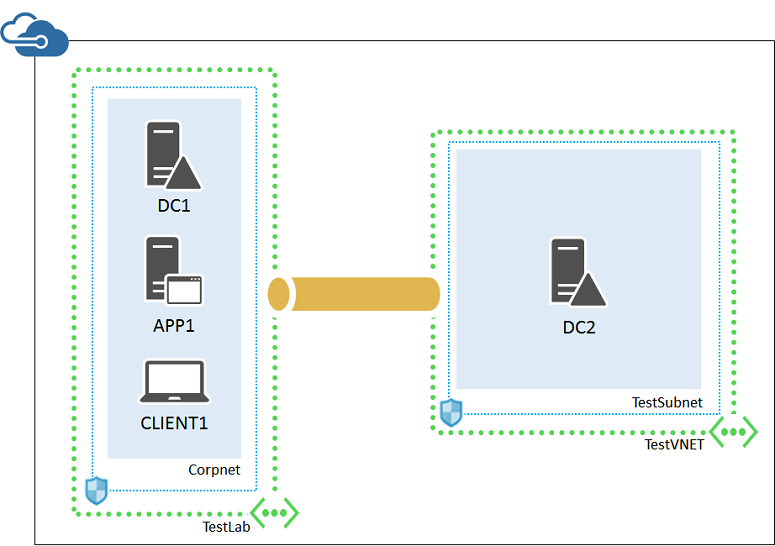
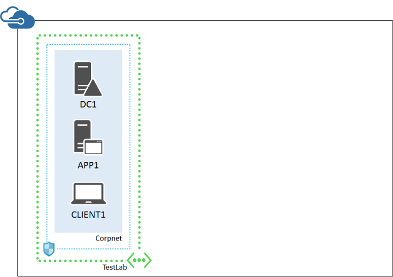
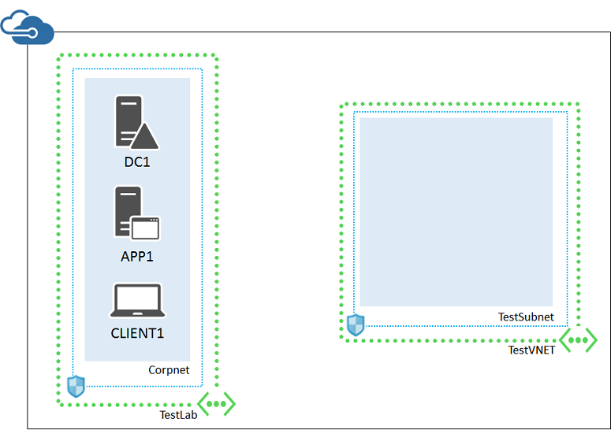
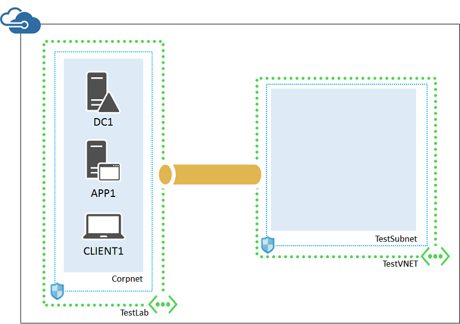

<properties 
    pageTitle="Simuliertes Hybriden Cloud-testumgebung | Microsoft Azure" 
    description="Erstellen eine simulierten Hybriden Cloud-Umgebung für IT Pro oder Entwicklungstests mit zwei Azure virtuelle Netzwerke und eine VNet-VNet-Verbindung." 
    services="virtual-machines-windows" 
    documentationCenter="" 
    authors="JoeDavies-MSFT" 
    manager="timlt" 
    editor=""
    tags="azure-resource-manager"/>

<tags 
    ms.service="virtual-machines-windows" 
    ms.workload="infrastructure-services" 
    ms.tgt_pltfrm="vm-windows" 
    ms.devlang="na" 
    ms.topic="article" 
    ms.date="09/30/2016" 
    ms.author="josephd"/>

# Einrichten einer simulierten Hybrid Cloud-Umgebung zum Testen

In diesem Artikel führt Sie durch die Erstellung einer simulierten Cloud hybridumgebung mit Microsoft Azure über zwei Azure virtuelle Netzwerke aus. So sieht die sich daraus ergebende Konfiguration aus.

Dies simuliert Herstellung eine hybridumgebung-Cloud und besteht aus:

- Ein simulierten und vereinfachte lokalen Netzwerk in einem Azure-virtuellen Netzwerk (TestLab virtuelles Netzwerk) gehostet werden.
- Ein simuliertes Cross lokale virtuelle Netzwerk in Azure (TestVNET) gehostet wird.
- Eine VNet-VNet-Verbindung zwischen den beiden virtuellen Netzwerken.
- Eine sekundäre Domänencontroller im Netzwerk virtuelle TestVNET.

Dies bietet eine Basis und allgemeine beginnend zeigen Sie aus dem können Sie:

- Entwickeln und Testen von Applications in einer simulierten Hybriden Cloud-Umgebung.
- Erstellen Sie Testkonfigurationen von Computern, einige innerhalb des virtuellen TestLab-Netzwerks und einige innerhalb des virtuellen Netzwerks TestVNET Hybrid cloudbasierten IT Auslastung simulieren.

Es gibt vier wichtige Phasen zu dieser hybriden Cloud Test-Umgebung einrichten:

1.  Konfigurieren des TestLab virtuellen Netzwerks an.
2.  Erstellen Sie das Cross lokale virtuelle Netzwerk.
3.  Die VNet-VNet-VPN-Verbindung zu erstellen.
4.  Konfigurieren von DC2. 

Diese Konfiguration erfordert ein Azure-Abonnement. Wenn Sie eine MSDN- oder Visual Studio-Abonnement besitzen, finden Sie unter [monatliche Azure Kreditkarte für Visual Studio Abonnenten](https://azure.microsoft.com/pricing/member-offers/msdn-benefits-details/).

>[AZURE.NOTE] Virtuellen Computern und virtuelles Netzwerkgateways in Azure entstehen einer laufenden monetäre Kosten, wenn sie ausgeführt werden. Diese Kosten anhand Ihrer MSDN in Rechnung gestellt oder kostenpflichtiges Abonnement. Ein Gateway Azure VPN wird als eine Reihe von zwei Azure-virtuellen Computern implementiert. Um die Kosten zu minimieren, erstellen Sie Umgebung für das und führen Sie der benötigten testen und Demo so schnell wie möglich aus.

## Phase 1: Konfigurieren des TestLab virtuellen Netzwerks

Führen Sie die Anweisungen im Thema [Base Konfiguration testen Umgebung](https://technet.microsoft.com/library/mt771177.aspx) konfigurieren Sie Computer DC1, APP1 und CLIENT1 in das Azure virtuelle Netzwerk mit dem Namen TestLab. 

Starten Sie nun eine Azure PowerShell-Eingabeaufforderung aus.

> [AZURE.NOTE] Mit dem folgende Befehl legt verwenden Azure PowerShell 1.0 und höher.

Melden Sie sich bei Ihrem Konto aus.

    Login-AzureRMAccount

Erhalten Sie den Namen Ihres Abonnements mit dem folgenden Befehl ein.

    Get-AzureRMSubscription | Sort SubscriptionName | Select SubscriptionName

Legen Sie Ihr Abonnement Azure. Verwenden Sie das gleiche Abonnement, das Sie zum Erstellen der grundlegenden Konfigurations in Phase 1 verwendet. Ersetzen Sie alles innerhalb der Anführungszeichen, einschließlich der < und > Zeichen, mit dem richtigen Namen.

    $subscr="<subscription name>"
    Get-AzureRmSubscription –SubscriptionName $subscr | Select-AzureRmSubscription

Fügen Sie ein Gateway Subnetz mit dem TestLab virtuellen Netzwerk Ihrer Basis-Konfiguration, die das Azure Gateway gehostet verwendet wird.

    $rgName="<name of your resource group that you used for your TestLab virtual network>"
    $locName="<Azure location name where you placed the TestLab virtual network, such as West US>"
    $vnet=Get-AzureRmVirtualNetwork -ResourceGroupName $rgName -Name TestLab
    Add-AzureRmVirtualNetworkSubnetConfig -Name "GatewaySubnet" -AddressPrefix 10.255.255.248/29 -VirtualNetwork $vnet
    Set-AzureRmVirtualNetwork -VirtualNetwork $vnet

Als Nächstes Anfordern einer öffentlichen IP-Adresse des Gateways für das TestLab virtuelle Netzwerk zuweisen.

    $gwpip=New-AzureRmPublicIpAddress -Name TestLab_pip -ResourceGroupName $rgName -Location $locName -AllocationMethod Dynamic

Erstellen Sie anschließend Ihre Gateway ein.

    $vnet=Get-AzureRmVirtualNetwork -Name TestLab -ResourceGroupName $rgName
    $subnet=Get-AzureRmVirtualNetworkSubnetConfig -Name "GatewaySubnet" -VirtualNetwork $vnet
    $gwipconfig=New-AzureRmVirtualNetworkGatewayIpConfig -Name TestLab_GWConfig -SubnetId $subnet.Id -PublicIpAddressId $gwpip.Id 
    New-AzureRmVirtualNetworkGateway -Name TestLab_GW -ResourceGroupName $rgName -Location $locName -IpConfigurations $gwipconfig -GatewayType Vpn -VpnType RouteBased

Orientieren Sie, die neue Gateways 20 Minuten oder mehr zum Erstellen von ausführen können.

Vom Azure-Portal auf Ihrem lokalen Computer Herstellen einer Verbindung mit DC1 mit den Anmeldeinformationen CORP\User1. Führen Sie die Domäne Unternehmen um zu konfigurieren, dass Computer und Benutzer für die Authentifizierung ihrer lokalen Domänencontroller verwenden, diese Befehle aus einer Administratorrechten Windows PowerShell-Eingabeaufforderung auf DC1 ein.

    New-ADReplicationSite -Name "TestLab" 
    New-ADReplicationSite -Name "TestVNET"
    New-ADReplicationSubnet -Name "10.0.0.0/8" -Site "TestLab"
    New-ADReplicationSubnet -Name "192.168.0.0/16" -Site "TestVNET"

Dies ist Ihre aktuelle Konfiguration.

 
## Phase 2: Erstellen von virtuellen Netzwerks TestVNET

Zunächst das TestVNET virtuelle Netzwerk erstellen und mit einer Netzwerk-Sicherheitsgruppe zu schützen.

    $rgName="<name of the resource group that you used for your TestLab virtual network>"
    $locName="<Azure location name where you placed the TestLab virtual network, such as West US>"
    $locShortName="<Azure location name from $locName in all lowercase letters with spaces removed. Example:  westus>"
    $testSubnet=New-AzureRMVirtualNetworkSubnetConfig -Name "TestSubnet" -AddressPrefix 192.168.0.0/24
    $gatewaySubnet=New-AzureRmVirtualNetworkSubnetConfig -Name "GatewaySubnet" -AddressPrefix 192.168.255.248/29
    New-AzureRMVirtualNetwork -Name "TestVNET" -ResourceGroupName $rgName -Location $locName -AddressPrefix 192.168.0.0/16 -Subnet $testSubnet,$gatewaySubnet –DNSServer 10.0.0.4
    $rule1=New-AzureRMNetworkSecurityRuleConfig -Name "RDPTraffic" -Description "Allow RDP to all VMs on the subnet" -Access Allow -Protocol Tcp -Direction Inbound -Priority 100 -SourceAddressPrefix Internet -SourcePortRange * -DestinationAddressPrefix * -DestinationPortRange 3389
    New-AzureRMNetworkSecurityGroup -Name "TestSubnet" -ResourceGroupName $rgName -Location $locShortName -SecurityRules $rule1
    $vnet=Get-AzureRMVirtualNetwork -ResourceGroupName $rgName -Name TestVNET
    $nsg=Get-AzureRMNetworkSecurityGroup -Name "TestSubnet" -ResourceGroupName $rgName
    Set-AzureRMVirtualNetworkSubnetConfig -VirtualNetwork $vnet -Name "TestSubnet" -AddressPrefix 192.168.0.0/24 -NetworkSecurityGroup $nsg

Als Nächstes Anfordern einer öffentlichen IP-Adresse des Gateways für das TestVNET virtuelle Netzwerk zugeordnet werden, und erstellen Ihr Gateway ein.

    $gwpip=New-AzureRmPublicIpAddress -Name TestVNET_pip -ResourceGroupName $rgName -Location $locName -AllocationMethod Dynamic
    $vnet=Get-AzureRmVirtualNetwork -Name TestVNET -ResourceGroupName $rgName
    $subnet=Get-AzureRmVirtualNetworkSubnetConfig -Name "GatewaySubnet" -VirtualNetwork $vnet
    $gwipconfig=New-AzureRmVirtualNetworkGatewayIpConfig -Name "TestVNET_GWConfig" -SubnetId $subnet.Id -PublicIpAddressId $gwpip.Id
    New-AzureRmVirtualNetworkGateway -Name "TestVNET_GW" -ResourceGroupName $rgName -Location $locName -IpConfigurations $gwipconfig -GatewayType Vpn -VpnType RouteBased

Dies ist Ihre aktuelle Konfiguration.

 
##Phase 3: Erstellen der VNet-VNet-Verbindungs

Lassen Sie sich einen zufälligen, kryptografisch, 32 Zeichen bestehende vorinstallierten Schlüssel zunächst von Ihrem Administrator Netzwerk oder Sicherheit. Alternativ können verwenden Sie die Informationen bei [erstellen eine zufällige Zeichenfolge für einen IPsec vorinstallierten Schlüssel](http://social.technet.microsoft.com/wiki/contents/articles/32330.create-a-random-string-for-an-ipsec-preshared-key.aspx) erhalten Sie einen vorinstallierten Schlüssel.

Als Nächstes verwenden Sie diese Befehle um die VNet-VNet-VPN-Verbindung zu erstellen, die einige Zeit in Anspruch nehmen können.

    $sharedKey="<pre-shared key value>"
    $gwTestLab=Get-AzureRmVirtualNetworkGateway -Name TestLab_GW -ResourceGroupName $rgName
    $gwTestVNET=Get-AzureRmVirtualNetworkGateway -Name TestVNET_GW -ResourceGroupName $rgName
    New-AzureRmVirtualNetworkGatewayConnection -Name TestLab_to_TestVNET -ResourceGroupName $rgName -VirtualNetworkGateway1 $gwTestLab -VirtualNetworkGateway2 $gwTestVNET -Location $locName -ConnectionType Vnet2Vnet -SharedKey $sharedKey
    New-AzureRmVirtualNetworkGatewayConnection -Name TestVNET_to_TestLab -ResourceGroupName $rgName -VirtualNetworkGateway1 $gwTestVNET -VirtualNetworkGateway2 $gwTestLab -Location $locName -ConnectionType Vnet2Vnet -SharedKey $sharedKey

Nach ein paar Minuten sollten die Verbindung hergestellt werden.

Dies ist Ihre aktuelle Konfiguration.

 
## Phase 4: Konfigurieren von DC2

Erstellen Sie zuerst eine virtuellen Computern für DC2 ein. Diese Befehle an der Azure-PowerShell-Eingabeaufforderung auf dem lokalen Computer ausführen.

    $rgName="<your resource group name>"
    $locName="<your Azure location, such as West US>"
    $saName="<the storage account name for the base configuration>"
    $vnet=Get-AzureRMVirtualNetwork -Name TestVNET -ResourceGroupName $rgName
    $pip=New-AzureRMPublicIpAddress -Name DC2-NIC -ResourceGroupName $rgName -Location $locName -AllocationMethod Dynamic
    $nic=New-AzureRMNetworkInterface -Name DC2-NIC -ResourceGroupName $rgName -Location $locName -SubnetId $vnet.Subnets[0].Id -PublicIpAddressId $pip.Id -PrivateIpAddress 192.168.0.4
    $vm=New-AzureRMVMConfig -VMName DC2 -VMSize Standard_A1
    $storageAcc=Get-AzureRMStorageAccount -ResourceGroupName $rgName -Name $saName
    $vhdURI=$storageAcc.PrimaryEndpoints.Blob.ToString() + "vhds/DC2-TestVNET-ADDSDisk.vhd"
    Add-AzureRMVMDataDisk -VM $vm -Name ADDS-Data -DiskSizeInGB 20 -VhdUri $vhdURI  -CreateOption empty
    $cred=Get-Credential -Message "Type the name and password of the local administrator account for DC2."
    $vm=Set-AzureRMVMOperatingSystem -VM $vm -Windows -ComputerName DC2 -Credential $cred -ProvisionVMAgent -EnableAutoUpdate
    $vm=Set-AzureRMVMSourceImage -VM $vm -PublisherName MicrosoftWindowsServer -Offer WindowsServer -Skus 2012-R2-Datacenter -Version "latest"
    $vm=Add-AzureRMVMNetworkInterface -VM $vm -Id $nic.Id
    $osDiskUri=$storageAcc.PrimaryEndpoints.Blob.ToString() + "vhds/DC2-TestLab-OSDisk.vhd"
    $vm=Set-AzureRMVMOSDisk -VM $vm -Name DC2-TestVNET-OSDisk -VhdUri $osDiskUri -CreateOption fromImage
    New-AzureRMVM -ResourceGroupName $rgName -Location $locName -VM $vm

Schließen Sie dann den neuen DC2 virtuellen Computer vom Azure-Portal.

Konfigurieren Sie anschließend eine Regel Windows-Firewall Datenverkehr für grundlegende-Verbindungstest zulässt. Führen Sie aus einem Administrator Ebene Windows PowerShell-Eingabeaufforderung auf DC2 folgende Befehle aus.

    Set-NetFirewallRule -DisplayName "File and Printer Sharing (Echo Request - ICMPv4-In)" -enabled True
    ping dc1.corp.contoso.com

Der Pingbefehl sollte vier erfolgreich Antworten von IP-Adresse 10.0.0.4 führen. Dies ist ein Test für den Datenverkehr über die VNet-VNet-Verbindung.

Fügen Sie des Datenträgers zusätzliche Daten auf DC2 als neue Volume mit dem Laufwerkbuchstaben F:.

1.  Im linken Bereich des Server-Manager klicken Sie auf **Datei und Storage Services**, und klicken Sie dann auf **Festplatten**.
2.  Klicken Sie im Bereich Inhalt in der Gruppe **Datenträger** (mit der **Partition** auf **unbekannten**festgelegt) auf **Datenträger 2** .
3.  Klicken Sie auf **Aufgaben**, und klicken Sie dann auf **Neues Volume**.
4.  Klicken Sie auf die vor Seite des Assistenten zu beginnen, klicken Sie auf **Weiter**.
5.  Wählen Sie auf der Seite Server und Datenträger klicken Sie auf **dem Datenträger 2**, und klicken Sie dann auf **Weiter**. Wenn Sie dazu aufgefordert werden, klicken Sie auf **OK**.
6.  Klicken Sie auf die Größe der Seite Lautstärke angeben klicken Sie auf **Weiter**.
7.  Klicken Sie auf Zuordnen zu einer Seite Laufwerk, Buchstaben oder einen Ordner klicken Sie auf **Weiter**.
8.  Klicken Sie auf der Seite Wählen Sie eine Datei Systemeinstellungen auf **Weiter**.
9.  Klicken Sie auf der Seite bestätigen Auswahl auf **Erstellen**.
10. Wenn Sie fertig sind, klicken Sie auf **Schließen**.

Konfigurieren Sie anschließend DC2 als Active Directory für die Domäne "corp.contoso.com" ein. Diese Befehle aus der Windows PowerShell-Eingabeaufforderung DC2 ausgeführt.

    Install-WindowsFeature AD-Domain-Services -IncludeManagementTools
    Install-ADDSDomainController -Credential (Get-Credential CORP\User1) -DomainName "corp.contoso.com" -InstallDns:$true -DatabasePath "F:\NTDS" -LogPath "F:\Logs" -SysvolPath "F:\SYSVOL"

Beachten Sie, dass Sie aufgefordert werden, sowohl das Kennwort CORP\User1 und ein Kennwort Directory Services wiederherstellen-Modus (DSRM) angeben, und DC2 neu zu starten.

Nachdem Sie nun das TestVNET virtuelle Netzwerk einen eigenen DNS-Server (DC2) enthält, müssen Sie das TestVNET virtuelle Netzwerk Verwendung dieses DNS-Servers konfigurieren.

1.  Im linken Bereich des Portals Azure klicken Sie auf das Symbol virtuelle Netzwerke, und klicken Sie dann auf **TestVNET**.
2.  Klicken Sie auf der Registerkarte **Einstellungen** auf **DNS-Server**.
3.  Geben Sie unter **primäre DNS-Server** **192.168.0.4** um 10.0.0.4 zu ersetzen.
4.  Klicken Sie auf **Speichern**.

Dies ist Ihre aktuelle Konfiguration. 

 
Ihre simulierten Hybriden Cloud-Umgebung kann nun zum Testen.

## Als Nächstes

- Einrichten einer [webbasierten, branchenspezifische Anwendung](virtual-machines-windows-ps-hybrid-cloud-test-env-lob.md) in dieser Umgebung.
