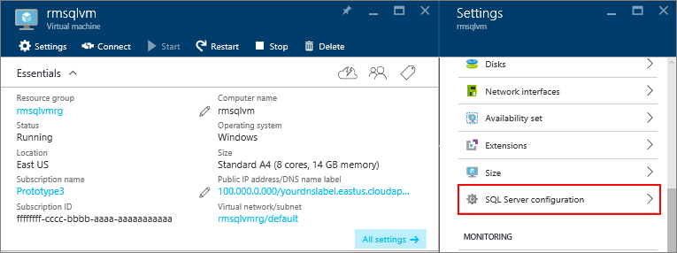
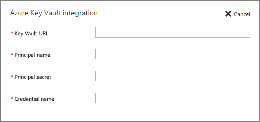

<properties
    pageTitle="Konfigurieren von Azure Key Tresor Integration für SQLServer auf virtuellen Computern Azure die (Ressourcen-Manager)"
    description="Erfahren Sie, wie die Konfiguration von SQL Server-Verschlüsselung mit Azure-Taste Tresor automatisieren. In diesem Thema wird erläutert, wie Azure-Taste Tresor Integration mit SQL Server mit Ressourcenmanager erstellte Maschinen verwenden."
    services="virtual-machines-windows"
    documentationCenter=""
    authors="rothja"
    manager="jhubbard"
    editor=""
    tags="azure-service-management"/>

<tags
    ms.service="virtual-machines-windows"
    ms.devlang="na"
    ms.topic="article"
    ms.tgt_pltfrm="vm-windows-sql-server"
    ms.workload="infrastructure-services"
    ms.date="10/25/2016"
    ms.author="jroth"/>

# Konfigurieren von Azure Key Tresor Integration für SQLServer auf virtuellen Computern Azure die (Ressourcen-Manager)

> [AZURE.SELECTOR]
- [Ressourcenmanager](virtual-machines-windows-ps-sql-keyvault.md)
- [Klassische](virtual-machines-windows-classic-ps-sql-keyvault.md)

## (Übersicht)
Es gibt verschiedene SQL Server Verschlüsselungsfeatures wie [transparent-Verschlüsselung (TDE)](https://msdn.microsoft.com/library/bb934049.aspx), [Spalte Ebene Verschlüsselung (Gitternetz)](https://msdn.microsoft.com/library/ms173744.aspx)und [zusätzliche Verschlüsselung](https://msdn.microsoft.com/library/dn449489.aspx). Diese Formen von Verschlüsselung ist es erforderlich, verwalten und speichern die cryptographic Tasten, die Sie für die Verschlüsselung verwenden. Der Dienst Azure Schlüssel Tresor (AKV) Dient zur Verbesserung der Sicherheit und Verwaltung der folgenden Schlüssel an einem sicheren und hochgradig verfügbaren Speicherort. Der [SQL Server-Connector](http://www.microsoft.com/download/details.aspx?id=45344) ermöglicht SQL Server, um diese Schlüssel aus Azure-Taste Tresor verwenden.

Wenn Sie mit SQL Server mit dem lokalen, es Computer sind [Schritte können zum Azure Schlüssel Tresor von Ihrem lokalen SQL Server-Computer zugreifen](https://msdn.microsoft.com/library/dn198405.aspx). Aber für SQL Server in Azure-virtuellen Computern, können Sie Zeit sparen, mit dem Feature *Azure Schlüssel Tresor Integration* .

Wenn dieses Feature aktiviert ist, es automatisch der SQL Server-Connector installiert, konfiguriert den EKM-Anbieter, um die Taste Tresor Azure zugreifen und erstellt die Anmeldeinformationen, damit Sie Ihre Tresor zugreifen können. Wenn Sie sich die Schritte in der Dokumentation oben erwähnten lokalen ansehen, können Sie sehen, dass dieses Feature die Schritte 2 und 3 Automatisierung. Lediglich, die Sie noch müssen manuell vornehmen möchten, besteht darin, die wichtigsten Tresor oder die Taste zu erstellen. Hier wird die gesamte Einrichtung von Ihrer SQL-VM automatisierte. Wenn dieses Feature dieses Setup abgeschlossen ist, können Sie T-SQL-Anweisungen zum Verschlüsseln der Datenbanken oder Sicherungen wie gewohnt beginnen ausführen.

[AZURE.INCLUDE [AKV Integration Prepare](../../includes/virtual-machines-sql-server-akv-prepare.md)]

## Aktivieren und Konfigurieren von AKV-integration
Sie können AKV Integration während der Bereitstellung aktivieren oder für vorhandene virtuelle Computer konfigurieren.

### Neuen virtuellen Computern
Wenn Sie eine neue SQL Server-virtuellen Computern mit Ressourcenmanager bereitgestellt werden, bietet das Azure-Portal einen Schritt zum Aktivieren der Azure-Taste Tresor Integration. Das Feature Azure-Taste Tresor steht nur für Enterprise, Developer und Evaluation Editionen von SQL Server.

Eine ausführliche exemplarische Vorgehensweise bereitgestellt finden Sie unter [Bereitstellen einer SQL Server-virtuellen Computern im Portal Azure](virtual-machines-windows-portal-sql-server-provision.md).

### Vorhandenen virtuellen Computern
Wählen Sie für vorhandene SQL Server-virtuellen Computern Ihrer SQL Server-virtuellen Computern aus. Wählen Sie dann im Abschnitt **SQL Server-Konfiguration** des Blades **Einstellungen** aus.

Klicken Sie in das Blade **SQL Server-Konfiguration** auf die Schaltfläche **Bearbeiten** im Abschnitt Integration automatisierte Schlüssel Tresor.

Klicken Sie abschließend auf die Schaltfläche **OK** klicken Sie auf das Ende der **SQL Server-Konfiguration** Blade, um Ihre Änderungen zu speichern.

>[AZURE.NOTE] Sie können auch mithilfe einer Vorlage AKV-Integration konfigurieren. Weitere Informationen finden Sie unter [Schnellstart Azure Vorlage zur Azure Schlüssel Tresor Integration](https://github.com/Azure/azure-quickstart-templates/tree/master/101-vm-sql-existing-keyvault-update).

[AZURE.INCLUDE [AKV Integration Next Steps](../../includes/virtual-machines-sql-server-akv-next-steps.md)]
