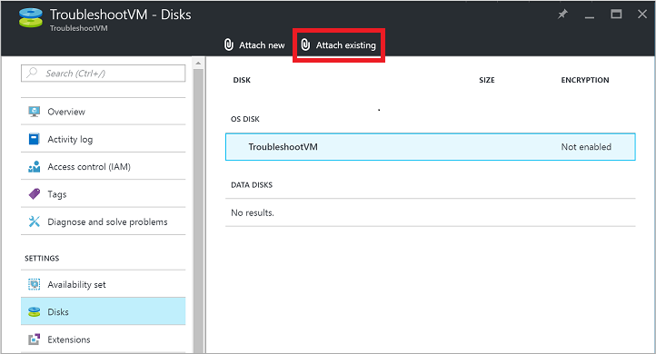
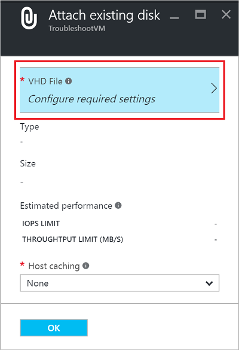

<properties
   pageTitle="Ein lokales Windows-Kennwort zurücksetzen, wenn Azure Gast Agent nicht installiert ist | Microsoft Azure"
   description="So setzen Sie das Kennwort des lokalen Windows-Benutzerkonto aus, wenn der Azure Gast-Agent nicht installiert werden, oder auf einen virtuellen funktionsfähige ist"
   services="virtual-machines-windows"
   documentationCenter=""
   authors="iainfoulds"
   manager="timlt"
   editor=""/>

<tags
   ms.service="virtual-machines-windows"
   ms.devlang="na"
   ms.topic="article"
   ms.tgt_pltfrm="vm-windows"
   ms.workload="infrastructure-services"
   ms.date="10/05/2016"
   ms.author="iainfou"/>

# <a name="how-to-reset-local-windows-password-for-azure-vm"></a>Wie Sie das Kennwort lokales Windows Azure-virtuellen Computer zurückzusetzen
Sie können das Kennwort des lokale Windows eines virtuellen Computers in Azure verwenden, die der [Azure-Portal oder Azure PowerShell](virtual-machines-windows-reset-rdp.md) bereitgestellt, dass der Gast Azure-Agent installiert ist, zurücksetzen. Diese Methode ist die primäre Methode zum Zurücksetzen des Kennworts für ein Azure-virtuellen Computer an. Wenn Sie Probleme auftreten, mit dem Azure Gast Agent nicht reagiert oder weiß nicht zu installieren, nachdem Sie ein benutzerdefiniertes Bild hochladen, Sie manuell können zurücksetzen einen Windows-Kennwort. Dieser Artikel enthält Informationen zum Zurücksetzen des Kennworts für eine lokale durch das OS virtuelle Laufwerk zu einem anderen virtuellen Computer anfügen. 

> [AZURE.WARNING] Verwenden Sie dieses Verfahren nur als letztes Mittel. Versuchen Sie immer, mit der [Azure-Portal oder Azure PowerShell](virtual-machines-windows-reset-rdp.md) zuerst ein Kennwort zurücksetzen.


## <a name="overview-of-the-process"></a>Übersicht über den Prozess
Die grundlegende Schritte zur Durchführung einer lokalen Kennwortrücksetzung für einen virtuellen Computer Windows Azure, wenn kein auf den Azure Gast Agent Zugriff sieht wie folgt aus:

- Löschen der Quelle virtueller Computer an. Die virtuellen Laufwerke aufbewahrt werden.
- Anfügen des virtuellen Computers Quelle OS Datenträger zu einem anderen virtuellen Computer innerhalb Ihres Abonnements Azure. Diesem virtuellen Computer ist als der bei der Problembehandlung virtueller Computer bezeichnet.
- Erstellen Sie mithilfe den Problembehandlung virtueller Computer einige Config-Dateien auf die Quelle virtuellen Computers OS Datenträger aus.
- Trennen des virtuellen Computers OS Datenträger aus dem zur Problembehandlung virtuellen Computer an.
- Verwenden Sie eine Ressourcenmanager-Vorlage zum Erstellen eines virtuellen Computers, mit dem ursprünglichen virtuellen Laufwerk ein.
- Wenn Sie der neue virtuellen Computer gestartet wird, aktualisieren die Config-Dateien, die Sie erstellen, das Kennwort des Benutzers erforderlich.


## <a name="detailed-steps"></a>Ausführliche Schritte
Versuchen Sie immer Zurücksetzen des Kennworts [Azure-Portal oder Azure PowerShell](virtual-machines-windows-reset-rdp.md) verwenden, bevor Sie versuchen, die folgenden Schritte aus. Stellen Sie sicher, dass Sie eine Sicherungskopie der Ihrer virtuellen Computer haben, bevor Sie beginnen. 

1. Löschen Sie den betroffenen virtuellen Computer Azure-Portal an. Löschen den virtuellen Computer werden nur die Metadaten, die den Bezug der den virtuellen Computer in Azure gelöscht. Die virtuellen Laufwerke aufbewahrt werden, wenn Sie der virtuellen Computer löschen:

    - Wählen Sie den virtuellen Computer im Azure-Portal aus, klicken Sie auf *Löschen*:

    

2. Anfügen des virtuellen Computers Quelle OS Datenträger, die zur Problembehandlung virtueller Computer an. Der Problembehandlung virtueller Computer muss sich in derselben Region als des virtuellen Computers Quelle OS Datenträger (z. B. `West US`):

    - Wählen Sie den Problembehandlung virtueller Computer Azure-Portal an. Klicken Sie auf *Datenträger* | *vorhandene anfügen*:

    

    Wählen Sie *Virtuelle Festplatte-Datei* , und wählen Sie dann auf das Speicherkonto, das eine Datenquelle virtueller Computer enthält:

    

    Wählen Sie aus der Quellcontainer. Der Quellcontainer ist in der Regel *virtuellen Festplatten*:

    

    Wählen Sie die OS virtuelle Festplatte anfügen. Klicken Sie auf *auswählen* , um den Vorgang abzuschließen:

    

3. Verbinden mit dem zur Problembehandlung virtuellen Computer mithilfe von Remotedesktop, und stellen Sie sicher, dass die Quelle virtuellen Computers OS Datenträger sichtbar ist:

    - Wählen Sie im Azure-Portal zur Problembehandlung den virtuellen Computer aus, und klicken Sie auf *Verbinden*.
    - Öffnen Sie die RDP-Datei, die downloads. Geben Sie den Benutzernamen und das Kennwort für die Problembehandlung virtueller Computer an.
    - Suchen Sie im Datei-Explorer für den Datenträger von Daten, den Sie angefügt. Wenn die Quelle der Daten nur Datenträger, die zur Problembehandlung virtuellen Computer angefügt virtuellen Computers virtuelle Festplatte ist, sollten sie das Laufwerk F::

    

4. Erstellen von `gpt.ini` in `\Windows\System32\GroupPolicy` auf Laufwerk des virtuellen Computers Quelle (wenn gpt.ini vorhanden ist, umbenennen in gpt.ini.bak):

    > [AZURE.WARNING] Stellen Sie sicher, dass Sie die folgenden Dateien versehentlich nicht in C:\Windows, das Laufwerk OS für die Problembehandlung virtuellen Computer erstellen. Erstellen Sie die folgenden Dateien in das Laufwerk OS für Ihre Quelle virtueller Computer, der als einen Datenträger angeschlossen ist.

    - Fügen Sie die folgenden Zeilen in der `gpt.ini` Datei, die Sie erstellt haben:

    ```
    [General]
    gPCFunctionalityVersion=2
    gPCMachineExtensionNames=[{42B5FAAE-6536-11D2-AE5A-0000F87571E3}{40B6664F-4972-11D1-A7CA-0000F87571E3}]
    Version=1
    ```

    
 
5. Erstellen von `scripts.ini` in `\Windows\System32\GroupPolicy\Machine\Scripts`. Stellen Sie sicher, dass ausgeblendete Ordner angezeigt werden. Erstellen Sie bei Bedarf die `Machine` oder `Scripts` Ordner.

    - Fügen Sie die folgenden Zeilen der `scripts.ini` Datei, die Sie erstellt haben:

    ```
    [Startup]
    0CmdLine=C:\Windows\System32\FixAzureVM.cmd
    0Parameters=
    ```

    
 
6. Erstellen von `FixAzureVM.cmd` in `\Windows\System32` mit dem folgenden Inhalt, ersetzen `<username>` und `<newpassword>` mit Ihren eigenen Werten:

    ```
    NET USER <username> <newpassword>
    ```

    

    Sie müssen die konfigurierten Kennwort Komplexität der virtuellen Computer erfüllen beim Definieren des neuen Kennwort ein.

7. Trennen Sie Azure-Portal den Datenträger aus dem zur Problembehandlung virtuellen Computer aus:

    - Wählen Sie im Azure-Portal zur Problembehandlung den virtuellen Computer aus, klicken Sie auf *Datenträger*.
    - Wählen Sie die Daten Festplatte in Schritt 2 angefügt, klicken Sie auf *Trennen*:

    

8. Vor der Erstellung eines virtuellen Computers den URI auf die Quelle OS Festplatte zu erhalten:

    - Wählen Sie das Speicherkonto Azure-Portal aus, klicken Sie auf *Blobs*.
    - Wählen Sie den Container aus. Der Quellcontainer ist in der Regel *virtuellen Festplatten*:

    

    Wählen Sie Ihre Quelle virtueller Computer OS virtuelle Festplatte aus, und klicken Sie auf die Schaltfläche *Kopieren* , klicken Sie neben der *URL* -Name:

    

9. Erstellen eines virtuellen Computers aus der Quelle virtuellen Computers OS Datenträger:

    - Verwenden Sie [diese Ressourcenmanager Azure-Vorlage](https://github.com/Azure/azure-quickstart-templates/tree/master/201-vm-from-specialized-vhd) zum Erstellen eines virtuellen Computers aus einer bestimmten virtuellen aus. Klicken Sie auf die `Deploy to Azure` Schaltfläche Azure-Portal mit den für Sie aufgefüllt mit Vorlagen Details zu öffnen.
    - Wenn Sie die vorherigen Einstellungen für den virtuellen Computer beibehalten möchten, wählen Sie die *Vorlage bearbeiten* , um Ihre vorhandene VNet, Subnetz, Netzwerkadapter oder öffentliche IP-Adresse angeben.
    - In der `OSDISKVHDURI` Textfeld Parameter, einfügen, die den URI Ihrer Datenquelle virtuelle Festplatte im vorherigen Schritt zu erhalten:

    

10. Nachdem Sie der neue virtuellen Computer ausgeführt wird, Herstellen einer Verbindung mit dem virtuellen Computer mithilfe von Remotedesktop mit dem neuen Kennwort, das Sie angegeben, in haben der `FixAzureVM.cmd` Skript.

11. Entfernen Sie die folgenden Dateien, um die Umgebung zu bereinigen aus der remote-Sitzung zu den neuen virtuellen Computer:

    - Aus %windir%\System32
        - Entfernen von FixAzureVM.cmd
    - Aus %windir%\System32\GroupPolicy\Machine\
        - Entfernen von scripts.ini
    - Aus %windir%\System32\GroupPolicy
        - Entfernen von gpt.ini (sofern gpt.ini war dies vor, und Sie gpt.ini.bak, die BAK-Datei wieder auf GPT.ini, Umbenennen umbenannt)

## <a name="next-steps"></a>Nächste Schritte
Wenn Sie weiterhin Remotedesktop verwenden verbinden können, finden Sie im [RDP zur Problembehandlung Guide](virtual-machines-windows-troubleshoot-rdp-connection.md). Die [ausführliche RDP Leitfaden zur Problembehandlung für](virtual-machines-windows-detailed-troubleshoot-rdp.md) befasst sich mit Methoden anstelle von bestimmter Schritte behandeln. Sie können auch für praktische Unterstützung [einer Azure Supportanfrage öffnen](https://azure.microsoft.com/support/options/) .