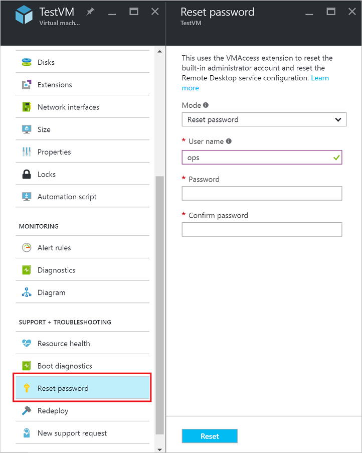
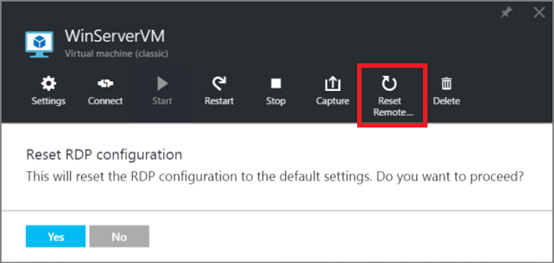

<properties
    pageTitle="Setzen Sie das Kennwort oder die Remotedesktop-Konfiguration auf einen Windows-virtuellen | Microsoft Azure"
    description="Informationen Sie zum Zurücksetzen des Kennworts für ein Konto oder Remote Desktop Services auf einem Windows virtuellen Computer mit dem Azure-Portal oder Azure PowerShell."
    services="virtual-machines-windows"
    documentationCenter=""
    authors="iainfoulds"
    manager="timlt"
    editor=""
    tags="azure-resource-manager"/>

<tags
    ms.service="virtual-machines-windows"
    ms.workload="infrastructure-services"
    ms.tgt_pltfrm="vm-windows"
    ms.devlang="na"
    ms.topic="article"
    ms.date="09/01/2016"
    ms.author="iainfou"/>

# Wie Sie den Dienst Remote Desktop oder deren Anmeldekennwort in einen Windows-virtuellen zurücksetzen

[AZURE.INCLUDE [learn-about-deployment-models](../../includes/learn-about-deployment-models-both-include.md)]

Wenn Sie mit einem Windows-Computer (virtueller Computer) herstellen können, können Sie das lokale Administratorkennwort zurücksetzen oder die Dienstkonfiguration Remotedesktop zurücksetzen. Entweder Azure-Portal oder die Erweiterung Zugriff virtueller Computer können in Azure PowerShell Sie das Kennwort zurücksetzen. Wenn Sie PowerShell verwenden, stellen Sie sicher, dass Sie das neueste PowerShell-Modul auf Ihrem Arbeitscomputer installiert haben und Ihr Abonnement Azure angemeldet sind. Lesen Sie die detaillierten Schritte [zum Installieren und Konfigurieren von Azure PowerShell](../powershell-install-configure.md)aus.

> [AZURE.TIP] Sie können die Version von PowerShell überprüfen, die Sie mithilfe von installiert haben`Import-Module Azure, AzureRM; Get-Module Azure, AzureRM | Format-Table Name, Version`

## Windows-virtuellen Computern im Modell zur Bereitstellung von Ressourcenmanager

### Azure-Portal
Wählen Sie Ihre virtuellen Computer aus, indem Sie auf **Durchsuchen** > **virtuellen Computern** > *Ihrem Windows-Computer* > **Alle Einstellungen** > **Kennwort zurücksetzen**. Das Kennwort zurücksetzen Blade wird angezeigt:

Geben Sie den Benutzernamen und ein neues Kennwort ein, und klicken Sie auf **Speichern**. Versuchen Sie erneut herstellen einer Verbindung mit Ihrem virtuellen Computer aus.

### VMAccess Erweiterung und PowerShell

Vergewissern Sie sich Azure PowerShell 1.0 oder höher installiert ist und Sie bei der Verwendung von Ihrem Konto angemeldet haben die `Login-AzureRmAccount` Cmdlet.

#### **Zurücksetzen des Kennworts für das lokale Administratorkonto**

Sie können den Namen des Administrators Kennwort oder Benutzer mithilfe des Befehls [Set-AzureRmVMAccessExtension](https://msdn.microsoft.com/library/mt619447.aspx) PowerShell zurücksetzen.

Erstellen Sie Ihren lokalen Administrator Anmeldeinformationen für das Konto mit den folgenden Befehl aus:

    $cred=Get-Credential

Wenn Sie einen anderen Namen als das aktuelle Konto eingeben, wird der folgende VMAccess Erweiterung Befehl benennt das lokale Administratorkonto, weist das Kennwort für dieses Konto und ein Remotedesktop Abmelden Ereignis Probleme. Wenn das lokale Administratorkonto deaktiviert ist, kann die Erweiterung VMAccess es aus.

Verwenden Sie Erweiterung des virtuellen Computer, um die neuen Anmeldeinformationen wie folgt festzulegen:

    Set-AzureRmVMAccessExtension -ResourceGroupName "myRG" -VMName "myVM" -Name "myVMAccess" `
        -Location WestUS -UserName $cred.GetNetworkCredential().Username `
        -Password $cred.GetNetworkCredential().Password -typeHandlerVersion "2.0"

Ersetzen Sie `myRG`, `myVM`, `myVMAccess`, und den Ort mit Werten für Ihr Setup relevant.

#### **Zurücksetzen der Dienstkonfiguration Remotedesktop**

Sie können remote-Zugriff auf Ihre virtuellen Computer mit [Set-AzureRmVMExtension](https://msdn.microsoft.com/library/mt603745.aspx) oder [AzureRmVMAccessExtension festlegen](https://msdn.microsoft.com/library/mt619447.aspx), wie folgt zurücksetzen. (Ersetzen die `myRG`, `myVM`, `myVMAccess` und einen Speicherort mit Ihren eigenen Werten.)

    Set-AzureRmVMExtension -ResourceGroupName "myRG" -VMName "myVM" `
        -Name "myVMAccess" -ExtensionType "VMAccessAgent" -Location WestUS `
        -Publisher "Microsoft.Compute" -typeHandlerVersion "2.0"

Oder: 

    Set-AzureRmVMAccessExtension -ResourceGroupName "myRG" -VMName "myVM" `
        -Name "myVMAccess" -Location WestUS -typeHandlerVersion "2.0

> [AZURE.TIP] Beide Befehle hinzufügen einen neuen benannten virtuellen Computer Access-Agent virtuellen Computer an. An eine beliebige Stelle kann ein virtueller Computer nur einen einzelnen virtueller Computer Access-Agent verfügen. Wenn der Zugriff virtueller Computer erfolgreich Agenteneigenschaften festlegen möchten, entfernen Sie den Access-Agent zuvor festlegen, indem Sie entweder `Remove-AzureRmVMAccessExtension` oder `Remove-AzureRmVMExtension`. Beginnend mit Azure PowerShell Version 1.2.2, können Sie diesen Schritt bei Verwendung von vermeiden `Set-AzureRmVMExtension` mit einem `-ForceRerun` Option. Bei Verwendung von `-ForceRerun`, vergewissern Sie sich mit demselben Namen für den virtuellen Computer Access-Agent gemäß durch den vorherigen Befehl.

Wenn Sie Remote weiterhin auf Ihre virtuellen Computern zugreifen können, finden Sie unter Weitere Maßnahmen, bei der [Problembehandlung bei Remotedesktop Verbindungen mit einer Windows-basierten Azure-virtuellen Computern](virtual-machines-windows-troubleshoot-rdp-connection.md)zu testen.

## Windows-virtuellen Computern im Bereitstellungsmodell klassischen

### Azure-portal

Mithilfe des Modells klassischen Bereitstellung erstellte Maschinen können die [Azure-Portal](https://portal.azure.com) Sie zum Zurücksetzen des Remote Desktop-Diensts. Klicken Sie auf: **Navigieren** > **virtuellen Computern (klassische)** > *Ihrem Windows-Computer* > **Remote zurücksetzen...**. Die folgende Seite angezeigt wird.

Sie können auch versuchen, den Namen und das Kennwort für das lokale Administratorkonto zurücksetzen. Klicken Sie auf: **Navigieren** > **virtuellen Computern (klassische)** > *Ihrem Windows-Computer* > **Alle Einstellungen** > **Kennwort zurücksetzen**. Die folgende Seite angezeigt wird.

Nachdem Sie den neuen Benutzernamen und das Kennwort eingegeben haben, klicken Sie auf **Speichern**.

### VMAccess Erweiterung und PowerShell

Stellen Sie sicher, dass der virtuellen Computer-Agent auf dem virtuellen Computer installiert ist. Die Erweiterung VMAccess muss nicht installiert werden, bevor Sie es verwenden können, solange des virtuellen Computer-Agents zur Verfügung steht. Stellen Sie sicher, dass die virtuellen Computer-Agent bereits installiert ist, mit dem folgenden Befehl. (Ersetzen Sie "MyCloudService" und ""MyVM "" durch die Namen der Cloud-Dienst und Ihre virtuellen Computer. Diese Namen erfahren Sie, indem Sie ausführen `Get-AzureVM` ohne Parameter.)

    $vm = Get-AzureVM -ServiceName "myCloudService" -Name "myVM"
    write-host $vm.VM.ProvisionGuestAgent

Wenn Sie **der Befehl **Schreiben-Host** angezeigt wird,**wird der virtuellen Computer-Agent installiert. Wenn **falsch**angezeigt wird, finden Sie unter den Anweisungen und einen Link zur Downloadwebsite in den Azure Blogbeitrag [virtueller Computer-Agents und Erweiterungen - Teil 2](http://go.microsoft.com/fwlink/p/?linkid=403947&clcid=0x409) .

Wenn Sie den virtuellen Computer mithilfe des Portals erstellt haben, überprüfen Sie, ob `$vm.GetInstance().ProvisionGuestAgent` gibt **True**zurück. Wenn dies nicht der Fall ist, können Sie es mit dem folgenden Befehl festlegen:

    $vm.GetInstance().ProvisionGuestAgent = $true

Dieser Befehl verhindert den folgenden Fehler auf, wenn Sie den Befehl **Set-AzureVMExtension** in den nächsten Schritten ausführen: "Bereitstellen von Gast Agent muss aktiviert werden auf dem Objekt virtueller Computer vor dem Einrichten der Access-Erweiterung IaaS VM."

#### **Zurücksetzen des Kennworts für das lokale Administratorkonto**

Erstellen Sie eine Anmeldung Anmeldeinformationen mit den aktuellen lokaler Administratorkontonamen und ein neues Kennwort ein, und führen Sie die `Set-AzureVMAccessExtension` wie folgt.

    $cred=Get-Credential
    Set-AzureVMAccessExtension –vm $vm -UserName $cred.GetNetworkCredential().Username `
        -Password $cred.GetNetworkCredential().Password  | Update-AzureVM

Wenn Sie einen anderen Namen als das aktuelle Konto eingeben, wird die Erweiterung VMAccess benennt das lokale Administratorkonto, weist das Kennwort für dieses Konto und Probleme mit einem Abmeldung Remotedesktop. Wenn das lokale Administratorkonto deaktiviert ist, kann die Erweiterung VMAccess es aus.

Diese Befehle zurücksetzen auch die Dienstkonfiguration Remotedesktop.

#### **Zurücksetzen der Dienstkonfiguration Remotedesktop**

Wenn die Dienstkonfiguration Remotedesktop zurücksetzen möchten, führen Sie den folgenden Befehl aus:

    Set-AzureVMAccessExtension –vm $vm | Update-AzureVM

Die Erweiterung VMAccess bei zwei Befehle des virtuellen Computers ausgeführt wird:

- `netsh advfirewall firewall set rule group="Remote Desktop" new enable=Yes`

Dieser Befehl ermöglicht die integrierte Windows-Firewall-Gruppe, die eingehenden Remotedesktop Datenverkehr ermöglicht, der TCP-Port 3389 verwendet.

- `Set-ItemProperty -Path 'HKLM:\System\CurrentControlSet\Control\Terminal Server' -name "fDenyTSConnections" -Value 0`

Dieser Befehl stellt die fDenyTSConnections Registrierungseintrag auf 0, aktivieren Remote Desktop-Verbindungen.

## Nächste Schritte

Wenn die Access-Erweiterung Azure-virtuellen Computer nicht reagiert und Sie keine zum Zurücksetzen des Kennworts können, können Sie [offline das lokale Windows-Kennwort zurücksetzen](virtual-machines-windows-reset-local-password-without-agent.md). Diese Methode ist ein komplexerer Vorgang und erfordert, dass Sie die virtuelle Festplatte von den problematische virtuellen Computer zu einem anderen virtuellen Computer zu verbinden. Führen Sie die Schritte in diesem Artikel beschrieben sind, zuerst, und versuchen Sie nur die offline Kennwort zurücksetzen Methode als letzte Möglichkeit.

[Azure-virtuellen Computer-Erweiterungen und Funktionen](virtual-machines-windows-extensions-features.md)

[Verbinden Sie mit einem Azure-virtuellen Computern mit RDP oder SSH](http://msdn.microsoft.com/library/azure/dn535788.aspx)

[Behandeln von Problemen mit Remote Desktop-Verbindungen mit einem Windows-basierten Azure-virtuellen Computern](virtual-machines-windows-troubleshoot-rdp-connection.md)
