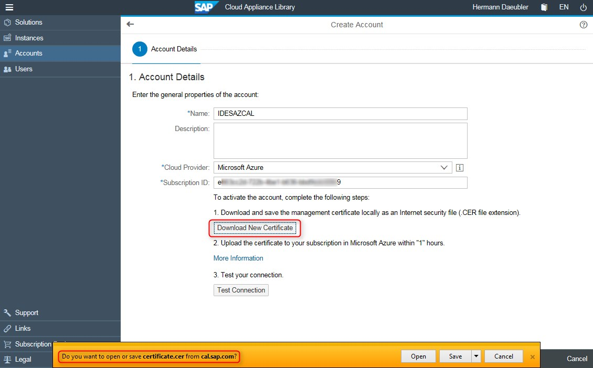
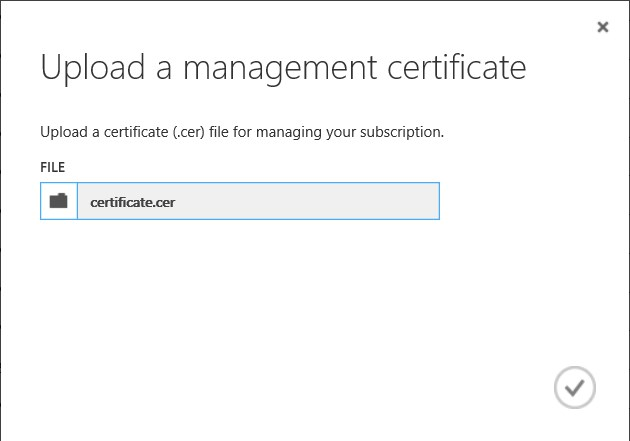
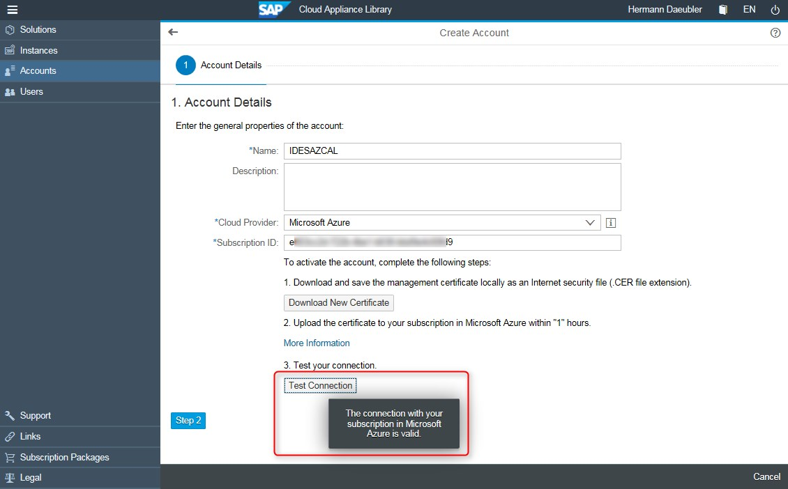
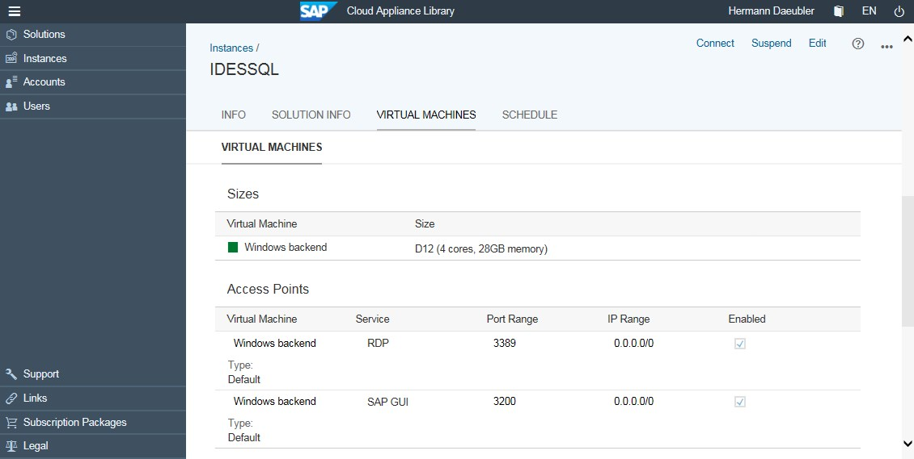

<properties 
pageTitle="Bereitstellen von SAP-IDES EHP7 SP3 für SAP-ERP 6.0 auf Microsoft Azure | Microsoft Azure" 
description="Bereitstellen von SAP-IDES EHP7 SP3 für SAP-ERP 6.0 auf Microsoft Azure" 
services="virtual-machines-windows" 
documentationCenter="" 
authors="hermanndms" 
manager="timlt" 
editor="" 
tags="azure-resource-manager" 
keywords=""/> 
<tags 
ms.service="virtual-machines-windows" 
ms.devlang="na" 
ms.topic="article" 
ms.tgt_pltfrm="vm-windows" 
ms.workload="infrastructure-services" 
ms.date="09/16/2016" 
ms.author="hermannd"/> 

# Bereitstellen von SAP-IDES EHP7 SP3 für SAP-ERP 6.0 auf Microsoft Azure 

In diesem Artikel beschrieben, wie für die Bereitstellung von SAP-IDES mit SQL Server und Windows-Betriebssystem auf Microsoft Azure über SAP-Cloud Einheit Bibliothek 3.0 ausgeführt wird. Die Screenshots zeigen den Prozess Schritt für Schritt. Bereitstellen von anderen Lösungen in der Liste funktioniert die gleiche Weise wie im Hinblick auf Prozess. Eine muss nur eine andere Lösung auswählen.

Zunächst SAP-Cloud Einheit (SAP-CAL) finden Sie [hier](https://cal.sap.com/). Es gibt ein Blog von SAP zu den neuen [SAP-Cloud Einheit Bibliothek 3.0](http://scn.sap.com/community/cloud-appliance-library/blog/2016/05/27/sap-cloud-appliance-library-30-came-with-a-new-user-experience)aus. 

Die folgenden Screenshots zeigen schrittweise wie SAP IDES auf Microsoft Azure bereitgestellt. Der Prozess funktioniert die gleiche Weise wie für andere Lösungen.

Das erste Bild zeigt alle Lösungen, die auf Microsoft Azure verfügbar sind. Die hervorgehobenen IDES für Windows-basiertem SAP-Lösung, die nur auf Azure verfügbar ist, wechseln Sie durch das Verfahren ausgewählt wurde.

Ein neues SAP-CAL Konto muss zuerst erstellt werden. Aktuell sind zwei Optionen für Azure - standard Azure und Azure auf China Festland, die von Partner 21Vianet betrieben wird.

Verfügt über eine die Azure-Abonnement-ID eingeben, die im Azure-Portal - auch finden Sie unter weiter unten Bezugsarten gefunden werden können. Danach muss ein Zertifikat Azure Management heruntergeladen werden.

In der neuen Azure sucht Portal eine das Element "Abonnements" auf der linken Seite. Klicken Sie auf, um alle aktiven Abonnements für Ihre Benutzer anzeigen.

Auswählen eines der Abonnements, und klicken Sie dann auf auswählen, dass die "Verwaltung von Zertifikaten", die es wird erläutert, ist ein neues Konzept "Dienst Hauptbenutzer" für das neue Ressourcenmanager Azure-Modell verwenden.
SAP-CAL ist nicht für dieses neue Modell noch angepasst und ist immer noch "klassisch" und im früheren Azure-Portal für die Arbeit mit der Verwaltung von Zertifikaten erforderlich.

Hier eine das Azure-Portal unter seinem früheren angezeigt. Der Upload eines Zertifikats Management bietet SAP-CAL die Berechtigungen zum Erstellen von virtuellen Computern innerhalb einer Kundenabonnement. Klicken Sie unter "ABONNEMENTS" finde Registerkarte eine die Abonnement-ID, die im Portal SAP-CAL eingegeben werden muss.

Klicken Sie auf der zweiten Registerkarte kann dann das Zertifikat Management hochladen, das vor dem von SAP-CAL heruntergeladen wurde.

Ein kleines Dialogfeld eingeblendet wird, um die heruntergeladene Zertifikatsdatei auszuwählen.

Nachdem das Zertifikat hochgeladen wurde die Verbindung zwischen SAP-CAL und den Kunden Azure-Abonnement innerhalb der SAP-CAl getestet werden kann. Eine kleines Nachricht daraufhin gestartet weist, dass die Verbindung gültig ist.

Nach dem Einrichten eines Kontos verfügt über eine Auswahl eine Lösung, die bereitgestellt werden soll, und erstellen Sie eine Instanz aus.
Mit dem Modus "basic" ist es wirklich einfach. Geben Sie einen Instanznamen, wählen Sie eine Azure Region und definieren Sie das master-Kennwort für die Lösung.

Nach einiger Zeit je nach Größe und Komplexität der Lösung (eine Schätzung wird von SAP-CAL angegeben), wird es als "aktiv" und zur Verwendung bereit angezeigt. Es ist sehr einfach.

Einige Details der Lösung eine sehen welche Art von virtuellen Computern bereitgestellt wurden. In diesem Fall besteht eine einzelne Azure virtueller Computer Größe D12, die vom SAP-CAL erstellt wurde.

Klicken Sie im Portal Azure des virtuellen Computers finden Sie beginnend mit der gleichen Instanznamen, der im SAP-CAL angegeben wurde.

Jetzt ist es möglich, mit der Lösung über die Schaltfläche verbinden im Portal SAP-CAL verbinden. Das Dialogfeld etwas enthält einen Link zu einer Benutzerhandbuch, das die standardmäßigen Anmeldeinformationen für die Arbeit mit der Lösung beschrieben.
[Hier](https://caldocs.hana.ondemand.com/caldocs/help/Getting_Started_Guide_IDES607MSSQL.pdf) ist der Link zu den Leitfaden für die Lösung IDES.

Eine andere Möglichkeit besteht darin zu den Windows-virtuellen Computer anmelden, und beginnen Sie beispielsweise die vorkonfiguriertes SAP-Benutzeroberfläche.

