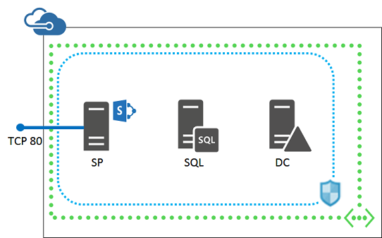
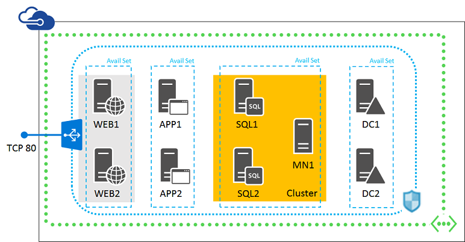
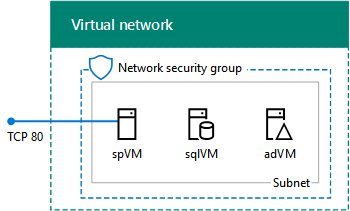

<properties
    pageTitle="Erstellen von SharePoint Server-Farmen | Microsoft Azure"
    description="Erstellen Sie schnell eine neue SharePoint 2013 oder 2016 SharePoint-Farm in Azure."
    services="virtual-machines-windows"
    documentationCenter=""
    authors="JoeDavies-MSFT"
    manager="timlt"
    editor=""
    tags="azure-resource-manager"/>

<tags
    ms.service="virtual-machines-windows"
    ms.workload="infrastructure-services"
    ms.tgt_pltfrm="vm-windows"
    ms.devlang="na"
    ms.topic="article"
    ms.date="09/30/2016"
    ms.author="josephd"/>

# Erstellen von SharePoint Server-Farmen

[AZURE.INCLUDE [learn-about-deployment-models](../../includes/learn-about-deployment-models-rm-include.md)]Klassisch.

## SharePoint 2013-Farmen

Mit dem Portal Microsoft Azure Marketplace können Sie schnell vorkonfigurierte SharePoint Server 2013 Farmen erstellen. Dies können Sie ein viel Zeit sparen, oder wenn Sie eine SharePoint-Farm einfache oder hoher Verfügbarkeit für eine Test-/-Umgebung erforderlich ist, wenn Sie SharePoint Server 2013 als eine Lösung für die Zusammenarbeit für Ihre Organisation bewerten möchten.

> [AZURE.NOTE] Das **SharePoint-Serverfarm** Element in der Azure Marketplace des Portals Azure wurde entfernt. Es wurde mit **SharePoint 2013 nicht-HA Farm** und **SharePoint 2013 HA Farm** Elemente ersetzt.

Die grundlegende SharePoint-Farm besteht aus drei virtuellen Computern in dieser Konfiguration.

Sie können dieser Farmkonfiguration für ein vereinfachtes Setup für SharePoint-app-Entwicklung oder der erstmaligen Auswertung von SharePoint 2013 verwenden.

So erstellen Sie die grundlegende SharePoint-Farm (drei-Server)

1. Klicken Sie auf [hier](https://azure.microsoft.com/marketplace/partners/sharepoint2013/sharepoint2013farmsharepoint2013-nonha/).
2. Klicken Sie auf **Bereitstellen**.
3. Klicken Sie im Bereich **SharePoint 2013 nicht-HA Farm** auf **Erstellen**.
4. Festlegen Sie der Einstellungen für die einzelnen Schritte nur das **Erstellen von SharePoint 2013 nicht-HA Farm** Bereich, und klicken Sie dann auf **Erstellen**.

Die SharePoint-Farm mit hoher Verfügbarkeit besteht aus neun virtuellen Computern in dieser Konfiguration.

Diese Farmkonfiguration können Sie um höhere Client lädt, hohe Verfügbarkeit der externen SharePoint-Website und SQL Server AlwaysOn Verfügbarkeit von Gruppen für eine SharePoint-Farm zu testen. Sie können auch diese Konfiguration für SharePoint-app-Entwicklung in einer Umgebung mit hoher Verfügbarkeit verwenden.

So erstellen Sie die SharePoint-Farm in hoher Verfügbarkeit (9-Server)

1. Klicken Sie auf [hier](https://azure.microsoft.com/marketplace/partners/sharepoint2013/sharepoint2013farmsharepoint2013-ha/).
2. Klicken Sie auf **Bereitstellen**.
3. Klicken Sie im Bereich **SharePoint 2013 HA Farm** auf **Erstellen**.
4. Geben Sie auf den Rand des Bereichs **Erstellen SharePoint 2013 HA Farm** sieben Schritte Einstellungen an, und klicken Sie dann auf **Erstellen**.

> [AZURE.NOTE] Sie können keine der **SharePoint 2013 nicht-HA Farm** oder **SharePoint 2013 HA-Farm** mit einer Azure kostenlose Testversion erstellen.

Azure-Portal erstellt beide der folgenden Farmen in der Cloud nur virtuelles Netzwerk mit einer Internet zugänglichen Web Anwesenheitsinformationen. Es gibt keine Standort-zu-Standort VPN oder ExpressRoute Verbindung wieder mit dem Netzwerk Ihrer Organisation aus.

> [AZURE.NOTE] Wenn Sie die Basic oder hoher Verfügbarkeit SharePoint-Farmen mit Azure-Portal, Sie können keine vorhandene Ressourcengruppe angeben. Wenn Sie diese Einschränkung umgehen, erstellen Sie diese Farmen mit Azure PowerShell aus. Weitere Informationen finden Sie unter [Erstellen von SharePoint 2013 Test-/Farmen mit Azure PowerShell](https://technet.microsoft.com/library/mt743093.aspx#powershell).

## 2016 SharePoint-Farmen

Finden Sie [in diesem Artikel](https://technet.microsoft.com/library/mt723354.aspx) beschrieben vor, um die folgenden einzelnen Server SharePoint Server 2016 Farm erstellen aus.

## Verwalten von SharePoint-Farmen

Sie können die folgenden Farmen über Remote Desktop-Verbindungen-Server verwalten. Weitere Informationen finden Sie unter [Melden Sie sich bei der virtuellen Computern](virtual-machines-windows-hero-tutorial.md#log-on-to-the-virtual-machine).

Aus der zentralen Verwaltung-SharePoint-Website können Sie Meine Websites, SharePoint-Anwendungen und sonstige Funktionen konfigurieren. Weitere Informationen finden Sie unter [Konfigurieren von SharePoint](http://technet.microsoft.com/library/ee836142.aspx).

## Nächste Schritte

- Ermitteln Sie zusätzlicher [SharePoint Konfigurationen](https://technet.microsoft.com/library/dn635309.aspx) in Azure-Infrastrukturdiensten an.
