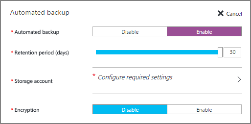

<properties
    pageTitle="Automatische Sicherung für SQL Server-virtuellen Computern (Ressourcenmanager) | Microsoft Azure"
    description="Wird das Feature für die automatische Sicherung für SQL Server ausgeführt in Azure virtuellen Computern mit Ressourcenmanager erläutert. "
    services="virtual-machines-windows"
    documentationCenter="na"
    authors="rothja"
    manager="jhubbard"
    editor=""
    tags="azure-resource-manager"/>
<tags
    ms.service="virtual-machines-windows"
    ms.devlang="na"
    ms.topic="article"
    ms.tgt_pltfrm="vm-windows-sql-server"
    ms.workload="infrastructure-services"
    ms.date="07/14/2016"
    ms.author="jroth" />

# Automatische Sicherung für SQLServer in Azure-virtuellen Computern (Ressourcen-Manager)

> [AZURE.SELECTOR]
- [Ressourcenmanager](virtual-machines-windows-sql-automated-backup.md)
- [Klassische](virtual-machines-windows-classic-sql-automated-backup.md)

Automatische Sicherung konfiguriert [Verwaltete Sicherung in Microsoft Azure](https://msdn.microsoft.com/library/dn449496.aspx) automatisch für alle vorhandenen und neuen Datenbanken einer Azure virtuellen Computers SQL Server 2014 Standard oder Enterprise ausgeführt. So können Sie reguläre Datenbanksicherungskopien konfiguriert werden, die dauerhaften Azure Blob-Speicher nutzen. Automatische Sicherung hängt von den [SQL Server IaaS-Agent-Erweiterung](virtual-machines-windows-sql-server-agent-extension.md)ab.

[AZURE.INCLUDE [learn-about-deployment-models](../../includes/learn-about-deployment-models-rm-include.md)]Klassische Bereitstellungsmodell. Zum Anzeigen der klassischen Version der in diesem Artikel finden Sie unter [Automatische Sicherung für SQL Server in Azure-virtuellen Computern Classic](virtual-machines-windows-classic-sql-automated-backup.md).

## Erforderliche Komponenten

Um die automatische Sicherung verwenden möchten, sollten Sie folgende Vorkenntnisse aus:

**Betriebssystem**:

- WindowsServer 2012
- Windows Server 2012 R2

**SQL Server-Version/Edition**:

- Standard für SQL Server 2014
- SQL Server 2014 Enterprise

**Datenbank-Konfiguration**:

- Zieldatenbanken müssen Modell der vollständigen Wiederherstellung verwenden.

**Azure PowerShell**:

- [Installieren Sie die neuesten Azure PowerShell Befehle](../powershell-install-configure.md) , wenn Sie beabsichtigen, automatisierte Sicherung mit PowerShell konfigurieren.

>[AZURE.NOTE] Automatische Sicherung beruht auf die SQL Server IaaS-Agent-Erweiterung. Aktuelle SQL-virtuellen Computern Gallery-Bilder fügen diese Erweiterung standardmäßig hinzu. Weitere Informationen finden Sie unter [SQL Server IaaS-Agent-Erweiterung](virtual-machines-windows-sql-server-agent-extension.md).

## Einstellungen

Die folgende Tabelle beschreibt die Optionen, die für die automatische Sicherung konfiguriert werden können. Die tatsächliche Konfigurationsschritte variieren je nachdem, ob Sie die Azure-Portal oder Azure Windows PowerShell-Befehle verwenden.

|Einstellung|Bereich (Standard)|Beschreibung|
|---|---|---|
|**Automatische Sicherung**|Deaktivieren Sie aktivieren / (deaktiviert)|Aktiviert oder deaktiviert automatische Sicherung für eine Azure virtuellen Computer SQL Server 2014 Standard oder Enterprise ausgeführt.|
|**Aufbewahrungszeitraum**|1-30 Tage (30 Tage)|Die Anzahl der Tage, eine Sicherung beibehalten werden soll.|
|**Speicher-Konto**|Azure-Speicher-Konto (das Konto Speicherplatz für den angegebenen virtuellen Computer erstellt)|Ein Konto Azure-Speicher zum Speichern von Dateien mit dem automatischen Sicherung im BLOB-Speicher. Ein Containers wird an folgendem Speicherort speichern alle Sicherungsdateien erstellt. Die Benennungskonvention für die Sicherungsdatei enthält das Datum, Uhrzeit und Name des Computers.|
|**Verschlüsselung**|Deaktivieren Sie aktivieren / (deaktiviert)|Aktiviert oder deaktiviert Verschlüsselung. Wenn Verschlüsselung aktiviert ist, befinden sich die Zertifikate verwendet, um die Sicherung wiederherstellen in der angegebenen Speicher-Konto im gleichen Automaticbackup Container mit der gleichen Benennungskonvention. Wenn das Kennwort geändert wird, wird ein neues Zertifikat mit diesem Kennwort erstellt, aber das alte Zertifikat bleibt, um ältere Sicherungskopien wiederherstellen.|
|**Kennwort**|Kennworttext (keine)|Ein Kennwort für Schlüssel für die Verschlüsselung. Diese Option ist nur erforderlich, wenn die Verschlüsselung aktiviert ist. Um eine verschlüsselte Sicherung wiederherstellen, müssen Sie das richtige Kennwort und verwandte Zertifikat, das zum Zeitpunkt verwendet wurde, die die Sicherung durchgeführt wurde.|

## Konfiguration im Portal
Das Azure-Portal können Sie die automatische Sicherung während der Bereitstellung oder für vorhandene virtuelle Computer konfigurieren.

### Neuen virtuellen Computern
Verwenden Sie das Azure-Portal so konfigurieren Sie die automatische Sicherung beim Erstellen eines neuen SQL Server 2014 virtuellen Computers im Bereitstellungsmodell Ressourcenmanager.

Wählen Sie in der **SQL Server-Einstellungen** Blade **Automatische Sicherung**ein. Das folgende Azure Portals Bildschirmabbild zeigt das **SQL-automatische Sicherung** Blade.

Kontext finden Sie unter abgeschlossen auf [einer SQL Server-virtuellen Computern in Azure bereitgestellt](virtual-machines-windows-portal-sql-server-provision.md).

### Vorhandenen virtuellen Computern
Wählen Sie für vorhandene SQL Server-virtuellen Computern Ihrer SQL Server-virtuellen Computern aus. Wählen Sie dann im Abschnitt **SQL Server-Konfiguration** des Blades **Einstellungen** aus.

Klicken Sie in der **SQL Server-Konfigurations** -Blade auf die Schaltfläche **Bearbeiten** im Abschnitt für die automatische Sicherung.

Klicken Sie abschließend auf die Schaltfläche **OK** klicken Sie auf das Ende der **SQL Server-Konfiguration** Blade, um Ihre Änderungen zu speichern.

Wenn Sie zum ersten Mal die automatische Sicherung aktivieren, konfiguriert Azure SQL Server-IaaS Agent im Hintergrund aus. Während dieses Zeitraums möglicherweise Azure-Portal nicht angezeigt, die automatische Sicherung konfiguriert ist. Warten Sie einige Minuten, damit der Agent installiert, konfiguriert werden. Anschließend wider Azure-Portal die neuen Einstellungen aus.

>[AZURE.NOTE] Sie können auch die automatische Sicherung mithilfe einer Vorlage konfigurieren. Weitere Informationen finden Sie unter [Schnellstart Azure-Vorlage für die automatische Sicherung](https://github.com/Azure/azure-quickstart-templates/tree/master/101-vm-sql-existing-autobackup-update).

## Konfiguration mit PowerShell

Verwenden Sie nach der Bereitstellung Ihrer SQL VM, PowerShell so konfigurieren Sie die automatische Sicherung ein.

Im folgenden Beispiel PowerShell ist die automatische Sicherung für eine vorhandene 2014 virtuellen Computer von SQL Server konfiguriert. Der Befehl **AzureRM.Compute\New-AzureVMSqlServerAutoBackupConfig** konfiguriert die automatische Sicherung Einstellungen zum Speichern von Sicherungen in der Azure-Speicherkonto des virtuellen Computers zugeordnet. Diese Sicherungskopien werden 10 Tage lang aufbewahrt werden. Der Befehl **Set-AzureRmVMSqlServerExtension** aktualisiert den angegebenen Azure-virtuellen Computer mit diese Einstellungen.

    $vmname = "vmname"
    $resourcegroupname = "resourcegroupname"
    $autobackupconfig = AzureRM.Compute\New-AzureVMSqlServerAutoBackupConfig -Enable -RetentionPeriodInDays 10 -ResourceGroupName $resourcegroupname

    Set-AzureRmVMSqlServerExtension -AutoBackupSettings $autobackupconfig -VMName $vmname -ResourceGroupName $resourcegroupname

Es konnte installieren und Konfigurieren der SQL Server-IaaS Agent mehrere Minuten dauern.

Um die Verschlüsselung zu aktivieren, ändern Sie das vorherige Skript, um die **EnableEncryption** Parameter zusammen mit einem Kennwort (sicheren Zeichenfolge) für den Parameter **CertificatePassword** zu übergeben. Das folgende Skript ermöglicht die automatische Sicherung Einstellungen im vorherigen Beispiel und Verschlüsselung hinzugefügt.

    $vmname = "vmname"
    $resourcegroupname = "resourcegroupname"
    $password = "P@ssw0rd"
    $encryptionpassword = $password | ConvertTo-SecureString -AsPlainText -Force  
    $autobackupconfig = AzureRM.Compute\New-AzureVMSqlServerAutoBackupConfig -Enable -RetentionPeriod 10 -EnableEncryption -CertificatePassword $encryptionpassword -ResourceGroupName $resourcegroupname

    Set-AzureRmVMSqlServerExtension -AutoBackupSettings $autobackupconfig -VMName $vmname -ResourceGroupName $resourcegroupname

Führen Sie zum Deaktivieren der automatischen Sicherung das gleiche Skript ohne die **-Aktivieren** den Befehl **AzureRM.Compute\New-AzureVMSqlServerAutoBackupConfig** -Parameter. Das Fehlen der **-Aktivieren** Parameter zeigt den Befehl aus, um die Funktion zu deaktivieren. Wie bei der Installation können sie so deaktivieren Sie die automatische Sicherung mehrere Minuten.

>[AZURE.NOTE] Entfernen von SQL Server-IaaS Agent, die zuvor konfigurierten automatische Sicherung Einstellungen nicht entfernt. Vor dem deaktivieren oder Deinstallieren der SQL Server-IaaS Agent sollten Sie die automatische Sicherung deaktivieren.

## Nächste Schritte

Automatische Sicherung konfiguriert verwaltete Sicherung Azure-virtuellen Computern. Daher ist es wichtig, zum [Überprüfen der Dokumentation zur Sicherung verwaltet](https://msdn.microsoft.com/library/dn449496.aspx) , das Verhalten und die Auswirkungen zu verstehen.

Finden Sie zusätzliche sichern und Wiederherstellen Anleitungen für SQL Server auf Azure-virtuellen Computern im folgenden Thema: [Sicherung und Wiederherstellung für SQL Server in Azure virtuellen Computern](virtual-machines-windows-sql-backup-recovery.md).

Informationen zu anderen Automatisierungsaufgaben zur Verfügung finden Sie unter [SQL Server IaaS-Agent-Erweiterung](virtual-machines-windows-sql-server-agent-extension.md).

Weitere Informationen zum Ausführen von SQL Server auf Azure-virtuellen Computern finden Sie unter [SQL Server auf Azure-virtuellen Computern Übersicht](virtual-machines-windows-sql-server-iaas-overview.md).
