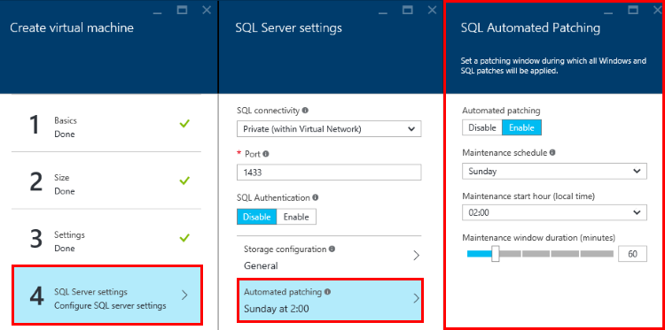
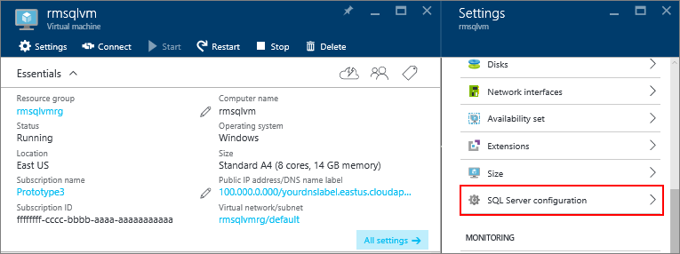

<properties
    pageTitle="Automatische Patch für SQL Server virtuellen Computern (Ressourcenmanager) | Microsoft Azure"
    description="Wird das Feature automatisierte Patch für SQL Server virtuellen Computern in Azure mit Ressourcenmanager erläutert."
    services="virtual-machines-windows"
    documentationCenter="na"
    authors="rothja"
    manager="jhubbard"
    editor=""
    tags="azure-resource-manager"/>
<tags
    ms.service="virtual-machines-windows"
    ms.devlang="na"
    ms.topic="article"
    ms.tgt_pltfrm="vm-windows-sql-server"
    ms.workload="infrastructure-services"
    ms.date="08/19/2016"
    ms.author="jroth" />

# Automatische Patch für SQLServer in Azure-virtuellen Computern (Ressourcen-Manager)

> [AZURE.SELECTOR]
- [Ressourcenmanager](virtual-machines-windows-sql-automated-patching.md)
- [Klassische](virtual-machines-windows-classic-sql-automated-patching.md)

Automatisierte Patchen stellt ein Wartungsfenster für ein Azure virtuellen Computern mit SQL Server her. Automatische Updates können nur in diesem Zeitraum installiert werden. Für SQL Server: dieses Rescriction damit ist sichergestellt, dass System-Updates und alle zugehörigen neu gestartet wurde in der möglichen Zeit für die Datenbank anfallen. Automatisierte Patchen hängt von den [SQL Server IaaS-Agent-Erweiterung](virtual-machines-windows-sql-server-agent-extension.md)ab.

[AZURE.INCLUDE [learn-about-deployment-models](../../includes/learn-about-deployment-models-rm-include.md)]Klassische Bereitstellungsmodell. Zum Anzeigen der klassischen Version der in diesem Artikel finden Sie unter [Automatische Patch für SQL Server in Azure-virtuellen Computern Classic](virtual-machines-windows-classic-sql-automated-patching.md).

## Erforderliche Komponenten

Um automatisierte Patch zu verwenden, sollten Sie folgende Vorkenntnisse aus:

**Betriebssystem**:

- WindowsServer 2012
- Windows Server 2012 R2

**SQL Server-Version**:

- SQLServer 2012
- SQLServer 2014
- SQLServer 2016

**Azure PowerShell**:

- [Installieren Sie die neuesten Azure PowerShell Befehle](../powershell-install-configure.md) , wenn Sie beabsichtigen, automatisierte Patch mit PowerShell konfigurieren.

>[AZURE.NOTE] Automatisierte Patchen beruht auf die SQL Server IaaS-Agent-Erweiterung. Aktuelle SQL-virtuellen Computern Gallery-Bilder fügen diese Erweiterung standardmäßig hinzu. Weitere Informationen finden Sie unter [SQL Server IaaS-Agent-Erweiterung](virtual-machines-windows-sql-server-agent-extension.md).

## Einstellungen

Die folgende Tabelle beschreibt die Optionen, die für die automatische Patch konfiguriert werden können. Die tatsächliche Konfigurationsschritte variieren je nachdem, ob Sie die Azure-Portal oder Azure Windows PowerShell-Befehle verwenden.

|Einstellung|Mögliche Werte|Beschreibung|
|---|---|---|
|**Automatische Patch**|Deaktivieren Sie aktivieren / (deaktiviert)|Aktiviert oder deaktiviert automatische Patch für eine Azure-virtuellen Computern.|
|**Planen der Wartung**|Täglich, Montag, Dienstag, Mittwoch, Donnerstag, Freitag, Samstag, Sonntag|Den Zeitplan für herunterladen und Installieren von Windows, SQL Server und Microsoft Updates für Ihre virtuellen Computern.|
|**Wartung Startstunde**|0-24|Die lokale Startzeit des virtuellen Computers zu aktualisieren.|
|**Wartung Fenster Dauer**|30-180|Die Anzahl der Minuten erlaubt, das Herunterladen und Installieren von Updates abzuschließen.|
|**Patchkategorie**|Wichtige|Die Kategorie des Updates zum Herunterladen und installieren.|

## Konfiguration im Portal
Azure-Portal können Sie automatisierte Patch während der Bereitstellung oder für vorhandene virtuelle Computer konfigurieren.

### Neuen virtuellen Computern
Verwenden Sie das Azure-Portal so konfigurieren Sie beim Erstellen einer neuen SQL Server-virtuellen Computern im Bereitstellungsmodell Ressourcenmanager automatisierte Patch.

Wählen Sie in der **SQL Server-Einstellungen** Blade **automatisierte Patch**ein. Das folgende Azure Portals Bildschirmabbild zeigt das Blade **Automatisierte SQL Patch** .

Kontext finden Sie unter abgeschlossen auf [einer SQL Server-virtuellen Computern in Azure bereitgestellt](virtual-machines-windows-portal-sql-server-provision.md).

### Vorhandenen virtuellen Computern
Wählen Sie für vorhandene SQL Server-virtuellen Computern Ihrer SQL Server-virtuellen Computern aus. Wählen Sie dann im Abschnitt **SQL Server-Konfiguration** des Blades **Einstellungen** aus.

Klicken Sie auf die Schaltfläche **Bearbeiten** im Abschnitt Patch automatisierte, in der **SQL Server-Konfiguration** Blade.

Klicken Sie abschließend auf die Schaltfläche **OK** klicken Sie auf das Ende der **SQL Server-Konfiguration** Blade, um Ihre Änderungen zu speichern.

Wenn Sie die automatische Patch zum ersten Mal aktivieren, konfiguriert Azure SQL Server-IaaS Agent im Hintergrund aus. Während dieses Zeitraums möglicherweise Azure-Portal nicht angezeigt, automatisierte Patch konfiguriert ist. Warten Sie einige Minuten, damit der Agent installiert, konfiguriert werden. Anschließend widerspiegeln Azure-Portal die neuen Einstellungen.

>[AZURE.NOTE] Sie können auch automatisierte Patch mithilfe einer Vorlage konfigurieren. Weitere Informationen finden Sie unter [Schnellstart Azure-Vorlage für automatische Patch](https://github.com/Azure/azure-quickstart-templates/tree/master/101-vm-sql-existing-autopatching-update).

## Konfiguration mit PowerShell

Verwenden Sie nach der Bereitstellung Ihrer SQL VM, PowerShell automatisierte Patch konfigurieren.

Im folgenden Beispiel wird PowerShell so konfigurieren Sie automatische Patch einer vorhandenen SQL Server virtuellen Computers verwendet. Der Befehl **AzureRM.Compute\New-AzureVMSqlServerAutoPatchingConfig** wird ein neues Wartungsfenster für automatische Updates konfiguriert.

    $vmname = "vmname"
    $resourcegroupname = "resourcegroupname"
    $aps = AzureRM.Compute\New-AzureVMSqlServerAutoPatchingConfig -Enable -DayOfWeek "Thursday" -MaintenanceWindowStartingHour 11 -MaintenanceWindowDuration 120  -PatchCategory "Important"

    Set-AzureRmVMSqlServerExtension -AutoPatchingSettings $aps -VMName $vmname -ResourceGroupName $resourcegroupname

In diesem Beispiel auf Grundlage, werden in der folgenden Tabelle die praktische Auswirkung auf das Ziel Azure-virtuellen Computer beschrieben:

|Parameter|Effekt|
|---|---|
|**Wochentag**|Updates installiert jeden Donnerstag.|
|**MaintenanceWindowStartingHour**|Beginnen Sie mit der Updates um 20:00 Uhr.|
|**MaintenanceWindowsDuration**|Patches müssen innerhalb von 120 Minuten installiert sein. Ausgehend von der Enduhrzeit, müssen sie nach 1:00 Uhr ausführen.|
|**PatchCategory**|Die einzige mögliche Einstellung für diesen Parameter ist **Wichtig**.|

Es konnte installieren und Konfigurieren der SQL Server-IaaS Agent mehrere Minuten dauern.

Um automatisierte Patch zu deaktivieren, führen Sie das gleiche Skript ohne die **-Aktivieren** die **AzureRM.Compute\New-AzureVMSqlServerAutoPatchingConfig**-Parameter. Das Fehlen der **-Aktivieren** Parameter zeigt den Befehl aus, um die Funktion zu deaktivieren.

## Nächste Schritte

Informationen zu anderen Automatisierungsaufgaben zur Verfügung finden Sie unter [SQL Server IaaS-Agent-Erweiterung](virtual-machines-windows-sql-server-agent-extension.md).

Weitere Informationen zum Ausführen von SQL Server auf Azure-virtuellen Computern finden Sie unter [SQL Server auf Azure-virtuellen Computern Übersicht](virtual-machines-windows-sql-server-iaas-overview.md).
