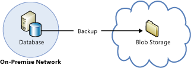

<properties
    pageTitle="Hohe Verfügbarkeit und Wiederherstellung für SQLServer | Microsoft Azure"
    description="Eine Erläuterung der verschiedenen Typen von HADR Strategien für SQL Server in Azure virtuellen Computern ausgeführt."
    services="virtual-machines-windows"
    documentationCenter="na"
    authors="MikeRayMSFT"
    manager="jhubbard"
    editor=""
    tags="azure-service-management"/>
<tags
    ms.service="virtual-machines-windows"
    ms.devlang="na"
    ms.topic="article"
    ms.tgt_pltfrm="vm-windows-sql-server"
    ms.workload="infrastructure-services"
    ms.date="10/20/2016"
    ms.author="MikeRayMSFT" />

# Hohe Verfügbarkeit und Disaster Wiederherstellung für SQL Server in Azure virtuellen Computern

## (Übersicht)

Microsoft Azure-virtuellen Computern (virtuellen Computern) mit SQL Server können Sie die Kosten für eine hohe Verfügbarkeit und Disaster Wiederherstellung (HADR) Datenbank Lösung senken. Die meisten SQL Server HADR Lösungen werden in Azure-virtuellen Computern, sowohl als nur Azure-Hybrid Lösungen unterstützt. In einer reinen Azure-Lösung wird das gesamte HADR System Azure ausgeführt. In einer Hybrid-Konfiguration wird ausgeführt Teil der Lösung Azure und die anderen Webpart ausgeführt lokal in Ihrer Organisation. Die Flexibilität der Azure-Umgebung ermöglicht Ihnen, teilweise oder vollständig und Azure zu wechseln, um das Budget und HADR Anforderungen Ihrer SQL Server-Datenbank-Systeme erfüllen.

[AZURE.INCLUDE [learn-about-deployment-models](../../includes/learn-about-deployment-models-both-include.md)]

## Grundlegendes zu die Notwendigkeit einer Lösung HADR

Es ist auf, um sicherzustellen, dass es sich bei Ihrem Datenbanksystem die HADR Funktionen verfügt, die die Vereinbarung zum Servicelevel (Vereinbarung zum SERVICELEVEL) erfordert. Die Fakultät, die Azure bietet eine hohe Verfügbarkeit Verfahren, wie z. B. Dienst Reparatur für Cloud-Diensten und Fehler bei der Wiederherstellung Erkennung für den virtuellen Computern, garantiert keine selbst, dass Sie die gewünschten Vereinbarung zum SERVICELEVEL erfüllen können. Diese Verfahren schützen der hohen Verfügbarkeit von der virtuellen Computern, aber nicht die hohen Verfügbarkeit von SQL Server innerhalb der virtuellen Computern ausgeführt. Es ist möglich für SQL Server-Instanz fehlschlägt, während Sie der virtuellen Computer online und nicht beschädigt ist. Darüber hinaus eine gerade Zahl der hohen Verfügbarkeit, die Verfahren von Azure bereitgestellten Ausfall eines der virtuellen Computern aufgrund von Ereignissen, wie z. B. Wiederherstellung von Software oder Hardware-Fehlern und Betriebssystem-Upgrades zulässig ist.

Darüber hinaus möglicherweise Geo redundante Speicher (GRS) in Azure, das mit sogenannten Geo-Replikation implementiert wird, keine ausreichend Disaster Wiederherstellung-Lösung für Ihre Datenbanken. Da Geo-Replikation asynchrone Daten gesendet werden, können aktuelle Updates nach Ausfall verloren gehen. Weitere Informationen zu Einschränkungen Geo-Replikation fallen im Abschnitt [Geo-Replikation ist nicht für Daten und Protokolldateien auf separaten Festplatten unterstützt](#geo-replication-support) .

## HADR Bereitstellungsarchitekturen

HADR für SQL Server-Technologien, die in Azure unterstützt werden umfassen:

- [Immer auf Verfügbarkeit Gruppen](https://technet.microsoft.com/library/hh510230.aspx)
- [Spiegeln von Datenbanken](https://technet.microsoft.com/library/ms189852.aspx)
- [Log Versand](https://technet.microsoft.com/library/ms187103.aspx)
- [Sichern und Wiederherstellen mit Azure Blob-Speicherdienst](https://msdn.microsoft.com/library/jj919148.aspx)
- [Immer auf Failovercluster Instanzen](https://technet.microsoft.com/library/ms189134.aspx)

Es ist möglich, kombinieren die Technologien zusammen, um eine SQL Server-Lösung implementieren, die sowohl hohe Verfügbarkeit und Disaster Wiederherstellungsfunktionen enthält. Je nach verwendeter Technologie, möglicherweise ein hybridbereitstellung einen VPN-Tunnel mit dem Azure virtuelle Netzwerk erforderlich. In den folgenden Abschnitten zeigen Sie einige der Bereitstellungsarchitekturen Beispiel.

## Nur Azure-: hohen Verfügbarkeit Lösungen

Sie können verfügen über eine hohe Verfügbarkeit-Lösung für SQL Server-Datenbanken in Azure Entwurfsphase immer auf Verfügbarkeit oder Database-Spiegelung.

| Technologie                               | Beispiel für Architekturen                    |
| ---------------------------------------- | ---------------------------------------- |
| **Immer auf Verfügbarkeit Gruppen**        | Alle Verfügbarkeit Replikate in Azure-virtuellen Computern für hohe Verfügbarkeit innerhalb derselben Region ausgeführt. Sie müssen so konfigurieren Sie einen Domänencontroller virtueller Computer, da Windows Server Failover Cluster (WSFC) Active Directory-Domäne erforderlich sind.   Weitere Informationen finden Sie unter [Konfigurieren von immer auf Verfügbarkeit von Gruppen in Azure (Benutzeroberfläche)](virtual-machines-windows-portal-sql-alwayson-availability-groups.md). |
| **Immer auf Failovercluster Instanzen** | Failover Cluster Instanzen (FCI), die freigegebenen Speicher erforderlich ist, können in 2 verschiedene Arten erstellt werden.  1. eine FCI auf einer zwei Knoten WSFC unter in Azure-virtuellen Computern mit Speicher von einer Drittanbieter-Cluster-Lösung unterstützt. Eine bestimmte Beispiel, bei das SIOS DataKeeper verwendet wird, finden Sie unter [hohe Verfügbarkeit für eine Dateifreigabe mit WSFC und 3rd Party Software SIOS Datakeeper](https://azure.microsoft.com/blog/high-availability-for-a-file-share-using-wsfc-ilb-and-3rd-party-software-sios-datakeeper/).  2. ein FCI auf einer zwei Knoten WSFC mit iSCSI remote-Ziel freigegeben blockieren Speicher über ExpressRoute in Azure-virtuellen Computern ausgeführt werden soll. Beispielsweise macht NetApp Private Speicher (NPS) ein iSCSI-Ziel über ExpressRoute mit Equinix zu Azure-virtuellen Computern verfügbar.  Für freigegebene Speicher von Drittanbietern und Daten Replikation Lösungen sollten Sie den Anbieter nach Problemen im Zusammenhang mit den Zugriff auf Daten auf Failover wenden.  Beachten Sie, dass mit FCI auf [Azure Dateispeicher](https://azure.microsoft.com/services/storage/files/) noch nicht, unterstützt wird, da diese Lösung nicht Premium-Speicher verwenden. Wir arbeiten, um dies zu früh unterstützen. |

## Nur Azure-: Disaster Wiederherstellung Lösungen

Können Sie verfügen über eine Disaster Wiederherstellung Lösung für Ihre SQL Server-Datenbanken in Azure Entwurfsphase immer auf Verfügbarkeit, Spiegeln von Datenbanken oder Sichern und Wiederherstellen mit Speicher Blobs.

| Technologie                               | Beispiel für Architekturen                    |
| ---------------------------------------- | ---------------------------------------- |
| **Immer auf Verfügbarkeit Gruppen**        | Verfügbarkeit von Replikaten für mehrere Rechenzentren in Azure-virtuellen Computern für die Wiederherstellung ausgeführt. Diese Kreuz-Region Lösung bietet Schutz vor abgeschlossen Standort.    Innerhalb eines Bereichs soll in der gleichen Cloud-Dienst und die gleichen VNet alle Replikate. Da jeder Region einer separaten VNet zur Verfügung steht, müssen diese Lösungen VNet VNet Connectivity. Weitere Informationen finden Sie unter [Konfigurieren einer Standort-zu-Standort VPN im klassischen Azure-Portal](../vpn-gateway/vpn-gateway-site-to-site-create.md). |
| **Spiegeln von Datenbanken**                   | Tilgungsanteile und Spiegelung und Servern in verschiedenen Rechenzentren für die Wiederherstellung ausgeführt. Sie müssen die Serverzertifikate verwenden, da active Directory-Domäne mehrere Rechenzentren umfassen kann nicht bereitstellen.  |
| **Sichern und Wiederherstellen mit Azure Blob-Speicherdienst** | Herstellung Datenbanken direkt an BLOB-Speicher in einem anderen Datencenter für die Wiederherstellung gesichert.  Weitere Informationen finden Sie unter [Sichern und Wiederherstellen für SQL Server in Azure virtuellen Computern](virtual-machines-windows-sql-backup-recovery.md). |

## Hybrid IT: Disaster Wiederherstellung Lösungen

Können Sie verfügen über eine Disaster Wiederherstellung-Lösung für SQL Server-Datenbanken in einer Hybrid-IT-Umgebung mit immer auf Verfügbarkeit Gruppen, Datenbank Spiegelung, Log Liefer- und Sichern und Wiederherstellen mit Azure Blogspeicher.

| Technologie                               | Beispiel für Architekturen                    |
| ---------------------------------------- | ---------------------------------------- |
| **Immer auf Verfügbarkeit Gruppen**        | Einige Verfügbarkeit-Replikate ausgeführt in Azure-virtuellen Computern und der anderen lokalen für die websiteübergreifende Wiederherstellung ausgeführt wird. Die Herstellung Website kann entweder lokalen werden oder in einer Azure Datacenter.  Da alle Verfügbarkeit Replikate im selben WSFC Cluster sein müssen, muss der WSFC Cluster beiden Netzwerken (mit mehreren Subnetz WSFC Cluster) umfassen. Diese Konfiguration erfordert eine VPN-Verbindung zwischen Azure und dem lokalen Netzwerk.  Für die erfolgreiche Wiederherstellung Ihrer Datenbanken sollten Sie auch am Notfallwiederherstellungsstandort Active Directory installieren.  Es ist möglich, der hinzufügen-Assistent in SSMS mit eine Azure Kopie einer vorhandenen immer auf Verfügbarkeit Gruppe hinzugefügt. Weitere Informationen finden Sie unter Lernprogramm: in Azure immer auf Verfügbarkeit Gruppe zu erweitern. |
| **Spiegeln von Datenbanken**                   | Eine Partner in einer Azure-virtuellen Computer und den anderen laufenden lokalen für die websiteübergreifende Wiederherstellung mithilfe von Serverzertifikaten ausgeführt. Partner müssen nicht in derselben Active Directory-Domäne sein, und es ist keine Verbindung VPN erforderlich.  Eine andere Datenbank Spiegelung Szenario umfasst eine Partner in einer Azure-virtuellen Computer und die anderen laufenden lokal in der gleichen Active Directory-Domäne für die websiteübergreifende Wiederherstellung ausgeführt. Eine [VPN-Verbindung zwischen dem Azure virtuelle Netzwerk und im lokalen Netzwerk](../vpn-gateway/vpn-gateway-site-to-site-create.md) ist erforderlich.  Für die erfolgreiche Wiederherstellung Ihrer Datenbanken sollten Sie auch am Notfallwiederherstellungsstandort Active Directory installieren. |
| **Log Versand**                         | Einen Server in einer Azure-virtuellen Computer und den anderen laufenden lokalen für die websiteübergreifende Wiederherstellung ausgeführt. Log Versand hängt von Windows-Dateifreigabe, damit eine VPN-Verbindung zwischen dem Azure virtuelle Netzwerk und im lokalen Netzwerk erforderlich ist.  Für die erfolgreiche Wiederherstellung Ihrer Datenbanken sollten Sie auch am Notfallwiederherstellungsstandort Active Directory installieren. |
| **Sichern und Wiederherstellen mit Azure Blob-Speicherdienst** | Lokalen Herstellung Datenbanken direkt in Azure Blob-Speicher für die Wiederherstellung gesichert.  Weitere Informationen finden Sie unter [Sichern und Wiederherstellen für SQL Server in Azure virtuellen Computern](virtual-machines-windows-sql-backup-recovery.md). |

## Wichtige Aspekte für SQL Server HADR in Azure

Azure virtuellen Computern, Speicher und Netzwerke haben andere funktionsspezifischen Besonderheiten als eine lokale, nicht virtualisierten IT-Infrastruktur. Eine erfolgreiche Implementierung einer HADR SQL Server-Lösung in Azure setzt voraus, dass Sie diese Unterschiede verstehen und Ihrer Lösung entwerfen, um diese zu berücksichtigen.

### Hohe Verfügbarkeit-Knoten in einem Satz Verfügbarkeit

Verfügbarkeit Datensätze in Azure ermöglichen Ihnen die hohen Verfügbarkeit-Knoten in separate Fehlerstrukturanalyse Domänen (FDs) und Domänen aktualisieren (UDs) zu platzieren. Für Azure virtuellen Computern in demselben Satz Verfügbarkeit platziert werden müssen Sie diese in der gleichen Cloud-Dienst bereitstellen. Nur Knoten in der gleichen Cloud-Dienst können in demselben Satz Verfügbarkeit teilnehmen. Weitere Informationen finden Sie unter [Verwalten der Verfügbarkeit von virtuellen Computern](virtual-machines-windows-manage-availability.md).

### WSFC Cluster Verhalten in Azure Netzwerke

Nicht RFC-kompatiblen DHCP-Dienst in Azure kann dazu führen, dass die Erstellung einer bestimmten WSFC Clusterkonfigurationen treten aufgrund der Clusternetzwerkname eine doppelte IP-Adresse, beispielsweise die IP-Adresse in einem der Clusterknoten zugewiesen wird. Dies ist ein Problem beim Implementieren immer auf Verfügbarkeit Gruppen, die von der Funktion WSFC abhängig ist.

Berücksichtigen Sie das Szenario aus, wenn ein Cluster mit zwei Knoten erstellt und online geschaltet ist:

1. Cluster online geht, und klicken Sie dann Knoten 1 anfordert, eine dynamisch zugewiesene IP-Adresse für den Clusternetzwerknamen.

2. Keine IP-Adresse als Knoten 1s eigenen IP-Adresse wird vom DHCP-Dienst angegeben, da der DHCP-Dienst erkennt, dass die Anfrage Knoten 1 kommen selbst.

3. Windows erkennt, dass eine doppelte Adresse Knoten 1 sowohl den Clusternetzwerknamen zugeordnet ist, und die Standardgruppe von Cluster nicht online geschaltet.

4. Die Standardgruppe von Cluster bewegt sich in Knoten 2, der den Knoten 1 IP-Adresse als behandelt die IP-Adresse die Cluster Standardgruppe online, damit die Teilnehmer.

5. Wenn Knoten 2 herstellen von Verbindungen mit Knoten 1 versucht, lassen Sie Pakete richtet sich an das Knoten 1 nie Knoten 2, da es den Knoten 1 IP-Adresse an sich selbst aufgelöst. Knoten 2 kann keine Verbindung mit Knoten 1 herstellen, klicken Sie dann sein Quorum verliert wird beendet, und der Cluster.

6. In der Zwischenzeit Knoten 1 senden Pakete auf Knoten 2, aber Knoten 2 kann nicht geantwortet werden. Knoten 1 sein Quorum verliert wird beendet, und der Cluster.

Dieses Szenario kann vermieden werden, indem Sie eine nicht verwendete statische IP-Adresse, wie etwa ein Link-lokale IP-Adresse wie 169.254.1.1, den Clusternetzwerknamen, damit der Clusternetzwerkname online schalten zuweisen. Um dieses Verfahren zu vereinfachen, finden Sie unter [Konfigurieren von Windows-Failovercluster in Azure für immer auf Verfügbarkeit Gruppen](http://social.technet.microsoft.com/wiki/contents/articles/14776.configuring-windows-failover-cluster-in-windows-azure-for-alwayson-availability-groups.aspx).

Weitere Informationen finden Sie unter [Konfigurieren von immer auf Verfügbarkeit von Gruppen in Azure (Benutzeroberfläche)](virtual-machines-windows-portal-sql-alwayson-availability-groups.md).

### Verfügbarkeit Gruppe Zuhörer support

Verfügbarkeit Gruppe Listener werden auf Azure-virtuellen Computern unter Windows Server 2008 R2, Windows Server 2012, Windows Server 2012 R2 und Windows Server 2016 unterstützt. Diese Unterstützung wird Computerherstellern durch die Verwendung der Lastenausgleich Endpunkte auf den Azure-virtuellen Computern, die Verfügbarkeit Gruppieren von Knoten sind aktiviert. Führen Sie die spezielle Konfigurationsschritte für die Listener für beide Clientanwendungen arbeiten, die in Azure als auch lokal ausführen ausgeführt werden.

Es gibt zwei grundlegende Optionen zum Einrichten Ihrer Zuhörer: externe (öffentlich) oder internen. Der externe (öffentlich) Zuhörer verwendet eine Internet gegenüberliegende Lastenausgleich und ist mit einer öffentlichen VIP (Virtual IP), die über das Internet zugänglich ist verknüpft. Eine interne Zuhörer verwendet eine interne Lastenausgleich und unterstützt nur Clients innerhalb der gleichen virtuellen Netzwerk. Laden für eine Lastenausgleich Typ, müssen Sie aktivieren, direkte Server zurück. 

Wenn der Verfügbarkeit Gruppe umfasst mehrere Azure Subnetze (beispielsweise eine Bereitstellung, die Azure Regionen schneidet), muss die Clientverbindungszeichenfolge enthalten "**MultisubnetFailover = WAHR**". Dadurch versucht, eine parallele Verbindung zu Replikaten in verschiedenen Subnetzen. Anweisungen zum Einrichten einer Zuhörer finden Sie unter

- [Konfigurieren eines ILB Zuhörer für immer auf Verfügbarkeit von Gruppen in Azure](virtual-machines-windows-portal-sql-ps-alwayson-int-listener.md).
- [Konfigurieren eines externen Zuhörer für immer auf Verfügbarkeit von Gruppen in Azure](virtual-machines-windows-classic-ps-sql-ext-listener.md).

Sie können weiterhin an jede Verfügbarkeit separat verbinden durch Herstellen einer Verbindung direkt auf die Instanz des Diensts. Da immer auf Verfügbarkeit Gruppen abwärtskompatibel mit Clients Spiegeln von Datenbanken sind, können Sie auch auf die Verfügbarkeit Replikate wie Partner Spiegelung, solange die Replikate ähnlich wie Datenbank Spiegelung konfiguriert sind Datenbank verbinden:

- Eine primäre Replikation und eine sekundäre Kopie

- Das sekundäre Replikat wird als nicht lesbar (**Lesbaren sekundäre** Option auf **Nein**festgelegt) konfiguriert.

Eine Beispiel-Client-Verbindungszeichenfolge, die diese Datenbank Spiegelung wie Konfiguration mit ADO.NET oder SQL Server Native Client entspricht, lautet wie folgt:

    Data Source=ReplicaServer1;Failover Partner=ReplicaServer2;Initial Catalog=AvailabilityDatabase;

Weitere Informationen zum Client Connectivity finden Sie unter:

- [Verwenden von Verbindung Zeichenfolge Stichwörtern mit SQL Server Native Client](https://msdn.microsoft.com/library/ms130822.aspx)
- [Verbinden von Clients mit einer Datenbank Spiegelung Sitzung (SQLServer)](https://technet.microsoft.com/library/ms175484.aspx)
- [Herstellen einer Verbindung mit Availability Group Zuhörer in Hybrid IT](http://blogs.msdn.com/b/sqlalwayson/archive/2013/02/14/connecting-to-availability-group-listener-in-hybrid-it.aspx)
- [Verfügbarkeit Gruppe Listener, Clientkonnektivität und Anwendungsfailover (SQLServer)](https://technet.microsoft.com/library/hh213417.aspx)
- [Verwenden von Datenbank Spiegelung Verbindungszeichenfolgen mit Verfügbarkeit von Gruppen](https://technet.microsoft.com/library/hh213417.aspx)

### Netzwerkwartezeit Hybrid IT

Sie sollten Ihre Lösung HADR unter der Voraussetzung, dass es möglicherweise Zeiträume mit hohem Netzwerkwartezeit zwischen Ihrem lokalen Netzwerk und Azure bereitstellen. Wenn Replikate auf Azure bereitstellen zu können, sollten Sie asynchrone Commit synchron Commit für die Synchronisierungsmodus verwenden. Beim Bereitstellen von Datenbank-Servern Spiegelung lokalen sowohl in Azure, verwenden den Modus hohe Leistung anstelle der Modus hoher Sicherheit.

### Unterstützung für Geo-Replikation

Geo-Replikation in Azure Datenträger unterstützt keine der Datendatei und die Protokolldatei derselben Datenbank auf separaten Datenträger gespeichert werden. GRS repliziert Änderungen auf jedem Datenträger unabhängig voneinander und asynchrone. Dieses Verfahren wird die Schreibreihenfolge innerhalb einer einzelnen Festplatte, klicken Sie auf die Kopie Geo repliziert, aber nicht über mehrere Datenträger Kopien Geo repliziert garantiert. Wenn Sie eine Datenbank zum Speichern der Datendatei und seine Protokolldatei auf separaten Festplatten konfigurieren, die wiederhergestellte Datenträger nach einem Datenverlust eine modernem Kopie der Datendatei als die Protokolldatei enthält möglicherweise der während der schreiben Log in SQL Server und die ACID-Eigenschaften von Transaktionen Umbrüche. Wenn Sie nicht über die Option zum Deaktivieren von Geo-Replikation im Speicher-Konto verfügen, sollten Sie alle Daten und Log-Dateien für eine bestimmte Datenbank auf demselben Datenträger beibehalten. Wenn Sie mehr als einen Datenträger aufgrund der Größe der Datenbank verwenden möchten, müssen Sie eine der aufgeführten, um sicherzustellen, dass Datenredundanz Disaster Wiederherstellung Solutions bereitstellen.

## Nächste Schritte

Wenn Sie eine Azure-virtuellen Computern mit SQL Server erstellen müssen, finden Sie unter [Bereitstellung eines SQL Server virtuellen Computers auf Azure](virtual-machines-windows-portal-sql-server-provision.md).

Um die optimale Leistung von SQL Server ausgeführt wird, eine Azure-virtuellen Computers zu gelangen, finden Sie die Anleitung im [Leistung bewährte Methoden für SQL Server in Azure virtuellen Computern](virtual-machines-windows-sql-performance.md)aus.

Weitere Themen im Zusammenhang mit dem SQL Server in Azure-virtuellen Computern ausgeführt wird finden Sie unter [SQL Server auf Azure virtuellen Computern](virtual-machines-windows-sql-server-iaas-overview.md).

### Weitere Ressourcen

- [Installieren Sie eine neue Active Directory-Struktur in Azure](../active-directory/active-directory-new-forest-virtual-machine.md)
- [Erstellen Sie WSFC Cluster für immer für die Verfügbarkeit von Gruppen in Azure-virtuellen Computer](http://gallery.technet.microsoft.com/scriptcenter/Create-WSFC-Cluster-for-7c207d3a)
