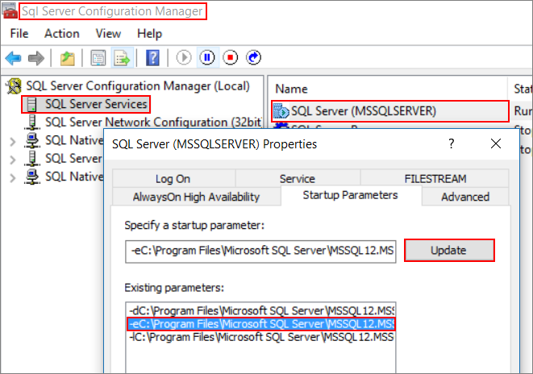
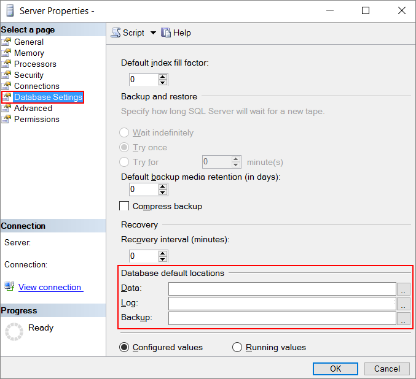

<properties
    pageTitle="Leistung bewährte Methoden für SQL Server | Microsoft Azure"
    description="Enthält bewährte Methoden zum Optimieren der Leistung von SQL Server in Microsoft Azure-virtuellen Computern an."
    services="virtual-machines-windows"
    documentationCenter="na"
    authors="rothja"
    manager="jhubbard"
    editor=""
    tags="azure-service-management" />

<tags
    ms.service="virtual-machines-windows"
    ms.devlang="na"
    ms.topic="article"
    ms.tgt_pltfrm="vm-windows-sql-server"
    ms.workload="infrastructure-services"
    ms.date="09/07/2016"
    ms.author="jroth" />

# Leistung bewährte Methoden für SQL Server in Azure virtuellen Computern

## (Übersicht)

Dieses Thema enthält bewährte Methoden zum Optimieren der Leistung von SQL Server in Microsoft Azure virtuellen Computern an. Während der Ausführung von SQL Server in Azure virtuellen Computern, empfehlen wir, dass Sie weiterhin verwenden derselben Datenbank Leistung Abstimmungsoptionen, die auf SQL Server in der lokalen Server-Umgebung angewendet werden. Die Leistung von einer relationalen Datenbank in eine öffentliche Cloud hängt jedoch von vielen Faktoren wie die Größe eines virtuellen Computers und die Konfiguration von Festplatten mit den Daten.

Wenn SQL Server-Bilder, [erwägen Sie die Bereitstellung Ihrer virtuellen Computern Azure-Portal](virtual-machines-windows-portal-sql-server-provision.md)zu erstellen. SQL Server-virtuellen Computern nach der Bereitstellung im Portal mit Ressourcenmanager implementieren alle bewährten, einschließlich der Speicherkonfiguration.

In diesem Artikel konzentriert die *optimale* Leistung für SQL Server auf Azure-virtuellen Computern abrufen. Ist Ihre Arbeitsbelastung weniger anspruchsvolle möglicherweise nicht jeder aufgeführten Optimierung erforderlich. Beachten Sie beim Ihren Anforderungen Leistung und Arbeitsbelastung Mustern Sie diese Empfehlungen ausgewertet werden soll.

[AZURE.INCLUDE [learn-about-deployment-models](../../includes/learn-about-deployment-models-both-include.md)]

## Schnelle Checkliste

Im folgenden finden eine kurze Checkliste für optimale Leistung von SQL Server auf Azure virtuellen Computern:

|Bereich|Optimierungen|
|---|---|
|[Virtueller Speicher](#vm-size-guidance)|[DS3](virtual-machines-windows-sizes.md#standard-tier-ds-series) oder höher für SQL Enterprise Edition.  [DS2](virtual-machines-windows-sizes.md#standard-tier-ds-series) oder höher für SQL Standard und Web-Editionen.|
|[Speicher](#storage-guidance)|Verwenden Sie [Premium Speicherung](../storage/storage-premium-storage.md). Standard-Speicher wird nur für Test-/empfohlen.  Lassen Sie die [Speicher-Konto](../storage/storage-create-storage-account.md) und SQL Server virtueller Computer in derselben Region ein.  Deaktivieren Sie Azure- [Geo redundante Speicherung](../storage/storage-redundancy.md) (Geo-Replikation) im Speicher-Konto an.|
|[Datenträger](#disks-guidance)|Verwenden Sie mindestens 2 [P30 Datenträger](../storage/storage-premium-storage.md#scalability-and-performance-targets-when-using-premium-storage) (1 für Protokolldateien; 1 für Datendateien und TempDB).  Vermeiden Sie Betriebssystem oder temporären Datenträger für Datenbankspeicher oder Protokollierung.  Lesen Sie aktivieren auf mindestens einem Datenträger Hostinganbieter Daten- und TempDB Zwischenspeichern.  Aktivieren Sie nicht auf die Protokolldatei Hostinganbieter Datenträger Zwischenspeichern.  Wichtig: Beenden Sie den SQL Server-Dienst beim Ändern der Einstellungen des Caches für einen Datenträger Azure-virtuellen Computer.  Verteilen Sie mehrere Azure Daten Datenträger, um höhere EA Durchsatz zu erhalten.  Mit dokumentierten Zuteilung Maßen formatieren.|
|[E/A](#io-guidance)|Aktivieren Sie die Datenbank Seite Komprimierung.  Ermöglichen Sie die Sofortsuche Datei Initialisierung für Datendateien.  Einschränken Sie oder deaktivieren Sie der automatischen Vergrößerung der Datenbank.  Deaktivieren Sie automatisch Verkleinern der Datenbank ein.  Verschieben Sie alle Datenbanken auf Daten Datenträger, einschließlich Systemdatenbanken.  Verschieben Sie SQL Server Fehler Log und Spur Dateiverzeichnisse zu Daten Datenträger aus.  Einrichten von standardmäßigen Dateispeicherorte sichern und Datenbank.  Aktivieren Sie gesperrte Seiten.  Anwenden von Updates für die Leistung von SQL Server.|
|[Spezielle Features](#feature-specific-guidance)|Sichern Sie direkt in Blob-Speicher.|

Weitere Informationen, *wie* und *Warum* diese Optimierungen vornehmen überprüfen Sie die Details und in den folgenden Abschnitten gegebenen Hinweise.

## Virtueller Computer Größe Anleitungen

Für Performance vertrauliche Applikationen empfiehlt es sich, dass Sie die folgenden [virtuellen Computern Größen](virtual-machines-windows-sizes.md)verwenden:

- **SQL Server Enterprise Edition**: DS3 oder höher

- **SQL Server Standard Edition und Web Edition**: DS2 oder höher

## Leitfaden für Speicher

DS-Serie (zusammen mit den DSv2 und GS-Serie) virtuellen Computern Support [Premium-Speicher](../storage/storage-premium-storage.md). Premium-Speicher ist für alle Produktionsarbeitslasten empfohlen.

> [AZURE.WARNING] Standard-Speicher mit wechselnder Wartezeiten und Bandbreite hat und ist nur für Test-/Last empfohlen. Produktionsarbeitslasten sollten Premium Speicher verwenden.

Darüber hinaus wird empfohlen, dass Sie Ihr Konto Azure-Speicher in derselben Data Center als Ihrer SQL Server-virtuellen Computern durchstellen verzögert verringern erstellen. Beim Erstellen eines Kontos Speicher deaktivieren Sie Geo-Replikation als konsistente Schreibreihenfolge auf mehrere Datenträger nicht unbedingt ist. Erwägen Sie stattdessen eine SQL Server Disaster Wiederherstellung Technologie zwischen zwei Azure Data Centers konfigurieren. Weitere Informationen finden Sie unter [hohe Verfügbarkeit und Wiederherstellung für SQL Server in Azure virtuellen Computern](virtual-machines-windows-sql-high-availability-dr.md).

## Datenträger Anleitungen

Es gibt drei Datenträgertypen von Hauptfenster eine Azure-virtuellen Computers aus:

- **OS Datenträger**: beim Erstellen einer Azure-virtuellen Computern anfügen die Plattform mindestens einen Datenträger (mit der Bezeichnung als Laufwerk **C** ) auf den virtuellen Computer für Ihr Betriebssystem-Laufwerk. Dieser Datenträger kann eine virtuelle Festplatte als Seitenblob im Speicher gespeichert.
- **Temporärer Speicherplatz**: Azure-virtuellen Computern enthalten einen anderen Datenträger als den temporären Datenträger bezeichnet (als die **D**gekennzeichnet: Laufwerk). Dies ist ein Datenträger, auf dem Knoten, der für Speicherbereich verwendet werden kann.
- **Daten Datenträger**: Sie können Ihre virtuellen Computern auch zusätzliche Datenträger anfügen, reine Datenträger, und diese werden im Speicher als Seitenblobs gespeichert werden.

Den folgenden Abschnitten werden die Empfehlungen für diese verschiedenen Datenträger verwenden.

### Betriebssystem-Laufwerk

Betriebssystem-Laufwerk ist eine virtuelle Festplatte, die Sie starten und als laufenden Version eines Betriebssystems bereitstellen können und als Laufwerk **C** gekennzeichnet ist.

Standard-Richtlinie auf dem Datenträger Betriebssystem Zwischenspeichern ist **Schreibgeschützt**. Für Performance vertrauliche Applications empfehlen wir, dass Sie Daten Datenträger statt der Datenträger Betriebssystem verwenden. Finden Sie im Abschnitt auf Daten-CDs unten aus.

### Temporärer Speicherplatz

Das temporäre Speicherung Laufwerk, mit dem **D**bezeichnet: Laufwerk, ist nicht zu Azure Blob-Speicher beibehalten. Speichern Sie Ihre Benutzer-Datenbankdateien oder Benutzer Transaktionsprotokolldateien auf die **D**nicht: Laufwerk.

Für D-Serie, Dv2-Serie und G-Serie virtuellen Computern ist das temporäre Laufwerk auf diese virtuellen Computern SSD-basierten. Wenn Ihre Arbeitsbelastung beanspruchen Verwendung von TempDB macht (z. B. für temporäre Objekte oder komplexe Verknüpfungen) möglich Speichern von TempDB auf Laufwerk **D** höheren TempDB Durchsatz und unteren TempDB Wartezeit.

Virtuellen Computern, die Premium-Speicher (DS-Serie, DSv2-Serie und GS-Serie) unterstützen, wird empfohlen, Speichern von TempDB und/oder Puffer Ressourcenpool Erweiterungen auf einem Datenträger, der Premium Speicher unterstützt mit Lese-Cache aktiviert. Es gibt eine Ausnahme zu dieser Empfehlungen; ist Ihre Verwendung TempDB schreiben ankommt, können Sie höheren Leistung erzielen, indem Sie TempDB auf lokalen Laufwerk **D** , also auch SSD basierend auf diesen Größen Computer speichern.

### Datenträger mit Daten

- **Verwenden Sie Daten Datenträger für Daten und Protokolldateien**: Verwenden Sie mindestens 2 Premium [P30 Datenträger](../storage/storage-premium-storage.md#scalability-and-performance-targets-when-using-premium-storage) , wo eine Datenträger enthält die Log-Dateien und anderen enthält, die Datendatei(en) und TempDB.

- **Festplattenstriping**: Weitere Durchsatz, können Sie zusätzliche Datenträger hinzufügen und Verwenden von Festplattenstriping. Um die Anzahl der Datenträger Daten zu ermitteln, müssen Sie die Anzahl der IOPS für Ihre Daten und der Protokolldateien Datenträger verfügbar zu analysieren. Diese Informationen finden Sie unter Tabellen auf IOPS pro [virtueller Speicher](virtual-machines-windows-sizes.md) und Datenträger Größe im folgenden Artikel: [Premium-Speicher für Datenträger verwenden](../storage/storage-premium-storage.md). Verwenden Sie die folgenden diesen Richtlinien:

    - Verwenden Sie für Windows 8/Windows Server 2012 oder höher [Speicher Leerzeichen](https://technet.microsoft.com/library/hh831739.aspx)ein. Festlegen von Streifen Größenänderungs-64 KB für OLTP Auslastung und 256 KB für Daten Datawarehousing Auslastung Auswirkung auf die Leistung aufgrund Partition fehlerhafte Ausrichtung zu vermeiden. Darüber hinaus die Anzahl der Spalten festlegen = Anzahl der physischen Datenträger. Zum Konfigurieren einer Speicherplatz mit mehr als 8 Festplatten müssen Sie PowerShell (nicht Server-Manager UI) verwenden, um die Anzahl der Spalten, um die Anzahl der Datenträger entsprechen explizit festzulegen. Weitere Informationen zum Konfigurieren [Von Leerzeichen](https://technet.microsoft.com/library/hh831739.aspx), finden Sie unter [Speicher Leerzeichen Cmdlets in Windows PowerShell](https://technet.microsoft.com/library/jj851254.aspx)

    - Für Windows 2008 R2 oder einer früheren Version, können Sie dynamische Datenträger (OS Gestreifter Datenmengen), und die Streifengröße ist immer 64 KB sein. Beachten Sie, dass diese Option zum Zeitpunkt der Windows 8/Windows Server 2012 nicht mehr unterstützt wird. Informationen finden Sie auf der Support-Anweisung am [Dienst für virtuelle Datenträger Windows Storage Management-API wechselt](https://msdn.microsoft.com/library/windows/desktop/hh848071.aspx).

    - Wenn Ihre Arbeitsbelastung nicht stark Log und dedizierten IOPs ist nicht erforderlich, können Sie nur eine Speicherpool konfigurieren. Erstellen Sie andernfalls zwei Speicherpools, eine für die Protokolldatei(en) und einen anderen Speicherpool für die Datendatei(en) und TempDB. Ermitteln Sie die Anzahl der Datenträger, jede Speicherpool basierend auf die gewünschte Auslastung zugeordnet. Denken Sie daran, die Größen der andere virtuellen Computer unterschiedlich viele zulassen angefügt Datenfestplatten. Weitere Informationen finden Sie unter [Größe für virtuelle Computer](virtual-machines-windows-sizes.md).

    - Wenn Sie nicht Premium Speicher (Test-/Szenarien) verwenden, wird empfohlen, die maximale Anzahl von Daten Datenträger unterstützt durch Ihre [virtueller Speicher](virtual-machines-windows-sizes.md) hinzufügen und verwenden Sie Datenträgerstriping.

- **Zwischenspeichern Richtlinie**: für Premium Daten Datenträger, aktivieren Sie das gelesen Zwischenspeichern auf Ihre Datendateien und TempDB nur Hostinganbieter Festplatten mit den Daten. Wenn Sie Premium Speicher nicht verwenden, aktivieren Sie keine Zwischenspeichern auf alle Datenfestplatten. Informationen zum Konfigurieren von Zwischenspeichern auf der Festplatte, finden Sie unter den folgenden Themen: [Set-AzureOSDisk](https://msdn.microsoft.com/library/azure/jj152847) und [AzureDataDisk festlegen](https://msdn.microsoft.com/library/azure/jj152851.aspx).

    >[AZURE.WARNING] Beenden Sie den SQL Server-Dienst beim Ändern der Einstellung Cache der Datenträger Azure-virtuellen Computer die Möglichkeit, eine Beschädigung der Datenbank vermeiden.

- **Die Größe der Zuordnungseinheiten NTFS**: Wenn Sie den Datenträger Daten zu formatieren, wird empfohlen, eine Größe 64 KB Zuordnungseinheiten für Daten-und Protokolldateien sowie TempDB zu verwenden.

- **Bewährte Methoden für die Verwaltung von Datenträger**: Wenn einen Datenträger entfernen oder Ändern des Abfragetyps Cache beenden den SQL Server-Dienst während der Änderung. Wenn die Zwischenspeichern Einstellungen auf dem Datenträger OS geändert werden, Azure stoppt den virtuellen Computer, ändert den Cachetyp, und startet den virtuellen Computer neu. Wenn die Einstellungen des Caches für einen Datenträger geändert werden, der virtuellen Computer nicht beendet wird, aber die Festplatte Daten aus dem virtuellen Computer während der Änderung getrennt und anschließend angefügt.

    >[AZURE.WARNING] Beenden den SQL Server-Dienst während dieser Vorgänge können eine Beschädigung der Datenbank führen.

## E/a-Leitfaden

- Die besten Ergebnisse mit Premium Speicher erzielen Sie, wenn Sie die Anwendung und Besprechungsanfragen parallelisieren. Premium Speicher dient zur Szenarien, die EA Warteschlangentiefe größer als 1, darin damit wenig oder gar Leistungsgewinne für serielle Anfragen Single threaded angezeigt werden (auch, wenn sie Speicher stark sind). Dies kann beispielsweise Single-threaded Testergebnisse Leistung Analysetools, wie z. B. SQLIO auswirken.

- Erwägen Sie [die Seite Komprimierung Datenbank](https://msdn.microsoft.com/library/cc280449.aspx) wie helfen stark Auslastung e/a-Leistung zu verbessern. Die Daten Komprimierung kann jedoch die CPU-Auslastung auf dem Datenbankserver zunehmen.

- Erwägen Sie die Aktivierung der Initialisierung der Sofortsuche Datei, die Zeit zu verringern, die für die ursprüngliche Datei Zuteilung erforderlich ist. Um instant Datei Initialisierung nutzen zu können, gewähren des Dienstkontos SQL Server (MSSQLSERVER) mit SE_MANAGE_VOLUME_NAME und die **Lautstärke Wartungsaufgaben ausführen** Sicherheitsrichtlinie hinzuzufügen. Wenn Sie ein Bild der SQL Server-Plattform für Azure verwenden, ist nicht der Standard-Dienstkontos (NT Service\MSSQLSERVER) die **Lautstärke Wartungsaufgaben ausführen** Sicherheitsrichtlinie hinzugefügt. Kurzum, ist instant Datei Initialisierung in einer SQL Server-Azure-Plattform-Images nicht aktiviert. Nach dem Hinzufügen des SQL Server-Dienstkontos zur Sicherheitsrichtlinie **Lautstärke Wartungsaufgaben ausführen** , starten Sie den SQL Server-Dienst. Sicherheitsaspekte der Verwendung dieses Feature könnte. Weitere Informationen finden Sie unter [Initialisierung der Datenbank-Datei](https://msdn.microsoft.com/library/ms175935.aspx).

- **Automatische Vergrößerung** gilt lediglich eine Bedingung für unerwartete geometrischen werden. Verwalten Sie Ihre Daten und der Protokolldateien geometrischen täglich Vergrößerung nicht. Wenn automatische Vergrößerung verwendet wird, wächst vorab die Datei, die mit dem Schalter Größe aus.

- Stellen Sie sicher, dass **automatisch verkleinern** deaktiviert ist, um unnötige Aufwand zu vermeiden, der sich negativ auf die Leistung beeinträchtigen kann.

- Verschieben Sie alle Datenbanken auf Daten Datenträger, einschließlich Systemdatenbanken. Weitere Informationen finden Sie unter [System-Datenbanken verschieben](https://msdn.microsoft.com/library/ms345408.aspx).

- Verschieben Sie SQL Server Fehler Log und Spur Dateiverzeichnisse zu Daten Datenträger aus. Dies kann in SQL Server-Konfigurations-Manager erfolgen, indem Sie mit der rechten Maustaste in der SQL Server-Instanz aus, und wählen Sie Eigenschaften. Auf der Registerkarte **Start-Parameter** können die Einstellungen Fehler Log und Spur Datei geändert werden. Sicherungsverzeichnis wird auf der Registerkarte **Erweitert** angegeben. Das folgende Bildschirmabbild zeigt, wo sich der Fehler Log Start-Parameter.

    

- Einrichten von standardmäßigen Dateispeicherorte sichern und Datenbank. Verwenden Sie die Empfehlungen in diesem Thema, und nehmen Sie die Änderungen im Eigenschaftenfenster Server. Anweisungen finden Sie unter [anzeigen oder Ändern der Standard-Speicherorte für Daten und Protokolldateien (SQL Server Management Studio)](https://msdn.microsoft.com/library/dd206993.aspx). Das folgende Bildschirmabbild veranschaulicht, wo diese Änderungen vorgenommen haben.

    

- Aktivieren Sie gesperrte Seiten EA und alle Seitennavigation Aktivitäten zu verringern. Weitere Informationen finden Sie unter [Aktivieren Sie das Sperren von Seiten im Speicheroption (Windows)](https://msdn.microsoft.com/library/ms190730.aspx).

- Wenn Sie SQL Server 2012 ausgeführt werden, installieren Sie Service Pack 1 Kumulatives Update 10. Dieses Update enthält die Korrektur für schlechte Leistung von e/a, beim Ausführen von Select into-Anweisung der temporären Tabelle in SQL Server 2012. Informationen finden Sie in diesem [Knowledge Base-Artikel](http://support.microsoft.com/kb/2958012)aus.

- Erwägen Sie komprimieren, um alle Daten beim in/aus der Azure übertragen.

## Feature spezifische Leitfäden

Einige Bereitstellungen möglicherweise zusätzliche Leistungsvorteile mit erweiterte Konfiguration Techniken erzielen. Die folgende Liste hervorgehoben einige SQL Server-Features, die Ihnen eine bessere Leistung erzielen helfen können:

- **Sicherung zu Azure-Speicher**: beim Sicherungskopien für SQL Server ausgeführt wird, in Azure-virtuellen Computern ausführen zu können, können Sie [SQL Server-Sicherung-URL](https://msdn.microsoft.com/library/dn435916.aspx). Dieses Feature steht, beginnend mit SQL Server 2012 SP1 CU2 und zur Sicherung auf die angefügte Daten Datenträger empfohlen. Wenn Sie sichern/wiederherstellen/aus Azure-Speicher folgen der Vorschläge am [SQL Server-Sicherung zu Best Practices URL und Problembehandlung und Wiederherstellen von Sicherungskopien in Azure Storage gespeichert](https://msdn.microsoft.com/library/jj919149.aspx). Darüber hinaus können Sie diese mit [Dem automatischen Sicherung für SQL Server in Azure virtuellen Computern](virtual-machines-windows-classic-sql-automated-backup.md)Sicherungskopien automatisieren.

    Verwenden Sie vor dem SQL Server 2012 [SQL Server-Sicherung Azure-Tool an](https://www.microsoft.com/download/details.aspx?id=40740). Dieses Tool kann dazu beitragen um Sicherungsmediendurchsatz mit mehreren Sicherung Streifen Ziele zu vergrößern.

- **SQL Server-Datendateien in Azure**: Dieses neue Feature, [SQL Server-Datendateien in Azure](https://msdn.microsoft.com/library/dn385720.aspx), steht zur Verfügung, beginnend mit SQL Server 2014. Mit SQL Server mit Datendateien in Azure veranschaulicht vergleichbaren Leistungsmerkmale als Datenträger Azure-Daten verwenden.

## Nächste Schritte

Wenn Sie in SQL Server und Premium Speicher ausführlicher untersuchen interessiert sind, finden Sie im Artikel [Verwenden Azure Premium Speicher mit SQL Server auf virtuellen Computern](virtual-machines-windows-classic-sql-server-premium-storage.md).

Bewährte Methoden für Sicherheit finden Sie unter [Sicherheitsaspekte für SQL Server in Azure virtuellen Computern](virtual-machines-windows-sql-security.md).

Überprüfen Sie andere SQL Server-virtuellen Computern Themen in [SQL Server auf Azure-virtuellen Computern (Übersicht)](virtual-machines-windows-sql-server-iaas-overview.md).
