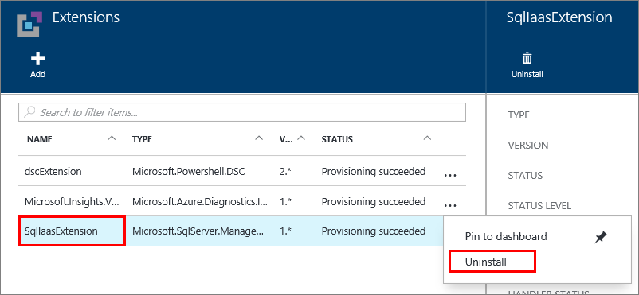

<properties
    pageTitle="SQL Server-Agent-Erweiterung für SQL Server virtuellen Computern (Ressourcenmanager) | Microsoft Azure"
    description="In diesem Thema beschrieben, wie die SQL Server-Agent-Erweiterung verwalten, die um bestimmte SQL Server-Verwaltungsaufgaben automatisieren wird. Hierzu gehören die automatische Sicherung, automatisierte Patch und Azure-Taste Tresor Integration. In diesem Thema wird den Ressourcenmanager Bereitstellung Modus verwendet."
    services="virtual-machines-windows"
    documentationCenter=""
    authors="rothja"
    manager="jhubbard"
    editor=""
    tags="azure-resource-manager"/>

<tags
    ms.service="virtual-machines-windows"
    ms.devlang="na"
    ms.topic="article"
    ms.tgt_pltfrm="vm-windows-sql-server"
    ms.workload="infrastructure-services"
    ms.date="10/27/2016"
    ms.author="jroth"/>

# SQL Server-Agent-Erweiterung für SQL Server virtuellen Computern (Ressourcen-Manager)

> [AZURE.SELECTOR]
- [Ressourcenmanager](virtual-machines-windows-sql-server-agent-extension.md)
- [Klassische](virtual-machines-windows-classic-sql-server-agent-extension.md)

Die SQL Server IaaS Agent-Erweiterung (SQLIaaSExtension) bei Azure-virtuellen Computern zum Automatisieren von Verwaltungsaufgaben ausgeführt wird. Dieses Thema bietet einen Überblick über die Dienste, die durch die Erweiterung sowie die Anweisungen zur Installation, Status und freistellen unterstützt.

[AZURE.INCLUDE [learn-about-deployment-models](../../includes/learn-about-deployment-models-rm-include.md)]Klassische Bereitstellungsmodell. Zum Anzeigen der klassischen Version der in diesem Artikel finden Sie unter [SQL Server-Agent-Erweiterung für SQL Server-virtuellen Computern Classic](virtual-machines-windows-classic-sql-server-agent-extension.md).

## Unterstützte services

Die SQL Server IaaS-Agent-Erweiterung unterstützt die folgenden Verwaltungsaufgaben:

| Administration-Funktion | Beschreibung |
|---------------------|-------------------------------|
| **SQL-automatische Sicherung** | Automatisierung der Planung von Sicherungskopien für alle Datenbanken für die standardmäßige Instanz von SQL Server auf dem virtuellen Computer. Weitere Informationen finden Sie unter [Sicherungsdateien für SQL Server in Azure virtuellen Computern (Ressourcen-Manager)](virtual-machines-windows-sql-automated-backup.md).|
| **SQL automatisierte Patch** | Konfiguriert ein Wartungsfenster während der Updates an Ihre virtuellen Computer stattfinden können, damit Sie Aktualisierungen Höchstwert Zeiten für Ihre Arbeitsbelastung vermeiden können. Weitere Informationen finden Sie unter [Automatische Patch für SQL Server in Azure virtuellen Computern (Ressourcen-Manager)](virtual-machines-windows-sql-automated-patching.md).|
| **Azure Key Tresor-Integration** | Ermöglicht es Ihnen automatisch installieren und Konfigurieren von Azure-Taste Tresor Ihrer SQL Server virtuellen Computers. Weitere Informationen finden Sie unter [Konfigurieren von Azure Schlüssel Tresor Integration für SQL Server auf Azure-virtuellen Computern (Ressourcen-Manager)](virtual-machines-windows-ps-sql-keyvault.md).|

## Erforderliche Komponenten

Anforderungen, die SQL Server IaaS-Agent-Erweiterung Ihrer virtuellen Computers verwenden:

**Betriebssystem**:

- WindowsServer 2012
- Windows Server 2012 R2

**SQL Server-Versionen**:

- SQLServer 2012
- SQLServer 2014
- SQLServer 2016

**Azure PowerShell**:

- [Herunterladen Sie und konfigurieren Sie die neuesten Azure PowerShell-Befehle](../powershell-install-configure.md)

## Installation

Die SQL Server IaaS-Agent-Erweiterung wird automatisch installiert, wenn Sie eines der Bilder Katalog virtuellen Computern SQL Server bereitstellen.

Wenn Sie eine OS nur Windows Server virtuellen Computern erstellt haben, können Sie die Erweiterung mithilfe des PowerShell-Cmdlets **Set-AzureVMSqlServerExtension** manuell installieren. Mit dem folgende Befehl wird beispielsweise installiert die Erweiterung einer Windows nur OS-Server Sie virtuellen Computers und legt hierfür den Namen "SQLIaaSExtension".

    Set-AzureRmVMSqlServerExtension -ResourceGroupName "resourcegroupname" -VMName "vmname" -Name "SQLIaasExtension" -Version "1.2"

Wenn Sie auf die neueste Version von SQL IaaS-Agent-Erweiterung aktualisieren, müssen Sie Ihre virtuellen Computern nach der Aktualisierung der Erweiterung neu starten.

>[AZURE.NOTE] Wenn Sie die SQL Server IaaS-Agent-Erweiterung manuell auf einem Windows Server virtuellen Computer installieren, müssen Sie verwenden und Verwalten von Features mithilfe der PowerShell-Befehlen. Portal-Oberfläche steht nur für SQL Server-Katalog Bilder.

## Status

Eine Möglichkeit, stellen Sie sicher, dass die Erweiterung installiert sind ist den Status des Agents Azure-Portal anzeigen. Wählen Sie **Alle Einstellungen** in das Blade virtuellen Computers, und klicken Sie dann auf **Erweiterungen**. Sie sollten die **SQLIaaSExtension** Erweiterung aufgeführt angezeigt werden.

Sie können auch mit dem **Get-AzureVMSqlServerExtension** Azure Powershell-Cmdlet verwenden.

    Get-AzureRmVMSqlServerExtension -VMName "vmname" -ResourceGroupName "resourcegroupname"

Der vorherige Befehl bestätigt der Agent installiert ist, und bietet allgemeine Statusinformationen. Sie können auch bestimmte Statusinformationen über die automatische Sicherung und Patchen mit den folgenden Befehlen erhalten.

    $sqlext = Get-AzureRmVMSqlServerExtension -VMName "vmname" -ResourceGroupName "resourcegroupname"
    $sqlext.AutoPatchingSettings
    $sqlext.AutoBackupSettings

## Freistellen   

Im Portal Azure können Sie die Erweiterung deinstallieren, indem Sie auf die drei Punkte auf **Erweiterungen** Falz Ihrer virtuellen Computereigenschaften. Klicken Sie dann auf **Löschen**.

Sie können auch das **Entfernen-AzureRmVMSqlServerExtension** Powershell-Cmdlet verwenden.

    Remove-AzureRmVMSqlServerExtension -ResourceGroupName "resourcegroupname" -VMName "vmname" -Name "SQLIaasExtension"

## Nächste Schritte

Beginnen Sie mit einer der Dienste durch die Erweiterung unterstützt. Weitere Informationen hierzu finden Sie im Abschnitt [unterstützten Dienste](#supported-services) in diesem Artikel beschriebenen Themen.

Weitere Informationen über das Ausführen von SQL Server auf Azure virtuellen Computern finden Sie unter [SQL Server auf Azure-virtuellen Computern Übersicht](virtual-machines-windows-sql-server-iaas-overview.md).
