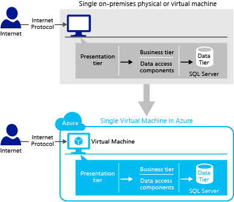

<properties
    pageTitle="SQL Server-Anwendung Mustern auf virtuellen Computern | Microsoft Azure"
    description="Dieser Artikel behandelt Anwendung Muster für SQL Server auf Azure-virtuellen Computern an. Es bietet Lösungsarchitekten und Entwickler eine Grundlage für gute Anwendungsarchitektur und den Entwurf."
    services="virtual-machines-windows"
    documentationCenter="na"
    authors="luisherring"
    manager="jhubbard"
    editor=""
    tags="azure-service-management,azure-resource-manager" />
<tags
    ms.service="virtual-machines-windows"
    ms.devlang="na"
    ms.topic="article"
    ms.tgt_pltfrm="vm-windows-sql-server"
    ms.workload="infrastructure-services"
    ms.date="08/19/2016"
    ms.author="lvargas" />

# Anwendung Mustern und Entwicklungsstrategien für SQLServer in Azure-virtuellen Computern

[AZURE.INCLUDE [learn-about-deployment-models](../../includes/learn-about-deployment-models-both-include.md)]

## Zusammenfassung:
Bestimmen, welche eines Anwendungsmusters oder Mustern mit e in Azure SQL-Server-basierte Umgebung ist eine wichtige Entwurf Entscheidung und erfordert Kenntnisse zu wie SQL Server und jeder Infrastrukturkomponente von Azure zusammenarbeiten. Mit SQL Server in Azure-Infrastrukturdiensten können Sie problemlos migrieren, verwalten und Überwachen Ihrer vorhandenen SQL Server Applications erstellt für den Zugriff Windows Server auf virtuellen Computern in Azure.

Ziel dieses Artikels ist es, Lösungsarchitekten und Entwickler bieten eine Grundlage für gute Anwendungsarchitektur und Design, das sie bei der Migration von vorhandener Applikationen Azure sowie zur Entwicklung von neuen Applications in Azure folgen kann.

Für jedes Muster Anwendung finden Sie eine lokale Szenario, entsprechenden Cloud-fähige-Lösung und die zugehörigen technischen Empfehlungen. Darüber hinaus befasst sich dieser Artikel Azure-spezifische Entwicklungsstrategien, damit Sie Ihre Programme ordnungsgemäß entwerfen können. Aufgrund der viele mögliche Anwendung Mustern empfiehlt es sich, dass Architekten und Entwicklern das am besten geeignete Muster für ihre Applikationen und Benutzer auswählen sollten.

**Technische Mitwirkenden:** Luis Carlos Vargas Hering, Madhan Arumugam Ramakrishnan

**Technische Prüfer:** Corey Sandpapiermaschinen, Drew McDaniel, Narayan Annamalai, Nir Mashkowski, Sanjay Mishra, Silvano Coriani, Stefan Schackow, Tim Hickey, Tim Wieman, Xin Jin

## Einführung

Sie können viele Arten von Applications mehrstufige Extrahieren der Komponenten von der anderen Anwendungsebenen auf unterschiedlichen Computern ebenso wie in separaten Komponenten entwickeln. Angenommen, Sie können die Clientanwendung platzieren und Business Regeln Komponenten in einen Computer, Front-End-Webebene und Datenkomponenten Access Ebene in einem anderen Computer und eine Stufe Back-End-Datenbank in einem anderen Computer. Diese Art von strukturieren kann jede Ebene voneinander isolieren. Wenn Sie ändern möchten, in dem Daten stammen, müssen Sie nicht die Client oder Web-Anwendung, aber nur Access Komponenten der Datenebene ändern.

Eine typische *Mehrstufige* Anwendung umfasst die Präsentation, die Ebene Business, und die Datenebene:

| Ebene              | Beschreibung                                                                                                                                                                     |
|-------------------|---------------------------------------------------------------------------------------------------------------------------------------------------------------------------------|
| **Präsentation** | *Präsentationsebene* (Webebene, Front-End-Ebene) ist die Ebene, auf der Benutzer mit einer Anwendung interagieren.                                                                      |
| **Business**     | Das *Business gestuft* (mittlere Ebene) ist die Ebene, die Präsentation Datenebene, und die Datenebene verwenden, um miteinander zu kommunizieren und umfasst die Kernfunktionalität des Systems. |
| **Daten**         | Die *Datenebene* ist im Grunde der Server, der die Daten einer Anwendung (beispielsweise ein Server mit SQL Server) gespeichert.                                                             |

Anwendungsebenen beschreiben die logischen Gruppen von Funktionen und Komponenten in einer Anwendung. während die Ebenen die physische Verteilung der Funktionen und Komponenten auf separaten physischen Servern, Computern, Netzwerken oder remote-Standorten zu beschreiben. Die Ebenen der Anwendung befindet sich möglicherweise auf dem gleichen physischen Computer (der gleichen Ebene) oder möglicherweise über die verschiedenen Computern (n Ebenen) verteilt und die Komponenten in jede Ebene mit Komponenten in anderen Ebenen über klar definierte Schnittstellen kommunizieren. Sie können die Ebene Ausdruck als in Bezug auf physischen Verteilung Muster wie zweistufigen, drei Ebenen und mehrstufige vorstellen. Ein **Muster 2-Ebenen-Anwendung** enthält zwei Ebenen der Anwendung: Anwendungsserver und Datenbankserver. Die direkte Kommunikation geschieht zwischen dem Anwendungsserver und dem Datenbankserver. Der Anwendungsserver enthält sowohl Web- und Business Datenebene Komponenten. In einer **3-Ebenen-Anwendung Muster**, es gibt drei Ebenen der Anwendung: Webserver, Anwendungsserver, die die Geschäftslogikebene und/oder Access-Komponenten von Business Ebene Daten enthält, und dem Datenbankserver. Die Kommunikation zwischen dem Webserver und dem Datenbankserver geschieht über den Anwendungsserver. Detaillierte Informationen zur Anwendung Layer und Ebenen finden Sie unter [Microsoft Application Architektur Guide](https://msdn.microsoft.com/library/ff650706.aspx).

Bevor Sie beginnen, lesen in diesem Artikel, sollten Sie Kenntnisse auf die grundlegenden Konzepte von SQL Server und Azure verfügen. Informationen finden Sie unter [SQL Server-Onlinedokumentation](https://msdn.microsoft.com/library/bb545450.aspx), [SQL Server in Azure virtuellen Computern](virtual-machines-windows-sql-server-iaas-overview.md) und [Azure.com](https://azure.microsoft.com/).

In diesem Artikel werden mehrere Muster der Anwendung, die für Ihre einfache Applications als auch die hochgradig komplexe Enterprise-Anwendungen geeignet sein können. Bevor Sie mit detaillierten Informationen zu jeder Muster, empfehlen wir, dass Sie sich mit den verfügbaren Speicherplatz Datendienste in Azure, z. B. [Azure-Speicher](../storage/storage-introduction.md), [Azure SQL-Datenbank](../sql-database/sql-database-technical-overview.md)und [SQL Server in einer Azure-virtuellen Computern](virtual-machines-windows-sql-server-iaas-overview.md)vertraut machen sollten. Grundlegendes zu um die beste Entwurf für die Anwendung entscheiden, welche Daten Speicherdienst klar verwenden aus.

### Wählen Sie SQLServer in einer Azure-virtuellen Computern, wenn:

- Sie benötigen für SQL Server und Windows-Steuerelement. Beispielsweise folgt, enthalten möglicherweise SQL Server-Version, spezielle Updates, Leistungskonfiguration usw..

- Sie benötigen eine vollständige Kompatibilität mit SQL Server lokal und in Azure als vorhandene Applikationen verschieben möchten – ist.

- Die Funktionen der Azure-Umgebung nutzen möchten, aber Azure SQL-Datenbank unterstützt nicht alle Features, die die Anwendung erforderlich ist. Dies kann die folgenden Bereiche beinhalten:

    - **Datenbankgröße**: gleichzeitig in diesem Artikel aktualisiert wurde, SQL-Datenbank eine Datenbank von bis zu 1 TB Daten unterstützt. Wenn die Anwendung mehr als 1 TB Daten erfordert, und Sie keine benutzerdefinierten Sharding Lösungen implementieren möchten, empfiehlt es sich, dass Sie SQL Server in einer Azure-virtuellen Computern verwenden. Die neuesten Informationen finden Sie unter [Skalieren, Azure SQL-Datenbanken](https://msdn.microsoft.com/library/azure/dn495641.aspx) und [Azure SQL-Datenbank Dienst Ebenen und Leistung Ebenen](../sql-database/sql-database-service-tiers.md).
    - **HIPAA Compliance**: im Gesundheitswesen Kunden und unabhängigen Software-Anbietern könnten Sie entscheiden, [SQL Server in Azure virtuellen Computern](virtual-machines-windows-sql-server-iaas-overview.md) statt [Azure SQL-Datenbank](../sql-database/sql-database-technical-overview.md) , da SQL Server in einer Azure-virtuellen Computern durch HIPAA Business zuordnen Vertrag (BAA) bedeckt ist. Weitere Informationen über die Kompatibilität finden Sie unter [Microsoft Azure-Trust Center: Compliance](https://azure.microsoft.com/support/trust-center/compliance/).
    - **Instanz Ebene Features**: SQL-Datenbank nicht zu diesem Zeitpunkt Features, die außerhalb der Datenbank live unterstützen (z. B. verknüpfte Server Agent-Aufträge, FileStream, Dienst Bank usw..). Weitere Informationen finden Sie unter [Azure SQL-Datenbank-Richtlinien und Einschränkungen](https://msdn.microsoft.com/library/azure/ff394102.aspx).

## Schicht 1 (einfach): einzelnen virtuellen Computern

In diesem Muster Anwendung stellen Sie die SQL Server-Anwendung sowie die Datenbank eines eigenständigen virtuellen Computern in Azure bereit. Desselben virtuellen Computers enthält Ihrer Client/Web-Anwendung, Business-Komponenten, Data Access Layer und dem Datenbankserver. Die Präsentation, Business und verkehrsausscheidungsziffer Daten logisch voneinander zu trennen, aber in einem einzelnen Server Computer physisch befinden. Die meisten Kunden beginnen Sie mit dieser Anwendung Muster und klicken Sie dann diese um weitere Webrollen oder virtuellen Computern hinzufügen, auf ihr System skalieren.

Diese Anwendung Muster ist nützlich, wenn:

- Ausführen eine einfache Migration zur Azure-Plattform für ausgewertet werden soll, ob die Plattform Anforderungen Ihrer Anwendung oder nicht beantwortet werden soll.

- Bleiben alle die Ebenen der Anwendung auf dem gleichen virtuellen Computer in derselben Azure Data Center zum Verringern der Wartezeit zwischen Ebenen gehostet werden soll.

- Sie möchten schnell Entwicklung bereitstellen und Umgebungen für einen kurzen Zeitraum zu testen.

- Sie betonen Testen für unterschiedliche Arbeitsbelastung Ebenen durchführen möchten aber zur gleichen Zeit nicht sollen und eigene Wartung viele physische Computer immer.

Das folgende Diagramm veranschaulicht eine einfache lokalen Szenario und wie Sie deren aktiviert Cloudlösung in einer einzelnen virtuellen Computern in Azure bereitstellen können.

Bereitstellen von den Business Layer (Geschäftslogik und Daten zugreifen Komponenten) auf derselben physischen Ebene wie die Präsentationsebene kann Leistung der Anwendung, maximieren, es sei denn, Sie auf eine separate Ebene wegen Skalierbarkeit oder Sicherheit verwenden müssen.

Da es zunächst eine sehr allgemeine Muster handelt, sinnvoll, den folgenden Artikel zur Migration zum Verschieben von Daten zu Ihrer SQL Server virtueller Computer: [Migrieren einer Datenbank mit SQL Server ein Azure-virtuellen Computers](virtual-machines-windows-migrate-sql.md).

## Schicht 3 (einfach): mehrere virtuellen Computern

In diesem Muster Anwendung stellen Sie eine Anwendung Ebene 3 in Azure durch Platzieren jede Anwendungsebene in einen anderen virtuellen Computer an. Dies stellt eine flexible Umgebung für eine einfache vergrößern und zu verkleinern Szenarien. Wenn eine virtuellen Computern Ihrer Anwendung Client/Web enthält, im anderen Bereich hostet Ihrer Business-Komponenten und dem anderen Computer hostet den Datenbankserver.

Diese Anwendung Muster ist nützlich, wenn:

- Möchten Sie eine Migration von komplexen datenbankanwendungen zu Azure virtuellen Computern ausführen.

- Ebenen der anderen Anwendung in unterschiedlichen Regionen gehostet werden soll. Beispielsweise könnten Sie Datenbanken freigegeben haben, die auf mehrere Bereiche für Berichtszwecke bereitgestellt werden.

- Enterprise-Applications aus lokalen virtualisierten Plattformen zu Azure virtuellen Computern verschieben möchten. Ausführliche Informationen zu on Enterprise-Anwendungen finden Sie unter [Was ist eine Enterprise-Anwendung](https://msdn.microsoft.com/library/aa267045.aspx).

- Sie möchten schnell Entwicklung bereitstellen und Umgebungen für einen kurzen Zeitraum zu testen.

- Sie betonen Testen für unterschiedliche Arbeitsbelastung Ebenen durchführen möchten aber zur gleichen Zeit nicht sollen und eigene Wartung viele physische Computer immer.

Das folgende Diagramm veranschaulicht, wie Sie eine einfache 3-Ebenen-Anwendung in Azure platzieren können, indem Sie jede Anwendungsebene in einen anderen virtuellen Computer platzieren.

In diesem Muster für die Anwendung gibt es nur ein virtueller Computer (virtueller Computer) in jede Ebene. Wenn Sie mehrere virtuelle Computer in Azure haben, wird empfohlen, dass Sie ein virtuelles Netzwerk einrichten. [Azure-virtuellen Netzwerk](../virtual-network/virtual-networks-overview.md) erstellt eine Begrenzungslinie vertrauenswürdigen Sicherheit und können auch auf virtuellen Computern untereinander über die private IP-Adresse kommunizieren. Darüber hinaus immer Stellen Sie sicher, dass alle internetverbindungen nur auf der Präsentationsebene wechseln. Wenn diese Anwendung Muster folgen, Verwalten der Netzwerk Sicherheit Gruppe Regeln zum Steuern des Zugriffs auf. Weitere Informationen finden Sie unter [Externer Zugriff auf Ihre virtuellen Computer mit dem Azure-Portal zulassen](virtual-machines-windows-nsg-quickstart-portal.md).

Im Diagramm kann die Internet-Protokolle TCP, UDP, HTTP oder HTTPS sein.

>[AZURE.NOTE] Einrichten eines virtuellen Netzwerks in Azure ist ein kostenlos. Sie sind jedoch für das Gateway VPN berechnet, die und lokale besteht. Diese Gebühr basiert auf die Zeitdauer, die Verbindung bereitgestellte und verfügbar ist.

## Schicht 2 und 3 Ebene mit Präsentation Ebene Skalierung

In diesem Muster Anwendung stellen Sie 2-Leiste oder 3-Leiste Datenbank-Anwendung zu Azure virtuellen Computern durch jede Anwendungsebene in einen anderen virtuellen Computer platzieren. Darüber hinaus skalieren Sie die Präsentationsebene aufgrund der eingehenden Anfragen höhere Lautstärke ein.

Diese Anwendung Muster ist nützlich, wenn:

- Enterprise-Applications aus lokalen virtualisierten Plattformen zu Azure virtuellen Computern verschieben möchten.

- Möchten Sie die Präsentationsebene aufgrund höhere Lautstärke der eingehenden Anfragen zu skalieren.

- Sie möchten schnell Entwicklung bereitstellen und Umgebungen für einen kurzen Zeitraum zu testen.

- Sie betonen Testen für unterschiedliche Arbeitsbelastung Ebenen durchführen möchten aber zur gleichen Zeit nicht sollen und eigene Wartung viele physische Computer immer.

- Möchten Sie eine Infrastructure-Umgebung besitzen, die nach oben oder unten nach Bedarf zu skalieren können.

Das folgende Diagramm veranschaulicht, wie Sie die Ebenen der Anwendung in mehreren virtuellen Computern in Azure platzieren können, indem Sie die Skalierung der Präsentationsebene aufgrund der eingehenden Anfragen höhere Lautstärke. Wie im Diagramm angezeigt wird, ist Azure Lastenausgleich verantwortlich für Verteilen des Datenverkehrs über mehrere virtuelle Computer und auch welcher Webserver Verbindung zu bestimmen. Gibt es mehrere Instanzen der Webserver hinter einem Lastenausgleich gewährleistet hohe Verfügbarkeit der Präsentation.

### Bewährte Methoden für die Ebene 2, Ebene 3 oder mehrstufige Mustern, die mehrere virtuelle Computer in eine Ebene haben

Es wird empfohlen, setzen Sie den virtuellen Computern, die die Verfügbarkeit der gleichen Ebene in der gleichen Cloud-Dienst und in der gleichen angehören festlegen. Setzen Sie beispielsweise eine Reihe von Webservern in **CloudService1** und **AvailabilitySet1** und eine Reihe von Datenbankserver in **CloudService2** und **AvailabilitySet2**ein. Eine Verfügbarkeit festlegen in Azure ermöglicht es Ihnen die hohen Verfügbarkeit-Knoten in einer separaten Fehlerstrukturanalyse-Domänen platzieren und Aktualisieren von Domänen.

Wenn Sie um mehrere Instanzen virtueller Computer eine Stufe nutzen zu können, müssen Sie Azure Lastenausgleich zwischen Ebenen der Anwendung konfigurieren. Um jede Ebene Lastenausgleich konfigurieren, erstellen Sie einen Endpunkt Lastenausgleich separat auf jede Ebene des virtuellen Computern aus. Erstellen Sie für eine bestimmte Ebene zuerst virtuellen Computern in der gleichen Cloud-Dienst ein. Dadurch wird sichergestellt, dass sie die öffentliche virtuelle IP-Adresse verfügen. Erstellen Sie anschließend einen Endpunkt auf einem der virtuellen Computer auf die Ebene an. Weisen Sie dieselbe IP-Adresse klicken Sie dann auf den anderen virtuellen Computern auf die Ebene für den Lastenausgleich. Durch Erstellen einer Gruppe mit Lastenausgleich, den Datenverkehr auf mehrere virtuelle Computer verteilen und auch den Lastenausgleich zu bestimmen, welche Knoten Verbindung fällt ein Back-End-virtuellen Computer Knoten zulassen. Gibt es mehrere Instanzen der Webserver hinter einem Lastenausgleich wird beispielsweise sichergestellt hohe Verfügbarkeit der Präsentation.

Als bewährte Methode immer Stellen Sie sicher, dass alle internetverbindungen zuerst zur Präsentation wechseln. Die Präsentationsebene auf die Business-Ebene zugegriffen, und die Ebene Business greift dann auf der Datenebene. Weitere Informationen zum Zugriff auf die Präsentationsebene ermöglichen finden Sie unter [Externer Zugriff auf Ihre virtuellen Computer mit dem Azure-Portal zulassen](virtual-machines-windows-nsg-quickstart-portal.md).

Beachten Sie, dass der Lastenausgleich in Azure ähnlich wie in einer lokalen Umgebung Balancers laden funktioniert. Weitere Informationen finden Sie unter [den Lastenausgleich für Azure-Infrastrukturdiensten](virtual-machines-windows-load-balance.md).

Darüber hinaus wird empfohlen, dass Sie ein privates Netzwerk für die virtuellen Computer eingerichtet mithilfe von Azure-virtuellen Netzwerk. Dies ermöglicht es ihnen, untereinander über die private IP-Adresse zu kommunizieren. Weitere Informationen finden Sie unter [Azure-virtuellen Netzwerk](../virtual-network/virtual-networks-overview.md).

## Schicht 2 und 3 Ebene mit Business Ebene Skalierung

In diesem Muster Anwendung stellen Sie 2-Leiste oder 3-Leiste Datenbank-Anwendung zu Azure virtuellen Computern durch jede Anwendungsebene in einen anderen virtuellen Computer platzieren. Darüber hinaus sollten Sie die Anwendung-Server-Komponenten auf mehreren virtuellen Computern aufgrund der Komplexität Ihrer Anwendung verteilen.

Diese Anwendung Muster ist nützlich, wenn:

- Enterprise-Applications aus lokalen virtualisierten Plattformen zu Azure virtuellen Computern verschieben möchten.

- Möchten Sie die Anwendung-Server-Komponenten auf mehreren virtuellen Computern aufgrund der Komplexität Ihrer Anwendung verteilen.

- Business Logik hohe LOB (Line of Business) Applications zu Azure virtuellen Computern lokalen verschieben möchten. LOB-Anwendungen sind eine Reihe von Applications kritische Computer, die wichtig für ein Unternehmen, wie z. B. Buchhaltung, Personalwesen (h), Lohn-und, Verwaltung der Kette und Planen von Applications Ressource ausgeführt werden.

- Sie möchten schnell Entwicklung bereitstellen und Umgebungen für einen kurzen Zeitraum zu testen.

- Sie betonen Testen für unterschiedliche Arbeitsbelastung Ebenen durchführen möchten aber zur gleichen Zeit nicht sollen und eigene Wartung viele physische Computer immer.

- Möchten Sie eine Infrastructure-Umgebung besitzen, die nach oben oder unten nach Bedarf zu skalieren können.

Das folgende Diagramm veranschaulicht, einer lokalen Szenario und seine Cloudlösung aktiviert. In diesem Szenario setzen Sie die Ebenen der Anwendung in mehreren virtuellen Computern in Azure durch die Skalierung der Ebene Business, enthält die Geschäftslogikebene und Access Datenkomponenten aus. Wie im Diagramm angezeigt wird, ist Azure Lastenausgleich verantwortlich für Verteilen des Datenverkehrs über mehrere virtuelle Computer und auch welcher Webserver Verbindung zu bestimmen. Mehrere Instanzen der die Anwendungsserver hinter einem Lastenausgleich wird die hohe Verfügbarkeit der Business Stufe sichergestellt. Weitere Informationen finden Sie unter [bewährte Methoden für Ebene 2, 3, Ebene oder mehrstufige Anwendung Mustern, die mehrere virtuelle Computer in eine Ebene aufweisen](#best-practices-for-2-tier-3-tier-or-n-tier-patterns-that-have-multiple-vms-in-one-tier).

## Schicht 2 und 3 Ebene mit Präsentation und Business Ebenen Skalierung und HADR

In diesem Muster Anwendung bereitgestellt 2-Leiste oder 3-Leiste Datenbank-Anwendung zu Azure virtuellen Computern durch die Verteilung der Präsentationsebene (Webserver) und die Komponenten der Business Schicht (Anwendungsserver) mit mehreren virtuellen Computern. Darüber hinaus können Sie hohe Verfügbarkeit und Disaster Wiederherstellung Lösungen für Ihre Datenbanken in Azure-virtuellen Computern implementieren.

Diese Anwendung Muster ist nützlich, wenn:

- Enterprise-Anwendungen von virtualisierten Plattformen lokalen Azure wechseln durch die Implementierung von SQL Server hohe Verfügbarkeit und Disaster Wiederherstellungsfunktionen werden soll.

- Möchten Sie die Präsentationsebene und den Business-Ebene aufgrund höhere Lautstärke der eingehenden Anfragen und die Komplexität Ihrer Anwendung zu skalieren.

- Sie möchten schnell Entwicklung bereitstellen und Umgebungen für einen kurzen Zeitraum zu testen.

- Sie betonen Testen für unterschiedliche Arbeitsbelastung Ebenen durchführen möchten aber zur gleichen Zeit nicht sollen und eigene Wartung viele physische Computer immer.

- Möchten Sie eine Infrastructure-Umgebung besitzen, die nach oben oder unten nach Bedarf zu skalieren können.

Das folgende Diagramm veranschaulicht, einer lokalen Szenario und seine Cloudlösung aktiviert. In diesem Szenario skalieren Sie die Präsentationsebene und die Komponenten der Business Schicht in mehreren virtuellen Computern in Azure. Darüber hinaus können Sie in Azure hohe Verfügbarkeit und Disaster Wiederherstellung (HADR) Techniken für SQL Server-Datenbanken implementieren.

Mehrere Kopien der Anwendung in verschiedenen ausführen stellen virtuellen Computern Sie sicher, dass Sie über diese den Lastenausgleich Anfragen sind. Wenn Sie mehrere virtuelle Computer haben, müssen Sie sicherstellen, dass Ihre virtuellen Computer zugänglich und laufenden zu einem bestimmten Zeitpunkt sind. Wenn Sie den Lastenausgleich konfigurieren, Azure Lastenausgleich verfolgt die Integrität des virtuellen Computern und eingehende Anrufe an die fehlerfreien funktionierenden virtuellen Computer Knoten ordnungsgemäß weist. Informationen zum Einrichten von Lastenausgleich virtuellen Computern finden Sie unter [Lastenausgleich für Azure-Infrastrukturdiensten](virtual-machines-windows-load-balance.md). Mehrere Instanzen der Web- und Servern hinter einem Lastenausgleich wird die hohe Verfügbarkeit der Präsentation und Business leisten sichergestellt.

### Bewährte Methoden für die Anwendung Muster mit Anforderung der SQL HADR

Wenn Sie SQL Server hohe Verfügbarkeit und Disaster Wiederherstellung Lösungen in Azure virtuellen Computern eingerichtet haben, ist die Einrichten eines virtuellen Netzwerks für die virtuellen Computer verwenden [Azure-virtuellen Netzwerk](../virtual-network/virtual-networks-overview.md) obligatorisch.  Virtuelle Computer in einem virtuellen Netzwerk haben, wird eine unveränderliche private IP-Adresse auch nach einem ein Dienst Ausfall, daher können Sie die Update erforderliche Zeit für die Auflösung von DNS-Namen vermeiden. Darüber hinaus das virtuelle Netzwerk ermöglicht es Ihnen, Ihrem lokalen Netzwerk in Azure erweitern und erstellt eine Begrenzungslinie vertrauenswürdigen Sicherheit. Wenn die Anwendung corporate Domäne Einschränkungen (beispielsweise Windows-Authentifizierung, Active Directory) verfügt, beträgt beispielsweise [Azure-virtuellen Netzwerk](../virtual-network/virtual-networks-overview.md) einrichten erforderlich.

Die meisten Kunden, wer auf Azure Herstellung Code ausgeführt werden, sind die primären und sekundären Replikate in Azure planmäßigen.

Umfassende Informationen und Lernprogramme auf hohe Verfügbarkeit und Disaster Wiederherstellungstechniken finden Sie unter [hohe Verfügbarkeit und Wiederherstellung für SQL Server in Azure virtuellen Computern](virtual-machines-windows-sql-high-availability-dr.md).

## Schicht 2 und 3 Ebene von Azure-virtuellen Computern und Cloud Services

In diesem Muster Anwendung Sie Ebene 2 oder 3-Ebenen-Anwendung Azure mithilfe von beiden [Azure Cloud Services](../cloud-services/cloud-services-choose-me.md#tellmecs) (Web und Worker Rollen - Plattform als Service (PaaS)) bereitstellen und [Azure-virtuellen Computern](virtual-machines-windows-about.md) (Infrastructure as a Service (IaaS)). Verwenden von [Azure Cloud Services](https://azure.microsoft.com/documentation/services/cloud-services/) für die Präsentation Ebene/Business Ebene und SQL Server auf [Azure-virtuellen Computern](virtual-machines-windows-about.md) für die Datenebene ist für die meisten Applikationen auf Windows Azure ausgeführte Vorteil. Dies liegt daran, dass eine berechnen Instanz Cloud Services ausgeführt haben, eine einfache Verwaltung, Bereitstellung, Überwachung und Skalierung bereitstellt.

Mit Cloud-Diensten Azure verwaltet die Infrastruktur für Sie, führt eine routinemäßige Wartung, patches den Betriebssystemen und Wiederherstellen von Dienst und Hardware-Fehlern möchte. Wenn die Anwendung Skalierung benötigt, stehen automatische und manuelle Skalierung Optionen für Ihr Projekt Cloud-Dienst durch erhöhen oder verringern die Anzahl der Instanzen oder virtuellen Computern, die von der Anwendung verwendet werden. Darüber hinaus können Sie die lokale Visual Studio zur Bereitstellung Ihrer Anwendungs auf ein Projekt in Azure Cloud-Dienst verwenden.

Zusammenfassung Wenn Sie nicht die umfassende besitzen möchten Stufen Sie Verwaltungsaufgaben für die Präsentation/Business und Ihrer Anwendung nicht erfordern keine komplexe Konfiguration der Software oder das Betriebssystem, Azure-Cloud-Diensten verwenden. Wenn SQL Azure-Datenbank, die von die Ihnen gesuchte alle Features nicht unterstützt, verwenden Sie SQL Server in einer Azure-virtuellen Computern für die Datenebene. Anwendung auf Azure Cloud Services ausgeführt und Speichern von Daten in Azure virtuellen Computern kombiniert die Vorteile von beiden Diensten. Einen ausführlichen Vergleich finden Sie im Abschnitt in diesem Thema auf [Vergleich Entwicklungsstrategien in Azure](#comparing-web-development-strategies-in-azure).

In diesem Muster Anwendung enthält die Präsentationsebene eine Webrolle, die in der Umgebung Azure Ausführung eine Komponente Cloud Services ausgeführt wird und angepasst für die Programmierung der Web-Anwendung wie von IIS und ASP.NET unterstützt. Die Business oder Back-End-Stufe umfasst eine Worker-Rolle, wird in der Umgebung Azure Ausführung eine Komponente Cloud Services ausgeführt und eignet sich für die Entwicklung GRG, und möglicherweise im Hintergrund verarbeitenden für eine Webrolle ausführen. Die Datenbankebene befindet sich in einer SQL Server-virtuellen Computern in Azure. Die Kommunikation zwischen der Präsentationsebene und die Datenbankebene geschieht direkt oder über die Business Ebene – Worker Rolle Komponenten.

Diese Anwendung Muster ist nützlich, wenn:

- Enterprise-Anwendungen von virtualisierten Plattformen lokalen Azure wechseln durch die Implementierung von SQL Server hohe Verfügbarkeit und Disaster Wiederherstellungsfunktionen werden soll.

- Möchten Sie eine Infrastructure-Umgebung besitzen, die nach oben oder unten nach Bedarf zu skalieren können.

- Azure SQL-Datenbank unterstützt nicht alle Features, die die Anwendung oder Datenbank muss.

- Sie betonen Testen für unterschiedliche Arbeitsbelastung Ebenen durchführen möchten aber zur gleichen Zeit nicht sollen und eigene Wartung viele physische Computer immer.

Das folgende Diagramm veranschaulicht, einer lokalen Szenario und seine Cloudlösung aktiviert. In diesem Szenario setzen Sie die Präsentationsebene im Webrollen, die Business Ebene in Worker-Rollen, aber der Datenebene virtuellen in Azure. Mehrere Kopien der Präsentation Stufe in anderen Webrollen ausgeführt wird sichergestellt um Saldo Anfragen über diese zu laden. Beim Kombinieren von Azure-Cloud-Diensten mit Azure virtuellen Computern empfohlen [Azure-virtuellen Netzwerk](../virtual-network/virtual-networks-overview.md) auch einrichten. Mit [Azure-virtuellen Netzwerk](../virtual-network/virtual-networks-overview.md)haben Sie unveränderliche und beständige private IP-Adressen in der gleichen Cloud-Dienst in der Cloud. Nach dem Definieren eines virtuellen Netzwerks für Ihren virtuellen Computern und cloud Services, können sie beginnen, Kommunikation untereinander über die private IP-Adresse. Darüber hinaus bietet virtuellen Computern und Azure Web/Worker-Rollen in demselben [Azure-virtuellen Netzwerk](../virtual-network/virtual-networks-overview.md) Probleme niedriger Wartezeit und sicherer Konnektivität. Weitere Informationen finden Sie unter [Was ist ein Clouddienst](../cloud-services/cloud-services-choose-me.md).

Wie im Diagramm angezeigt wird, wird Azure Lastenausgleich verteilt Verkehr auf mehreren virtuellen Computern und legt fest, welche Webserver oder Anwendungsserver Verbindung zu. Gibt es mehrere Instanzen der Web- und Server hinter einem Lastenausgleich stellt sicher hohe Verfügbarkeit der Präsentation und der Business Ebene aus. Weitere Informationen finden Sie unter [bewährte Methoden für die Anwendung Muster mit Anforderung der SQL-HADR](#best-practices-for-application-patterns-requiring-sql-hadr).

Ein anderer Ansatz zum Implementieren dieses Anwendungsmusters besteht darin, eine Webrolle konsolidierte verwenden, die Präsentationsebene und Business Komponenten Ebene, wie in der folgenden Abbildung dargestellt enthält. Diese Anwendung Muster eignet sich für Applikationen, die dynamische Entwurf erfordern. Da Azure statusfreie Datenverarbeitungsknoten Web- und Worker Rollen bereitstellt, es empfiehlt sich, dass Sie eine Logik zum Speichern von Sitzungszustand mithilfe einer der folgenden-Technologien implementieren: [Azure Zwischenspeichern](https://azure.microsoft.com/documentation/services/redis-cache/), [Azure Table Storage](../storage/storage-dotnet-how-to-use-tables.md) oder [SQL Azure-Datenbank](../sql-database/sql-database-technical-overview.md).

## Muster mit Azure-virtuellen Computern, Azure SQL-Datenbank und Azure App-Verwaltungsdienst (Web Apps)

Das primäre Ziel dieses Musters Anwendung ist gezeigt, wie Azure Infrastruktur als eine Service (IaaS) Komponenten mit Azure-Plattform als Dienst Komponenten (PaaS) in Ihrer Lösung kombiniert werden. Dieses Muster ist auf Azure SQL-Datenbank zum Speichern von relationalen Daten konzentrieren können. Es enthält keine SQL Server in einer Azure-virtuellen Computern, welche Teil der Azure Infrastruktur als ein Service-Angebot ist.

In diesem Muster Anwendung stellen Sie eine Datenbank-Anwendung in Azure, platzieren die Präsentation und Business Ebenen in der gleichen virtuellen Computern und den Zugriff auf eine Datenbank in SQL Azure-Datenbank (SQL-Datenbank)-Servern. Sie können die Präsentationsebene mithilfe der herkömmlichen IIS-basierten Web Lösungen implementieren. Oder Sie können eine kombinierte Präsentation und Business-Ebene mit [Azure Web Apps](https://azure.microsoft.com/documentation/services/app-service/web/)implementieren.

Diese Anwendung Muster ist nützlich, wenn:

- Sie bereits einen vorhandenen SQL-Datenbankserver in Azure konfiguriert haben, und Sie schnell eine Anwendung testen möchten.

- Möchten Sie die Funktionen von Azure-Umgebung zu testen.

- Sie möchten schnell Entwicklung bereitstellen und Umgebungen für einen kurzen Zeitraum zu testen.

- Ihre Business-Logik und Access Datenkomponenten können unabhängig innerhalb einer Webanwendung sein.

Das folgende Diagramm veranschaulicht, einer lokalen Szenario und seine Cloudlösung aktiviert. In diesem Szenario platzieren Sie die Ebenen der Anwendung in einer einzelnen virtuellen Computern in Azure und Access-Daten in Azure SQL-Datenbank.

Wenn Sie eine kombinierte Web- und Schicht Anwendung implementieren mithilfe von Azure Web Apps, empfehlen wir, dass Sie die mittleren Ebene oder Anwendung Ebene als DLL-Bibliotheken (DLL-Dateien) im Kontext einer Webanwendung beibehalten.

Überprüfen Sie darüber hinaus die Empfehlungen im Abschnitt [Vergleich Web Development Strategien in Azure](#comparing-web-development-strategies-in-azure) am Ende dieses Artikels erfahren Sie mehr über Techniken programming angegeben.

## Mehrstufige Hybrid Anwendung Muster

In mehrstufige Hybrid Anwendung Muster müssen Sie die Anwendung in mehreren Ebenen verteilt zwischen lokalen und Azure implementieren. Daher erstellen Sie eine flexible und wieder verwendbare Hybrid-System, die Sie ändern oder eine bestimmte Ebene hinzufügen, ohne die anderen Ebenen ändern können. Um Ihr Unternehmensnetzwerk in der Cloud zu erweitern, verwenden Sie [Azure virtuelle](../virtual-network/virtual-networks-overview.md) Netzwerkdienst aus.

Diese Hybrid Anwendung Muster ist nützlich, wenn:

- Applikationen zu erstellen, die teilweise in der Cloud ausgeführt und teilweise lokalen werden soll.

- Einige oder alle Elemente einer vorhandenen lokalen Anwendung in der Cloud migriert werden soll.

- Enterprise-Anwendungen von lokalen virtualisierten Plattformen Azure wechseln möchten.

- Möchten Sie eine Infrastructure-Umgebung besitzen, die nach oben oder unten nach Bedarf zu skalieren können.

- Sie möchten schnell Entwicklung bereitstellen und Umgebungen für einen kurzen Zeitraum zu testen.

- Sie möchten eine Kosten effiziente Möglichkeit Sicherungskopien für Enterprise-datenbankanwendungen ausführen.

Das folgende Diagramm veranschaulicht, ein Muster für die mehrstufige Hybrid-Anwendung, die über die lokale und Azure umfasst. Wie im Diagramm angezeigt wird, enthält Infrastruktur lokalen [Active Directory-Domänendiensten](https://technet.microsoft.com/library/hh831484.aspx) Domänencontroller zur Unterstützung von Benutzerauthentifizierung und Autorisierung. Beachten Sie, dass das Diagramm ein Szenario einige Teile der Datenebene, wo in einem lokalen Data Center live veranschaulicht, während einige Teile der Datenebene in Azure live. Je nach Ihrer Anwendung Anforderungen können Sie einige andere Hybrid Szenarien implementieren. Beispielsweise möglicherweise die Präsentationsebene und den Business-Ebene in einer lokalen Umgebung jedoch die Datenebene in Azure beibehalten werden.

Azure können Sie Active Directory als eigenständigen Cloud Verzeichnis für Ihre Organisation verwenden, oder Sie können vorhandene lokalen Active Directory auch in [Azure Active Directory](https://azure.microsoft.com/documentation/services/active-directory/)integrieren. Wie im Diagramm angezeigt wird, können die Komponenten Business Ebene mit mehreren Datenquellen, z. B. mit [SQL Server in Azure](virtual-machines-windows-sql-server-iaas-overview.md) über eine private interne IP-Adresse, lokalen SQL Server über [Virtual Network Azure](../virtual-network/virtual-networks-overview.md)oder [SQL-Datenbank](../sql-database/sql-database-technical-overview.md) mithilfe der .NET Framework Daten Anbieter Technologies zugreifen. In diesem Diagramm ist Azure SQL-Datenbank eine optionale Daten Speicherdienst.

In mehrstufige Hybrid Anwendung Muster können Sie den folgenden Workflow in der angegebenen Reihenfolge implementieren:

1. Identifizieren Sie Enterprise-datenbankanwendungen, die mithilfe von [Microsoft Bewertung und Planning (MAP) Toolkit](http://microsoft.com/map)cloud verschoben werden müssen. Das MAP Toolkit sammelt Inventory und Leistung von Daten von allen Computern, die Sie für die Virtualisierung in Betracht ziehen und Leitfaden auf Kapazität und Bewertung planen.

1. Planen von Ressourcen und Konfiguration der Azure-Plattform, wie z. B. Speicherkonten und virtuellen Computern erforderlich.

1. Einrichten von Netzwerkkonnektivität zwischen dem Firmennetzwerk lokalen und [Azure-virtuellen Netzwerk](../virtual-network/virtual-networks-overview.md). Um die Verbindung zwischen dem Firmennetzwerk lokalen und eines virtuellen Computers in Azure eingerichtet haben, verwenden Sie eine der folgenden beiden Methoden:

    1. Stellen Sie eine Verbindung zwischen der lokalen und Azure über öffentliche Endpunkte auf einem virtuellen Computer in Azure. Diese Methode stellt eine einfache Setup und ermöglicht es Ihnen, SQL Server-Authentifizierung in Ihrem System verwenden. Richten Sie darüber hinaus Regeln Netzwerk Sicherheit Gruppe ein, öffentlichen Datenverkehr an den virtuellen Computer zu steuern. Weitere Informationen finden Sie unter [Externer Zugriff auf Ihre virtuellen Computer mit dem Azure-Portal zulassen](virtual-machines-windows-nsg-quickstart-portal.md).

    1. Herstellen einer Verbindungs zwischen der lokalen und Azure über Azure virtuelles privates Netzwerk (VPN) Tunnel an. Diese Methode können Sie Domänenrichtlinien für den eines virtuellen Computers in Azure zu erweitern. Darüber hinaus können Sie Firewall-Regeln einrichten und Verwenden der Windows-Authentifizierung in Ihrem System. Derzeit unterstützt Azure sichere Website-zu-Standort VPN und Punkt-zu-Standort VPN-Verbindungen:

        - Mit sichere Website-zu-Standort-Verbindung können Sie zwischen dem lokalen Netzwerk und Netzwerks virtuelle Netzwerkkonnektivität in Azure herstellen. Es wird empfohlen, zum Herstellen einer Azure Ihrer lokalen Data Center-Umgebung.

        - Mit sichere Punkt-zu-Standort-Verbindung können Sie zwischen dem virtuellen Netzwerk in Azure und den einzelnen Computern, die an einer beliebigen Stelle mit Netzwerkkonnektivität herstellen. Es empfiehlt sich hauptsächlich für Entwicklung und Test Zwecke.

    Informationen zum Herstellen einer Verbindung mit SQL Server in Azure finden Sie unter [Verbinden zu einer SQL Server virtuellen Computern auf Azure](virtual-machines-windows-classic-sql-connect.md).

1. Einrichten von geplanten Aufträge und Benachrichtigungen, die lokale Daten in einem virtuellen Computern Datenträger in Azure sichern. Weitere Informationen finden Sie unter [SQL Server-Sicherung und Wiederherstellung mit Azure Blob-Speicherdienst](https://msdn.microsoft.com/library/jj919148.aspx) und [Sichern und Wiederherstellen für SQL Server in Azure virtuellen Computern](virtual-machines-windows-sql-backup-recovery.md).

1. Je nach Ihrer Anwendung Anforderungen können Sie eine der folgenden drei allgemeinen Szenarien implementieren:

    1. Sie können Ihre Webserver, Anwendungsserver und ohne Kleinschreibung Daten in einem Datenbankserver in Azure beibehalten, während Sie die vertrauliche Daten lokal beibehalten.

    1. Sie können Ihre Webserver beibehalten und Anwendungsserver lokalen während der Datenbankserver in einem virtuellen Computer in Azure.

    1. Sie können Ihre Datenbankserver, Webserver beibehalten, und Anwendungsserver lokalen, während Sie die Datenbankreplikaten virtuellen in Azure-beibehalten. Mit dieser Einstellung können die lokale Webservern oder berichterstellungsanwendungen die Datenbankreplikaten in Azure Zugriff auf. Daher können Sie erreichen, um die Arbeitsbelastung in einer lokalen Datenbank zu senken. Es empfiehlt sich, dass Sie dieses Szenario für fett implementieren Auslastung und entwicklungspolitischen Zwecke zu lesen. Informationen zum Erstellen von Datenbankreplikaten in Azure finden Sie unter AlwaysOn Verfügbarkeit Gruppen auf [hohe Verfügbarkeit und Wiederherstellung für SQL Server in Azure virtuellen Computern](virtual-machines-windows-sql-high-availability-dr.md).

## Vergleich der Unterschiede bei Web Development Strategien in Azure

Zum Implementieren und Bereitstellen einer mit mehreren Ebenen SQL Server-basierte Anwendung in Azure, können Sie eine der folgenden beiden Methoden programming verwenden:

- Richten Sie einen herkömmlichen Webserver (IIS - Internet Information Services) in Azure und Access-Datenbanken in SQL Server in Azure virtuellen Computern aus.

- Implementieren und Bereitstellen eines Cloud-Diensts in Azure. Klicken Sie dann stellen Sie sicher, dass diese Cloud-Dienst Datenbanken in SQL Server in Azure-virtuellen Computern zugreifen kann. Cloud-Dienst kann mehrere Web- und Worker Rollen einbeziehen.

Die folgende Tabelle enthält einen Vergleich der herkömmlichen Webentwicklung mit Azure Cloud Services und Azure Web Apps in Bezug auf SQL Server in Azure virtuellen Computern an. Die Tabelle enthält Azure Web Apps, wie SQL Server Azure-virtuellen Computer als Datenquelle für Azure Web Apps über deren öffentliche virtuelle IP-Adresse oder die DNS-Namen verwendet werden kann.

||Traditionelle Web Development in Azure virtuellen Computern|Cloud-Dienste in Azure|Web-Hosting mit Azure Web Apps|
|---|---|---|---|
|**Anwendungsmigration von lokalen**|Vorhandene Applikationen als-ist.|Applikationen benötigen Web- und Worker Rollen.|Vorhandene Applikationen als-eignet sich aber für die unabhängige Webanwendungen und Webdiensten, die schnelle Skalierbarkeit erfordern.|
|**Entwicklung und Bereitstellung**|Visual Studio, WebMatrix, Visual Web Developer, WebDeploy, FTP, TFS, PowerShell IIS-Manager.|Visual Studio Azure SDK, TFS, PowerShell. Jede Cloud-Dienst weist zwei Umgebungen, dem Sie Ihre Service-Paket und Konfiguration bereitstellen können: Staging und Herstellung. Sie können einen Clouddienst zu ihn zu testen, bevor Sie es auf der Herstellung heraufstufen staging Umgebung bereitstellen.|Visual Studio WebMatrix, Visual Web Developer, FTP, GIT, BitBucket, CodePlex, DropBox, GitHub, weshalb, TFS, Web bereitstellen, PowerShell.|
|**Einrichten und verwalten**|Sie sind Verwaltungsaufgaben auf der Anwendung, Daten, Firewall-Regeln, virtuelles Netzwerk und Betriebssystem verantwortlich.|Sie sind Verwaltungsaufgaben auf der Anwendung, die Daten, die Firewall-Regeln und die virtuelle Netzwerk verantwortlich.|Sie sind Verwaltungsaufgaben über die Anwendung und nur Daten verantwortlich.|
|**Hohe Verfügbarkeit und Wiederherstellung (HADR)**|Es empfiehlt sich, dass Sie virtuellen Computern in demselben Satz Verfügbarkeit und in der gleichen Cloud-Dienst platzieren. Ihre virtuellen Computer in der gleichen planmäßigen ermöglicht Verfügbarkeit festlegen Azure Platzieren der hohen Verfügbarkeit-Knoten in einer separaten Fehlerstrukturanalyse Domänen und Aktualisieren von Domänen aus. Auf ähnliche Weise, wenn Sie Ihre virtuellen Computer in der gleichen Cloud-Dienst können Lastenausgleich und virtuellen Computern direkt miteinander kommunizieren können, über das lokale Netzwerk innerhalb einer Azure Data Center.  Sie sind für die Durchführung einer hohen Verfügbarkeit und Disaster Wiederherstellung Lösung für SQL Server in Azure-Computer, um alle Downtime zu vermeiden. Unterstützte HADR Technologien finden Sie unter [hohe Verfügbarkeit und Wiederherstellung für SQL Server in Azure virtuellen Computern](virtual-machines-windows-sql-high-availability-dr.md).  Sie sind verantwortlich für Ihre eigenen Daten und der Anwendung sichern.  Azure kann Ihren virtuellen Computern verschieben, wenn Host-Computer in der Mitte der Daten aufgrund von Hardwareproblemen schlägt fehl. Darüber hinaus könnte es geplanten Ausfall eines Ihrer virtuellen Computer bei der Aktualisierung des Host-Computers für Sicherheit oder Software Updates. Daher wird empfohlen, dass Sie mindestens zwei virtuellen Computern in jeder Schicht Anwendung zur Sicherstellung der kontinuierlichen Verfügbarkeit verwalten. Azure bietet keine Vereinbarung zum SERVICELEVEL für einen einzelnen virtuellen Computer. Weitere Informationen finden Sie unter [Azure Stabilität technische Anleitung](../resiliency/resiliency-technical-guidance.md).|Azure verwaltet werden, die sich aus der zugrunde liegenden Hardware oder das Betriebssystem von Software ergeben Fehler. Es empfiehlt sich, dass Sie mehrere Instanzen einer Rolle Web oder Worker, um sicherzustellen, dass die hohe Verfügbarkeit der Anwendung implementieren. Informationen finden Sie unter [Cloud Services, virtuellen Computern und virtuelle Netzwerk-Ebene Servicevertrag](http://www.microsoft.com/download/details.aspx?id=38427) und [Wiederherstellung und hohe Verfügbarkeit für Azure applications](../resiliency/resiliency-disaster-recovery-high-availability-azure-applications.md)  Sie sind verantwortlich für Ihre eigenen Daten und der Anwendung sichern.  Für Datenbanken, die sich in einer SQL Server-Datenbank auf einer Azure-virtuellen Computer befinden können Sie für die Durchführung einer hohen Verfügbarkeit und Disaster Wiederherstellung-Lösung, um alle Downtime zu vermeiden. Unterstützte HDAR Technologien finden Sie unter hohe Verfügbarkeit und Wiederherstellung für SQL Server in Azure virtuellen Computern.  **SQL Server-Datenbank Spiegelung**: mit Azure Cloud Services (Web/Worker-Rollen). SQL Server-virtuellen Computern und Projekt einen Cloud-Dienst können sich im gleichen Azure-virtuellen Netzwerk befinden. Wenn SQL Server virtueller Computer nicht im gleichen virtuellen Netzwerk befindet, müssen Sie eine SQL Server-Alias zum Weiterleiten von Kommunikation auf die Instanz von SQL Server erstellen. Darüber hinaus muss der Aliasnamen den SQL Server-Namen übereinstimmen.|Hoher Verfügbarkeit wird von Azure Worker-Rollen und Azure Blob-Speicher Azure SQL-Datenbank geerbt. Azure-Speicher verwaltet z. B. drei Replikate aller Blob, Tabelle und Warteschlangendaten. Einem beliebigen Zeitpunkt Azure SQL-Datenbank drei Replikate Datenseite ausgeführt wird – eine primäre Replikation und der zwei sekundäre. Weitere Informationen finden Sie unter [Azure-Speicher](https://azure.microsoft.com/documentation/services/storage/) und [Azure SQL-Datenbank](../sql-database/sql-database-technical-overview.md).  Beachten Sie bei SQL Server für Azure Web Apps auf Azure-virtuellen Computer als Datenquelle verwenden, denken Sie daran, dass Azure Web Apps Azure-virtuellen Netzwerk nicht unterstützt. Kurzum, müssen alle Verbindungen aus Azure Web Apps mit SQL Server virtuellen Computern in Azure öffentlichen Endpunkte virtuellen Computern durchlaufen. Dies kann einige Einschränkungen für hohen Verfügbarkeit und Wiederherstellungssituationen verursachen. Angenommen, wäre die Clientanwendung auf Azure Web Apps, die Verbindung mit SQL Server virtueller Computer mit Datenbank Spiegelung nicht Verbindung zu den neuen primären Server hergestellt werden soll, als Spiegelung Datenbank erfordert, dass Sie Azure virtuelle Netzwerk zwischen SQL Server-Host virtuellen Computern in Azure einrichten. Daher wird mit Azure Web Apps mit **SQL Server-Datenbank Spiegelung** derzeit nicht unterstützt.  **SQL Server AlwaysOn Verfügbarkeit Gruppen**: Sie bei Verwendung von Azure Web Apps mit SQL Server virtuellen Computern in Azure AlwaysOn Verfügbarkeit Gruppen einrichten können. Müssen Sie jedoch so konfigurieren Sie AlwaysOn Verfügbarkeit Gruppe Zuhörer, um die Kommunikation an die primäre Replikation über öffentliche Lastenausgleich Endpunkte weiterzuleiten.|
|**Lokale Cross-Konnektivität**|Azure-virtuellen Netzwerk können Sie eine lokale Verbindung.|Azure-virtuellen Netzwerk können Sie eine lokale Verbindung.|Azure virtuelles Netzwerk wird unterstützt. Weitere Informationen finden Sie unter [Web Apps virtuelle Netzwerkintegration](https://azure.microsoft.com/blog/2014/09/15/azure-websites-virtual-network-integration/).|
|**Skalierbarkeit**|Skalierung ist durch die Größe des virtuellen Computers zu erhöhen oder das Hinzufügen weiterer Datenträger verfügbar. Weitere Informationen zu virtuellen Computern Größen finden Sie unter [Virtuellen Computern Größen für Azure](virtual-machines-windows-sizes.md).  **Für Datenbankserver**: Skalierung über Datenbank vorherigen Techniken und SQL Server AlwaysOn Verfügbarkeit Gruppen steht.  Für beanspruchen gelesen Auslastung können Sie auf mehrere sekundäre Knoten als auch SQL Server-Replikation [AlwaysOn Verfügbarkeit Gruppen](https://msdn.microsoft.com/library/hh510230.aspx) .  Für Auslastung beanspruchen schreiben können Sie die horizontale vorherigen Daten auf mehreren physischen Servern bereitstellen Anwendung Skalierung implementieren.  Darüber hinaus können Sie mithilfe von [SQL Server mit Daten abhängige Routing](https://technet.microsoft.com/library/cc966448.aspx)eine Skalierung implementieren. Mit Daten abhängige Routing (DDR), müssen Sie Implementieren der Partitionierungsmethode in der Clientanwendung, in der Regel in den Business Layer Ebene, die Datenbank Anforderungen an mehrere SQL Server-Knoten weiterleiten. Die Business Ebene enthält Zuordnungen, wie die Daten aufgeteilt werden und welche Knoten die Daten enthält.  Sie können Applikationen skalieren, die virtuellen Computern ausgeführt werden. Weitere Informationen finden Sie unter [So skalieren eine Anwendung](../cloud-services/cloud-services-how-to-scale.md).  **Wichtiger Hinweis**: das Feature **automatisch skalieren** in Azure ermöglicht Ihnen automatisch vergrößern oder verkleinern den virtuellen Computern, die von der Anwendung verwendet werden. Dieses Feature wird sichergestellt, dass durch der Endbenutzer nicht negativ während Zeiten, in denen beeinträchtigt und virtuellen Computern herunter sind, wenn die Anforderung niedrig ist. Es wird empfohlen, dass die Option automatisch skalieren nicht SQL Server-virtuellen Computern Merkmale aufweist für Ihre Cloud-Dienst festgelegt. Dies liegt daran, dass das Feature automatisch skalieren, Azure auf einem virtuellen Computer aktivieren lässt, wenn die CPU-Auslastung in diesen virtuellen Computer über einige Schwellenwert ist, und klicken Sie zum Deaktivieren eines virtuellen Computers beim CPU-Auslastung niedriger als es geht. Das Feature automatisch skalieren eignet sich für statusfreie Applikationen, z. B. Webserver, in dem alle virtuellen Computer die Arbeitsbelastung ohne Verweise auf alle vorherigen Status verwalten können. Das Feature automatisch skalieren ist jedoch nicht für die dynamische Anwendungen, wie etwa SQL Server, wobei nur eine Instanz Schreiben in der Datenbank ermöglicht.|Skalierung ist mit mehreren Web und Worker Rollen verfügbar. Weitere Informationen zu virtuellen Computern Größen für Webrollen und Worker finden Sie unter [Konfigurieren von Größen für Cloud-Dienste](../cloud-services/cloud-services-sizes-specs.md).  Wenn Sie **Cloud Services**verwenden, können Sie mehrere Rollen zum Verteilen Verarbeitung und auch erzielen flexible Skalierung Ihrer Anwendung definieren. Jede Cloud-Dienst enthält eine oder mehrere Webrollen und/oder Worker-Rollen, jede mit einem eigenen Anwendungsdateien und Konfiguration. Sie können vergrößern einen Cloud-Dienst durch erhöhen die Anzahl der Rolleninstanzen (virtuelle Maschinen) für eine Rolle bereitgestellt und Maßstab-Down-Cloud-Dienst durch die Anzahl der Rolleninstanzen verringern. Ausführliche Informationen finden Sie unter [Azure Ausführungsmodelle](../cloud-services/cloud-services-choose-me.md).  Skalierung ist über die Unterstützung der integrierten Azure hohen Verfügbarkeit durch [Cloud Services, virtuellen Computern und virtuelle Netzwerk-Ebene Servicevertrag](http://www.microsoft.com/download/details.aspx?id=38427) und Lastenausgleich verfügbar.  Für eine Anwendung mit mehreren Ebenen empfehlen wir, dass Sie Web/Worker Rollen Anwendung in die Server virtuellen Computern über Virtual Network Azure-Datenbank verbinden. Darüber hinaus bietet Azure Lastenausgleich für virtuelle Computer in der gleichen Cloud-Dienst, verteilen benutzeranforderungen auf diese. Virtuellen Computern verbunden auf diese Weise können über das lokale Netzwerk innerhalb einer Azure Data Center direkt miteinander kommunizieren.  Sie können auf die klassischen Azure-Portal als auch die Planungszeiten **automatisch skalieren** einrichten. Weitere Informationen finden Sie unter [So skalieren eine Anwendung](../cloud-services/cloud-services-how-to-scale.md).|**Nach oben oder unten skalieren**: Sie können erhöhen/verringern die Größe der für Ihre Website reserviert Instanz (virtueller Computer).  Skalierung: Sie können weitere reservierte Instanzen (virtuellen Computern) für Ihre Website hinzufügen.  Sie können auf das Portal als auch die Planungszeiten **automatisch skalieren** einrichten. Weitere Informationen finden Sie unter [So skalieren Web Apps](../app-service-web/web-sites-scale.md).|

Weitere Informationen über das Auswählen zwischen diesen Methoden Programmierung finden Sie unter [Azure Web Apps, Cloud-Diensten und virtuellen Computern: Verwenden Sie die](../app-service-web/choose-web-site-cloud-service-vm.md).

## Nächste Schritte

Weitere Informationen über das Ausführen von SQL Server in Azure-virtuellen Computern finden Sie unter [SQL Server auf Azure-virtuellen Computern (Übersicht)](virtual-machines-windows-sql-server-iaas-overview.md).
