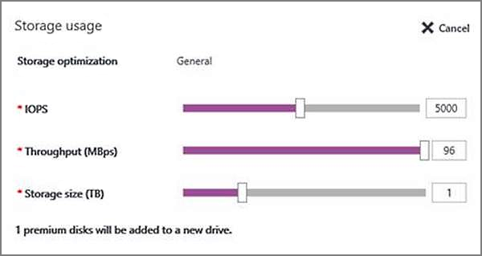
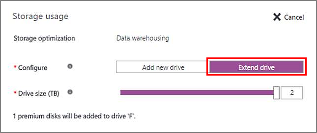

<properties
    pageTitle="Speicherkonfiguration für SQL Server-virtuellen Computern | Microsoft Azure"
    description="In diesem Thema wird beschrieben, wie Azure Speicher für SQL Server-virtuellen Computern konfiguriert, während der Bereitstellung (Modell zur Bereitstellung von Ressourcenmanager). Es wird erläutert, wie Sie Speicherplatz für Ihre vorhandene SQL Server virtuellen Computer konfigurieren können."
    services="virtual-machines-windows"
    documentationCenter="na"
    authors="ninarn"
    manager="jhubbard"    
    tags="azure-resource-manager"/>
<tags
    ms.service="virtual-machines-windows"
    ms.devlang="na"
    ms.topic="article"
    ms.tgt_pltfrm="vm-windows-sql-server"
    ms.workload="infrastructure-services"
    ms.date="08/04/2016"
    ms.author="ninarn" />

# Speicherkonfiguration für SQL Server-virtuellen Computern

Wenn Sie ein Bild der SQL Server-virtuellen Computern in Azure konfigurieren, können Sie das Portal Ihrer Speicherkonfiguration automatisieren. Dies umfasst anfügen Speicherplatz auf dem virtuellen Computer zugänglich, Speichers mit SQL Server, und konfigurieren sie Sie für Ihren Anforderungen spezifische Performance optimieren.

In diesem Thema wird erläutert, wie Azure Speicherplatz für Ihre SQL Server-virtuellen Computern während der Bereitstellung sowohl für vorhandene virtuelle Computer konfiguriert. Dieser Konfiguration basiert auf der [Leistung bewährte Methoden](virtual-machines-windows-sql-performance.md) für Azure-virtuellen Computern mit SQL Server.

[AZURE.INCLUDE [learn-about-deployment-models](../../includes/learn-about-deployment-models-rm-include.md)]Klassische Bereitstellungsmodell.

## Erforderliche Komponenten
Zum Verwenden der automatischen Speicher Konfiguration Einstellungen, erfordert des virtuellen Computers die folgenden Merkmale auf:

- Nach der Bereitstellung mit einer [SQL Server-Katalog Bild](virtual-machines-windows-sql-server-iaas-overview.md#option-1-deploy-a-sql-vm-per-minute-licensing).
- Verwendet das [Modell zur Bereitstellung von Ressourcenmanager](../resource-manager-deployment-model.md).
- Verwendet die [Premium-Speicher](../storage/storage-premium-storage.md).

## Neuen virtuellen Computern
In den folgenden Abschnitten wird beschrieben, wie Sie Speicherplatz für neue SQL Server-virtuellen Computern konfigurieren.

### Azure-Portal
Beim Bereitstellen einer Azure virtueller Computer mit einem SQL Server-Katalog Image, können Sie auswählen, automatisch die Speicherung für Ihre neue virtuellen Computer konfigurieren. Geben Sie die Speichergröße, die Leistungsgrenzwerte und die Arbeitsbelastung Typ. Das folgende Bildschirmabbild zeigt das Speicher Konfiguration Blade während SQL VM verwendet bereitgestellt.

Anhand Ihrer Auswahl, führt Azure die folgenden Aufgaben zur Speicher nach dem Erstellen des virtuellen Computer an:

- Erstellt und fügt Premium Daten-Datenträger zum virtuellen Computer.
- Konfiguriert die Festplatten mit den Daten, um für SQL Server zugänglich sein.
- Konfiguriert Festplatten mit den Daten in einem Speicherpool basierend auf die angegebenen Größe und Leistung (IOPS und Durchsatz) Anforderungen an.
- Ordnet ein neues Laufwerk des virtuellen Computers Speicherpool hinzu.
- Optimiert diese neue Laufwerk, auf der Grundlage der angegebenen Arbeitsbelastung Typs (Datawarehousing, Transaktionen ausgelegt Verarbeitung oder Standard).

Weitere Informationen zur wie Azure Speicher Einstellungen konfiguriert finden Sie im [Abschnitt Speicher-Konfiguration](#storage-configuration). Für eine vollständige Exemplarische Vorgehensweise zum Erstellen eines SQL Server virtuellen Computers im Portal Azure, finden [im Lernprogramm provisioning](virtual-machines-windows-portal-sql-server-provision.md).

### Ressource verwalten Vorlagen
Wenn Sie die folgenden Ressourcenmanager Vorlagen verwenden, werden zwei Premium Daten Datenträger standardmäßig, ohne Speicher Ressourcenpool Konfiguration angefügt. Allerdings können Sie diese Vorlagen, um die Anzahl der Datenträger mit Daten zu ändern, die den virtuellen Computern zugeordnet sind, anpassen.

- [Erstellen von virtuellen Computer mit automatische Sicherung](https://github.com/Azure/azure-quickstart-templates/tree/master/201-vm-sql-full-autobackup)
- [Erstellen von virtuellen Computer mit automatisierten Patch](https://github.com/Azure/azure-quickstart-templates/tree/master/201-vm-sql-full-autopatching)
- [Erstellen von virtuellen Computer mit AKV-Integration](https://github.com/Azure/azure-quickstart-templates/tree/master/201-vm-sql-full-keyvault)

## Vorhandenen virtuellen Computern
Für vorhandene SQL Server virtuelle Computer können Sie einige Einstellungen Speicher Azure-Portal ändern. Wählen Sie Ihre virtuellen Computer, wechseln Sie zu dem Bereich Einstellungen, und wählen Sie dann auf SQL Server-Konfiguration. Das Konfiguration von SQL Server-Blade zeigt die aktuelle Speicher Verwendung von Ihrer virtuellen Computer an. In dieser Tabelle werden alle Laufwerke, die vorhanden sind, Ihre virtuellen Computers angezeigt. Zeigt an der Speicherplatz für jedes Laufwerk in vier Abschnitten:

- SQL-Daten
- SQL-Protokoll
- Andere (nicht-SQL-Speicher)
- Verfügbar

Zum Konfigurieren des Speichers, um ein neues Laufwerk hinzufügen oder ein vorhandenes Laufwerk zu erweitern, klicken Sie auf den Link ' Bearbeiten ' oberhalb des Diagramms.

Die Optionen, die Sie variiert je nachdem, ob angezeigt werden, haben Sie dieses Feature vor verwendet. Wenn Sie zum ersten Mal verwenden, können Sie Ihren Anforderungen Speicherplatz für ein neues Laufwerk angeben. Wenn Sie dieses Feature zuvor zum Erstellen eines Laufwerks verwendet, können Sie auswählen, um des Laufwerks Speicherplatz zu erweitern.

### Verwenden Sie zum ersten Mal
Wenn sie zum ersten Mal verwenden dieses Feature ist, können Sie die Speichergrenzwerte Größe und Leistung für ein neues Laufwerk angeben. Diese Erfahrung ähnelt was Sie bei provisioning Uhrzeit anzeigen möchten. Der wichtigste Unterschied ist, dass Sie nicht berechtigt sind, geben Sie die Arbeitsbelastung an. Diese Einschränkung wird verhindert, dass alle vorhandenen SQL Server-Konfigurationen des virtuellen Computers zu stören.

Azure erstellt ein neues Laufwerk basierend auf Ihren Spezifikationen. In diesem Szenario führt Azure folgende Speicher Konfigurationsaufgaben:

- Erstellt und fügt Premium Daten-Datenträger zum virtuellen Computer.
- Konfiguriert die Festplatten mit den Daten, um für SQL Server zugänglich sein.
- Konfiguriert Festplatten mit den Daten in einem Speicherpool basierend auf die angegebenen Größe und Leistung (IOPS und Durchsatz) Anforderungen an.
- Ordnet ein neues Laufwerk des virtuellen Computers Speicherpool hinzu.

Weitere Informationen zur wie Azure Speicher Einstellungen konfiguriert finden Sie im [Abschnitt Speicher-Konfiguration](#storage-configuration).

### Fügen Sie ein neues Laufwerk hinzu.
Wenn Sie bereits Speicher Ihrer SQL Server virtuellen Computers konfiguriert haben, zeigt zwei neue Optionen Speicherplatz zu erweitern. Die erste Möglichkeit ist dann, ein neues Laufwerk, hinzufügen, das die Leistung Ihrer virtuellen Computer erhöhen können.

Nachdem das Laufwerk hinzugefügt haben, müssen Sie jedoch einige zusätzliche manuelle Konfiguration, um die Leistung zu verbessern erzielen durchführen.

### Erweitern Sie das Laufwerk
Die anderen Option für die Erweiterung des Speichers wird auf das vorhandene Laufwerk zu erweitern. Diese Option erhöht den verfügbaren Speicherplatz für Ihr Laufwerk, aber nicht Leistung erhöht. Mit Speicherpools können Sie die Anzahl der Spalten ändern, nachdem der Speicherpool erstellt wird. Die Anzahl der Spalten bestimmt die Anzahl der parallele schreibt, die die Daten Datenträger verteilt werden können. Daher können keine hinzugefügten Daten Datenträger Leistung zu verbessern. Sie können nur mehr Speicherplatz für geschriebenen Daten bereitstellen. Diese Einschränkung also auch, wenn Sie das Laufwerk zu erweitern, die Anzahl der Spalten mit die Mindestanzahl der Datenträger Daten bestimmt, die Sie hinzufügen können. Wenn Sie einen Speicherpool mit vier Datenfestplatten erstellen, also die Anzahl der Spalten auch vier. Jedes Mal, wenn Sie den Speicherplatz zu erweitern, müssen Sie mindestens vier Daten Datenträger hinzufügen.

## Speicherkonfiguration
Dieser Abschnitt enthält einen Verweis für die Speicher Konfiguration Änderungen, die Azure automatisch während SQL VM bereitgestellt oder Konfiguration im Portal Azure ausführt.

- Wenn Sie weniger als zwei TB Speicher für Ihre virtuellen Computer ausgewählt haben, wird einen Speicherpool von Azure nicht erstellt.
- Wenn Sie mindestens zwei TB Speicher für Ihre virtuellen Computer ausgewählt haben, wird Azure einen Speicherpool konfiguriert. Im nächsten Abschnitt dieses Themas umfasst ausführliche Informationen zu den Speicher Ressourcenpool zu konfigurieren.
- Automatische Speicherung Konfiguration immer verwendet [Premium Speicher](../storage/storage-premium-storage.md) P30 Daten Datenträger. Daher besteht eine 1:1-Zuordnung zwischen der ausgewählten Anzahl TB und die Anzahl der Datenträger mit Daten, die Ihre virtuellen Computer angefügt.

Preisinformationen, finden Sie unter der Seite [Preise Speicher](https://azure.microsoft.com/pricing/details/storage) auf der Registerkarte **Festplattenspeicher** .

### Erstellung von Speicherpool
Azure verwendet die folgenden Einstellungen Speicherpool auf SQL Server-virtuellen Computern erstellen.

| Einstellung | Wert |
|-----|-----|
| Streifengröße  | 256 KB (Datawarehousing); 64 KB (Transaktion) |
| Datenträgergrößen | 1 TB |
| Cache | Lesen |
| Zuordnungsgröße | 64 KB NTFS die Größe der Zuordnungseinheiten |
| Sofortsuche Datei Initialisierung | Aktiviert |
| Von Sperrseiten im Speicher | Aktiviert |
| Wiederherstellung | Einfache Wiederherstellung (keine Flexibilität) |
| Anzahl von Spalten | Anzahl der Daten Datenträger1 |
| Speicherort der temporären Datenbank | Klicken Sie auf Daten Datenträger2 gespeichert |

1 nachdem Speicherpool erstellt wurde, können nicht Sie die Anzahl der Spalten im Speicherpool ändern.

2 diese Einstellung gilt nur für das erste Laufwerk, die, das Sie mit der Konfiguration Speicher erstellen.

## Arbeitsbelastung Optimierung Einstellungen
Die folgende Tabelle beschreibt die drei Arbeitsbelastung Typ verfügbaren Optionen und deren entsprechenden Optimierungen an:

| Art der Auslastung | Beschreibung | Optimierungen |
|-----|-----|-----|
| **Allgemeine** | Standardeinstellung, die meisten Auslastung unterstützt | Keine |
| **Verarbeitung von Transaktionen** | Optimiert die Speicherung bei OLTP traditionelle Datenbanken | Verfolgen von Kennzeichnung 1117 Verfolgen von Kennzeichnung 1118 |
| **Data Warehouse** | Optimiert den Speicherplatz für analytischen und reporting Auslastung | Verfolgen von Kennzeichnung 610 Verfolgen von Kennzeichnung 1117 |

>[AZURE.NOTE] Sie können nur die Art der Auslastung angeben, wenn Sie eine SQL-virtuellen Computern bereitstellen, indem Sie es im Speicher Konfiguration Schritt auswählen.

## Nächste Schritte
Weitere Themen im Zusammenhang mit dem SQL Server in Azure-virtuellen Computern ausgeführt wird finden Sie unter [SQL Server auf Azure virtuellen Computern](virtual-machines-windows-sql-server-iaas-overview.md).
