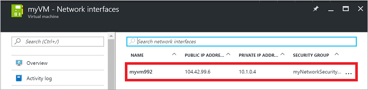
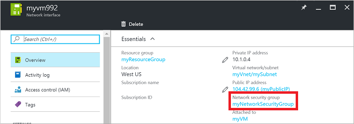
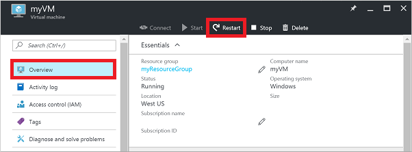

<properties
    pageTitle="Kann nicht zu einer Azure-virtuellen Computer RDP | Microsoft Azure"
    description="Behandeln von Problemen, wenn Sie keine Verbindung zu Ihrem Windows-Computer in Azure mithilfe von Remotedesktop herstellen können"
    keywords="Remote desktop zurück, Remotedesktop-Verbindung zurück, keine Verbindung zu virtuellen Computer Remotedesktop Problembehandlung"
    services="virtual-machines-windows"
    documentationCenter=""
    authors="iainfoulds"
    manager="timlt"
    editor=""
    tags="top-support-issue,azure-service-management,azure-resource-manager"/>

<tags
    ms.service="virtual-machines-windows"
    ms.workload="infrastructure-services"
    ms.tgt_pltfrm="vm-windows"
    ms.devlang="na"
    ms.topic="support-article"
    ms.date="10/26/2016"
    ms.author="iainfou"/>

# <a name="troubleshoot-remote-desktop-connections-to-an-azure-virtual-machine"></a>Behandeln von Problemen mit Remote Desktop-Verbindungen mit einer Azure-virtuellen Computern

Die Verbindung (Remotedesktopprotokoll) auf Ihrem Windows-basiertem Azure-virtuellen Computern (virtueller Computer) kann aus verschiedenen Gründen verlassen Sie nicht auf Ihre virtuellen Computer zugreifen fehl. Das Problem kann mit den Remote Desktop-Dienst auf den virtuellen Computer, die Netzwerkverbindung oder auf Ihrem Hostcomputer Remotedesktop-Clients sein. In diesem Artikel führt Sie durch einige der am häufigsten verwendeten Methoden, RDP Verbindungsprobleme zu lösen. 

Wenn Sie an einer beliebigen Stelle in diesem Artikel weitere Hilfe benötigen, können Sie die Azure-Experten auf [der MSDN-Azure und Stapelüberlauf Foren](https://azure.microsoft.com/support/forums/)kontaktieren. Alternativ können Sie einen Supportvorfall Azure ablegen. Wechseln Sie zu der [Azure support-Website](https://azure.microsoft.com/support/options/) , und wählen Sie die **Erste unterstützen**.

<a id="quickfixrdp"></a>

## <a name="quick-troubleshooting-steps"></a>QuickSteps zur Problembehandlung
Versuchen Sie nach jedem Schritt zur Problembehandlung Wiederherstellen der Verbindung mit dem virtuellen Computer aus:

1. Remote Desktop-Konfiguration zurückgesetzt.
2. Netzwerk-Sicherheitsgruppe Überprüfen von Regeln / Cloud Services Endpunkte.
3. Überprüfen Sie die virtuellen Computer Console Protokolle.
4. Überprüfen Sie die Integrität des virtuellen Computer Ressource ein.
5. Zurücksetzen Sie Ihres Kennworts virtueller Computer an.
6. Starten Sie Ihre virtuellen Computer neu.
7. Stellen Sie Ihre virtuellen Computer erneut bereit.

Lesen Sie weiter, wenn Sie weitere ausführliche Schritte und erläuterungen benötigen.

> [AZURE.TIP] Wenn die Schaltfläche **Verbinden** für Ihre virtuellen Computer im Portal abgeblendet ist, und es keine mit Azure über eine Verbindung [Express weiterleiten](../expressroute/expressroute-introduction.md) oder [Website-zu-Standort VPN Verbindung werden](../vpn-gateway/vpn-gateway-howto-site-to-site-resource-manager-portal.md) , müssen Sie erstellen und Ihre virtuellen Computer eine öffentliche IP-Adresse zuweisen, bevor Sie RDP verwenden können. Weitere Informationen zu [öffentlichen IP-Adressen in Azure](../virtual-network/virtual-network-ip-addresses-overview-arm.md).


## <a name="ways-to-troubleshoot-rdp-issues"></a>Methoden zum Behandeln von Problemen mit der RDP Probleme
Sie können virtuellen Computern erstellt Ressourcenmanager Bereitstellungsmodell mithilfe einer der folgenden Methoden zu beheben:

- [Azure-Portal](#using-the-azure-portal) – hervorragend, wenn Sie schnell die RDP Konfiguration oder Anmeldeinformationen und zurücksetzen müssen haben nicht die Azure Tools installiert.
- [Azure PowerShell](#using-azure-powershell) – zurücksetzen Wenn Sie mit einer Aufforderung PowerShell vertraut sind schnell die RDP Konfiguration oder Anmeldeinformationen mithilfe der Azure-PowerShell-Cmdlets.

Sie können auch Schritte zur Behebung von virtuellen Computern erstellt, mit dem [Modell zur Bereitstellung von klassischen](#troubleshoot-vms-created-using-the-classic-deployment-model)suchen.


<a id="fix-common-remote-desktop-errors"></a>
## <a name="troubleshoot-using-the-azure-portal"></a>Problembehandlung bei der Verwendung des Azure-Portals
Versuchen Sie nach jedem Schritt zur Problembehandlung Herstellen einer Verbindung mit Ihrem virtuellen Computer erneut aus. Wenn Sie noch keine Verbindung herstellen können, versuchen Sie es im nächsten Schritt.

1. **Die RDP-Verbindung zurücksetzen**. Dieser Schritt zur Problembehandlung zurückgesetzt RDP-Konfiguration aus, wenn Windows-Firewall-Regeln beispielsweise RDP, blockieren werden oder Remote-Verbindungen deaktiviert sind.

    Wählen Sie Ihre virtuellen Computer im Azure-Portal an. Führen Sie einen Bildlauf nach unten zum Abschnitt **Support + Problembehandlung** am Ende der Liste Einstellungsbereich. Klicken Sie auf die Schaltfläche **Kennwort zurücksetzen** . Festlegen Sie des **Modus** zum **Zurücksetzen der Konfiguration nur** aus, und klicken Sie dann auf die Schaltfläche **Aktualisieren** :

    

2. **Überprüfen von Netzwerk-Sicherheitsgruppe Regeln**. Dieser Schritt zur Problembehandlung überprüft, ob Sie eine Regel in Ihrem Netzwerk Sicherheitsgruppe den Datenverkehr RDP zulässt aufweisen. Der Standardport für RDP ist TCP-Port 3389. Eine Regel RDP Datenverkehr kann möglicherweise nicht automatisch erstellt, wenn Sie Ihre virtuellen Computer erstellen.

    Wählen Sie Ihre virtuellen Computer im Azure-Portal an. Klicken Sie auf das **Netzwerk-Schnittstellen** aus dem Einstellungsbereich.

    

    Wählen Sie Ihre Netzwerk-Oberfläche aus der Liste (normalerweise nur einmal vorhanden ist):

    

    Wählen Sie **Netzwerk-Sicherheitsgruppe** zum Anzeigen der Netzwerk-Sicherheitsgruppe zugeordnet Ihre Netzwerk-Oberfläche aus:

    

    Stellen Sie sicher, dass eine eingehende Regel vorhanden ist, die RDP Verkehr auf TCP-Port 3389 zulässt. Im folgenden Beispiel wird eine gültige Sicherheitsregel, die RDP Verkehr zulässt. Sie können finden Sie unter `Service` und `Action` ordnungsgemäß konfiguriert sind:

    

    Wenn Sie eine Regel nicht verfügen ermöglicht, RDP-Datenverkehr, [Erstellen Sie eine Regel Sicherheitsgruppe Netzwerk](virtual-machines-windows-nsg-quickstart-portal.md). Zulassen von TCP-Port 3389.

3. **Überprüfen virtueller Computer Boot Diagnose**. Dieser Schritt zur Problembehandlung prüft die virtuellen Computer Console-Protokolle, um festzustellen, ob ein Problem der virtuellen Computer ein Bericht erstellt wird. Nicht alle virtuellen Computern haben Boot Diagnose aktiviert, damit dieser Schritt zur Problembehandlung optional sein kann.
    
    Spezifische Schritte zur Problembehandlung liegen außerhalb des Bereichs dieses Artikels, aber möglicherweise ein breiter Problem, das RDP Connectivity auswirkt. Weitere Informationen zum Überprüfen der Console Protokolle und virtueller Computer Screenshot finden Sie unter [Boot Diagnose für virtuelle Computer](https://azure.microsoft.com/blog/boot-diagnostics-for-virtual-machines-v2/).

4. **Überprüfen Sie die Integrität des virtuellen Computer Ressourcen**. Dieser Schritt zur Problembehandlung stellt sicher, dass es liegen keine bekannten Probleme mit der Azure-Plattform die Verbindung zu den virtuellen Computer beeinträchtigen.

    Wählen Sie Ihre virtuellen Computer im Azure-Portal an. Führen Sie einen Bildlauf nach unten zum Abschnitt **Support + Problembehandlung** am Ende der Liste Einstellungsbereich. Klicken Sie auf die Schaltfläche **Ressource Dienststatus** . Fehlerfreies ein virtuellen Computers Berichte als **verfügbar**:

    

5. **Benutzeranmeldeinformationen zurücksetzen**. Wenn Sie nicht sicher sind, oder die Anmeldeinformationen vergessen haben, wird dieser Schritt zur Problembehandlung des Kennworts für ein lokales Administratorkonto zurückgesetzt.

    Wählen Sie Ihre virtuellen Computer im Azure-Portal an. Führen Sie einen Bildlauf nach unten zum Abschnitt **Support + Problembehandlung** am Ende der Liste Einstellungsbereich. Klicken Sie auf die Schaltfläche **Kennwort zurücksetzen** . Stellen Sie sicher, dass der **Modus** auf **Kennwort zurücksetzen** eingestellt ist, und geben Sie Ihren Benutzernamen und das neue Kennwort ein. Klicken Sie abschließend auf die Schaltfläche **Aktualisieren** :

    

6. **Starten Sie Ihre virtuellen Computer neu**. Dieser Schritt zur Problembehandlung kann alle zugrunde liegenden Probleme zu beheben, die der virtuellen Computer selbst ein Problem auftritt.

    Wählen Sie im Portal Azure Ihrer virtuellen Computer aus, und klicken Sie auf der Registerkarte **Übersicht** . Klicken Sie auf die Schaltfläche **neu starten** :

    

7. **Stellen Sie Ihre virtuellen Computer erneut bereit**. Dieser Schritt zur Problembehandlung stellt der virtuellen Computer an einen anderen Host innerhalb Azure korrigieren Sie alle zugrunde liegenden Plattform oder Netzwerkproblemen erneut bereit.

    Wählen Sie Ihre virtuellen Computer im Azure-Portal an. Führen Sie einen Bildlauf nach unten zum Abschnitt **Support + Problembehandlung** am Ende der Liste Einstellungsbereich. Klicken Sie auf die Schaltfläche **erneut bereitstellen** , und klicken Sie dann auf **erneut bereitzustellen**:

    

    Wenn dieser Vorgang abgeschlossen ist, temporärer Datenträgerdaten verloren gehen oder dynamische IP-Adressen, die den virtuellen Computer zugeordnet sind, werden aktualisiert.

Wenn RDP Probleme weiterhin auftritt, können [eine Supportanfrage öffnen](https://azure.microsoft.com/support/options/) oder [ausführlichere RDP zur Problembehandlung Konzepte und Schritte](virtual-machines-windows-detailed-troubleshoot-rdp.md)zu lesen.


## <a name="troubleshoot-using-azure-powershell"></a>Problembehandlung bei der Verwendung von Azure PowerShell
Wenn Sie nicht bereits geschehen, [Installieren und Konfigurieren des neuesten Azure PowerShell](../powershell-install-configure.md).

In den folgenden Beispielen verwenden Variablen wie `myResourceGroup`, `myVM`, und `myVMAccessExtension`. Ersetzen Sie diesen Variablennamen und Speicherorte durch Ihre eigenen Werte ein.

> [AZURE.NOTE] Die Anmeldeinformationen des Benutzers und die Konfiguration RDP können Sie mithilfe des PowerShell-Cmdlets [Set-AzureRmVMAccessExtension](https://msdn.microsoft.com/library/mt619447.aspx) zurücksetzen. In den folgenden Beispielen `myVMAccessExtension` ist ein Name, den Sie als Teil des Prozesses angeben. Wenn Sie mit der VMAccessAgent zuvor gearbeitet haben, können Sie den Namen der vorhandenen Erweiterung abrufen, mithilfe von `Get-AzureRmVM -ResourceGroupName "myResourceGroup" -Name "myVM"` die Eigenschaften für den virtuellen Computer überprüfen. Suchen Sie zum Anzeigen des Namens unter dem Abschnitt 'Erweiterungen' der Ausgabe.

Versuchen Sie nach jedem Schritt zur Problembehandlung Herstellen einer Verbindung mit Ihrem virtuellen Computer erneut aus. Wenn Sie noch keine Verbindung herstellen können, versuchen Sie es im nächsten Schritt.

1. **Die RDP-Verbindung zurücksetzen**. Dieser Schritt zur Problembehandlung zurückgesetzt RDP-Konfiguration aus, wenn Windows-Firewall-Regeln beispielsweise RDP, blockieren werden oder Remote-Verbindungen deaktiviert sind.

    Im folgenden Beispiel werden zurückgesetzt RDP-Verbindung auf einen virtuellen Computer mit dem Namen `myVM` in der `WestUS` Position und in der Ressourcengruppe mit dem Namen `myResourceGroup`:

    ```powershell
    Set-AzureRmVMAccessExtension -ResourceGroupName "myResourceGroup" `
        -VMName "myVM" -Location Westus -Name "myVMAccessExtension"
    ```

2. **Überprüfen von Netzwerk-Sicherheitsgruppe Regeln**. Dieser Schritt zur Problembehandlung stellt sicher, dass Sie eine Regel in Ihrem Netzwerk Sicherheitsgruppe den RDP-Datenverkehr zulässt, haben. Der Standardport für RDP ist TCP-Port 3389. Eine Regel RDP Datenverkehr kann möglicherweise nicht automatisch erstellt, wenn Sie Ihre virtuellen Computer erstellen.

    Zunächst weisen alle Konfigurationsdaten für Ihr Netzwerk Sicherheitsgruppe sein, um die `$rules` Variable. Im folgende Beispiel ruft Informationen zu den Netzwerk-Sicherheitsgruppe mit dem Namen `myNetworkSecurityGroup` in der Ressourcengruppe mit dem Namen `myResourceGroup`:

    ```powershell
    $rules = Get-AzureRmNetworkSecurityGroup -ResourceGroupName "myResourceGroup" `
        -Name "myNetworkSecurityGroup"
    ```

    Sehen Sie sich jetzt die Regeln, die für diese Sicherheitsgruppe Netzwerk konfiguriert sind. Stellen Sie sicher, dass eine Regel vorhanden ist, um TCP-Port 3389 für eingehenden Verbindungen zulassen, wie folgt:

    ```powershell
    $rules.SecurityRules
    ```

    Im folgenden Beispiel wird eine gültige Sicherheitsregel, die RDP Verkehr zulässt. Sie können finden Sie unter `Protocol`, `DestinationPortRange`, `Access`, und `Direction` ordnungsgemäß konfiguriert sind:

    ```powershell
    Name                     : default-allow-rdp
    Id                       : /subscriptions/guid/resourceGroups/myResourceGroup/providers/Microsoft.Network/networkSecurityGroups/myNetworkSecurityGroup/securityRules/default-allow-rdp
    Etag                     : 
    ProvisioningState        : Succeeded
    Description              : 
    Protocol                 : TCP
    SourcePortRange          : *
    DestinationPortRange     : 3389
    SourceAddressPrefix      : *
    DestinationAddressPrefix : *
    Access                   : Allow
    Priority                 : 1000
    Direction                : Inbound
    ```

    Wenn Sie eine Regel nicht verfügen ermöglicht, RDP-Datenverkehr, [Erstellen Sie eine Regel Sicherheitsgruppe Netzwerk](virtual-machines-windows-nsg-quickstart-powershell.md). Zulassen von TCP-Port 3389.

3. **Benutzeranmeldeinformationen zurücksetzen**. Dieser Schritt zur Problembehandlung werden zurückgesetzt, das Kennwort für das lokale Administratorkonto an, das Sie angeben, wenn Sie nicht wissen, welche oder vergessen haben, wird die Anmeldeinformationen.

    Zuerst die Benutzernamen und ein neues Kennwort angeben, indem Sie Anmeldeinformationen ein, die `$cred` Variable wie folgt:

    ```powershell
    $cred=Get-Credential
    ```

    Aktualisieren Sie nun die Anmeldeinformationen Ihrer virtuellen Computers. Im folgenden Beispiel wird so aktualisiert, dass die Anmeldeinformationen auf einen virtuellen Computer mit dem Namen `myVM` in der `WestUS` Position und in der Ressourcengruppe mit dem Namen `myResourceGroup`:

    ```powershell
    Set-AzureRmVMAccessExtension -ResourceGroupName "myResourceGroup" `
        -VMName "myVM" -Location WestUS -Name "myVMAccessExtension" `
        -UserName $cred.GetNetworkCredential().Username `
        -Password $cred.GetNetworkCredential().Password
    ```

4. **Starten Sie Ihre virtuellen Computer neu**. Dieser Schritt zur Problembehandlung kann alle zugrunde liegenden Probleme zu beheben, die der virtuellen Computer selbst ein Problem auftritt.

    Im folgende Beispiel startet den virtuellen Computer mit dem Namen `myVM` in der Ressourcengruppe mit dem Namen `myResourceGroup`:

    ```powershell
    Restart-AzureRmVM -ResourceGroup "myResourceGroup" -Name "myVM"
    ```

5. **Stellen Sie Ihre virtuellen Computer erneut bereit**. Dieser Schritt zur Problembehandlung stellt der virtuellen Computer an einen anderen Host innerhalb Azure korrigieren Sie alle zugrunde liegenden Plattform oder Netzwerkproblemen erneut bereit.

    Im folgende Beispiel stellt erneut bereit, den virtuellen Computer mit dem Namen `myVM` in der `WestUS` Position und in der Ressourcengruppe mit dem Namen `myResourceGroup`:

    ```powershell
    Set-AzureRmVM -Redeploy -ResourceGroupName "myResourceGroup" -Name "myVM"
    ```

Wenn RDP Probleme weiterhin auftritt, können [eine Supportanfrage öffnen](https://azure.microsoft.com/support/options/) oder [ausführlichere RDP zur Problembehandlung Konzepte und Schritte](virtual-machines-windows-detailed-troubleshoot-rdp.md)zu lesen.


## <a name="troubleshoot-vms-created-using-the-classic-deployment-model"></a>Behandeln von Problemen mit virtuellen Computern erstellt die Bereitstellung klassisch

Versuchen Sie nach jedem Schritt zur Problembehandlung Wiederherstellen der Verbindung mit den virtuellen Computer aus.

1. **Die RDP-Verbindung zurücksetzen**. Dieser Schritt zur Problembehandlung zurückgesetzt RDP-Konfiguration aus, wenn Windows-Firewall-Regeln beispielsweise RDP, blockieren werden oder Remote-Verbindungen deaktiviert sind.

    Wählen Sie Ihre virtuellen Computer im Azure-Portal an. Klicken Sie auf der **... Weitere** und dann auf **RAS zurücksetzen**:

    

2.  **Vergewissern Sie sich Cloud Services Endpunkte**. Dieser Schritt zur Problembehandlung überprüft, dass Sie die Endpunkte in der Cloud Services mit dem RDP Datenverkehr zugelassen haben. Der Standardport für RDP ist TCP-Port 3389. Eine Regel RDP Datenverkehr kann möglicherweise nicht automatisch erstellt, wenn Sie Ihre virtuellen Computer erstellen.

    Wählen Sie Ihre virtuellen Computer im Azure-Portal an. Klicken Sie auf die **Endpunkte** -Schaltfläche, um die Endpunkte so konfiguriert, dass aktuell für Ihre virtuellen Computer anzuzeigen. Überprüft, ob Endpunkte vorhanden, die RDP-Datenverkehr auf TCP-Port 3389 zulässt.
    
    Das folgende Beispiel zeigt gültige Endpunkte, die RDP Datenverkehr ermöglichen:

    

    Wenn Sie nicht über einen Endpunkt verfügen ermöglicht, [Erstellen Sie einen Endpunkt Cloud Services](virtual-machines-windows-classic-setup-endpoints.md)RDP-Datenverkehr. Private Port 3389 TCP zulassen.

3. **Überprüfen virtueller Computer Boot Diagnose**. Dieser Schritt zur Problembehandlung prüft die virtuellen Computer Console-Protokolle, um festzustellen, ob ein Problem der virtuellen Computer ein Bericht erstellt wird. Nicht alle virtuellen Computern haben Boot Diagnose aktiviert, damit dieser Schritt zur Problembehandlung optional sein kann.
    
    Spezifische Schritte zur Problembehandlung liegen außerhalb des Bereichs dieses Artikels, aber möglicherweise ein breiter Problem, das RDP Connectivity auswirkt. Weitere Informationen zum Überprüfen der Console Protokolle und virtueller Computer Screenshot finden Sie unter [Boot Diagnose für virtuelle Computer](https://azure.microsoft.com/blog/boot-diagnostics-for-virtual-machines-v2/).

4. **Überprüfen Sie die Integrität des virtuellen Computer Ressourcen**. Dieser Schritt zur Problembehandlung stellt sicher, dass es liegen keine bekannten Probleme mit der Azure-Plattform die Verbindung zu den virtuellen Computer beeinträchtigen.

    Wählen Sie Ihre virtuellen Computer im Azure-Portal an. Führen Sie einen Bildlauf nach unten zum Abschnitt **Support + Problembehandlung** am Ende der Liste Einstellungsbereich. Klicken Sie auf die Schaltfläche **Ressource Dienststatus** . Fehlerfreies ein virtuellen Computers Berichte als **verfügbar**:

    

5. **Benutzeranmeldeinformationen zurücksetzen**. Dieser Schritt zur Problembehandlung werden zurückgesetzt, das Kennwort für das lokale Administratorkonto, das Sie angeben, wenn Sie nicht sicher sind, oder die Anmeldeinformationen vergessen haben.

    Wählen Sie Ihre virtuellen Computer im Azure-Portal an. Führen Sie einen Bildlauf nach unten zum Abschnitt **Support + Problembehandlung** am Ende der Liste Einstellungsbereich. Klicken Sie auf die Schaltfläche **Kennwort zurücksetzen** . Geben Sie Ihren Benutzernamen und das neue Kennwort ein. Klicken Sie abschließend auf die Schaltfläche **Speichern** :

    

6. **Starten Sie Ihre virtuellen Computer neu**. Dieser Schritt zur Problembehandlung kann alle zugrunde liegenden Probleme zu beheben, die der virtuellen Computer selbst ein Problem auftritt.

    Wählen Sie im Portal Azure Ihrer virtuellen Computer aus, und klicken Sie auf der Registerkarte **Übersicht** . Klicken Sie auf die Schaltfläche **neu starten** :

    
    
Wenn RDP Probleme weiterhin auftritt, können [eine Supportanfrage öffnen](https://azure.microsoft.com/support/options/) oder [ausführlichere RDP zur Problembehandlung Konzepte und Schritte](virtual-machines-windows-detailed-troubleshoot-rdp.md)zu lesen.


## <a name="troubleshoot-specific-rdp-errors"></a>Behandeln von Problemen mit bestimmten RDP-Fehler
Wenn Ihre virtuellen Computer über RDP eine Verbindung herstellen möchten, können Sie eine bestimmte Fehlermeldung auftreten. Im folgenden sind die am häufigsten verwendeten Fehlermeldungen angezeigt:

- [Die remote-Sitzung getrennt wurde, da es sind keine Remote Desktop Lizenzserver eine Lizenz verfügbar sind](virtual-machines-windows-troubleshoot-specific-rdp-errors.md#rdplicense).
- [Remote Desktop des Computers "Name" kann nicht gefunden werden](virtual-machines-windows-troubleshoot-specific-rdp-errors.md#rdpname).
- [Eine Authentifizierung Fehler ist aufgetreten. Die lokale Sicherheit Zertifizierungsstelle kann keine Verbindung hergestellt werden](virtual-machines-windows-troubleshoot-specific-rdp-errors.md#rdpauth).
- [Windows-Sicherheit zurück: funktionieren Ihre Anmeldeinformationen nicht](virtual-machines-windows-troubleshoot-specific-rdp-errors.md#wincred).
- [Diesem Computer kann keine Verbindung mit dem Remotecomputer herstellen](virtual-machines-windows-troubleshoot-specific-rdp-errors.md#rdpconnect).


## <a name="additional-resources"></a>Zusätzliche Ressourcen
Wenn keiner dieser Fehler aufgetreten ist, und Sie noch keine zu den virtuellen Computer über Remote Desktop Verbindung, lesen Sie die detaillierte [zur Problembehandlung bei Remotedesktop](virtual-machines-windows-detailed-troubleshoot-rdp.md).

- [Azure IaaS (Windows) Diagnose-Paket](https://home.diagnostics.support.microsoft.com/SelfHelp?knowledgebaseArticleFilter=2976864)
- Zur Behandlung dieses Problems Schritte beim Zugriff auf die Anwendung, die auf einem virtuellen Computer ausgeführt wird, finden Sie unter [Behandeln von Zugriff auf eine Anwendung einer Azure-virtuellen Computers ausgeführt](virtual-machines-linux-troubleshoot-app-connection.md).
- Wenn Sie mithilfe von Secure Shell (SSH) Verbindung zu einem Linux VM in Azure Probleme auftreten, finden Sie unter [Behandeln von Problemen mit SSH Verbindungen mit eines Linux virtuellen Computers in Azure](virtual-machines-linux-troubleshoot-ssh-connection.md).
