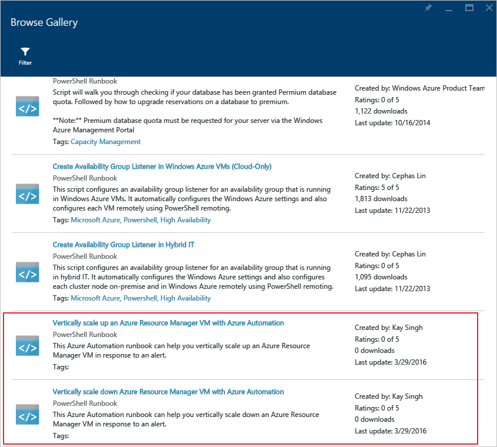
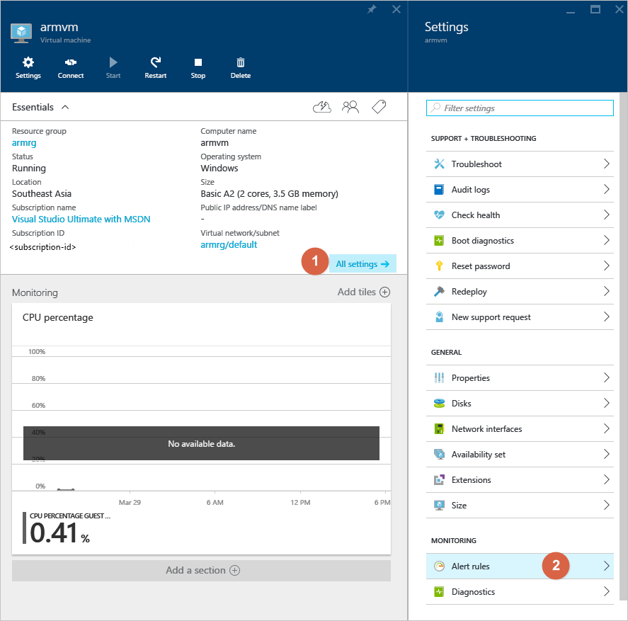
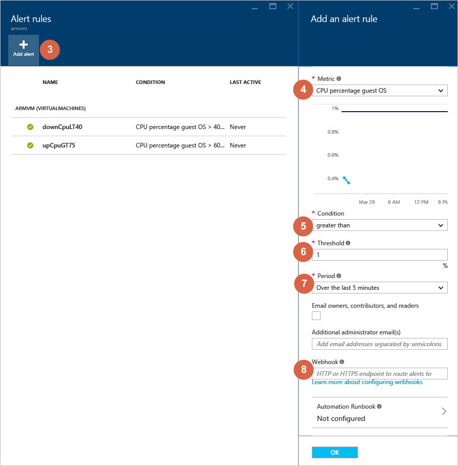

<properties
    pageTitle="Vertikal skalieren Azure-virtuellen Computern mit Azure Automatisierung | Microsoft Azure"
    description="Wie Sie einem Windows-Computer als Antwort auf die Überwachung von Benachrichtigungen mit Azure Automatisierung vertikal zu skalieren"
    services="virtual-machines-windows"
    documentationCenter=""
    authors="singhkays"
    manager="timlt"
    editor=""
    tags="azure-resource-manager"/>

<tags
    ms.service="virtual-machines-windows"
    ms.workload="infrastructure-services"
    ms.tgt_pltfrm="vm-windows"
    ms.devlang="na"
    ms.topic="article"
    ms.date="03/29/2016"
    ms.author="singhkay"/>

# Vertikal skalieren Sie Azure-virtuellen Computern mit Azure Automatisierung

Vertikale Skalierung ist die Vorgehensweise zum Erhöhen oder verringern die Ressourcen von einem Computer in der Antwort auf die Arbeitsbelastung. Dies kann in Azure durch Ändern der Größe des virtuellen Computers erreicht werden. Damit können Sie in den folgenden Szenarien

- Wenn die virtuellen Computern nicht häufig verwendet wird, können auf Ihre monatlichen Kosten reduzieren geringerer Größe ändern der Größe
- Wenn des virtuellen Computers eine Belastung angezeigt wird, können sie an einer größeren seine Kapazität erhöhen angepasst

Die Gliederung für die Schritte hierfür ist als unter

1. Setup Azure Automatisierung zum Zugreifen auf Ihre virtuellen Computern
2. Importieren Sie die Runbooks Azure Automatisierung vertikale Skalierung in Ihr Abonnement
3. Hinzufügen eines Webhook zu Ihrem Runbooks
4. Hinzufügen einer Benachrichtigung zu Ihrem virtuellen Computern

> [AZURE.NOTE] Da die Größe des ersten virtuellen Computers, die Größen, die sie an die, angepasst werden kann beschränkt, weil die Verfügbarkeit der anderen Größen im Cluster ist möglicherweise, denen im aktuellen virtuellen Computern bereitgestellt wird. In den in diesem Artikel verwendeten veröffentlichten Automatisierung Runbooks wir übernehmen, diesem Fall und skalieren nur innerhalb der unter virtueller Computer Größe paarweise angegeben werden. Dies bedeutet, dass eine Standard_D1v2 virtuellen Computern nicht plötzlich auf Standard_G5 von skaliert oder unten auf Basic_A0 skaliert.

>| Virtueller Computer Größen skalieren Paar |   |
|---|---|
|  Basic_A0 |  Basic_A4 |
|  Standard_A0 | Standard_A4 |
|  Standard_A5 | Standard_A7  |
|  Standard_A8 | Standard_A9  |
|  Standard_A10 |  Standard_A11 |
|  Standard_D1 |  Standard_D4 |
|  Standard_D11 | Standard_D14  |
|  Standard_DS1 |  Standard_DS4 |
|  Standard_DS11 | Standard_DS14  |
|  Standard_D1v2 |  Standard_D5v2 |
|  Standard_D11v2 |  Standard_D14v2 |
|  Standard_G1 |  Standard_G5 |
|  Standard_GS1 |  Standard_GS5 |

## Setup Azure Automatisierung zum Zugreifen auf Ihre virtuellen Computern

Sie müssen zuerst ist ein Automatisierung Azure-Konto zu erstellen, die die zum Skalieren des virtuellen Computers verwendet Runbooks gehostet wird. Der Dienst Automatisierung eingeführt zuletzt das Feature von "Als Konto ausführen" wodurch Einstellung von Dienst Tilgungsanteile für die automatische Ausführung der Runbooks auf den Namen des Benutzers sehr einfach. Weitere Informationen hierzu finden Sie im folgenden Artikel:

* [Authentifizieren Sie Runbooks mit Azure ausführen als Konto](../automation/automation-sec-configure-azure-runas-account.md)

## Importieren Sie die Runbooks Azure Automatisierung vertikale Skalierung in Ihr Abonnement

Die Runbooks, die erforderlich sind, für die Skalierung vertikal auf Ihre virtuellen Computern sind bereits im Katalog Runbooks Automatisierung Azure veröffentlicht. Sie müssen diese in Ihr Abonnement zu importieren. Erläutert, wie Runbooks importieren, indem Sie den folgenden Artikel lesen.

* [Runbooks und Modul Kataloge für Azure Automatisierung](../automation/automation-runbook-gallery.md)

Die Runbooks, die importiert werden sollen sind in der nachstehenden Abbildung dargestellt.

## Hinzufügen eines Webhook zu Ihrem Runbooks

Nachdem Sie importiert haben Hinzufügen der Runbooks müssen Sie zu einer Webhook zu des Runbooks, damit es von einer Benachrichtigung anhand eines virtuellen Computers ausgelöst werden kann. Die Details des Erstellens eines Webhook für Ihre Runbooks können hier gelesen werden

* [Azure Automatisierung webhooks](../automation/automation-webhooks.md)

Stellen Sie sicher, dass Sie die Webhook kopieren, bevor Sie das Dialogfeld Webhook schließen, da Sie dies im nächsten Abschnitt benötigen.

## Hinzufügen einer Benachrichtigung zu Ihrem virtuellen Computern

1. Wählen Sie die Einstellungen des virtuellen Computers
2. Wählen Sie "Warnungsregeln"
3. Wählen Sie "Benachrichtigung hinzufügen"
4. Wählen Sie aus einer Metrik zum Auslösen der Warnung, klicken Sie auf
5. Wählen Sie eine Bedingung, das bei erfüllt wird dazu führen, dass die Warnung ausgelöst
6. Wählen Sie in Schritt 5 einen Schwellenwert für die Bedingung aus. erfüllt sein
7. Wählen Sie einen Zeitraum für den Überwachung Dienst aktivieren wird für die Bedingung und Schwellenwert in die Schritte 5 und 6
8. Fügen Sie in der Webhook, die Sie aus dem vorherigen Abschnitt kopiert haben.

