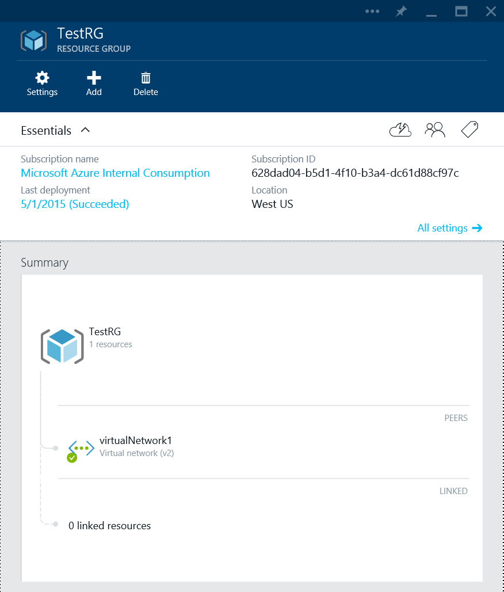

<properties
   pageTitle="Netzwerk-Anbieter Ressourcenübersicht | Microsoft Azure"
   description="Informationen Sie zu den neuen Netzwerk Ressourcenprovider in Azure Ressourcenmanager"
   services="virtual-network"
   documentationCenter="na"
   authors="jimdial"
   manager="carmonm"
   editor="tysonn" />
<tags
   ms.service="virtual-network"
   ms.devlang="na"
   ms.topic="article"
   ms.tgt_pltfrm="na"
   ms.workload="infrastructure-services"
   ms.date="03/15/2016"
   ms.author="jdial" />

# Netzwerk-Anbieter für Ressourcen
Eine Grundlage müssen in heutigen Geschäftserfolg, ist die Möglichkeit zum Erstellen und Verwalten von großen Maßstab Netzwerk bewusst Applications in eine Möglichkeit agiles, flexible, sichere und wiederholt. Azure Ressource-Manager (Cloud) können Sie solche Applications, als eine einzelne Sammlung von Ressourcen in Ressourcengruppen erstellen. Solche Ressourcen werden durch verschiedene Ressourcenanbieter unter Cloud verwaltet.

Azure Ressourcenmanager beruht auf anderen Ressourcenanbieter für den Zugriff auf Ihre Ressourcen. Es gibt drei Hauptfenster Ressourcenanbieter: Netzwerk, Speicher und berechnen. Dieses Dokument beschreibt die Merkmale und Vorteile von der Netzwerk-Anbieter für Ressourcen, einschließlich:

- **Metadaten** – Sie können Informationen zu Ressourcen mithilfe von Kategorien hinzufügen. Diese Tags können zum Nachverfolgen von Ressourcen Auslastung über Ressourcengruppen und Abonnements verwendet werden.
- **Bessere Kontrolle Ihres Netzwerks** - Netzwerk Ressourcen grob verknüpft sind und Sie können sie auf eine genauere Weise steuern. Dies bedeutet, dass Sie größere Flexibilität bei der Verwaltung von den Netzwerken Ressourcen haben.
- **Schnellere Konfigurations** - da Netzwerkressourcen grob verknüpft sind, können Sie erstellen und Netzwerk-Ressourcen parallel koordinieren. Konfigurationszeit hat sich erheblich verringert.
- **Rolle basierend Access Control** - RBAC bietet Standardrollen, mit bestimmten Sicherheit Bereiche gelten nur ermöglicht die Erstellung von benutzerdefinierten Rollen für eine sichere Verwaltung.
- **Einfacher Verwaltung und Bereitstellung** – es einfacher ist zu bereitstellen und Verwalten von Applications, da Sie können einen gesamte Anwendungsstapel als eine einzelne Sammlung von Ressourcen in einer Ressourcengruppe erstellen können. Und bereitstellen, da Sie bereitstellen können, indem Sie einfach eine Vorlage JSON-Nutzlast, schneller.
- **Schnelle Anpassung** – können deklarative Formatvorlage Vorlagen wiederholt und schnelle Anpassung der Bereitstellung auf aktivieren.
- **Wiederholt Anpassung** – können deklarative Formatvorlage Vorlagen wiederholt und schnelle Anpassung der Bereitstellung auf aktivieren.
- **Management-Schnittstellen** – Sie können eine der folgenden Schnittstellen zum Verwalten Ihrer Ressourcen verwenden:
    - REST-basierten API
    - PowerShell
    - .NET SDK
    - Node.JS SDK
    - Java SDK
    - Azure CLI
    - Vorschau-Portal
    - Cloud Vorlagensprache

## Netzwerk-Ressourcen
Sie können die Netzwerk-Ressourcen jetzt unabhängig voneinander, verwalten, anstatt sie über einen einzigen Rechner Ressource (virtuellen Computern) verwaltet. Dadurch wird sichergestellt, einen höheren Grad an Flexibilität und Flexibilität in eine komplexe und große Maßstab Infrastruktur in einer Ressourcengruppe verfassen.

Konzeptionelle Ansicht von einer Stichprobe Bereitstellung im Zusammenhang mit einer Anwendung mit mehreren Ebenen wird nachfolgend dargestellt. Jede Ressource, die angezeigt werden, wie z. B. NICs, öffentliche IP-Adressen und virtuellen Computern, kann unabhängig voneinander verwaltet werden.

Jeder Ressource enthält einen Standardsatz von Eigenschaften, und legen Sie die einzelne Eigenschaft. Die allgemeinen Eigenschaften sind:

|Eigenschaft|Beschreibung|Beispielwerte|
|---|---|---|
|**Namen**|Eindeutige Ressourcenname. Jeder Ressourcentyp verfügt über eine eigene naming Einschränkungen.|PIP01, VM01, NIC01|
|**Speicherort**|Azure Region, in dem sich die Ressource befindet.|Westus, eastus|
|**ID**|Eindeutige Grundlage URI-Kennung|/Subscriptions/<subGUID>/resourceGroups/TestRG/providers/Microsoft.Network/publicIPAddresses/TestPIP|

Sie können die einzelnen Eigenschaften von Ressourcen in den folgenden Abschnitten überprüfen.

[AZURE.INCLUDE [virtual-networks-nrp-pip-include](../../includes/virtual-networks-nrp-pip-include.md)]

[AZURE.INCLUDE [virtual-networks-nrp-nic-include](../../includes/virtual-networks-nrp-nic-include.md)]

[AZURE.INCLUDE [virtual-networks-nrp-nsg-include](../../includes/virtual-networks-nrp-nsg-include.md)]

[AZURE.INCLUDE [virtual-networks-nrp-udr-include](../../includes/virtual-networks-nrp-udr-include.md)]

[AZURE.INCLUDE [virtual-networks-nrp-vnet-include](../../includes/virtual-networks-nrp-vnet-include.md)]

[AZURE.INCLUDE [virtual-networks-nrp-dns-include](../../includes/virtual-networks-nrp-dns-include.md)]

[AZURE.INCLUDE [virtual-networks-nrp-lb-include](../../includes/virtual-networks-nrp-lb-include.md)]

[AZURE.INCLUDE [virtual-networks-nrp-appgw-include](../../includes/virtual-networks-nrp-appgw-include.md)]

[AZURE.INCLUDE [virtual-networks-nrp-vpn-include](../../includes/virtual-networks-nrp-vpn-include.md)]

[AZURE.INCLUDE [virtual-networks-nrp-tm-include](../../includes/virtual-networks-nrp-tm-include.md)]

## Management-Schnittstellen
Sie können mit anderen Schnittstellen Azure Netzwerken Ressourcen verwalten. In diesem Dokument wir liegt der Schwerpunkt auf Kabel aus der Schnittstellen: REST-API und Vorlagen.

### REST-API
Wie zuvor schon erwähnt, können Netzwerk-Ressourcen über eine Reihe von Schnittstellen, einschließlich REST-API .NET SDK Node.JS SDK Java SDK PowerShell CLI Azure-Portal und Vorlagen verwaltet werden.

Die Rest-API entsprechen der Spezifikation der HTTP 1.1-Protokoll. Die allgemeine URI-Struktur der API wird nachfolgend dargestellt:

    https://management.azure.com/subscriptions/{subscription-id}/providers/{resource-provider-namespace}/locations/{region-location}/register?api-version={api-version}

Und die Parameter in Klammern darstellen, die folgenden Elemente:

- **Abonnement-Id** – Ihre Azure-Abonnement-Id.
- **Ressourcen-Anbieter-Namespace** - Namespace für den Datenanbieter verwendet wird. Der Wert für das Netzwerk-Anbieter für Ressourcen ist *Microsoft.Network*.
- **Name der Region** - den Namen des Azure region

Die folgenden HTTP-Methoden werden unterstützt, wenn die REST-API aufrufen:

- **Setzen** - zum Erstellen einer Ressource für einen bestimmten Typ, verwendet ändern eine Ressourceneigenschaft oder eine Zuordnung zwischen Ressourcen ändern.
- Sie **erhalten** – zum Abrufen von Informationen für eine Ressource bereitgestellte verwendet.
- **Löschen** - verwendet, um eine vorhandene Ressource löschen.

Die Anforderung und die Antwort entsprechen Nutzlast JSON-Format. Weitere Informationen hierzu finden Sie unter [Azure Ressource Management APIs](https://msdn.microsoft.com/library/azure/dn948464.aspx).

### Cloud Vorlagensprache
Neben der Verwaltung von Ressourcen imperativ (über APIs oder SDK), können Sie auch deklarative Programmierung Formatvorlage verwenden, zum Erstellen und Verwalten von Netzwerk-Ressourcen mithilfe der Cloud Vorlagensprache.

Nachfolgend finden Sie eine Stichprobe Darstellung einer Vorlage –

    {
      "$schema": "http://schema.management.azure.com/schemas/2014-04-01-preview/deploymentTemplate.json",
      "contentVersion": "<version-number-of-template>",
      "parameters": { <parameter-definitions-of-template> },
      "variables": { <variable-definitions-of-template> },
      "resources": [ { <definition-of-resource-to-deploy> } ],
      "outputs": { <output-of-template> }    
    }

Die Vorlage ist hauptsächlich eine JSON-Beschreibung der Ressourcen und die Instanzwerte über Parameter eingefügt. Im folgenden Beispiel kann zum Erstellen eines virtuellen Netzwerks mit unterschiedlichen 2 verwendet werden.

    {
        "$schema": "http://schema.management.azure.com/schemas/2014-04-01-preview/VNET.json",
        "contentVersion": "1.0.0.0",
        "parameters" : {
          "location": {
            "type": "String",
            "allowedValues": ["East US", "West US", "West Europe", "East Asia", "South East Asia"],
            "metadata" : {
              "Description" : "Deployment location"
            }
          },
          "virtualNetworkName":{
            "type" : "string",
            "defaultValue":"myVNET",
            "metadata" : {
              "Description" : "VNET name"
            }
          },
          "addressPrefix":{
            "type" : "string",
            "defaultValue" : "10.0.0.0/16",
            "metadata" : {
              "Description" : "Address prefix"
            }

          },
          "subnet1Name": {
            "type" : "string",
            "defaultValue" : "Subnet-1",
            "metadata" : {
              "Description" : "Subnet 1 Name"
            }
          },
          "subnet2Name": {
            "type" : "string",
            "defaultValue" : "Subnet-2",
            "metadata" : {
              "Description" : "Subnet 2 name"
            }
          },
          "subnet1Prefix" : {
            "type" : "string",
            "defaultValue" : "10.0.0.0/24",
            "metadata" : {
              "Description" : "Subnet 1 Prefix"
            }
          },
          "subnet2Prefix" : {
            "type" : "string",
            "defaultValue" : "10.0.1.0/24",
            "metadata" : {
              "Description" : "Subnet 2 Prefix"
            }
          }
        },
        "resources": [
        {
          "apiVersion": "2015-05-01-preview",
          "type": "Microsoft.Network/virtualNetworks",
          "name": "[parameters('virtualNetworkName')]",
          "location": "[parameters('location')]",
          "properties": {
            "addressSpace": {
              "addressPrefixes": [
                "[parameters('addressPrefix')]"
              ]
            },
            "subnets": [
              {
                "name": "[parameters('subnet1Name')]",
                "properties" : {
                  "addressPrefix": "[parameters('subnet1Prefix')]"
                }
              },
              {
                "name": "[parameters('subnet2Name')]",
                "properties" : {
                  "addressPrefix": "[parameters('subnet2Prefix')]"
                }
              }
            ]
          }
        }
        ]
    }

Sie haben die Möglichkeit, die gewünschten Parameterwerte manuell bereitstellen, wenn Sie eine Vorlage verwenden, oder Sie können eine Parameterdatei verwenden. Das folgende Beispiel zeigt eine Menge an Parameterwerte, mit der vorstehenden Vorlage verwendet werden soll:

    {
      "location": {
          "value": "East US"
      },
      "virtualNetworkName": {
          "value": "VNET1"
      },
      "subnet1Name": {
          "value": "Subnet1"
      },
      "subnet2Name": {
          "value": "Subnet2"
      },
      "addressPrefix": {
          "value": "192.168.0.0/16"
      },
      "subnet1Prefix": {
          "value": "192.168.1.0/24"
      },
      "subnet2Prefix": {
          "value": "192.168.2.0/24"
      }
    }

Wesentliche Vorteile der Verwendung von Vorlagen werden:

- Sie können eine komplexe Infrastruktur in einer Ressourcengruppe in einem deklarativen Stil erstellen. Die Planung der Ressourcen, einschließlich Abhängigkeit Verwaltung erstellen, wird von Cloud behandelt.
- Die Infrastruktur kann wiederholt so entlang der verschiedenen Regionen und innerhalb eines Bereichs erstellt werden, indem Sie einfach auf Parameter zu ändern.
- Die deklarative Methode führt zu verkürzen negativer Zeitabstand in die Vorlagen erstellen und anschließend die Infrastruktur einführen.

Beispielvorlagen finden Sie unter [Schnellstart Azure-Vorlagen](https://github.com/Azure/azure-quickstart-templates).

Weitere Informationen auf die Sprache der Cloud-Vorlage finden Sie unter [Azure Ressourcenmanager Vorlage Sprache](../resource-group-authoring-templates.md).

Die Beispielvorlage oben verwendet die virtuelle Netzwerk und Subnetzressourcen. Es gibt andere Netzwerk-Ressourcen, die Sie verwenden können, wie unten aufgelistet:

### Verwenden einer Vorlage

Sie können Services Azure aus einer Vorlage mithilfe der PowerShell, AzureCLI, oder indem Sie Ausführen einer klicken Sie auf zur Bereitstellung von GitHub bereitstellen. Um aus einer Vorlage in GitHub Dienste bereitzustellen, führen Sie die folgenden Schritte aus:

1. Öffnen Sie die Datei template3 aus GitHub aus. Öffnen Sie beispielsweise [virtuellen Netzwerk mit unterschiedlichen zwei](https://github.com/Azure/azure-quickstart-templates/tree/master/101-virtual-network)ein.
2. Klicken Sie auf **Bereitstellen in Azure**, und klicken Sie dann auf Melden Sie Azure-Portal mit Ihren Anmeldeinformationen an.
3. Überprüfen Sie die Vorlage, und klicken Sie dann auf **Speichern**.
4. Klicken Sie auf **Parameter bearbeiten** , und wählen Sie einen Speicherort, z. B. *Westen US*, für die Vnet und Subnetze.
5. Falls erforderlich, ändern Sie die Parameter **ADDRESSPREFIX** und **SUBNETPREFIX** , und klicken Sie dann auf **OK**.
6. Klicken Sie auf, **Wählen Sie eine Ressourcengruppe aus** , und klicken Sie dann auf die Ressourcengruppe, die Vnet und zu Subnetze hinzufügen möchten. Alternativ können Sie eine neue Ressourcengruppe erstellen, indem Sie auf **oder neu erstellen**.
3. Klicken Sie auf **Erstellen**. Beachten Sie die Kachel **Provisioning Vorlage Bereitstellung**anzeigen. Nachdem die Bereitstellung abgeschlossen ist, wird einen Bildschirm ähnlich unten angezeigt werden.

## Nächste Schritte

[Azure Ressourcenmanager Vorlage Sprache](../resource-group-authoring-templates.md)

[Azure Netzwerke – häufig verwendete Vorlagen](https://github.com/Azure/azure-quickstart-templates)

[Anbieter für Ressourcen zu berechnen](../virtual-machines/virtual-machines-windows-compare-deployment-models.md)

[Azure Ressourcenmanager (Übersicht)](../azure-resource-manager/resource-group-overview.md)
