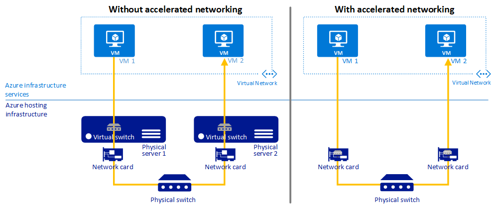
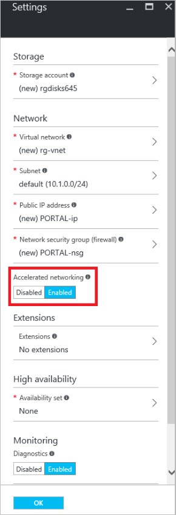
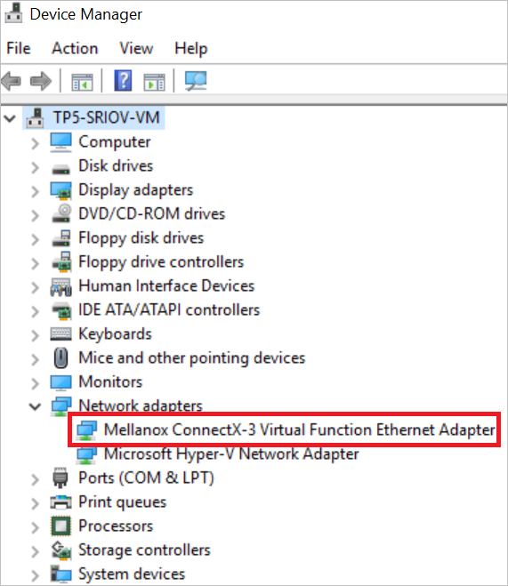

<properties 
   pageTitle="Schnellere für einen virtuellen Computer - Portal networking | Microsoft Azure"
   description="Informationen Sie zum Beschleunigen Networking für eine Azure-virtuellen Computern mithilfe der Azure-Portal zu konfigurieren."
   services="virtual-network"
   documentationCenter="na"
   authors="jimdial"
   manager="carmonm"
   editor=""
   tags="azure-resource-manager"
/>
<tags 
   ms.service="virtual-network"
   ms.devlang="na"
   ms.topic="article"
   ms.tgt_pltfrm="na"
   ms.workload="infrastructure-services"
   ms.date="09/26/2016"
   ms.author="jdial" />

# Schnellere Netzwerke für einen virtuellen Computer

> [AZURE.SELECTOR]
- [Azure-Portal](virtual-network-accelerated-networking-portal.md)
- [PowerShell](virtual-network-accelerated-networking-powershell.md)

Schnellere Netzwerke ermöglichen einzelnen Stamm e/a-Virtualisierung (SR-IOV) mit einem virtuellen Computer (virtueller Computer), die Netzwerke Leistung erheblich verbessert. Dieser Pfad leistungsfähige wird den Host von der Wartezeit, Jitter und CPU-Auslastung für die Verwendung mit den höchsten Ansprüchen Netzwerk Auslastung auf unterstützten Typen von virtuellen Computer verringern Datapath umgangen. In diesem Artikel wird erläutert, wie der Azure-Portal verwenden, um schnellere Networking im Bereitstellungsmodell Ressourcenmanager Azure konfigurieren. Sie können auch einen virtuellen Computer mit Beschleunigung Networking mithilfe der PowerShell Azure erstellen. Informationen wie, klicken Sie auf der PowerShell-Feld oben in diesem Artikel.

Die folgende Abbildung zeigt die Kommunikation zwischen zwei virtuellen Computern (virtueller Computer) mit und ohne Beschleunigung Networking:

Alle Netzwerke Datenverkehr ein-und den virtuellen Computer muss ohne Netzwerke Beschleunigung der Host und dem virtuellen Switch durchlaufen werden. Virtuelle Umschaltung enthält alle Durchsetzung von Richtlinien, wie Netzwerk Sicherheitsgruppen, Access Steuerelement Listen, Isolation und andere Netzwerkdienste virtualisierten Netzwerkverkehr. Weitere Informationen hierzu im Artikel [Hyper-V Netzwerk-Virtualisierung und virtuelle wechseln](https://technet.microsoft.com/library/jj945275.aspx) .

Schnellere Networking Netzwerkverkehr bei Network Netzwerkschnittstellenkarte eintrifft und klicken Sie dann auf den virtuellen Computer weitergeleitet wird. Alle Netzwerkrichtlinien, die der virtuelle Switch ohne Beschleunigung Networking gilt sind übergeben und in der Hardware angewendet. Anwenden einer Richtlinie in Hardware ermöglicht die Zuweisung an vorwärts Netzwerkverkehr direkt an den virtuellen Computer, der Host und die virtuelle Umschaltung umgehen, Beibehaltung der Richtlinie, die sie in den Host angewendet.

Die Vorteile von schnellere Networking beziehen sich nur auf dem virtuellen Computer, die es auf aktiviert ist. Die besten Ergebnisse erzielen Sie eignet sich die Aktivieren dieses Features auf mindestens zwei virtuellen Computern mit der gleichen VNet verbunden. Bei der Kommunikation über VNets oder Verbindungslinien lokalen wirkt sich dieses Feature minimalen zu allgemeinen Wartezeit.

[AZURE.INCLUDE [virtual-network-preview](../../includes/virtual-network-preview.md)]

##Vorteile

- **Unteren Wartezeit / höhere Pakete pro Sekunde (Pps):** Entfernen der Datapath Virtuelle Umschaltung entfernt die Zeitdauer, Pakete in den Host für die Richtlinie und erhöht die Anzahl der Pakete, die innerhalb des virtuellen Computers verarbeitet werden können.
- **Verringert Jitter:** Virtuelle Umschaltung Verarbeitung hängt davon ab, den Umfang der Richtlinie, die angewendet werden muss und die Arbeitsbelastung der CPU, die die Verarbeitung durchführt. Verschiebung der Durchsetzung der Hardware entfernt die Streuung durch die Bereitstellung von Pakete direkt an den virtuellen Computer, den Host virtueller Computer Kommunikation und alle Software Interrupts und Kontext Schalter entfernen.
- **Geringere CPU-Auslastung:** Umgehen der virtuelle Umschaltung im Host führt zu weniger CPU-Auslastung für die Verarbeitung von Netzwerkverkehr.

## Einschränkungen

Die folgenden Einschränkungen vorhanden sein, wenn Sie diese Funktion zu verwenden:
 
- **Netzwerk-Benutzeroberfläche Erstellung:** Schnellere Netzwerke kann nur für einen neuen Netzwerkadapter aktiviert werden.  Es kann nicht auf eine vorhandene Netzwerkschnittstelle aktiviert sein.
- **Erstellung virtueller Computer:** Eine Netzwerk-Oberfläche mit schnellere Netzwerke aktiviert kann nur in einen virtuellen angefügt werden, wenn der virtuellen Computer erstellt wird. Die Benutzeroberfläche Netzwerk kann zu einer vorhandenen virtuellen Computer angefügt werden.
- **Regionen:** In den "Westen" zentralen USA und "Westen" Europa Azure Regionen nur angeboten. Festlegen der Regionen wird in der Zukunft erweitert werden.
- **Unterstützte Betriebssystem:** Microsoft Windows Server 2012 R2 und WindowsServer 2016 Technical Preview 5. Linux und Windows Server 2012-Unterstützung wird bald hinzugefügt werden.
- **Virtueller Speicher:** Standard_D15_v2 und Standard_DS15_v2 sind der einzige virtueller Computer Instanzengrößen unterstützt. Weitere Informationen finden Sie unter [Windows virtueller Computer Größen](../virtual-machines/virtual-machines-windows-sizes.md) Artikel. Festlegen der unterstützten virtuellen Computer Instanzengrößen wird in der Zukunft erweitert werden.

Änderungen an diesen Einschränkungen werden über die Seite [Azure Virtual Networking Updates](https://azure.microsoft.com/updates/accelerated-networking-in-preview) vorgestellt.

## Erstellen Sie ein Windows-virtueller Computer mit schnellere Netzwerke

1. Registrieren Sie sich für die Vorschau durch Senden einer e-Mail an [Schnellere Networking Abonnements](mailto:axnpreview@microsoft.com?subject=Request%20to%20enable%20subscription%20%3csubscription%20id%3e) mit Ihrem Abonnement-ID und der beabsichtigte Verwendung. Führen Sie die restlichen Schritte bis nicht, nachdem Sie erhalten eine e-Mail-Nachricht, die Sie darüber informiert, dass Sie in der Vorschau zugestimmt haben.
2. Melden Sie sich zum Azure-Portal unter http://portal.azure.com.
3. Erstellen eines virtuellen Computers durch die Ausführung der Schritte im Artikel [Erstellen eines Windows virtuellen Computers](../virtual-machines/virtual-machines-windows-hero-tutorial.md) die folgenden Optionen auswählen:
    - Wählen Sie ein Betriebssystem in diesem Artikel im Abschnitt Einschränkungen aufgeführt.
    - Wählen Sie einen Speicherort (Bereich), die in diesem Artikel im Abschnitt Einschränkungen aufgeführt.
    - Wählen Sie eine virtueller Speicher in diesem Artikel im Abschnitt Einschränkungen aufgeführt. Wenn einer der unterstützten Größen aufgeführt wird, klicken Sie auf **Alles anzeigen** das Blade **auswählen eine Größe** aus einer erweiterten Liste eine Größe aus.
    - Klicken Sie in das Blade **Einstellungen** auf *aktiviert* für **Accelerated Netzwerke**, wie in der folgenden Abbildung dargestellt:

        

    >[AZURE.NOTE] Die Option Beschleunigung Networking werden nur angezeigt, wenn Sie haben:
    >
    >- In der Vorschau akzeptiert wurde
    >- Unterstütztes Betriebssystem, Position und virtueller Computer Größen im Abschnitt Einschränkungen in diesem Artikel genannten ausgewählt.

5. Nachdem Sie der virtuellen Computer erstellt wurde, laden Sie den [schnellere Networking-Treiber](https://gallery.technet.microsoft.com/Azure-Accelerated-471b5d84), Herstellen einer Verbindung, und melden Sie sich die virtuellen Computer, und führen Sie das Treiberinstallationsprogramm innerhalb des virtuellen Computers.
6. Mit der rechten Maustaste in der Windows-Schaltfläche, und klicken Sie auf **Geräte-Manager**. Stellen Sie sicher, dass der **Mellanox ConnectX-3 virtuelle Funktion Ethernet-Netzwerkadapter** unter die Option **Netzwerk** , sobald erweitert angezeigt wird, wie in der folgenden Abbildung gezeigt:

    