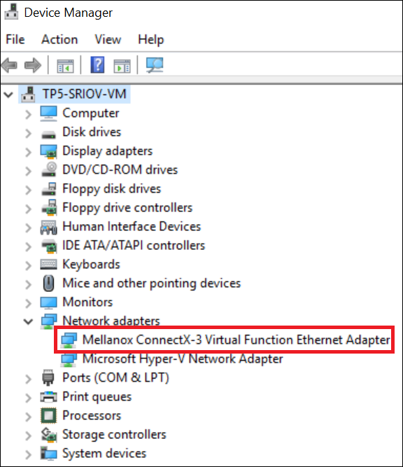

<properties 
   pageTitle="Schnellere für einen virtuellen Computer - PowerShell networking | Microsoft Azure"
   description="Informationen Sie zum Beschleunigen Networking für eine Azure-virtuellen Computern mithilfe der PowerShell zu konfigurieren."
   services="virtual-network"
   documentationCenter="na"
   authors="jimdial"
   manager="carmonm"
   editor=""
   tags="azure-resource-manager"
/>
<tags 
   ms.service="virtual-network"
   ms.devlang="na"
   ms.topic="article"
   ms.tgt_pltfrm="na"
   ms.workload="infrastructure-services"
   ms.date="09/23/2016"
   ms.author="jdial" />

# Schnellere Netzwerke für einen virtuellen Computern

> [AZURE.SELECTOR]
- [Azure-Portal](virtual-network-accelerated-networking-portal.md)
- [PowerShell](virtual-network-accelerated-networking-powershell.md)

Schnellere Netzwerke ermöglichen einzelnen Stamm e/a-Virtualisierung (SR-IOV) mit einem virtuellen Computer (virtueller Computer), die Netzwerke Leistung erheblich verbessert. Dieser Pfad leistungsfähige wird den Host von der Wartezeit, Jitter und CPU-Auslastung für die Verwendung mit den höchsten Ansprüchen Netzwerk Auslastung auf unterstützten Typen von virtuellen Computer verringern Datapath umgangen. In diesem Artikel wird erläutert, wie Azure-PowerShell verwenden, um schnellere Networking im Bereitstellungsmodell Ressourcenmanager Azure konfigurieren. Sie können auch einen virtuellen Computer mit Beschleunigung Networking mithilfe der Azure-Portal erstellen. Informationen wie, klicken Sie im Feld Azure-Portal oben in diesem Artikel.

Die folgende Abbildung zeigt die Kommunikation zwischen zwei virtuellen Computern (virtueller Computer) mit und ohne Beschleunigung Networking:

Alle Netzwerke Datenverkehr ein-und den virtuellen Computer muss ohne Netzwerke Beschleunigung der Host und dem virtuellen Switch durchlaufen werden. Virtuelle Umschaltung enthält alle Durchsetzung von Richtlinien, wie Netzwerk Sicherheitsgruppen, Access Steuerelement Listen, Isolation und andere Netzwerkdienste virtualisierten Netzwerkverkehr. Weitere Informationen hierzu im Artikel [Hyper-V Netzwerk-Virtualisierung und virtuelle wechseln](https://technet.microsoft.com/library/jj945275.aspx) .

Schnellere Networking Netzwerkverkehr bei Network Netzwerkschnittstellenkarte eintrifft und klicken Sie dann auf den virtuellen Computer weitergeleitet wird. Alle Netzwerkrichtlinien, die der virtuelle Switch ohne Beschleunigung Networking gilt sind übergeben und in der Hardware angewendet. Anwenden einer Richtlinie in Hardware ermöglicht die Zuweisung an vorwärts Netzwerkverkehr direkt an den virtuellen Computer, der Host und die virtuelle Umschaltung umgehen, Beibehaltung der Richtlinie, die sie in den Host angewendet.

Die Vorteile von schnellere Networking beziehen sich nur auf dem virtuellen Computer, die es auf aktiviert ist. Die besten Ergebnisse erzielen Sie eignet sich die Aktivieren dieses Features auf mindestens zwei virtuellen Computern mit der gleichen VNet verbunden.  Bei der Kommunikation über VNets oder Verbindungslinien lokalen wirkt sich dieses Feature minimalen zu allgemeinen Wartezeit.

[AZURE.INCLUDE [virtual-network-preview](../../includes/virtual-network-preview.md)]

##Vorteile

- **Unteren Wartezeit / höhere Pakete pro Sekunde (Pps):** Entfernen der Datapath Virtuelle Umschaltung entfernt die Zeitdauer, Pakete in den Host für die Richtlinie und erhöht die Anzahl der Pakete, die innerhalb des virtuellen Computers verarbeitet werden können.
- **Verringert Jitter:** Virtuelle Umschaltung Verarbeitung hängt davon ab, den Umfang der Richtlinie, die angewendet werden muss und die Arbeitsbelastung der CPU, die die Verarbeitung durchführt. Verschiebung der Durchsetzung der Hardware entfernt die Streuung durch die Bereitstellung von Pakete direkt an den virtuellen Computer, den Host virtueller Computer Kommunikation und alle Software Interrupts und Kontext Schalter entfernen.
- **Geringere CPU-Auslastung:** Umgehen der virtuelle Umschaltung im Host führt zu weniger CPU-Auslastung für die Verarbeitung von Netzwerkverkehr.

## Einschränkungen

Die folgenden Einschränkungen vorhanden sein, wenn Sie diese Funktion zu verwenden:
 
- **Netzwerk-Benutzeroberfläche Erstellung:** Schnellere Netzwerke kann nur für einen neuen Netzwerkadapter aktiviert werden.  Es kann nicht auf eine vorhandene Netzwerkschnittstelle aktiviert sein.
- **Erstellung virtueller Computer:** Eine Netzwerk-Oberfläche mit schnellere Netzwerke aktiviert kann nur in einen virtuellen angefügt werden, wenn der virtuellen Computer erstellt wird. Die Benutzeroberfläche Netzwerk kann zu einer vorhandenen virtuellen Computer angefügt werden.
- **Regionen:** In den "Westen" zentralen USA und "Westen" Europa Azure Regionen nur angeboten. Festlegen der Regionen wird in der Zukunft erweitert werden.
- **Unterstützte Betriebssystem:** Microsoft Windows Server 2012 R2 und WindowsServer 2016 Technical Preview 5. Linux und Windows Server 2012-Unterstützung wird bald hinzugefügt werden.
- **Virtueller Speicher:** Standard_D15_v2 und Standard_DS15_v2 sind der einzige virtueller Computer Instanzengrößen unterstützt. Weitere Informationen finden Sie unter [Windows virtueller Computer Größen](../virtual-machines/virtual-machines-windows-sizes.md) Artikel. Festlegen der unterstützten virtuellen Computer Instanzengrößen wird in der Zukunft erweitert werden.

Änderungen an diesen Einschränkungen werden über die Seite [Azure Virtual Networking Updates](https://azure.microsoft.com/updates/accelerated-networking-in-preview) vorgestellt.

## Erstellen Sie ein Windows-virtueller Computer mit schnellere Netzwerke

1. Öffnen Sie ein Eingabeaufforderungsfenster PowerShell, und führen Sie die verbleibenden Schritte in diesem Abschnitt innerhalb einer einzelnen PowerShell-Sitzung. Wenn Sie noch keine PowerShell installiert und konfiguriert haben, führen Sie die Schritte im Artikel [zum Installieren und Konfigurieren von Azure PowerShell](../powershell-install-configure.md) .
2. Um die Vorschau zu registrieren, senden Sie eine e-Mail an [Schnellere Networking Abonnements](mailto:axnpreview@microsoft.com?subject=Request%20to%20enable%20subscription%20%3csubscription%20id%3e) mit Ihrem Abonnement-ID und vorgesehen verwenden. Führen Sie die restlichen Schritte bis nicht, nachdem Sie erhalten eine e-Mail-Nachricht, die Sie darüber informiert, dass Sie in der Vorschau zugestimmt haben.
3. Registrieren Sie die Funktion mit Ihrem Abonnement durch Eingabe der folgenden Befehle:

        Register-AzureRmProviderFeature -FeatureName AllowAcceleratedNetworkingFeature -ProviderNamespace Microsoft.Network
        Register-AzureRmResourceProvider -ProviderNamespace Microsoft.Network

4. Ersetzen Sie *Westcentralus* durch den Namen von einem anderen Speicherort unterstützt, indem Sie diese Funktion (falls gewünscht) in diesem Artikel im Abschnitt [Einschränkungen](#limitations) aufgeführt. Geben Sie den folgenden Befehl aus, um eine Variable für den Speicherort festzulegen:

        $locName = "westcentralus"

5. Ersetzen Sie *RG1* durch einen Namen für die Ressourcengruppe aus, die die neue Schnittstelle enthalten und geben Sie die folgenden Befehle, um sie zu erstellen:

        $rgName = "RG1"
        New-AzureRmResourceGroup -Name $rgName -Location $locName

6. Ändern Sie *VM1-NIC1* auf was soll der Netzwerkschnittstelle den Namen, und geben Sie dann den folgenden Befehl aus:

        $NICName = "VM1-NIC1"

7. Die Schnittstelle muss mit einem Subnetz in einem vorhandenen Azure virtuelle Netzwerk (VNet) in derselben Position und [Abonnement](../azure-glossary-cloud-terminology.md#subscription) als Netzwerkschnittstelle verbunden sein. Weitere Informationen zu VNets nach dem [virtuellen Netzwerk](virtual-networks-overview.md) Artikel lesen, wenn Sie nicht mit ihnen vertraut sind. Um eine VNet zu erstellen, führen Sie die Schritte im Artikel [Erstellen eines VNet](virtual-networks-create-vnet-arm-ps.md) aus. Ändern Sie die "Werte" die folgenden $Variables auf den Namen der VNet und Subnetz die Schnittstelle um eine Verbindung herstellen möchten.

        $VNetName   = "VNet1"
        $SubnetName = "Subnet1"

    Wenn Sie den Namen einer vorhandenen VNet in den Speicherort nicht, die Sie in Schritt 3 ausgewählt haben kennen, geben Sie die folgenden Befehle:
        
        $VirtualNetworks = Get-AzureRmVirtualNetwork
        $VirtualNetworks | Where-Object {$_.Location -eq $locName} | Format-Table Name, Location
        
    Wenn die zurückgegebene Liste leer ist, müssen Sie eine VNet Speicherort erstellen. Führen Sie zum Erstellen einer VNet die Schritte im Artikel [Erstellen eines virtuellen Netzwerks](virtual-networks-create-vnet-arm-ps.md) ein.

    Wenn Sie den Namen der Subnetze innerhalb der VNet erhalten möchten, geben Sie die folgenden Befehle, und Ersetzen von *Subnet1* über mit dem Namen der ein Subnetz:
        
        $VNet = Get-AzureRmVirtualNetwork -Name $VNetName -ResourceGroupName $rgName
        $VNet.Subnets | Format-Table Name, AddressPrefix

8. Geben Sie die folgenden Befehle zum Abrufen der VNet und Subnetz und Variablen zuweisen.

        $VNet = Get-AzureRmVirtualNetwork -Name $VNetName -ResourceGroupName $rgName
        $Subnet = $VNet.Subnets | Where-Object { $_.Name -eq $SubnetName }

9. Benennen Sie eine vorhandene öffentliche IP-Adressenressource, die mit der Schnittstelle verknüpft werden können, damit Sie über das Internet darauf zugreifen können. Wenn Sie nicht über das Internet den virtuellen Computer mit der Schnittstelle zugreifen möchten, können Sie diesen Schritt überspringen. Ohne eine öffentliche IP-Adresse müssen Sie sich mit dem virtuellen Computer aus einem anderen virtuellen Computer mit der gleichen VNet verbunden verbinden. 

    Ändern Sie auf den Namen einer vorhandenen öffentlichen IP-Adresse Ressource, die an der Position vorhanden ist, erstellen Sie in die Schnittstelle und ist, die nicht mit einem anderen Netzwerk-Benutzeroberfläche aktuell zugeordneten, *PIP1* . Falls erforderlich, ändern Sie $rgName auf den Namen der Ressourcengruppe die öffentliche IP-Adressressource in vorhanden ist, und geben Sie den folgenden Befehl aus:

        $PIP1 = Get-AzureRmPublicIPAddress -Name "PIP1" -ResourceGroupName $rgName

    Wenn Sie den Namen einer vorhandenen öffentlichen IP-Adresse Ressource nicht kennen, geben Sie die folgenden Befehle:

        $PublicIPAddresses = Get-AzureRmPublicIPAddress
        $PublicIPAddresses | Where-Object { $_.Location -eq $locName } |Format-Table Name, Location, IPAddress, IpConfiguration

    Wenn die Spalte **IPKonfigurationsdateiSPI** in der Ausgabe zurückgegeben keinen Wert aufweist, wird die öffentliche IP-Adressen-Ressource ist nicht mit einer vorhandenen Netzwerkschnittstelle verknüpft und kann verwendet werden. Wenn die Liste leer ist oder es keine verfügbaren öffentlichen IP-Adressressourcen sind, können Sie eine mithilfe des Befehls New-AzureRmPublicIPAddress erstellen.

    >[AZURE.NOTE] Öffentliche IP-Adressen verfügen über eine geringe Gebühr. Weitere Informationen zu Preise durch die [IP-Adresse Preise](https://azure.microsoft.com/pricing/details/ip-addresses) Seite lesen.
10. Wenn Sie nicht die Benutzeroberfläche eine öffentliche IP-Adressenressource hinzugefügt haben, entfernen Sie *- Öffentl.IP $PIP1* am Ende des Befehls, der folgt. Erstellen der Schnittstelle mit schnellere Netzwerke durch Eingeben von den folgenden Befehl aus:

        $nic = New-AzureRmNetworkInterface -Location $locName -Name $NICName -ResourceGroupName $rgName -Subnet $Subnet -EnableAcceleratedNetworking -PublicIpAddress $PIP1 

11. Zuweisen eines virtuellen Computers mit der Schnittstelle, wenn es sich bei den virtuellen Computer anhand der Anweisungen in Schritt 3 und 6 von im Artikel [Erstellen eines virtuellen Computers](../virtual-machines/virtual-machines-windows-ps-create.md) zu erstellen. Ersetzen Sie in Schritt 6 Basis 2 zurück *Standard_A1* mit einer der Größen virtueller Computer in diesem Artikel im Abschnitt [Einschränkungen](#limitations) aufgeführt.

    >[AZURE.NOTE] Wenn Sie den *Namen* der $locName, $rgName oder $nic Variablen in diesem Artikel geändert, tritt ein Fehler Schritt 6 Erstellen eines Artikels virtueller Computer. Sie können jedoch die *Werte* der Variablen ändern.

12. Nachdem Sie der virtuellen Computer erstellt wurde, der [schnellere Networking-Treiber](https://gallery.technet.microsoft.com/Azure-Accelerated-471b5d84)herunterladen, Verbinden mit dem virtuellen Computer, und führen Sie das Treiberinstallationsprogramm innerhalb des virtuellen Computers.

13. Mit der rechten Maustaste in der Windows-Schaltfläche, und klicken Sie auf **Geräte-Manager**. Stellen Sie sicher, dass der **Mellanox ConnectX-3 virtuelle Funktion Ethernet-Netzwerkadapter** unter die Option **Netzwerk** , sobald erweitert angezeigt wird, wie in der folgenden Abbildung gezeigt:

    