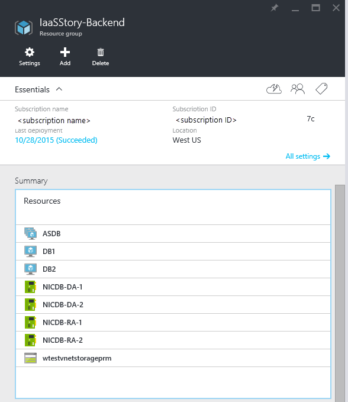

<properties
   pageTitle="Bereitstellen Multi NIC virtuellen Computern mithilfe einer Vorlage in Ressourcenmanager | Microsoft Azure"
   description="Weitere Informationen zum Bereitstellen von Multi NIC virtuellen Computern mithilfe einer Vorlage in Ressourcenmanager"
   services="virtual-network"
   documentationCenter="na"
   authors="jimdial"
   manager="carmonm"
   editor=""
   tags="azure-resource-manager"
/>
<tags  
   ms.service="virtual-network"
   ms.devlang="na"
   ms.topic="article"
   ms.tgt_pltfrm="na"
   ms.workload="infrastructure-services"
   ms.date="02/02/2016"
   ms.author="jdial" />

# Bereitstellen von Multi NIC virtuellen Computern mithilfe einer Vorlage

[AZURE.INCLUDE [virtual-network-deploy-multinic-arm-selectors-include.md](../../includes/virtual-network-deploy-multinic-arm-selectors-include.md)]

[AZURE.INCLUDE [virtual-network-deploy-multinic-intro-include.md](../../includes/virtual-network-deploy-multinic-intro-include.md)]

[AZURE.INCLUDE [azure-arm-classic-important-include](../../includes/learn-about-deployment-models-rm-include.md)][klassische Bereitstellungsmodell](virtual-network-deploy-multinic-classic-ps.md).

[AZURE.INCLUDE [virtual-network-deploy-multinic-scenario-include.md](../../includes/virtual-network-deploy-multinic-scenario-include.md)]

Da zu diesem Zeitpunkt Sie virtueller Computer mit einen einzelnen Netzwerkadapter und virtueller Computer mit mehreren NIcs in derselben Ressourcengruppe haben können, können Sie die Back-End-Server in einer Ressourcengruppe und alle anderen Komponenten in einer anderen Sicherheitsgruppe implementieren. Verwenden Sie die folgenden Schritte aus eine Ressourcengruppe mit dem Namen *IaaSStory* für das Hauptfenster Ressourcengruppe und *IaaSStory-Back-End* für die Back-End-Server aus.

## Erforderliche Komponenten

Bevor Sie die Back-End-Server bereitstellen können, müssen Sie die Hauptfenster Ressourcengruppe mit den notwendigen Ressourcen für dieses Szenario bereitstellen. Um diese Ressourcen bereitstellen zu können, führen Sie die folgenden Schritte aus.

1. Navigieren Sie zu [der Vorlagenseite](https://github.com/Azure/azure-quickstart-templates/tree/master/IaaS-Story/11-MultiNIC).
2. Klicken Sie in der Vorlagenseite rechts vom **übergeordneten Ressourcengruppe**auf **Bereitstellen in Azure**.
3. Bei Bedarf ändern Sie die gewünschten Parameterwerte, und führen Sie die Schritte im Portal Azure Vorschau die Ressourcengruppe bereitstellen.

> [AZURE.IMPORTANT] Stellen Sie sicher, dass Ihre Speicher Kontonamen eindeutig sind. Sie können keine doppelten Speicher Kontonamen Azure haben.

## Verstehen der Vorlage für Bereitstellung

Bevor Sie die Vorlage zur Verfügung gestellt mit dieser Dokumentation bereitstellen, stellen Sie sicher, dass Sie wissen, was bedeutet. Die nachstehenden Schritte geben einen guten Überblick über die Vorlage in Frage.

1. Navigieren Sie zu [der Vorlagenseite](https://github.com/Azure/azure-quickstart-templates/tree/master/IaaS-Story/11-MultiNIC).
2. Klicken Sie auf **azuredeploy.json** , um die Vorlagendatei zu öffnen.
3. Beachten Sie den unten aufgeführten *OsType* Parameter ein. Für diesen Parameter wird verwendet, um welche virtuellen Computer Bild für den Datenbankserver verwenden auswählen, zusammen mit mehreren Betriebssystem Zusammenhang Einstellungen.

        "osType": {
          "type": "string",
          "defaultValue": "Windows",
          "allowedValues": [
            "Windows",
            "Ubuntu"
          ],
          "metadata": {
            "description": "Type of OS to use for VMs: Windows or Ubuntu."
          }
        },

4. Führen Sie einen Bildlauf nach unten zu der Liste der Variablen, und überprüfen Sie die Definition für die unten aufgeführten Variablen **DbVMSetting** . Es erhält eine der Arrayelemente in der Variablen **DbVMSettings** enthalten. Wenn Sie mit der Software Development Terminologie vertraut sind, können Sie die Variable **DbVMSettings** als Hashtable oder einer Dictionay anzeigen.

        "dbVMSetting": "[variables('dbVMSettings')[parameters('osType')]]"

5. Nehmen Sie an, dass Sie sich entscheiden, die Windows-virtuellen Computern ausgeführt SQL in die Back-End bereitstellen. Dann wäre der Wert für **OsType** *Windows*, und die Variable **DbVMSetting** enthält das Element aufgeführten, das den ersten Wert in der Variablen **DbVMSettings** darstellt.

          "Windows": {
            "vmSize": "Standard_DS3",
            "publisher": "MicrosoftSQLServer",
            "offer": "SQL2014SP1-WS2012R2",
            "sku": "Standard",
            "version": "latest",
            "vmName": "DB",
            "osdisk": "osdiskdb",
            "datadisk": "datadiskdb",
            "nicName": "NICDB",
            "ipAddress": "192.168.2.",
            "extensionDeployment": "",
            "avsetName": "ASDB",
            "remotePort": 3389,
            "dbPort": 1433
          },

6. Beachten Sie, dass die **VmSize** den Wert *Standard_DS3*enthält. Nur bestimmte virtueller Computer Größen für die Verwendung von mehreren NICs ermöglichen. Sie können überprüfen, welche virtuellen Computer Größen Multi NIC aktiviert, indem Sie die [Multi NIC Übersicht](virtual-networks-multiple-nics.md)sind.
7. Beachten Sie das erste Element, und führen Sie einen Bildlauf nach unten bis zum **Ressourcen** . Ein Speicherkonto beschrieben. Dieses Speicherkonto wird zum Verwalten von jeder Datenbank virtuellen Computer verwendeten Festplatten mit den Daten verwendet werden. In diesem Szenario weist jede Datenbank virtueller Computer eine OS Datenträger in normalen Storage gespeichert und zwei Daten Datenträger im Speicher SSD (Premium) gespeichert.

        {
          "apiVersion": "2015-05-01-preview",
          "type": "Microsoft.Storage/storageAccounts",
          "name": "[parameters('prmStorageName')]",
          "location": "[variables('location')]",
          "tags": {
            "displayName": "Storage Account - Premium"
          },
          "properties": {
            "accountType": "[parameters('prmStorageType')]"
          }
        },

8. Ausführen eines Bildlaufs nach unten bis zum nächsten Ressource, wie unten aufgelistet. Diese Ressource stellt die NIC für den Datenbankzugriff in jeder Datenbank virtueller Computer verwendet. Beachten Sie die Verwendung der Funktion **Kopieren** in dieser Ressource an. Die Vorlage können Sie beliebig viele virtuellen Computern wie auf Grundlage des Parameters **DbCount gewünscht** , bereitstellen. Daher müssen Sie den gleichen Betrag der NICs für den Datenbankzugriff, eine für jede virtuellen Computer zu erstellen.

        {
          "apiVersion": "2015-06-15",
          "type": "Microsoft.Network/networkInterfaces",
          "name": "[concat(variables('dbVMSetting').nicName,'-DA-', copyindex(1))]",
          "location": "[variables('location')]",
          "tags": {
            "displayName": "NetworkInterfaces - DB DA"
          },
          "copy": {
            "name": "dbniccount",
            "count": "[parameters('dbCount')]"
          },
          "properties": {
            "ipConfigurations": [
              {
                "name": "ipconfig1",
                "properties": {
                  "privateIPAllocationMethod": "Static",
                  "privateIPAddress": "[concat(variables('dbVMSetting').ipAddress,copyindex(4))]",
                  "subnet": {
                    "id": "[variables('backEndSubnetRef')]"
                  }
                }
              }
            ]
          }
        },

9. Ausführen eines Bildlaufs nach unten bis zum nächsten Ressource, wie unten aufgelistet. Diese Ressource stellt die NIC für die Verwaltung in jeder Datenbank virtueller Computer verwendet. Erneut, benötigen Sie eine dieser NICs für jede Datenbank virtueller Computer. Beachten Sie das **NetworkSecurityGroup** -Element, das Verknüpfen einer NSG, die Zugriff auf RDP/SSH auf nur diesen Netzwerkadapter ermöglicht.

        {
          "apiVersion": "2015-06-15",
          "type": "Microsoft.Network/networkInterfaces",
          "name": "[concat(variables('dbVMSetting').nicName, '-RA-',copyindex(1))]",
          "location": "[variables('location')]",
          "tags": {
            "displayName": "NetworkInterfaces - DB RA"
          },
          "copy": {
            "name": "dbniccount",
            "count": "[parameters('dbCount')]"
          },
          "properties": {
            "ipConfigurations": [
              {
                "name": "ipconfig1",
                "properties": {
                  "networkSecurityGroup": {
                    "id": "[resourceId('Microsoft.Network/networkSecurityGroups', parameters('remoteAccessNSGName'))]"
                  },
                  "privateIPAllocationMethod": "Static",
                  "privateIPAddress": "[concat(variables('dbVMSetting').ipAddress,copyindex(54))]",
                  "subnet": {
                    "id": "[variables('backEndSubnetRef')]"
                  }
                }
              }
            ]
          }
        },

10. Ausführen eines Bildlaufs nach unten bis zum nächsten Ressource, wie unten aufgelistet. Diese Ressource stellt eine Verfügbarkeit festlegen, indem Sie alle Datenbank-virtuellen Computern bereitgestellt werden müssen. Auf diese Weise sichergestellt ist, ist, dass es immer eine virtueller Computer ausgeführt werden, während die Wartung festlegen.

        {
          "apiVersion": "2015-06-15",
          "type": "Microsoft.Compute/availabilitySets",
          "name": "[variables('dbVMSetting').avsetName]",
          "location": "[variables('location')]",
          "tags": {
            "displayName": "AvailabilitySet - DB"
          }
        },

11. Führen Sie einen Bildlauf nach unten bis zum nächsten Ressource. Diese Ressource steht für die Datenbank virtuellen Computern, wie in der ersten aufgeführte Zeilen angezeigt. Beachten Sie die Verwendung der Funktion **Kopieren** erneut, um sicherzustellen, dass mehrere virtuelle Computer basierend auf den Parameter **DbCount** erstellt werden. Beachten Sie auch die Sammlung **DependsOn** ein. Es werden zwei NICs erforderlich sind, um die erstellt werden, bevor Sie der virtuellen Computer bereitgestellt wird, sowie die Menge der Verfügbarkeit und Speicher-Konto wird aufgelistet.

          "apiVersion": "2015-06-15",
          "type": "Microsoft.Compute/virtualMachines",
          "name": "[concat(variables('dbVMSetting').vmName,copyindex(1))]",
          "location": "[variables('location')]",
          "dependsOn": [
            "[concat('Microsoft.Network/networkInterfaces/', variables('dbVMSetting').nicName,'-DA-', copyindex(1))]",
            "[concat('Microsoft.Network/networkInterfaces/', variables('dbVMSetting').nicName,'-RA-', copyindex(1))]",
            "[concat('Microsoft.Compute/availabilitySets/', variables('dbVMSetting').avsetName)]",
            "[concat('Microsoft.Storage/storageAccounts/', parameters('prmStorageName'))]"
          ],
          "tags": {
            "displayName": "VMs - DB"
          },
          "copy": {
            "name": "dbvmcount",
            "count": "[parameters('dbCount')]"
          },

12. Führen Sie einen Bildlauf nach unten in der Ressource virtueller Computer auf das Element **NetworkProfile** wie nachstehend. Beachten Sie, dass es gibt zwei NICs als Verweis für jeden virtuellen Computer. Wenn Sie mehrere Netzwerkkarten für einen virtuellen Computer erstellen, müssen Sie die **primäre** Eigenschaft eine der NICs auf *true*und den Rest auf *false*festlegen.

        "networkProfile": {
          "networkInterfaces": [
            {
              "id": "[resourceId('Microsoft.Network/networkInterfaces', concat(variables('dbVMSetting').nicName,'-DA-',copyindex(1)))]",
              "properties": { "primary": true }
            },
            {
              "id": "[resourceId('Microsoft.Network/networkInterfaces', concat(variables('dbVMSetting').nicName,'-RA-',copyindex(1)))]",
              "properties": { "primary": false }
            }
          ]
        }
      }

## Klicken Sie auf Bereitstellen über bereitstellen Sie die Cloud-Vorlage

> [AZURE.IMPORTANT] Stellen Sie sicher, dass Sie die [erforderlichen Komponenten](#Pre-requisites) Schritte ausführen, bevor Sie wie folgt.

Die Beispielvorlage verfügbar im öffentlichen Repository verwendet eine Parameterdatei, die mit der standardmäßigen Werte verwendet, um die oben beschriebenen Szenario generieren. Zum Bereitstellen dieser Vorlage, klicken Sie auf bereitstellen, führen Sie [diesen Link](https://github.com/Azure/azure-quickstart-templates/tree/master/IaaS-Story/11-MultiNIC)mit rechts neben die **Back-End-Ressourcen gruppieren (siehe Dokumentation)** klicken Sie auf **Bereitstellen für Azure**ersetzen Sie den Parameter Standardwerte bei Bedarf, und folgen Sie den Anweisungen im Portal.

Die folgende Abbildung zeigt den Inhalt der neuen Ressourcengruppe, nach der Bereitstellung.

## Stellen Sie die Vorlage mithilfe der PowerShell bereit.

Um die Vorlage bereitzustellen, die Sie mithilfe der PowerShell heruntergeladen haben, führen Sie die folgenden Schritte aus.

[AZURE.INCLUDE [powershell-preview-include.md](../../includes/powershell-preview-include.md)]

3. Ausführen der **`New-AzureRmResourceGroup`** -Cmdlet zum Erstellen einer Ressourcengruppe mithilfe der Vorlage.

        New-AzureRmResourceGroup -Name IaaSStory-Backend -Location uswest `
            -TemplateFile 'https://raw.githubusercontent.com/Azure/azure-quickstart-templates/master/IaaS-Story/11-MultiNIC/azuredeploy.json' `
            -TemplateParameterFile 'https://raw.githubusercontent.com/Azure/azure-quickstart-templates/master/IaaS-Story/11-MultiNIC/azuredeploy.parameters.json'

    Erwartetes Ergebnis:

        ResourceGroupName : IaaSStory-Backend
        Location          : westus
        ProvisioningState : Succeeded
        Tags              :
        Permissions       :
                            Actions  NotActions
                            =======  ==========
                            *                  

        Resources         :
                            Name                 Type                                 Location
                            ===================  ===================================  ========
                            ASDB                 Microsoft.Compute/availabilitySets   westus  
                            DB1                  Microsoft.Compute/virtualMachines    westus  
                            DB2                  Microsoft.Compute/virtualMachines    westus  
                            NICDB-DA-1           Microsoft.Network/networkInterfaces  westus  
                            NICDB-DA-2           Microsoft.Network/networkInterfaces  westus  
                            NICDB-RA-1           Microsoft.Network/networkInterfaces  westus  
                            NICDB-RA-2           Microsoft.Network/networkInterfaces  westus  
                            wtestvnetstorageprm  Microsoft.Storage/storageAccounts    westus  

        ResourceId        : /subscriptions/xxxxxxxx-xxxx-xxxx-xxxx-xxxxxxxxxxxx/resourceGroups/IaaSStory-Backend

## Stellen Sie die Vorlage mithilfe der CLI Azure bereit.

Die Vorlage für die Bereitstellung mithilfe der Azure CLI führen Sie die folgenden Schritte aus.

1. Wenn Sie noch keine Erfahrung Azure CLI haben, finden Sie unter [Installieren und Konfigurieren der CLI Azure](../xplat-cli-install.md) , und folgen Sie den Anweisungen auf den Punkt, in dem Sie Ihre Azure-Konto und Ihr Abonnement auswählen.
2. Führen Sie die **`azure config mode`** Befehl Ressourcenmanager im Modus wechseln, wie unten dargestellt.

        azure config mode arm

    Hier ist die erwartete Ausgabe für den oben angegebenen Befehl aus:

        info:    New mode is arm

3. Öffnen Sie die [Parameterdatei](https://raw.githubusercontent.com/Azure/azure-quickstart-templates/master/IaaS-Story/11-MultiNIC/azuredeploy.parameters.json), und wählen Sie deren Inhalt zu einer Datei in Ihrem Computer zu speichern. In diesem Beispiel wir die Parameterdatei *parameters.json*gespeichert.

4. Ausführen der **`azure group deployment create`** -Cmdlet zum Bereitstellen von den neuen VNet mithilfe der Vorlage und Parameter-Dateien heruntergeladen und über geändert. Der Liste angezeigt, nachdem die Ausgabe wird, die Parameter verwendet erläutert.

        azure group create -n IaaSStory-Backend -l westus --template-uri https://raw.githubusercontent.com/Azure/azure-quickstart-templates/master/IaaS-Story/11-MultiNIC/azuredeploy.json -e parameters.json

    Erwartetes Ergebnis:

        info:    Executing command group create
        + Getting resource group IaaSStory-Backend
        + Creating resource group IaaSStory-Backend
        info:    Created resource group IaaSStory-Backend
        + Initializing template configurations and parameters
        + Creating a deployment
        info:    Created template deployment "azuredeploy"
        data:    Id:                  /subscriptions/xxxxxxxx-xxxx-xxxx-xxxx-xxxxxxxxxxxx/resourceGroups/IaaSStory-Backend
        data:    Name:                IaaSStory-Backend
        data:    Location:            westus
        data:    Provisioning State:  Succeeded
        data:    Tags: null
        data:
        info:    group create command OK
