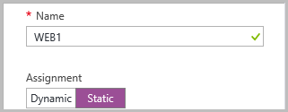
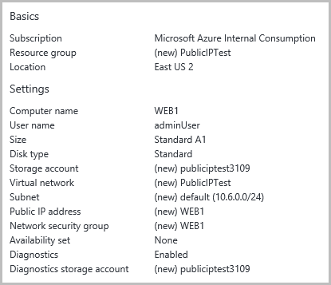

<properties 
   pageTitle="Bereitstellen ein virtuellen Computers mit einer statischen öffentliche IP-Adresse, mit dem Azure-Portal in Ressourcenmanager | Microsoft Azure"
   description="Weitere Informationen zum Bereitstellen virtueller Computer mit einer statischen öffentliche IP-Adresse, mit dem Portal Zure in Ressourcenmanager"
   services="virtual-network"
   documentationCenter="na"
   authors="jimdial"
   manager="carmonm"
   editor=""
   tags="azure-resource-manager"
/>
<tags  
   ms.service="virtual-network"
   ms.devlang="na"
   ms.topic="article"
   ms.tgt_pltfrm="na"
   ms.workload="infrastructure-services"
   ms.date="02/04/2016"
   ms.author="jdial" />

# Bereitstellen eines virtuellen Computers mit einer statischen öffentliche IP-Adresse, mit dem Azure-portal

[AZURE.INCLUDE [virtual-network-deploy-static-pip-arm-selectors-include.md](../../includes/virtual-network-deploy-static-pip-arm-selectors-include.md)]

[AZURE.INCLUDE [virtual-network-deploy-static-pip-intro-include.md](../../includes/virtual-network-deploy-static-pip-intro-include.md)]

[AZURE.INCLUDE [azure-arm-classic-important-include](../../includes/learn-about-deployment-models-rm-include.md)]Klassische Bereitstellungsmodell.

[AZURE.INCLUDE [virtual-network-deploy-static-pip-scenario-include.md](../../includes/virtual-network-deploy-static-pip-scenario-include.md)]

## Erstellen eines virtuellen Computers mit einer statischen öffentliche IP-Adresse 

Zum Erstellen eines virtuellen Computers mit einer statischen öffentlichen IP-Adresse der Azure-Portal führen Sie die folgenden Schritte aus.

1. Mithilfe eines Browsers und navigieren Sie zu der [Azure-Portal](https://portal.azure.com) und, falls notwendig, melden Sie sich mit Ihrem Azure-Konto.
2. Klicken Sie auf **neu**, klicken Sie auf der linken oberen Ecke des Portals>>**berechnen**>**Windows Server 2012 R2 Datacenter**.
3. In der Liste **Wählen Sie ein Bereitstellungsmodell** **Ressourcenmanager** wählen Sie aus, und klicken Sie auf **Erstellen**.
4. Klicken Sie in der Blade- **Grundlagen** Geben Sie die virtuellen Computer Informationen, wie unten dargestellt, und klicken Sie dann auf **OK**.

    

5. Klicken Sie auf **Standard A1** , wie unten dargestellt, und klicken Sie auf **auswählen**, in das Blade **auswählen eine Größe** .

    

6. Klicken Sie in den **Einstellungen** Blade auf **öffentliche IP-Adresse**und dann in das Blade **Erstellen öffentliche IP-Adresse** unter **Zuordnung**auf **statische** wie unten dargestellt. Ein, und klicken Sie dann auf **OK**.

    

7. Das Blade **Einstellungen** klicken Sie auf **OK**.
8. Überprüfen Sie das Blade **Zusammenfassung** aus, wie unten dargestellt, und klicken Sie dann auf **OK**.

    

9. Beachten Sie die neue Kachel in Ihr Dashboard.

    

10. Nachdem Sie der virtuellen Computer erstellt wurde, wird das Blade **Einstellungen** angezeigt wie unten dargestellt

    